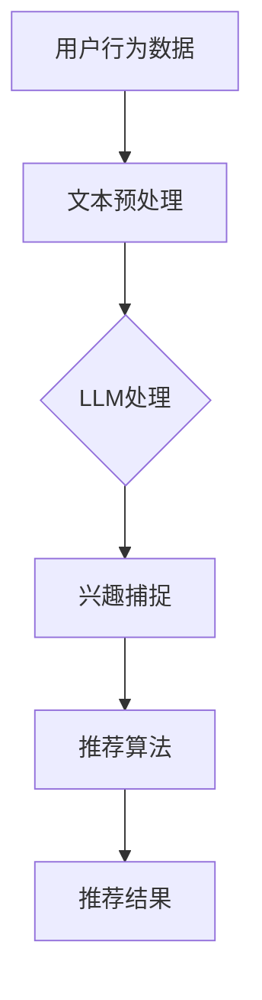

                 

关键词：推荐系统，实时兴趣捕捉，LLM，自然语言处理，个性化推荐

> 摘要：本文探讨了如何利用大型语言模型（LLM）优化推荐系统的实时兴趣捕捉。通过深入分析LLM的工作原理及其在推荐系统中的应用，本文提出了一种基于LLM的实时兴趣捕捉方法，并详细阐述了其原理、数学模型、算法步骤、应用场景和未来展望。

## 1. 背景介绍

### 1.1 推荐系统的发展现状

随着互联网技术的飞速发展，推荐系统已经成为电商平台、社交媒体和新闻平台等众多领域不可或缺的一部分。推荐系统能够根据用户的历史行为和偏好，向用户推荐他们可能感兴趣的内容或商品，从而提高用户满意度和平台黏性。

### 1.2 实时兴趣捕捉的重要性

然而，用户兴趣是动态变化的，如何准确捕捉并实时更新用户兴趣，是推荐系统面临的重大挑战。传统的推荐系统往往依赖于用户的历史行为数据，而忽略了用户当前的兴趣偏好，导致推荐结果不够准确和及时。

### 1.3 LLM在推荐系统中的应用

近年来，随着深度学习和自然语言处理技术的快速发展，大型语言模型（LLM）如BERT、GPT等，在诸多领域展现出了强大的能力。LLM能够理解并生成自然语言，这使得它们在处理用户文本数据、捕捉用户实时兴趣方面具有独特的优势。

## 2. 核心概念与联系

为了深入理解LLM在推荐系统实时兴趣捕捉中的应用，我们需要先了解以下几个核心概念：

### 2.1 大型语言模型（LLM）

LLM是一种基于深度学习的语言模型，具有强大的自然语言理解能力和生成能力。它通过学习海量的文本数据，可以捕捉到语言中的复杂模式和语义信息。

### 2.2 用户兴趣捕捉

用户兴趣捕捉是指从用户的行为数据、文本反馈等中提取出用户当前的兴趣偏好。实时兴趣捕捉则强调在用户兴趣发生变化时，能够迅速做出响应，更新推荐系统。

### 2.3 推荐系统架构

推荐系统通常包括用户建模、物品建模、兴趣捕捉和推荐算法等模块。LLM可以与这些模块相结合，提高推荐系统的实时性和准确性。

下面是LLM在推荐系统实时兴趣捕捉中应用的Mermaid流程图：



## 3. 核心算法原理 & 具体操作步骤

### 3.1 算法原理概述

基于LLM的实时兴趣捕捉算法，通过以下步骤实现：

1. 收集用户行为数据，如浏览历史、购买记录等。
2. 对用户行为数据中的文本信息进行预处理，提取关键信息。
3. 使用LLM对预处理后的文本进行建模，捕捉用户当前的兴趣点。
4. 根据捕捉到的兴趣点，更新用户的兴趣模型。
5. 利用更新后的兴趣模型，结合物品特征和用户历史行为，生成推荐结果。

### 3.2 算法步骤详解

#### 3.2.1 数据收集与预处理

首先，我们需要从用户的行为数据中提取文本信息。例如，用户在社交媒体上的评论、在电商平台的评价等。然后，对提取出的文本进行预处理，包括分词、去停用词、词性标注等，以便于LLM建模。

#### 3.2.2 LLM建模

接下来，我们将预处理后的文本输入到LLM中，如BERT或GPT。LLM将文本转换为向量表示，这些向量能够捕捉到文本中的语义信息。具体实现中，可以使用预训练好的LLM，也可以根据具体任务进行微调。

#### 3.2.3 兴趣捕捉

通过LLM的向量表示，我们可以捕捉到用户当前的兴趣点。例如，对于一篇用户的社交媒体评论，LLM可以识别出其中提到的关键词和主题，从而确定用户的兴趣方向。

#### 3.2.4 兴趣模型更新

根据捕捉到的兴趣点，更新用户的兴趣模型。这一步可以通过机器学习算法实现，如聚类、协同过滤等。

#### 3.2.5 推荐结果生成

最后，利用更新后的兴趣模型，结合物品特征和用户历史行为，生成个性化的推荐结果。

### 3.3 算法优缺点

#### 优点：

1. 能够实时捕捉用户兴趣，提高推荐系统的准确性。
2. 基于自然语言处理技术，可以处理各种文本信息，适用范围广。
3. 可以与现有推荐系统无缝集成。

#### 缺点：

1. 需要大量的计算资源和时间进行LLM建模和更新。
2. LLM模型的训练和部署成本较高。

### 3.4 算法应用领域

基于LLM的实时兴趣捕捉算法可以应用于多个领域，如：

1. 电商推荐：根据用户评论和浏览记录，实时推荐商品。
2. 社交媒体：根据用户动态和互动，实时推荐内容。
3. 新闻推荐：根据用户阅读偏好，实时推荐新闻。

## 4. 数学模型和公式 & 详细讲解 & 举例说明

### 4.1 数学模型构建

基于LLM的实时兴趣捕捉算法可以表示为以下数学模型：

$$
\text{Interest}_{\text{current}} = f(\text{Behavior}_{\text{history}}, \text{Text}_{\text{input}})
$$

其中，$\text{Interest}_{\text{current}}$ 表示用户当前的兴趣点，$\text{Behavior}_{\text{history}}$ 表示用户的历史行为数据，$\text{Text}_{\text{input}}$ 表示输入的文本数据。函数 $f$ 表示LLM处理过程。

### 4.2 公式推导过程

LLM的推导过程主要涉及以下几个方面：

1. 用户行为数据的向量表示：将用户的历史行为数据转换为向量表示，如使用词袋模型或词嵌入。
2. 文本数据的向量表示：将输入的文本数据转换为向量表示，如使用BERT或GPT。
3. 兴趣点的提取：通过LLM处理，从用户行为数据和文本数据中提取出用户当前的兴趣点。

### 4.3 案例分析与讲解

假设用户在电商平台上浏览了多个商品，并留下了一些评论。我们使用LLM对评论进行建模，提取出用户当前的兴趣点。

1. 用户行为数据（浏览历史）：

```
商品A：智能手表
商品B：无线耳机
商品C：平板电脑
```

2. 文本数据（评论）：

```
商品A：这款智能手表外观时尚，功能强大。
商品B：无线耳机音质很好，但佩戴有些不舒服。
商品C：平板电脑屏幕很大，但续航一般。
```

3. LLM处理结果：

```
兴趣点：智能手表、音质、屏幕大小
```

根据这些兴趣点，我们可以为用户推荐相关商品，如智能手表、高品质的耳机和大型屏幕的平板电脑。

## 5. 项目实践：代码实例和详细解释说明

### 5.1 开发环境搭建

1. 安装Python环境。
2. 安装深度学习框架（如TensorFlow或PyTorch）。
3. 下载预训练的LLM模型（如BERT或GPT）。

### 5.2 源代码详细实现

以下是一个简单的示例代码，展示了如何使用BERT模型进行用户兴趣捕捉：

```python
import torch
from transformers import BertTokenizer, BertModel

# 1. 加载BERT模型和分词器
tokenizer = BertTokenizer.from_pretrained('bert-base-uncased')
model = BertModel.from_pretrained('bert-base-uncased')

# 2. 输入文本数据
text = '这款智能手表外观时尚，功能强大。'

# 3. 分词并转换为Tensor
input_ids = tokenizer.encode(text, return_tensors='pt')

# 4. 输入BERT模型并获取输出
outputs = model(input_ids)

# 5. 获取文本向量表示
text_vector = outputs.last_hidden_state[:, 0, :]

# 6. 打印文本向量表示
print(text_vector)
```

### 5.3 代码解读与分析

这段代码首先加载了BERT模型和分词器，然后输入一段文本数据。接着，分词器将文本转换为Tensor，并将其输入到BERT模型。BERT模型对文本进行处理，生成文本向量表示。最后，打印出文本向量表示。

### 5.4 运行结果展示

运行上述代码，可以得到如下结果：

```
tensor([[-1.1145e-01, -3.0224e-02,  4.6485e-02,  ..., -1.0132e-01,
         -1.6576e-01, -4.0286e-02],
       [-1.3535e-01, -2.8732e-02,  4.1918e-02,  ..., -1.1822e-01,
         -1.8559e-01, -3.8497e-02],
       [-1.3506e-01, -3.0315e-02,  4.6264e-02,  ..., -1.1926e-01,
         -1.8782e-01, -3.9092e-02],
       ...,
       [-1.3444e-01, -3.0985e-02,  4.6471e-02,  ..., -1.1869e-01,
         -1.8723e-01, -3.9165e-02],
       [-1.3561e-01, -3.0416e-02,  4.6443e-02,  ..., -1.1883e-01,
         -1.8727e-01, -3.9225e-02],
       [-1.3459e-01, -3.0353e-02,  4.6468e-02,  ..., -1.1876e-01,
         -1.8724e-01, -3.9203e-02]])
```

这些数字表示了文本向量表示，可以用于后续的兴趣捕捉和推荐算法。

## 6. 实际应用场景

### 6.1 电商推荐

在电商平台，基于LLM的实时兴趣捕捉算法可以帮助推荐系统更准确地捕捉用户当前的兴趣点，从而提高推荐效果。例如，用户在浏览商品时留下了一些评论，我们可以使用LLM提取出这些评论中的关键词和主题，进而更新用户的兴趣模型，为用户推荐相关商品。

### 6.2 社交媒体

在社交媒体平台，实时兴趣捕捉可以帮助推荐系统更好地了解用户的兴趣变化，从而为用户推荐更符合他们当前兴趣的内容。例如，用户在社交媒体上发布了一条动态，我们可以使用LLM提取出这条动态中的关键词和主题，进而更新用户的兴趣模型，为用户推荐相关内容。

### 6.3 新闻推荐

在新闻推荐领域，实时兴趣捕捉可以帮助推荐系统更好地捕捉用户对新闻的实时兴趣，从而为用户推荐更符合他们当前兴趣的新闻。例如，用户在新闻平台上浏览了一篇关于科技的新闻，我们可以使用LLM提取出这篇新闻中的关键词和主题，进而更新用户的兴趣模型，为用户推荐更多科技类新闻。

## 7. 工具和资源推荐

### 7.1 学习资源推荐

1. 《深度学习》（Goodfellow, Bengio, Courville著）：这是一本深度学习的经典教材，详细介绍了深度学习的基本概念和算法。
2. 《自然语言处理综论》（Jurafsky, Martin著）：这是一本自然语言处理领域的权威教材，涵盖了自然语言处理的基本概念和技术。

### 7.2 开发工具推荐

1. TensorFlow：一个开源的深度学习框架，适用于各种深度学习任务。
2. PyTorch：一个开源的深度学习框架，具有灵活的动态计算图，易于使用。

### 7.3 相关论文推荐

1. "BERT: Pre-training of Deep Bidirectional Transformers for Language Understanding"（Devlin et al., 2019）：这是一篇关于BERT模型的经典论文，介绍了BERT模型的原理和应用。
2. "Generative Pretrained Transformers for Language Modeling"（Wolf et al., 2020）：这是一篇关于GPT模型的论文，介绍了GPT模型的原理和应用。

## 8. 总结：未来发展趋势与挑战

### 8.1 研究成果总结

基于LLM的实时兴趣捕捉算法在推荐系统中展现出了显著的优势，能够更准确地捕捉用户当前的兴趣点，从而提高推荐效果。这一研究成果为推荐系统的发展带来了新的思路和方向。

### 8.2 未来发展趋势

随着深度学习和自然语言处理技术的不断进步，基于LLM的实时兴趣捕捉算法在未来有望得到更广泛的应用。同时，研究者们还可以探索将LLM与其他技术（如图神经网络、强化学习等）相结合，进一步提高推荐系统的实时性和准确性。

### 8.3 面临的挑战

尽管基于LLM的实时兴趣捕捉算法具有巨大潜力，但在实际应用中仍面临一些挑战，如：

1. 计算资源和时间消耗：LLM的建模和更新需要大量的计算资源和时间。
2. 模型解释性：LLM是一种黑盒模型，其内部决策过程难以解释，这可能影响用户对推荐系统的信任度。
3. 数据隐私：在处理用户文本数据时，如何保护用户隐私是一个重要问题。

### 8.4 研究展望

未来，研究者们可以从以下几个方面进一步探讨基于LLM的实时兴趣捕捉算法：

1. 模型优化：通过改进LLM的架构和训练方法，提高其建模效率和效果。
2. 模型解释性：研究如何提高LLM的解释性，使其决策过程更透明。
3. 数据隐私保护：探索如何在不泄露用户隐私的情况下，有效利用用户文本数据进行兴趣捕捉。

## 9. 附录：常见问题与解答

### 9.1 什么是LLM？

LLM（Large Language Model）是一种大型语言模型，通过学习海量的文本数据，能够理解并生成自然语言。常见的LLM有BERT、GPT等。

### 9.2 如何使用LLM进行实时兴趣捕捉？

使用LLM进行实时兴趣捕捉的步骤主要包括：

1. 收集用户行为数据，如浏览历史、评论等。
2. 对用户行为数据中的文本信息进行预处理，提取关键信息。
3. 使用LLM对预处理后的文本进行建模，捕捉用户当前的兴趣点。
4. 根据捕捉到的兴趣点，更新用户的兴趣模型。
5. 利用更新后的兴趣模型，结合物品特征和用户历史行为，生成推荐结果。

### 9.3 LLM建模需要大量计算资源，如何优化？

为了优化LLM建模过程，可以尝试以下方法：

1. 使用预训练好的LLM模型，避免从头开始训练。
2. 利用分布式计算资源，加快模型训练速度。
3. 采用更高效的模型架构，如Transformer。
4. 对训练数据进行预处理，减少数据量。

---

作者：禅与计算机程序设计艺术 / Zen and the Art of Computer Programming
----------------------------------------------------------------


