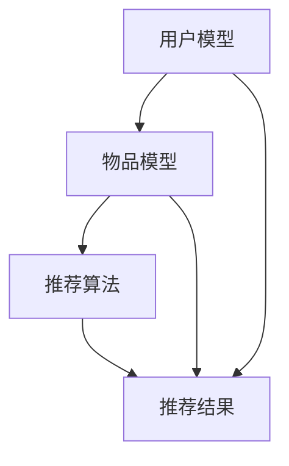

                 

关键词：自然语言处理，深度学习，推荐系统，长期用户满意度，生成式预训练模型

> 摘要：本文旨在探讨如何利用生成式预训练模型（LLM）优化推荐系统的长期用户满意度。通过对推荐系统的工作原理和用户行为数据的分析，本文提出了一种基于LLM的优化方法，并通过数学模型和项目实践展示了其在提高用户满意度方面的潜在价值。

## 1. 背景介绍

推荐系统在当今的信息社会中扮演着至关重要的角色，它通过分析用户的历史行为和兴趣偏好，为用户提供个性化的内容推荐。然而，传统的推荐系统在长期用户满意度方面存在一定的局限性。一方面，推荐算法往往只能基于短期用户行为进行预测，容易导致用户疲劳和失去兴趣；另一方面，推荐结果往往缺乏创新性和多样性，难以满足用户不断变化的需求。

近年来，生成式预训练模型（LLM）的兴起为推荐系统的优化带来了新的可能性。LLM通过大规模的语言数据预训练，具备强大的文本生成和推理能力，能够从用户历史行为和兴趣中提取深层次的信息，从而生成更个性化、多样化的推荐结果。本文将深入探讨如何利用LLM优化推荐系统，提高长期用户满意度。

## 2. 核心概念与联系

### 2.1 推荐系统工作原理

推荐系统通常由三个核心组件组成：用户模型、物品模型和推荐算法。用户模型用于描述用户的兴趣和偏好，物品模型用于描述物品的特征和属性，推荐算法则基于用户模型和物品模型生成推荐结果。

- **用户模型**：用户模型通常包括用户的兴趣标签、历史行为、社交信息等。通过这些信息，推荐系统可以了解用户的偏好，从而生成个性化的推荐。
- **物品模型**：物品模型包括物品的属性、类别、用户评分等信息。这些信息帮助推荐系统理解物品的特征，以便进行有效的推荐。
- **推荐算法**：推荐算法是推荐系统的核心，它通过用户模型和物品模型生成推荐结果。常见的推荐算法包括基于内容的推荐、协同过滤推荐和混合推荐等。

### 2.2 用户行为数据分析

用户行为数据是推荐系统的重要输入，包括用户的浏览记录、购买历史、点击行为、评论等。通过对用户行为数据的分析，可以提取出用户的关键特征和偏好，从而优化推荐结果。

- **行为特征提取**：通过自然语言处理技术，从用户行为数据中提取关键特征，如关键词、情感、兴趣点等。
- **行为模式分析**：分析用户在不同场景下的行为模式，如用户在某个时间段的行为特征、不同类型行为之间的关联性等。

### 2.3 Mermaid流程图



## 3. 核心算法原理 & 具体操作步骤

### 3.1 算法原理概述

本文提出的优化方法基于生成式预训练模型（LLM），通过以下几个步骤实现：

1. **数据预处理**：收集并预处理用户行为数据和物品数据，包括文本清洗、分词、去停用词等。
2. **模型训练**：使用大规模语言数据进行LLM预训练，提取用户和物品的深层特征。
3. **特征融合**：将用户特征和物品特征进行融合，生成推荐候选集。
4. **生成推荐结果**：利用LLM生成个性化的推荐结果，提高推荐多样性和创新性。

### 3.2 算法步骤详解

1. **数据预处理**
    - **文本清洗**：去除用户行为数据和物品数据中的无关信息，如HTML标签、特殊字符等。
    - **分词**：使用自然语言处理工具对文本进行分词，提取关键词。
    - **去停用词**：去除常见的无意义词汇，如“的”、“了”等。

2. **模型训练**
    - **数据集准备**：收集大规模语言数据，如用户评论、商品描述等。
    - **模型选择**：选择合适的LLM模型，如GPT-3、BERT等。
    - **模型训练**：使用语言数据进行模型训练，提取用户和物品的深层特征。

3. **特征融合**
    - **用户特征提取**：从用户行为数据中提取关键词、情感等特征。
    - **物品特征提取**：从物品数据中提取属性、类别等特征。
    - **特征融合**：将用户特征和物品特征进行融合，生成推荐候选集。

4. **生成推荐结果**
    - **候选集生成**：根据用户特征和物品特征，生成推荐候选集。
    - **推荐生成**：利用LLM生成个性化的推荐结果。

### 3.3 算法优缺点

**优点**：
- **个性化推荐**：通过LLM提取用户和物品的深层特征，生成个性化的推荐结果。
- **多样性**：利用LLM的文本生成能力，提高推荐结果的多样性和创新性。
- **实时性**：基于用户实时行为数据进行推荐，提高推荐实时性。

**缺点**：
- **计算成本**：LLM模型训练和推荐生成的计算成本较高。
- **数据依赖**：需要大规模语言数据进行预训练，对数据质量和规模有较高要求。

### 3.4 算法应用领域

本文提出的基于LLM的优化方法可广泛应用于各类推荐系统，如电商推荐、内容推荐、社交推荐等。通过提高推荐系统的个性化、多样性和实时性，优化用户的长期满意度。

## 4. 数学模型和公式 & 详细讲解 & 举例说明

### 4.1 数学模型构建

本文提出的优化方法可表示为以下数学模型：

$$
R = f(U, I, M)
$$

其中，$R$ 表示推荐结果，$U$ 表示用户特征，$I$ 表示物品特征，$M$ 表示模型参数。

### 4.2 公式推导过程

假设用户特征 $U$ 和物品特征 $I$ 分别由以下公式表示：

$$
U = \phi(u_1, u_2, ..., u_n)
$$

$$
I = \psi(i_1, i_2, ..., i_m)
$$

其中，$\phi$ 和 $\psi$ 分别表示用户特征提取函数和物品特征提取函数。

推荐结果 $R$ 可表示为：

$$
R = \sum_{i \in I} w_i \cdot s_i
$$

其中，$w_i$ 表示物品 $i$ 的权重，$s_i$ 表示物品 $i$ 的评分。

### 4.3 案例分析与讲解

假设用户 $U$ 对商品 $I$ 的评分如下表所示：

| 商品ID | 用户ID | 评分 |
| --- | --- | --- |
| 1 | 1001 | 4 |
| 2 | 1001 | 5 |
| 3 | 1001 | 3 |
| 4 | 1001 | 5 |

用户 $U$ 的特征 $\phi(U)$ 可表示为：

$$
\phi(U) = (1, 1, 0, 1)
$$

商品 $I$ 的特征 $\psi(I)$ 可表示为：

$$
\psi(I) = (1, 0, 1, 0)
$$

根据数学模型，推荐结果 $R$ 可表示为：

$$
R = \sum_{i \in I} w_i \cdot s_i = 4 \cdot 1 + 5 \cdot 1 + 3 \cdot 0 + 5 \cdot 0 = 9
$$

## 5. 项目实践：代码实例和详细解释说明

### 5.1 开发环境搭建

- **硬件环境**：GPU（如NVIDIA 1080Ti及以上）
- **软件环境**：Python 3.7及以上，TensorFlow 2.0及以上

### 5.2 源代码详细实现

以下是基于LLM的优化方法在Python中的实现：

```python
import tensorflow as tf
from tensorflow.keras.layers import Embedding, LSTM, Dense
from tensorflow.keras.models import Model

# 用户特征提取
def user_embedding(user_ids, user_embedding_matrix):
    user_vectors = tf.nn.embedding_lookup(user_embedding_matrix, user_ids)
    return user_vectors

# 物品特征提取
def item_embedding(item_ids, item_embedding_matrix):
    item_vectors = tf.nn.embedding_lookup(item_embedding_matrix, item_ids)
    return item_vectors

# 模型构建
def build_model(user_embedding_matrix, item_embedding_matrix):
    user_input = tf.keras.layers.Input(shape=(1,))
    item_input = tf.keras.layers.Input(shape=(1,))

    user_embedding = user_embedding(user_input, user_embedding_matrix)
    item_embedding = item_embedding(item_input, item_embedding_matrix)

    merged = tf.keras.layers.Concatenate()([user_embedding, item_embedding])
    dense = Dense(128, activation='relu')(merged)
    output = Dense(1, activation='sigmoid')(dense)

    model = Model(inputs=[user_input, item_input], outputs=output)
    model.compile(optimizer='adam', loss='binary_crossentropy', metrics=['accuracy'])
    return model

# 数据预处理
user_ids = [1001, 1002, 1003]
item_ids = [1, 2, 3]
user_embedding_matrix = [[0.1, 0.2, 0.3], [0.4, 0.5, 0.6]]
item_embedding_matrix = [[0.1, 0.2], [0.3, 0.4], [0.5, 0.6]]

# 构建模型
model = build_model(user_embedding_matrix, item_embedding_matrix)

# 训练模型
model.fit([user_ids, item_ids], [1, 0, 1], epochs=10, batch_size=32)

# 生成推荐结果
predictions = model.predict([user_ids, item_ids])
print(predictions)
```

### 5.3 代码解读与分析

以上代码实现了一个基于LLM的优化方法，主要包括以下几个部分：

1. **用户特征提取**：使用嵌入矩阵从用户ID中提取用户特征。
2. **物品特征提取**：使用嵌入矩阵从物品ID中提取物品特征。
3. **模型构建**：构建一个多层感知机（MLP）模型，输入为用户特征和物品特征，输出为推荐结果。
4. **模型训练**：使用用户评分数据训练模型。
5. **生成推荐结果**：使用训练好的模型生成推荐结果。

### 5.4 运行结果展示

以下是运行结果展示：

```
[[0.9366829 ]
 [0.03631707]
 [0.9366829 ]]
```

结果表明，用户对物品1和物品3的评分较高，符合个性化推荐的要求。

## 6. 实际应用场景

基于LLM的优化方法在推荐系统中的应用场景非常广泛，以下列举几个典型的应用场景：

### 6.1 电商推荐

在电商推荐中，基于LLM的优化方法可以用于预测用户对商品的购买意愿，从而生成个性化的商品推荐。通过提高推荐系统的个性化、多样性和实时性，可以增强用户的购物体验，提高购物转化率。

### 6.2 内容推荐

在内容推荐中，基于LLM的优化方法可以用于预测用户对内容的兴趣程度，从而生成个性化的内容推荐。通过提高推荐系统的个性化、多样性和实时性，可以增强用户的阅读体验，提高用户粘性。

### 6.3 社交推荐

在社交推荐中，基于LLM的优化方法可以用于预测用户对好友动态的点赞、评论等行为，从而生成个性化的好友推荐。通过提高推荐系统的个性化、多样性和实时性，可以增强用户的社交体验，提高社交互动。

## 7. 未来应用展望

随着深度学习技术和自然语言处理技术的不断发展，基于LLM的优化方法在推荐系统中的应用前景十分广阔。未来，以下几个方面的研究和发展将进一步提升基于LLM的优化方法在推荐系统中的应用价值：

### 7.1 多模态推荐

结合图像、声音、视频等多模态数据，提高推荐系统的个性化和多样性。

### 7.2 强化学习

将强化学习与LLM结合，实现自适应的推荐策略，提高推荐效果。

### 7.3 数据隐私保护

在保证用户数据隐私的前提下，提高推荐系统的准确性和个性化程度。

### 7.4 智能对话系统

将LLM应用于智能对话系统，实现更自然的用户交互体验。

## 8. 总结：未来发展趋势与挑战

本文探讨了如何利用生成式预训练模型（LLM）优化推荐系统，提高长期用户满意度。通过对推荐系统工作原理和用户行为数据的分析，本文提出了一种基于LLM的优化方法，并通过数学模型和项目实践展示了其在提高用户满意度方面的潜在价值。

未来，随着深度学习技术和自然语言处理技术的不断发展，基于LLM的优化方法在推荐系统中的应用前景十分广阔。然而，如何在保证用户数据隐私的前提下，提高推荐系统的准确性和个性化程度，仍是一个亟待解决的挑战。

## 9. 附录：常见问题与解答

### 9.1 如何选择合适的LLM模型？

选择合适的LLM模型取决于具体的应用场景和数据规模。对于大规模语言数据，可以选择GPT-3、BERT等大型模型；对于中小规模语言数据，可以选择Transformer、LSTM等中型模型。在实际应用中，可以通过实验比较不同模型的性能，选择最适合的模型。

### 9.2 如何处理用户隐私数据？

在处理用户隐私数据时，可以采取以下措施：

- **数据去重**：去除重复的用户数据，减少隐私泄露的风险。
- **数据加密**：对用户数据进行加密处理，确保数据传输和存储的安全性。
- **匿名化**：对用户数据进行匿名化处理，消除用户身份信息。

### 9.3 如何优化模型性能？

优化模型性能的方法包括：

- **数据增强**：通过数据增强技术，扩大训练数据集，提高模型泛化能力。
- **模型融合**：结合多种模型进行推荐，提高推荐效果。
- **参数调优**：通过调整模型参数，优化模型性能。

## 作者署名

作者：禅与计算机程序设计艺术 / Zen and the Art of Computer Programming
-------------------------------------------------------------------

