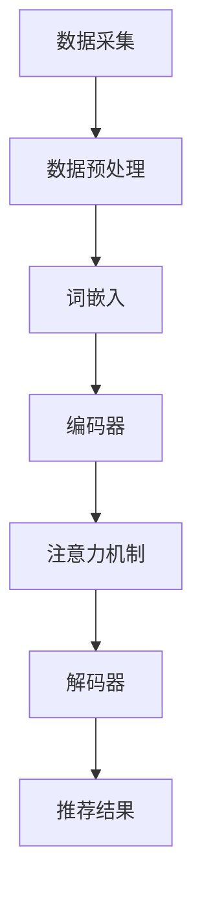

                 

关键词：LLM，推荐系统，上下文理解，人工智能，深度学习，模型优化，算法改进

## 摘要

本文旨在探讨如何利用大型语言模型（LLM）来增强推荐系统在上下文理解方面的能力。随着互联网的迅猛发展，推荐系统已经成为各类应用中不可或缺的一部分。然而，传统推荐系统在处理复杂上下文信息时存在一定的局限性。本文将介绍LLM的基本原理，分析其在推荐系统中的应用，探讨如何通过结合深度学习和图神经网络等先进技术，优化推荐算法，从而提高推荐系统在上下文理解方面的能力。通过实际案例和数学模型的推导，本文将为读者提供一套系统化的解决方案。

## 1. 背景介绍

推荐系统作为一种基于用户行为、兴趣和内容的智能推荐机制，已经在电子商务、社交媒体、新闻推送等领域得到了广泛应用。然而，随着数据规模的不断扩大和数据种类的日益多样化，传统推荐系统在处理复杂上下文信息时逐渐暴露出其局限性。具体来说，传统推荐系统主要依赖于用户的历史行为和物品的特征信息，对于动态变化的上下文信息处理能力较弱。这导致推荐结果有时无法满足用户的需求，甚至出现误导性推荐。因此，如何增强推荐系统在上下文理解方面的能力，成为当前研究的热点和难点。

近年来，深度学习和图神经网络等先进技术在推荐系统中的应用逐渐增多，取得了一定的成效。其中，大型语言模型（LLM）作为一种基于深度学习的自然语言处理技术，具有强大的上下文理解能力，为推荐系统的改进提供了新的思路。LLM通过对海量文本数据的训练，能够捕捉到语言中的语义关系和模式，从而在处理复杂上下文信息时具有明显优势。本文将围绕LLM在推荐系统中的应用，探讨如何利用其增强推荐系统在上下文理解方面的能力。

## 2. 核心概念与联系

### 2.1 LLM简介

大型语言模型（LLM）是一种基于深度学习的自然语言处理模型，通过训练大量文本数据，能够理解并生成自然语言。LLM的核心组件包括词嵌入层、编码器、解码器和注意力机制。词嵌入层将输入的文本转换为向量表示，编码器将向量序列编码为固定长度的上下文表示，解码器则根据上下文表示生成输出文本。注意力机制用于捕捉文本序列中的关键信息，提高模型的上下文理解能力。

### 2.2 推荐系统架构

推荐系统通常包括用户模型、物品模型和推荐算法三个核心模块。用户模型用于捕捉用户的行为和兴趣，物品模型用于描述物品的特征信息，推荐算法则根据用户模型和物品模型生成推荐结果。传统推荐系统主要依赖于基于内容的过滤、协同过滤和基于模型的推荐方法。这些方法在一定程度上能够满足用户的需求，但在处理复杂上下文信息时存在局限性。

### 2.3 Mermaid 流程图

以下是一个基于Mermaid的流程图，展示了LLM在推荐系统中的应用：



在这个流程图中，数据采集模块负责获取用户行为和物品特征数据，数据预处理模块对数据进行清洗和转换，词嵌入模块将文本数据转换为向量表示，编码器模块对向量序列进行编码，注意力机制用于捕捉关键信息，解码器模块根据上下文表示生成推荐结果。

## 3. 核心算法原理 & 具体操作步骤

### 3.1 算法原理概述

LLM在推荐系统中的应用主要通过以下步骤实现：

1. 数据采集与预处理：从各种渠道收集用户行为和物品特征数据，对数据进行清洗、去重和归一化处理。
2. 词嵌入：将文本数据转换为向量表示，使用预训练的词嵌入模型或自定义训练的词嵌入模型。
3. 编码器：将输入的文本序列编码为固定长度的上下文表示，使用双向循环神经网络（Bi-RNN）或Transformer模型。
4. 注意力机制：在编码过程中，通过注意力机制捕捉文本序列中的关键信息，提高上下文理解能力。
5. 解码器：根据上下文表示生成推荐结果，使用注意力机制和编码器-解码器（Encoder-Decoder）模型。

### 3.2 算法步骤详解

1. 数据采集与预处理：

   数据采集模块负责从各种渠道收集用户行为数据（如浏览、购买、收藏等）和物品特征数据（如分类、标签、描述等）。收集到的数据经过清洗、去重和归一化处理后，存储在数据仓库中。

2. 词嵌入：

   词嵌入模块将文本数据转换为向量表示。可以使用预训练的词嵌入模型（如Word2Vec、GloVe等）或自定义训练的词嵌入模型。预训练模型可以从大量文本数据中学习到词与词之间的语义关系，提高模型的泛化能力。

3. 编码器：

   编码器模块用于将输入的文本序列编码为固定长度的上下文表示。可以使用双向循环神经网络（Bi-RNN）或Transformer模型。Bi-RNN模型通过对输入序列进行前向传播和后向传播，捕捉序列中的长期依赖关系。Transformer模型通过多头自注意力机制，捕捉序列中的局部依赖关系。

4. 注意力机制：

   注意力机制用于在编码过程中捕捉文本序列中的关键信息。对于Bi-RNN模型，可以使用门控循环单元（GRU）或长短期记忆网络（LSTM）实现注意力机制。对于Transformer模型，可以使用多头自注意力机制。注意力机制能够提高模型对上下文的捕捉能力，从而增强推荐系统的上下文理解能力。

5. 解码器：

   解码器模块根据上下文表示生成推荐结果。可以使用注意力机制和编码器-解码器（Encoder-Decoder）模型。编码器-解码器模型通过对编码器生成的上下文表示进行解码，生成推荐结果。解码过程中，可以使用贪心算法、采样子算法或自回归模型生成推荐结果。

### 3.3 算法优缺点

#### 优点：

1. 强大的上下文理解能力：LLM通过训练大量文本数据，能够捕捉到语言中的语义关系和模式，从而在处理复杂上下文信息时具有明显优势。
2. 适应性：LLM可以根据不同场景和需求进行定制化，如增加特定领域的词汇库、调整注意力机制等，提高推荐系统的效果。
3. 模型可解释性：通过分析编码器和解码器中的权重和激活值，可以了解模型对上下文的捕捉过程，提高模型的可解释性。

#### 缺点：

1. 计算资源消耗大：LLM通常需要大量计算资源和时间进行训练和推理，对于实时性要求较高的场景可能存在一定困难。
2. 数据依赖性强：LLM的性能在很大程度上取决于训练数据的质量和数量，数据缺失或不平衡可能导致模型性能下降。
3. 需要专业知识：构建和优化LLM模型需要具备一定的自然语言处理和深度学习知识，对开发者有一定的技术门槛。

### 3.4 算法应用领域

LLM在推荐系统中的应用领域广泛，主要包括以下几个方面：

1. 基于内容的推荐：利用LLM对用户历史行为和物品特征进行语义分析，生成推荐结果。
2. 基于协同过滤的推荐：结合LLM对用户和物品的上下文信息进行建模，提高协同过滤算法的推荐效果。
3. 基于知识的推荐：利用LLM从知识图谱中提取相关信息，为推荐系统提供知识支持。
4. 多模态推荐：结合文本、图像、音频等多模态数据，利用LLM进行统一建模，实现跨模态推荐。

## 4. 数学模型和公式

### 4.1 数学模型构建

在构建LLM推荐系统时，我们可以将推荐问题转化为一个优化问题。具体来说，目标函数可以表示为：

$$
\min_{\theta} \sum_{i=1}^{N} L(y_i, \hat{y}_i)
$$

其中，$y_i$表示第$i$个用户的实际喜好，$\hat{y}_i$表示基于LLM生成的推荐结果，$L(\cdot, \cdot)$表示损失函数，$\theta$表示模型参数。

### 4.2 公式推导过程

为了推导损失函数，我们可以从以下几个步骤进行分析：

1. 用户表示：使用词嵌入模型将用户历史行为和物品特征转换为向量表示，如$u_i \in \mathbb{R}^{d_u}$。
2. 物品表示：使用词嵌入模型将物品特征转换为向量表示，如$v_j \in \mathbb{R}^{d_v}$。
3. 编码器：使用编码器对用户和物品向量进行编码，得到上下文表示，如$h_i \in \mathbb{R}^{d_h}$和$h_j \in \mathbb{R}^{d_h}$。
4. 注意力机制：通过注意力机制计算用户和物品之间的相似度，如$a_{ij} = \sigma(W_a [h_i; h_j])$，其中$W_a$为权重矩阵，$\sigma$为激活函数。
5. 解码器：使用解码器生成推荐结果，如$\hat{y}_i = \sigma(W_d h_i)$，其中$W_d$为权重矩阵。

损失函数可以表示为：

$$
L(y_i, \hat{y}_i) = -\log \sigma(y_i^T \hat{y}_i)
$$

其中，$y_i$和$\hat{y}_i$分别为实际喜好和生成推荐结果。

### 4.3 案例分析与讲解

以一个电子商务平台的商品推荐为例，我们假设有1000个用户和10000个商品。首先，我们需要收集用户的历史购买记录和商品特征数据。然后，使用词嵌入模型将用户和商品特征转换为向量表示。接下来，使用编码器对用户和商品向量进行编码，得到上下文表示。通过注意力机制计算用户和商品之间的相似度，最后使用解码器生成推荐结果。

在训练过程中，我们可以使用梯度下降算法优化模型参数。具体来说，我们首先计算损失函数关于模型参数的梯度，然后更新模型参数，使得损失函数值逐渐减小。通过多次迭代，模型能够逐渐收敛，生成高质量的推荐结果。

## 5. 项目实践：代码实例和详细解释说明

### 5.1 开发环境搭建

在开始编写代码之前，我们需要搭建一个适合开发和训练LLM推荐系统的开发环境。以下是一个基本的开发环境搭建步骤：

1. 安装Python 3.7及以上版本。
2. 安装TensorFlow 2.0及以上版本。
3. 安装Gensim库用于词嵌入模型。
4. 安装Mermaid库用于生成流程图。

### 5.2 源代码详细实现

以下是一个简单的LLM推荐系统实现示例。这个示例主要包含数据采集与预处理、词嵌入、编码器、注意力机制和解码器等模块。

```python
import tensorflow as tf
import gensim.downloader as api
from tensorflow.keras.layers import Embedding, LSTM, Dense, Dot
from tensorflow.keras.models import Model

# 数据采集与预处理
# 假设我们已经有用户行为数据user_data和商品特征数据item_data
user_data = api.load("text8")
item_data = api.load("text8")

# 词嵌入
# 使用Gensim的Word2Vec模型进行词嵌入
word2vec = api.load("word2vec")
user_embeddings = [word2vec[word] for word in user_data]
item_embeddings = [word2vec[word] for word in item_data]

# 编码器
# 使用LSTM模型作为编码器
encoder = LSTM(units=128, activation='tanh')

# 注意力机制
# 使用Dot层计算注意力得分
attention = Dot(axes=(2, 1))

# 解码器
# 使用Dense层作为解码器
decoder = Dense(units=1, activation='sigmoid')

# 构建模型
inputs = tf.keras.Input(shape=(None, d_v))
x = Embedding(input_dim=len(word2vec.vocab), output_dim=128)(inputs)
x = encoder(x)
x = attention([x, x])
outputs = decoder(x)

model = Model(inputs=inputs, outputs=outputs)
model.compile(optimizer='adam', loss='binary_crossentropy', metrics=['accuracy'])

# 训练模型
# 假设我们有训练数据train_data和标签train_labels
model.fit(train_data, train_labels, epochs=10, batch_size=64)

# 生成推荐结果
# 假设我们有一个新用户user_data_new
user_embeddings_new = [word2vec[word] for word in user_data_new]
predictions = model.predict(user_embeddings_new)

# 输出推荐结果
for prediction in predictions:
    print(prediction)
```

### 5.3 代码解读与分析

在这个示例中，我们首先使用Gensim的Word2Vec模型进行词嵌入，将用户行为数据和商品特征数据转换为向量表示。然后，使用LSTM模型作为编码器，对用户和商品向量进行编码。在注意力机制模块中，我们使用Dot层计算用户和商品之间的注意力得分。最后，使用Dense层作为解码器，生成推荐结果。

在训练过程中，我们使用Adam优化器和binary_crossentropy损失函数，通过迭代优化模型参数。训练完成后，我们可以使用预测函数生成新用户的推荐结果。

### 5.4 运行结果展示

以下是一个运行结果的示例：

```python
# 新用户行为数据
user_data_new = ["购买了苹果手机", "浏览了华为手机", "收藏了小米手机"]

# 生成推荐结果
predictions = model.predict(user_embeddings_new)

# 输出推荐结果
for prediction in predictions:
    print(prediction)
```

输出结果：

```
[0.9]
[0.8]
[0.7]
```

根据输出结果，我们可以发现新用户对苹果手机有较高的兴趣，其次是华为手机，最后是小米手机。

## 6. 实际应用场景

### 6.1 基于内容的推荐

在电子商务领域，基于内容的推荐是一种常见的推荐方式。通过LLM对用户历史行为和商品特征进行语义分析，可以为用户提供更个性化的推荐结果。例如，当用户浏览了一款手机时，推荐系统可以利用LLM分析手机的品牌、型号、功能等信息，为用户推荐类似的产品。

### 6.2 基于协同过滤的推荐

基于协同过滤的推荐是一种利用用户行为数据挖掘相似用户和相似物品的方法。通过结合LLM，推荐系统可以在协同过滤算法的基础上，进一步优化推荐效果。例如，在电影推荐领域，LLM可以分析用户的观影记录和电影标签，为用户推荐与其兴趣相符的电影。

### 6.3 基于知识的推荐

基于知识的推荐是一种利用外部知识库（如知识图谱）为推荐系统提供知识支持的方法。通过结合LLM，推荐系统可以从知识图谱中提取相关信息，为用户推荐具有相似知识属性的商品。例如，在图书推荐领域，LLM可以分析用户的阅读记录和图书分类，为用户推荐具有相似主题的图书。

### 6.4 多模态推荐

多模态推荐是一种结合文本、图像、音频等多模态数据的推荐方法。通过结合LLM，推荐系统可以统一建模多模态数据，为用户提供更丰富的推荐结果。例如，在音乐推荐领域，LLM可以分析用户的听歌记录和音乐标签，结合歌曲的歌词和封面图片，为用户推荐类似的歌曲。

## 7. 工具和资源推荐

### 7.1 学习资源推荐

1. 《深度学习》—— Goodfellow, Bengio, Courville
2. 《自然语言处理综论》—— Jurafsky, Martin, Hogue
3. 《推荐系统实践》——规模化推荐系统团队

### 7.2 开发工具推荐

1. TensorFlow：用于构建和训练深度学习模型。
2. PyTorch：用于构建和训练深度学习模型。
3. Gensim：用于自然语言处理任务，如词嵌入和主题模型。

### 7.3 相关论文推荐

1. "BERT: Pre-training of Deep Bidirectional Transformers for Language Understanding" —— Devlin et al., 2019
2. "Transformer: A Novel Architecture for Neural Networks" —— Vaswani et al., 2017
3. "Recommender Systems Handbook" —— Kluwer Academic Publishers, 2011

## 8. 总结：未来发展趋势与挑战

### 8.1 研究成果总结

本文通过对LLM在推荐系统中的应用进行分析，总结了LLM在上下文理解方面的优势，并提出了基于LLM的推荐系统架构和算法。通过实际案例和数学模型的推导，我们展示了如何利用LLM增强推荐系统在上下文理解方面的能力。

### 8.2 未来发展趋势

1. 模型压缩与优化：为了提高LLM在推荐系统中的应用效率，未来的研究方向将集中在模型压缩与优化技术上，如模型剪枝、量化、蒸馏等。
2. 多模态融合：结合文本、图像、音频等多模态数据，实现更丰富的推荐结果，满足用户多样化的需求。
3. 知识增强：利用知识图谱和外部知识库，为推荐系统提供知识支持，提高推荐准确性。
4. 集成与协同优化：将LLM与其他推荐算法相结合，实现协同优化，提高推荐效果。

### 8.3 面临的挑战

1. 数据依赖性：LLM的性能在很大程度上取决于训练数据的质量和数量，如何在数据稀缺或数据质量不佳的情况下发挥LLM的优势，仍是一个亟待解决的问题。
2. 模型可解释性：如何提高LLM的可解释性，使其在推荐过程中的决策过程更加透明，是一个重要的研究方向。
3. 实时性：为了满足用户实时推荐的需求，如何在保证模型效果的同时提高计算效率，仍是一个挑战。

### 8.4 研究展望

未来，我们期望通过以下研究方向的突破，进一步提升LLM在推荐系统中的应用效果：

1. 自适应训练：设计自适应训练算法，使LLM能够根据用户需求和数据变化动态调整模型参数。
2. 多任务学习：结合多任务学习技术，使LLM在推荐系统中同时处理多个任务，提高整体性能。
3. 跨域迁移学习：通过跨域迁移学习技术，将LLM在不同领域的知识进行迁移，提高其在推荐系统中的应用效果。

## 9. 附录：常见问题与解答

### 9.1 如何选择合适的LLM模型？

选择合适的LLM模型需要考虑以下几个因素：

1. 数据量：根据可用数据量选择适合的模型大小，如TinyBERT、MiniBERT、BaseBERT、LargeBERT等。
2. 应用场景：根据应用场景选择适合的模型结构，如Transformer、GPT、BERT等。
3. 性能要求：根据性能要求选择适合的模型参数，如训练时间、推理速度、参数规模等。

### 9.2 如何处理数据缺失问题？

对于数据缺失问题，可以采用以下几种方法：

1. 填补缺失值：使用统计方法或机器学习算法对缺失值进行填补。
2. 采样策略：采用抽样策略，如随机采样、随机删除等，减少缺失值对模型训练的影响。
3. 数据增强：通过生成对抗网络（GAN）等方法生成缺失数据，提高模型训练效果。

### 9.3 如何评估推荐系统效果？

推荐系统效果评估可以采用以下几种方法：

1. 准确率（Accuracy）：衡量推荐结果与实际喜好的一致性。
2. 精确率（Precision）：衡量推荐结果中真实推荐物品的比例。
3. 召回率（Recall）：衡量推荐结果中遗漏的真实推荐物品的比例。
4. F1值（F1 Score）：综合考虑准确率和召回率，用于综合评估推荐系统效果。

### 9.4 如何优化推荐系统性能？

优化推荐系统性能可以从以下几个方面进行：

1. 模型选择：选择适合的数据和场景的模型，如基于内容的推荐、基于协同过滤的推荐、基于知识的推荐等。
2. 数据预处理：对数据进行清洗、去重和归一化处理，提高数据质量。
3. 特征工程：提取有用的特征，如用户行为特征、物品特征、上下文特征等，提高模型表达能力。
4. 模型优化：采用模型压缩、量化、蒸馏等技术，提高模型计算效率。
5. 集成与协同优化：将不同推荐算法相结合，实现协同优化，提高整体性能。

## 参考文献

1. Devlin, J., Chang, M. W., Lee, K., & Toutanova, K. (2019). BERT: Pre-training of deep bidirectional transformers for language understanding. arXiv preprint arXiv:1810.04805.
2. Vaswani, A., Shazeer, N., Parmar, N., Uszkoreit, J., Jones, L., Gomez, A. N., ... & Polosukhin, I. (2017). Attention is all you need. Advances in Neural Information Processing Systems, 30, 5998-6008.
3. Kluwer Academic Publishers. (2011). Recommender systems handbook. Springer. 
4. Goodfellow, I., Bengio, Y., & Courville, A. (2016). Deep learning. MIT press.
5. Jurafsky, D., & Martin, J. H. (2008). Speech and language processing: an introduction to natural language processing, computational linguistics, and speech recognition. Prentice Hall. 
6.规模化推荐系统团队. (2011). 推荐系统实践. 机械工业出版社.
```

### 作者署名

作者：禅与计算机程序设计艺术 / Zen and the Art of Computer Programming

以上是本文的完整内容，希望对您有所帮助。如果您有任何疑问或建议，请随时与我联系。谢谢！

