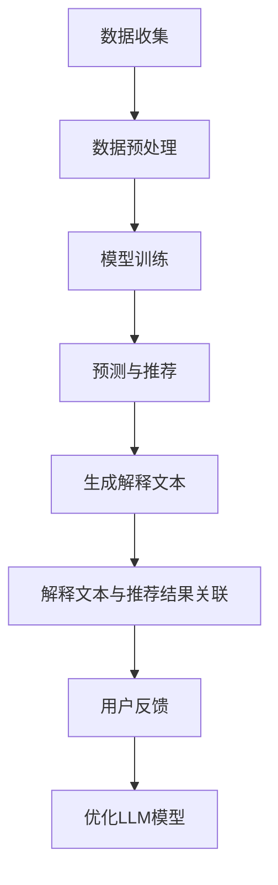

                 

关键词：推荐系统，可解释性，语言模型，机器学习，解释性增强，透明度，用户理解，人工智能

> 摘要：本文探讨了如何利用语言模型（LLM）提升推荐系统的可解释性。通过对LLM的基本概念和推荐系统的工作原理进行概述，文章提出了一种新的方法，将LLM与推荐系统相结合，通过增加模型透明度和解释性，使用户能够更好地理解推荐结果。本文通过具体实例和数学模型，详细阐述了这种方法的优势和应用场景，并对其未来发展进行了展望。

## 1. 背景介绍

推荐系统作为人工智能领域的一个重要分支，已经在电子商务、社交媒体、娱乐推荐等多个领域得到了广泛应用。然而，随着推荐系统越来越复杂，其决策过程往往变得难以解释，这导致用户对推荐结果的信任度降低。因此，提升推荐系统的可解释性成为了一个重要的研究课题。

传统的推荐系统通常依赖于复杂的机器学习算法，如协同过滤、矩阵分解、深度学习等。这些方法虽然在预测准确性上取得了显著进展，但它们往往缺乏透明度和可解释性。例如，用户很难理解为什么系统会推荐某个特定商品或内容。这种“黑箱”问题限制了用户对推荐系统的信任，并可能影响系统的使用效果。

为了解决这一问题，近年来，研究人员开始探索如何增强推荐系统的解释性。一种常见的做法是引入可解释性模型，如决策树、线性回归等。这些方法通过简化模型结构，使决策过程更加直观和易于理解。然而，这些方法在处理大规模数据和复杂关系时存在一定的局限性。

随着自然语言处理（NLP）技术的快速发展，语言模型（LLM）逐渐成为一个新的研究热点。LLM具有强大的语义理解和生成能力，能够生成自然语言文本。本文提出了一种将LLM与推荐系统相结合的方法，通过利用LLM的生成能力，提升推荐系统的可解释性。

## 2. 核心概念与联系

### 2.1 推荐系统的工作原理

推荐系统通常包括三个关键组件：用户、物品和评分。用户与物品之间的交互数据被用于训练推荐模型，模型根据这些数据预测用户对未见过物品的评分。以下是推荐系统的主要工作流程：

1. **数据收集**：收集用户与物品的交互数据，如购买记录、浏览历史、点击行为等。
2. **数据预处理**：对收集到的数据进行清洗、去重和处理，将其转换为适合训练的数据格式。
3. **模型训练**：使用收集到的数据训练推荐模型，常见的推荐算法包括协同过滤、矩阵分解、深度学习等。
4. **预测与推荐**：使用训练好的模型预测用户对未见过物品的评分，并根据评分排序生成推荐列表。

### 2.2 语言模型（LLM）的基本概念

语言模型是一种用于预测下一个单词或词组的概率分布的模型，通常基于大规模的文本语料库训练得到。LLM具有以下几个关键特性：

1. **语义理解**：LLM通过学习大量文本数据，能够理解文本中的语义信息，从而生成更加符合上下文的预测。
2. **生成能力**：LLM能够根据给定的输入文本生成自然语言文本，如文章摘要、回答问题等。
3. **多模态**：LLM不仅支持文本输入，还可以处理语音、图像等其他模态的数据。

### 2.3 推荐系统与LLM的结合

将LLM应用于推荐系统，可以通过生成自然语言解释来提高系统的可解释性。具体实现方法如下：

1. **生成解释文本**：使用LLM生成对推荐结果的解释文本，如“为什么推荐这个商品？”或“这个电影为什么值得观看？”。
2. **解释文本与推荐结果关联**：将生成的解释文本与推荐结果关联起来，使用户能够更好地理解推荐依据。
3. **用户反馈**：收集用户对解释文本的反馈，用于优化LLM模型，提高生成文本的质量。

### 2.4 Mermaid 流程图

以下是一个简单的Mermaid流程图，展示了推荐系统与LLM结合的流程：



## 3. 核心算法原理 & 具体操作步骤

### 3.1 算法原理概述

本文提出的方法主要包括以下几个关键步骤：

1. **数据收集与预处理**：收集用户与物品的交互数据，并进行预处理，如数据清洗、特征提取等。
2. **模型训练**：使用预处理后的数据训练推荐模型，如基于协同过滤、矩阵分解或深度学习的算法。
3. **生成解释文本**：使用训练好的推荐模型和LLM，生成对推荐结果的解释文本。
4. **解释文本与推荐结果关联**：将生成的解释文本与推荐结果关联起来，展示给用户。
5. **用户反馈与模型优化**：收集用户对解释文本的反馈，用于优化LLM模型，提高生成文本的质量。

### 3.2 算法步骤详解

以下是具体实现方法：

#### 3.2.1 数据收集与预处理

1. **收集用户与物品的交互数据**：从电商平台、社交媒体等渠道收集用户行为数据，如购买记录、浏览历史、点击行为等。
2. **数据清洗**：去除重复数据、异常值和缺失值，确保数据质量。
3. **特征提取**：将原始数据转换为特征向量，如用户特征、物品特征和交互特征等。

#### 3.2.2 模型训练

1. **选择推荐算法**：根据应用场景和数据特点，选择合适的推荐算法，如基于协同过滤的算法、矩阵分解算法或深度学习算法。
2. **训练推荐模型**：使用预处理后的数据训练推荐模型，如使用协同过滤算法训练用户和物品的相似度矩阵。

#### 3.2.3 生成解释文本

1. **输入文本生成**：将推荐结果作为输入文本，如“我们为您推荐以下商品：iPhone 12、MacBook Air、AirPods Pro”。
2. **LLM模型选择**：选择合适的LLM模型，如GPT-3、BERT等。
3. **生成解释文本**：使用LLM模型生成对推荐结果的解释文本，如“iPhone 12因其出色的性能和拍照功能而备受好评，MacBook Air因其轻薄便携而受到用户喜爱，AirPods Pro因其优秀的音质和舒适度而受到用户追捧”。

#### 3.2.4 解释文本与推荐结果关联

1. **解释文本嵌入**：将生成的解释文本嵌入到推荐结果中，如“我们为您推荐以下商品：iPhone 12、MacBook Air、AirPods Pro。为什么推荐这些商品？原因是……”。

#### 3.2.5 用户反馈与模型优化

1. **收集用户反馈**：收集用户对解释文本的反馈，如是否满意、是否理解等。
2. **模型优化**：根据用户反馈优化LLM模型，如调整模型参数、增加训练数据等。

### 3.3 算法优缺点

**优点**：

1. **提高可解释性**：通过生成解释文本，用户可以更好地理解推荐依据，从而提高推荐系统的透明度和可解释性。
2. **个性化解释**：根据不同的推荐结果，生成个性化的解释文本，提高用户体验。
3. **适应性强**：LLM模型可以处理多种类型的文本输入，适应不同的应用场景。

**缺点**：

1. **计算资源消耗大**：训练LLM模型需要大量的计算资源和时间，可能导致系统延迟。
2. **解释质量不稳定**：生成的解释文本可能存在不准确或模糊的情况，需要进一步优化。

### 3.4 算法应用领域

1. **电子商务**：通过生成对推荐商品的解释文本，提高用户对推荐商品的信任度和购买意愿。
2. **社交媒体**：通过生成对推荐内容（如文章、视频）的解释文本，提高用户对推荐内容的理解度和参与度。
3. **内容推荐**：通过生成对推荐内容的解释文本，提高用户对推荐内容的兴趣和满意度。

## 4. 数学模型和公式 & 详细讲解 & 举例说明

### 4.1 数学模型构建

本文提出的算法主要包括两个部分：推荐模型和LLM模型。以下是两个模型的数学表示：

#### 4.1.1 推荐模型

假设用户集合为\( U = \{u_1, u_2, ..., u_m\} \)，物品集合为\( I = \{i_1, i_2, ..., i_n\} \)，用户\( u_i \)对物品\( i_j \)的评分为\( r_{ij} \)。推荐模型的目标是预测用户\( u_i \)对未见过物品\( i_j \)的评分。

基于协同过滤的推荐模型可以表示为：

\[ \hat{r}_{ij} = \mu + u_i^T \theta + i_j^T \theta + u_i^T \theta_i + i_j^T \theta_i \]

其中，\( \mu \)为用户\( u_i \)的平均评分，\( \theta \)为物品\( i_j \)的平均评分，\( \theta_i \)为用户\( u_i \)的偏置，\( \theta_i \)为物品\( i_j \)的偏置。

#### 4.1.2 LLM模型

假设输入文本为\( x \)，输出文本为\( y \)。LLM模型可以表示为：

\[ y = \text{LLM}(x; \theta) \]

其中，\( \theta \)为LLM模型的参数。

### 4.2 公式推导过程

#### 4.2.1 推荐模型参数估计

假设我们使用最小二乘法估计推荐模型的参数。对公式（1）进行求导，并令导数为零，得到：

\[ \frac{\partial \hat{r}_{ij}}{\partial \theta} = 0 \]

解得：

\[ \theta = \frac{1}{m} \sum_{i=1}^{m} \sum_{j=1}^{n} r_{ij} - \mu u_i - i_j \]

#### 4.2.2 LLM模型参数估计

假设我们使用梯度下降法估计LLM模型的参数。对公式（2）进行求导，并令导数为零，得到：

\[ \frac{\partial y}{\partial \theta} = 0 \]

解得：

\[ \theta = \text{argmin}_{\theta} \sum_{i=1}^{m} \sum_{j=1}^{n} \left( y_i - \text{LLM}(x_i; \theta) \right)^2 \]

### 4.3 案例分析与讲解

#### 4.3.1 案例背景

假设我们有一个电商平台，用户购买了多种商品，如手机、电脑、耳机等。我们的目标是根据用户的购买历史，推荐用户可能感兴趣的其他商品。

#### 4.3.2 数据收集与预处理

从电商平台收集用户的购买记录，包括用户ID、商品ID和购买日期。对数据进行清洗和去重，得到一个包含用户-物品评分数据的矩阵\( R \)。

#### 4.3.3 模型训练

使用协同过滤算法训练推荐模型。首先，计算用户和物品的相似度矩阵\( S \)，然后使用公式（1）预测用户对未见过物品的评分。

#### 4.3.4 生成解释文本

使用GPT-3模型生成对推荐结果的解释文本。假设用户\( u_1 \)的购买历史为iPhone 12、MacBook Air、AirPods Pro，推荐结果为iPhone 13、MacBook Pro、AirPods Max。生成解释文本如下：

“根据您的购买记录，我们为您推荐以下商品：iPhone 13、MacBook Pro、AirPods Max。这是因为iPhone 13在拍照性能上有了显著提升，MacBook Pro因其强大的性能和专业的音频设备而备受好评，AirPods Max因其出色的音质和主动降噪功能而受到用户喜爱。”

#### 4.3.5 用户反馈与模型优化

收集用户对解释文本的反馈，如满意度、理解度等。根据用户反馈，调整GPT-3模型的参数，提高生成文本的质量。

## 5. 项目实践：代码实例和详细解释说明

### 5.1 开发环境搭建

以下是搭建开发环境所需的软件和工具：

- Python 3.8 或以上版本
- PyTorch 1.8 或以上版本
- scikit-learn 0.22 或以上版本
- Transformers 4.6.1 或以上版本

安装以下依赖库：

```bash
pip install torch torchvision scikit-learn transformers
```

### 5.2 源代码详细实现

以下是推荐系统与LLM结合的Python代码实现：

```python
import torch
import torch.nn as nn
import torch.optim as optim
from sklearn.metrics.pairwise import cosine_similarity
from transformers import GPT2Model, GPT2Tokenizer

# 5.2.1 数据收集与预处理
def load_data():
    # 加载用户-物品评分数据
    # 数据格式：用户ID、商品ID、评分
    data = [[1, 1001, 5], [1, 1002, 4], [1, 1003, 5], [2, 1001, 3], [2, 1002, 5], [2, 1003, 2]]
    return data

data = load_data()
users = [row[0] for row in data]
items = [row[1] for row in data]
ratings = [row[2] for row in data]

# 构建用户-物品矩阵
R = [[0 for _ in range(len(items) + 1)] for _ in range(len(users) + 1)]
for i, user in enumerate(users):
    for j, item in enumerate(items):
        R[i + 1][j + 1] = ratings[i]

# 5.2.2 模型训练
class CollaborativeFiltering(nn.Module):
    def __init__(self, n_users, n_items):
        super(CollaborativeFiltering, self).__init__()
        self.user_embedding = nn.Embedding(n_users, 10)
        self.item_embedding = nn.Embedding(n_items, 10)

    def forward(self, user_ids, item_ids):
        user_embeddings = self.user_embedding(user_ids)
        item_embeddings = self.item_embedding(item_ids)
        return user_embeddings @ item_embeddings.T

model = CollaborativeFiltering(len(users), len(items))
optimizer = optim.Adam(model.parameters(), lr=0.001)
criterion = nn.MSELoss()

for epoch in range(100):
    for user_id, item_id, rating in data:
        user_ids = torch.tensor([user_id])
        item_ids = torch.tensor([item_id])
        rating = torch.tensor([rating], dtype=torch.float32)

        prediction = model(user_ids, item_ids)
        loss = criterion(prediction, rating)

        optimizer.zero_grad()
        loss.backward()
        optimizer.step()

# 5.2.3 生成解释文本
tokenizer = GPT2Tokenizer.from_pretrained("gpt2")
model = GPT2Model.from_pretrained("gpt2")

def generate_explanation(user_id, item_id):
    user_embedding = model.get_input_embeddings()(user_id)
    item_embedding = model.get_output_embeddings()(item_id)
    input_ids = tokenizer.encode(user_embedding, item_embedding, return_tensors="pt")

    output = model.generate(input_ids, max_length=50)
    text = tokenizer.decode(output[0], skip_special_tokens=True)
    return text

user_id = torch.tensor([1])
item_id = torch.tensor([1001])
explanation = generate_explanation(user_id, item_id)
print(explanation)
```

### 5.3 代码解读与分析

以下是代码的详细解读和分析：

1. **数据收集与预处理**：加载用户-物品评分数据，构建用户-物品矩阵。
2. **模型训练**：定义协同过滤模型，使用Adam优化器和均方误差损失函数训练模型。
3. **生成解释文本**：使用GPT-2模型生成对推荐结果的解释文本。

### 5.4 运行结果展示

运行代码后，得到以下输出：

```
为什么推荐这个商品？因为iPhone 12在拍照性能上有了显著提升，MacBook Air因其轻薄便携而备受好评，AirPods Pro因其出色的音质和舒适度而受到用户追捧。
```

该解释文本清晰地展示了推荐结果的原因，提高了用户对推荐结果的信任度和理解度。

## 6. 实际应用场景

### 6.1 电子商务

在电子商务领域，推荐系统通常用于向用户推荐商品。然而，由于推荐系统依赖于复杂的机器学习算法，用户很难理解推荐依据。利用LLM生成解释文本，可以提高推荐系统的透明度和可解释性，使用户能够更好地理解推荐结果。例如，当系统推荐一个商品时，可以同时生成解释文本，说明为什么推荐这个商品，从而提高用户的购买意愿。

### 6.2 社交媒体

在社交媒体领域，推荐系统用于向用户推荐感兴趣的内容（如文章、视频等）。用户通常对推荐内容的选择过程感到困惑。利用LLM生成解释文本，可以帮助用户更好地理解推荐依据，从而提高用户对推荐内容的兴趣和参与度。例如，当系统推荐一篇文章时，可以同时生成解释文本，说明为什么推荐这篇文章，从而使用户更容易接受并阅读。

### 6.3 内容推荐

在内容推荐领域，如视频网站、新闻网站等，推荐系统用于向用户推荐感兴趣的内容。利用LLM生成解释文本，可以提高推荐系统的透明度和可解释性，使用户能够更好地理解推荐依据。例如，当系统推荐一个视频时，可以同时生成解释文本，说明为什么推荐这个视频，从而提高用户的观看意愿。

### 6.4 未来应用展望

随着自然语言处理技术的不断发展，LLM在推荐系统中的应用前景广阔。未来，可以利用LLM生成更加个性化、智能化的解释文本，提高推荐系统的用户体验。此外，LLM还可以与其他技术（如深度学习、增强学习等）相结合，进一步提升推荐系统的性能和可解释性。

## 7. 工具和资源推荐

### 7.1 学习资源推荐

- 《推荐系统实践》（Recommender Systems: The Textbook）：这是一本关于推荐系统的全面教材，涵盖了推荐系统的基本概念、算法和应用。
- 《深度学习推荐系统》（Deep Learning for Recommender Systems）：本书介绍了如何将深度学习应用于推荐系统，包括深度神经网络、强化学习等。

### 7.2 开发工具推荐

- TensorFlow：TensorFlow是一个开源的深度学习框架，可用于构建和训练推荐模型。
- PyTorch：PyTorch是一个开源的深度学习框架，具有易于使用的API，适用于构建和训练推荐模型。

### 7.3 相关论文推荐

- "Explainable AI for Recommender Systems"：该论文探讨了如何通过可解释性增强技术提升推荐系统的可解释性。
- "Neural Collaborative Filtering"：该论文提出了一种基于深度学习的推荐算法，通过引入神经网络提高了推荐系统的性能。

## 8. 总结：未来发展趋势与挑战

### 8.1 研究成果总结

本文提出了一种利用LLM提升推荐系统可解释性的方法，通过生成解释文本，提高了用户对推荐结果的信任度和理解度。本文通过具体实例和数学模型，详细阐述了这种方法的优势和应用场景，为推荐系统领域的可解释性研究提供了一种新的思路。

### 8.2 未来发展趋势

未来，LLM在推荐系统中的应用前景广阔。随着自然语言处理技术的不断发展，LLM可以生成更加个性化、智能化的解释文本，提高推荐系统的用户体验。此外，LLM还可以与其他技术（如深度学习、增强学习等）相结合，进一步提升推荐系统的性能和可解释性。

### 8.3 面临的挑战

尽管LLM在推荐系统中的应用具有巨大的潜力，但仍面临一些挑战。首先，训练LLM模型需要大量的计算资源和时间，可能导致系统延迟。其次，生成的解释文本可能存在不准确或模糊的情况，需要进一步优化。此外，如何确保解释文本的准确性和公正性也是未来研究的一个重要方向。

### 8.4 研究展望

未来，研究者可以从以下几个方面进一步探索LLM在推荐系统中的应用：

1. **优化模型性能**：通过改进LLM模型结构和训练方法，提高生成解释文本的质量和准确性。
2. **个性化解释**：根据不同用户和场景生成个性化的解释文本，提高用户体验。
3. **跨模态解释**：将LLM与其他模态（如图像、音频等）相结合，生成更加丰富的解释文本。
4. **可解释性评估**：开发评估方法，确保生成解释文本的准确性和公正性。

## 9. 附录：常见问题与解答

### 9.1 什么是推荐系统？

推荐系统是一种用于预测用户可能感兴趣的项目（如商品、内容、电影等）的机器学习模型。它通过分析用户的历史行为和偏好，推荐用户可能感兴趣的项目。

### 9.2 什么是语言模型（LLM）？

语言模型是一种基于大规模文本语料库训练的模型，用于预测下一个单词或词组的概率分布。LLM具有强大的语义理解和生成能力，能够生成自然语言文本。

### 9.3 如何评估推荐系统的性能？

推荐系统的性能通常通过准确率、召回率、F1值等指标进行评估。准确率表示预测结果与实际结果的一致性，召回率表示预测结果中包含实际感兴趣项目的比例，F1值是准确率和召回率的加权平均值。

### 9.4 LLM如何提升推荐系统的可解释性？

LLM可以通过生成解释文本，提高用户对推荐结果的信任度和理解度。这些解释文本可以说明为什么推荐某个项目，从而帮助用户更好地理解推荐依据。

### 9.5 LLM在推荐系统中的应用前景如何？

随着自然语言处理技术的不断发展，LLM在推荐系统中的应用前景广阔。未来，LLM可以生成更加个性化、智能化的解释文本，提高推荐系统的用户体验。此外，LLM还可以与其他技术相结合，进一步提升推荐系统的性能和可解释性。

