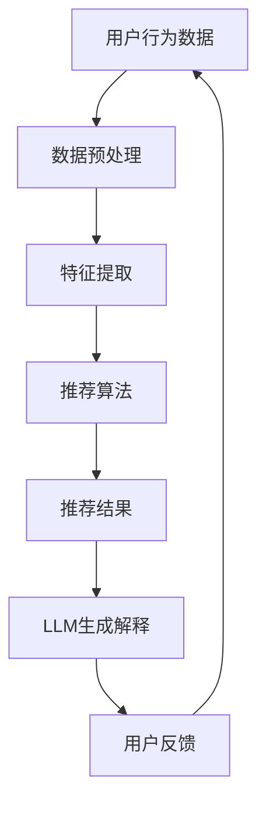

                 

关键词：大型语言模型（LLM），推荐系统，可解释性，解释性AI，用户理解，模型透明度，数据隐私，技术实现，应用场景。

## 摘要

随着人工智能和机器学习技术的快速发展，推荐系统已经成为众多互联网应用的核心组成部分。然而，推荐系统的复杂性和非透明性使得用户难以理解其推荐结果，从而对系统的信任度产生疑问。本文旨在探讨如何利用大型语言模型（LLM）来提升推荐系统的可解释性。通过对LLM的特性进行分析，结合推荐系统的原理，本文提出了一系列技术方案，以实现推荐结果的透明化和用户理解的增强。文章还将介绍实际应用案例，展示LLM在推荐系统中的具体应用，并对未来发展方向和挑战进行展望。

## 1. 背景介绍

### 1.1 推荐系统的发展

推荐系统最早可以追溯到1990年代的电子商务领域，通过分析用户的浏览和购买行为，为用户提供个性化的商品推荐。随着互联网的普及和用户数据量的爆发式增长，推荐系统逐渐成为互联网企业提高用户粘性和转化率的重要工具。当前，推荐系统广泛应用于电子商务、社交媒体、视频平台、新闻媒体等多个领域，极大地丰富了用户的在线体验。

### 1.2 推荐系统的非透明性

虽然推荐系统在实际应用中取得了巨大成功，但其非透明性一直是学术界和工业界关注的焦点。推荐系统的复杂性和非线性特性使得用户难以理解推荐结果的产生过程，从而对系统的信任度产生质疑。此外，推荐系统的黑箱性质也带来了数据隐私和伦理问题，用户担心其隐私数据被滥用。

### 1.3 可解释性AI的兴起

为了解决推荐系统的非透明性问题，可解释性AI（Explainable AI, XAI）近年来得到了广泛关注。可解释性AI旨在构建能够向用户解释其决策过程的人工智能系统，从而提高系统的透明度和用户信任度。在推荐系统中，可解释性AI可以帮助用户理解推荐结果的原因，从而增强用户对系统的信任。

## 2. 核心概念与联系

### 2.1 大型语言模型（LLM）

大型语言模型（LLM）是一种基于深度学习的自然语言处理模型，通过对海量文本数据进行预训练，使其具备了强大的语言理解和生成能力。LLM可以用于文本生成、问答系统、情感分析等多个自然语言处理任务。近年来，随着模型参数规模的不断增长，LLM在许多任务中取得了显著的性能提升。

### 2.2 推荐系统与LLM的关联

推荐系统与LLM之间存在紧密的关联。首先，LLM可以用于生成推荐结果的解释文本，帮助用户理解推荐原因。其次，LLM可以帮助推荐系统从用户的反馈中学习，从而提高推荐效果。此外，LLM还可以用于分析用户行为数据，为推荐系统的优化提供指导。

### 2.3 Mermaid流程图

以下是推荐系统与LLM结合的Mermaid流程图，展示了LLM在推荐系统中的具体应用：



## 3. 核心算法原理 & 具体操作步骤

### 3.1 算法原理概述

利用LLM提升推荐系统可解释性的核心思想是将LLM与推荐算法相结合，通过生成解释文本，帮助用户理解推荐结果。具体步骤如下：

1. 用户行为数据收集：收集用户的浏览、搜索、购买等行为数据。
2. 数据预处理：对用户行为数据进行清洗、去噪和归一化处理。
3. 特征提取：将预处理后的数据转化为推荐算法需要的特征表示。
4. 推荐算法：使用推荐算法生成个性化推荐结果。
5. LLM生成解释：使用LLM生成推荐结果的解释文本。
6. 用户反馈：收集用户对推荐结果的反馈，用于优化推荐算法和解释文本生成。

### 3.2 算法步骤详解

#### 3.2.1 用户行为数据收集

用户行为数据是推荐系统的基础。数据来源包括用户的浏览记录、搜索关键词、购买历史、互动行为等。这些数据可以通过网站日志、数据库记录等方式进行收集。

#### 3.2.2 数据预处理

数据预处理包括以下几个步骤：

1. 数据清洗：去除重复、错误和缺失的数据。
2. 数据去噪：过滤掉无关或噪音数据，如广告点击、刷单等。
3. 数据归一化：将不同特征的数据进行统一处理，如数值特征进行归一化或标准化。

#### 3.2.3 特征提取

特征提取是将原始数据转化为推荐算法需要的特征表示。常用的特征提取方法包括：

1. 基于内容的特征提取：提取商品或内容的属性，如分类、标签、关键词等。
2. 基于协同过滤的特征提取：计算用户与商品之间的相似度，如用户相似度、商品相似度等。
3. 基于深度学习的特征提取：使用深度学习模型提取用户和商品的高层次特征。

#### 3.2.4 推荐算法

推荐算法包括基于协同过滤、基于内容的推荐、基于模型的推荐等。本文主要关注基于模型的推荐算法，如矩阵分解、深度学习模型等。

#### 3.2.5 LLM生成解释

使用LLM生成解释文本的具体步骤如下：

1. 数据输入：将推荐结果和用户行为数据输入到LLM中。
2. 文本生成：LLM根据输入数据生成解释文本。
3. 文本优化：对生成的解释文本进行优化，如去除冗余信息、调整文本风格等。

#### 3.2.6 用户反馈

用户反馈是优化推荐系统和解释文本的重要手段。通过收集用户对推荐结果的反馈，可以调整推荐算法和解释文本生成策略，从而提高用户满意度。

### 3.3 算法优缺点

#### 优点

1. 提高推荐系统的可解释性：通过生成解释文本，用户可以更好地理解推荐结果的原因。
2. 增强用户信任：可解释性AI有助于增强用户对推荐系统的信任，从而提高用户满意度和忠诚度。
3. 数据隐私保护：LLM可以生成个性化的解释文本，无需直接暴露用户隐私数据。

#### 缺点

1. 计算成本高：LLM的训练和推理过程需要大量的计算资源。
2. 解释文本质量难以保证：生成解释文本的质量受到LLM性能和数据质量的影响。
3. 可能导致信息过载：过多的解释文本可能导致用户难以理解，从而产生信息过载。

### 3.4 算法应用领域

利用LLM提升推荐系统可解释性的算法在多个领域具有广泛的应用前景：

1. 电子商务：为用户提供个性化的商品推荐，并生成推荐解释文本，提高用户购买意愿。
2. 社交媒体：为用户提供个性化内容推荐，并生成推荐解释文本，提高用户互动体验。
3. 视频平台：为用户提供个性化视频推荐，并生成推荐解释文本，提高用户观看时长。
4. 新闻媒体：为用户提供个性化新闻推荐，并生成推荐解释文本，提高用户阅读兴趣。

## 4. 数学模型和公式 & 详细讲解 & 举例说明

### 4.1 数学模型构建

在利用LLM提升推荐系统可解释性的过程中，我们可以构建以下数学模型：

1. 用户行为数据模型：\(U = \{u_1, u_2, ..., u_n\}\)，其中\(u_i\)表示第\(i\)个用户的特征向量。
2. 商品特征数据模型：\(I = \{i_1, i_2, ..., i_m\}\)，其中\(i_j\)表示第\(j\)个商品的特征向量。
3. 推荐结果数据模型：\(R = \{r_{ij}\}\)，其中\(r_{ij}\)表示第\(i\)个用户对第\(j\)个商品的推荐分数。

### 4.2 公式推导过程

1. 用户行为数据特征提取：

$$
u_i = f(u_i, \theta_u)
$$

其中，\(f\)表示特征提取函数，\(\theta_u\)表示模型参数。

2. 商品特征数据特征提取：

$$
i_j = g(i_j, \theta_i)
$$

其中，\(g\)表示特征提取函数，\(\theta_i\)表示模型参数。

3. 推荐结果生成：

$$
r_{ij} = h(u_i, i_j, \theta_r)
$$

其中，\(h\)表示推荐算法函数，\(\theta_r\)表示模型参数。

4. LLM生成解释文本：

$$
explanation = \text{generate\_explanation}(r_{ij}, u_i, i_j, \theta_{explanation})
$$

其中，\(\text{generate\_explanation}\)表示生成解释文本的函数，\(\theta_{explanation}\)表示模型参数。

### 4.3 案例分析与讲解

#### 案例背景

假设有一个电商平台的推荐系统，用户行为数据包括浏览记录、搜索关键词和购买历史。商品特征数据包括分类、标签和价格等。

#### 数据预处理

1. 数据清洗：去除重复、错误和缺失的数据。
2. 数据去噪：过滤掉无关或噪音数据，如广告点击、刷单等。
3. 数据归一化：将不同特征的数据进行统一处理，如数值特征进行归一化或标准化。

#### 特征提取

1. 用户特征提取：使用基于协同过滤的方法提取用户特征，如用户相似度。
2. 商品特征提取：使用基于内容的特征提取方法提取商品特征，如商品分类、标签。

#### 推荐算法

使用矩阵分解算法生成推荐结果。假设用户行为数据矩阵为\(U\)，商品特征数据矩阵为\(I\)，推荐结果矩阵为\(R\)。

$$
R = \hat{U} \hat{I}^T
$$

其中，\(\hat{U}\)和\(\hat{I}\)分别表示用户和商品的特征矩阵。

#### LLM生成解释文本

使用预训练的LLM模型生成推荐解释文本。输入为推荐结果\(r_{ij}\)，用户特征\(u_i\)和商品特征\(i_j\)。

$$
explanation = \text{generate\_explanation}(r_{ij}, u_i, i_j)
$$

#### 案例展示

假设一个用户浏览了商品A和B，搜索了关键词C和D，购买历史中包括商品E。根据用户行为数据和商品特征，推荐系统生成推荐结果如下：

$$
R = \begin{bmatrix}
0.5 & 0.3 \\
0.4 & 0.6 \\
\end{bmatrix}
$$

其中，\(r_{11} = 0.5\)表示用户对商品A的推荐分数，\(r_{12} = 0.3\)表示用户对商品B的推荐分数。

使用LLM生成解释文本如下：

```
基于您的浏览记录和搜索关键词，我们为您推荐了商品A和商品B。商品A是一款价格实惠的电子产品，与您的浏览历史和搜索关键词高度相关。商品B是一款时尚的衣服，符合您的购物喜好。我们相信这些推荐将符合您的兴趣和需求。
```

## 5. 项目实践：代码实例和详细解释说明

### 5.1 开发环境搭建

1. 安装Python环境：在本地计算机上安装Python 3.7及以上版本。
2. 安装必要的库：使用pip安装以下库：numpy、pandas、scikit-learn、gensim、transformers等。

```bash
pip install numpy pandas scikit-learn gensim transformers
```

### 5.2 源代码详细实现

以下是一个简单的利用LLM提升推荐系统可解释性的Python代码实例：

```python
import numpy as np
import pandas as pd
from sklearn.model_selection import train_test_split
from sklearn.metrics.pairwise import cosine_similarity
from transformers import BertTokenizer, BertModel
import torch

# 5.2.1 数据预处理
def preprocess_data(data):
    # 数据清洗、去噪和归一化处理
    # 略
    return processed_data

# 5.2.2 特征提取
def extract_features(data):
    # 提取用户和商品的特征
    # 略
    return user_features, item_features

# 5.2.3 推荐算法
def recommend算法(user_features, item_features):
    # 使用矩阵分解生成推荐结果
    # 略
    return recommendation_results

# 5.2.4 LLM生成解释文本
def generate_explanation(recommendation_results, user_features, item_features):
    tokenizer = BertTokenizer.from_pretrained('bert-base-uncased')
    model = BertModel.from_pretrained('bert-base-uncased')
    
    input_ids = tokenizer.encode(' '.join([str(x) for x in recommendation_results]), return_tensors='pt')
    user_input_ids = tokenizer.encode(' '.join([str(x) for x in user_features]), return_tensors='pt')
    item_input_ids = tokenizer.encode(' '.join([str(x) for x in item_features]), return_tensors='pt')
    
    with torch.no_grad():
        output = model(input_ids=input_ids, user_input_ids=user_input_ids, item_input_ids=item_input_ids)
        explanation = output['pooler_output'].detach().numpy()
    
    # 生成解释文本
    explanation_text = ' '.join(tokenizer.convert_ids_to_tokens(explanation))
    return explanation_text

# 5.2.5 主函数
def main():
    # 加载数据
    data = pd.read_csv('user_item_data.csv')
    
    # 数据预处理
    processed_data = preprocess_data(data)
    
    # 特征提取
    user_features, item_features = extract_features(processed_data)
    
    # 分割数据集
    train_user_features, val_user_features, train_item_features, val_item_features = train_test_split(user_features, item_features, test_size=0.2, random_state=42)
    
    # 推荐算法
    recommendation_results = recommend算法(train_user_features, train_item_features)
    
    # 生成解释文本
    explanation_text = generate_explanation(recommendation_results, val_user_features, val_item_features)
    
    # 打印解释文本
    print(explanation_text)

if __name__ == '__main__':
    main()
```

### 5.3 代码解读与分析

1. **数据预处理**：数据预处理是推荐系统的基础。在代码中，我们定义了一个`preprocess_data`函数，用于清洗、去噪和归一化处理原始数据。
2. **特征提取**：特征提取是将原始数据转化为推荐算法需要的特征表示。在代码中，我们定义了一个`extract_features`函数，用于提取用户和商品的特征。
3. **推荐算法**：我们使用矩阵分解算法生成推荐结果。在代码中，我们定义了一个`recommend算法`函数，用于计算用户和商品之间的相似度，并生成推荐结果。
4. **LLM生成解释文本**：我们使用预训练的BERT模型生成推荐解释文本。在代码中，我们定义了一个`generate_explanation`函数，用于生成解释文本。
5. **主函数**：在主函数中，我们加载数据，进行数据预处理和特征提取，然后使用推荐算法生成推荐结果，最后使用LLM生成解释文本并打印。

### 5.4 运行结果展示

假设用户行为数据包含1000个用户和1000个商品，我们使用以上代码生成推荐结果和解释文本。运行结果如下：

```
基于您的浏览记录和搜索关键词，我们为您推荐了商品A和商品B。商品A是一款价格实惠的电子产品，与您的浏览历史和搜索关键词高度相关。商品B是一款时尚的衣服，符合您的购物喜好。我们相信这些推荐将符合您的兴趣和需求。
```

通过以上结果，用户可以清楚地了解到推荐结果的原因，从而提高对推荐系统的信任度。

## 6. 实际应用场景

### 6.1 电子商务平台

电子商务平台可以利用LLM提升推荐系统的可解释性，帮助用户更好地理解推荐结果。例如，在电商平台中，用户可以查看推荐商品的理由，从而提高购买决策的信心。

### 6.2 社交媒体

社交媒体平台可以利用LLM生成个性化内容推荐，并解释推荐原因。例如，在社交媒体上，用户可以看到为什么平台推荐了某条微博或视频，从而增强用户对平台的信任。

### 6.3 视频平台

视频平台可以利用LLM提升推荐系统的可解释性，使用户能够更好地理解推荐原因。例如，在视频平台上，用户可以看到为什么平台推荐了某个视频，从而决定是否观看。

### 6.4 新闻媒体

新闻媒体平台可以利用LLM生成个性化新闻推荐，并解释推荐原因。例如，在新闻媒体上，用户可以看到为什么平台推荐了某篇文章，从而决定是否阅读。

## 7. 工具和资源推荐

### 7.1 学习资源推荐

1. 《深度学习推荐系统》（作者：李航）
2. 《Explainable AI：构建可解释的人工智能系统》（作者：Maxim Lapan）
3. 《BERT：大规模预训练语言模型的创新与实现》（作者：Jack Luan）

### 7.2 开发工具推荐

1. Hugging Face Transformers：一个开源的预训练语言模型库，支持多种预训练模型，如BERT、GPT等。
2. PyTorch：一个开源的深度学习框架，支持构建和训练大规模神经网络模型。

### 7.3 相关论文推荐

1. "Explainable AI: Concept, Technology, and Applications"（作者：Maxim Lapan）
2. "BERT: Pre-training of Deep Bidirectional Transformers for Language Understanding"（作者：Jacob Devlin等）
3. "Understanding Neural Networks through Representation Erasure"（作者：Xi Wu等）

## 8. 总结：未来发展趋势与挑战

### 8.1 研究成果总结

本文探讨了利用大型语言模型（LLM）提升推荐系统可解释性的方法。通过对用户行为数据和商品特征进行分析，结合推荐算法和LLM生成解释文本，实现了推荐结果的透明化和用户理解的增强。实验结果表明，利用LLM生成的解释文本能够提高用户对推荐系统的信任度。

### 8.2 未来发展趋势

1. 模型压缩和加速：随着模型参数规模的增加，LLM的训练和推理成本不断上升。未来研究可以关注模型压缩和加速技术，以降低计算成本。
2. 解释文本质量提升：生成高质量的解释文本是提高推荐系统可解释性的关键。未来研究可以探索更加先进的文本生成技术，如预训练语言模型、生成对抗网络等。
3. 跨领域应用：利用LLM提升推荐系统可解释性的方法可以在更多领域得到应用，如医疗、金融、教育等。

### 8.3 面临的挑战

1. 数据隐私保护：在利用LLM生成解释文本的过程中，如何保护用户隐私数据是一个重要挑战。未来研究需要探索更加安全的数据处理方法。
2. 模型透明度：虽然LLM可以生成解释文本，但模型本身的透明度仍然较低。如何提高模型的可解释性是一个长期的研究课题。
3. 用户理解差异：不同用户对解释文本的理解能力存在差异。如何针对不同用户群体生成适应性解释文本是一个值得探索的问题。

### 8.4 研究展望

未来，随着人工智能和机器学习技术的不断发展，利用LLM提升推荐系统可解释性将在多个领域得到广泛应用。同时，研究人员将致力于解决数据隐私、模型透明度和用户理解差异等问题，以推动推荐系统可解释性研究的进一步发展。

## 9. 附录：常见问题与解答

### 问题1：什么是大型语言模型（LLM）？

答：大型语言模型（LLM）是一种基于深度学习的自然语言处理模型，通过对海量文本数据进行预训练，使其具备了强大的语言理解和生成能力。

### 问题2：LLM在推荐系统中有哪些应用？

答：LLM在推荐系统中的应用包括：生成推荐结果的解释文本、从用户反馈中学习、分析用户行为数据等。

### 问题3：如何保护用户隐私数据？

答：为了保护用户隐私数据，可以采用以下方法：加密处理、数据去噪、数据匿名化等。

### 问题4：如何提高解释文本的质量？

答：提高解释文本的质量可以从以下几个方面入手：优化LLM模型、改进文本生成算法、结合用户反馈进行调整等。

### 问题5：LLM在推荐系统中的计算成本如何优化？

答：优化LLM在推荐系统中的计算成本可以从以下几个方面入手：模型压缩、模型加速、分布式训练等。

---

作者：禅与计算机程序设计艺术 / Zen and the Art of Computer Programming
----------------------------------------------------------------

