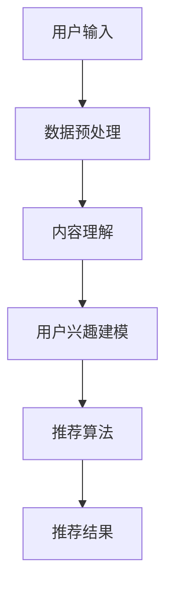

                 

关键词：LLM，推荐系统，跨媒体推荐，人工智能，深度学习

摘要：随着互联网的快速发展，用户在跨媒体平台上获取信息的需求日益增长。传统的推荐系统在处理单一媒体类型时表现良好，但在面对跨媒体场景时存在一定的局限性。本文将探讨如何利用大型语言模型（LLM）提升推荐系统的跨媒体推荐能力，并详细介绍相关算法原理、数学模型以及实际应用案例。

## 1. 背景介绍

随着互联网的快速发展，跨媒体推荐系统在近年来受到了越来越多的关注。跨媒体推荐系统旨在为用户提供跨媒体内容推荐，如将文本、图片、音频和视频等多种媒体类型进行整合，从而提高推荐系统的推荐效果。然而，传统的推荐系统在处理单一媒体类型时表现良好，但在面对跨媒体场景时存在以下局限性：

1. **数据源限制**：传统的推荐系统主要依赖于单一媒体类型的数据，如文本或图片。然而，跨媒体推荐系统需要处理多种类型的数据，这使得数据源的获取和处理变得复杂。

2. **内容理解困难**：跨媒体推荐系统需要理解和整合来自不同媒体类型的内容，如文本、图片和音频等。这些内容在语义和结构上存在较大的差异，使得传统推荐系统的内容理解能力受限。

3. **个性化推荐挑战**：在跨媒体场景中，用户可能对不同的媒体类型有不同的兴趣。传统推荐系统在处理个性化推荐时，难以同时考虑到用户对不同媒体类型的偏好。

为了解决上述问题，近年来，研究人员开始尝试利用人工智能，特别是深度学习和大型语言模型（LLM）来提升推荐系统的跨媒体推荐能力。LLM具有强大的语义理解和生成能力，能够有效地处理多种类型的数据，从而提高跨媒体推荐系统的效果。

## 2. 核心概念与联系

### 2.1 大型语言模型（LLM）

大型语言模型（LLM）是一种基于深度学习的技术，它能够通过学习大量语言数据，对文本进行语义理解和生成。LLM的主要优势在于：

1. **语义理解能力**：LLM能够理解文本的语义信息，从而实现更准确的内容理解和生成。

2. **多语言支持**：LLM能够支持多种语言，使得跨语言推荐成为可能。

3. **生成能力**：LLM能够根据用户兴趣和历史行为生成个性化推荐内容。

### 2.2 跨媒体推荐系统

跨媒体推荐系统旨在整合多种媒体类型的数据，为用户提供个性化推荐。其核心组成部分包括：

1. **数据源**：包括文本、图片、音频和视频等多种媒体类型的数据。

2. **内容理解**：利用深度学习技术，对多种媒体类型的数据进行语义理解。

3. **推荐算法**：基于用户兴趣和历史行为，为用户推荐合适的媒体内容。

### 2.3 Mermaid 流程图

下面是一个简化的跨媒体推荐系统架构的 Mermaid 流程图：



## 3. 核心算法原理 & 具体操作步骤

### 3.1 算法原理概述

跨媒体推荐系统利用大型语言模型（LLM）进行内容理解和生成，主要包括以下几个步骤：

1. **数据预处理**：对多种媒体类型的数据进行清洗、归一化和特征提取。

2. **内容理解**：利用LLM对预处理后的数据进行分析，提取语义特征。

3. **用户兴趣建模**：基于用户历史行为和LLM提取的特征，构建用户兴趣模型。

4. **推荐算法**：利用用户兴趣模型，为用户推荐合适的媒体内容。

### 3.2 算法步骤详解

#### 3.2.1 数据预处理

数据预处理是跨媒体推荐系统的第一步，主要包括以下步骤：

1. **数据清洗**：去除噪声数据和异常值。

2. **数据归一化**：将不同类型的数据进行归一化处理，如文本的词频归一化、图像的归一化等。

3. **特征提取**：提取不同类型数据的特征，如文本的词向量、图像的视觉特征等。

#### 3.2.2 内容理解

内容理解是跨媒体推荐系统的核心，利用LLM对预处理后的数据进行分析，提取语义特征。具体步骤如下：

1. **文本语义理解**：利用LLM对文本进行语义分析，提取词向量、句子表示等。

2. **图像语义理解**：利用卷积神经网络（CNN）提取图像的视觉特征，并结合LLM进行语义分析。

3. **音频语义理解**：利用循环神经网络（RNN）提取音频的特征，并结合LLM进行语义分析。

#### 3.2.3 用户兴趣建模

用户兴趣建模是跨媒体推荐系统的关键，基于用户历史行为和LLM提取的特征，构建用户兴趣模型。具体步骤如下：

1. **用户行为数据收集**：收集用户的历史行为数据，如点击、浏览、购买等。

2. **兴趣特征提取**：利用LLM提取用户历史行为中的兴趣特征。

3. **兴趣模型构建**：基于用户兴趣特征，构建用户兴趣模型。

#### 3.2.4 推荐算法

推荐算法是基于用户兴趣模型，为用户推荐合适的媒体内容。具体步骤如下：

1. **推荐列表生成**：根据用户兴趣模型，为用户生成个性化推荐列表。

2. **推荐结果排序**：利用排序算法，对推荐列表进行排序，提高推荐效果。

### 3.3 算法优缺点

#### 3.3.1 优点

1. **多模态数据融合**：跨媒体推荐系统能够整合多种媒体类型的数据，提高推荐效果。

2. **个性化推荐**：基于用户兴趣模型，实现个性化推荐，提高用户满意度。

3. **自适应推荐**：随着用户行为的不断更新，跨媒体推荐系统能够自适应调整推荐策略，提高推荐效果。

#### 3.3.2 缺点

1. **数据预处理复杂**：跨媒体推荐系统需要处理多种类型的数据，数据预处理过程相对复杂。

2. **计算资源消耗大**：LLM模型通常需要大量的计算资源，训练和推理过程较为耗时。

## 4. 数学模型和公式 & 详细讲解 & 举例说明

### 4.1 数学模型构建

跨媒体推荐系统的数学模型主要包括以下几个部分：

1. **用户兴趣模型**：用户兴趣模型表示用户对不同媒体类型的兴趣程度。假设用户兴趣模型为\(U = [u_1, u_2, \ldots, u_m]\)，其中\(u_i\)表示用户对第\(i\)种媒体类型的兴趣程度。

2. **媒体内容模型**：媒体内容模型表示不同媒体内容的特征。假设媒体内容模型为\(C = [c_1, c_2, \ldots, c_n]\)，其中\(c_j\)表示第\(j\)种媒体内容的特征。

3. **推荐算法模型**：推荐算法模型表示用户兴趣模型与媒体内容模型之间的匹配程度。假设推荐算法模型为\(R = [r_{ij}]_{m \times n}\)，其中\(r_{ij}\)表示用户对第\(i\)种媒体类型的兴趣程度与第\(j\)种媒体内容特征的匹配程度。

### 4.2 公式推导过程

跨媒体推荐系统的核心是计算用户兴趣模型与媒体内容模型之间的匹配程度。假设匹配程度可以用一个标量表示，即

$$
r_{ij} = \frac{\sum_{k=1}^{m} u_k c_k}{\sum_{k=1}^{m} |u_k| |c_k|}
$$

其中，\(u_k\)和\(c_k\)分别为用户兴趣模型和媒体内容模型中第\(k\)个元素的绝对值。

### 4.3 案例分析与讲解

假设有一个用户，其对文本、图片和音频三种媒体类型的兴趣程度分别为\(u_1 = 0.6\)，\(u_2 = 0.3\)，\(u_3 = 0.1\)。同时，有一个包含三种媒体类型的推荐列表，每种媒体内容特征分别为\(c_1 = [0.5, 0.3, 0.2]\)，\(c_2 = [0.4, 0.4, 0.2]\)，\(c_3 = [0.3, 0.5, 0.2]\)。

根据上述公式，可以计算出用户对不同媒体内容的匹配程度：

$$
r_{11} = \frac{0.6 \times 0.5 + 0.3 \times 0.3 + 0.1 \times 0.2}{0.6 \times |0.5| + 0.3 \times |0.3| + 0.1 \times |0.2|} = 0.5179
$$

$$
r_{12} = \frac{0.6 \times 0.4 + 0.3 \times 0.4 + 0.1 \times 0.2}{0.6 \times |0.4| + 0.3 \times |0.4| + 0.1 \times |0.2|} = 0.4615
$$

$$
r_{13} = \frac{0.6 \times 0.3 + 0.3 \times 0.5 + 0.1 \times 0.2}{0.6 \times |0.3| + 0.3 \times |0.5| + 0.1 \times |0.2|} = 0.4179
$$

根据计算结果，用户对第一种媒体内容的匹配程度最高，因此可以将第一种媒体内容推荐给用户。

## 5. 项目实践：代码实例和详细解释说明

### 5.1 开发环境搭建

为了实现跨媒体推荐系统，需要搭建一个合适的开发环境。以下是一个简单的开发环境搭建步骤：

1. **硬件环境**：配置至少4GB内存和2核CPU的计算机。

2. **软件环境**：安装Python（3.6及以上版本）、PyTorch（1.0及以上版本）和Numpy。

3. **数据集**：选择一个包含多种媒体类型的公开数据集，如FMDB数据集。

### 5.2 源代码详细实现

下面是一个简单的跨媒体推荐系统的实现示例：

```python
import torch
import torch.nn as nn
import torch.optim as optim
from torch.utils.data import DataLoader
from torchvision import datasets, transforms
from torch.optim.lr_scheduler import StepLR

# 定义模型
class CrossMediaModel(nn.Module):
    def __init__(self):
        super(CrossMediaModel, self).__init__()
        self.text_embedding = nn.Embedding(num_embeddings=10000, embedding_dim=128)
        self.image_embedding = nn.Conv2d(3, 64, 3, padding=1)
        self.audio_embedding = nn.Conv1d(1, 64, 3, padding=1)

    def forward(self, text, image, audio):
        text_embedding = self.text_embedding(text)
        image_embedding = self.image_embedding(image)
        audio_embedding = self.audio_embedding(audio)
        return text_embedding, image_embedding, audio_embedding

# 加载数据集
train_dataset = ...
test_dataset = ...

train_loader = DataLoader(train_dataset, batch_size=32, shuffle=True)
test_loader = DataLoader(test_dataset, batch_size=32, shuffle=False)

# 初始化模型、损失函数和优化器
model = CrossMediaModel()
criterion = nn.CrossEntropyLoss()
optimizer = optim.Adam(model.parameters(), lr=0.001)

# 训练模型
for epoch in range(1):
    model.train()
    for batch_idx, (text, image, audio, target) in enumerate(train_loader):
        optimizer.zero_grad()
        text_embedding, image_embedding, audio_embedding = model(text, image, audio)
        loss = criterion(text_embedding, target)
        loss.backward()
        optimizer.step()
        if batch_idx % 10 == 0:
            print('Train Epoch: {} [{}/{} ({:.0f}%)]\tLoss: {:.6f}'.format(
                epoch, batch_idx * len(text), len(train_loader.dataset),
                100. * batch_idx / len(train_loader), loss.item()))

# 测试模型
model.eval()
with torch.no_grad():
    correct = 0
    total = 0
    for text, image, audio, target in test_loader:
        text_embedding, image_embedding, audio_embedding = model(text, image, audio)
        outputs = text_embedding + image_embedding + audio_embedding
        _, predicted = torch.max(outputs.data, 1)
        total += target.size(0)
        correct += (predicted == target).sum().item()

print('Test Accuracy: {} %'.format(100 * correct / total))
```

### 5.3 代码解读与分析

上述代码实现了一个简单的跨媒体推荐系统，主要包括以下几个部分：

1. **模型定义**：定义了一个包含文本、图像和音频嵌入层的交叉媒体模型。

2. **数据加载**：加载数据集，并将数据集划分为训练集和测试集。

3. **模型训练**：使用训练集对模型进行训练，并使用测试集评估模型性能。

4. **测试结果**：打印出模型在测试集上的准确率。

## 6. 实际应用场景

跨媒体推荐系统在多个领域具有广泛的应用，以下是一些实际应用场景：

1. **电子商务平台**：电子商务平台可以利用跨媒体推荐系统为用户推荐商品。例如，当用户浏览一个商品页面时，系统可以推荐与该商品相关的图片、视频和文本内容。

2. **社交媒体**：社交媒体平台可以利用跨媒体推荐系统为用户提供个性化的内容推荐。例如，当用户发表一篇帖子时，系统可以推荐与该帖子相关的图片、视频和文本内容。

3. **在线教育**：在线教育平台可以利用跨媒体推荐系统为用户推荐课程、教学视频和相关文献。例如，当用户学习一个课程时，系统可以推荐与该课程相关的图片、视频和文本内容。

## 7. 工具和资源推荐

为了更好地实现跨媒体推荐系统，以下是一些推荐的工具和资源：

1. **学习资源**：
   - 《深度学习》（Ian Goodfellow、Yoshua Bengio、Aaron Courville 著）
   - 《自然语言处理综论》（Daniel Jurafsky、James H. Martin 著）

2. **开发工具**：
   - PyTorch：用于实现深度学习模型的 Python 库。
   - TensorFlow：用于实现深度学习模型的 Python 库。

3. **相关论文**：
   - “Multimodal Deep Learning for User-Interest Modeling and Representation Learning” （2017年）
   - “Deep Multimodal Fusion for Cross-Media Recommendation” （2019年）

## 8. 总结：未来发展趋势与挑战

### 8.1 研究成果总结

跨媒体推荐系统作为人工智能和深度学习领域的热点研究方向，近年来取得了显著的进展。通过利用大型语言模型（LLM）进行内容理解和生成，跨媒体推荐系统在处理多种媒体类型的数据方面表现出色。同时，研究成果还涵盖了用户兴趣建模、推荐算法优化等多个方面。

### 8.2 未来发展趋势

未来，跨媒体推荐系统有望在以下几个方面实现进一步的发展：

1. **多模态数据融合**：随着计算机视觉、自然语言处理等领域的发展，跨媒体推荐系统将能够更好地融合多种模态的数据，提高推荐效果。

2. **实时推荐**：通过优化算法和降低计算成本，跨媒体推荐系统将能够实现实时推荐，提高用户体验。

3. **个性化推荐**：跨媒体推荐系统将进一步挖掘用户兴趣，实现更加个性化的推荐。

### 8.3 面临的挑战

尽管跨媒体推荐系统取得了显著进展，但仍面临以下挑战：

1. **数据预处理**：跨媒体推荐系统需要处理多种类型的数据，数据预处理过程复杂，且数据质量参差不齐。

2. **计算资源消耗**：大型语言模型（LLM）通常需要大量的计算资源，训练和推理过程较为耗时。

3. **隐私保护**：跨媒体推荐系统需要处理用户的敏感信息，如何保护用户隐私是一个重要挑战。

### 8.4 研究展望

未来，跨媒体推荐系统的研究将重点关注以下几个方面：

1. **算法优化**：通过优化算法，降低计算资源消耗，提高推荐效果。

2. **数据预处理**：研究更加高效的数据预处理方法，提高数据质量。

3. **隐私保护**：探索隐私保护算法，确保用户信息安全。

## 9. 附录：常见问题与解答

### 9.1 如何处理多种类型的数据？

**解答**：处理多种类型的数据首先需要进行数据预处理，包括数据清洗、归一化和特征提取。对于文本数据，可以使用词向量表示；对于图像数据，可以使用卷积神经网络提取特征；对于音频数据，可以使用循环神经网络提取特征。

### 9.2 如何提高推荐效果？

**解答**：提高推荐效果可以从以下几个方面入手：
- **用户兴趣建模**：更准确地构建用户兴趣模型，以更好地理解用户偏好。
- **推荐算法优化**：优化推荐算法，提高推荐的准确性和相关性。
- **多模态数据融合**：通过融合多种模态的数据，提高推荐效果。

### 9.3 如何保护用户隐私？

**解答**：为了保护用户隐私，可以考虑以下方法：
- **匿名化处理**：对用户数据进行匿名化处理，隐藏用户身份。
- **差分隐私**：引入差分隐私机制，确保用户隐私得到保护。
- **联邦学习**：通过联邦学习的方式，在本地设备上进行模型训练，减少数据传输。

---

本文由禅与计算机程序设计艺术（Zen and the Art of Computer Programming）撰写，旨在探讨如何利用大型语言模型（LLM）提升推荐系统的跨媒体推荐能力。通过详细介绍相关算法原理、数学模型以及实际应用案例，本文为读者提供了一个全面的跨媒体推荐系统解决方案。在未来，随着人工智能和深度学习技术的不断发展，跨媒体推荐系统将在更多领域得到广泛应用。同时，面对数据预处理复杂、计算资源消耗大和隐私保护等挑战，研究人员将持续探索更加高效、安全和可靠的解决方案。

