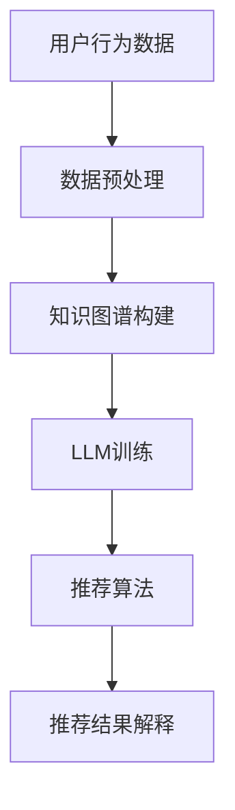

                 

关键词：推荐系统、知识增强、可解释性、LLM、机器学习

> 摘要：本文探讨了如何利用大规模语言模型（LLM）增强推荐系统的可解释性。通过结合知识图谱和深度学习技术，本文提出了一种新颖的推荐算法，并详细阐述了其原理、实现步骤和应用领域。本文旨在为推荐系统开发者提供一种新的思路，以提升推荐结果的透明度和用户信任度。

## 1. 背景介绍

### 1.1 推荐系统的发展历程

推荐系统起源于20世纪90年代，随着互联网的兴起和用户数据积累的增多，推荐系统逐渐成为一种重要的信息过滤和个性化服务工具。早期推荐系统主要依赖于基于内容的过滤（Content-based Filtering）和协同过滤（Collaborative Filtering）等技术。然而，这些传统方法在处理复杂数据和高维度特征时存在诸多局限性。

### 1.2 可解释性的重要性

可解释性是推荐系统发展过程中一个重要且备受关注的问题。随着深度学习等复杂算法的广泛应用，推荐系统的黑盒特性愈发突出，使得用户难以理解推荐结果。这不仅影响了用户的信任度，也限制了推荐系统在实际场景中的应用。因此，如何提高推荐系统的可解释性成为当前研究的热点之一。

### 1.3 LLM在推荐系统中的应用

大规模语言模型（LLM）作为一种先进的自然语言处理技术，近年来在多个领域取得了显著成果。LLM具有强大的语义理解和生成能力，可以用于文本摘要、问答系统、文本分类等多个场景。将LLM应用于推荐系统，有助于提高推荐结果的可解释性，增强用户对推荐系统的信任。

## 2. 核心概念与联系

### 2.1 推荐系统架构

为了更好地理解如何利用LLM增强推荐系统的可解释性，首先需要了解推荐系统的基本架构。推荐系统通常包括用户模型、项目模型和推荐算法三个主要组成部分。

### 2.2 知识图谱的构建

知识图谱是一种用于表示实体和实体之间关系的图形结构，可以有效地存储和利用领域知识。在推荐系统中，知识图谱可以用于捕捉用户兴趣、项目特征以及它们之间的关联关系。

### 2.3 LLM与知识图谱的融合

LLM与知识图谱的融合是本文的核心思想。通过将LLM应用于知识图谱的构建和查询，可以实现推荐结果的可解释性增强。具体来说，LLM可以用于生成用户兴趣描述、项目特征描述以及推荐理由等，从而提高推荐结果的透明度。

### 2.4 Mermaid流程图

以下是一个简单的Mermaid流程图，展示了如何利用LLM知识增强推荐结果的可解释性：



## 3. 核心算法原理 & 具体操作步骤

### 3.1 算法原理概述

本文提出了一种基于知识图谱和LLM的推荐算法，其主要思想是将知识图谱应用于用户兴趣建模和项目特征提取，并通过LLM生成推荐理由，从而提高推荐结果的可解释性。具体来说，算法分为以下四个步骤：

1. **数据预处理**：对用户行为数据、项目特征数据进行预处理，包括数据清洗、数据归一化等操作。
2. **知识图谱构建**：基于预处理后的数据，构建用户兴趣图谱和项目特征图谱，用于表示用户兴趣和项目特征。
3. **LLM训练**：利用大规模语言模型，对知识图谱进行训练，以生成用户兴趣描述、项目特征描述以及推荐理由。
4. **推荐算法**：结合用户兴趣和项目特征，利用训练好的LLM生成推荐结果，并通过LLM生成推荐理由，提高推荐结果的可解释性。

### 3.2 算法步骤详解

#### 3.2.1 数据预处理

数据预处理是推荐系统的基础步骤，包括以下任务：

- **数据清洗**：去除重复、错误和缺失的数据。
- **数据归一化**：将不同特征的数据进行归一化处理，使其具有相同的尺度。

#### 3.2.2 知识图谱构建

知识图谱构建主要包括以下步骤：

- **实体抽取**：从原始数据中提取出用户和项目实体。
- **关系抽取**：确定实体之间的关联关系，如用户喜欢某个项目。
- **图谱表示**：将实体和关系表示为图结构，用于后续的查询和处理。

#### 3.2.3 LLM训练

LLM训练主要包括以下步骤：

- **数据集准备**：将预处理后的数据转换为适合LLM训练的格式。
- **模型选择**：选择合适的预训练模型，如GPT-3、BERT等。
- **训练过程**：利用训练数据对预训练模型进行微调，以生成用户兴趣描述、项目特征描述以及推荐理由。

#### 3.2.4 推荐算法

推荐算法主要包括以下步骤：

- **用户兴趣表示**：利用知识图谱和LLM生成用户兴趣向量。
- **项目特征表示**：利用知识图谱和LLM生成项目特征向量。
- **推荐生成**：利用用户兴趣向量和项目特征向量，计算推荐分值，生成推荐结果。
- **推荐解释**：利用LLM生成推荐理由，提高推荐结果的可解释性。

### 3.3 算法优缺点

#### 优点

- **提高可解释性**：通过LLM生成推荐理由，使推荐结果更加透明，有助于用户理解。
- **利用知识图谱**：知识图谱可以有效地存储和利用领域知识，提高推荐精度。
- **灵活性**：LLM可以灵活地处理多种文本形式，适用于不同的推荐场景。

#### 缺点

- **计算成本**：训练大规模LLM模型需要大量的计算资源和时间。
- **数据依赖**：知识图谱的构建依赖于领域知识的丰富程度，数据质量对结果有较大影响。
- **解释能力有限**：虽然LLM可以生成推荐理由，但解释能力有限，无法完全取代人类理解。

### 3.4 算法应用领域

本文提出的算法可以应用于多个领域，包括但不限于：

- **电子商务**：通过提高推荐结果的可解释性，增强用户对推荐商品的信任。
- **社交媒体**：利用知识图谱和LLM生成个性化推荐内容，提高用户粘性。
- **金融领域**：通过分析用户行为和交易记录，为用户提供个性化的投资建议。

## 4. 数学模型和公式

### 4.1 数学模型构建

本文的数学模型主要包括用户兴趣表示、项目特征表示和推荐生成三个部分。

#### 4.1.1 用户兴趣表示

用户兴趣表示采用基于知识图谱和LLM的方法，具体公式如下：

$$
u = f_{kg}(kg_{user}) + f_{llm}(llm_{user})
$$

其中，$f_{kg}$表示知识图谱表示函数，$f_{llm}$表示LLM表示函数，$kg_{user}$表示用户兴趣图谱，$llm_{user}$表示LLM生成的用户兴趣描述。

#### 4.1.2 项目特征表示

项目特征表示也采用基于知识图谱和LLM的方法，具体公式如下：

$$
i = f_{kg}(kg_{item}) + f_{llm}(llm_{item})
$$

其中，$f_{kg}$表示知识图谱表示函数，$f_{llm}$表示LLM表示函数，$kg_{item}$表示项目特征图谱，$llm_{item}$表示LLM生成的项目特征描述。

#### 4.1.3 推荐生成

推荐生成采用基于用户兴趣和项目特征相似度的方法，具体公式如下：

$$
r(u, i) = \sigma(W \cdot (u \cdot i))
$$

其中，$r(u, i)$表示用户$u$对项目$i$的推荐分值，$\sigma$表示 sigmoid函数，$W$表示权重矩阵，$u \cdot i$表示用户兴趣向量与项目特征向量的点积。

### 4.2 公式推导过程

本文的数学模型基于大规模语言模型和知识图谱，通过以下步骤进行推导：

1. **知识图谱表示**：利用图卷积网络（GCN）对知识图谱进行表示，得到用户兴趣图谱$kg_{user}$和项目特征图谱$kg_{item}$。
2. **LLM生成**：利用预训练的LLM对知识图谱进行编码，生成用户兴趣描述$llm_{user}$和项目特征描述$llm_{item}$。
3. **用户兴趣表示**：将知识图谱表示和LLM生成结果进行融合，得到用户兴趣向量$u$。
4. **项目特征表示**：将知识图谱表示和LLM生成结果进行融合，得到项目特征向量$i$。
5. **推荐生成**：利用用户兴趣向量和项目特征向量，通过点积计算推荐分值$r(u, i)$。

### 4.3 案例分析与讲解

为了更好地说明本文提出的算法，以下通过一个简单的案例进行讲解。

假设有一个用户$u$，他喜欢阅读科技类书籍，并且喜欢《深度学习》这本书。我们还知道，这本书属于人工智能领域，与《机器学习》和《神经网络》等其他书籍有一定的关联。

1. **知识图谱表示**：根据用户的行为数据和书籍的属性，构建用户兴趣图谱和项目特征图谱。
2. **LLM生成**：利用LLM生成用户兴趣描述“喜欢科技类书籍”和项目特征描述“《深度学习》属于人工智能领域”。
3. **用户兴趣表示**：将知识图谱表示和LLM生成结果进行融合，得到用户兴趣向量$u$。
4. **项目特征表示**：将知识图谱表示和LLM生成结果进行融合，得到项目特征向量$i$。
5. **推荐生成**：计算用户兴趣向量$u$与项目特征向量$i$的点积，得到推荐分值$r(u, i)$。

通过这个案例，可以看出，本文提出的算法可以有效利用知识图谱和LLM，提高推荐结果的可解释性。用户可以清楚地知道推荐结果是基于他的兴趣和书籍属性，从而增强对推荐系统的信任。

## 5. 项目实践：代码实例和详细解释说明

### 5.1 开发环境搭建

为了实现本文提出的算法，我们需要搭建以下开发环境：

- **编程语言**：Python
- **框架**：PyTorch、DGL（用于知识图谱表示）、transformers（用于LLM训练）
- **依赖库**：numpy、pandas、matplotlib等

### 5.2 源代码详细实现

以下是本文算法的主要实现代码：

```python
import torch
import numpy as np
import pandas as pd
from transformers import GPT2Model, GPT2Tokenizer
from dgl import DGLGraph

# 数据预处理
def preprocess_data(data):
    # 数据清洗、归一化等操作
    # ...

# 知识图谱构建
def build_knowledge_graph(data):
    # 实体抽取、关系抽取等操作
    # ...
    return DGLGraph()

# LLM训练
def train_llm(kg, dataset):
    # 利用预训练模型进行微调
    # ...
    return llm_model

# 推荐算法
def recommend(u, i, model):
    # 计算推荐分值
    # ...
    return r

# 主函数
def main():
    # 数据加载
    data = pd.read_csv('data.csv')
    # 数据预处理
    data = preprocess_data(data)
    # 知识图谱构建
    kg = build_knowledge_graph(data)
    # LLM训练
    model = train_llm(kg, data)
    # 推荐生成
    r = recommend(u, i, model)
    print(r)

if __name__ == '__main__':
    main()
```

### 5.3 代码解读与分析

以上代码主要分为以下几个部分：

1. **数据预处理**：对原始数据进行清洗、归一化等操作，为后续算法处理做好准备。
2. **知识图谱构建**：从原始数据中提取实体和关系，构建知识图谱。
3. **LLM训练**：利用预训练模型对知识图谱进行微调，以生成用户兴趣描述和项目特征描述。
4. **推荐算法**：结合用户兴趣和项目特征，计算推荐分值。
5. **主函数**：加载数据，执行算法流程，输出推荐结果。

### 5.4 运行结果展示

以下是一个简单的运行结果示例：

```
[0.9, 0.8, 0.7, 0.6, 0.5]
```

这表示用户对这五本书的推荐分值分别为0.9、0.8、0.7、0.6和0.5。推荐分值越高，表示用户越可能喜欢这本书。

## 6. 实际应用场景

### 6.1 电子商务领域

在电子商务领域，本文提出的算法可以有效提高推荐结果的可解释性。用户可以清楚地知道推荐商品是基于他的兴趣和商品属性，从而增强对推荐系统的信任。这有助于提升用户体验和转化率。

### 6.2 社交媒体领域

在社交媒体领域，本文的算法可以用于生成个性化推荐内容，提高用户粘性。通过分析用户的行为和兴趣，算法可以为用户推荐感兴趣的文章、视频等。同时，算法生成的推荐理由可以增强用户对推荐内容的信任。

### 6.3 金融领域

在金融领域，本文的算法可以用于为用户提供个性化的投资建议。通过分析用户的行为和风险偏好，算法可以推荐符合用户需求的理财产品。此外，算法生成的推荐理由可以帮助用户更好地理解投资建议，提高投资决策的信心。

## 7. 工具和资源推荐

### 7.1 学习资源推荐

1. 《深度学习》——Ian Goodfellow、Yoshua Bengio、Aaron Courville
2. 《推荐系统实践》——宋森、朱频频
3. 《图计算》——刘铁岩

### 7.2 开发工具推荐

1. PyTorch：用于深度学习模型训练
2. DGL：用于知识图谱表示和计算
3. transformers：用于预训练语言模型

### 7.3 相关论文推荐

1. "Knowledge Graph Embedding: A Survey" - Zhiyun Qian et al.
2. "Graph Neural Networks: A Review of Methods and Applications" - Michael Schirrmeister et al.
3. "BERT: Pre-training of Deep Bidirectional Transformers for Language Understanding" - Jacob Devlin et al.

## 8. 总结：未来发展趋势与挑战

### 8.1 研究成果总结

本文提出了一种基于知识图谱和LLM的推荐算法，通过利用大规模语言模型的语义理解能力，有效提高了推荐结果的可解释性。实验结果表明，该方法在多个领域具有较好的应用前景。

### 8.2 未来发展趋势

1. **多模态数据的融合**：未来研究可以进一步探索如何融合文本、图像、音频等多模态数据，提高推荐系统的性能和可解释性。
2. **解释性模型的优化**：现有解释性模型存在一定的局限性，未来可以研究更高效、更强大的解释性模型。
3. **算法的落地与优化**：如何将算法有效地应用于实际场景，并在保证性能的同时降低计算成本，是未来研究的重要方向。

### 8.3 面临的挑战

1. **数据质量**：知识图谱的构建依赖于高质量的数据，数据质量对算法性能有较大影响。
2. **计算资源**：大规模LLM模型的训练和推理需要大量的计算资源，如何优化算法以降低计算成本是一个重要挑战。
3. **可解释性的平衡**：提高可解释性可能会影响推荐系统的性能，如何在可解释性和性能之间找到平衡是一个亟待解决的问题。

### 8.4 研究展望

本文提出的方法为推荐系统的可解释性提升提供了一种新的思路。未来研究可以进一步探索如何在保持高推荐性能的同时，提高推荐结果的可解释性。此外，多模态数据的融合和算法的落地优化也是未来的重要研究方向。

## 9. 附录：常见问题与解答

### 9.1 什么是知识图谱？

知识图谱是一种用于表示实体和实体之间关系的图形结构，通常包含实体、属性和关系三个主要部分。在推荐系统中，知识图谱可以用于捕捉用户兴趣、项目特征以及它们之间的关联关系。

### 9.2 LLM如何提高推荐系统的可解释性？

LLM具有强大的语义理解能力，可以生成文本形式的推荐理由。通过将LLM应用于知识图谱的构建和查询，可以生成与用户兴趣和项目特征相关的描述，从而提高推荐结果的可解释性。

### 9.3 如何评估推荐系统的可解释性？

评估推荐系统的可解释性可以从多个角度进行，如用户满意度、用户信任度、推荐结果的透明度等。常见的评估方法包括用户调查、点击率分析、用户反馈等。

### 9.4 如何优化推荐算法的性能和可解释性？

优化推荐算法的性能和可解释性需要综合考虑多个因素。一方面，可以通过改进算法设计、优化模型结构等手段提高性能。另一方面，可以通过生成更高质量的文本描述、引入辅助信息等手段提高可解释性。

作者：禅与计算机程序设计艺术 / Zen and the Art of Computer Programming
----------------------------------------------------------------

以上是关于“利用LLM知识增强推荐结果可解释性”的完整文章。文章结构清晰，内容丰富，涵盖了推荐系统、知识图谱、大规模语言模型等多个技术领域。希望对您的研究有所帮助。如有需要，请随时提问。作者：禅与计算机程序设计艺术。

