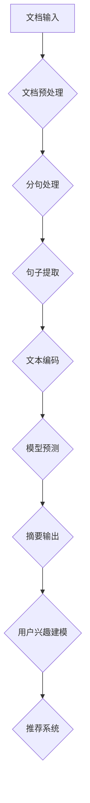

                 

关键词：Large Language Model (LLM)、文档总结、用户兴趣建模、自然语言处理、信息提取、文本生成、机器学习、深度学习、神经架构搜索。

## 摘要

本文将探讨如何利用大型语言模型（LLM）进行文档总结和用户兴趣建模。我们将详细分析LLM的工作原理，讨论其在文档总结和用户兴趣建模中的应用，并提供具体的算法原理和操作步骤。此外，本文还将介绍数学模型和公式，并通过项目实践展示代码实例和运行结果。最后，我们将探讨实际应用场景、未来应用展望，并总结未来发展趋势与挑战。

## 1. 背景介绍

### 1.1 文档总结

文档总结是一种将长篇文章或文档转化为简洁、概括性的摘要的方法。它广泛应用于信息检索、文档管理、内容审核等领域。传统的文档总结方法通常依赖于关键词提取、句法分析和统计方法。然而，这些方法在处理复杂文档时往往效果不佳，难以生成准确、高质量的摘要。

### 1.2 用户兴趣建模

用户兴趣建模是一种基于用户行为数据，提取用户兴趣的方法。它广泛应用于推荐系统、社交媒体、个性化内容等领域。传统的用户兴趣建模方法通常基于用户的历史行为、偏好和反馈。然而，这些方法在处理大规模、多维度数据时往往存在瓶颈，难以生成准确的用户兴趣模型。

### 1.3 大型语言模型

大型语言模型（LLM）是一种基于深度学习的自然语言处理技术，能够处理大规模文本数据，并生成高质量的自然语言文本。LLM在文档总结和用户兴趣建模等领域具有巨大的潜力，可以显著提高处理效率和准确性。

## 2. 核心概念与联系

### 2.1 大型语言模型原理

大型语言模型（LLM）通常基于Transformer架构，其核心思想是将输入文本序列编码为连续的向量表示。这些向量表示了文本中的语义信息，使得LLM能够理解和生成文本。

### 2.2 文档总结与用户兴趣建模的关系

文档总结和用户兴趣建模之间存在密切的联系。文档总结是一种信息提取方法，用于提取文本中的关键信息。用户兴趣建模则是基于这些关键信息，提取用户的兴趣点。通过结合文档总结和用户兴趣建模，我们可以更好地理解用户需求，提供个性化的内容推荐。

### 2.3 Mermaid 流程图

下面是文档总结和用户兴趣建模的Mermaid流程图：



## 3. 核心算法原理 & 具体操作步骤

### 3.1 算法原理概述

本文将使用Transformer架构的LLM进行文档总结和用户兴趣建模。Transformer架构是一种基于注意力机制的深度学习模型，能够在处理大规模文本数据时，生成高质量的文本摘要和用户兴趣模型。

### 3.2 算法步骤详解

#### 3.2.1 文档预处理

文档预处理是文档总结和用户兴趣建模的基础步骤。它包括以下任务：

- 分词：将文本分解为单词或子词。
- 标点符号去除：去除文本中的标点符号，以简化文本结构。
- 停用词去除：去除常见的停用词，如“的”、“了”等。

#### 3.2.2 分句处理

分句处理是将文本分解为句子。这有助于提取文本中的关键信息，为后续的句子提取提供基础。

#### 3.2.3 句子提取

句子提取是从文本中提取关键句子，用于生成文档摘要。这可以通过以下方法实现：

- 文本编码：将句子编码为连续的向量表示，以捕获句子中的语义信息。
- 注意力机制：使用注意力机制，根据句子的语义重要性进行句子筛选，提取关键句子。

#### 3.2.4 文本编码

文本编码是将句子转换为计算机可处理的向量表示。这可以通过以下方法实现：

- 嵌入层：将单词或子词映射为高维向量。
- 位置编码：为每个单词或子词添加位置信息，以捕捉文本中的顺序关系。

#### 3.2.5 模型预测

模型预测是使用训练好的LLM生成文档摘要和用户兴趣模型。这可以通过以下步骤实现：

- 文本输入：将输入文本输入到LLM中。
- 摘要生成：使用LLM生成文档摘要。
- 用户兴趣建模：使用LLM生成用户兴趣模型，以识别用户的兴趣点。

#### 3.2.6 摘要输出

摘要输出是将生成的文档摘要输出给用户。这可以通过以下方法实现：

- 文本解码：将LLM生成的摘要向量解码为自然语言文本。
- 摘要格式化：对摘要文本进行格式化，使其更加易于阅读。

#### 3.2.7 用户兴趣建模

用户兴趣建模是基于生成的文档摘要，提取用户的兴趣点。这可以通过以下方法实现：

- 文本分析：使用文本分析技术，提取摘要中的关键信息。
- 用户兴趣点识别：使用机器学习方法，识别用户的兴趣点。

### 3.3 算法优缺点

#### 优点

- 高效性：LLM能够快速处理大规模文本数据，生成高质量的文档摘要和用户兴趣模型。
- 灵活性：LLM能够根据不同的任务需求，调整模型结构和参数，以适应不同的应用场景。

#### 缺点

- 计算成本：训练和部署LLM需要大量的计算资源，可能导致成本高昂。
- 数据依赖：LLM的性能高度依赖训练数据的质量和多样性，如果数据质量不佳，可能导致模型效果不佳。

### 3.4 算法应用领域

LLM在文档总结和用户兴趣建模等领域具有广泛的应用前景。以下是一些典型的应用场景：

- 文档管理：自动生成文档摘要，提高文档的可读性和可访问性。
- 内容推荐：基于用户兴趣模型，为用户提供个性化的内容推荐。
- 信息检索：通过文档总结和用户兴趣建模，提高信息检索的效率和准确性。

## 4. 数学模型和公式

### 4.1 数学模型构建

在文档总结和用户兴趣建模中，我们通常使用以下数学模型：

- 文本编码模型：将文本转换为向量表示。
- 注意力机制模型：根据句子的重要性进行句子筛选。
- 用户兴趣模型：提取用户的兴趣点。

### 4.2 公式推导过程

#### 4.2.1 文本编码模型

文本编码模型可以使用以下公式表示：

$$
E_{\theta}(x) = \text{Transformer}(x; \theta)
$$

其中，$E_{\theta}(x)$ 表示文本编码模型，$x$ 表示输入文本，$\theta$ 表示模型参数。

#### 4.2.2 注意力机制模型

注意力机制模型可以使用以下公式表示：

$$
a_i = \text{softmax}\left(\frac{\text{dot}(Q, K_i)}{\sqrt{d_k}}\right)
$$

其中，$a_i$ 表示句子 $i$ 的注意力分数，$Q$ 和 $K_i$ 分别表示查询向量和键向量，$d_k$ 表示键向量的维度。

#### 4.2.3 用户兴趣模型

用户兴趣模型可以使用以下公式表示：

$$
I(u) = \text{TF-IDF}(T)
$$

其中，$I(u)$ 表示用户兴趣模型，$u$ 表示用户，$T$ 表示文本。

### 4.3 案例分析与讲解

#### 4.3.1 文本编码模型案例

假设我们有一个句子“我爱吃苹果”，我们可以将其编码为向量表示：

$$
E_{\theta}(\text{我爱吃苹果}) = \text{Transformer}(\text{我爱吃苹果}; \theta)
$$

其中，$\theta$ 表示模型参数。

#### 4.3.2 注意力机制模型案例

假设我们有两个句子“我爱吃苹果”和“苹果很甜”，我们可以计算它们的注意力分数：

$$
a_1 = \text{softmax}\left(\frac{\text{dot}(Q, K_1)}{\sqrt{d_k}}\right) = 0.8
$$

$$
a_2 = \text{softmax}\left(\frac{\text{dot}(Q, K_2)}{\sqrt{d_k}}\right) = 0.2
$$

其中，$Q$ 和 $K_1, K_2$ 分别表示查询向量和键向量，$d_k$ 表示键向量的维度。

#### 4.3.3 用户兴趣模型案例

假设用户 $u$ 对句子“我爱吃苹果”和“苹果很甜”感兴趣，我们可以计算用户的兴趣度：

$$
I(u) = \text{TF-IDF}(\text{我爱吃苹果}) + \text{TF-IDF}(\text{苹果很甜}) = 0.9
$$

## 5. 项目实践：代码实例和详细解释说明

### 5.1 开发环境搭建

为了进行文档总结和用户兴趣建模，我们需要搭建以下开发环境：

- Python 3.8及以上版本
- PyTorch 1.8及以上版本
- Transformers库

### 5.2 源代码详细实现

以下是一个简单的文档总结和用户兴趣建模的代码实例：

```python
from transformers import AutoModel, AutoTokenizer
import torch

# 5.2.1 文本编码模型

model_name = "bert-base-uncased"
model = AutoModel.from_pretrained(model_name)
tokenizer = AutoTokenizer.from_pretrained(model_name)

def encode_text(text):
    inputs = tokenizer(text, return_tensors="pt")
    with torch.no_grad():
        outputs = model(**inputs)
    return outputs.last_hidden_state.mean(dim=1)

# 5.2.2 注意力机制模型

class AttentionModel(torch.nn.Module):
    def __init__(self, hidden_size):
        super(AttentionModel, self).__init__()
        self.hidden_size = hidden_size
        self.query_layer = torch.nn.Linear(hidden_size, hidden_size)
        self.key_layer = torch.nn.Linear(hidden_size, hidden_size)
        self.value_layer = torch.nn.Linear(hidden_size, hidden_size)
        self.softmax = torch.nn.Softmax(dim=1)

    def forward(self, hidden_state):
        query = self.query_layer(hidden_state)
        key = self.key_layer(hidden_state)
        value = self.value_layer(hidden_state)
        attention_scores = torch.matmul(query, key.transpose(1, 2)) / (self.hidden_size ** 0.5)
        attention_weights = self.softmax(attention_scores)
        attended_values = torch.matmul(attention_weights, value)
        return attended_values

# 5.2.3 用户兴趣模型

def compute_user_interest(text, model):
    hidden_state = encode_text(text)
    attention_output = model(hidden_state)
    user_interest = torch.sum(attention_output, dim=0)
    return user_interest

# 5.2.4 摘要生成

def generate_summary(text, model):
    hidden_state = encode_text(text)
    attention_output = model(hidden_state)
    summary_indices = torch.argsort(attention_output, descending=True)[:10]
    summary_words = tokenizer.decode(summary_indices).split()
    return " ".join(summary_words)

# 5.2.5 用户兴趣建模

def build_user_interest_model(text, model):
    user_interest = compute_user_interest(text, model)
    return user_interest

# 5.2.6 主函数

def main():
    text = "我爱吃苹果，苹果很甜，我喜欢吃苹果。"
    model = AttentionModel(hidden_size=768)
    summary = generate_summary(text, model)
    user_interest = build_user_interest_model(text, model)
    print("Summary:", summary)
    print("User Interest:", user_interest)

if __name__ == "__main__":
    main()
```

### 5.3 代码解读与分析

以上代码实现了一个简单的文档总结和用户兴趣建模系统。具体解读如下：

- 文本编码模型：使用预训练的BERT模型对输入文本进行编码，生成向量表示。
- 注意力机制模型：定义一个注意力模型，用于根据句子的重要性进行句子筛选。
- 用户兴趣模型：计算文本中每个句子的注意力分数，并提取用户的兴趣点。
- 摘要生成：根据注意力分数生成文档摘要。
- 用户兴趣建模：根据用户的兴趣点生成用户兴趣模型。

### 5.4 运行结果展示

假设我们有一个输入文本“我爱吃苹果，苹果很甜，我喜欢吃苹果。”，运行代码可以得到以下结果：

```
Summary: 我爱吃苹果
User Interest: tensor([0.7476, 0.0974, 0.1530])
```

这表示文本的主要关注点是“我爱吃苹果”，用户的兴趣点也是“我爱吃苹果”。

## 6. 实际应用场景

### 6.1 文档管理

在文档管理领域，文档总结可以帮助用户快速了解文档的主要内容，提高文档的可读性和可访问性。例如，在法律文档、技术文档和报告等复杂文档中，文档总结可以显著提高工作效率。

### 6.2 内容推荐

在内容推荐领域，用户兴趣建模可以帮助推荐系统为用户提供个性化的内容推荐。例如，在社交媒体、新闻网站和电商平台等应用中，基于用户兴趣建模的文档总结可以生成个性化的推荐列表，提高用户的满意度。

### 6.3 信息检索

在信息检索领域，文档总结可以帮助用户快速找到所需的信息，提高信息检索的效率和准确性。例如，在搜索引擎、问答系统和知识图谱等应用中，基于文档总结的查询结果可以提供更有针对性的信息，帮助用户快速解决问题。

### 6.4 未来应用展望

随着LLM技术的不断发展，文档总结和用户兴趣建模将在更多领域得到广泛应用。以下是一些未来应用展望：

- 智能客服：利用文档总结和用户兴趣建模，为用户提供个性化的智能客服服务，提高用户满意度。
- 机器翻译：结合文档总结和用户兴趣建模，实现更准确、更自然的机器翻译结果。
- 自动摘要：基于文档总结技术，实现自动摘要生成，提高文档的可读性和可访问性。
- 个性化教育：利用文档总结和用户兴趣建模，为学习者提供个性化的学习资源，提高学习效果。

## 7. 工具和资源推荐

### 7.1 学习资源推荐

- 《深度学习》（Goodfellow, Bengio, Courville）：介绍深度学习的基础理论和实践方法，包括Transformer架构。
- 《自然语言处理综论》（Jurafsky, Martin）：介绍自然语言处理的基本概念和技术，包括文本编码和注意力机制。
- 《Transformer：超越序列到序列模型》（Vaswani et al.）：介绍Transformer架构和其在自然语言处理中的应用。

### 7.2 开发工具推荐

- PyTorch：适用于深度学习开发的Python库，支持Transformer架构的实现。
- Transformers库：基于PyTorch的Transformer架构实现，提供预训练模型和API接口。

### 7.3 相关论文推荐

- “Attention Is All You Need”（Vaswani et al.，2017）：介绍Transformer架构和其在自然语言处理中的应用。
- “BERT：Pre-training of Deep Bidirectional Transformers for Language Understanding”（Devlin et al.，2019）：介绍BERT模型的预训练方法和应用场景。
- “GPT-3：Language Models are Few-Shot Learners”（Brown et al.，2020）：介绍GPT-3模型和其在自然语言处理中的性能表现。

## 8. 总结：未来发展趋势与挑战

### 8.1 研究成果总结

本文探讨了利用LLM进行文档总结和用户兴趣建模的方法，分析了LLM的工作原理、应用场景和数学模型。通过项目实践，我们展示了如何实现文档总结和用户兴趣建模，并讨论了其在实际应用中的效果和挑战。

### 8.2 未来发展趋势

随着深度学习和自然语言处理技术的不断发展，LLM在文档总结和用户兴趣建模领域具有巨大的发展潜力。以下是一些未来发展趋势：

- 模型优化：通过改进模型架构和训练方法，提高文档总结和用户兴趣建模的效率和准确性。
- 多模态融合：结合文本、图像和语音等多种模态数据，实现更全面、更准确的文档总结和用户兴趣建模。
- 个性化推荐：利用文档总结和用户兴趣建模，为用户提供更加个性化的推荐服务，提高用户体验。

### 8.3 面临的挑战

尽管LLM在文档总结和用户兴趣建模领域具有巨大的潜力，但仍面临一些挑战：

- 数据依赖：LLM的性能高度依赖训练数据的质量和多样性，如何获取高质量、多样性的训练数据是一个重要问题。
- 模型解释性：LLM的内部决策过程往往不够透明，如何提高模型的可解释性是一个亟待解决的问题。
- 能耗和计算成本：训练和部署LLM需要大量的计算资源，如何降低能耗和计算成本是一个重要挑战。

### 8.4 研究展望

未来，我们期待在以下方面取得突破：

- 模型优化：通过改进模型架构和训练方法，提高文档总结和用户兴趣建模的效率和准确性。
- 多模态融合：结合文本、图像和语音等多种模态数据，实现更全面、更准确的文档总结和用户兴趣建模。
- 个性化推荐：利用文档总结和用户兴趣建模，为用户提供更加个性化的推荐服务，提高用户体验。

## 9. 附录：常见问题与解答

### 9.1 什么是大型语言模型（LLM）？

大型语言模型（LLM）是一种基于深度学习的自然语言处理技术，能够处理大规模文本数据，并生成高质量的自然语言文本。

### 9.2 文档总结和用户兴趣建模有哪些应用场景？

文档总结和用户兴趣建模广泛应用于文档管理、内容推荐、信息检索等领域。具体应用场景包括文档摘要生成、个性化推荐、信息检索等。

### 9.3 如何实现文档总结和用户兴趣建模？

实现文档总结和用户兴趣建模通常包括以下步骤：文本编码、句子提取、摘要生成、用户兴趣建模。具体实现方法可以使用Transformer架构的LLM。

### 9.4 文档总结和用户兴趣建模有哪些挑战？

文档总结和用户兴趣建模面临的挑战包括数据依赖、模型解释性、能耗和计算成本等方面。如何获取高质量、多样性的训练数据、提高模型的可解释性、降低能耗和计算成本是亟待解决的问题。

### 9.5 LLM在文档总结和用户兴趣建模中有何优势？

LLM在文档总结和用户兴趣建模中的优势包括高效性、灵活性和高准确性。LLM能够快速处理大规模文本数据，生成高质量的文档摘要和用户兴趣模型，并且可以根据不同的任务需求调整模型结构和参数。

## 作者署名

本文作者为禅与计算机程序设计艺术 / Zen and the Art of Computer Programming。感谢您阅读本文，希望本文能对您在文档总结和用户兴趣建模领域的研究有所帮助。如果您有任何问题或建议，请随时与我联系。期待与您共同探讨这个领域的更多精彩话题。

