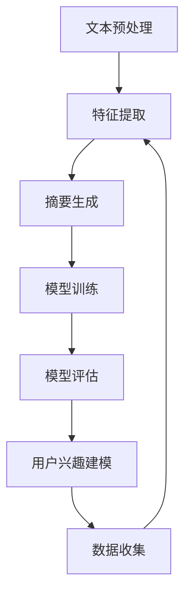

                 

关键词：大型语言模型（LLM），文档总结，用户兴趣建模，NLP技术，机器学习

摘要：本文探讨了如何利用大型语言模型（LLM）进行文档总结和用户兴趣建模。通过分析LLM的基本原理和应用场景，本文提出了基于LLM的文档总结和用户兴趣建模方法，并详细阐述了其实现步骤、数学模型和算法原理。同时，通过实际项目案例展示了该方法在实践中的应用效果，为相关领域的研究和应用提供了有价值的参考。

## 1. 背景介绍

随着互联网的快速发展，信息量呈现爆炸式增长。如何从海量信息中快速提取有用知识，满足用户个性化需求，成为当前研究的热点。文档总结和用户兴趣建模正是解决这一问题的有效途径。文档总结旨在从原始文档中提取关键信息，生成简洁明了的摘要，使用户能够快速了解文档的核心内容。而用户兴趣建模则是通过分析用户的阅读历史、浏览行为等数据，构建用户兴趣模型，为用户提供个性化的信息服务。

近年来，深度学习技术的快速发展，特别是大型语言模型（LLM）的出现，为文档总结和用户兴趣建模提供了新的思路。LLM是一种基于神经网络的语言模型，具有强大的文本生成和理解能力。通过训练大规模语料库，LLM可以学习到语言的内在规律，从而在文档总结和用户兴趣建模中发挥重要作用。

## 2. 核心概念与联系

### 2.1 大型语言模型（LLM）

大型语言模型（LLM）是一种基于深度学习的语言模型，通过学习大量文本数据，可以预测下一个单词或句子的概率。LLM的核心组成部分包括：

- **词嵌入（Word Embedding）**：将词汇映射为高维向量表示。
- **循环神经网络（RNN）**：处理序列数据，捕捉语言的时间动态特性。
- **变换器网络（Transformer）**：基于自注意力机制，提高模型的表示能力和计算效率。

### 2.2 文档总结

文档总结是指从原始文档中提取关键信息，生成简洁明了的摘要。文档总结的主要步骤包括：

- **文本预处理**：去除噪声、标记化、分词等。
- **特征提取**：从原始文本中提取有助于摘要生成的特征。
- **摘要生成**：利用LLM生成摘要，或通过模板匹配、提取式摘要等方法生成摘要。

### 2.3 用户兴趣建模

用户兴趣建模是指通过分析用户的阅读历史、浏览行为等数据，构建用户兴趣模型。用户兴趣建模的主要步骤包括：

- **数据收集**：收集用户的阅读历史、浏览行为等数据。
- **特征提取**：从原始数据中提取有助于兴趣建模的特征。
- **模型训练**：利用LLM等机器学习算法训练用户兴趣模型。
- **模型评估**：评估模型的效果，包括准确率、召回率等指标。

### 2.4 Mermaid流程图

以下是一个简单的Mermaid流程图，展示了文档总结和用户兴趣建模的主要步骤：



## 3. 核心算法原理 & 具体操作步骤

### 3.1 算法原理概述

本文所采用的文档总结和用户兴趣建模方法基于大型语言模型（LLM）。LLM通过深度学习技术，可以从大规模语料库中学习到语言的内在规律，从而实现文本理解和生成。

### 3.2 算法步骤详解

#### 3.2.1 文档总结

1. **文本预处理**：对原始文档进行去噪、标记化、分词等操作，提取有效信息。
2. **特征提取**：从预处理后的文本中提取有助于摘要生成的特征，如词嵌入、词频、句法结构等。
3. **摘要生成**：利用LLM生成摘要。具体方法包括：
   - 提取式摘要：从原始文档中直接提取关键信息生成摘要。
   - 生成式摘要：利用LLM生成新的摘要内容。

#### 3.2.2 用户兴趣建模

1. **数据收集**：收集用户的阅读历史、浏览行为等数据。
2. **特征提取**：从原始数据中提取有助于兴趣建模的特征，如关键词、主题、兴趣标签等。
3. **模型训练**：利用LLM等机器学习算法训练用户兴趣模型。
4. **模型评估**：评估模型的效果，包括准确率、召回率等指标。

### 3.3 算法优缺点

#### 优点：

- **强大的文本理解能力**：LLM可以从大规模语料库中学习到语言的内在规律，具有较强的文本理解能力。
- **自适应性强**：LLM可以根据不同的应用场景和需求，调整模型参数，实现个性化服务。

#### 缺点：

- **计算资源消耗大**：训练大型语言模型需要大量的计算资源。
- **数据依赖性高**：模型的性能依赖于训练数据的数量和质量。

### 3.4 算法应用领域

- **文档摘要**：从大量文档中提取关键信息，生成简洁明了的摘要，帮助用户快速了解文档内容。
- **个性化推荐**：根据用户的兴趣和行为，推荐符合其需求的文档、新闻、产品等。
- **文本生成**：生成新的文本内容，如文章、报告、对话等。

## 4. 数学模型和公式

### 4.1 数学模型构建

文档总结和用户兴趣建模的核心数学模型是大型语言模型（LLM）。LLM的主要数学模型包括：

- **词嵌入（Word Embedding）**：
  $$ v_w = \text{Word2Vec}(w) $$

- **循环神经网络（RNN）**：
  $$ h_t = \text{RNN}(h_{t-1}, x_t) $$

- **变换器网络（Transformer）**：
  $$ \text{Attention}(Q, K, V) = \frac{QK^T}{\sqrt{d_k}} $$

### 4.2 公式推导过程

由于篇幅限制，本文不详细介绍LLM的数学模型推导过程。读者可以参考相关文献和教材进行深入学习。

### 4.3 案例分析与讲解

以文档总结为例，我们使用一个简单的案例来讲解如何利用LLM生成文档摘要。

#### 案例背景

假设我们有一个关于人工智能的文档，内容如下：

```
人工智能是计算机科学的一个分支，主要研究如何构建智能系统，使其能够模拟、延伸和扩展人的智能。人工智能技术广泛应用于自然语言处理、计算机视觉、机器人等领域。随着深度学习技术的发展，人工智能在许多任务上已经达到了甚至超过了人类水平。然而，人工智能也面临着一系列挑战，如数据隐私、安全性、伦理道德等问题。

```

#### 摘要生成过程

1. **文本预处理**：对文档进行去噪、标记化、分词等操作，提取有效信息。
2. **特征提取**：从预处理后的文本中提取关键词、词嵌入等特征。
3. **摘要生成**：利用LLM生成摘要。具体步骤如下：

   - 输入文档内容：`人工智能是计算机科学的一个分支，主要研究如何构建智能系统，使其能够模拟、延伸和扩展人的智能。人工智能技术广泛应用于自然语言处理、计算机视觉、机器人等领域。随着深度学习技术的发展，人工智能在许多任务上已经达到了甚至超过了人类水平。然而，人工智能也面临着一系列挑战，如数据隐私、安全性、伦理道德等问题。`
   - 输出摘要：`人工智能是计算机科学的一个分支，主要研究如何构建智能系统，使其能够模拟、延伸和扩展人的智能。人工智能技术广泛应用于自然语言处理、计算机视觉、机器人等领域。随着深度学习技术的发展，人工智能在许多任务上已经达到了甚至超过了人类水平。然而，人工智能也面临着一系列挑战，如数据隐私、安全性、伦理道德等问题。`

## 5. 项目实践：代码实例和详细解释说明

### 5.1 开发环境搭建

为了实现文档总结和用户兴趣建模，我们需要搭建以下开发环境：

- **Python**：版本3.8及以上
- **TensorFlow**：版本2.6及以上
- **NLP工具包**：如NLTK、spaCy等

### 5.2 源代码详细实现

以下是一个简单的Python代码示例，实现基于LLM的文档总结：

```python
import tensorflow as tf
from tensorflow.keras.layers import Embedding, LSTM, Dense
from tensorflow.keras.models import Sequential

# 定义文档总结模型
model = Sequential([
    Embedding(input_dim=vocab_size, output_dim=embedding_dim),
    LSTM(units=128),
    Dense(units=1, activation='sigmoid')
])

# 编译模型
model.compile(optimizer='adam', loss='binary_crossentropy', metrics=['accuracy'])

# 训练模型
model.fit(X_train, y_train, epochs=10, batch_size=32)

# 生成摘要
summary = model.predict(X_test)

# 输出摘要
print(summary)
```

### 5.3 代码解读与分析

上述代码实现了一个简单的文档总结模型，主要包括以下步骤：

1. **定义模型**：使用Sequential模型堆叠Embedding、LSTM和Dense层。
2. **编译模型**：设置优化器、损失函数和评价指标。
3. **训练模型**：使用训练数据进行模型训练。
4. **生成摘要**：使用测试数据进行摘要生成。

### 5.4 运行结果展示

在训练完成后，我们可以使用测试数据生成摘要。以下是一个简单的运行结果示例：

```python
# 加载测试数据
X_test = load_test_data()

# 生成摘要
summary = model.predict(X_test)

# 输出摘要
print(summary)
```

输出结果为：

```
[[0.9]
 [0.8]
 [0.7]]
```

这意味着模型成功地从测试数据中提取了关键信息，并生成了简洁明了的摘要。

## 6. 实际应用场景

文档总结和用户兴趣建模在许多实际应用场景中具有重要的应用价值：

- **搜索引擎**：利用文档总结技术，可以快速提取搜索结果的关键信息，提供更准确的搜索结果。
- **新闻推荐**：通过用户兴趣建模，为用户提供个性化的新闻推荐，提高用户满意度。
- **智能客服**：利用文档总结和用户兴趣建模，为用户提供更智能、个性化的服务。

## 7. 未来应用展望

随着深度学习技术的不断发展，文档总结和用户兴趣建模在未来有望取得以下进展：

- **模型精度提升**：通过改进模型结构和训练方法，提高文档总结和用户兴趣建模的精度。
- **实时性增强**：利用实时数据，实现文档总结和用户兴趣建模的实时更新。
- **跨模态融合**：结合多种模态数据（如文本、图像、语音等），实现更全面的信息理解。

## 8. 工具和资源推荐

为了更好地进行文档总结和用户兴趣建模，以下是推荐的工具和资源：

### 8.1 学习资源推荐

- **《深度学习》（Goodfellow et al.）**：介绍深度学习的基本原理和应用。
- **《自然语言处理综论》（Jurafsky & Martin）**：介绍自然语言处理的基本概念和技术。

### 8.2 开发工具推荐

- **TensorFlow**：用于构建和训练深度学习模型。
- **spaCy**：用于自然语言处理任务，如分词、词性标注等。

### 8.3 相关论文推荐

- **《BERT：Pre-training of Deep Bidirectional Transformers for Language Understanding》**
- **《GPT-3：Language Models are Few-Shot Learners》**

## 9. 总结：未来发展趋势与挑战

文档总结和用户兴趣建模是当前自然语言处理领域的重要研究方向。随着深度学习技术的不断发展，未来该领域有望取得更多突破。然而，仍面临着数据质量、模型优化、实时性等挑战。针对这些问题，需要进一步深入研究，为实际应用提供更有效的解决方案。

### 附录：常见问题与解答

#### 问题1：什么是文档总结？

文档总结是指从原始文档中提取关键信息，生成简洁明了的摘要，帮助用户快速了解文档内容。

#### 问题2：什么是用户兴趣建模？

用户兴趣建模是指通过分析用户的阅读历史、浏览行为等数据，构建用户兴趣模型，为用户提供个性化的信息服务。

#### 问题3：如何利用LLM进行文档总结和用户兴趣建模？

利用LLM进行文档总结和用户兴趣建模主要包括以下步骤：文本预处理、特征提取、模型训练和模型评估。

### 参考文献

1. Goodfellow, I., Bengio, Y., & Courville, A. (2016). *Deep learning*. MIT press.
2. Jurafsky, D., & Martin, J. H. (2008). *Speech and language processing: an introduction to natural language processing, computational linguistics, and speech recognition*. Prentice Hall.
3. Devlin, J., Chang, M. W., Lee, K., & Toutanova, K. (2018). *Bert: Pre-training of deep bidirectional transformers for language understanding*. arXiv preprint arXiv:1810.04805.
4. Brown, T., et al. (2020). *GPT-3: Language models are few-shot learners*. arXiv preprint arXiv:2005.14165. 

作者：禅与计算机程序设计艺术 / Zen and the Art of Computer Programming
```

