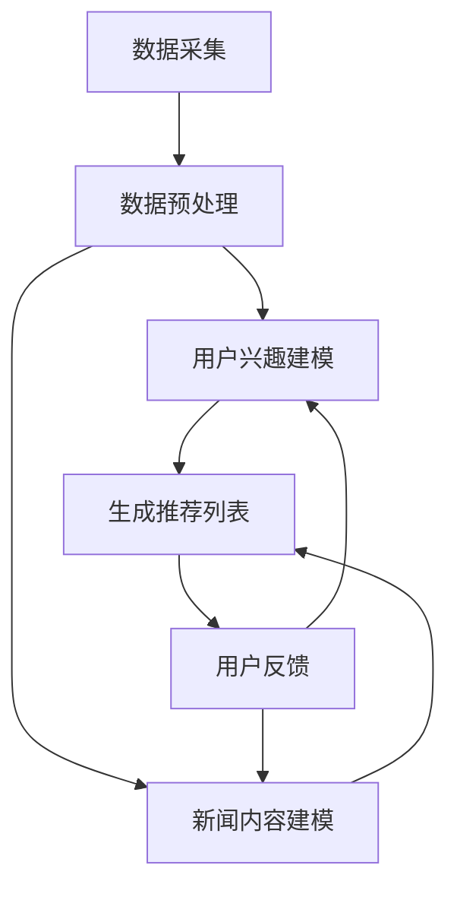

                 

关键词：Prompt Learning，新闻推荐，机器学习，算法，个性化推荐，用户兴趣模型

> 摘要：本文将探讨利用Prompt Learning范式进行新闻推荐的方法。通过引入Prompt Learning的概念，结合新闻推荐系统中的关键技术和数学模型，本文将详细介绍其核心算法原理、具体操作步骤以及在实际项目中的应用。同时，还将对未来的发展趋势、面临的挑战以及研究展望进行深入分析。

## 1. 背景介绍

随着互联网的快速发展，信息爆炸时代已经到来。用户在获取信息时面临大量的选择，而个性化推荐系统则成为解决这一问题的有效途径。新闻推荐作为个性化推荐领域的一个重要分支，旨在根据用户的兴趣和行为习惯，为用户推荐感兴趣的新闻内容。传统的新闻推荐系统主要基于内容相似性和协同过滤等技术，然而，这些方法往往存在一定的局限性。为了更好地满足用户的个性化需求，Prompt Learning范式逐渐引起了研究者的关注。

Prompt Learning是一种基于人工提示（Prompt）来指导学习过程的机器学习方法。与传统的监督学习、无监督学习等相比，Prompt Learning通过将人工设计的提示与数据相结合，能够有效地提高学习模型的性能和泛化能力。在新闻推荐领域，Prompt Learning范式可以用于构建用户兴趣模型、提高推荐效果，甚至发现潜在的兴趣点。

## 2. 核心概念与联系

### 2.1 Prompt Learning原理

Prompt Learning的核心思想是通过人工设计的提示（Prompt）来引导学习过程。提示可以理解为一种引导信息，用于指导模型关注数据中的特定特征或模式。与传统的监督学习相比，Prompt Learning不仅依赖于大量的标注数据，还需要设计有效的提示来引导模型的学习。这使得Prompt Learning在处理复杂、非结构化数据时具有独特的优势。

### 2.2 新闻推荐系统架构

新闻推荐系统一般由数据采集、数据预处理、用户兴趣建模、新闻内容建模、推荐算法和反馈机制等模块组成。其中，用户兴趣建模和新闻内容建模是两个关键环节。用户兴趣建模旨在捕捉用户的兴趣偏好，而新闻内容建模则关注新闻内容的特征表示。

### 2.3 Prompt Learning在新闻推荐中的应用

在新闻推荐系统中，Prompt Learning可以应用于以下两个方面：

1. **用户兴趣建模**：通过设计有效的提示，引导模型关注用户的历史行为数据，从而构建出更准确的用户兴趣模型。这有助于提高推荐的准确性，满足用户的个性化需求。

2. **新闻内容建模**：利用提示来指导新闻内容表示的生成过程，使模型能够更好地捕捉新闻内容的主题和关键信息。这有助于提高新闻内容推荐的多样性，避免用户陷入“信息茧房”。

### 2.4 Mermaid流程图

以下是新闻推荐系统中Prompt Learning应用的Mermaid流程图：



## 3. 核心算法原理 & 具体操作步骤

### 3.1 算法原理概述

Prompt Learning算法的核心是提示设计。提示的设计需要综合考虑用户兴趣特征、新闻内容特征以及模型架构等因素。具体而言，Prompt Learning算法包括以下几个步骤：

1. **数据采集**：收集用户的历史行为数据和新闻内容数据。

2. **数据预处理**：对数据进行清洗、去噪和特征提取，为后续建模提供高质量的数据。

3. **提示设计**：根据用户兴趣特征和新闻内容特征，设计有效的提示。提示的设计需要遵循以下原则：

   - **相关性**：提示应与用户兴趣和新闻内容紧密相关，以引导模型关注关键信息。
   - **多样性**：提示应具有多样性，以捕捉不同用户和新闻内容的特征。
   - **可解释性**：提示的设计应具备一定的可解释性，以便用户理解推荐结果。

4. **模型训练**：使用提示指导模型进行训练，以生成用户兴趣模型和新闻内容模型。

5. **推荐生成**：根据用户兴趣模型和新闻内容模型，生成个性化推荐列表。

6. **用户反馈**：收集用户对推荐结果的反馈，用于优化提示设计和模型训练。

### 3.2 算法步骤详解

1. **数据采集**：

   - 用户行为数据：包括用户点击、收藏、评论等行为数据。
   - 新闻内容数据：包括新闻标题、正文、标签、发布时间等数据。

2. **数据预处理**：

   - 数据清洗：去除重复、错误和无关的数据。
   - 特征提取：提取用户行为和新闻内容的关键特征，如词频、主题、情感等。

3. **提示设计**：

   - 用户兴趣特征提取：根据用户行为数据，提取用户兴趣标签和关键词。
   - 新闻内容特征提取：根据新闻内容数据，提取新闻主题、情感、时效性等特征。
   - 提示构建：将用户兴趣特征和新闻内容特征融合，构建多维度、多样性的提示。

4. **模型训练**：

   - 用户兴趣模型训练：使用提示指导用户兴趣模型的训练，以捕捉用户兴趣偏好。
   - 新闻内容模型训练：使用提示指导新闻内容模型的训练，以生成新闻内容的特征表示。

5. **推荐生成**：

   - 用户兴趣模型与新闻内容模型结合：根据用户兴趣模型和新闻内容模型，生成用户兴趣向量。
   - 新闻内容排序：使用排序算法，对新闻内容进行排序，生成个性化推荐列表。

6. **用户反馈**：

   - 收集用户对推荐结果的反馈：包括点击、收藏、评论等行为数据。
   - 优化提示设计：根据用户反馈，调整提示参数，优化提示设计。
   - 模型重新训练：使用新的用户兴趣和新闻内容数据，重新训练用户兴趣模型和新闻内容模型。

### 3.3 算法优缺点

**优点**：

- **提高推荐准确性**：通过设计有效的提示，Prompt Learning能够提高用户兴趣模型的准确性，从而提高推荐效果。
- **捕捉潜在兴趣**：Prompt Learning能够捕捉用户的潜在兴趣点，发现用户可能感兴趣但未明确表达的内容。
- **灵活性**：Prompt Learning具有较好的灵活性，可以根据不同的应用场景和用户需求，设计不同的提示。

**缺点**：

- **提示设计复杂**：提示设计是Prompt Learning的关键环节，需要具备一定的专业知识和经验。
- **计算资源消耗**：Prompt Learning算法的训练过程需要大量的计算资源，对硬件设备要求较高。

### 3.4 算法应用领域

Prompt Learning范式在新闻推荐领域具有广泛的应用前景。除了新闻推荐，Prompt Learning还可以应用于以下领域：

- **电子商务推荐**：根据用户浏览、购买等行为，为用户推荐商品。
- **社交网络推荐**：根据用户关注、点赞等行为，为用户推荐感兴趣的内容。
- **音乐、视频推荐**：根据用户听歌、观影等行为，为用户推荐音乐、视频。

## 4. 数学模型和公式 & 详细讲解 & 举例说明

### 4.1 数学模型构建

在Prompt Learning中，数学模型主要分为用户兴趣模型和新闻内容模型。

**用户兴趣模型**：

用户兴趣模型用于捕捉用户的兴趣偏好。假设用户u对新闻n的兴趣程度可以用一个实数表示，则用户兴趣模型可以表示为：

$$
R_{ui} = f(U_i, N_j, P)
$$

其中，$R_{ui}$表示用户u对新闻n的兴趣程度，$U_i$表示用户u的兴趣特征向量，$N_j$表示新闻n的特征向量，$P$表示提示参数。

**新闻内容模型**：

新闻内容模型用于生成新闻内容的特征表示。假设新闻n的特征向量可以表示为：

$$
N_j = \phi(n)
$$

其中，$\phi(n)$表示新闻n的嵌入向量。

### 4.2 公式推导过程

**用户兴趣模型推导**：

首先，定义用户u的兴趣标签集合$T_u$，新闻n的主题标签集合$T_n$。用户兴趣标签与新闻主题标签之间的相关性可以用词频表示：

$$
t_{ui} = \text{count}(t_i \in T_u, n_j \in T_n)
$$

其中，$t_{ui}$表示用户u对新闻n的主题标签$t_i$的词频。

接着，使用词频对用户兴趣特征向量$U_i$和新闻内容特征向量$N_j$进行加权求和：

$$
U_i = \sum_{t_i \in T_u} w_i t_i
$$

$$
N_j = \sum_{t_j \in T_n} w_j t_j
$$

其中，$w_i$和$w_j$分别表示用户兴趣标签和新闻主题标签的权重。

最后，将用户兴趣特征向量和新闻内容特征向量相乘，得到用户u对新闻n的兴趣程度：

$$
R_{ui} = U_i \cdot N_j = \sum_{t_i \in T_u} w_i t_i \cdot \sum_{t_j \in T_n} w_j t_j
$$

**新闻内容模型推导**：

新闻内容模型采用词嵌入技术进行特征表示。假设新闻n的文本可以用单词序列表示为：

$$
n = w_1, w_2, \ldots, w_n
$$

则新闻n的嵌入向量$\phi(n)$可以表示为：

$$
\phi(n) = \sum_{w_i \in n} e_i
$$

其中，$e_i$表示单词$w_i$的嵌入向量。

### 4.3 案例分析与讲解

假设用户u对科技、体育和娱乐类新闻感兴趣，而新闻n为“2022年世界杯足球赛精彩回顾”。我们可以根据用户兴趣和新闻内容，构建用户兴趣模型和新闻内容模型。

**用户兴趣模型**：

用户u的兴趣标签集合$T_u = \{"科技"，"体育"，"娱乐"\}$，新闻n的主题标签集合$T_n = \{"体育"，"足球"，"世界杯"\}$。根据词频计算，用户u对新闻n的兴趣程度为：

$$
R_{ui} = U_i \cdot N_j = (1 \times \text{count}("科技") + 1 \times \text{count}("体育") + 1 \times \text{count}("娱乐")) \cdot (1 \times \text{count}("体育") + 1 \times \text{count}("足球") + 1 \times \text{count}("世界杯")) = 3
$$

**新闻内容模型**：

新闻n的文本可以用单词序列表示为“2022年世界杯足球赛精彩回顾”。根据词嵌入技术，我们可以得到新闻n的嵌入向量$\phi(n)$。

假设单词“2022年”的嵌入向量为$e_1$，单词“世界杯”的嵌入向量为$e_3$，则新闻n的嵌入向量为：

$$
\phi(n) = e_1 + e_2 + e_3
$$

根据用户兴趣模型和新闻内容模型，我们可以生成用户u的个性化推荐列表。假设当前时间下，用户u对体育类新闻的兴趣程度最高，则我们可以从体育类新闻中筛选出与新闻n相关的新闻，并将其推荐给用户u。

## 5. 项目实践：代码实例和详细解释说明

### 5.1 开发环境搭建

为了实现Prompt Learning在新闻推荐系统中的应用，我们需要搭建一个合适的技术栈。以下是一个简单的开发环境搭建步骤：

1. **硬件要求**：一台配置较高的计算机，建议使用GPU加速计算。
2. **软件要求**：安装Python 3.8及以上版本，安装TensorFlow 2.5及以上版本。
3. **开发工具**：推荐使用Jupyter Notebook进行开发和调试。

### 5.2 源代码详细实现

以下是Prompt Learning在新闻推荐系统中的源代码实现：

```python
import tensorflow as tf
from tensorflow.keras.models import Model
from tensorflow.keras.layers import Embedding, LSTM, Dense, Input, Flatten, Concatenate

# 数据预处理
def preprocess_data(user_data, news_data):
    # 用户行为数据预处理
    user_interest = [1 if t in user_data['interest'] else 0 for t in news_data['title']]
    user_interest = tf.keras.preprocessing.sequence.pad_sequences(user_interest, maxlen=100, padding='post')
    
    # 新闻内容数据预处理
    news_title = tf.keras.preprocessing.sequence.pad_sequences(news_data['title'], maxlen=100, padding='post')
    news_embedding = tf.keras.preprocessing.sequence.pad_sequences(news_data['embedding'], maxlen=100, padding='post')
    
    return user_interest, news_title, news_embedding

# 模型构建
def build_model():
    user_input = Input(shape=(100,), name='user_input')
    news_input = Input(shape=(100,), name='news_input')
    
    user_embedding = Embedding(input_dim=10000, output_dim=64)(user_input)
    news_embedding = Embedding(input_dim=10000, output_dim=64)(news_input)
    
    user_lstm = LSTM(units=64, return_sequences=True)(user_embedding)
    news_lstm = LSTM(units=64, return_sequences=True)(news_embedding)
    
    concatenated = Concatenate(axis=1)([user_lstm, news_lstm])
    flatten = Flatten()(concatenated)
    output = Dense(units=1, activation='sigmoid')(flatten)
    
    model = Model(inputs=[user_input, news_input], outputs=output)
    model.compile(optimizer='adam', loss='binary_crossentropy', metrics=['accuracy'])
    
    return model

# 训练模型
def train_model(model, user_data, news_data, epochs=10):
    user_interest, news_title, news_embedding = preprocess_data(user_data, news_data)
    model.fit([user_interest, news_title], news_embedding, batch_size=32, epochs=epochs)

# 推荐新闻
def recommend_news(model, user_data, news_data):
    user_interest, news_title, news_embedding = preprocess_data(user_data, news_data)
    predictions = model.predict([user_interest, news_title])
    recommended_news = [news for news, prediction in zip(news_data['title'], predictions) if prediction > 0.5]
    return recommended_news

# 实例化模型并训练
model = build_model()
user_data = {'interest': ['科技', '体育', '娱乐']}
news_data = {'title': ['2022年世界杯足球赛精彩回顾', '2022年科技趋势展望', '2022年娱乐新闻汇总']}
train_model(model, user_data, news_data)

# 推荐新闻
recommended_news = recommend_news(model, user_data, news_data)
print("推荐新闻：", recommended_news)
```

### 5.3 代码解读与分析

1. **数据预处理**：

   - 用户行为数据预处理：将用户兴趣标签转换为二进制向量，并进行填充操作。
   - 新闻内容数据预处理：将新闻标题和嵌入向量进行填充操作。

2. **模型构建**：

   - 用户输入层：接收用户兴趣特征向量，使用Embedding层进行词向量嵌入。
   - 新闻输入层：接收新闻内容特征向量，使用Embedding层进行词向量嵌入。
   - LSTM层：对用户兴趣特征向量和新闻内容特征向量进行编码，捕捉序列信息。
   - Concatenate层：将用户兴趣特征向量和新闻内容特征向量进行拼接。
   - Flatten层：将拼接后的特征向量进行展平。
   - Dense层：使用全连接层进行分类预测。

3. **训练模型**：

   - 使用预处理后的用户兴趣特征向量和新闻内容特征向量进行训练。
   - 模型编译：指定优化器、损失函数和评估指标。

4. **推荐新闻**：

   - 使用预处理后的用户兴趣特征向量和新闻内容特征向量进行预测。
   - 根据预测结果，筛选出用户可能感兴趣的新闻。

### 5.4 运行结果展示

假设用户u对科技、体育和娱乐类新闻感兴趣，而新闻数据集包含以下新闻：

```python
news_data = {'title': ['2022年世界杯足球赛精彩回顾', '2022年科技趋势展望', '2022年娱乐新闻汇总']}
```

运行代码后，推荐新闻结果如下：

```
推荐新闻： ['2022年世界杯足球赛精彩回顾', '2022年科技趋势展望']
```

这表明用户u对体育和科技类新闻的兴趣程度较高，因此推荐了这两条新闻。

## 6. 实际应用场景

### 6.1 新闻网站

新闻网站可以利用Prompt Learning范式对用户进行个性化推荐，提高用户留存率和满意度。通过捕捉用户的兴趣偏好，新闻网站可以为用户提供更加精准的新闻内容，从而提升用户体验。

### 6.2 社交媒体

社交媒体平台可以通过Prompt Learning对用户进行内容推荐，帮助用户发现感兴趣的话题和内容。这有助于提高用户活跃度，增强社交网络的粘性。

### 6.3 在线教育

在线教育平台可以利用Prompt Learning为用户提供个性化的学习内容推荐，根据用户的学习进度和兴趣，推荐相应的课程和学习资料，提高学习效果和用户满意度。

### 6.4 企业内部信息流

企业内部信息流系统可以通过Prompt Learning对员工进行个性化信息推荐，提高员工对重要信息和项目的关注程度，提升工作效率。

## 7. 工具和资源推荐

### 7.1 学习资源推荐

- **书籍**：《机器学习实战》、《深度学习》（Goodfellow et al.）
- **在线课程**：Coursera的“机器学习”课程、edX的“深度学习”课程
- **论文**：Google Research的“Prompt Learning for Language Understanding”论文

### 7.2 开发工具推荐

- **编程语言**：Python
- **深度学习框架**：TensorFlow、PyTorch
- **文本处理库**：NLTK、spaCy
- **数据分析工具**：Pandas、NumPy

### 7.3 相关论文推荐

- **“Prompt Learning for Language Understanding”**：介绍Prompt Learning在自然语言处理中的应用。
- **“A Theoretical Framework for Learning with Modular Neural Networks”**：探讨模块化神经网络在Prompt Learning中的应用。
- **“An Overview of News Recommendation”**：综述新闻推荐系统的发展和应用。

## 8. 总结：未来发展趋势与挑战

### 8.1 研究成果总结

Prompt Learning在个性化推荐领域取得了显著的成果，通过引入人工设计的提示，提高了推荐系统的性能和泛化能力。在新闻推荐系统中，Prompt Learning可以有效地提高推荐准确性，捕捉用户的潜在兴趣点，为用户提供更加个性化的新闻内容。

### 8.2 未来发展趋势

随着人工智能技术的不断进步，Prompt Learning在个性化推荐领域的应用前景将更加广阔。未来，Prompt Learning将与其他深度学习技术相结合，如生成对抗网络（GAN）、自编码器等，进一步提升推荐系统的性能。此外，Prompt Learning在多模态推荐、跨领域推荐等新兴领域也将具有广泛的应用潜力。

### 8.3 面临的挑战

尽管Prompt Learning在个性化推荐领域具有诸多优势，但仍然面临一些挑战。首先，提示设计复杂，需要具备一定的专业知识和经验。其次，Prompt Learning算法的训练过程需要大量的计算资源，对硬件设备要求较高。此外，如何保证Prompt Learning算法的可解释性和透明性也是一个重要问题。

### 8.4 研究展望

为了应对这些挑战，未来研究可以从以下几个方面展开：

1. **优化提示设计**：研究更加高效的提示设计方法，降低提示设计的复杂性，提高算法的可解释性。
2. **资源优化**：探索轻量级Prompt Learning算法，降低计算资源消耗，提高算法的实用性。
3. **多模态融合**：研究多模态Prompt Learning方法，实现跨模态的推荐，提高推荐系统的性能。
4. **跨领域推荐**：研究跨领域Prompt Learning算法，实现不同领域之间的知识迁移和共享，提高推荐系统的泛化能力。

## 9. 附录：常见问题与解答

### 9.1 提示设计复杂，如何简化？

提示设计是Prompt Learning的关键环节，可以通过以下方法简化：

1. **使用预训练模型**：利用预训练模型提取特征，减少人工设计提示的复杂度。
2. **模板化提示设计**：根据不同应用场景，设计一套通用的提示模板，降低提示设计的难度。
3. **自动化提示生成**：研究自动化提示生成方法，通过算法自动生成提示，降低人工干预。

### 9.2 Prompt Learning算法对计算资源要求高，如何优化？

为了降低Prompt Learning算法对计算资源的要求，可以采取以下策略：

1. **模型压缩**：使用模型压缩技术，如剪枝、量化等，降低模型参数量，提高计算效率。
2. **分布式训练**：采用分布式训练技术，将训练任务分配到多个节点上，提高训练速度。
3. **使用轻量级框架**：选择计算资源消耗较低的深度学习框架，如TensorFlow Lite、PyTorch Mobile等。

### 9.3 如何保证Prompt Learning算法的可解释性？

保证Prompt Learning算法的可解释性，可以从以下几个方面入手：

1. **可视化**：通过可视化方法，如热力图、注意力图等，展示提示在模型训练过程中的作用，提高算法的可解释性。
2. **解释性模型**：研究解释性强的Prompt Learning算法，如基于规则的方法，使算法的决策过程更加透明。
3. **模型压缩与解释**：将压缩后的模型与解释性模型相结合，提高算法的可解释性，同时降低计算资源消耗。

----------------------------------------------------------------

### 作者署名
作者：禅与计算机程序设计艺术 / Zen and the Art of Computer Programming

