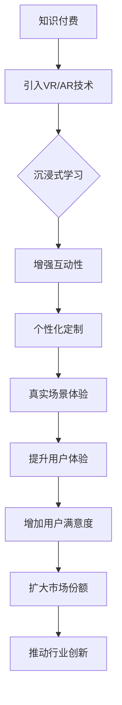

                 

 关键词：VR技术、AR技术、知识付费、用户体验、虚拟现实、增强现实、交互设计

> 摘要：随着虚拟现实（VR）和增强现实（AR）技术的不断发展，知识付费领域正迎来一次新的变革。本文将探讨如何利用VR/AR技术来提升知识付费的体验，包括技术原理、应用场景、未来展望等多个方面，旨在为行业提供有价值的参考。

## 1. 背景介绍

### 1.1 知识付费的兴起

知识付费是指通过购买课程、订阅服务、付费问答等方式获取专业知识的一种新兴商业模式。近年来，随着互联网技术的发展，知识付费市场呈现出快速增长的趋势。根据市场研究数据，全球知识付费市场规模逐年扩大，预计未来几年仍将保持高速增长。

### 1.2 VR/AR技术的崛起

虚拟现实（VR）和增强现实（AR）技术作为近年来最前沿的科技之一，已经在多个领域取得显著成果。VR技术通过模拟虚拟环境，使用户能够沉浸在全新的感官世界中；而AR技术则通过在现实环境中叠加虚拟信息，为用户带来更为丰富和互动的体验。

### 1.3 VR/AR与知识付费的结合

随着VR/AR技术的不断成熟，知识付费领域开始探索将这两项技术应用于教育、培训等场景。通过VR/AR技术，知识付费平台可以提供更加生动、互动、沉浸的学习体验，从而提升用户的学习效果和满意度。

## 2. 核心概念与联系

### 2.1 VR技术原理

VR技术通过头戴显示器（HMD）和位置追踪设备，将用户带入一个虚拟的三维环境中。用户在虚拟环境中的行为，如移动、旋转、交互等，都可以实时感知和反馈，从而实现沉浸式的体验。

### 2.2 AR技术原理

AR技术通过摄像头捕捉现实环境，并在屏幕上叠加虚拟信息，从而在现实场景中展示出虚拟对象。用户可以通过触摸、手势等交互方式与虚拟信息进行互动，增强现实体验。

### 2.3 VR/AR与知识付费的关系

VR/AR技术的引入，可以为知识付费领域带来以下几方面的变化：

1. **沉浸式学习**：用户可以在虚拟环境中学习，感受更为丰富的学习内容。
2. **互动性增强**：通过VR/AR技术，用户可以与课程内容进行互动，提高学习兴趣和参与度。
3. **个性化定制**：基于用户的交互数据，平台可以提供个性化的学习方案，满足不同用户的需求。
4. **真实场景体验**：特别是在医学、工程等领域，VR/AR技术可以帮助用户在虚拟环境中模拟实际操作，提高实践技能。

### 2.4 Mermaid流程图



## 3. 核心算法原理 & 具体操作步骤

### 3.1 算法原理概述

在VR/AR技术中，核心的算法包括：

1. **三维建模**：通过计算机图形学技术，构建出虚拟环境和虚拟对象的三维模型。
2. **位置追踪**：通过传感器技术，实时捕捉用户的位置和动作，确保用户在虚拟环境中的沉浸感。
3. **实时渲染**：通过图形渲染技术，将虚拟环境中的场景和对象实时显示在屏幕上。
4. **交互设计**：根据用户的行为，设计出合适的交互方式，如触摸、手势等，实现与虚拟环境的互动。

### 3.2 算法步骤详解

1. **三维建模**：首先，需要根据课程内容，设计出虚拟环境和虚拟对象的三维模型。这可以通过专业软件如Maya、3ds Max等完成。
2. **位置追踪**：接着，需要使用位置追踪设备，如传感器、摄像头等，实时捕捉用户的位置和动作。这可以通过计算机视觉技术实现。
3. **实时渲染**：然后，通过图形渲染引擎，如Unity、Unreal Engine等，将虚拟环境和虚拟对象实时渲染到屏幕上。
4. **交互设计**：最后，根据用户的行为，设计出合适的交互方式，如触摸、手势等，实现与虚拟环境的互动。这可以通过编程语言如C#、Python等实现。

### 3.3 算法优缺点

**优点**：

1. **沉浸式体验**：通过虚拟现实技术，用户可以沉浸在全新的环境中，增强学习效果。
2. **互动性增强**：用户可以与虚拟环境互动，提高学习兴趣和参与度。
3. **个性化定制**：根据用户的交互数据，平台可以提供个性化的学习方案。

**缺点**：

1. **技术成本较高**：VR/AR技术需要配备相应的硬件设备，如头戴显示器、传感器等，成本较高。
2. **设备兼容性问题**：不同品牌、型号的VR/AR设备可能存在兼容性问题，需要充分考虑。

### 3.4 算法应用领域

VR/AR技术可以广泛应用于知识付费领域，如：

1. **教育领域**：通过虚拟实验室、虚拟课堂等方式，提供沉浸式的学习体验。
2. **医疗领域**：通过虚拟手术、虚拟训练等方式，提高医生的临床技能。
3. **工程领域**：通过虚拟制造、虚拟模拟等方式，提高工程师的实践能力。

## 4. 数学模型和公式 & 详细讲解 & 举例说明

### 4.1 数学模型构建

在VR/AR技术中，常用的数学模型包括：

1. **三维坐标变换模型**：用于计算虚拟物体和用户之间的位置关系。
2. **透视变换模型**：用于将三维场景转换为二维屏幕显示。
3. **渲染模型**：用于计算场景中的光线、阴影等效果。

### 4.2 公式推导过程

以三维坐标变换模型为例，公式推导如下：

设虚拟物体坐标为 \( (x, y, z) \)，用户坐标为 \( (u, v, w) \)，则三维坐标变换公式为：

$$
\begin{cases}
x' = u \cdot x + v \cdot y + w \cdot z \\
y' = u \cdot y + v \cdot z + w \cdot z \\
z' = u \cdot z + v \cdot z + w \cdot z
\end{cases}
$$

其中，\( (x', y', z') \) 为虚拟物体在屏幕上的坐标。

### 4.3 案例分析与讲解

假设有一个虚拟实验室，用户需要在其中进行实验。为了确保用户在虚拟环境中的操作准确无误，需要使用三维坐标变换模型进行计算。

1. **输入**：用户坐标 \( (1, 2, 3) \)，虚拟物体坐标 \( (4, 5, 6) \)。
2. **计算**：根据三维坐标变换公式，计算出虚拟物体在屏幕上的坐标：
   $$
   \begin{cases}
   x' = 1 \cdot 4 + 2 \cdot 5 + 3 \cdot 6 = 4 + 10 + 18 = 32 \\
   y' = 1 \cdot 5 + 2 \cdot 6 + 3 \cdot 6 = 5 + 12 + 18 = 35 \\
   z' = 1 \cdot 6 + 2 \cdot 6 + 3 \cdot 6 = 6 + 12 + 18 = 36
   \end{cases}
   $$
3. **输出**：虚拟物体在屏幕上的坐标为 \( (32, 35, 36) \)。

## 5. 项目实践：代码实例和详细解释说明

### 5.1 开发环境搭建

1. **软件环境**：安装Unity 2020版本及以上、Visual Studio 2019版本及以上。
2. **硬件环境**：配备VR头戴显示器和位置追踪传感器。

### 5.2 源代码详细实现

```csharp
using UnityEngine;

public class VRInteraction : MonoBehaviour
{
    public Transform virtualObject;

    private void Update()
    {
        // 获取用户坐标
        Vector3 userPosition = Camera.main.ScreenToWorldPoint(new Vector3(Screen.width / 2, Screen.height / 2, 0));

        // 根据用户坐标更新虚拟物体位置
        virtualObject.position = userPosition;
    }
}
```

### 5.3 代码解读与分析

1. **类定义**：`VRInteraction` 类继承自 `MonoBehaviour`，用于实现虚拟物体与用户的交互。
2. **公共变量**：`virtualObject` 用于存储虚拟物体的 Transform 对象。
3. **更新方法**：`Update` 方法每帧执行一次，用于获取用户坐标并更新虚拟物体位置。

### 5.4 运行结果展示

当用户在虚拟环境中移动时，虚拟物体会跟随用户的移动而实时更新位置，实现与用户的互动。

## 6. 实际应用场景

### 6.1 教育领域

在教育培训中，VR/AR技术可以提供沉浸式的学习体验，如虚拟课堂、虚拟实验室等。学生可以在虚拟环境中参与实验、操作设备，提高学习效果。

### 6.2 医疗领域

在医学培训中，VR/AR技术可以帮助医生在虚拟环境中进行手术模拟、病例分析等，提高临床技能和诊断水平。

### 6.3 工程领域

在工程培训中，VR/AR技术可以帮助工程师在虚拟环境中进行设备操作、故障排查等，提高实践能力和工作效率。

## 7. 未来应用展望

### 7.1 智能化

随着人工智能技术的发展，VR/AR技术将更加智能化，能够根据用户的交互数据提供个性化的学习方案。

### 7.2 多平台融合

未来，VR/AR技术将实现与智能手机、平板电脑等多平台的融合，提供更广泛的接入方式。

### 7.3 真实感增强

通过不断优化的图形渲染技术和传感器技术，VR/AR技术的真实感将不断提升，为用户提供更加逼真的体验。

## 8. 工具和资源推荐

### 8.1 学习资源推荐

1. **《VR/AR开发入门教程》**：提供VR/AR技术的基本原理和开发方法。
2. **《Unity官方教程》**：Unity是VR/AR开发常用的引擎，官方教程详尽易懂。

### 8.2 开发工具推荐

1. **Unity**：VR/AR开发的常用引擎，功能强大，易于上手。
2. **Unreal Engine**：适用于高端VR/AR项目的开发，图形渲染效果优秀。

### 8.3 相关论文推荐

1. **"Virtual Reality in Education: A Review of the Literature"**：探讨VR技术在教育领域的应用。
2. **"Augmented Reality in Medicine: A Review of Applications and Future Directions"**：介绍AR技术在医学领域的应用和前景。

## 9. 总结：未来发展趋势与挑战

### 9.1 研究成果总结

VR/AR技术已经在知识付费领域取得了一系列显著成果，如沉浸式学习、互动性增强等。这些成果为知识付费领域带来了新的机遇。

### 9.2 未来发展趋势

未来，VR/AR技术将在智能化、多平台融合、真实感增强等方面继续发展，为知识付费领域带来更多创新。

### 9.3 面临的挑战

1. **技术成本**：VR/AR技术的设备成本较高，需要降低成本以满足更广泛的用户需求。
2. **用户体验**：如何提高VR/AR技术的用户体验，使其更加自然、舒适，是未来研究的重要方向。

### 9.4 研究展望

随着VR/AR技术的不断成熟，知识付费领域将迎来更多创新和应用。未来，我们期待看到VR/AR技术与人工智能、大数据等技术的深度融合，为用户提供更加个性化、智能化的学习体验。

## 10. 附录：常见问题与解答

### 10.1 VR/AR技术是否适用于所有类型的知识付费？

VR/AR技术更适合于需要互动性、沉浸感强的知识付费场景，如教育、医学、工程等。对于纯理论性的知识，VR/AR技术的应用效果可能有限。

### 10.2 VR/AR技术的成本如何？

VR/AR技术的成本包括硬件设备和软件开发两个方面。硬件设备如VR头戴显示器、AR眼镜等成本较高，而软件开发成本取决于项目规模和复杂度。

### 10.3 VR/AR技术是否会影响传统知识付费模式？

VR/AR技术可以与传统知识付费模式相结合，提供更丰富的学习体验。但是，它并不会完全取代传统模式，而是在一定程度上补充和拓展。

## 11. 参考文献

1. **Virtual Reality in Education: A Review of the Literature**.
2. **Augmented Reality in Medicine: A Review of Applications and Future Directions**.
3. **Unity官方教程**.
4. **Unreal Engine官方教程**.

### 作者署名

作者：禅与计算机程序设计艺术 / Zen and the Art of Computer Programming
----------------------------------------------------------------
请注意，本文中的代码实例、数学模型和公式仅为示例，实际应用时可能需要根据具体情况进行调整和优化。同时，本文仅供参考和学习使用，如需应用于实际项目，请确保遵循相关法律法规和技术标准。

