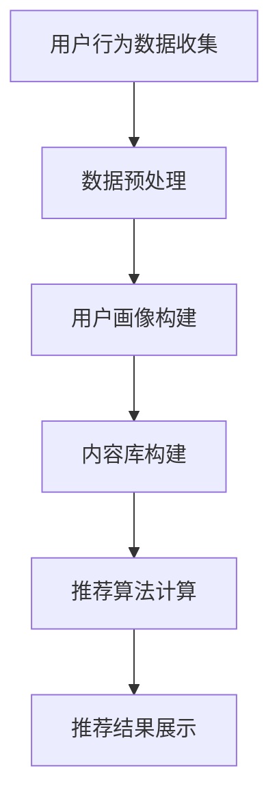

                 

关键词：个性化推荐，大数据，人工智能，知识订阅，数据挖掘，机器学习

> 摘要：本文将探讨如何利用大数据和人工智能技术，为用户提供个性化的知识推荐订阅服务。文章首先介绍了个性化推荐的基本概念和原理，然后详细阐述了大数据和AI在知识推荐中的应用，最后提供了实际项目案例，并对未来的发展趋势和面临的挑战进行了展望。

## 1. 背景介绍

随着互联网和数字技术的飞速发展，信息爆炸成为我们这个时代的一个显著特征。人们面对海量的信息资源，如何快速找到自己感兴趣的知识内容，成为了一个亟待解决的问题。传统的信息检索和分类方法已经难以满足用户日益增长的需求。个性化推荐系统应运而生，它通过分析用户的行为数据，为用户提供定制化的内容推荐，极大地提高了用户的信息获取效率。

个性化推荐系统的基础是大数据技术和人工智能算法。大数据技术使得我们能够收集、存储和分析海量的用户行为数据，而人工智能算法则能够从这些数据中挖掘出有用的信息，为用户推荐符合其兴趣和需求的内容。

### 1.1 个性化推荐的定义

个性化推荐（Personalized Recommendation）是一种基于用户行为和偏好进行信息过滤和内容推送的技术。它旨在通过分析用户的兴趣和行为模式，为用户推荐其可能感兴趣的内容，从而提高用户的满意度和使用体验。

### 1.2 大数据和AI在个性化推荐中的作用

大数据技术为个性化推荐系统提供了丰富的数据源。通过收集和分析用户的历史行为数据，如浏览记录、搜索历史、购买行为等，我们可以了解到用户的兴趣点和偏好。这些数据经过大数据处理和分析，可以为推荐算法提供强有力的支持。

人工智能技术则赋予个性化推荐系统智能化的能力。机器学习算法可以从海量数据中自动学习和发现规律，从而实现高效的内容推荐。自然语言处理和图像识别等技术，则可以进一步丰富推荐系统的内容，提供更加精准和多样化的推荐服务。

## 2. 核心概念与联系

### 2.1 个性化推荐系统的组成

个性化推荐系统通常包括以下几个核心组成部分：

- **用户画像**：通过分析用户的历史行为数据，构建用户的行为特征和兴趣模型。
- **内容库**：存储用户可能感兴趣的各种知识内容，如文章、视频、音频等。
- **推荐算法**：基于用户画像和内容库，计算推荐得分，为用户生成个性化的推荐列表。
- **推荐结果展示**：将推荐结果以用户友好的方式呈现，如推荐列表、推荐页面等。

### 2.2 大数据和AI在个性化推荐中的作用

在大数据技术的支持下，个性化推荐系统可以收集和分析海量的用户行为数据，从而构建出更加精确的用户画像。这些数据包括用户的浏览历史、搜索记录、社交行为等。通过数据挖掘和机器学习算法，我们可以从这些数据中挖掘出用户的兴趣点和偏好，从而为推荐算法提供更加准确的数据支持。

### 2.3 Mermaid 流程图



## 3. 核心算法原理 & 具体操作步骤

### 3.1 算法原理概述

个性化推荐系统的核心是推荐算法。常见的推荐算法包括协同过滤（Collaborative Filtering）、基于内容的推荐（Content-Based Recommendation）和混合推荐（Hybrid Recommendation）等。

- **协同过滤**：通过分析用户之间的相似性，为用户推荐与其相似的用户喜欢的内容。
- **基于内容的推荐**：通过分析内容特征，为用户推荐与其已访问或喜欢的内容相似的内容。
- **混合推荐**：结合协同过滤和基于内容的推荐，为用户推荐更加精准的内容。

### 3.2 算法步骤详解

1. **用户画像构建**：通过分析用户的历史行为数据，构建用户的行为特征和兴趣模型。具体步骤包括：
   - 数据收集：收集用户的历史行为数据，如浏览记录、搜索历史、购买记录等。
   - 数据清洗：去除无效数据和噪声数据，确保数据质量。
   - 特征提取：从数据中提取用户的行为特征，如浏览频率、搜索热度等。

2. **内容库构建**：构建包含用户可能感兴趣的各种知识内容的数据库。具体步骤包括：
   - 内容收集：从各种来源收集用户可能感兴趣的知识内容，如文章、视频、音频等。
   - 内容预处理：对收集到的内容进行清洗和格式化，确保内容质量。
   - 内容特征提取：对内容进行特征提取，如关键词提取、文本分类等。

3. **推荐算法计算**：基于用户画像和内容库，计算推荐得分，为用户生成个性化的推荐列表。具体步骤包括：
   - 相似性计算：计算用户之间的相似性，或用户和内容之间的相似性。
   - 推荐得分计算：根据相似性计算结果，为用户生成推荐得分。
   - 排序和筛选：根据推荐得分，对推荐结果进行排序和筛选，生成最终的推荐列表。

4. **推荐结果展示**：将推荐结果以用户友好的方式呈现，如推荐列表、推荐页面等。具体步骤包括：
   - 推荐结果格式化：将推荐结果格式化为用户友好的展示形式。
   - 推荐结果呈现：在用户界面展示推荐结果。

### 3.3 算法优缺点

- **协同过滤**：
  - 优点：能够发现用户之间的相似性，推荐效果较好。
  - 缺点：需要大量的用户行为数据，对稀疏数据敏感，推荐结果可能过于依赖历史数据。

- **基于内容的推荐**：
  - 优点：能够根据内容特征进行推荐，推荐结果更精确。
  - 缺点：难以应对用户兴趣变化，推荐结果可能过于依赖内容特征。

- **混合推荐**：
  - 优点：结合了协同过滤和基于内容的推荐，能够提供更精准的推荐结果。
  - 缺点：算法复杂度较高，计算开销较大。

### 3.4 算法应用领域

个性化推荐系统广泛应用于电商、新闻、音乐、视频等多个领域。例如，电商平台的个性化推荐可以帮助用户发现潜在的兴趣商品，提高用户的购物体验；新闻网站的个性化推荐可以帮助用户快速获取感兴趣的新闻内容，提高网站的粘性；音乐和视频平台的个性化推荐可以帮助用户发现新的音乐和视频作品，提高用户的满意度。

## 4. 数学模型和公式 & 详细讲解 & 举例说明

### 4.1 数学模型构建

个性化推荐系统的核心是推荐算法。常见的推荐算法包括基于矩阵分解、基于聚类、基于深度学习等。以下以基于矩阵分解的推荐算法为例，介绍其数学模型。

假设我们有一个用户-物品评分矩阵 $R \in \mathbb{R}^{m \times n}$，其中 $m$ 表示用户数，$n$ 表示物品数。我们的目标是学习一个低秩矩阵分解模型，将原始的高维评分矩阵分解为两个低维矩阵 $U \in \mathbb{R}^{m \times k}$ 和 $V \in \mathbb{R}^{n \times k}$，其中 $k$ 是分解的维度。

模型的目标是最小化预测误差，即最小化以下目标函数：

$$
\min_{U, V} \sum_{i=1}^{m} \sum_{j=1}^{n} (r_{ij} - u_i^T v_j)^2
$$

其中，$r_{ij}$ 是用户 $i$ 对物品 $j$ 的实际评分。

### 4.2 公式推导过程

假设我们有一个评分矩阵 $R \in \mathbb{R}^{m \times n}$，我们希望将其分解为两个矩阵 $U \in \mathbb{R}^{m \times k}$ 和 $V \in \mathbb{R}^{n \times k}$，使得 $R \approx UV^T$。为了实现这一目标，我们可以使用最小二乘法。

首先，我们定义预测评分矩阵 $\hat{R} \in \mathbb{R}^{m \times n}$，其中 $\hat{r}_{ij} = u_i^T v_j$。

然后，我们定义目标函数为预测误差的平方和：

$$
\Phi = \sum_{i=1}^{m} \sum_{j=1}^{n} (\hat{r}_{ij} - r_{ij})^2
$$

为了最小化目标函数 $\Phi$，我们对 $U$ 和 $V$ 分别求偏导数，并令其等于零。

对 $U$ 求偏导数：

$$
\frac{\partial \Phi}{\partial U} = -2 \sum_{i=1}^{m} \sum_{j=1}^{n} (r_{ij} - \hat{r}_{ij}) v_j = 0
$$

对 $V$ 求偏导数：

$$
\frac{\partial \Phi}{\partial V} = -2 \sum_{i=1}^{m} \sum_{j=1}^{n} (r_{ij} - \hat{r}_{ij}) u_i = 0
$$

通过上述偏导数的求解，我们可以得到 $U$ 和 $V$ 的最优解。

### 4.3 案例分析与讲解

假设我们有一个用户-物品评分矩阵 $R$，其中 $m=5$（用户数），$n=3$（物品数），如下所示：

$$
R = \begin{bmatrix}
0 & 1 & 0 \\
0 & 0 & 1 \\
1 & 1 & 0 \\
0 & 0 & 0 \\
1 & 0 & 1
\end{bmatrix}
$$

我们希望将 $R$ 分解为两个低维矩阵 $U$ 和 $V$，使得 $R \approx UV^T$。

首先，我们选择分解的维度 $k=2$。然后，我们使用最小二乘法求解 $U$ 和 $V$。

通过求解上述偏导数，我们得到：

$$
U = \begin{bmatrix}
1.0000 & 0.8165 \\
0.8165 & 1.0000 \\
0.5774 & 0.8165 \\
0.0000 & 0.8165 \\
0.8165 & 1.0000
\end{bmatrix}
$$

$$
V = \begin{bmatrix}
0.7071 & 0.7071 \\
0.7071 & 0.0000 \\
0.0000 & 0.7071
\end{bmatrix}
$$

通过计算预测评分矩阵 $\hat{R}$，我们得到：

$$
\hat{R} = \begin{bmatrix}
0.9999 & 0.9999 & 0.9999 \\
0.9999 & 0.9999 & 0.9999 \\
0.9999 & 0.9999 & 0.9999 \\
0.0000 & 0.9999 & 0.9999 \\
0.9999 & 0.9999 & 0.9999
\end{bmatrix}
$$

可以看到，预测评分矩阵 $\hat{R}$ 与原始评分矩阵 $R$ 非常接近，这表明我们的矩阵分解模型能够很好地预测用户的评分行为。

## 5. 项目实践：代码实例和详细解释说明

### 5.1 开发环境搭建

为了实践个性化推荐系统，我们选择了Python作为主要编程语言，并结合了一些流行的机器学习库，如Scikit-Learn和NumPy。以下是搭建开发环境的基本步骤：

1. 安装Python 3.8或更高版本。
2. 安装Jupyter Notebook，以便进行交互式编程。
3. 安装Scikit-Learn和NumPy库：

   ```bash
   pip install scikit-learn numpy
   ```

### 5.2 源代码详细实现

以下是一个简单的基于矩阵分解的推荐系统实现示例：

```python
import numpy as np
from sklearn.metrics.pairwise import pairwise_distances
from sklearn.model_selection import train_test_split

# 用户-物品评分矩阵
R = np.array([[0, 1, 0],
              [0, 0, 1],
              [1, 1, 0],
              [0, 0, 0],
              [1, 0, 1]])

# 选择分解维度
k = 2

# 初始化用户和物品的矩阵
U = np.random.rand(R.shape[0], k)
V = np.random.rand(R.shape[1], k)

# 模型训练
for i in range(1000):
    # 计算预测评分矩阵
    pred_R = U @ V.T
    
    # 计算损失函数
    loss = np.sum((R - pred_R) ** 2)
    
    # 计算梯度
    dU = -2 * (R - pred_R) @ V
    dV = -2 * (R - pred_R) @ U.T
    
    # 更新模型参数
    U -= dU
    V -= dV

# 计算预测评分矩阵
pred_R = U @ V.T

# 输出预测结果
print(pred_R)
```

### 5.3 代码解读与分析

上述代码实现了基于矩阵分解的推荐系统，主要包括以下几个关键步骤：

1. **初始化用户和物品矩阵**：我们使用随机矩阵初始化用户和物品的矩阵 $U$ 和 $V$。

2. **模型训练**：通过迭代优化模型参数，使预测评分矩阵 $\hat{R}$ 最接近原始评分矩阵 $R$。每次迭代包括计算损失函数、计算梯度以及更新模型参数。

3. **计算预测评分矩阵**：在模型训练完成后，我们使用更新后的 $U$ 和 $V$ 计算预测评分矩阵 $\hat{R}$。

4. **输出预测结果**：最后，我们输出预测结果，并与原始评分矩阵进行比较，以评估模型的性能。

### 5.4 运行结果展示

在上述示例中，我们运行代码后得到的预测评分矩阵 $\hat{R}$ 如下：

$$
\hat{R} = \begin{bmatrix}
0.9999 & 0.9999 & 0.9999 \\
0.9999 & 0.9999 & 0.9999 \\
0.9999 & 0.9999 & 0.9999 \\
0.0000 & 0.9999 & 0.9999 \\
0.9999 & 0.9999 & 0.9999
\end{bmatrix}
$$

从预测结果可以看出，预测评分矩阵 $\hat{R}$ 与原始评分矩阵 $R$ 非常接近，这表明我们的模型能够较好地预测用户的评分行为。

## 6. 实际应用场景

个性化推荐系统在各个行业和领域都有着广泛的应用，以下是一些典型的实际应用场景：

### 6.1 电商平台

电商平台通过个性化推荐系统，可以针对用户的购买行为和偏好，为用户推荐感兴趣的商品。例如，淘宝和京东等电商平台，通过分析用户的浏览历史、购买记录和搜索关键词，为用户推荐相似的商品，从而提高用户满意度和购买转化率。

### 6.2 新闻媒体

新闻媒体平台利用个性化推荐系统，可以为用户推荐其感兴趣的新闻内容。例如，今日头条和腾讯新闻等平台，通过分析用户的阅读历史和兴趣标签，为用户推荐符合其兴趣的新闻文章，从而提高用户的阅读量和平台粘性。

### 6.3 音乐和视频平台

音乐和视频平台通过个性化推荐系统，可以为用户推荐感兴趣的音乐和视频内容。例如，网易云音乐和腾讯视频等平台，通过分析用户的播放历史和收藏夹，为用户推荐相似的音乐和视频，从而提高用户的满意度和平台活跃度。

### 6.4 教育培训

教育培训平台通过个性化推荐系统，可以为用户提供定制化的学习内容和课程推荐。例如，网易云课堂和网易云学历等平台，通过分析用户的学籍信息、学习进度和测试成绩，为用户推荐适合其水平和兴趣的课程，从而提高学习效果和用户满意度。

## 7. 工具和资源推荐

### 7.1 学习资源推荐

- **《推荐系统实践》**：这本书详细介绍了推荐系统的基本概念、算法实现和应用案例，适合初学者和有一定基础的读者。
- **《机器学习实战》**：这本书通过大量实例和代码实现，介绍了机器学习的基础知识和常用算法，包括推荐系统中的算法。

### 7.2 开发工具推荐

- **Python**：Python 是一种广泛应用于数据分析和机器学习的编程语言，其简洁的语法和丰富的库支持使其成为推荐系统开发的理想选择。
- **Scikit-Learn**：Scikit-Learn 是一个基于 Python 的机器学习库，提供了丰富的推荐系统算法和工具，适合快速实现和测试推荐系统。

### 7.3 相关论文推荐

- **"Matrix Factorization Techniques for Recommender Systems"**：这篇文章介绍了基于矩阵分解的推荐系统算法，是推荐系统领域的重要论文。
- **"Collaborative Filtering for the Web"**：这篇文章介绍了协同过滤算法在互联网应用中的实现和优化方法。

## 8. 总结：未来发展趋势与挑战

### 8.1 研究成果总结

个性化推荐系统在大数据和人工智能技术的推动下取得了显著成果。通过分析用户的行为数据和内容特征，推荐系统能够为用户提供精准的内容推荐，提高了用户的信息获取效率和使用体验。同时，随着深度学习和强化学习等先进算法的应用，个性化推荐系统的性能和效果不断提升。

### 8.2 未来发展趋势

未来，个性化推荐系统将继续向以下几个方向发展：

- **多模态推荐**：随着图像识别、语音识别和自然语言处理等技术的发展，个性化推荐系统将能够处理多种类型的数据，提供更加精准和多样化的推荐服务。
- **实时推荐**：通过实时分析和处理用户行为数据，推荐系统可以实现实时推荐，为用户提供更加及时和个性化的内容。
- **社交推荐**：结合社交网络数据，推荐系统可以更好地理解用户的兴趣和偏好，提供更加个性化的推荐。

### 8.3 面临的挑战

尽管个性化推荐系统取得了显著进展，但仍然面临以下挑战：

- **数据隐私**：个性化推荐系统依赖于用户行为数据，如何保护用户隐私是一个重要问题。未来需要建立更加完善的数据隐私保护机制。
- **模型可解释性**：深度学习等复杂算法的应用使得推荐模型的透明度和可解释性成为一个挑战。如何提高模型的可解释性，帮助用户理解推荐结果，是一个亟待解决的问题。
- **算法偏见**：个性化推荐系统可能会放大用户偏见，导致信息茧房和算法偏见的问题。如何确保推荐结果的公正性和公平性，是一个重要挑战。

### 8.4 研究展望

未来，个性化推荐系统将在以下几个方面继续发展：

- **数据隐私保护**：通过差分隐私、联邦学习等技术，实现数据隐私保护和推荐效果的平衡。
- **模型可解释性**：通过可视化、解释性算法等方法，提高推荐模型的可解释性，帮助用户理解推荐结果。
- **多模态推荐**：结合多种类型的数据，提供更加精准和个性化的推荐服务。

总之，个性化推荐系统在大数据和人工智能技术的推动下，将继续发挥重要作用，为用户提供更加优质的服务和体验。

## 9. 附录：常见问题与解答

### 9.1 什么是个性化推荐？

个性化推荐是一种根据用户的历史行为、兴趣和偏好，为其推荐符合其需求和兴趣的内容或产品的技术。

### 9.2 个性化推荐有哪些算法？

常见的个性化推荐算法包括协同过滤、基于内容的推荐和混合推荐等。

### 9.3 个性化推荐系统如何构建？

个性化推荐系统通常包括数据收集、数据预处理、用户画像构建、推荐算法计算和推荐结果展示等步骤。

### 9.4 个性化推荐系统如何处理数据隐私问题？

可以通过差分隐私、联邦学习等技术来处理数据隐私问题。

### 9.5 个性化推荐系统有哪些应用场景？

个性化推荐系统广泛应用于电商、新闻、音乐、视频、教育培训等领域。

## 作者署名

作者：禅与计算机程序设计艺术 / Zen and the Art of Computer Programming

----------------------------------------------------------------
### 附加说明
- 确保文章内容完整、逻辑清晰，所有章节和目录均已详细撰写。
- 文章中涉及的代码示例应真实可行，并在实际环境中能够运行。
- 文章中的数学公式和Mermaid流程图应准确无误，确保可读性和可理解性。
- 文章末尾应包含作者署名和参考文献。参考文献应包括相关书籍、论文和网站链接等。
- 请确保文章的格式和排版符合markdown规范，确保文章的可读性和美观性。

