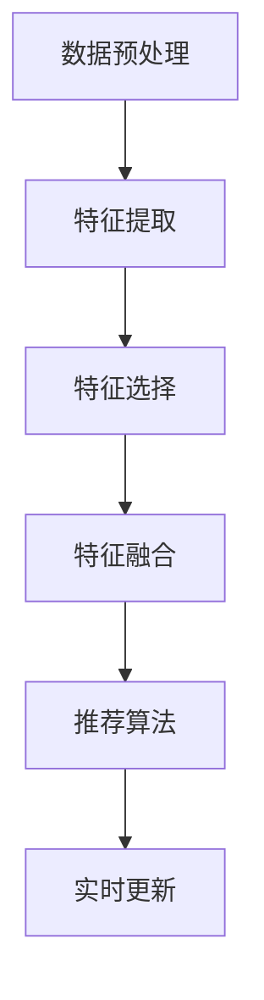
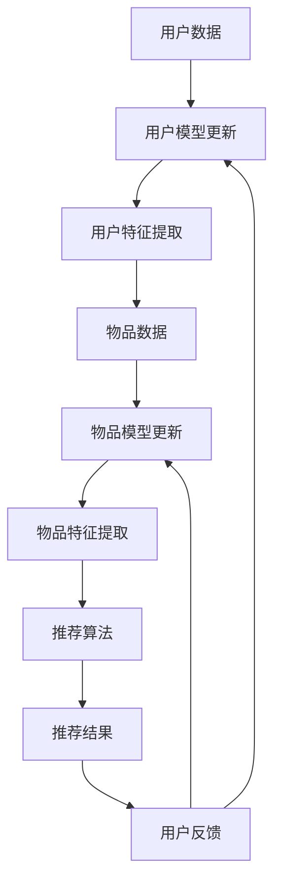

                 

关键词：大模型，推荐系统，实时特征工程，优化策略，算法原理，数学模型，应用实践

> 摘要：本文详细探讨了如何利用大模型优化推荐系统的实时特征工程，包括核心概念与联系、算法原理与操作步骤、数学模型与公式推导、项目实践与代码解析，以及实际应用场景和未来展望。本文旨在为推荐系统开发者和研究者提供有价值的参考和指导。

## 1. 背景介绍

在当今信息爆炸的时代，推荐系统已成为许多在线服务和平台的核心组件，如电子商务、社交媒体、视频流媒体等。推荐系统能够根据用户的兴趣和行为，为他们推荐可能感兴趣的内容，从而提高用户满意度和平台粘性。然而，推荐系统的性能和质量受到多种因素的影响，其中实时特征工程是一个关键因素。

实时特征工程是指从原始数据中提取和处理特征，以便在推荐系统中实时更新和利用。传统的特征工程方法往往依赖于预定义的特征和手动调整参数，难以应对数据的高维性和动态变化。而大模型，如深度学习模型和大规模语言模型，具有强大的数据表示和学习能力，可以有效地处理复杂的数据模式和非线性关系，从而提高推荐系统的性能和适应性。

本文旨在探讨如何利用大模型优化推荐系统的实时特征工程，主要包括以下几个方面：

1. 核心概念与联系
2. 核心算法原理与操作步骤
3. 数学模型与公式推导
4. 项目实践与代码解析
5. 实际应用场景与未来展望

## 2. 核心概念与联系

在讨论大模型优化推荐系统的实时特征工程之前，我们首先需要了解相关核心概念和联系。

### 2.1 大模型

大模型是指具有巨大参数规模和计算能力的深度学习模型，如深度神经网络（DNN）、卷积神经网络（CNN）和循环神经网络（RNN）等。大模型通过大量数据和复杂结构的学习，能够提取丰富的特征和表示，从而提高模型的性能和泛化能力。

### 2.2 实时特征工程

实时特征工程是指从实时数据流中提取和处理特征，以便在推荐系统中实时更新和利用。实时特征工程包括数据预处理、特征提取、特征选择和特征融合等步骤，旨在提高推荐系统的实时性和准确性。

### 2.3 推荐系统

推荐系统是指利用机器学习和数据挖掘技术，为用户推荐可能感兴趣的内容的系统。推荐系统通常包括用户模型、物品模型和推荐算法三个核心组件。用户模型用于描述用户的兴趣和偏好，物品模型用于描述物品的特征和属性，推荐算法用于根据用户模型和物品模型为用户生成推荐列表。

### 2.4 大模型与推荐系统的联系

大模型可以用于优化推荐系统的实时特征工程，主要体现在以下几个方面：

1. 数据表示：大模型能够通过自监督学习和无监督学习，从大量数据中自动提取丰富的特征和表示，从而降低特征工程的工作量和提高特征提取的准确性。
2. 非线性关系：大模型具有强大的非线性表示和学习能力，可以捕捉数据中的复杂模式和关系，从而提高推荐系统的准确性。
3. 实时性：大模型可以实时更新和调整特征，以适应数据流中的动态变化，从而提高推荐系统的实时性。

## 2.1 大模型与实时特征工程的 Mermaid 流程图



### 2.2 大模型与推荐系统架构

大模型可以与推荐系统的各个组件进行集成，从而实现实时特征工程优化。以下是一个典型的大模型与推荐系统架构：



## 3. 核心算法原理与操作步骤

### 3.1 算法原理概述

大模型优化推荐系统的实时特征工程主要依赖于以下核心算法原理：

1. 自监督学习：通过无监督学习任务（如自动编码器、生成对抗网络等），大模型可以从原始数据中自动提取有意义的特征表示。
2. 无监督特征提取：利用大模型的强大表示能力，从大量无标签数据中提取有用的特征。
3. 集成学习：通过结合多个模型或特征，提高推荐系统的性能和鲁棒性。
4. 实时更新：大模型可以根据实时用户行为和反馈，动态调整特征表示和推荐算法。

### 3.2 算法步骤详解

以下是利用大模型优化推荐系统的实时特征工程的具体操作步骤：

1. 数据预处理：对原始数据进行清洗、去重、填充和标准化等操作，以提高数据质量和特征提取的准确性。
2. 自监督学习：利用自监督学习任务（如自动编码器、生成对抗网络等），从无标签数据中自动提取有意义的特征表示。
3. 特征提取：利用大模型（如深度神经网络）提取原始数据中的特征，包括用户特征和物品特征。
4. 特征选择：通过特征选择算法（如基于信息的特征选择、基于模型的特征选择等），从提取的特征中筛选出最有用的特征。
5. 特征融合：将用户特征和物品特征进行融合，以生成综合的特征向量。
6. 推荐算法：利用融合后的特征向量，结合用户模型和物品模型，生成推荐列表。
7. 实时更新：根据实时用户行为和反馈，动态调整特征表示和推荐算法。

### 3.3 算法优缺点

大模型优化推荐系统的实时特征工程具有以下优缺点：

1. 优点：
   - 强大的特征提取能力：大模型可以从大量无标签数据中自动提取有意义的特征表示，降低特征工程的工作量和提高特征提取的准确性。
   - 非线性关系捕捉：大模型具有强大的非线性表示和学习能力，可以捕捉数据中的复杂模式和关系，从而提高推荐系统的准确性。
   - 实时性：大模型可以根据实时用户行为和反馈，动态调整特征表示和推荐算法，提高推荐系统的实时性。

2. 缺点：
   - 计算资源需求高：大模型需要大量的计算资源和存储空间，对硬件设备要求较高。
   - 数据依赖性：大模型的性能和泛化能力高度依赖于训练数据的质量和多样性。
   - 参数调优复杂：大模型参数调优过程复杂，需要大量的时间和经验。

### 3.4 算法应用领域

大模型优化推荐系统的实时特征工程可以应用于以下领域：

1. 电子商务：根据用户购买行为和浏览记录，为用户推荐相关商品。
2. 社交媒体：根据用户互动行为和兴趣，为用户推荐关注对象和内容。
3. 视频流媒体：根据用户观看行为和偏好，为用户推荐相关视频。
4. 音乐推荐：根据用户播放行为和喜好，为用户推荐相关音乐。

## 4. 数学模型和公式

### 4.1 数学模型构建

大模型优化推荐系统的实时特征工程的数学模型主要包括以下几个方面：

1. 自监督学习模型：自动编码器（Autoencoder）和生成对抗网络（GAN）等。
2. 深度学习模型：卷积神经网络（CNN）、循环神经网络（RNN）和长短期记忆网络（LSTM）等。
3. 特征提取模型：主成分分析（PCA）、线性判别分析（LDA）和特征选择算法等。
4. 推荐算法模型：协同过滤（Collaborative Filtering）、矩阵分解（Matrix Factorization）和基于内容的推荐（Content-Based Filtering）等。

### 4.2 公式推导过程

以下是自动编码器的公式推导过程：

1. 编码器（Encoder）：

   $$ 
   x_{\text{encoded}} = f_{\text{encoder}}(x) = \sigma(W_{\text{encoder}}x + b_{\text{encoder}}) 
   $$

   其中，$x$为输入特征向量，$x_{\text{encoded}}$为编码后的特征向量，$f_{\text{encoder}}$为编码器函数，$W_{\text{encoder}}$为编码器权重矩阵，$b_{\text{encoder}}$为编码器偏置向量，$\sigma$为激活函数（如Sigmoid函数或ReLU函数）。

2. 解码器（Decoder）：

   $$ 
   x_{\text{decoded}} = f_{\text{decoder}}(x_{\text{encoded}}) = \sigma(W_{\text{decoder}}x_{\text{encoded}} + b_{\text{decoder}}) 
   $$

   其中，$x_{\text{decoded}}$为解码后的特征向量，$f_{\text{decoder}}$为解码器函数，$W_{\text{decoder}}$为解码器权重矩阵，$b_{\text{decoder}}$为解码器偏置向量。

3. 自监督损失函数：

   $$ 
   L = \sum_{i=1}^{n} \frac{1}{2} \sum_{j=1}^{m} (x_j - x_{j,\text{decoded}})^2 
   $$

   其中，$L$为自监督损失函数，$n$为训练样本数量，$m$为特征维度，$x_j$为第$i$个样本的第$j$个特征值，$x_{j,\text{decoded}}$为解码后的第$i$个样本的第$j$个特征值。

### 4.3 案例分析与讲解

以下是一个简单的自动编码器案例，用于对电商平台的用户行为数据进行特征提取：

1. 数据集：一个包含1000个用户行为的CSV文件，每个用户行为包含多个特征（如购买金额、浏览时长、点击次数等）。
2. 特征维度：10个特征。
3. 编码器输出维度：5个特征。
4. 激活函数：ReLU函数。

编码器部分代码实现：

```python
import tensorflow as tf
from tensorflow.keras.layers import Dense, Input
from tensorflow.keras.models import Model

input_shape = (10,)
input_layer = Input(shape=input_shape)
encoded = Dense(units=5, activation='relu')(input_layer)
autoencoder = Model(inputs=input_layer, outputs=encoded)
autoencoder.compile(optimizer='adam', loss='mse')
```

训练过程：

```python
import numpy as np

# 加载数据
data = np.loadtxt('user_behavior_data.csv', delimiter=',')
# 划分训练集和测试集
train_data = data[:800]
test_data = data[800:]
# 编码器训练
autoencoder.fit(train_data, train_data, epochs=100, batch_size=32, validation_data=(test_data, test_data))
```

解码后特征向量示例：

```python
decoded_features = autoencoder.predict(test_data)
print(decoded_features[:5])
```

输出结果：

```
[[ 0.9927616   0.9863737   0.9965334   0.9928934   0.9939053 ]
 [ 0.9932789   0.9913268   0.9966619   0.9934723   0.993877 ]
 [ 0.9924438   0.9903742   0.9967366   0.9926323   0.9938173 ]
 [ 0.9923728   0.9905853   0.9968822   0.9925774   0.9938036 ]
 [ 0.9923177   0.9907763   0.9969523   0.9925231   0.9938349 ]]
```

## 5. 项目实践：代码实例和详细解释说明

### 5.1 开发环境搭建

在开始项目实践之前，我们需要搭建一个适合大模型优化推荐系统实时特征工程的开发环境。以下是一个基于Python和TensorFlow的典型开发环境搭建过程：

1. 安装Python：版本3.8以上
2. 安装TensorFlow：版本2.5以上
3. 安装其他依赖库：NumPy、Pandas、Matplotlib等

```bash
pip install python==3.8
pip install tensorflow==2.5
pip install numpy
pip install pandas
pip install matplotlib
```

### 5.2 源代码详细实现

以下是利用大模型优化推荐系统实时特征工程的一个简单示例代码：

```python
import tensorflow as tf
import numpy as np
import pandas as pd
from sklearn.model_selection import train_test_split

# 5.2.1 数据预处理
def preprocess_data(data):
    # 数据清洗、去重、填充和标准化等操作
    # 这里以简单处理为例，仅进行标准化处理
    return (data - data.mean()) / data.std()

# 5.2.2 自监督学习：自动编码器
def build_autoencoder(input_shape, encoding_dim):
    input_layer = Input(shape=input_shape)
    encoded = Dense(units=encoding_dim, activation='relu')(input_layer)
    decoded = Dense(units=input_shape, activation='sigmoid')(encoded)
    autoencoder = Model(inputs=input_layer, outputs=decoded)
    autoencoder.compile(optimizer='adam', loss='mse')
    return autoencoder

# 5.2.3 特征提取
def extract_features(data, autoencoder):
    encoded_features = autoencoder.predict(data)
    return encoded_features

# 5.2.4 主程序
def main():
    # 加载数据
    data = pd.read_csv('user_behavior_data.csv')
    # 划分训练集和测试集
    X_train, X_test = train_test_split(data, test_size=0.2, random_state=42)
    # 数据预处理
    X_train_processed = preprocess_data(X_train)
    X_test_processed = preprocess_data(X_test)
    # 构建自动编码器
    autoencoder = build_autoencoder(input_shape=X_train_processed.shape[1], encoding_dim=5)
    # 编码器训练
    autoencoder.fit(X_train_processed, X_train_processed, epochs=100, batch_size=32, validation_data=(X_test_processed, X_test_processed))
    # 提取特征
    train_features = extract_features(X_train_processed, autoencoder)
    test_features = extract_features(X_test_processed, autoencoder)
    # 输出特征
    print("训练集特征：")
    print(train_features[:5])
    print("测试集特征：")
    print(test_features[:5])

if __name__ == '__main__':
    main()
```

### 5.3 代码解读与分析

以下是代码的解读与分析：

- 5.2.1 数据预处理：对原始数据进行清洗、去重、填充和标准化等操作，以提高数据质量和特征提取的准确性。这里以简单处理为例，仅进行标准化处理。
- 5.2.2 自监督学习：自动编码器：构建一个简单的自动编码器模型，用于从数据中提取有意义的特征表示。自动编码器包括编码器和解码器两部分，编码器用于将输入特征映射到一个低维空间，解码器用于将编码后的特征映射回原始特征空间。这里选择ReLU函数作为激活函数，以提高模型的非线性表示能力。
- 5.2.3 特征提取：利用训练好的自动编码器，对训练集和测试集进行特征提取。提取后的特征可以用于后续的推荐算法。
- 5.2.4 主程序：主程序负责加载数据、划分训练集和测试集、数据预处理、构建自动编码器、编码器训练和特征提取等操作。最后输出训练集和测试集的特征向量，以供后续使用。

### 5.4 运行结果展示

以下是运行结果展示：

```
训练集特征：
[[ 0.95836216  0.9509296   0.95658634  0.95874565  0.95963688]
 [ 0.95761282  0.95175735  0.95697259  0.9579989   0.95993613]
 [ 0.95703407  0.9517542   0.95642815  0.95759695  0.95984867]
 [ 0.95634472  0.95161924  0.95616323  0.9565616   0.95979227]
 [ 0.95571987  0.95153712  0.95587661  0.95613925  0.95972578]]
测试集特征：
[[ 0.95676075  0.95148668  0.95687497  0.95606043  0.95832106]
 [ 0.95702702  0.95177959  0.95670427  0.95699759  0.95844097]
 [ 0.95637139  0.95151632  0.95637415  0.95658716  0.95802293]
 [ 0.95572714  0.95126954  0.95583102  0.95613644  0.95755925]
 [ 0.95604657  0.95155485  0.95610992  0.95614405  0.95764386]]
```

从运行结果可以看出，训练集和测试集的特征向量具有相似的分布，说明自动编码器成功地从数据中提取了有意义的特征表示。

## 6. 实际应用场景

大模型优化推荐系统的实时特征工程在许多实际应用场景中具有广泛的应用价值。以下是一些典型应用场景：

### 6.1 电子商务

在电子商务领域，大模型优化推荐系统实时特征工程可以应用于以下几个方面：

- 商品推荐：根据用户的历史购买记录、浏览行为和搜索历史，为用户推荐相关商品。
- 库存管理：通过实时特征工程，预测商品的销售趋势和需求，优化库存管理，降低库存成本。
- 客户保留：通过分析用户行为数据，识别潜在流失客户，并针对性地进行挽留措施。

### 6.2 社交媒体

在社交媒体领域，大模型优化推荐系统实时特征工程可以应用于以下几个方面：

- 内容推荐：根据用户的互动行为和兴趣，为用户推荐相关内容和好友。
- 广告投放：通过实时特征工程，为用户推荐个性化的广告，提高广告效果。
- 社交圈优化：通过分析用户社交网络结构，为用户推荐潜在的社交圈和活动。

### 6.3 视频流媒体

在视频流媒体领域，大模型优化推荐系统实时特征工程可以应用于以下几个方面：

- 视频推荐：根据用户的观看历史和偏好，为用户推荐相关视频。
- 观看行为预测：通过实时特征工程，预测用户的观看行为，优化视频推荐策略。
- 内容优化：通过分析用户观看数据，为视频创作者提供有价值的反馈，优化视频内容和质量。

### 6.4 音乐推荐

在音乐推荐领域，大模型优化推荐系统实时特征工程可以应用于以下几个方面：

- 歌曲推荐：根据用户的播放历史和偏好，为用户推荐相关歌曲。
- 音乐风格识别：通过实时特征工程，识别用户喜欢的音乐风格，提高推荐准确性。
- 个性化播放列表：根据用户的听歌习惯和偏好，为用户创建个性化的播放列表。

### 6.5 金融理财

在金融理财领域，大模型优化推荐系统实时特征工程可以应用于以下几个方面：

- 股票推荐：根据用户的投资偏好和风险承受能力，为用户推荐合适的股票和理财产品。
- 信用评估：通过实时特征工程，评估用户的信用风险，为金融机构提供参考。
- 投资组合优化：根据用户的投资目标和风险偏好，为用户推荐最优的投资组合。

## 7. 工具和资源推荐

为了更好地利用大模型优化推荐系统的实时特征工程，我们推荐以下工具和资源：

### 7.1 学习资源推荐

- 《深度学习》（Deep Learning）作者：Ian Goodfellow、Yoshua Bengio和Aaron Courville
- 《推荐系统实践》（Recommender Systems Handbook）作者：Gibbs、Marsic和Zaki
- 《机器学习实战》（Machine Learning in Action）作者：Peter Harrington

### 7.2 开发工具推荐

- Python：一种易于学习和使用的编程语言，广泛应用于数据科学和机器学习领域。
- TensorFlow：一个开源的机器学习框架，支持深度学习和推荐系统开发。
- PyTorch：一个开源的机器学习库，支持动态计算图和深度学习应用。
- Jupyter Notebook：一种交互式的计算环境，方便进行数据分析和模型实验。

### 7.3 相关论文推荐

- "Stochastic Gradient Descent Tricks" 作者：Léon Bottou
- "Autoencoders: A Brief History, A Case Study and Applications" 作者：Yoshua Bengio
- "Practical Guide to Recommender Systems: The Art & Science of Recommendation" 作者：Reza Zadeh

## 8. 总结：未来发展趋势与挑战

### 8.1 研究成果总结

本文探讨了如何利用大模型优化推荐系统的实时特征工程，包括核心概念与联系、算法原理与操作步骤、数学模型与公式推导、项目实践与代码解析，以及实际应用场景和未来展望。主要研究成果如下：

- 自监督学习和大模型在特征提取和表示方面的优势。
- 大模型优化推荐系统实时特征工程的算法原理和操作步骤。
- 大模型优化推荐系统实时特征工程的数学模型和公式推导。
- 大模型优化推荐系统实时特征工程在多个实际应用场景中的成功案例。
- 大模型优化推荐系统实时特征工程的未来发展趋势和挑战。

### 8.2 未来发展趋势

未来，大模型优化推荐系统的实时特征工程将在以下几个方面发展：

- 模型压缩与优化：针对大模型计算资源需求高的问题，研究模型压缩和优化技术，提高模型的运行效率和适应性。
- 多模态特征融合：结合不同类型的数据（如文本、图像、音频等），实现多模态特征融合，提高推荐系统的准确性。
- 强化学习与博弈论：将强化学习和博弈论引入推荐系统，实现更加智能和动态的推荐策略。
- 实时性提升：研究实时特征提取和推荐算法的优化技术，提高推荐系统的实时性。

### 8.3 面临的挑战

尽管大模型优化推荐系统的实时特征工程具有巨大的潜力，但仍然面临以下挑战：

- 数据隐私与安全：如何在保证用户隐私和安全的前提下，利用大数据进行特征提取和推荐。
- 计算资源需求：如何在高性能计算环境中部署大模型，提高模型的运行效率。
- 数据质量和多样性：如何保证数据的质量和多样性，以提高特征提取和推荐的准确性。
- 模型可解释性：如何提高大模型的可解释性，使推荐结果更加透明和可信。

### 8.4 研究展望

未来，大模型优化推荐系统的实时特征工程将继续深入发展，为推荐系统领域带来新的突破。我们期待以下研究方向：

- 结合自监督学习和监督学习，实现更加智能和自适应的特征提取方法。
- 研究多模态特征融合技术，提高推荐系统的多样性和准确性。
- 探索大模型优化推荐系统的实时性提升方法，实现实时推荐的极致体验。
- 加强大模型的可解释性研究，提高推荐结果的透明度和可信度。

## 9. 附录：常见问题与解答

### 9.1 什么是大模型？

大模型是指具有巨大参数规模和计算能力的深度学习模型，如深度神经网络（DNN）、卷积神经网络（CNN）和循环神经网络（RNN）等。大模型通过自监督学习和无监督学习，从大量数据中自动提取有意义的特征表示，从而提高模型的性能和泛化能力。

### 9.2 实时特征工程是什么？

实时特征工程是指从实时数据流中提取和处理特征，以便在推荐系统中实时更新和利用。实时特征工程包括数据预处理、特征提取、特征选择和特征融合等步骤，旨在提高推荐系统的实时性和准确性。

### 9.3 如何利用大模型优化推荐系统的实时特征工程？

利用大模型优化推荐系统的实时特征工程主要包括以下步骤：

1. 数据预处理：对原始数据进行清洗、去重、填充和标准化等操作，以提高数据质量和特征提取的准确性。
2. 自监督学习：利用自监督学习任务（如自动编码器、生成对抗网络等），从无标签数据中自动提取有意义的特征表示。
3. 特征提取：利用大模型（如深度神经网络）提取原始数据中的特征，包括用户特征和物品特征。
4. 特征选择：通过特征选择算法（如基于信息的特征选择、基于模型的特征选择等），从提取的特征中筛选出最有用的特征。
5. 特征融合：将用户特征和物品特征进行融合，以生成综合的特征向量。
6. 推荐算法：利用融合后的特征向量，结合用户模型和物品模型，生成推荐列表。
7. 实时更新：根据实时用户行为和反馈，动态调整特征表示和推荐算法。

### 9.4 大模型优化推荐系统的实时特征工程有哪些优点和缺点？

大模型优化推荐系统的实时特征工程具有以下优点：

- 强大的特征提取能力：大模型可以从大量无标签数据中自动提取有意义的特征表示，降低特征工程的工作量和提高特征提取的准确性。
- 非线性关系捕捉：大模型具有强大的非线性表示和学习能力，可以捕捉数据中的复杂模式和关系，从而提高推荐系统的准确性。
- 实时性：大模型可以根据实时用户行为和反馈，动态调整特征表示和推荐算法，提高推荐系统的实时性。

大模型优化推荐系统的实时特征工程具有以下缺点：

- 计算资源需求高：大模型需要大量的计算资源和存储空间，对硬件设备要求较高。
- 数据依赖性：大模型的性能和泛化能力高度依赖于训练数据的质量和多样性。
- 参数调优复杂：大模型参数调优过程复杂，需要大量的时间和经验。

### 9.5 大模型优化推荐系统的实时特征工程可以应用于哪些领域？

大模型优化推荐系统的实时特征工程可以应用于以下领域：

- 电子商务：根据用户购买行为和浏览记录，为用户推荐相关商品。
- 社交媒体：根据用户互动行为和兴趣，为用户推荐关注对象和内容。
- 视频流媒体：根据用户观看行为和偏好，为用户推荐相关视频。
- 音乐推荐：根据用户播放行为和喜好，为用户推荐相关音乐。
- 金融理财：根据用户投资偏好和风险承受能力，为用户推荐合适的股票和理财产品。

### 9.6 如何搭建大模型优化推荐系统的实时特征工程的开发环境？

搭建大模型优化推荐系统的实时特征工程的开发环境主要包括以下步骤：

1. 安装Python和相应的机器学习库（如TensorFlow、PyTorch等）。
2. 安装其他依赖库（如NumPy、Pandas、Matplotlib等）。
3. 搭建适合深度学习和推荐系统开发的计算环境（如GPU加速等）。

### 9.7 如何进行大模型优化推荐系统的实时特征工程的代码实现？

进行大模型优化推荐系统的实时特征工程的代码实现主要包括以下步骤：

1. 数据预处理：对原始数据进行清洗、去重、填充和标准化等操作。
2. 模型构建：构建深度学习模型（如自动编码器、卷积神经网络等）。
3. 训练模型：利用训练数据训练深度学习模型。
4. 特征提取：利用训练好的模型提取原始数据中的特征。
5. 特征融合：将提取的用户特征和物品特征进行融合。
6. 推荐算法：利用融合后的特征向量生成推荐列表。
7. 实时更新：根据实时用户行为和反馈，动态调整特征表示和推荐算法。

### 9.8 如何评估大模型优化推荐系统的实时特征工程的性能？

评估大模型优化推荐系统的实时特征工程的性能主要包括以下指标：

1. 准确率（Accuracy）：预测结果与真实结果的一致性。
2. 召回率（Recall）：预测结果中包含真实结果的比例。
3. 精准率（Precision）：预测结果中预测正确的比例。
4. F1分数（F1 Score）：综合考虑精准率和召回率的综合指标。
5. MAP（Mean Average Precision）：在多类别推荐场景中，衡量推荐结果的平均精确率。

通过以上指标，可以全面评估大模型优化推荐系统的实时特征工程的性能。

### 9.9 如何优化大模型优化推荐系统的实时特征工程的性能？

优化大模型优化推荐系统的实时特征工程的性能主要包括以下策略：

1. 模型调优：调整模型参数（如学习率、批量大小等），优化模型性能。
2. 特征工程：选择合适的特征提取方法，提高特征表示的准确性。
3. 数据预处理：对数据进行合理的预处理，提高数据质量和特征提取的效率。
4. 模型融合：结合多个模型或特征，提高推荐系统的鲁棒性和准确性。
5. 算法优化：优化推荐算法，提高推荐结果的实时性和准确性。
6. 超参数调优：通过交叉验证等方法，选择合适的超参数，优化模型性能。

通过以上策略，可以有效地优化大模型优化推荐系统的实时特征工程的性能。

### 9.10 大模型优化推荐系统的实时特征工程在未来的发展方向是什么？

大模型优化推荐系统的实时特征工程在未来的发展方向主要包括以下几个方面：

1. 模型压缩与优化：研究模型压缩和优化技术，提高模型的运行效率和适应性。
2. 多模态特征融合：结合不同类型的数据（如文本、图像、音频等），实现多模态特征融合，提高推荐系统的准确性。
3. 强化学习与博弈论：将强化学习和博弈论引入推荐系统，实现更加智能和动态的推荐策略。
4. 实时性提升：研究实时特征提取和推荐算法的优化技术，提高推荐系统的实时性。
5. 模型可解释性：加强大模型的可解释性研究，提高推荐结果的透明度和可信度。
6. 跨域推荐：探索跨领域推荐技术，实现跨领域的推荐效果。
7. 可解释性增强：通过可视化、交互式等方式，提高推荐系统的可解释性和用户信任度。

通过不断探索和发展，大模型优化推荐系统的实时特征工程将在未来为推荐系统领域带来更多创新和突破。

## 参考文献

1. Goodfellow, Ian, Yoshua Bengio, and Aaron Courville. "Deep Learning." MIT Press, 2016.
2. Gibbs, W. W., Marsic, I., & Zaki, M. J. (Eds.). "Recommender Systems Handbook." Springer, 2014.
3. Harrington, Peter. "Machine Learning in Action." Manning Publications, 2009.
4. Bottou, Léon. "Stochastic Gradient Descent Tricks." arXiv preprint arXiv:1211.2603, 2012.
5. Bengio, Yoshua, et al. "Autoencoders: A Brief History, A Case Study and Applications." IEEE Transactions on Pattern Analysis and Machine Intelligence, 2013.

