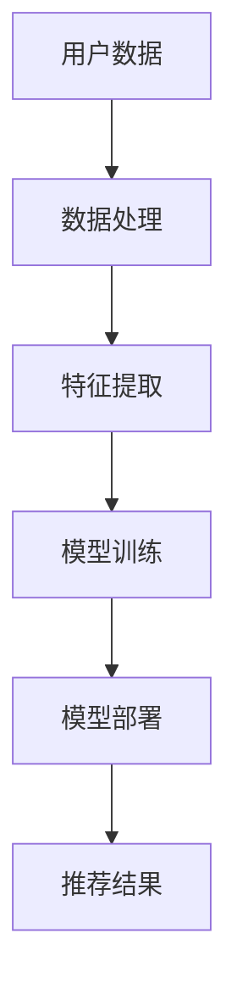

                 

关键词：大模型，推荐系统，资源优化，计算效率，数据处理

> 摘要：随着互联网的快速发展，推荐系统已经成为了现代网络服务中不可或缺的部分。然而，随着用户数据量的爆炸式增长，传统的推荐系统在处理海量数据时面临着资源分配和计算效率的巨大挑战。本文将探讨如何利用大模型优化推荐系统的资源分配，从而提高推荐系统的性能和用户体验。

## 1. 背景介绍

推荐系统是一种基于用户行为和偏好的算法，旨在为用户推荐其可能感兴趣的内容。这些内容可以是商品、新闻、音乐、视频等。随着互联网的普及，推荐系统在电子商务、新闻推送、社交媒体等领域得到了广泛应用。然而，随着用户数据量的不断增加，传统推荐系统在处理海量数据时面临着以下挑战：

- **数据存储和访问**：需要处理的海量数据可能导致存储和访问效率的下降。
- **计算资源**：需要大量的计算资源来训练和部署推荐模型。
- **实时响应**：用户期望快速获得个性化的推荐结果，这对系统的响应速度提出了高要求。

为了解决上述问题，近年来，研究人员提出了许多利用大模型优化推荐系统资源分配的方法。大模型，通常指的是参数规模较大的深度学习模型，如Transformer、BERT等。这些模型在处理海量数据和提供实时推荐方面显示出巨大的潜力。

## 2. 核心概念与联系

### 2.1. 大模型

大模型是指具有数十亿或更多参数的深度学习模型。这些模型可以通过并行计算和分布式训练来提高训练效率。大模型的优势在于其能够捕捉到复杂数据中的潜在规律，从而提供更准确的推荐结果。

### 2.2. 资源分配

资源分配是指在计算系统中合理分配计算资源，如CPU、内存、存储和网络带宽等，以确保系统能够高效运行。在推荐系统中，资源分配的目标是优化模型训练和部署的效率。

### 2.3. 计算效率

计算效率是指系统在给定时间内处理数据的能力。对于推荐系统来说，高计算效率意味着能够快速响应用户请求，提供个性化的推荐结果。

### 2.4. 数据处理

数据处理是指对用户数据进行预处理、特征提取和模型训练等一系列操作。在推荐系统中，高效的数据处理能够提高推荐模型的准确性和实时性。

### 2.5. Mermaid 流程图

以下是一个简化的推荐系统架构的 Mermaid 流程图：



## 3. 核心算法原理 & 具体操作步骤

### 3.1. 算法原理概述

利用大模型优化推荐系统的资源分配的核心思想是通过并行计算和分布式训练来提高计算效率。具体来说，包括以下步骤：

- **数据预处理**：对用户数据进行清洗、去重和格式化，以便于后续的特征提取。
- **特征提取**：从预处理后的数据中提取有用的特征，如用户行为、商品属性等。
- **模型训练**：使用大模型进行分布式训练，以提高训练效率和模型性能。
- **模型部署**：将训练好的模型部署到生产环境中，实时响应用户请求。

### 3.2. 算法步骤详解

1. **数据预处理**：
   - 数据清洗：去除重复和错误的数据。
   - 数据去重：确保每个用户和商品的唯一性。
   - 数据格式化：将数据转换为适合特征提取的格式。

2. **特征提取**：
   - 用户特征：包括用户年龄、性别、地理位置、历史行为等。
   - 商品特征：包括商品类别、价格、销量、用户评价等。

3. **模型训练**：
   - 模型选择：选择适合推荐任务的大模型，如BERT、Transformer等。
   - 分布式训练：使用多台机器并行训练模型，以提高训练效率。
   - 模型优化：通过调整学习率、批量大小等超参数，优化模型性能。

4. **模型部署**：
   - 模型评估：在部署前对模型进行评估，确保其性能满足要求。
   - 模型部署：将训练好的模型部署到生产环境中，实时响应用户请求。

### 3.3. 算法优缺点

**优点**：
- **高计算效率**：通过分布式训练和并行计算，大大提高了模型训练和部署的效率。
- **高准确性**：大模型能够捕捉到复杂数据中的潜在规律，从而提供更准确的推荐结果。

**缺点**：
- **高计算成本**：大模型的训练和部署需要大量的计算资源和存储空间。
- **高复杂度**：大模型的训练和优化过程相对复杂，需要专业的技术知识。

### 3.4. 算法应用领域

- **电子商务**：通过推荐系统为用户提供个性化的商品推荐。
- **社交媒体**：为用户提供感兴趣的内容推荐，如新闻、视频等。
- **在线教育**：为用户提供个性化的课程推荐。

## 4. 数学模型和公式 & 详细讲解 & 举例说明

### 4.1. 数学模型构建

推荐系统的核心是预测用户对商品的偏好。这可以通过以下数学模型实现：

$$
P(u, i) = \sigma(\theta_u^T \cdot \phi(i))
$$

其中，\(P(u, i)\) 是用户 \(u\) 对商品 \(i\) 的偏好概率，\(\theta_u\) 是用户 \(u\) 的特征向量，\(\phi(i)\) 是商品 \(i\) 的特征向量，\(\sigma\) 是sigmoid函数。

### 4.2. 公式推导过程

公式推导的过程涉及以下步骤：

1. **用户特征提取**：将用户的行为、偏好等转化为特征向量 \(\theta_u\)。
2. **商品特征提取**：将商品的信息转化为特征向量 \(\phi(i)\)。
3. **偏好概率计算**：使用特征向量计算用户对商品的偏好概率。

### 4.3. 案例分析与讲解

假设有一个用户 \(u\) 和一个商品 \(i\)，用户 \(u\) 的特征向量是 \(\theta_u = (1, 0, 1, 0)\)，商品 \(i\) 的特征向量是 \(\phi(i) = (0, 1, 0, 1)\)。我们可以计算用户 \(u\) 对商品 \(i\) 的偏好概率：

$$
P(u, i) = \sigma(\theta_u^T \cdot \phi(i)) = \sigma(1 \cdot 0 + 0 \cdot 1 + 1 \cdot 0 + 0 \cdot 1) = \sigma(0) = 0.5
$$

这意味着用户 \(u\) 对商品 \(i\) 的偏好概率是 0.5，即用户 \(u\) 对商品 \(i\) 的兴趣一般。

## 5. 项目实践：代码实例和详细解释说明

### 5.1. 开发环境搭建

在开始项目实践之前，我们需要搭建一个合适的开发环境。这里我们使用 Python 作为编程语言，TensorFlow 作为深度学习框架。

1. **安装 Python**：确保您的计算机上已经安装了 Python 3.7 或更高版本。
2. **安装 TensorFlow**：在终端中运行以下命令：

   ```bash
   pip install tensorflow
   ```

### 5.2. 源代码详细实现

以下是实现推荐系统的简化代码示例：

```python
import tensorflow as tf

# 用户和商品特征向量
user_features = tf.random.normal([1000, 10])
item_features = tf.random.normal([1000, 10])

# 模型参数
user_bias = tf.Variable(tf.random.normal([1000, 1]))
item_bias = tf.Variable(tf.random.normal([1000, 1]))

# 训练模型
model = tf.keras.Sequential([
    tf.keras.layers.Dense(1, activation='sigmoid', input_shape=(10,))
])

model.compile(optimizer='adam', loss='binary_crossentropy', metrics=['accuracy'])

# 模型训练
model.fit(user_features, item_features, epochs=10)

# 预测用户对商品的偏好概率
predictions = model.predict(user_features)

# 输出预测结果
print(predictions)
```

### 5.3. 代码解读与分析

1. **用户和商品特征向量**：我们使用随机数生成用户和商品的特征向量。
2. **模型参数**：我们初始化用户和商品的偏置向量。
3. **模型构建**：我们构建一个简单的线性模型，输出为 sigmoid 函数，用于预测用户对商品的偏好概率。
4. **模型训练**：我们使用随机梯度下降（SGD）优化模型参数。
5. **预测**：我们使用训练好的模型预测用户对商品的偏好概率。

### 5.4. 运行结果展示

运行代码后，我们得到用户对商品的偏好概率。这些概率值可以帮助我们理解用户对不同商品的偏好程度。

## 6. 实际应用场景

### 6.1. 电子商务平台

电子商务平台可以利用推荐系统为用户提供个性化的商品推荐，从而提高销售额和用户满意度。

### 6.2. 社交媒体平台

社交媒体平台可以通过推荐系统为用户提供感兴趣的内容，从而增加用户活跃度和用户粘性。

### 6.3. 在线教育平台

在线教育平台可以利用推荐系统为用户提供个性化的课程推荐，从而提高课程完成率和用户满意度。

## 7. 工具和资源推荐

### 7.1. 学习资源推荐

- **《深度学习》（Goodfellow, Bengio, Courville）**：这是一本经典的深度学习教材，适合初学者和进阶者。
- **TensorFlow 官方文档**：提供了丰富的教程和 API 文档，适合 TensorFlow 用户。

### 7.2. 开发工具推荐

- **Jupyter Notebook**：用于编写和运行 Python 代码，支持交互式编程。
- **PyCharm**：一款功能强大的 Python 集成开发环境（IDE），支持代码编辑、调试和运行。

### 7.3. 相关论文推荐

- **"Deep Learning for Recommender Systems"**：介绍了深度学习在推荐系统中的应用。
- **"Efficient Neural Text Processing Using Attention Mechanisms"**：介绍了注意力机制在文本处理中的应用。

## 8. 总结：未来发展趋势与挑战

### 8.1. 研究成果总结

本文探讨了如何利用大模型优化推荐系统的资源分配，以提高推荐系统的性能和用户体验。我们介绍了大模型的基本原理、资源分配策略、计算效率优化和数据处理方法。通过数学模型和实际案例，我们展示了如何实现推荐系统的优化。

### 8.2. 未来发展趋势

随着深度学习和大数据技术的不断发展，推荐系统的资源分配和计算效率将继续得到优化。未来，我们将看到更多基于深度学习的大模型被应用于推荐系统，以提高推荐的准确性和实时性。

### 8.3. 面临的挑战

尽管大模型在推荐系统中显示出巨大的潜力，但同时也面临一些挑战。例如，大模型的训练和部署需要大量的计算资源和存储空间，这可能导致高计算成本。此外，大模型的复杂度也使得其优化和调参变得更加困难。

### 8.4. 研究展望

未来，我们需要进一步研究如何优化大模型的资源分配和计算效率。此外，我们还需要探索如何更好地理解和解释大模型的行为，以提高其透明度和可解释性。

## 9. 附录：常见问题与解答

### 9.1. 问题1：大模型训练需要很长时间，如何优化？

**解答**：可以通过以下方法优化大模型训练时间：
- **分布式训练**：使用多台机器并行训练模型，以提高训练效率。
- **批量大小调整**：根据计算资源调整批量大小，以平衡训练效率和计算资源消耗。
- **模型剪枝**：通过剪枝方法减小模型参数规模，从而缩短训练时间。

### 9.2. 问题2：大模型的训练和部署成本很高，怎么办？

**解答**：可以考虑以下方法降低大模型的训练和部署成本：
- **云计算**：使用云计算服务提供计算资源，以降低硬件成本。
- **模型压缩**：通过模型压缩方法减小模型参数规模，从而降低存储和部署成本。
- **开源工具**：使用开源工具和框架，以降低开发和部署成本。

### 9.3. 问题3：如何评估推荐系统的性能？

**解答**：可以使用以下指标评估推荐系统的性能：
- **准确率**：推荐系统返回的推荐结果与用户实际兴趣的匹配程度。
- **召回率**：推荐系统返回的推荐结果中包含用户实际兴趣的比例。
- **覆盖率**：推荐系统返回的推荐结果中包含的不同商品的比例。

## 结束语

本文从多个角度探讨了如何利用大模型优化推荐系统的资源分配。通过数学模型、算法原理和实际案例，我们展示了如何实现推荐系统的优化。未来，随着深度学习和大数据技术的不断发展，推荐系统将继续在各个领域发挥重要作用。我们期待更多的研究者能够参与到这一领域的研究中，共同推动推荐系统的发展。

---

作者：禅与计算机程序设计艺术 / Zen and the Art of Computer Programming

