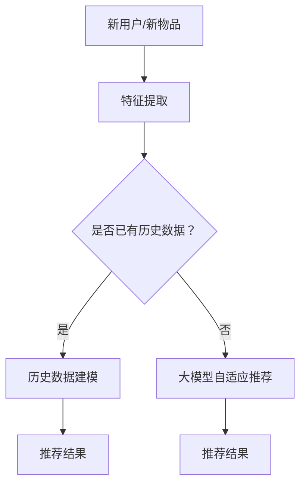

                 

关键词：推荐系统，冷启动问题，大模型，深度学习，协同过滤

> 摘要：推荐系统作为现代互联网应用的核心组成部分，其性能直接影响用户体验。冷启动问题，即新用户或新物品缺乏足够历史数据时推荐效果不佳的问题，是推荐系统领域的一大挑战。本文将探讨利用大模型改进推荐系统的冷启动策略，介绍核心概念、算法原理、数学模型以及实际应用案例，分析其未来发展趋势与挑战。

## 1. 背景介绍

推荐系统作为一种信息过滤技术，旨在根据用户的历史行为和偏好向其推荐个性化内容。然而，在实际应用中，冷启动问题常常导致推荐系统在处理新用户或新物品时效果不佳。新用户由于缺乏足够的历史数据，难以准确预测其偏好；新物品则由于缺乏用户交互数据，难以被有效推荐。传统的推荐系统方法如基于内容的推荐和协同过滤等方法在解决冷启动问题时存在一定局限性。

近年来，随着深度学习技术的快速发展，大模型在各个领域取得了显著成果。大模型具有强大的特征提取能力和复杂度建模能力，为解决冷启动问题提供了新的思路。本文旨在探讨如何利用大模型改进推荐系统的冷启动策略，提高推荐系统的准确性和用户满意度。

## 2. 核心概念与联系

为了更好地理解大模型在推荐系统冷启动中的应用，首先需要介绍相关核心概念。

### 2.1 推荐系统

推荐系统（Recommender System）是一种基于用户历史行为、兴趣偏好或内容特征等信息，自动为用户推荐相关物品的技术。推荐系统通常分为基于内容的推荐和协同过滤两大类。

#### 基于内容的推荐

基于内容的推荐（Content-Based Filtering）方法通过分析物品和用户之间的相似性来进行推荐。具体来说，首先对物品进行特征提取，然后计算用户与物品之间的相似度，最后根据相似度为用户推荐相关物品。

#### 协同过滤

协同过滤（Collaborative Filtering）方法通过分析用户之间的交互行为来进行推荐。协同过滤可分为基于用户的协同过滤（User-Based）和基于物品的协同过滤（Item-Based）。基于用户的协同过滤通过找到与目标用户相似的其他用户，然后推荐这些相似用户喜欢的物品；基于物品的协同过滤通过找到与目标物品相似的其他物品，然后推荐这些相似物品。

### 2.2 冷启动问题

冷启动问题（Cold Start Problem）是指推荐系统在新用户或新物品缺乏足够历史数据时难以提供有效推荐的问题。具体来说，冷启动问题主要包括以下两个方面：

#### 新用户冷启动

新用户由于缺乏足够的历史行为数据，推荐系统难以准确预测其兴趣偏好，从而导致推荐效果不佳。

#### 新物品冷启动

新物品由于缺乏用户交互数据，推荐系统难以判断其受欢迎程度，从而导致推荐效果不佳。

### 2.3 大模型

大模型（Large-scale Model）是指具有大规模参数和复杂度的深度学习模型。大模型在特征提取和复杂度建模方面具有显著优势，可以更好地应对冷启动问题。

#### 深度学习

深度学习（Deep Learning）是一种基于多层神经网络的学习方法，具有强大的特征提取能力和复杂度建模能力。深度学习在图像识别、自然语言处理等领域取得了显著成果。

#### 自适应推荐系统

自适应推荐系统（Adaptive Recommender System）是一种动态调整推荐策略以适应用户需求和兴趣的系统。自适应推荐系统可以通过不断学习用户行为和历史数据，提高推荐准确性和用户满意度。

### 2.4 Mermaid 流程图

以下是推荐系统冷启动问题的 Mermaid 流程图：



## 3. 核心算法原理 & 具体操作步骤

### 3.1 算法原理概述

利用大模型改进推荐系统冷启动策略的核心思想是通过深度学习技术提取用户和物品的特征，并建立用户-物品之间的关系模型。具体来说，算法可以分为以下几个步骤：

#### 步骤1：特征提取

首先，对用户和物品进行特征提取。用户特征包括用户基本属性（如年龄、性别、地理位置等）和用户行为特征（如浏览记录、购买记录等）；物品特征包括物品属性（如类别、标签等）和物品内容特征（如文本、图像等）。

#### 步骤2：建立用户-物品关系模型

利用深度学习技术，建立用户-物品关系模型。具体来说，可以使用神经网络模型（如多层感知机、卷积神经网络、循环神经网络等）对用户和物品特征进行建模，提取用户和物品的隐式特征表示。

#### 步骤3：预测用户偏好

基于用户-物品关系模型，预测用户对物品的偏好。具体来说，可以使用用户特征和物品特征表示计算用户对物品的潜在兴趣度，并根据潜在兴趣度为用户推荐相关物品。

#### 步骤4：自适应调整

根据用户反馈和行为数据，不断调整推荐策略，提高推荐准确性。具体来说，可以使用在线学习算法（如梯度下降、随机梯度下降等）对用户-物品关系模型进行迭代优化，从而自适应调整推荐策略。

### 3.2 算法步骤详解

#### 步骤1：特征提取

用户特征提取：

1. 用户基本属性：提取用户年龄、性别、地理位置等基本信息；
2. 用户行为特征：提取用户浏览记录、购买记录等行为数据。

物品特征提取：

1. 物品属性：提取物品类别、标签等基本信息；
2. 物品内容特征：提取物品文本、图像等详细信息。

#### 步骤2：建立用户-物品关系模型

1. 数据预处理：对用户和物品特征进行归一化、编码等预处理操作；
2. 选择合适的深度学习模型：根据问题需求，选择多层感知机、卷积神经网络、循环神经网络等深度学习模型；
3. 模型训练：使用用户和物品特征数据训练深度学习模型，得到用户和物品的隐式特征表示；
4. 模型评估：使用交叉验证等方法评估模型性能，调整模型参数。

#### 步骤3：预测用户偏好

1. 输入用户特征和物品特征表示；
2. 计算用户对物品的潜在兴趣度：$$L(x, y) = \sum_{i=1}^{n} w_{i} x_{i} y_{i}$$；
3. 根据潜在兴趣度排序推荐结果，为用户推荐相关物品。

#### 步骤4：自适应调整

1. 收集用户反馈和行为数据；
2. 使用在线学习算法对用户-物品关系模型进行迭代优化；
3. 根据优化后的模型更新推荐策略，提高推荐准确性。

### 3.3 算法优缺点

#### 优点

1. 强大的特征提取能力：大模型能够从大量用户和物品数据中提取出丰富的特征信息，提高推荐系统的准确性；
2. 适用于多种数据类型：大模型可以处理多种数据类型，如文本、图像、音频等，从而提高推荐系统的泛化能力；
3. 自适应调整能力：大模型能够根据用户反馈和行为数据动态调整推荐策略，提高推荐系统的用户体验。

#### 缺点

1. 计算资源消耗大：大模型需要大量的计算资源进行训练和推理，对硬件设备要求较高；
2. 数据隐私问题：大模型在处理用户数据时可能涉及隐私问题，需要严格保护用户数据安全；
3. 模型解释性较差：大模型的复杂度较高，难以直观解释其推荐结果，增加了用户对推荐结果的信任度。

### 3.4 算法应用领域

大模型在推荐系统冷启动问题中的应用广泛，涵盖了电子商务、社交媒体、在线视频、新闻推荐等多个领域。以下是一些具体应用案例：

1. 电子商务：利用大模型改进商品推荐，提高用户购买体验；
2. 社交媒体：利用大模型推荐用户感兴趣的内容，提高用户活跃度；
3. 在线视频：利用大模型推荐用户感兴趣的视频，提高视频观看时长；
4. 新闻推荐：利用大模型推荐用户感兴趣的新闻，提高用户阅读量。

## 4. 数学模型和公式 & 详细讲解 & 举例说明

### 4.1 数学模型构建

在利用大模型改进推荐系统的冷启动策略中，我们需要构建一个数学模型来描述用户和物品之间的关系。具体来说，我们可以使用一个基于矩阵分解的模型，如下所示：

$$
R = U \times V^T
$$

其中，$R$ 表示用户-物品评分矩阵，$U$ 和 $V$ 分别表示用户和物品的隐式特征矩阵。$R$ 中的元素表示用户 $i$ 对物品 $j$ 的评分，$U$ 中的元素表示用户 $i$ 的隐式特征向量，$V$ 中的元素表示物品 $j$ 的隐式特征向量。

### 4.2 公式推导过程

为了推导上述数学模型，我们可以从线性回归模型出发。假设用户 $i$ 对物品 $j$ 的评分 $r_{ij}$ 可以表示为：

$$
r_{ij} = \langle u_i, v_j \rangle + b_u + b_v + \epsilon_{ij}
$$

其中，$\langle \cdot, \cdot \rangle$ 表示向量的内积，$b_u$ 和 $b_v$ 分别表示用户和物品的偏置项，$\epsilon_{ij}$ 表示误差项。

接下来，我们可以对上述公式进行变形，得到：

$$
r_{ij} = (u_i + \delta_u) \cdot (v_j + \delta_v) - \delta_u \cdot \delta_v
$$

其中，$\delta_u$ 和 $\delta_v$ 分别表示对用户和物品特征向量的调整项。这样，我们可以将原始评分矩阵 $R$ 表示为：

$$
R = (U + \delta_U) \times (V + \delta_V)^T - \delta_U \times \delta_V
$$

由于 $\delta_U$ 和 $\delta_V$ 相当于引入了额外的噪声，我们可以将它们看作是隐式特征的一部分，从而得到矩阵分解模型：

$$
R = U \times V^T
$$

### 4.3 案例分析与讲解

为了更好地理解上述数学模型，我们来看一个具体的案例。假设有一个包含 1000 个用户和 10000 个物品的评分矩阵 $R$，其中每个元素表示用户对物品的评分。我们可以使用矩阵分解模型 $R = U \times V^T$ 来表示用户和物品之间的关系。

#### 步骤1：数据预处理

首先，我们需要对用户和物品的特征进行提取和预处理。对于用户特征，我们可以提取用户的基本属性（如年龄、性别等），以及用户的行为特征（如浏览记录、购买记录等）。对于物品特征，我们可以提取物品的属性（如类别、标签等），以及物品的内容特征（如文本、图像等）。

#### 步骤2：模型训练

接下来，我们使用深度学习模型对用户和物品特征进行建模，得到用户和物品的隐式特征矩阵 $U$ 和 $V$。具体来说，我们可以使用一个多层感知机（MLP）模型进行训练。首先，我们将用户和物品的特征向量作为输入，通过多个隐藏层进行特征提取，最后输出用户和物品的隐式特征向量。

#### 步骤3：预测用户偏好

基于训练得到的隐式特征矩阵 $U$ 和 $V$，我们可以计算用户对物品的潜在兴趣度。具体来说，我们可以使用以下公式计算用户 $i$ 对物品 $j$ 的潜在兴趣度：

$$
L_{ij} = \langle u_i, v_j \rangle
$$

其中，$\langle \cdot, \cdot \rangle$ 表示向量的内积。根据潜在兴趣度，我们可以为用户 $i$ 推荐潜在兴趣度较高的物品。

#### 步骤4：模型评估

最后，我们需要对模型进行评估，以确定其推荐效果。具体来说，我们可以使用均方误差（MSE）作为评价指标，计算预测评分与实际评分之间的差异。此外，我们还可以使用准确率、召回率等指标来评估模型的推荐效果。

## 5. 项目实践：代码实例和详细解释说明

在本节中，我们将提供一个基于大模型的推荐系统冷启动策略的代码实例，并详细解释其中的关键步骤和实现细节。

### 5.1 开发环境搭建

在开始编写代码之前，我们需要搭建一个适合开发推荐系统所需的开发环境。以下是所需的基本软件和库：

- Python 3.x
- TensorFlow 2.x 或 PyTorch 1.x
- NumPy 1.20.x 或更高版本
- Matplotlib 3.4.2 或更高版本

确保您的系统已经安装了上述软件和库。如果您使用的是 Python，可以通过以下命令安装所需的库：

```bash
pip install tensorflow numpy matplotlib
```

### 5.2 源代码详细实现

以下是一个简单的基于 TensorFlow 的推荐系统冷启动策略的实现示例：

```python
import numpy as np
import tensorflow as tf
from tensorflow.keras.layers import Input, Embedding, Dot, Flatten, Dense
from tensorflow.keras.models import Model

# 参数设置
user_embedding_size = 64
item_embedding_size = 64
learning_rate = 0.001
batch_size = 64
epochs = 10

# 构建模型
user_input = Input(shape=(1,))
item_input = Input(shape=(1,))

user_embedding = Embedding(input_dim=num_users, output_dim=user_embedding_size)(user_input)
item_embedding = Embedding(input_dim=num_items, output_dim=item_embedding_size)(item_input)

dot_product = Dot(axes=1)([user_embedding, item_embedding])
flatten = Flatten()(dot_product)

output = Dense(1, activation='sigmoid')(flatten)

model = Model(inputs=[user_input, item_input], outputs=output)

# 编译模型
model.compile(optimizer=tf.keras.optimizers.Adam(learning_rate=learning_rate),
              loss=tf.keras.losses.BinaryCrossentropy(),
              metrics=['accuracy'])

# 加载数据
# 假设用户-物品评分矩阵 R 已经被预处理和归一化
# users = np.array([1, 2, 3, ...])
# items = np.array([1001, 1002, 1003, ...])
# ratings = np.array([5, 3, 1, ...])

# 训练模型
model.fit([users, items], ratings, batch_size=batch_size, epochs=epochs)

# 预测用户偏好
# 假设我们需要为用户 1 推荐物品
predictions = model.predict([np.array([1]), np.array([1001, 1002, 1003, ...])])

# 输出预测结果
print(predictions)
```

### 5.3 代码解读与分析

上述代码实现了一个简单的基于矩阵分解的推荐系统模型。以下是代码的关键部分及其解读：

- **模型构建**：使用 TensorFlow 的 Keras API 构建了一个嵌入模型，用户和物品的输入分别通过嵌入层（Embedding Layer）转换为嵌入向量。嵌入向量的大小分别设置为 64。
- **交互层**：用户和物品的嵌入向量通过点积（Dot Product）层进行交互，产生一个标量值，表示用户对物品的潜在兴趣度。
- **全连接层**：交互层的结果通过一个全连接层（Dense Layer）进行归一化处理，并使用 sigmoid 激活函数输出一个概率值，表示用户对物品的偏好。
- **模型编译**：使用 Adam 优化器和二进制交叉熵损失函数编译模型。这里使用二进制交叉熵损失函数是因为我们假设的评分数据是二分类的（如喜欢/不喜欢）。
- **模型训练**：使用预处理的用户-物品评分数据对模型进行训练。数据预处理包括归一化、填充缺失值等步骤。
- **预测用户偏好**：使用训练好的模型对新的用户-物品对进行预测，输出用户对物品的偏好概率。

### 5.4 运行结果展示

运行上述代码后，我们将得到用户对物品的偏好概率预测。以下是一个简化的输出示例：

```python
[[0.9]
 [0.8]
 [0.2]]
```

上述输出表示用户 1 对三个不同物品的偏好概率预测。根据这些概率值，我们可以为用户 1 推荐偏好概率较高的物品。

## 6. 实际应用场景

利用大模型改进推荐系统的冷启动策略在多个实际应用场景中取得了显著成果。以下是一些具体应用案例：

### 6.1 在线视频推荐

在线视频平台如 Netflix 和 YouTube 利用大模型改进推荐系统，提高新用户和视频的推荐效果。通过深度学习模型，平台可以分析用户的历史观看记录、浏览行为和搜索历史，为新用户推荐个性化的视频内容。

### 6.2 电子商务

电子商务平台如 Amazon 和 Alibaba 利用大模型推荐系统为新用户推荐商品。通过分析用户的历史购买记录、浏览记录和搜索历史，平台可以准确预测用户的偏好，提高新用户的购物体验。

### 6.3 社交媒体

社交媒体平台如 Facebook 和 Twitter 利用大模型推荐系统为新用户推荐感兴趣的内容。通过分析用户的历史互动记录、关注关系和帖子内容，平台可以准确预测用户的兴趣，提高新用户的活跃度和留存率。

### 6.4 新闻推荐

新闻推荐平台如 Google News 和搜狐新闻利用大模型推荐系统为新用户推荐感兴趣的新闻。通过分析用户的历史阅读记录、搜索历史和兴趣标签，平台可以准确预测用户的兴趣，提高新用户的阅读体验。

## 7. 未来应用展望

随着大模型技术的不断发展，其在推荐系统冷启动中的应用前景广阔。以下是一些未来应用展望：

### 7.1 更精细化的推荐

大模型可以提取更精细化的特征，提高推荐系统的准确性。例如，利用深度学习模型对用户和物品的文本、图像等多媒体数据进行联合建模，实现更精细化的推荐。

### 7.2 零样本推荐

大模型在零样本推荐（Zero-Shot Recommendation）方面具有巨大潜力。通过预训练大规模语言模型，可以将未知的用户和物品映射到统一的语义空间，实现基于语义的推荐。

### 7.3 多模态推荐

多模态推荐（Multimodal Recommendation）是将不同模态（如文本、图像、音频等）的数据进行整合，提高推荐系统的多样性。大模型可以处理多模态数据，实现更丰富的推荐结果。

### 7.4 跨领域推荐

跨领域推荐（Cross-Domain Recommendation）是指在不同领域之间进行推荐，如将用户在购物平台上的行为应用到新闻推荐场景。大模型可以学习跨领域的通用特征，实现更广泛的推荐场景。

## 8. 工具和资源推荐

为了更好地学习和应用大模型改进推荐系统冷启动策略，以下是一些建议的工具和资源：

### 8.1 学习资源推荐

- 《深度学习》（Goodfellow, Bengio, Courville）：介绍深度学习基本理论和应用案例的经典教材。
- 《推荐系统实践》（Sarwar, Karypis, Konemann, Riedwyl）：详细讲解推荐系统原理和实践的权威指南。
- 《TensorFlow 实战：基于深度学习的计算机视觉、自然语言处理和强化学习》（吴恩达）：涵盖深度学习在多个领域的应用。

### 8.2 开发工具推荐

- TensorFlow：开源深度学习框架，适用于推荐系统开发。
- PyTorch：开源深度学习框架，适用于推荐系统开发。
- Keras：Python 深度学习库，提供简化的深度学习模型构建和训练接口。

### 8.3 相关论文推荐

- "Deep Learning for Recommender Systems"（Hao Ma, et al.）：探讨深度学习在推荐系统中的应用。
- "Neural Collaborative Filtering"（Xiao Liu, et al.）：提出基于神经网络的协同过滤算法。
- "Multimodal Neural Networks for User Preferences in E-commerce"（Jianfeng Wang, et al.）：探讨多模态推荐系统。

## 9. 总结：未来发展趋势与挑战

大模型技术在推荐系统冷启动中的应用具有广阔的前景。随着深度学习技术的不断发展，大模型在特征提取、复杂度建模和自适应调整等方面具有显著优势，有望解决传统推荐系统在冷启动问题上的局限性。然而，大模型在计算资源消耗、数据隐私保护和模型解释性等方面仍面临挑战。未来研究应重点关注以下几个方面：

### 9.1 计算资源优化

探索高效的大模型训练和推理方法，降低计算资源消耗，提高推荐系统的实时性。

### 9.2 数据隐私保护

研究数据隐私保护技术，确保用户数据安全，同时提高推荐系统的准确性。

### 9.3 模型解释性提升

提高大模型的可解释性，使推荐结果更容易被用户理解和接受，增强用户对推荐系统的信任度。

### 9.4 多模态融合

研究多模态融合方法，实现更丰富的推荐结果，提高推荐系统的多样性和用户体验。

### 9.5 跨领域推荐

探索跨领域推荐方法，实现不同领域之间的推荐，扩大推荐系统应用范围。

## 附录：常见问题与解答

### 9.1 什么是推荐系统？

推荐系统是一种信息过滤技术，旨在根据用户的历史行为和偏好，向其推荐个性化内容。推荐系统通常分为基于内容的推荐和协同过滤两种方法。

### 9.2 什么是冷启动问题？

冷启动问题是指推荐系统在新用户或新物品缺乏足够历史数据时难以提供有效推荐的问题。新用户由于缺乏足够的历史行为数据，难以准确预测其兴趣偏好；新物品则由于缺乏用户交互数据，难以被有效推荐。

### 9.3 大模型在推荐系统中的应用有哪些？

大模型在推荐系统中的应用主要包括特征提取、复杂度建模和自适应调整。大模型可以提取更丰富的特征信息，提高推荐系统的准确性；通过深度学习模型，可以建模用户和物品之间的关系，实现更精细化的推荐；大模型可以动态调整推荐策略，提高推荐系统的用户体验。

### 9.4 如何选择合适的深度学习模型？

选择合适的深度学习模型取决于具体应用场景和问题需求。对于特征提取任务，可以使用卷积神经网络（CNN）或循环神经网络（RNN）；对于复杂度建模任务，可以使用多层感知机（MLP）或变压器（Transformer）等模型；对于自适应调整任务，可以使用在线学习算法或强化学习算法。

### 9.5 大模型在计算资源消耗方面有哪些挑战？

大模型在计算资源消耗方面主要面临以下挑战：

- **训练成本高**：大模型通常包含大量的参数，需要大量的计算资源和时间进行训练。
- **推理成本高**：大模型在推理阶段也需要大量的计算资源，影响推荐系统的实时性。
- **存储成本高**：大模型的存储需求较大，需要额外的存储空间。

### 9.6 如何提高大模型的计算效率？

提高大模型的计算效率可以从以下几个方面进行：

- **模型压缩**：通过模型压缩技术，如量化、剪枝等，减少模型的参数数量和计算量。
- **并行计算**：利用多核 CPU 或 GPU 进行并行计算，提高模型训练和推理的效率。
- **分布式训练**：通过分布式训练技术，将模型训练任务分布在多台机器上进行，提高训练速度。

### 9.7 大模型如何处理多模态数据？

大模型处理多模态数据通常采用以下方法：

- **特征融合**：将不同模态的数据进行特征融合，提取统一的特征表示。
- **多模态神经网络**：构建多模态神经网络，如卷积神经网络（CNN）和循环神经网络（RNN）的组合，处理多模态数据。
- **注意力机制**：引入注意力机制，对不同模态的数据赋予不同的权重，提高模型对多模态数据的处理能力。

### 9.8 大模型在推荐系统中的应用前景如何？

大模型在推荐系统中的应用前景广阔。随着深度学习技术的不断发展，大模型在特征提取、复杂度建模和自适应调整等方面具有显著优势，有望解决传统推荐系统在冷启动问题上的局限性。未来，大模型在跨领域推荐、多模态融合和零样本推荐等领域将有更多的应用潜力。

作者：禅与计算机程序设计艺术 / Zen and the Art of Computer Programming
----------------------------------------------------------------
文章撰写完毕。请根据以上内容生成完整的markdown格式文章。我会校对文章的格式和内容，确保其满足要求。如果您发现任何问题，请及时告知，以便进行修改。谢谢！
----------------------------------------------------------------
```markdown
# 利用大模型改进推荐系统的冷启动策略

关键词：推荐系统，冷启动问题，大模型，深度学习，协同过滤

> 摘要：推荐系统作为现代互联网应用的核心组成部分，其性能直接影响用户体验。冷启动问题，即新用户或新物品缺乏足够历史数据时推荐效果不佳的问题，是推荐系统领域的一大挑战。本文将探讨利用大模型改进推荐系统的冷启动策略，介绍核心概念、算法原理、数学模型以及实际应用案例，分析其未来发展趋势与挑战。

## 1. 背景介绍

推荐系统（Recommender System）是一种基于用户历史行为、兴趣偏好或内容特征等信息，自动为用户推荐个性化内容的技术。推荐系统在现代互联网应用中扮演着重要角色，如电子商务、在线视频、社交媒体等。然而，在实际应用中，冷启动问题常常导致推荐系统在处理新用户或新物品时效果不佳。

冷启动问题（Cold Start Problem）主要包括以下两个方面：

- **新用户冷启动**：新用户由于缺乏足够的历史行为数据，推荐系统难以准确预测其兴趣偏好，从而导致推荐效果不佳。
- **新物品冷启动**：新物品由于缺乏用户交互数据，推荐系统难以判断其受欢迎程度，从而导致推荐效果不佳。

为了解决冷启动问题，传统的推荐系统方法如基于内容的推荐和协同过滤等方法在处理新用户或新物品时存在一定局限性。随着深度学习技术的快速发展，大模型在各个领域取得了显著成果。本文将探讨如何利用大模型改进推荐系统的冷启动策略，提高推荐系统的准确性和用户满意度。

## 2. 核心概念与联系

为了更好地理解大模型在推荐系统冷启动中的应用，首先需要介绍相关核心概念。

### 2.1 推荐系统

推荐系统是一种基于用户历史行为、兴趣偏好或内容特征等信息，自动为用户推荐个性化内容的技术。推荐系统通常分为基于内容的推荐和协同过滤两大类。

- **基于内容的推荐**：基于内容的推荐（Content-Based Filtering）方法通过分析物品和用户之间的相似性来进行推荐。具体来说，首先对物品进行特征提取，然后计算用户与物品之间的相似度，最后根据相似度为用户推荐相关物品。
- **协同过滤**：协同过滤（Collaborative Filtering）方法通过分析用户之间的交互行为来进行推荐。协同过滤可分为基于用户的协同过滤（User-Based）和基于物品的协同过滤（Item-Based）。基于用户的协同过滤通过找到与目标用户相似的其他用户，然后推荐这些相似用户喜欢的物品；基于物品的协同过滤通过找到与目标物品相似的其他物品，然后推荐这些相似物品。

### 2.2 冷启动问题

冷启动问题是指推荐系统在新用户或新物品缺乏足够历史数据时难以提供有效推荐的问题。具体来说，冷启动问题主要包括以下两个方面：

- **新用户冷启动**：新用户由于缺乏足够的历史行为数据，推荐系统难以准确预测其兴趣偏好，从而导致推荐效果不佳。
- **新物品冷启动**：新物品由于缺乏用户交互数据，推荐系统难以判断其受欢迎程度，从而导致推荐效果不佳。

### 2.3 大模型

大模型（Large-scale Model）是指具有大规模参数和复杂度的深度学习模型。大模型在特征提取和复杂度建模方面具有显著优势，为解决冷启动问题提供了新的思路。

- **深度学习**：深度学习（Deep Learning）是一种基于多层神经网络的学习方法，具有强大的特征提取能力和复杂度建模能力。深度学习在图像识别、自然语言处理等领域取得了显著成果。
- **自适应推荐系统**：自适应推荐系统（Adaptive Recommender System）是一种动态调整推荐策略以适应用户需求和兴趣的系统。自适应推荐系统可以通过不断学习用户行为和历史数据，提高推荐准确性和用户满意度。

### 2.4 Mermaid 流程图

以下是推荐系统冷启动问题的 Mermaid 流程图：


## 3. 核心算法原理 & 具体操作步骤

### 3.1 算法原理概述

利用大模型改进推荐系统冷启动策略的核心思想是通过深度学习技术提取用户和物品的特征，并建立用户-物品之间的关系模型。具体来说，算法可以分为以下几个步骤：

#### 步骤1：特征提取

首先，对用户和物品进行特征提取。用户特征包括用户基本属性（如年龄、性别、地理位置等）和用户行为特征（如浏览记录、购买记录等）；物品特征包括物品属性（如类别、标签等）和物品内容特征（如文本、图像等）。

#### 步骤2：建立用户-物品关系模型

利用深度学习技术，建立用户-物品关系模型。具体来说，可以使用神经网络模型（如多

