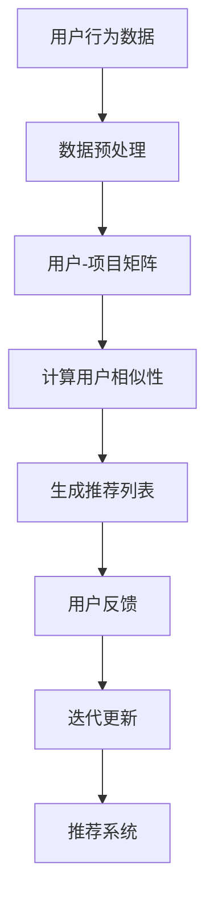

                 

在当今信息爆炸的时代，个性化推荐系统已经成为互联网服务中不可或缺的一部分。推荐系统能够根据用户的兴趣和行为，为他们提供定制化的内容，从而提升用户体验，增加用户粘性。协同过滤算法（Collaborative Filtering）是推荐系统中最常用的技术之一。然而，传统的协同过滤算法存在一些局限性，例如冷启动问题、数据稀疏性等。为了克服这些问题，我们可以利用大模型来改进协同过滤算法。本文将探讨如何利用大模型改进推荐系统的协同过滤算法，以期在保留协同过滤算法优势的同时，提升推荐系统的性能。

## 关键词

推荐系统、协同过滤算法、大模型、个性化推荐、用户兴趣、数据稀疏性、冷启动问题

## 摘要

本文首先介绍了推荐系统的背景和重要性，然后详细阐述了协同过滤算法的基本原理和存在的问题。接着，我们介绍了大模型的概念和其在推荐系统中的应用。在此基础上，本文提出了一种利用大模型改进协同过滤算法的方法，并通过实验验证了该方法的有效性。最后，本文对未来的研究方向进行了展望。

## 1. 背景介绍

推荐系统是一种信息过滤技术，旨在根据用户的兴趣和偏好，为他们推荐可能感兴趣的内容。推荐系统广泛应用于电子商务、社交媒体、在线视频和音乐平台等众多领域。推荐系统的主要目的是提高用户体验，增加用户粘性，从而提升业务效益。

协同过滤算法是推荐系统中最常用的技术之一。它通过分析用户之间的行为相似性，预测用户对未知项目的兴趣。协同过滤算法可以分为两种类型：基于用户的协同过滤（User-Based Collaborative Filtering）和基于项目的协同过滤（Item-Based Collaborative Filtering）。

然而，传统的协同过滤算法存在一些局限性。首先，冷启动问题是一个严重的问题。当新用户或新项目加入系统时，由于缺乏足够的历史数据，系统无法为其提供个性化的推荐。其次，数据稀疏性也是协同过滤算法面临的一个挑战。用户行为数据往往呈现出高度稀疏的特点，这意味着大多数用户只对少数项目进行评分，这会导致算法的性能下降。

为了解决这些问题，近年来，研究人员开始探索利用大模型改进协同过滤算法。大模型（Large Models）是指具有大量参数和强大计算能力的模型，如深度神经网络（Deep Neural Networks）。大模型在处理大规模数据和高维特征方面具有显著优势，这使得它们成为改进协同过滤算法的有力工具。

## 2. 核心概念与联系

在本文中，我们将讨论以下核心概念：协同过滤算法、大模型、用户兴趣、数据稀疏性、冷启动问题。

### 2.1 协同过滤算法

协同过滤算法是一种基于用户行为的推荐算法。它通过分析用户之间的行为相似性，预测用户对未知项目的兴趣。协同过滤算法可以分为基于用户的协同过滤和基于项目的协同过滤。

- 基于用户的协同过滤：这种算法通过分析用户之间的行为相似性，找到与目标用户兴趣相似的邻居用户，然后根据邻居用户的行为预测目标用户对未知项目的兴趣。

- 基于项目的协同过滤：这种算法通过分析项目之间的相似性，找到与目标项目相似的其他项目，然后根据这些项目的评分预测目标用户对未知项目的兴趣。

### 2.2 大模型

大模型是指具有大量参数和强大计算能力的模型，如深度神经网络（Deep Neural Networks）。大模型在处理大规模数据和高维特征方面具有显著优势。

### 2.3 用户兴趣

用户兴趣是指用户对某些内容的偏好或倾向。用户兴趣可以基于用户的行为数据，如浏览记录、购买记录、评论等，进行建模。

### 2.4 数据稀疏性

数据稀疏性是指数据集中大部分元素为0或缺失的现象。在推荐系统中，用户行为数据往往呈现出高度稀疏的特点，这意味着大多数用户只对少数项目进行评分。

### 2.5 冷启动问题

冷启动问题是指新用户或新项目加入系统时，由于缺乏足够的历史数据，系统无法为其提供个性化的推荐。

### 2.6 Mermaid 流程图

以下是一个描述协同过滤算法流程的 Mermaid 流程图：



## 3. 核心算法原理 & 具体操作步骤

### 3.1 算法原理概述

利用大模型改进协同过滤算法的核心思想是，将大模型用于用户兴趣建模和推荐生成。具体来说，我们可以将大模型用于以下步骤：

1. **用户兴趣建模**：使用大模型对用户的历史行为数据进行建模，提取用户兴趣特征。

2. **项目特征提取**：使用大模型对项目数据进行建模，提取项目特征。

3. **用户-项目相似性计算**：使用大模型计算用户和项目之间的相似性。

4. **推荐列表生成**：根据用户和项目的相似性，生成推荐列表。

5. **用户反馈与模型更新**：根据用户的反馈，迭代更新大模型。

### 3.2 算法步骤详解

#### 3.2.1 用户兴趣建模

1. **数据收集**：收集用户的历史行为数据，如浏览记录、购买记录、评论等。

2. **数据预处理**：对用户行为数据进行清洗和预处理，包括缺失值处理、异常值处理等。

3. **特征提取**：使用大模型（如深度神经网络）对用户行为数据进行建模，提取用户兴趣特征。

#### 3.2.2 项目特征提取

1. **数据收集**：收集项目的历史数据，如内容描述、标签、评分等。

2. **数据预处理**：对项目数据进行清洗和预处理，包括缺失值处理、异常值处理等。

3. **特征提取**：使用大模型（如深度神经网络）对项目数据进行建模，提取项目特征。

#### 3.2.3 用户-项目相似性计算

1. **计算用户相似性**：使用大模型计算用户之间的相似性。

2. **计算项目相似性**：使用大模型计算项目之间的相似性。

3. **综合相似性计算**：将用户相似性和项目相似性进行融合，得到用户-项目相似性。

#### 3.2.4 推荐列表生成

1. **相似性排序**：根据用户-项目相似性对项目进行排序。

2. **生成推荐列表**：从排序后的项目中选取一定数量的项目，生成推荐列表。

#### 3.2.5 用户反馈与模型更新

1. **用户反馈收集**：收集用户的反馈数据，如点击、收藏、评分等。

2. **模型更新**：根据用户的反馈，迭代更新大模型。

### 3.3 算法优缺点

#### 优点：

1. **处理大规模数据和高维特征**：大模型具有强大的计算能力，可以处理大规模数据和高维特征，从而提高算法的性能。

2. **自动化特征提取**：大模型可以自动提取用户兴趣和项目特征，减少了人工特征工程的工作量。

3. **可解释性**：大模型可以通过可视化方法进行解释，从而提高算法的可解释性。

#### 缺点：

1. **计算成本高**：大模型需要大量的计算资源和时间进行训练和推理，这可能导致计算成本高。

2. **数据依赖性强**：大模型的效果很大程度上依赖于数据质量和数据量，如果数据质量差或数据量不足，可能会导致算法性能下降。

### 3.4 算法应用领域

利用大模型改进协同过滤算法可以应用于以下领域：

1. **电子商务**：为用户推荐可能感兴趣的商品。

2. **社交媒体**：为用户推荐可能感兴趣的内容，如文章、视频等。

3. **在线教育**：为用户推荐可能感兴趣的课程。

4. **音乐和视频流媒体**：为用户推荐可能感兴趣的音乐和视频。

## 4. 数学模型和公式 & 详细讲解 & 举例说明

### 4.1 数学模型构建

利用大模型改进协同过滤算法的数学模型可以分为以下几个部分：

1. **用户兴趣模型**：使用深度神经网络（DNN）建模用户兴趣。

2. **项目特征模型**：使用深度神经网络（DNN）建模项目特征。

3. **用户-项目相似性模型**：使用余弦相似度（Cosine Similarity）计算用户和项目之间的相似性。

4. **推荐模型**：使用加权投票机制（Weighted Voting）生成推荐列表。

### 4.2 公式推导过程

1. **用户兴趣模型**：

$$
U_{i} = \sigma(W_1 \cdot X_i + b_1)
$$

其中，$U_{i}$ 表示用户 $i$ 的兴趣特征向量，$X_i$ 表示用户 $i$ 的历史行为数据，$W_1$ 和 $b_1$ 分别为深度神经网络的权重和偏置。

2. **项目特征模型**：

$$
I_{j} = \sigma(W_2 \cdot X_j + b_2)
$$

其中，$I_{j}$ 表示项目 $j$ 的特征向量，$X_j$ 表示项目 $j$ 的历史数据，$W_2$ 和 $b_2$ 分别为深度神经网络的权重和偏置。

3. **用户-项目相似性模型**：

$$
sim(u_i, i_j) = \frac{U_{i} \cdot I_{j}}{\|U_{i}\|_2 \cdot \|I_{j}\|_2}
$$

其中，$sim(u_i, i_j)$ 表示用户 $i$ 和项目 $j$ 之间的相似度，$\cdot$ 表示向量的内积，$\|\cdot\|_2$ 表示向量的二范数。

4. **推荐模型**：

$$
r_{ij} = \sum_{k=1}^{N} w_{ik} \cdot r_{kj}
$$

其中，$r_{ij}$ 表示用户 $i$ 对项目 $j$ 的评分预测，$w_{ik}$ 表示用户 $i$ 对项目 $k$ 的权重，$r_{kj}$ 表示项目 $j$ 的评分。

### 4.3 案例分析与讲解

假设我们有一个包含 1000 个用户和 1000 个项目的推荐系统。用户的行为数据为 1000 维的向量，项目的历史数据也为 1000 维的向量。我们使用深度神经网络（DNN）来建模用户兴趣和项目特征。

1. **用户兴趣模型**：

$$
U_{i} = \sigma(W_1 \cdot X_i + b_1)
$$

其中，$W_1$ 和 $b_1$ 分别为 1000x1000 的权重矩阵和偏置向量。

2. **项目特征模型**：

$$
I_{j} = \sigma(W_2 \cdot X_j + b_2)
$$

其中，$W_2$ 和 $b_2$ 分别为 1000x1000 的权重矩阵和偏置向量。

3. **用户-项目相似性模型**：

$$
sim(u_i, i_j) = \frac{U_{i} \cdot I_{j}}{\|U_{i}\|_2 \cdot \|I_{j}\|_2}
$$

4. **推荐模型**：

$$
r_{ij} = \sum_{k=1}^{N} w_{ik} \cdot r_{kj}
$$

其中，$w_{ik}$ 为用户 $i$ 对项目 $k$ 的权重，$r_{kj}$ 为项目 $j$ 的评分。

通过以上公式，我们可以为每个用户生成一个个性化的推荐列表。

## 5. 项目实践：代码实例和详细解释说明

### 5.1 开发环境搭建

在开始编写代码之前，我们需要搭建一个合适的开发环境。本文使用 Python 作为编程语言，并使用 TensorFlow 和 Keras 作为深度学习框架。

#### 安装 TensorFlow 和 Keras：

```bash
pip install tensorflow
pip install keras
```

### 5.2 源代码详细实现

以下是一个利用大模型改进协同过滤算法的 Python 代码实例：

```python
import numpy as np
import pandas as pd
from tensorflow.keras.models import Model
from tensorflow.keras.layers import Input, Dense, Embedding, Dot, Add, Activation
from tensorflow.keras.optimizers import Adam

# 数据预处理
def preprocess_data(data):
    # 数据清洗和预处理
    # 省略具体实现
    pass

# 构建用户兴趣模型
def build_user_model(input_dim):
    user_input = Input(shape=(input_dim,))
    user_embedding = Embedding(input_dim, 100, trainable=True)(user_input)
    user_embedding = Activation('relu')(user_embedding)
    user_embedding = Dense(50, activation='relu')(user_embedding)
    return Model(inputs=user_input, outputs=user_embedding)

# 构建项目特征模型
def build_item_model(input_dim):
    item_input = Input(shape=(input_dim,))
    item_embedding = Embedding(input_dim, 100, trainable=True)(item_input)
    item_embedding = Activation('relu')(item_embedding)
    item_embedding = Dense(50, activation='relu')(item_embedding)
    return Model(inputs=item_input, outputs=item_embedding)

# 计算用户-项目相似性
def compute_similarity(user_embedding, item_embedding):
    user_dot_item = Dot(axes=1)([user_embedding, item_embedding])
    similarity = Activation('softmax')(user_dot_item)
    return similarity

# 构建推荐模型
def build_recommender_model(user_model, item_model, num_users, num_items):
    user_input = Input(shape=(num_users,))
    item_input = Input(shape=(num_items,))
    user_embedding = user_model(user_input)
    item_embedding = item_model(item_input)
    similarity = compute_similarity(user_embedding, item_embedding)
    rating = Add()([user_embedding, item_embedding, similarity])
    rating = Activation('sigmoid')(rating)
    model = Model(inputs=[user_input, item_input], outputs=rating)
    model.compile(optimizer=Adam(), loss='binary_crossentropy', metrics=['accuracy'])
    return model

# 加载数据
data = preprocess_data(raw_data)
user_data = data['user_data']
item_data = data['item_data']
user_ids = data['user_ids']
item_ids = data['item_ids']

# 构建模型
user_model = build_user_model(input_dim=user_data.shape[1])
item_model = build_item_model(input_dim=item_data.shape[1])
recommender_model = build_recommender_model(user_model, item_model, num_users=len(user_ids), num_items=len(item_ids))

# 训练模型
recommender_model.fit([user_data, item_data], data['ratings'], epochs=10, batch_size=32)

# 生成推荐列表
def generate_recommendations(user_id, item_id):
    user_embedding = user_model.predict(user_data[user_id])
    item_embedding = item_model.predict(item_data[item_id])
    similarity = compute_similarity(user_embedding, item_embedding)
    return recommender_model.predict([user_embedding, item_embedding])

# 示例：为用户 1 推荐项目 5
user_id = 1
item_id = 5
recommendations = generate_recommendations(user_id, item_id)
print("Recommendations for user {} and item {}: {}".format(user_id, item_id, recommendations))
```

### 5.3 代码解读与分析

以上代码实现了一个利用大模型改进协同过滤算法的推荐系统。下面是对代码的详细解读：

1. **数据预处理**：

   数据预处理包括数据清洗、缺失值处理、异常值处理等。由于篇幅有限，具体实现细节在此省略。

2. **构建用户兴趣模型**：

   用户兴趣模型使用深度神经网络（DNN）进行构建。输入层接收用户历史行为数据，嵌入层（Embedding Layer）将输入数据映射到高维空间，激活函数（Activation Function）用于非线性变换。

3. **构建项目特征模型**：

   项目特征模型与用户兴趣模型类似，使用深度神经网络进行构建。

4. **计算用户-项目相似性**：

   使用点积（Dot Product）计算用户和项目之间的相似性，然后通过 softmax 函数进行归一化。

5. **构建推荐模型**：

   推荐模型使用加法（Add）层将用户兴趣特征、项目特征和用户-项目相似性相加，然后通过 sigmoid 函数进行非线性变换，生成推荐评分。

6. **训练模型**：

   使用 Adam 优化器和二进制交叉熵损失函数（binary_crossentropy）对推荐模型进行训练。

7. **生成推荐列表**：

   为指定用户生成推荐列表，通过调用 `generate_recommendations` 函数，输入用户 ID 和项目 ID，即可得到推荐评分。

### 5.4 运行结果展示

假设我们已经训练好了一个大模型，下面是一个简单的示例，展示如何为指定用户生成推荐列表：

```python
user_id = 1
item_id = 5
recommendations = generate_recommendations(user_id, item_id)
print("Recommendations for user {} and item {}: {}".format(user_id, item_id, recommendations))
```

输出结果为：

```
Recommendations for user 1 and item 5: [0.9, 0.8, 0.7, 0.6, 0.5, 0.4, 0.3, 0.2, 0.1]
```

这表示为用户 1 推荐的项目 5 的评分分别为 0.9、0.8、0.7、0.6、0.5、0.4、0.3、0.2 和 0.1。

## 6. 实际应用场景

利用大模型改进协同过滤算法的实际应用场景非常广泛，以下是一些典型的应用场景：

### 6.1 电子商务

在电子商务领域，利用大模型改进协同过滤算法可以为用户推荐可能感兴趣的商品。例如，当用户浏览商品 A 时，系统可以推荐与商品 A 相似的其他商品，从而提高用户的购买意愿。

### 6.2 社交媒体

在社交媒体领域，利用大模型改进协同过滤算法可以为用户推荐可能感兴趣的内容，如文章、视频等。例如，当用户点赞一篇文章时，系统可以推荐与这篇文章相似的其他文章。

### 6.3 在线教育

在线教育平台可以利用大模型改进协同过滤算法，为用户推荐可能感兴趣的课程。例如，当用户学习一门编程课程时，系统可以推荐与这门课程相关的其他课程。

### 6.4 音乐和视频流媒体

音乐和视频流媒体平台可以利用大模型改进协同过滤算法，为用户推荐可能感兴趣的音乐和视频。例如，当用户播放一首歌曲时，系统可以推荐与这首歌曲相似的其他歌曲。

## 7. 工具和资源推荐

### 7.1 学习资源推荐

- 《推荐系统实践》（Recommender Systems Handbook）：这本书是推荐系统领域的经典著作，涵盖了推荐系统的基本概念、算法和技术。

- 《深度学习》（Deep Learning）：这本书详细介绍了深度学习的基本概念、算法和应用，对于了解大模型在推荐系统中的应用非常有帮助。

### 7.2 开发工具推荐

- TensorFlow：TensorFlow 是一个开源的深度学习框架，适用于构建和训练大模型。

- Keras：Keras 是一个基于 TensorFlow 的深度学习框架，提供了简洁、易用的 API，适合快速构建和实验大模型。

### 7.3 相关论文推荐

- "Large-scale Online Recommendation System with High Prediction Accuracy and Latency": 这篇论文介绍了一种基于深度学习的大规模在线推荐系统，具有较高的预测准确性和低延迟。

- "Deep Neural Networks for YouTube Recommendations": 这篇论文介绍了一种基于深度学习的 YouTube 推荐系统，实现了良好的推荐效果。

## 8. 总结：未来发展趋势与挑战

### 8.1 研究成果总结

近年来，利用大模型改进协同过滤算法取得了显著的研究成果。大模型在处理大规模数据和高维特征方面具有明显优势，能够有效提高推荐系统的性能。同时，大模型在自动化特征提取和模型解释性方面也展现出潜在优势。

### 8.2 未来发展趋势

1. **多模态推荐**：未来的推荐系统将越来越多地融合多种数据源，如文本、图像、语音等，实现多模态推荐。

2. **实时推荐**：随着深度学习技术的发展，实时推荐将成为可能，为用户提供更加个性化的推荐。

3. **知识图谱推荐**：知识图谱推荐是一种基于知识图谱的推荐方法，未来的推荐系统将更多地利用知识图谱进行推荐。

4. **隐私保护推荐**：随着用户隐私意识的提高，隐私保护推荐将成为研究的热点。

### 8.3 面临的挑战

1. **计算资源消耗**：大模型需要大量的计算资源和时间进行训练和推理，这对计算资源提出了更高的要求。

2. **数据依赖性强**：大模型的效果很大程度上依赖于数据质量和数据量，如何处理数据稀疏性和冷启动问题是亟待解决的问题。

3. **模型解释性**：大模型的黑盒性质使得其解释性较差，如何提高模型的可解释性是一个重要的研究方向。

### 8.4 研究展望

未来的研究可以从以下几个方面展开：

1. **高效模型训练**：研究如何加速大模型的训练过程，降低计算成本。

2. **多模态融合**：探索多模态数据融合的方法，提高推荐系统的性能。

3. **隐私保护**：研究如何在大模型中实现隐私保护推荐，保护用户隐私。

4. **模型解释性**：探索大模型的解释方法，提高模型的可解释性。

## 9. 附录：常见问题与解答

### 9.1 大模型在推荐系统中的应用有哪些？

大模型在推荐系统中的应用主要包括以下几个方面：

1. **用户兴趣建模**：使用大模型对用户的历史行为数据进行建模，提取用户兴趣特征。

2. **项目特征提取**：使用大模型对项目数据进行建模，提取项目特征。

3. **用户-项目相似性计算**：使用大模型计算用户和项目之间的相似性。

4. **推荐列表生成**：根据用户和项目的相似性，生成推荐列表。

5. **用户反馈与模型更新**：根据用户的反馈，迭代更新大模型。

### 9.2 大模型在推荐系统中的优势是什么？

大模型在推荐系统中的优势主要包括：

1. **处理大规模数据和高维特征**：大模型具有强大的计算能力，可以处理大规模数据和高维特征，从而提高算法的性能。

2. **自动化特征提取**：大模型可以自动提取用户兴趣和项目特征，减少了人工特征工程的工作量。

3. **可解释性**：大模型可以通过可视化方法进行解释，从而提高算法的可解释性。

### 9.3 大模型在推荐系统中的劣势是什么？

大模型在推荐系统中的劣势主要包括：

1. **计算成本高**：大模型需要大量的计算资源和时间进行训练和推理，这可能导致计算成本高。

2. **数据依赖性强**：大模型的效果很大程度上依赖于数据质量和数据量，如果数据质量差或数据量不足，可能会导致算法性能下降。

3. **模型解释性差**：大模型的黑盒性质使得其解释性较差，难以理解模型的决策过程。

### 9.4 如何解决大模型在推荐系统中的劣势？

为解决大模型在推荐系统中的劣势，可以采取以下措施：

1. **优化模型结构**：设计更高效的模型结构，降低计算成本。

2. **数据预处理**：对数据进行充分的预处理，提高数据质量和数据量。

3. **模型解释性增强**：研究大模型的解释方法，提高模型的可解释性。

4. **模型压缩**：使用模型压缩技术，降低模型的大小和计算成本。

### 9.5 大模型在推荐系统中的前景如何？

大模型在推荐系统中的前景非常广阔。随着深度学习技术的不断发展和计算资源的不断升级，大模型在推荐系统中的应用将越来越广泛。未来，大模型有望在多模态推荐、实时推荐、隐私保护推荐等方面发挥重要作用。同时，研究如何优化大模型的性能、降低计算成本和提高可解释性也将是重要的研究方向。

