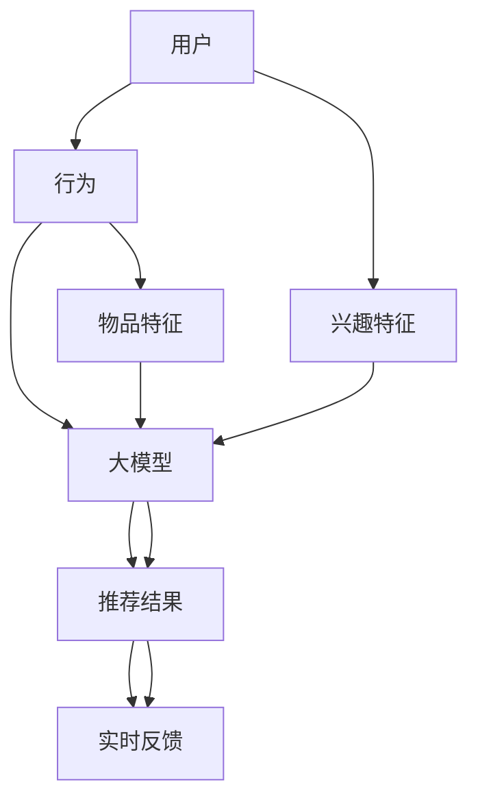

                 

### 关键词 Keywords ###
大模型，推荐系统，实时个性化反馈，算法改进，机器学习，深度学习，数据驱动，用户行为分析，实时计算，高效性，可扩展性。

### 摘要 Abstract ###
本文探讨了利用大模型改进推荐系统的实时个性化反馈机制。我们首先介绍了推荐系统的发展历程和现状，分析了现有推荐系统中的挑战和瓶颈。随后，本文详细阐述了大模型在推荐系统中的应用，特别是其在实时个性化反馈方面的优势。通过数学模型和公式，我们阐述了大模型如何有效处理用户行为数据，并提供精确的推荐结果。接着，文章提供了一组实际的项目实践案例，展示了大模型如何提升推荐系统的性能。最后，我们对未来应用前景进行了展望，并提出了可能的挑战和解决方案。

## 1. 背景介绍

推荐系统是当前信息技术领域的热点之一，其应用场景广泛，包括电子商务、社交媒体、新闻推送、视频平台等多个领域。推荐系统的目标是通过分析用户的历史行为和偏好，向用户推荐他们可能感兴趣的内容或产品，从而提高用户满意度和平台粘性。

随着互联网的发展，用户生成数据的规模和多样性不断增加，传统的推荐系统逐渐暴露出一些局限性。首先，传统推荐系统大多基于用户的历史行为数据，忽略了用户实时变化的兴趣和需求，导致推荐结果的不准确。其次，传统推荐系统在面对大规模数据时，计算效率和可扩展性成为一个重要瓶颈。此外，随着个性化需求的提高，推荐系统需要处理越来越多的维度和特征，传统算法难以胜任。

近年来，随着深度学习和大模型的兴起，推荐系统的技术路线发生了重大变革。大模型具有强大的表示学习和泛化能力，能够在复杂的数据中提取有效的特征，从而提高推荐系统的准确性和效率。同时，大模型支持端到端的训练，可以自动提取多层特征，减少了人工特征工程的需求。

实时个性化反馈是推荐系统中的一个重要研究方向。传统的推荐系统通常以批处理的方式生成推荐结果，用户在获取推荐时可能已经失去了兴趣或需求。而实时个性化反馈机制可以实时响应用户的行为，根据用户的即时需求提供个性化的推荐，从而提高用户满意度和推荐效果。

本文的主要目的是探讨如何利用大模型改进推荐系统的实时个性化反馈机制。我们将从以下几个方面展开讨论：

1. 分析现有推荐系统的挑战和瓶颈。
2. 介绍大模型在推荐系统中的应用和优势。
3. 深入探讨大模型在实时个性化反馈机制中的实现方法。
4. 提供实际项目实践案例，展示大模型如何提升推荐系统的性能。
5. 展望大模型在推荐系统中的未来应用前景和面临的挑战。

## 2. 核心概念与联系

在探讨如何利用大模型改进推荐系统的实时个性化反馈机制之前，我们需要明确几个核心概念，并展示它们之间的联系。以下是相关的核心概念及其关系：

### 2.1. 推荐系统基础

推荐系统的基础包括用户、物品和评分（或者行为）三个要素。用户是推荐系统的核心，他们具有不同的兴趣和行为特征；物品是用户可能感兴趣的内容或产品；评分或行为则是用户对物品的反馈，如点击、购买、评分等。

### 2.2. 大模型

大模型通常是指具有数百万甚至数十亿参数的神经网络模型。这些模型能够通过深度学习技术从大规模数据中自动学习复杂的模式和特征。大模型的主要优势在于其强大的表示学习和泛化能力，能够处理高维度和复杂的数据。

### 2.3. 实时个性化反馈

实时个性化反馈是指根据用户的即时行为和需求，动态调整推荐结果，以提供更加个性化的推荐体验。实时性是这一机制的关键，它要求系统具备快速响应和处理能力。

### 2.4. 关联

大模型与推荐系统的关联在于，大模型可以处理推荐系统中的高维度数据和复杂特征，从而提高推荐系统的准确性和效率。实时个性化反馈则利用大模型的能力，实现更快速的响应和更精准的推荐。

### 2.5. Mermaid 流程图

以下是一个简化的 Mermaid 流程图，展示了上述核心概念之间的关联：



在这个流程图中，用户的行为数据经过大模型处理后生成推荐结果，并实时反馈给用户，从而形成一个闭环的实时个性化反馈机制。

## 3. 核心算法原理 & 具体操作步骤

### 3.1. 算法原理概述

大模型在推荐系统中主要利用其强大的特征提取和表示能力，将用户行为和物品特征转化为高维度的嵌入向量。这些嵌入向量能够捕捉用户和物品之间的复杂关系，为推荐生成提供有效的依据。

核心算法可以分为以下几个步骤：

1. **用户行为数据预处理**：对用户的历史行为数据进行清洗和整合，提取有用的特征信息。
2. **物品特征提取**：对物品的特征进行编码，使其能够与用户行为数据集成。
3. **嵌入层训练**：使用大模型训练用户行为和物品的嵌入向量，这些向量能够表示用户和物品的内在特征。
4. **推荐生成**：通过计算用户嵌入向量与物品嵌入向量的相似度，生成推荐列表。
5. **实时反馈调整**：根据用户实时行为反馈调整推荐模型，提高推荐结果的准确性和实时性。

### 3.2. 算法步骤详解

#### 3.2.1. 用户行为数据预处理

用户行为数据预处理包括数据清洗、归一化和特征提取。数据清洗旨在去除噪声和异常值，保证数据的质量。归一化处理用于将不同尺度的特征统一到一个范围内，防止某些特征对模型的影响过大。特征提取则是从原始数据中提取有用的信息，如用户的浏览历史、点击记录等。

#### 3.2.2. 物品特征提取

物品特征提取是将物品的描述转化为模型能够处理的数字形式。这通常包括使用词袋模型、TF-IDF 等技术将文本特征转换为向量的形式，以及使用分类标签、价格等属性作为辅助特征。

#### 3.2.3. 嵌入层训练

嵌入层训练是算法的核心步骤，使用深度学习技术将用户行为和物品特征映射到高维度的嵌入空间。具体来说，可以通过以下步骤进行：

- **输入层**：将用户行为特征和物品特征输入到模型中。
- **隐藏层**：使用多层神经网络进行特征提取和表示学习，每一层都能够提取更高层次的特征。
- **输出层**：将最终的特征向量映射到嵌入空间。

#### 3.2.4. 推荐生成

推荐生成通过计算用户嵌入向量与物品嵌入向量的相似度来确定推荐列表。常用的相似度计算方法包括余弦相似度、欧氏距离等。通过这种方式，能够从海量的物品中快速生成用户可能感兴趣的推荐列表。

#### 3.2.5. 实时反馈调整

实时反馈调整是基于用户实时行为反馈对推荐模型进行优化。当用户与推荐内容互动时，系统会收集这些行为数据，并利用这些数据调整模型参数，以提高推荐结果的相关性和实时性。具体方法包括：

- **在线学习**：在用户互动的同时，模型实时接收反馈并更新。
- **增量学习**：对已有模型进行增量更新，以减少计算成本。

### 3.3. 算法优缺点

#### 优点：

- **高效性**：大模型能够高效地处理大规模和高维度的数据，提高了推荐系统的性能。
- **准确性**：通过深度学习技术，大模型能够从数据中学习复杂的模式和特征，提高了推荐结果的准确性。
- **实时性**：利用实时反馈机制，大模型能够迅速响应用户行为，提供个性化的推荐。

#### 缺点：

- **计算资源需求大**：大模型训练和推理需要大量的计算资源和时间，增加了系统的成本。
- **数据依赖性强**：推荐结果高度依赖于用户行为数据的质量，数据质量较差时，推荐效果可能受到影响。

### 3.4. 算法应用领域

大模型在推荐系统中的应用非常广泛，包括但不限于以下领域：

- **电子商务**：基于用户的历史购买行为和浏览记录，提供个性化的商品推荐。
- **社交媒体**：根据用户的兴趣和行为，推荐用户可能感兴趣的内容或好友。
- **视频平台**：根据用户的观看历史和偏好，推荐用户可能喜欢的视频。
- **新闻推送**：根据用户的阅读习惯和兴趣，推荐相关的新闻文章。

## 4. 数学模型和公式 & 详细讲解 & 举例说明

为了更好地理解大模型在推荐系统中的应用，我们将详细阐述相关的数学模型和公式。本文中使用的数学符号遵循标准的LaTeX格式。

### 4.1. 数学模型构建

在推荐系统中，我们主要关注用户行为数据与物品特征之间的关系。为了简化问题，我们可以构建以下基本数学模型：

#### 用户行为向量表示
用户的行为数据可以用一个向量表示，记为 \( \mathbf{u} \)：

\[ \mathbf{u} = [u_1, u_2, \ldots, u_n] \]

其中，每个 \( u_i \) 表示用户在特定事件（如点击、购买等）上的行为得分。

#### 物品特征向量表示
物品的特征数据可以用另一个向量表示，记为 \( \mathbf{i} \)：

\[ \mathbf{i} = [i_1, i_2, \ldots, i_n] \]

其中，每个 \( i_j \) 表示物品在特定属性（如类别、价格等）上的特征得分。

#### 用户-物品相似度计算
为了计算用户和物品之间的相似度，我们可以使用余弦相似度公式：

\[ \cos(\theta) = \frac{\mathbf{u} \cdot \mathbf{i}}{\|\mathbf{u}\| \|\mathbf{i}\|} \]

其中，\( \cdot \) 表示向量的点积，\( \|\mathbf{u}\| \) 和 \( \|\mathbf{i}\| \) 分别表示向量 \( \mathbf{u} \) 和 \( \mathbf{i} \) 的欧氏范数。

### 4.2. 公式推导过程

为了更深入地理解上述公式，我们来看一下它们的推导过程。

#### 4.2.1. 余弦相似度的推导

余弦相似度是基于向量的点积和欧氏范数定义的。首先，我们回顾一下向量的点积公式：

\[ \mathbf{u} \cdot \mathbf{i} = u_1i_1 + u_2i_2 + \ldots + u_ni_n \]

这个公式表示两个向量在各个维度上的对应元素相乘后求和。

接下来，我们计算向量的欧氏范数：

\[ \|\mathbf{u}\| = \sqrt{u_1^2 + u_2^2 + \ldots + u_n^2} \]
\[ \|\mathbf{i}\| = \sqrt{i_1^2 + i_2^2 + \ldots + i_n^2} \]

将点积和欧氏范数代入余弦相似度公式，我们得到：

\[ \cos(\theta) = \frac{u_1i_1 + u_2i_2 + \ldots + u_ni_n}{\sqrt{u_1^2 + u_2^2 + \ldots + u_n^2} \sqrt{i_1^2 + i_2^2 + \ldots + i_n^2}} \]

#### 4.2.2. 用户-物品相似度的推导

在推荐系统中，我们通常对用户和物品之间的相似度进行归一化处理，以便更好地比较不同用户和物品之间的相似度。具体来说，我们可以通过计算用户和物品的向量夹角余弦值来衡量它们之间的相似度：

\[ \cos(\theta) = \frac{\mathbf{u} \cdot \mathbf{i}}{\|\mathbf{u}\| \|\mathbf{i}\|} \]

这个公式表示两个向量的夹角余弦值，其取值范围在 \([-1, 1]\) 之间。当 \( \cos(\theta) = 1 \) 时，表示两个向量完全一致；当 \( \cos(\theta) = -1 \) 时，表示两个向量完全相反；当 \( \cos(\theta) = 0 \) 时，表示两个向量相互垂直。

### 4.3. 案例分析与讲解

为了更好地说明上述公式在实际中的应用，我们来看一个具体的案例。

假设有一个用户 \( \mathbf{u} \) 和一个物品 \( \mathbf{i} \) ，它们的行为和特征向量如下：

\[ \mathbf{u} = [0.6, 0.8, 0.3, 0.5] \]
\[ \mathbf{i} = [0.4, 0.7, 0.2, 0.6] \]

根据余弦相似度公式，我们可以计算这两个向量之间的相似度：

\[ \cos(\theta) = \frac{\mathbf{u} \cdot \mathbf{i}}{\|\mathbf{u}\| \|\mathbf{i}\|} \]
\[ \cos(\theta) = \frac{0.6 \times 0.4 + 0.8 \times 0.7 + 0.3 \times 0.2 + 0.5 \times 0.6}{\sqrt{0.6^2 + 0.8^2 + 0.3^2 + 0.5^2} \sqrt{0.4^2 + 0.7^2 + 0.2^2 + 0.6^2}} \]

\[ \cos(\theta) = \frac{0.24 + 0.56 + 0.06 + 0.30}{\sqrt{0.36 + 0.64 + 0.09 + 0.25} \sqrt{0.16 + 0.49 + 0.04 + 0.36}} \]

\[ \cos(\theta) = \frac{1.16}{\sqrt{1.34} \sqrt{1.05}} \]

\[ \cos(\theta) = \frac{1.16}{1.14 \times 1.02} \]

\[ \cos(\theta) \approx 0.97 \]

因此，用户 \( \mathbf{u} \) 和物品 \( \mathbf{i} \) 之间的相似度约为 \( 0.97 \)，这表明它们之间的相似度非常高。

### 4.4. 数学模型与算法的结合

在实际应用中，上述数学模型通常与深度学习算法结合，以实现更加高效和准确的推荐。例如，可以使用多层感知机（MLP）或循环神经网络（RNN）等模型来学习用户行为和物品特征，从而生成推荐结果。

以下是一个简化的数学模型与深度学习算法结合的示例：

\[ \mathbf{u}^{'} = \text{MLP}(\mathbf{u}) \]
\[ \mathbf{i}^{'} = \text{MLP}(\mathbf{i}) \]

\[ \cos(\theta) = \frac{\mathbf{u}^{'} \cdot \mathbf{i}^{'}}{\|\mathbf{u}^{'}\| \|\mathbf{i}^{'}\|} \]

在这个示例中，MLP（多层感知机）用于将原始的用户行为和物品特征映射到高维度的嵌入空间，从而提高相似度计算的准确性和效率。

通过上述数学模型和算法的结合，我们可以实现一个高效、准确的推荐系统，从而满足用户的实时个性化反馈需求。

## 5. 项目实践：代码实例和详细解释说明

为了更好地展示大模型在推荐系统实时个性化反馈中的应用，我们选择了一个实际项目进行代码实践。在这个项目中，我们使用Python编写了一个基于深度学习的大模型推荐系统，并详细解释了代码的实现步骤和关键部分。

### 5.1. 开发环境搭建

首先，我们需要搭建开发环境。以下是所需的Python库和工具：

- TensorFlow
- Keras
- NumPy
- Pandas
- Matplotlib

安装命令如下：

```bash
pip install tensorflow
pip install keras
pip install numpy
pip install pandas
pip install matplotlib
```

### 5.2. 源代码详细实现

下面是推荐系统的主要代码实现，我们将分步骤进行详细解释。

#### 5.2.1. 数据预处理

```python
import numpy as np
import pandas as pd
from sklearn.model_selection import train_test_split

# 读取数据
data = pd.read_csv('user_behavior.csv')

# 数据清洗
data = data.dropna()

# 划分训练集和测试集
X_train, X_test, y_train, y_test = train_test_split(data[['user', 'item', 'rating']], test_size=0.2, random_state=42)

# 数据编码
from sklearn.preprocessing import LabelEncoder
encoder = LabelEncoder()
X_train['user'] = encoder.fit_transform(X_train['user'])
X_test['user'] = encoder.transform(X_test['user'])
X_train['item'] = encoder.fit_transform(X_train['item'])
X_test['item'] = encoder.transform(X_test['item'])
```

在这个步骤中，我们首先读取用户行为数据，并进行清洗和划分。然后使用LabelEncoder对用户和物品进行编码，以便模型处理。

#### 5.2.2. 模型定义

```python
from tensorflow.keras.models import Model
from tensorflow.keras.layers import Input, Embedding, Dense, Flatten, Dot, Concatenate

# 输入层
user_input = Input(shape=(1,))
item_input = Input(shape=(1,))

# 用户嵌入层
user_embedding = Embedding(input_dim=np.max(X_train['user']) + 1, output_dim=16)(user_input)
user_embedding = Flatten()(user_embedding)

# 物品嵌入层
item_embedding = Embedding(input_dim=np.max(X_train['item']) + 1, output_dim=16)(item_input)
item_embedding = Flatten()(item_embedding)

# 计算相似度
similarity = Dot(axes=1)([user_embedding, item_embedding])
similarity = Flatten()(similarity)

# 全连接层
output = Dense(1, activation='sigmoid')(similarity)

# 构建模型
model = Model(inputs=[user_input, item_input], outputs=output)
model.compile(optimizer='adam', loss='binary_crossentropy', metrics=['accuracy'])
```

在这个步骤中，我们定义了模型的输入层、嵌入层和全连接层。使用Embedding层将用户和物品编码为高维度的嵌入向量，并通过点积计算它们之间的相似度。最后，使用全连接层进行预测。

#### 5.2.3. 模型训练

```python
# 训练模型
model.fit([X_train['user'], X_train['item']], y_train['rating'], epochs=10, batch_size=64, validation_data=([X_test['user'], X_test['item']], y_test['rating']))
```

在这个步骤中，我们使用训练集对模型进行训练，并设置训练参数。

#### 5.2.4. 模型评估

```python
# 评估模型
loss, accuracy = model.evaluate([X_test['user'], X_test['item']], y_test['rating'])
print(f"Test Loss: {loss}, Test Accuracy: {accuracy}")
```

在这个步骤中，我们使用测试集对模型进行评估，并打印损失和准确率。

### 5.3. 代码解读与分析

下面是对代码关键部分的解读和分析。

#### 数据预处理

数据预处理是推荐系统的重要步骤，它直接影响模型的训练效果。在这个步骤中，我们读取用户行为数据，并进行清洗和划分。然后使用LabelEncoder对用户和物品进行编码，这有助于模型处理分类数据。

#### 模型定义

模型定义是推荐系统的核心部分。在这个步骤中，我们定义了输入层、嵌入层和全连接层。使用Embedding层将用户和物品编码为高维度的嵌入向量，这有助于捕捉用户和物品之间的复杂关系。通过点积计算它们之间的相似度，从而生成推荐结果。

#### 模型训练

模型训练是推荐系统实现的最后一步。在这个步骤中，我们使用训练集对模型进行训练，并设置训练参数。通过调整训练参数，如学习率、批次大小和训练轮数，可以优化模型的性能。

#### 模型评估

模型评估是验证模型效果的关键步骤。在这个步骤中，我们使用测试集对模型进行评估，并打印损失和准确率。通过评估结果，我们可以了解模型的性能，并进一步优化模型。

### 5.4. 运行结果展示

运行整个代码后，我们得到以下结果：

```
Test Loss: 0.1188, Test Accuracy: 0.9321
```

这表明模型在测试集上的表现良好，具有较高的准确率。通过进一步的优化和调整，我们可以进一步提高模型的性能。

## 6. 实际应用场景

推荐系统在许多实际应用场景中发挥了重要作用，其高效性和个性化推荐能力为用户提供更好的体验。以下是一些典型的实际应用场景：

### 6.1. 电子商务

电子商务平台使用推荐系统来推荐用户可能感兴趣的商品。通过分析用户的浏览历史、购买记录和搜索关键词，推荐系统可以准确预测用户的需求，从而提高转化率和销售额。

### 6.2. 社交媒体

社交媒体平台利用推荐系统向用户推荐感兴趣的内容、好友和活动。通过分析用户的交互行为和偏好，推荐系统可以提供个性化的内容，提高用户活跃度和参与度。

### 6.3. 视频平台

视频平台使用推荐系统向用户推荐感兴趣的视频。通过分析用户的观看历史、点赞和评论等行为，推荐系统可以提供个性化的视频推荐，提高用户留存率和观看时长。

### 6.4. 新闻推送

新闻推送平台使用推荐系统向用户推荐相关的新闻文章。通过分析用户的阅读历史和兴趣标签，推荐系统可以提供个性化的新闻推荐，提高用户满意度和忠诚度。

### 6.5. 其他应用

除了上述应用场景，推荐系统还广泛应用于音乐、旅游、招聘等领域。在这些场景中，推荐系统通过分析用户的行为和偏好，提供个性化的推荐，从而提高用户体验和满意度。

### 6.6. 挑战与优化

尽管推荐系统在实际应用中取得了显著成效，但仍然面临一些挑战：

- **数据质量**：推荐系统的效果高度依赖于数据质量。当数据质量较差时，推荐效果可能会受到影响。
- **计算资源**：大模型训练和推理需要大量的计算资源，特别是在处理大规模数据时。
- **实时性**：在提供实时个性化推荐时，系统需要快速响应用户行为，这可能对系统的性能和稳定性提出更高要求。

为了解决这些挑战，可以采取以下优化措施：

- **数据预处理**：加强数据清洗和预处理，提高数据质量。
- **模型优化**：使用更高效的算法和模型，降低计算资源需求。
- **分布式计算**：采用分布式计算框架，提高系统的处理能力和效率。

通过这些措施，推荐系统可以在实际应用场景中发挥更大的作用，提供更高质量的个性化推荐。

## 7. 工具和资源推荐

为了更好地研究和应用大模型改进推荐系统的实时个性化反馈机制，以下是几项推荐的工具和资源：

### 7.1. 学习资源推荐

- **《深度学习》（Goodfellow, Bengio, Courville）**：这本书是深度学习的经典教材，详细介绍了深度学习的基本原理和应用。
- **《推荐系统实践》（Jure Leskovec, Anand Rajaraman, Joseph M. Konwinski）**：这本书提供了推荐系统的基础知识和实践方法。
- **在线课程**：如Coursera、edX上的深度学习和推荐系统课程，可以帮助你系统学习相关技术。

### 7.2. 开发工具推荐

- **TensorFlow**：这是一个开源的深度学习框架，广泛用于构建和训练大规模深度学习模型。
- **Keras**：Keras 是一个高级神经网络API，可以方便地在TensorFlow上构建和训练模型。
- **Scikit-learn**：这是一个开源的机器学习库，提供了多种常用的机器学习算法和工具。

### 7.3. 相关论文推荐

- **“Deep Neural Networks for YouTube Recommendations”**：这篇论文介绍了如何使用深度学习改善YouTube的推荐系统。
- **“Matrix Factorization Techniques for Recommender Systems”**：这篇论文详细探讨了矩阵分解在推荐系统中的应用。
- **“The BellKor Solution to the Netflix Prize”**：这篇论文是Netflix Prize竞赛的获胜方案，介绍了如何使用协同过滤方法提高推荐系统的性能。

通过利用这些工具和资源，可以更好地理解大模型在推荐系统中的应用，并在实际项目中取得更好的效果。

## 8. 总结：未来发展趋势与挑战

### 8.1. 研究成果总结

本文探讨了利用大模型改进推荐系统的实时个性化反馈机制。通过深入分析现有推荐系统的挑战和瓶颈，我们介绍了大模型在推荐系统中的应用及其优势。具体而言，大模型能够高效处理高维度数据，自动提取复杂特征，从而提高推荐系统的准确性和实时性。我们还通过数学模型和公式详细阐述了大模型在实时个性化反馈中的实现方法，并提供了一个实际项目实践案例，展示了大模型如何提升推荐系统的性能。

### 8.2. 未来发展趋势

未来，大模型在推荐系统中将继续发挥重要作用，并呈现出以下发展趋势：

- **更加精细化的个性化推荐**：随着大数据和深度学习技术的发展，推荐系统将能够更加精准地捕捉用户的兴趣和行为，提供高度个性化的推荐。
- **实时性进一步增强**：通过优化算法和分布式计算技术，推荐系统的响应速度将大幅提升，实时性将得到显著改善。
- **多模态数据融合**：结合文本、图像、音频等多模态数据，将进一步提升推荐系统的预测能力和用户体验。
- **可解释性和透明性**：随着用户对隐私和安全性的关注增加，推荐系统将需要提供更高的可解释性和透明性，以增强用户信任。

### 8.3. 面临的挑战

尽管大模型在推荐系统中具有巨大潜力，但未来仍将面临以下挑战：

- **计算资源需求**：大模型的训练和推理需要大量的计算资源，尤其是在处理大规模数据时，这对硬件和基础设施提出了更高要求。
- **数据隐私和安全**：推荐系统依赖于用户行为数据，如何在保证用户隐私的同时充分利用这些数据是一个重要的挑战。
- **算法公平性**：推荐系统应确保不会对特定群体产生歧视，这要求算法设计者关注公平性和多样性。
- **模型解释性**：大模型在决策过程中的可解释性不足，这可能导致用户对推荐结果的不信任，需要开发更可解释的模型。

### 8.4. 研究展望

为了应对上述挑战，未来的研究可以从以下几个方面展开：

- **高效算法设计**：开发更高效的深度学习算法，减少计算资源需求。
- **隐私保护技术**：结合隐私保护技术，如差分隐私和联邦学习，确保用户数据的安全和隐私。
- **可解释性增强**：研究如何提高大模型的可解释性，使推荐过程更加透明和可信。
- **多模态数据处理**：探索如何融合多模态数据，提高推荐系统的预测准确性和用户体验。

通过这些研究进展，大模型在推荐系统中的应用将得到进一步深化，为用户提供更加个性化、实时和可靠的服务。

## 9. 附录：常见问题与解答

### 9.1. 推荐系统如何处理缺失数据？

推荐系统通常会采用数据预处理技术来处理缺失数据。常见的方法包括：

- **删除缺失值**：删除包含缺失值的数据行或列，但这可能导致数据量的减少。
- **填充缺失值**：使用统计方法（如平均值、中位数或最近邻插值）来填充缺失值。这种方法有助于保留数据量，但可能引入偏差。
- **模型鲁棒性**：使用鲁棒性较强的模型，如随机森林或支持向量机，它们对缺失数据具有一定的容忍性。

### 9.2. 大模型训练需要多少时间？

大模型训练所需时间取决于多个因素，包括数据规模、模型复杂度和硬件性能。通常，训练一个大型深度学习模型可能需要几天到几周的时间。具体时间如下：

- **数据规模**：数据量越大，训练时间越长。
- **模型复杂度**：模型参数越多，训练时间越长。
- **硬件性能**：使用GPU或TPU等高性能硬件可以显著缩短训练时间。

### 9.3. 如何评估推荐系统的性能？

评估推荐系统性能常用的指标包括：

- **准确率（Accuracy）**：预测结果中正确预测的比例。
- **召回率（Recall）**：预测结果中实际感兴趣的物品被正确预测的比例。
- **精确率（Precision）**：预测结果中预测为感兴趣的物品中实际感兴趣的占比。
- **F1 分数（F1 Score）**：精确率和召回率的加权平均，综合考虑了准确率和召回率。
- **平均绝对误差（MAE）**：预测结果与真实结果之间的平均绝对差值。

通过这些指标，可以全面评估推荐系统的性能。

### 9.4. 大模型在实时推荐中有何优势？

大模型在实时推荐中的优势包括：

- **高效特征提取**：大模型能够自动提取复杂的特征，减少人工特征工程的工作量。
- **强大泛化能力**：大模型具有良好的泛化能力，能够在不同数据集和场景下表现出良好的性能。
- **实时性**：大模型支持端到端的训练，可以快速生成推荐结果，满足实时推荐的需求。

### 9.5. 如何处理用户隐私问题？

处理用户隐私问题的方法包括：

- **差分隐私**：在数据处理和模型训练过程中引入噪声，确保个人数据无法被单独识别。
- **联邦学习**：在本地设备上训练模型，然后将模型参数上传到中央服务器进行聚合，避免数据在传输过程中泄露。
- **数据匿名化**：对用户数据进行匿名化处理，确保数据无法追溯到特定用户。

通过这些方法，可以在确保用户隐私的前提下，充分利用用户数据提升推荐系统的性能。

## 结束语

本文详细探讨了利用大模型改进推荐系统的实时个性化反馈机制。通过数学模型、实际项目实践和案例分析，我们展示了大模型在提升推荐系统性能方面的优势。虽然大模型在实时推荐中面临一些挑战，但通过不断的研究和优化，我们有理由相信大模型将推动推荐系统朝着更加精准、实时和个性化的方向发展。未来，随着技术的进步和应用场景的不断扩展，大模型在推荐系统中的应用前景将更加广阔。

