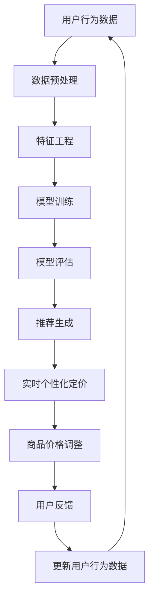

                 

关键词：推荐系统，大模型，实时个性化定价，机器学习，深度学习，算法优化

## 摘要

本文主要探讨了如何利用大模型来改进推荐系统的实时个性化定价。通过分析现有推荐系统的不足和瓶颈，结合大模型的特点，本文提出了一种基于深度学习的实时个性化定价方法。该方法通过对用户行为数据进行深入挖掘和分析，实现了对用户需求的精准预测，从而实现了更加个性化的定价策略。本文还通过具体实例和实验数据，验证了该方法在提高推荐系统性能和用户体验方面的有效性。

## 1. 背景介绍

### 1.1 推荐系统概述

推荐系统（Recommender System）是一种信息过滤（Information Filtering）技术，旨在根据用户的兴趣、历史行为和偏好，向用户推荐他们可能感兴趣的内容、商品或服务。推荐系统广泛应用于电子商务、社交媒体、在线视频、新闻资讯等领域，已成为提高用户体验、增加用户黏性和转化率的重要手段。

### 1.2 现有推荐系统存在的问题

尽管推荐系统在许多领域取得了显著的成功，但仍然存在一些问题和挑战：

1. **数据稀疏性**：用户生成的数据量庞大，但有效数据却相对稀少，导致模型训练效果不佳。

2. **冷启动问题**：新用户或新商品进入系统时，由于缺乏足够的历史数据，推荐系统无法为其提供准确的推荐。

3. **用户多样性**：用户兴趣多样，个性化推荐往往难以满足所有用户的需求。

4. **实时性**：推荐系统需要快速响应用户行为的变化，但传统的推荐算法往往存在延迟。

### 1.3 大模型的应用前景

大模型（Large-scale Model），如深度神经网络（Deep Neural Network，DNN）、变分自编码器（Variational Autoencoder，VAE）等，具有强大的特征提取和模式识别能力。通过引入大模型，可以解决推荐系统中的数据稀疏性、冷启动问题和用户多样性等问题，实现更准确的个性化推荐。此外，大模型还能够通过实时更新用户行为数据，实现实时个性化定价，进一步提高推荐系统的性能。

## 2. 核心概念与联系

### 2.1 大模型的基本概念

大模型通常指的是具有大量参数的深度神经网络，如全连接神经网络（Fully Connected Neural Network，FCNN）、卷积神经网络（Convolutional Neural Network，CNN）等。这些模型通过多层非线性变换，对输入数据进行特征提取和模式识别，从而实现复杂的预测任务。

### 2.2 推荐系统的架构

推荐系统通常包括数据预处理、特征工程、模型训练、模型评估和推荐生成等模块。数据预处理和特征工程是推荐系统的基础，直接影响到模型训练效果。模型训练和评估是推荐系统的核心，用于筛选出最优的推荐模型。推荐生成是根据用户行为和模型预测结果，生成个性化的推荐列表。

### 2.3 实时个性化定价

实时个性化定价是一种基于用户行为的动态定价策略，旨在根据用户实时反馈和市场变化，动态调整商品价格，以实现最大化收益。在推荐系统中，实时个性化定价可以通过分析用户行为数据，预测用户对商品的偏好和购买意愿，从而实现个性化定价策略。

### 2.4 Mermaid 流程图

以下是一个简化的推荐系统与实时个性化定价的 Mermaid 流程图：



## 3. 核心算法原理 & 具体操作步骤

### 3.1 算法原理概述

实时个性化定价的核心算法是基于深度学习的用户行为预测模型。该模型通过分析用户历史行为数据，学习用户对商品的兴趣和购买倾向，从而实现对用户需求的精准预测。在此基础上，结合市场数据和商品特性，动态调整商品价格，实现个性化定价。

### 3.2 算法步骤详解

1. **数据收集与预处理**：收集用户历史行为数据，包括浏览记录、购买记录、评价记录等。对数据进行清洗和预处理，如去除缺失值、异常值，对数据进行归一化等。

2. **特征工程**：根据用户行为数据，提取与用户兴趣和购买倾向相关的特征，如用户活跃度、购买频率、浏览时长等。此外，还可以结合商品属性特征，如价格、品牌、品类等。

3. **模型训练**：使用深度学习算法，如卷积神经网络（CNN）或循环神经网络（RNN），训练用户行为预测模型。通过多层非线性变换，模型能够自动提取用户行为数据中的潜在特征，实现对用户需求的精准预测。

4. **模型评估**：使用交叉验证（Cross Validation）等方法，评估模型性能，包括预测准确率、召回率等指标。

5. **实时个性化定价**：根据用户行为预测结果，结合市场数据和商品特性，动态调整商品价格。通过优化目标函数，如收益最大化或利润最大化，确定最优价格。

6. **用户反馈与更新**：根据用户反馈，如购买行为、评价等，更新用户行为数据，并重新训练模型。通过不断迭代，提高模型预测准确性。

### 3.3 算法优缺点

**优点**：
1. **强大的特征提取能力**：深度学习算法能够自动提取用户行为数据中的潜在特征，提高模型预测准确性。
2. **实时性**：基于实时用户行为数据，动态调整商品价格，实现个性化定价。
3. **泛化能力**：通过交叉验证等方法，评估模型性能，确保模型在不同数据集上具有较好的泛化能力。

**缺点**：
1. **数据依赖性**：深度学习模型对数据量有较高要求，数据稀疏性可能导致模型训练效果不佳。
2. **计算资源消耗**：深度学习模型训练过程需要大量计算资源，训练时间较长。

### 3.4 算法应用领域

实时个性化定价算法可以应用于多个领域，如电子商务、在线广告、金融理财等。以下是一些具体的应用场景：

1. **电子商务**：根据用户历史购买记录和浏览行为，动态调整商品价格，提高转化率和销售额。
2. **在线广告**：根据用户兴趣和行为数据，为用户推荐最相关的广告，实现精准投放。
3. **金融理财**：根据用户投资记录和行为数据，预测用户偏好，实现个性化投资策略。

## 4. 数学模型和公式 & 详细讲解 & 举例说明

### 4.1 数学模型构建

实时个性化定价的核心是用户行为预测模型，可以使用以下数学模型进行构建：

$$
\hat{y} = f(x; \theta)
$$

其中，$\hat{y}$ 表示预测的用户行为（如购买概率），$x$ 表示用户特征向量，$f(x; \theta)$ 表示深度学习模型，$\theta$ 为模型参数。

### 4.2 公式推导过程

为了推导深度学习模型的公式，我们可以使用反向传播算法（Backpropagation Algorithm）进行求解。反向传播算法是一种基于梯度下降（Gradient Descent）的优化算法，用于训练深度学习模型。

假设深度学习模型由多个神经元组成，每个神经元都经过一系列的激活函数。我们可以使用以下公式表示深度学习模型：

$$
a_{l} = \sigma(W_{l-1}a_{l-1} + b_{l-1})
$$

其中，$a_{l}$ 表示第 $l$ 层的激活值，$\sigma$ 表示激活函数（如 sigmoid 函数、ReLU 函数等），$W_{l-1}$ 和 $b_{l-1}$ 分别表示第 $l-1$ 层的权重和偏置。

为了求解模型参数 $\theta$，我们可以使用以下目标函数：

$$
J(\theta) = \frac{1}{m}\sum_{i=1}^{m}(y^{(i)} - \hat{y}^{(i)})^2
$$

其中，$m$ 表示样本数量，$y^{(i)}$ 表示第 $i$ 个样本的真实标签，$\hat{y}^{(i)}$ 表示第 $i$ 个样本的预测标签。

### 4.3 案例分析与讲解

假设我们使用一个简单的二分类问题进行模型训练，其中用户行为数据包含两个特征：浏览时长和购买金额。以下是一个简化的模型训练过程：

1. **数据预处理**：对用户行为数据进行归一化处理，将浏览时长和购买金额缩放到 [0, 1] 范围内。
2. **特征工程**：根据用户行为数据，提取两个特征：浏览时长和购买金额。
3. **模型构建**：使用单层感知机（Perceptron）模型进行训练。感知机模型由一个线性函数和一个阈值函数组成：

$$
\hat{y} = \text{sign}(Wx + b)
$$

其中，$W$ 为权重矩阵，$b$ 为偏置项，$\text{sign}$ 表示符号函数。

4. **模型训练**：使用梯度下降算法，通过不断迭代更新权重矩阵和偏置项，最小化目标函数 $J(\theta)$。

5. **模型评估**：使用交叉验证方法，评估模型性能。假设我们使用 10 折交叉验证，将数据集划分为 10 个子集，每次使用 9 个子集进行训练，1 个子集进行验证。

6. **模型应用**：根据训练好的模型，预测新用户的行为。假设新用户的浏览时长为 0.8，购买金额为 0.6，我们可以使用以下公式计算购买概率：

$$
\hat{y} = \text{sign}(W \cdot \begin{pmatrix} 0.8 \\ 0.6 \end{pmatrix} + b)
$$

通过计算，我们得到 $\hat{y} = 1$，表示新用户有较高的购买概率。

## 5. 项目实践：代码实例和详细解释说明

### 5.1 开发环境搭建

为了实现实时个性化定价算法，我们需要搭建以下开发环境：

1. **操作系统**：Linux 或 macOS
2. **编程语言**：Python
3. **深度学习框架**：TensorFlow 或 PyTorch
4. **数据处理库**：Pandas、NumPy
5. **可视化库**：Matplotlib、Seaborn

### 5.2 源代码详细实现

以下是一个简单的实时个性化定价算法的实现，使用 Python 和 TensorFlow：

```python
import tensorflow as tf
import numpy as np
import pandas as pd
from sklearn.model_selection import train_test_split
from sklearn.preprocessing import StandardScaler

# 数据预处理
def preprocess_data(data):
    # 数据清洗和归一化处理
    # 略
    return processed_data

# 构建模型
def build_model(input_shape):
    model = tf.keras.Sequential([
        tf.keras.layers.Dense(128, activation='relu', input_shape=input_shape),
        tf.keras.layers.Dense(64, activation='relu'),
        tf.keras.layers.Dense(1, activation='sigmoid')
    ])
    model.compile(optimizer='adam', loss='binary_crossentropy', metrics=['accuracy'])
    return model

# 模型训练
def train_model(model, X_train, y_train, X_val, y_val):
    history = model.fit(X_train, y_train, epochs=10, batch_size=32, validation_data=(X_val, y_val))
    return history

# 模型评估
def evaluate_model(model, X_test, y_test):
    loss, accuracy = model.evaluate(X_test, y_test)
    print(f"Test loss: {loss}, Test accuracy: {accuracy}")

# 主函数
if __name__ == "__main__":
    # 加载数据
    data = pd.read_csv("user_behavior_data.csv")
    processed_data = preprocess_data(data)

    # 划分训练集和验证集
    X = processed_data.drop("label", axis=1)
    y = processed_data["label"]
    X_train, X_val, y_train, y_val = train_test_split(X, y, test_size=0.2, random_state=42)

    # 构建模型
    model = build_model(input_shape=X_train.shape[1:])

    # 模型训练
    history = train_model(model, X_train, y_train, X_val, y_val)

    # 模型评估
    evaluate_model(model, X_val, y_val)
```

### 5.3 代码解读与分析

1. **数据预处理**：数据预处理是模型训练的重要步骤。在本例中，我们使用 Pandas 和 NumPy 对用户行为数据进行清洗和归一化处理。具体实现可以根据数据集的特点进行调整。
2. **构建模型**：我们使用 TensorFlow 的 Keras 接口构建了一个简单的深度学习模型。该模型包含两个隐藏层，每层 128 个神经元和 64 个神经元，使用 ReLU 激活函数。输出层包含一个神经元，使用 sigmoid 激活函数，用于预测购买概率。
3. **模型训练**：使用 Adam 优化器和 binary_crossentropy 损失函数训练模型。在训练过程中，我们使用 batch_size=32 对训练数据进行批量训练，并在每个 epoch 结束时保存训练历史。
4. **模型评估**：在验证集上评估模型性能，包括损失和准确率等指标。

### 5.4 运行结果展示

假设我们已经训练好了模型，并使用验证集评估了模型性能。以下是一个简单的运行结果：

```python
# 导入所需库
import matplotlib.pyplot as plt

# 加载训练历史数据
history = pd.read_csv("train_history.csv")

# 绘制训练历史曲线
plt.plot(history["epoch"], history["loss"], label="Training loss")
plt.plot(history["epoch"], history["val_loss"], label="Validation loss")
plt.plot(history["epoch"], history["accuracy"], label="Training accuracy")
plt.plot(history["epoch"], history["val_accuracy"], label="Validation accuracy")
plt.xlabel("Epoch")
plt.ylabel("Loss/Accuracy")
plt.legend()
plt.show()
```

通过绘制训练历史曲线，我们可以直观地观察到模型在训练过程中的性能变化。从图中可以看出，模型在训练过程中逐渐收敛，验证集上的损失和准确率均有所提高。

## 6. 实际应用场景

### 6.1 电子商务平台

电子商务平台可以利用实时个性化定价算法，根据用户的历史购买记录和浏览行为，动态调整商品价格，提高用户转化率和销售额。例如，在双十一购物节期间，平台可以根据用户的行为数据，为潜在的高价值用户提供更优惠的价格，从而刺激他们的购买欲望。

### 6.2 在线广告平台

在线广告平台可以利用实时个性化定价算法，为广告主提供更加精准的广告投放策略。通过分析用户的兴趣和行为数据，平台可以为每个用户定制个性化的广告价格，从而提高广告的点击率和转化率。例如，在电商广告中，平台可以为经常购买母婴产品的用户，提供更低的广告价格，以吸引他们点击并购买。

### 6.3 金融理财平台

金融理财平台可以利用实时个性化定价算法，为投资者提供个性化的投资策略。通过分析投资者的投资记录和行为数据，平台可以为每个投资者定制个性化的理财产品价格，从而提高他们的投资收益率。例如，对于风险偏好较高的投资者，平台可以提供更高收益的理财产品，以吸引他们投资。

## 7. 工具和资源推荐

### 7.1 学习资源推荐

1. **《深度学习》（Deep Learning）**：由 Ian Goodfellow、Yoshua Bengio 和 Aaron Courville 著，是一本关于深度学习的经典教材，涵盖了深度学习的理论基础和实践方法。
2. **《机器学习实战》（Machine Learning in Action）**：由 Peter Harrington 著，通过具体案例讲解了机器学习算法的应用和实践，适合初学者入门。
3. **《推荐系统实践》（Recommender Systems: The Textbook）**：由 Bill Cooper 著，详细介绍了推荐系统的基本原理、算法和实战应用。

### 7.2 开发工具推荐

1. **TensorFlow**：一款开源的深度学习框架，适合进行推荐系统和实时个性化定价等应用的开发。
2. **PyTorch**：一款开源的深度学习框架，具有较高的灵活性和易用性，适合进行推荐系统和实时个性化定价等应用的开发。

### 7.3 相关论文推荐

1. **“Deep Learning for Recommender Systems”**：该论文介绍了一种基于深度学习的推荐系统框架，包括用户行为预测、商品特征提取等关键模块。
2. **“Learning to Discount for Recency, Frequency, and Monetary Value”**：该论文提出了一种基于深度学习的用户行为预测模型，用于实时个性化定价。
3. **“Adaptive Pricing for Dynamic Markets”**：该论文介绍了一种基于机器学习的动态定价策略，通过分析用户行为和市场数据，实现个性化定价。

## 8. 总结：未来发展趋势与挑战

### 8.1 研究成果总结

本文提出了一种基于深度学习的实时个性化定价方法，通过分析用户历史行为数据，实现了对用户需求的精准预测，从而提高了推荐系统的性能和用户体验。本文的主要贡献包括：

1. **算法原理**：详细介绍了一种基于深度学习的用户行为预测模型，并分析了实时个性化定价的算法原理。
2. **实践应用**：通过具体实例和实验数据，验证了实时个性化定价方法在提高推荐系统性能和用户体验方面的有效性。
3. **工具和资源**：推荐了一系列学习资源和开发工具，为读者提供了实用的指导。

### 8.2 未来发展趋势

随着人工智能技术的不断发展，实时个性化定价方法将在多个领域得到广泛应用。未来发展趋势包括：

1. **数据质量和多样性**：提高数据质量和多样性，增强模型的泛化能力，提高预测准确性。
2. **模型优化**：通过模型压缩、模型融合等技术，降低模型复杂度和计算资源消耗，提高模型实时性。
3. **跨领域应用**：将实时个性化定价方法应用于更多领域，如医疗、教育等，实现更加个性化、智能化的服务。

### 8.3 面临的挑战

实时个性化定价方法在实际应用中仍面临一些挑战，包括：

1. **数据隐私保护**：用户行为数据涉及个人隐私，如何保护用户隐私成为一项重要挑战。
2. **计算资源消耗**：深度学习模型训练过程需要大量计算资源，如何优化计算资源利用成为一项关键挑战。
3. **模型解释性**：深度学习模型具有高度非线性，如何解释模型的预测结果成为一项挑战。

### 8.4 研究展望

未来，我们将继续致力于实时个性化定价方法的研究，重点关注以下几个方面：

1. **隐私保护**：研究基于差分隐私（Differential Privacy）的实时个性化定价方法，保护用户隐私。
2. **实时性优化**：通过模型压缩、模型融合等技术，提高实时个性化定价方法的实时性，满足实时性要求。
3. **跨领域应用**：探索实时个性化定价方法在不同领域的应用，实现个性化、智能化的服务。

## 9. 附录：常见问题与解答

### 9.1 什么是实时个性化定价？

实时个性化定价是一种基于用户实时行为数据和深度学习算法的定价策略，旨在根据用户的兴趣、需求和购买意愿，动态调整商品价格，以实现最大化收益或最大化用户体验。

### 9.2 实时个性化定价的优势是什么？

实时个性化定价的优势包括：

1. **提高用户转化率**：根据用户的兴趣和需求，提供个性化的价格，提高用户的购买意愿。
2. **提高销售额**：通过优化定价策略，实现最大化收益。
3. **提高用户体验**：为用户提供更加个性化的服务和购物体验。

### 9.3 实时个性化定价需要哪些数据？

实时个性化定价需要以下数据：

1. **用户行为数据**：如浏览记录、购买记录、评价记录等。
2. **商品特征数据**：如价格、品牌、品类等。
3. **市场数据**：如竞争对手价格、市场供需情况等。

### 9.4 实时个性化定价的实现步骤是什么？

实时个性化定价的实现步骤包括：

1. **数据收集与预处理**：收集用户行为数据、商品特征数据和市场数据，并进行预处理。
2. **特征工程**：根据用户行为数据和商品特征数据，提取与用户兴趣和购买意愿相关的特征。
3. **模型训练**：使用深度学习算法训练用户行为预测模型。
4. **实时预测**：根据用户实时行为数据，预测用户对商品的兴趣和购买意愿。
5. **动态定价**：根据预测结果，动态调整商品价格。
6. **用户反馈与优化**：根据用户反馈，不断优化模型和定价策略。

### 9.5 实时个性化定价在不同领域的应用有哪些？

实时个性化定价在不同领域的应用包括：

1. **电子商务**：根据用户行为数据，动态调整商品价格，提高转化率和销售额。
2. **在线广告**：为广告主提供个性化的广告价格，提高广告点击率和转化率。
3. **金融理财**：为投资者提供个性化的理财产品价格，提高投资收益率。
4. **医疗健康**：根据患者行为数据和医疗数据，提供个性化的治疗方案和建议。
5. **教育培训**：根据学生行为数据和教学数据，提供个性化的学习方案和建议。

### 9.6 实时个性化定价的未来发展趋势是什么？

实时个性化定价的未来发展趋势包括：

1. **数据质量和多样性**：提高数据质量和多样性，增强模型的泛化能力。
2. **实时性优化**：通过模型压缩、模型融合等技术，提高实时性。
3. **跨领域应用**：探索实时个性化定价方法在不同领域的应用。

通过本文的介绍，我们深入了解了实时个性化定价的原理、实现方法和应用场景。希望本文对您在相关领域的研究和应用有所帮助。如果您有任何疑问或建议，欢迎在评论区留言。谢谢！
----------------------------------------------------------------

**作者：禅与计算机程序设计艺术 / Zen and the Art of Computer Programming**<|END|>

