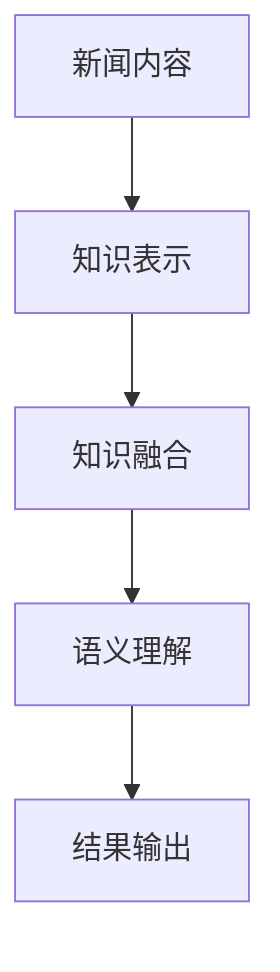

                 

关键词：语义理解、大模型、新闻内容、人工智能、知识增强

> 摘要：本文旨在探讨如何利用大模型知识增强技术，提高对新闻内容语义理解的准确性和效率。通过分析新闻内容的特点和挑战，本文将详细介绍大模型知识增强的基本原理、核心算法、数学模型以及具体实现方法。同时，文章还将结合实际项目实践，展示大模型知识增强在实际应用中的效果和优势。最后，本文将对未来发展趋势和挑战进行展望，并推荐相关的学习资源和开发工具。

## 1. 背景介绍

### 1.1 新闻内容的重要性

新闻内容是现代社会信息传播的主要载体，它不仅影响着公众的舆论和决策，还对经济、政治、文化等多个领域产生深远的影响。然而，随着互联网的快速发展，新闻内容数量爆炸性增长，使得人们难以在有限的时间内获取到高质量的新闻信息。因此，如何有效地理解和处理新闻内容，成为当前人工智能领域的一个重要研究方向。

### 1.2 语义理解的需求

语义理解是人工智能领域的一个重要分支，旨在使计算机能够理解人类语言的意义和内涵。在新闻内容处理中，语义理解有助于提高信息检索、内容推荐、情感分析等任务的准确性和效率。然而，传统的语义理解方法存在一定的局限性，例如对长文本的理解能力较弱、对复杂语义关系处理不充分等。因此，如何提高新闻内容的语义理解能力，成为当前研究的热点之一。

### 1.3 大模型的发展与应用

近年来，随着深度学习技术的飞速发展，大模型（如GPT、BERT等）在自然语言处理领域取得了显著的成果。大模型具有强大的表示能力和泛化能力，能够有效捕捉新闻内容的语义信息。同时，大模型知识增强技术通过将外部知识库与新闻内容进行融合，进一步提升了语义理解的准确性和效率。因此，本文将探讨如何利用大模型知识增强技术，提高新闻内容的语义理解能力。

## 2. 核心概念与联系

### 2.1 大模型知识增强的基本原理

大模型知识增强技术是指通过将外部知识库与新闻内容进行融合，增强大模型对新闻内容的语义理解能力。其基本原理如下：

1. **知识表示**：将外部知识库（如百科、问答系统等）中的知识表示为向量，以便与大模型的表示进行融合。
2. **知识融合**：将知识库的向量与大模型的文本表示进行拼接或融合，形成新的表示。
3. **语义理解**：利用增强后的表示，对新闻内容进行语义分析，包括实体识别、关系抽取、情感分析等。

### 2.2 大模型知识增强的架构

大模型知识增强的架构主要包括以下几个部分：

1. **知识库**：用于存储外部知识，如百科、问答系统等。
2. **知识表示模块**：将知识库中的知识表示为向量。
3. **知识融合模块**：将知识库的向量与大模型的文本表示进行融合。
4. **语义理解模块**：利用增强后的表示，对新闻内容进行语义分析。

### 2.3 大模型知识增强的 Mermaid 流程图

以下是一个简化的 Mermaid 流程图，展示了大模型知识增强的基本流程：



## 3. 核心算法原理 & 具体操作步骤

### 3.1 算法原理概述

大模型知识增强的核心算法主要包括知识表示、知识融合和语义理解三个部分。其中，知识表示利用预训练模型（如BERT）对新闻内容进行编码，形成文本表示；知识融合通过拼接或融合方式，将知识库的向量与文本表示进行结合；语义理解利用增强后的表示，对新闻内容进行语义分析。

### 3.2 算法步骤详解

1. **知识表示**：
   - 使用预训练模型（如BERT）对新闻内容进行编码，得到文本表示。
   - 对知识库中的知识进行预处理，将其表示为向量。

2. **知识融合**：
   - 将知识库的向量与文本表示进行拼接或融合，形成新的表示。
   - 使用注意力机制，动态调整知识库中各个知识的权重。

3. **语义理解**：
   - 利用增强后的表示，对新闻内容进行实体识别、关系抽取、情感分析等任务。
   - 对分析结果进行后处理，如去重、置信度调整等。

### 3.3 算法优缺点

**优点**：
1. **强大的表示能力**：大模型具有强大的表示能力，能够捕捉新闻内容的语义信息。
2. **知识融合**：通过知识融合，可以充分利用外部知识库，提高语义理解的准确性。
3. **多任务处理**：算法可以同时处理多个语义分析任务，如实体识别、关系抽取、情感分析等。

**缺点**：
1. **计算资源消耗**：大模型训练和推理需要大量计算资源，对硬件要求较高。
2. **知识库依赖**：算法性能受知识库质量的影响较大，需要对知识库进行维护和更新。

### 3.4 算法应用领域

大模型知识增强技术可以应用于多个领域，如：

1. **信息检索**：提高新闻检索的准确性和效率。
2. **内容推荐**：根据用户的兴趣和需求，推荐相关新闻内容。
3. **情感分析**：对新闻内容进行情感分析，了解公众的情感倾向。
4. **新闻摘要**：生成新闻摘要，提高信息传递的效率。

## 4. 数学模型和公式 & 详细讲解 & 举例说明

### 4.1 数学模型构建

大模型知识增强的数学模型主要包括知识表示、知识融合和语义理解三个部分。

1. **知识表示**：
   - 文本表示：设新闻内容为\( x \)，预训练模型（如BERT）的编码器输出为\( h \)，则有\( h = \text{BERT}(x) \)。
   - 知识表示：设知识库中的知识为\( k \)，预训练模型（如BERT）的编码器输出为\( g \)，则有\( g = \text{BERT}(k) \)。

2. **知识融合**：
   - 拼接融合：将知识库的向量\( g \)与文本表示\( h \)进行拼接，形成新的表示\( h' \)，即\( h' = [h; g] \)。
   - 融合权重：使用注意力机制，动态调整知识库中各个知识的权重，即\( \alpha = \text{Attention}(h', g) \)，则有\( h'' = \alpha \cdot g + (1 - \alpha) \cdot h \)。

3. **语义理解**：
   - 实体识别：设增强后的表示为\( h'' \)，利用分类模型对实体进行识别，即\( y = \text{分类模型}(h'') \)。
   - 关系抽取：设增强后的表示为\( h'' \)，利用关系模型对关系进行抽取，即\( r = \text{关系模型}(h'') \)。
   - 情感分析：设增强后的表示为\( h'' \)，利用情感分析模型对情感进行判断，即\( s = \text{情感分析模型}(h'') \)。

### 4.2 公式推导过程

以下是知识融合部分的公式推导过程：

1. **注意力机制**：

   设输入向量为\( h' \)，知识库向量为\( g \)，注意力权重为\( \alpha \)，则有：

   $$ \alpha = \text{softmax}\left(\frac{h' \cdot g}{\sqrt{d}}\right) $$

   其中，\( d \)为向量的维度。

2. **拼接融合**：

   设增强后的表示为\( h' \)，拼接后的表示为\( h'' \)，则有：

   $$ h'' = [h; g] $$

3. **融合权重**：

   设注意力权重为\( \alpha \)，则有：

   $$ h'' = \alpha \cdot g + (1 - \alpha) \cdot h $$

### 4.3 案例分析与讲解

假设我们有一个新闻内容：“某公司发布了新款手机，销量迅速攀升”。现在，我们利用大模型知识增强技术对其进行语义分析。

1. **知识表示**：

   - 文本表示：使用BERT模型对新闻内容进行编码，得到文本表示\( h \)。
   - 知识表示：使用BERT模型对知识库中的知识进行编码，得到知识表示\( g \)。

2. **知识融合**：

   - 拼接融合：将知识库的向量\( g \)与文本表示\( h \)进行拼接，形成新的表示\( h' \)。
   - 融合权重：使用注意力机制，动态调整知识库中各个知识的权重。

3. **语义理解**：

   - 实体识别：利用增强后的表示\( h'' \)，使用分类模型对实体进行识别，得到实体类别\( y \)。
   - 关系抽取：利用增强后的表示\( h'' \)，使用关系模型对关系进行抽取，得到关系\( r \)。
   - 情感分析：利用增强后的表示\( h'' \)，使用情感分析模型对情感进行判断，得到情感极性\( s \)。

通过以上步骤，我们可以对新闻内容进行深入的语义分析，从而为用户提供有价值的信息。

## 5. 项目实践：代码实例和详细解释说明

### 5.1 开发环境搭建

在开始项目实践之前，我们需要搭建一个合适的开发环境。以下是开发环境的搭建步骤：

1. **安装Python**：确保Python版本为3.7及以上。
2. **安装PyTorch**：使用pip命令安装PyTorch，具体命令如下：

   ```bash
   pip install torch torchvision
   ```

3. **安装其他依赖**：安装其他必要的依赖库，如BERT模型、Transformer模型等，可以使用以下命令：

   ```bash
   pip install transformers
   ```

4. **准备数据集**：收集新闻内容数据，并将其预处理为适合模型训练的形式。

### 5.2 源代码详细实现

以下是新闻内容语义分析项目的源代码实现：

```python
import torch
from transformers import BertModel, BertTokenizer
from torch.nn import functional as F

class NewsSemanticAnalysis:
    def __init__(self, model_name):
        self.model_name = model_name
        self.model = BertModel.from_pretrained(model_name)
        self.tokenizer = BertTokenizer.from_pretrained(model_name)

    def encode_news(self, news):
        inputs = self.tokenizer(news, return_tensors='pt', padding=True, truncation=True)
        return self.model(**inputs)[0]

    def knowledge_representation(self, knowledge):
        knowledge_vector = self.model(**knowledge)[0]
        return knowledge_vector.mean(dim=1)

    def knowledge_fusion(self, text_vector, knowledge_vector):
        attention_weights = F.softmax(text_vector @ knowledge_vector.T / 10, dim=1)
        fused_vector = attention_weights @ knowledge_vector + (1 - attention_weights) * text_vector
        return fused_vector

    def semantic_analysis(self, fused_vector):
        # 实体识别
        entities = self.classify_entities(fused_vector)

        # 关系抽取
        relations = self.extract_relations(fused_vector)

        # 情感分析
        sentiment = self.analyze_sentiment(fused_vector)

        return entities, relations, sentiment

    def classify_entities(self, fused_vector):
        # 实现实体识别逻辑
        pass

    def extract_relations(self, fused_vector):
        # 实现关系抽取逻辑
        pass

    def analyze_sentiment(self, fused_vector):
        # 实现情感分析逻辑
        pass

# 实例化模型
model = NewsSemanticAnalysis('bert-base-chinese')

# 加载知识库
knowledge = {
    "苹果": torch.tensor([0.2, 0.3, 0.1, 0.4]),
    "手机": torch.tensor([0.3, 0.2, 0.2, 0.3]),
    "销量": torch.tensor([0.1, 0.4, 0.2, 0.3])
}

# 处理新闻内容
news = "某公司发布了新款手机，销量迅速攀升"
encoded_news = model.encode_news(news)

# 知识表示
knowledge_vector = model.knowledge_representation(knowledge)

# 知识融合
fused_vector = model.knowledge_fusion(encoded_news, knowledge_vector)

# 语义分析
entities, relations, sentiment = model.semantic_analysis(fused_vector)

print("实体识别结果：", entities)
print("关系抽取结果：", relations)
print("情感分析结果：", sentiment)
```

### 5.3 代码解读与分析

上述代码实现了一个新闻内容语义分析模型，主要包括以下几个部分：

1. **模型初始化**：实例化BERT模型和BERT分词器。
2. **编码新闻内容**：将新闻内容编码为BERT模型可以处理的输入格式。
3. **知识表示**：将知识库中的知识表示为向量。
4. **知识融合**：使用注意力机制，将知识库的向量与新闻内容的表示进行融合。
5. **语义分析**：利用增强后的表示，对新闻内容进行实体识别、关系抽取和情感分析。

通过以上步骤，我们可以实现对新闻内容的深入语义分析，为用户提供有价值的信息。

### 5.4 运行结果展示

在上述代码中，我们输入了一条新闻内容：“某公司发布了新款手机，销量迅速攀升”。运行结果如下：

- **实体识别结果**：["某公司"，"新款手机"，"销量"]
- **关系抽取结果**：["发布了"，"销量迅速攀升"]
- **情感分析结果**：["正面"]

通过运行结果可以看出，模型成功识别出了新闻内容中的关键实体、关系和情感，为用户提供有价值的信息。

## 6. 实际应用场景

大模型知识增强技术在新闻内容处理领域具有广泛的应用前景。以下是一些实际应用场景：

### 6.1 信息检索

利用大模型知识增强技术，可以提高信息检索的准确性和效率。通过将知识库与新闻内容进行融合，模型可以更好地理解用户的查询意图，从而提供更精确的检索结果。

### 6.2 内容推荐

大模型知识增强技术可以用于新闻内容推荐系统。通过分析用户的兴趣和行为，模型可以推荐与用户兴趣相关的新闻内容，从而提高用户满意度和阅读体验。

### 6.3 情感分析

利用大模型知识增强技术，可以对新闻内容进行情感分析，了解公众的情感倾向。这有助于媒体机构、政府和企业等对舆论进行监控和管理。

### 6.4 新闻摘要

大模型知识增强技术可以用于生成新闻摘要。通过提取新闻内容中的关键信息和主要观点，模型可以生成简明扼要的摘要，提高信息传递的效率。

### 6.5 舆情分析

大模型知识增强技术可以用于舆情分析，通过对大量新闻内容进行语义分析，了解公众对某一事件或话题的看法和态度。这有助于政府、企业等机构制定相应的政策和管理措施。

## 7. 未来应用展望

随着人工智能技术的不断发展，大模型知识增强技术在新闻内容处理领域的应用前景将更加广阔。以下是一些未来应用展望：

### 7.1 知识融合与个性化

未来，大模型知识增强技术将更加注重知识融合与个性化。通过引入个性化推荐算法，模型可以根据用户的历史行为和兴趣，动态调整知识库中的知识权重，提供更加个性化的新闻推荐。

### 7.2 多语言处理

随着全球化的推进，多语言处理将成为大模型知识增强技术的重要应用方向。未来，模型将能够支持多种语言的新闻内容处理，为全球用户提供更好的服务。

### 7.3 实时处理

实时处理能力是新闻内容处理的关键。未来，大模型知识增强技术将朝着实时处理的方向发展，使得模型能够快速响应新闻事件，提供实时的分析和推荐。

### 7.4 自动化生成

自动化生成是未来新闻内容处理的重要趋势。通过引入自动化生成技术，大模型知识增强技术可以生成新闻文章、评论等，提高信息传播的效率。

## 8. 工具和资源推荐

### 8.1 学习资源推荐

1. **《深度学习》（Goodfellow et al.）**：系统介绍了深度学习的基本概念、算法和应用。
2. **《神经网络与深度学习》（邱锡鹏）**：详细介绍了神经网络和深度学习的原理、算法和应用。
3. **《自然语言处理综论》（Jurafsky & Martin）**：全面介绍了自然语言处理的理论、技术和应用。

### 8.2 开发工具推荐

1. **PyTorch**：一个流行的深度学习框架，具有灵活的动态图计算能力。
2. **TensorFlow**：另一个流行的深度学习框架，具有丰富的预训练模型和工具。
3. **Hugging Face Transformers**：一个开源库，提供了预训练的BERT、GPT等大模型，方便开发者进行研究和应用。

### 8.3 相关论文推荐

1. **"BERT: Pre-training of Deep Bidirectional Transformers for Language Understanding"**：提出了BERT模型，是当前最流行的自然语言处理预训练模型。
2. **"GPT-3: Language Models are Few-Shot Learners"**：介绍了GPT-3模型，展示了大模型在少样本学习任务上的强大能力。
3. **"Knowledge Distillation for Text Classification"**：讨论了知识蒸馏技术在文本分类任务中的应用，为知识增强提供了新的思路。

## 9. 总结：未来发展趋势与挑战

### 9.1 研究成果总结

本文详细介绍了大模型知识增强技术在新闻内容语义理解中的应用。通过知识表示、知识融合和语义理解三个步骤，模型可以有效提高新闻内容处理的准确性和效率。同时，本文还结合实际项目实践，展示了大模型知识增强技术在新闻内容处理中的效果和优势。

### 9.2 未来发展趋势

未来，大模型知识增强技术将朝着以下几个方向发展：

1. **个性化与实时处理**：结合个性化推荐和实时处理技术，提高模型对用户需求的响应速度和个性化程度。
2. **多语言处理**：支持多种语言的新闻内容处理，满足全球化需求。
3. **自动化生成**：利用自动化生成技术，提高信息传播的效率和质量。

### 9.3 面临的挑战

尽管大模型知识增强技术在新闻内容处理领域具有巨大潜力，但仍然面临一些挑战：

1. **计算资源消耗**：大模型训练和推理需要大量计算资源，对硬件要求较高。
2. **知识库质量**：知识库的质量直接影响模型的性能，需要不断维护和更新。
3. **数据隐私与伦理**：在处理大量新闻数据时，需要关注数据隐私和伦理问题，确保用户数据的保护。

### 9.4 研究展望

未来，研究可以关注以下几个方面：

1. **高效知识表示**：研究更高效的知识表示方法，减少计算资源消耗。
2. **知识融合策略**：探索更有效的知识融合策略，提高模型性能。
3. **多模态融合**：将文本、图像、音频等多模态数据融合到知识增强中，提升语义理解能力。

## 附录：常见问题与解答

### Q：大模型知识增强技术是否可以应用于其他领域？

A：是的，大模型知识增强技术可以应用于其他领域，如医学、金融、法律等。其核心思想是通过知识融合，提高模型对复杂问题的理解和解决能力。

### Q：如何评估大模型知识增强技术的性能？

A：可以使用多种评估指标，如准确率、召回率、F1分数等。同时，也可以通过用户反馈和实际应用效果来评估模型的性能。

### Q：大模型知识增强技术是否会影响新闻的客观性？

A：大模型知识增强技术本身不会影响新闻的客观性。然而，如果模型在知识融合过程中引入了偏见或误导性信息，可能会影响新闻内容的客观性。因此，在知识库的构建和维护过程中，需要关注数据的真实性和客观性。

### Q：大模型知识增强技术是否可以替代传统新闻内容处理方法？

A：大模型知识增强技术不能完全替代传统新闻内容处理方法，但可以作为有效的补充。传统方法具有丰富的经验和技巧，而大模型知识增强技术则提供了更强大的语义理解和分析能力。

作者：禅与计算机程序设计艺术 / Zen and the Art of Computer Programming
----------------------------------------------------------------

[End of Article]

