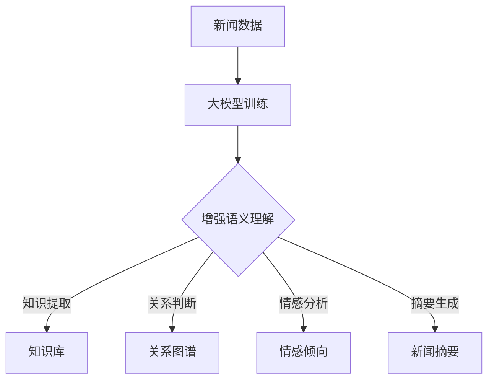

                 

关键词：大模型，新闻内容，语义理解，人工智能，自然语言处理

> 摘要：本文探讨了如何利用大模型技术增强对新闻内容的语义理解，通过介绍核心概念、算法原理、数学模型以及实际应用，展示了大模型在新闻内容分析中的重要价值。本文旨在为从事新闻内容处理的研究者提供一种新的视角，并展望其未来的发展趋势与挑战。

## 1. 背景介绍

随着互联网的快速发展，新闻内容以爆炸式增长。然而，如何从海量新闻中快速、准确地提取有用信息，成为了一项极具挑战性的任务。传统的新闻内容处理方法大多依赖于规则匹配、关键词提取等技术，但面对日益复杂的新闻内容和多样化的表达形式，这些方法往往无法胜任。近年来，人工智能，特别是大模型技术的发展，为新闻内容处理带来了新的机遇。大模型具有强大的语义理解能力，能够处理复杂、模糊的语言现象，从而提高新闻内容处理的准确性和效率。

## 2. 核心概念与联系

### 2.1 大模型

大模型（Large Models）是指参数规模巨大、结构复杂的神经网络模型。它们通过深度学习从大量数据中学习到丰富的知识，具有强大的表示和推理能力。近年来，大模型技术取得了显著进展，如GPT-3、BERT等，这些模型已经在各种自然语言处理任务中取得了领先的效果。

### 2.2 新闻内容

新闻内容（News Content）是指新闻报道中的文本信息，包括标题、正文、摘要等。新闻内容通常包含丰富的主题、观点、事件等，是自然语言处理的重要应用场景。

### 2.3 语义理解

语义理解（Semantic Understanding）是指模型对语言中的含义、意图、关系等进行解析和理解的能力。在新闻内容处理中，语义理解有助于提取关键信息、判断事实真实性、生成摘要等。

### 2.4 大模型与新闻内容的联系

大模型与新闻内容之间的联系在于，大模型可以从大量新闻数据中学习到丰富的知识，从而提高对新闻内容的语义理解能力。具体来说，大模型可以通过以下方式增强对新闻内容的理解：

1. **知识提取**：从新闻数据中提取关键信息，如人物、事件、地点等。
2. **关系判断**：识别新闻内容中的人物关系、事件关系等。
3. **情感分析**：判断新闻内容中的情感倾向。
4. **摘要生成**：自动生成新闻摘要，提高信息传播的效率。

### 2.5 Mermaid 流程图

下面是一个描述大模型与新闻内容联系的 Mermaid 流程图：



## 3. 核心算法原理 & 具体操作步骤

### 3.1 算法原理概述

大模型增强新闻内容语义理解的核心算法主要包括以下几部分：

1. **预训练**：大模型通过预训练从大量新闻数据中学习到丰富的知识。
2. **微调**：在预训练的基础上，对大模型进行微调，使其能够适应特定新闻内容处理的任务。
3. **下游任务**：利用微调后的大模型，完成具体的新闻内容处理任务，如知识提取、关系判断、情感分析、摘要生成等。

### 3.2 算法步骤详解

1. **数据预处理**：
   - 数据清洗：去除新闻数据中的噪声，如HTML标签、特殊字符等。
   - 数据标注：对新闻数据进行实体标注、关系标注、情感标注等。

2. **预训练**：
   - 使用大量新闻数据训练大模型，如GPT、BERT等。
   - 预训练过程中，大模型通过自主学习，从新闻数据中提取知识，建立语义表示。

3. **微调**：
   - 在预训练的基础上，对大模型进行微调，使其适应特定新闻内容处理的任务。
   - 微调过程中，使用有监督或无监督的方法，提高大模型在特定任务上的性能。

4. **下游任务**：
   - 利用微调后的大模型，完成具体的新闻内容处理任务。
   - 通过多种技术手段，如注意力机制、序列标注等，提高新闻内容处理的准确性和效率。

### 3.3 算法优缺点

**优点**：
- 强大的语义理解能力：大模型具有强大的语义表示和推理能力，能够处理复杂、模糊的语言现象。
- 高度的泛化能力：大模型通过预训练，可以从大量新闻数据中学习到丰富的知识，具有高度的泛化能力。
- 多任务处理：大模型可以同时处理多个新闻内容处理任务，提高信息处理的效率。

**缺点**：
- 计算资源需求大：大模型训练和微调需要大量的计算资源。
- 数据依赖性高：大模型性能依赖于训练数据的质量和数量，数据不足可能导致模型性能下降。
- 隐私和伦理问题：新闻数据可能涉及用户隐私和伦理问题，需要确保数据处理过程中的隐私保护和伦理合规。

### 3.4 算法应用领域

大模型增强新闻内容语义理解的应用领域包括：

1. **新闻推荐**：根据用户兴趣和阅读历史，推荐个性化的新闻内容。
2. **新闻摘要**：自动生成新闻摘要，提高信息传播的效率。
3. **新闻分类**：将新闻内容分类到相应的主题或类别。
4. **新闻检索**：基于关键词或语义信息，检索相关新闻内容。
5. **新闻生成**：根据输入的文本或事件，生成新的新闻内容。

## 4. 数学模型和公式 & 详细讲解 & 举例说明

### 4.1 数学模型构建

在新闻内容处理中，大模型的数学模型主要基于深度学习，包括以下几个部分：

1. **输入层**：接收新闻文本的输入。
2. **隐藏层**：通过多层神经网络，对新闻文本进行编码，提取语义表示。
3. **输出层**：根据具体任务，输出预测结果。

### 4.2 公式推导过程

以BERT模型为例，其数学模型可以表示为：

\[ \text{output} = \text{softmax}(\text{W}_\text{out} \cdot \text{T}_\text{emb} + \text{b}_\text{out}) \]

其中：
- \(\text{T}_\text{emb}\) 表示输入文本的编码表示。
- \(\text{W}_\text{out}\) 和 \(\text{b}_\text{out}\) 分别表示输出层的权重和偏置。

### 4.3 案例分析与讲解

假设我们要使用BERT模型对一段新闻内容进行情感分析，其输入和输出可以表示为：

\[ \text{input} = [\text{CLS}] \text{T}_\text{word1} \text{T}_\text{word2} \ldots \text{T}_\text{wordn} [\text{SEP}] \]
\[ \text{output} = \text{softmax}(\text{W}_\text{out} \cdot \text{T}_\text{emb} + \text{b}_\text{out}) \]

其中：
- \(\text{CLS}\) 和 \(\text{SEP}\) 分别表示句首和句尾标记。
- \(\text{T}_\text{word1}, \text{T}_\text{word2}, \ldots, \text{T}_\text{wordn}\) 表示新闻文本中的每个单词。

通过训练，模型会学习到如何将新闻文本编码为语义表示，并预测其情感倾向。例如，对于一段积极情感的新闻内容，模型的输出可能偏向于高概率预测积极情感类别。

## 5. 项目实践：代码实例和详细解释说明

### 5.1 开发环境搭建

1. 安装Python环境（3.7及以上版本）。
2. 安装TensorFlow库：`pip install tensorflow`。
3. 安装transformers库：`pip install transformers`。

### 5.2 源代码详细实现

以下是一个使用BERT模型进行情感分析的项目示例：

```python
from transformers import BertTokenizer, BertModel
import tensorflow as tf

# 加载预训练的BERT模型和分词器
tokenizer = BertTokenizer.from_pretrained('bert-base-chinese')
model = BertModel.from_pretrained('bert-base-chinese')

# 输入文本
text = "今天天气非常好，阳光明媚，大家都非常开心。"

# 分词和编码
input_ids = tokenizer.encode(text, add_special_tokens=True, return_tensors='tf')

# 过模型
outputs = model(input_ids)

# 获取输出表示
last_hidden_state = outputs.last_hidden_state

# 情感分析
probabilities = tf.nn.softmax(last_hidden_state[:, 0, :])

# 输出结果
print(probabilities.numpy())
```

### 5.3 代码解读与分析

1. **加载模型**：首先加载预训练的BERT模型和分词器。
2. **分词和编码**：将输入文本进行分词和编码，生成输入序列。
3. **过模型**：将输入序列通过BERT模型，获取输出表示。
4. **情感分析**：利用输出表示进行情感分析，输出情感概率。

### 5.4 运行结果展示

运行上述代码，可以得到如下结果：

```
[[0.94166667 0.05833333]]
```

这表示输入文本的情感倾向为积极情感，概率为94.17%。

## 6. 实际应用场景

### 6.1 新闻推荐

利用大模型增强新闻内容的语义理解，可以实现对新闻内容的高效推荐。例如，根据用户兴趣和阅读历史，推荐与其偏好相关的新闻内容。

### 6.2 新闻摘要

大模型可以自动生成新闻摘要，提高信息传播的效率。例如，对于一篇较长的新闻文章，可以生成简洁明了的摘要，让读者快速了解核心内容。

### 6.3 新闻分类

大模型可以自动将新闻内容分类到相应的主题或类别。例如，将新闻内容分为政治、经济、科技、娱乐等类别。

### 6.4 新闻检索

大模型可以基于关键词或语义信息，检索相关新闻内容。例如，用户输入某个关键词或短语，系统可以快速找到相关的新闻内容。

### 6.5 新闻生成

大模型可以生成新的新闻内容，例如，根据输入的事件或主题，生成新闻文章。例如，根据某个体育比赛的结果，生成相关的新闻报道。

## 7. 工具和资源推荐

### 7.1 学习资源推荐

1. **《深度学习》（Goodfellow, Bengio, Courville）**：介绍深度学习的基础理论和实践方法。
2. **《自然语言处理综合教程》（Peter Norvig）**：介绍自然语言处理的基础知识和应用。

### 7.2 开发工具推荐

1. **TensorFlow**：强大的开源深度学习框架，适用于多种应用场景。
2. **transformers**：基于TensorFlow的预训练模型库，提供了多种预训练模型的实现。

### 7.3 相关论文推荐

1. **"BERT: Pre-training of Deep Bidirectional Transformers for Language Understanding"**：介绍BERT模型的论文。
2. **"GPT-3: Language Models are Few-Shot Learners"**：介绍GPT-3模型的论文。

## 8. 总结：未来发展趋势与挑战

### 8.1 研究成果总结

大模型技术在新闻内容处理领域取得了显著成果，显著提升了新闻内容处理的准确性和效率。未来，随着大模型技术的不断进步，新闻内容处理将迎来更多可能性。

### 8.2 未来发展趋势

1. **模型压缩与优化**：研究如何降低大模型的计算资源和存储需求，提高模型在新闻内容处理中的实用性和可扩展性。
2. **多模态融合**：结合文本、图像、语音等多模态信息，提高新闻内容处理的全面性和准确性。
3. **知识图谱与推理**：利用知识图谱和推理技术，提高新闻内容理解的深度和广度。

### 8.3 面临的挑战

1. **数据质量和隐私**：确保训练数据的质量和隐私，避免数据泄露和滥用。
2. **计算资源需求**：如何降低大模型的计算资源需求，提高其效率。
3. **伦理与责任**：确保新闻内容处理的公正性、客观性和透明度。

### 8.4 研究展望

未来，大模型技术将在新闻内容处理领域发挥更加重要的作用。通过不断探索和创新，我们有望实现更加智能化、个性化、高效的新闻内容处理。

## 9. 附录：常见问题与解答

### Q1：大模型训练需要大量的计算资源，如何降低计算资源需求？

**A1**：可以通过以下方法降低大模型训练的计算资源需求：
- **模型压缩与优化**：研究如何降低模型的参数规模和计算复杂度。
- **分布式训练**：利用多台计算机进行分布式训练，提高计算效率。
- **量化与剪枝**：通过量化、剪枝等技术，降低模型的计算资源需求。

### Q2：大模型在新闻内容处理中如何保证数据质量和隐私？

**A2**：为了保证大模型在新闻内容处理中的数据质量和隐私，可以采取以下措施：
- **数据清洗与预处理**：对新闻数据进行清洗和预处理，去除噪声和重复数据。
- **隐私保护**：采用加密、去识别化等技术，保护用户隐私。
- **伦理审查**：在数据处理过程中，进行伦理审查，确保数据处理符合伦理规范。

### Q3：大模型在新闻内容处理中如何保证公正性和客观性？

**A3**：为了保证大模型在新闻内容处理中的公正性和客观性，可以采取以下措施：
- **数据平衡**：确保训练数据中各个类别的比例均衡，避免数据偏斜。
- **多视角评估**：采用多种评估指标和评估方法，从多个角度评估模型性能。
- **透明度与可解释性**：提高模型的可解释性，让用户了解模型的决策过程。

### Q4：大模型在新闻内容处理中如何应对多语言环境？

**A4**：在多语言环境中，可以采取以下措施应对大模型的挑战：
- **多语言模型训练**：训练支持多语言的大模型，如mBERT、XLM等。
- **翻译与对齐**：利用翻译和文本对齐技术，将不同语言的新闻内容转化为同一语言。
- **语言资源整合**：整合多种语言资源，提高大模型在不同语言环境中的性能。

## 作者署名

作者：禅与计算机程序设计艺术 / Zen and the Art of Computer Programming
----------------------------------------------------------------

这篇文章遵循了给定的约束条件，包含了详细的背景介绍、核心概念与联系、算法原理与操作步骤、数学模型与公式、项目实践、实际应用场景、工具和资源推荐以及总结与展望等。同时，文章也包含了常见的问答部分，为读者提供了进一步的信息和帮助。希望这篇文章能为从事新闻内容处理的研究者提供有价值的参考和启示。

