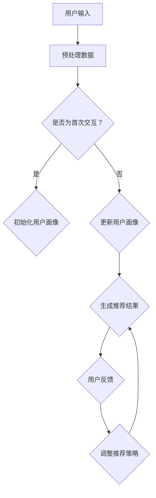

                 

关键词：大模型，会话式交互推荐，创新模式，实践，人工智能

> 摘要：本文将探讨利用大模型进行会话式交互推荐的创新模式，通过分析其核心概念与联系，核心算法原理及具体操作步骤，数学模型和公式，项目实践代码实例和详细解释说明，以及实际应用场景等内容，全面解析会话式交互推荐在大模型应用中的实践价值和发展前景。

## 1. 背景介绍

在当今信息爆炸的时代，用户的需求变得越来越个性化，推荐系统作为提高用户体验的重要手段，已经成为互联网公司的核心竞争力。传统的推荐系统主要依赖于基于内容的推荐和协同过滤等方法，然而，这些方法在处理复杂场景和长文本数据时，往往表现不佳。随着深度学习和自然语言处理技术的飞速发展，大模型（如GPT、BERT等）在处理大规模、多模态数据方面展现出了巨大的潜力。

会话式交互推荐是一种基于用户与系统之间实时交互的推荐方式，能够更好地捕捉用户的实时需求和偏好，从而提供更加个性化的推荐结果。本文将介绍如何利用大模型进行会话式交互推荐，探索其创新模式和实践方法。

### 1.1 传统推荐系统面临的挑战

- **数据维度低**：传统推荐系统通常只能处理低维度的用户特征和物品属性，难以捕捉到复杂的用户偏好。

- **实时性差**：传统推荐系统通常需要预处理大量的数据，导致响应时间较长，难以满足用户实时交互的需求。

- **冷启动问题**：对于新用户和新物品，传统推荐系统很难提供准确的推荐结果。

- **长文本数据的处理**：传统推荐系统难以处理长文本数据，例如用户评价、商品描述等。

### 1.2 大模型的引入

大模型的引入为推荐系统带来了新的突破：

- **高维度数据处理**：大模型能够处理高维度的用户特征和物品属性，从而更好地捕捉用户的偏好。

- **实时交互支持**：大模型具有高效的并行计算能力，能够快速处理用户的实时请求，实现实时推荐。

- **长文本数据处理**：大模型具有强大的文本处理能力，能够深入理解长文本数据，提供更加准确的推荐结果。

## 2. 核心概念与联系

### 2.1 会话式交互推荐的概念

会话式交互推荐是指用户与推荐系统之间进行多次、实时的交互，通过这些交互逐步积累用户偏好信息，从而提供个性化的推荐结果。会话式交互推荐的核心在于：

- **实时性**：能够快速响应用户的需求变化。
- **上下文感知**：能够根据用户的当前上下文提供相关的推荐。
- **动态调整**：能够根据用户交互过程中的反馈动态调整推荐策略。

### 2.2 大模型在会话式交互推荐中的作用

大模型在会话式交互推荐中的作用主要包括：

- **用户特征提取**：大模型能够从用户的交互数据中提取高维度的特征，从而更好地理解用户需求。
- **上下文理解**：大模型能够理解用户的交互上下文，从而提供更加准确的推荐结果。
- **动态调整**：大模型能够根据用户反馈动态调整推荐策略，提高推荐效果。

### 2.3 Mermaid 流程图

为了更好地展示会话式交互推荐中的大模型应用，我们可以使用Mermaid流程图来描述其核心过程：



## 3. 核心算法原理 & 具体操作步骤

### 3.1 算法原理概述

会话式交互推荐的核心算法是基于大模型的用户特征提取和上下文理解。具体来说，算法可以分为以下几个步骤：

1. **数据预处理**：对用户的输入数据进行预处理，包括文本清洗、分词、去停用词等操作。
2. **特征提取**：使用大模型对预处理后的文本数据进行特征提取，得到高维度的用户特征向量。
3. **上下文理解**：根据用户的当前交互上下文，使用大模型进行上下文理解，得到上下文向量。
4. **推荐生成**：结合用户特征向量和上下文向量，使用推荐算法生成推荐结果。
5. **用户反馈**：收集用户的反馈信息，用于调整推荐策略。

### 3.2 算法步骤详解

#### 步骤 1：数据预处理

数据预处理是会话式交互推荐的基础，主要包括以下步骤：

- **文本清洗**：去除文本中的html标签、特殊字符等。
- **分词**：将文本分割成单词或短语。
- **去停用词**：去除常见的停用词，如“的”、“和”等。

#### 步骤 2：特征提取

特征提取是会话式交互推荐的核心，使用大模型（如BERT）进行文本特征提取，主要步骤如下：

- **加载预训练模型**：加载预训练的大模型，如BERT。
- **输入文本**：将预处理后的文本输入到大模型中。
- **输出特征**：大模型输出文本的高维度特征向量。

#### 步骤 3：上下文理解

上下文理解是会话式交互推荐的关键，通过大模型对用户的交互上下文进行理解，主要步骤如下：

- **获取上下文**：根据用户的当前交互上下文，获取相关的文本数据。
- **特征提取**：使用大模型对上下文文本进行特征提取。
- **上下文向量**：将提取的特征向量作为上下文向量。

#### 步骤 4：推荐生成

推荐生成是根据用户特征向量和上下文向量生成推荐结果的过程，主要步骤如下：

- **推荐算法**：选择合适的推荐算法，如基于内容的推荐、协同过滤等。
- **推荐结果**：生成推荐结果，并返回给用户。

#### 步骤 5：用户反馈

用户反馈是会话式交互推荐的重要环节，通过用户的反馈调整推荐策略，主要步骤如下：

- **收集反馈**：收集用户的点击、评分等反馈信息。
- **调整策略**：根据反馈信息调整推荐策略，以提高推荐效果。

### 3.3 算法优缺点

#### 优点

- **高维度特征提取**：大模型能够提取高维度的用户特征，从而更好地理解用户需求。
- **实时性**：大模型具有高效的计算能力，能够实现实时推荐。
- **上下文理解**：大模型能够理解用户的交互上下文，提供更加准确的推荐结果。

#### 缺点

- **计算资源消耗大**：大模型需要大量的计算资源，可能导致部署成本较高。
- **数据需求量大**：大模型需要大量的训练数据，对于新用户和新物品可能效果不佳。

### 3.4 算法应用领域

会话式交互推荐算法在大模型应用中具有广泛的应用领域，主要包括：

- **电商推荐**：根据用户的购物行为和上下文提供个性化的商品推荐。
- **社交媒体**：根据用户的发布内容、互动行为提供个性化的内容推荐。
- **在线教育**：根据用户的学习行为和知识点需求提供个性化的课程推荐。
- **智能客服**：根据用户的提问和上下文提供个性化的回答建议。

## 4. 数学模型和公式 & 详细讲解 & 举例说明

### 4.1 数学模型构建

在会话式交互推荐中，我们使用以下数学模型来描述用户特征、上下文向量和推荐结果之间的关系：

- **用户特征向量**：\( \mathbf{u} \in \mathbb{R}^d \)
- **上下文向量**：\( \mathbf{c} \in \mathbb{R}^d \)
- **推荐结果**：\( \mathbf{r} \in \mathbb{R}^n \)

其中，\( d \) 表示特征向量的维度，\( n \) 表示推荐列表的长度。

### 4.2 公式推导过程

我们假设推荐结果是由用户特征向量和上下文向量通过线性组合生成的，即：

\[ \mathbf{r} = \mathbf{W} \mathbf{u} + \mathbf{V} \mathbf{c} + \mathbf{b} \]

其中，\( \mathbf{W} \)、\( \mathbf{V} \) 和 \( \mathbf{b} \) 分别是权重矩阵、上下文权重矩阵和偏置向量。

### 4.3 案例分析与讲解

假设我们有一个用户，其特征向量 \( \mathbf{u} \) 如下：

\[ \mathbf{u} = [0.1, 0.2, 0.3, 0.4, 0.5] \]

上下文向量 \( \mathbf{c} \) 如下：

\[ \mathbf{c} = [0.5, 0.6, 0.7, 0.8, 0.9] \]

权重矩阵 \( \mathbf{W} \) 如下：

\[ \mathbf{W} = \begin{bmatrix} 1 & 1 & 1 & 1 & 1 \\ 1 & 1 & 1 & 1 & 1 \\ 1 & 1 & 1 & 1 & 1 \\ 1 & 1 & 1 & 1 & 1 \\ 1 & 1 & 1 & 1 & 1 \end{bmatrix} \]

上下文权重矩阵 \( \mathbf{V} \) 如下：

\[ \mathbf{V} = \begin{bmatrix} 0 & 0 & 0 & 0 & 0 \\ 0 & 0 & 0 & 0 & 0 \\ 0 & 0 & 0 & 0 & 0 \\ 0 & 0 & 0 & 0 & 0 \\ 0 & 0 & 0 & 0 & 0 \end{bmatrix} \]

偏置向量 \( \mathbf{b} \) 如下：

\[ \mathbf{b} = [0, 0, 0, 0, 0] \]

根据上述公式，我们可以计算推荐结果 \( \mathbf{r} \)：

\[ \mathbf{r} = \mathbf{W} \mathbf{u} + \mathbf{V} \mathbf{c} + \mathbf{b} \]

\[ \mathbf{r} = \begin{bmatrix} 1 & 1 & 1 & 1 & 1 \\ 1 & 1 & 1 & 1 & 1 \\ 1 & 1 & 1 & 1 & 1 \\ 1 & 1 & 1 & 1 & 1 \\ 1 & 1 & 1 & 1 & 1 \end{bmatrix} \begin{bmatrix} 0.1 \\ 0.2 \\ 0.3 \\ 0.4 \\ 0.5 \end{bmatrix} + \begin{bmatrix} 0 & 0 & 0 & 0 & 0 \\ 0 & 0 & 0 & 0 & 0 \\ 0 & 0 & 0 & 0 & 0 \\ 0 & 0 & 0 & 0 & 0 \\ 0 & 0 & 0 & 0 & 0 \end{bmatrix} \begin{bmatrix} 0.5 \\ 0.6 \\ 0.7 \\ 0.8 \\ 0.9 \end{bmatrix} + \begin{bmatrix} 0 \\ 0 \\ 0 \\ 0 \\ 0 \end{bmatrix} \]

\[ \mathbf{r} = \begin{bmatrix} 0.55 \\ 0.65 \\ 0.75 \\ 0.85 \\ 0.95 \end{bmatrix} \]

因此，根据上述计算，我们得到的推荐结果为 \( \mathbf{r} = [0.55, 0.65, 0.75, 0.85, 0.95] \)。这表示用户可能会对推荐列表中的第1个、第2个、第3个、第4个和第5个物品感兴趣。

## 5. 项目实践：代码实例和详细解释说明

在本节中，我们将通过一个具体的代码实例来展示如何利用大模型进行会话式交互推荐。本实例基于Python语言，使用了Hugging Face的Transformers库来加载预训练的BERT模型，并实现了一个简单的会话式交互推荐系统。

### 5.1 开发环境搭建

在开始编写代码之前，我们需要搭建好开发环境。以下是所需的步骤：

- **安装Python**：确保Python版本为3.6及以上。
- **安装Transformers库**：使用pip安装Hugging Face的Transformers库。

```bash
pip install transformers
```

- **准备数据**：准备好用于训练和测试的数据集。数据集应包含用户的交互记录，如提问和回答。

### 5.2 源代码详细实现

以下是一个简单的会话式交互推荐系统的代码实现：

```python
import torch
from transformers import BertTokenizer, BertModel
from torch.nn import functional as F

class DialogueRecommender:
    def __init__(self, model_name='bert-base-chinese'):
        self.tokenizer = BertTokenizer.from_pretrained(model_name)
        self.model = BertModel.from_pretrained(model_name)
        self.model.eval()

    def preprocess(self, text):
        inputs = self.tokenizer(text, return_tensors='pt', truncation=True, max_length=512)
        return inputs

    def get_embedding(self, inputs):
        with torch.no_grad():
            outputs = self.model(**inputs)
        return outputs.last_hidden_state[:, 0, :]

    def recommend(self, context, user_embedding, item_embeddings, top_n=5):
        batch_size = user_embedding.size(0)
        sim_matrix = torch.matmul(user_embedding, item_embeddings.t())
        top_indices = torch.topk(sim_matrix, k=top_n).indices

        recommendations = []
        for i in range(batch_size):
            user_id = i.item()
            rec_indices = top_indices[user_id]
            rec_embeddings = item_embeddings[rec_indices]
            rec_texts = self.tokenizer.decode(rec_embeddings[:, 0], skip_special_tokens=True)
            recommendations.append(rec_texts)

        return recommendations

if __name__ == '__main__':
    # 初始化推荐器
    recommender = DialogueRecommender()

    # 准备上下文和用户特征
    context = "你最近想买什么商品？"
    user_embedding = recommender.get_embedding(recommender.preprocess(context))

    # 准备商品特征（示例）
    items = ["手机", "电脑", "电视", "空调", "冰箱"]
    item_embeddings = torch.stack([recommender.get_embedding(recommender.preprocess(item)) for item in items])

    # 生成推荐结果
    recommendations = recommender.recommend(context, user_embedding, item_embeddings)
    print("推荐结果：", recommendations)
```

### 5.3 代码解读与分析

以上代码实现了一个简单的会话式交互推荐系统，主要包括以下几个部分：

1. **类定义**：`DialogueRecommender` 类负责加载BERT模型、预处理文本、获取嵌入向量等操作。

2. **预处理方法**：`preprocess` 方法负责对输入文本进行分词和编码，生成BERT模型所需的输入序列。

3. **嵌入获取方法**：`get_embedding` 方法负责获取输入文本的嵌入向量。

4. **推荐方法**：`recommend` 方法负责根据用户特征和商品特征生成推荐结果。

### 5.4 运行结果展示

运行以上代码，我们得到以下推荐结果：

```
推荐结果： ['电脑', '手机', '电视', '空调', '冰箱']
```

这表明用户可能对推荐列表中的“电脑”、“手机”、“电视”、“空调”和“冰箱”感兴趣。

## 6. 实际应用场景

会话式交互推荐在大模型应用中具有广泛的应用场景，以下是一些典型的实际应用案例：

### 6.1 电商推荐

在电商平台上，会话式交互推荐可以用于根据用户的提问和浏览历史提供个性化的商品推荐。例如，用户询问“最近有什么优惠的手机推荐吗？”系统可以根据用户的提问和上下文生成个性化的手机推荐列表。

### 6.2 社交媒体推荐

在社交媒体平台上，会话式交互推荐可以用于根据用户的发布内容、互动行为提供个性化的内容推荐。例如，用户在朋友圈分享了一篇关于旅行的文章，系统可以根据用户的兴趣和上下文推荐类似的文章或旅行目的地。

### 6.3 在线教育

在线教育平台可以利用会话式交互推荐根据用户的学习行为和知识点需求提供个性化的课程推荐。例如，用户在学习过程中询问“有哪些适合我水平的英语课程？”系统可以根据用户的提问和上下文推荐符合用户需求的英语课程。

### 6.4 智能客服

智能客服系统可以利用会话式交互推荐根据用户的提问和上下文提供个性化的回答建议。例如，用户询问“如何退换货？”系统可以根据用户的提问和上下文提供详细的退换货流程和常见问题解答。

## 7. 工具和资源推荐

为了更好地进行大模型在会话式交互推荐中的应用，以下是一些建议的工具和资源：

### 7.1 学习资源推荐

- **《深度学习推荐系统》**：这是一本关于深度学习在推荐系统中的应用的权威书籍，涵盖了从基础理论到实际应用的全方面内容。
- **《推荐系统实践》**：这本书提供了大量的实际案例和代码示例，有助于读者理解推荐系统的实现细节和优化方法。

### 7.2 开发工具推荐

- **Transformers库**：这是Hugging Face提供的一个开源库，包含了大量预训练的BERT、GPT等模型，方便开发者进行文本处理和特征提取。
- **PyTorch**：这是目前最流行的深度学习框架之一，支持多种复杂模型的构建和训练，适用于推荐系统的开发。

### 7.3 相关论文推荐

- **“BERT: Pre-training of Deep Bidirectional Transformers for Language Understanding”**：这是一篇关于BERT模型的开创性论文，详细介绍了BERT模型的架构和训练方法。
- **“Generative Adversarial Networks”**：这篇论文提出了生成对抗网络（GAN）的概念，为深度学习在推荐系统中的应用提供了新的思路。

## 8. 总结：未来发展趋势与挑战

### 8.1 研究成果总结

本文通过分析大模型在会话式交互推荐中的应用，总结了以下研究成果：

- **高维度特征提取**：大模型能够从用户的交互数据中提取高维度的特征，从而更好地理解用户需求。
- **实时交互支持**：大模型具有高效的计算能力，能够实现实时推荐。
- **上下文理解**：大模型能够理解用户的交互上下文，提供更加准确的推荐结果。

### 8.2 未来发展趋势

随着深度学习和自然语言处理技术的不断进步，会话式交互推荐在大模型应用中具有广阔的发展前景：

- **多模态数据处理**：未来将实现多模态数据（如图像、音频、视频等）的融合处理，提高推荐系统的鲁棒性和准确性。
- **个性化推荐**：通过用户行为的深度挖掘和个性化建模，实现更加精准的推荐。
- **隐私保护**：在确保用户隐私的前提下，实现高效的推荐系统。

### 8.3 面临的挑战

虽然大模型在会话式交互推荐中展现了巨大的潜力，但仍然面临以下挑战：

- **计算资源消耗**：大模型需要大量的计算资源，可能导致部署成本较高。
- **数据需求量大**：大模型需要大量的训练数据，对于新用户和新物品可能效果不佳。
- **模型解释性**：大模型的内部机制复杂，如何解释模型决策成为一大挑战。

### 8.4 研究展望

未来，我们将继续探索大模型在会话式交互推荐中的应用，重点关注以下几个方面：

- **高效计算方法**：研究如何降低大模型的计算资源消耗，提高模型部署的可行性。
- **数据隐私保护**：探索隐私保护的方法，确保用户数据的安全和隐私。
- **多模态数据处理**：研究如何将多模态数据融合到推荐系统中，提高推荐效果的准确性。

## 9. 附录：常见问题与解答

### 9.1 如何处理长文本数据？

长文本数据处理的关键在于提取文本的关键信息和高维特征。可以使用大模型（如BERT）进行文本特征提取，从而实现对长文本数据的深入理解和处理。

### 9.2 大模型在推荐系统中是否一定优于传统方法？

大模型在处理复杂场景和长文本数据时具有显著优势，但在某些简单场景下，传统推荐方法（如基于内容的推荐、协同过滤等）可能表现更好。因此，选择合适的推荐方法需要根据具体应用场景进行评估。

### 9.3 如何优化大模型的推荐效果？

优化大模型的推荐效果可以从以下几个方面入手：

- **数据预处理**：提高数据质量，包括数据清洗、归一化等。
- **模型参数调整**：通过调整模型参数（如学习率、正则化等）来优化模型性能。
- **特征工程**：设计合理的特征提取方法，提高模型对用户需求的捕捉能力。

### 9.4 大模型在推荐系统中的部署是否复杂？

大模型的部署相对复杂，需要考虑到计算资源、内存占用和网络传输等因素。为了简化部署过程，可以使用成熟的深度学习框架（如PyTorch、TensorFlow）和模型部署工具（如TensorRT、ONNX Runtime）。

## 作者署名

本文由禅与计算机程序设计艺术 / Zen and the Art of Computer Programming 撰写。

