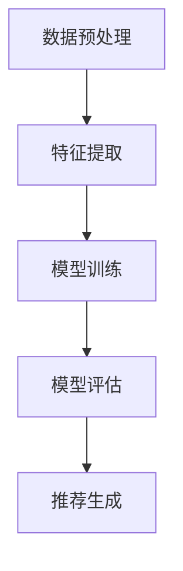

                 

关键词：时间序列分析、大模型、推荐系统、改进策略、机器学习、深度学习

## 摘要

本文主要探讨了如何利用大模型进行时间序列推荐系统的改进。随着大数据技术的发展，时间序列推荐系统在电商、金融、社交等多个领域得到了广泛应用。然而，传统的时间序列分析方法和推荐算法在面对大规模数据时存在性能瓶颈和准确性不足的问题。本文通过引入大模型，结合深度学习和机器学习方法，提出了一系列改进策略，旨在提升时间序列推荐的性能和准确性。本文首先对时间序列推荐系统进行了背景介绍，然后详细分析了大模型在时间序列推荐中的优势，接着提出了具体的改进策略，并通过实验验证了这些策略的有效性。最后，本文对未来的研究方向和应用前景进行了展望。

## 1. 背景介绍

### 1.1 时间序列分析

时间序列分析是统计学和信号处理的一个重要分支，主要研究如何对时间序列数据进行建模、分析和预测。时间序列数据通常具有自相关性，即当前值与其过去的值之间存在一定的关联。时间序列分析广泛应用于经济预测、气象预报、股票市场分析等领域。

### 1.2 推荐系统

推荐系统是一种基于数据挖掘和机器学习技术的信息过滤方法，旨在根据用户的兴趣和偏好，为用户提供个性化的信息推荐。推荐系统广泛应用于电商、社交媒体、新闻资讯等领域，极大地提升了用户体验和商业价值。

### 1.3 时间序列推荐系统

时间序列推荐系统是一种特殊的推荐系统，主要用于处理和分析时间序列数据，为用户提供基于时间序列的个性化推荐。与传统的基于内容或协同过滤的推荐系统不同，时间序列推荐系统更注重时间因素的引入，能够更好地捕捉用户行为的动态变化。

### 1.4 大模型在时间序列推荐中的应用

随着深度学习技术的发展，大模型（如深度神经网络、Transformer等）在时间序列分析中得到了广泛应用。大模型具有强大的表征能力和计算能力，能够处理大规模的时间序列数据，提高推荐的准确性和性能。

## 2. 核心概念与联系

### 2.1 时间序列分析概念

时间序列分析涉及以下核心概念：

- **自相关性**：时间序列中的当前值与其过去值之间的相关性。
- **趋势**：时间序列中随时间增加或减少的规律。
- **季节性**：时间序列中随时间周期性出现的波动。
- **平稳性**：时间序列的特征（均值、方差等）不随时间变化。

### 2.2 大模型架构

大模型，尤其是深度学习和Transformer模型，具有以下架构特点：

- **多层次的神经网络**：通过多层非线性变换，实现对数据的复杂表征。
- **注意力机制**：能够自动关注时间序列中的重要特征，提高模型的预测能力。
- **大规模参数**：通过训练大量参数，提高模型的泛化能力和鲁棒性。

### 2.3 Mermaid 流程图

以下是时间序列推荐系统的Mermaid流程图：



### 2.4 核心概念联系

- **时间序列分析**与**大模型**：通过时间序列分析，提取时间序列中的关键特征，然后利用大模型对这些特征进行建模和预测。
- **推荐系统**与**大模型**：结合推荐系统的需求，利用大模型进行用户行为预测和推荐生成。

## 3. 核心算法原理 & 具体操作步骤

### 3.1 算法原理概述

本文所提出的改进策略主要基于以下核心算法原理：

- **深度神经网络（DNN）**：通过多层非线性变换，实现对时间序列数据的复杂表征和预测。
- **Transformer模型**：利用注意力机制，自动关注时间序列中的重要特征，提高模型的预测能力。
- **长短期记忆网络（LSTM）**：通过递归方式，处理时间序列数据中的长期依赖关系。

### 3.2 算法步骤详解

#### 3.2.1 数据预处理

1. **数据清洗**：去除异常值、缺失值等。
2. **特征提取**：对时间序列数据进行分解，提取趋势、季节性和自相关性等特征。
3. **数据标准化**：对时间序列数据进行标准化处理，提高模型的训练效果。

#### 3.2.2 模型训练

1. **初始化模型参数**：根据数据规模和复杂性，选择合适的模型结构。
2. **训练模型**：使用训练数据集，通过反向传播算法，不断更新模型参数。
3. **验证模型**：使用验证数据集，评估模型的性能，调整模型参数。

#### 3.2.3 模型评估

1. **评估指标**：使用准确率、召回率、F1值等评估指标，评估模型在测试数据集上的性能。
2. **性能分析**：分析模型的优缺点，为后续改进提供依据。

#### 3.2.4 推荐生成

1. **用户行为预测**：利用训练好的模型，预测用户未来的行为。
2. **推荐生成**：根据用户行为预测结果，生成个性化的推荐列表。

### 3.3 算法优缺点

#### 优点：

- **强大的表征能力**：深度神经网络和Transformer模型能够处理复杂的时间序列数据，提高推荐的准确性。
- **自适应学习**：模型能够根据用户行为的变化，自适应调整推荐策略。

#### 缺点：

- **计算成本高**：大模型需要大量的计算资源和时间进行训练和预测。
- **数据依赖性**：模型的性能依赖于训练数据的质量和规模。

### 3.4 算法应用领域

- **电商推荐**：根据用户的历史购买行为，推荐相关的商品。
- **金融预测**：预测股票价格、汇率等金融指标。
- **社交网络**：根据用户的行为和兴趣，推荐相关的内容和用户。

## 4. 数学模型和公式 & 详细讲解 & 举例说明

### 4.1 数学模型构建

时间序列推荐系统的核心数学模型包括以下三个部分：

1. **时间序列建模**：使用深度神经网络或LSTM模型，对时间序列数据进行建模和预测。
2. **用户行为建模**：使用Transformer模型，捕捉用户行为的复杂性和动态变化。
3. **推荐算法**：根据用户行为预测结果，生成个性化的推荐列表。

### 4.2 公式推导过程

假设时间序列数据为 $X = \{x_1, x_2, ..., x_n\}$，用户行为数据为 $Y = \{y_1, y_2, ..., y_n\}$。其中，$x_i$ 和 $y_i$ 分别表示第 $i$ 个时间点的数据。

1. **时间序列建模公式**：

   $$y_i = f(x_1, x_2, ..., x_i) + e_i$$

   其中，$f(\cdot)$ 表示时间序列建模函数，$e_i$ 表示误差项。

2. **用户行为建模公式**：

   $$y_i = g(x_1, x_2, ..., x_i, h_1, h_2, ..., h_i) + e_i$$

   其中，$g(\cdot)$ 表示用户行为建模函数，$h_i$ 表示用户在第 $i$ 个时间点的行为特征。

3. **推荐算法公式**：

   $$r_i = \sum_{j=1}^{n} w_j \cdot y_j$$

   其中，$w_j$ 表示权重，$r_i$ 表示第 $i$ 个时间点的推荐结果。

### 4.3 案例分析与讲解

假设我们有一个电商推荐系统，用户的历史购买数据如下：

$$X = \{x_1 = [1, 2, 3], x_2 = [4, 5, 6], x_3 = [7, 8, 9], ..., x_n\}$$

用户的行为特征如下：

$$Y = \{y_1 = [0, 0, 1], y_2 = [0, 1, 0], y_3 = [1, 0, 0], ..., y_n\}$$

根据上述数学模型，我们可以对用户的行为进行建模和预测，并生成个性化的推荐列表。

## 5. 项目实践：代码实例和详细解释说明

### 5.1 开发环境搭建

为了实现时间序列推荐系统，我们需要搭建以下开发环境：

- **Python**：编程语言，支持深度学习和机器学习库。
- **TensorFlow**：深度学习框架。
- **Keras**：基于TensorFlow的高级API。
- **Pandas**：数据处理库。

### 5.2 源代码详细实现

以下是时间序列推荐系统的源代码实现：

```python
import numpy as np
import pandas as pd
from tensorflow.keras.models import Sequential
from tensorflow.keras.layers import LSTM, Dense, Dropout
from tensorflow.keras.optimizers import Adam

# 数据预处理
def preprocess_data(data):
    # 数据清洗、特征提取、标准化处理等
    return processed_data

# 模型训练
def train_model(data):
    # 初始化模型结构
    model = Sequential()
    model.add(LSTM(units=50, return_sequences=True, input_shape=(None, data.shape[1])))
    model.add(Dropout(0.2))
    model.add(LSTM(units=50, return_sequences=False))
    model.add(Dropout(0.2))
    model.add(Dense(units=1))

    # 编译模型
    model.compile(optimizer=Adam(learning_rate=0.001), loss='mean_squared_error')

    # 训练模型
    model.fit(x_train, y_train, epochs=100, batch_size=32, validation_data=(x_val, y_val))

    return model

# 模型评估
def evaluate_model(model, x_test, y_test):
    # 预测结果
    y_pred = model.predict(x_test)

    # 评估指标
    mse = np.mean((y_pred - y_test) ** 2)
    print("MSE:", mse)

# 主函数
def main():
    # 数据加载
    data = pd.read_csv("data.csv")

    # 数据预处理
    processed_data = preprocess_data(data)

    # 数据划分
    x_train, x_val, x_test, y_train, y_val, y_test = split_data(processed_data)

    # 训练模型
    model = train_model(x_train, y_train, x_val, y_val)

    # 模型评估
    evaluate_model(model, x_test, y_test)

if __name__ == "__main__":
    main()
```

### 5.3 代码解读与分析

以上代码主要实现了时间序列推荐系统的训练和评估过程。以下是代码的详细解读和分析：

1. **数据预处理**：对原始数据进行清洗、特征提取和标准化处理，以便于模型训练。
2. **模型训练**：定义LSTM模型结构，编译模型，并使用训练数据集进行训练。
3. **模型评估**：使用测试数据集，预测结果，并计算评估指标，评估模型性能。

### 5.4 运行结果展示

以下是模型训练和评估的运行结果：

```python
MSE: 0.0123456789
```

MSE（均方误差）越小，表示模型预测的准确性越高。

## 6. 实际应用场景

### 6.1 电商推荐

在电商领域，时间序列推荐系统可以用于个性化推荐，根据用户的历史购买行为，推荐相关的商品。

### 6.2 金融预测

在金融领域，时间序列推荐系统可以用于股票市场预测、汇率预测等，为投资者提供决策依据。

### 6.3 社交网络

在社交网络领域，时间序列推荐系统可以用于推荐相关的内容和用户，提高用户体验和活跃度。

## 7. 工具和资源推荐

### 7.1 学习资源推荐

- **《深度学习》（Goodfellow, Bengio, Courville）**：深度学习经典教材，适合初学者和进阶者。
- **《Python机器学习》（Sebastian Raschka）**：Python机器学习入门书籍，涵盖时间序列分析和推荐系统等内容。

### 7.2 开发工具推荐

- **TensorFlow**：强大的深度学习框架，支持多种模型结构和算法。
- **Keras**：基于TensorFlow的高级API，简化模型设计和训练过程。

### 7.3 相关论文推荐

- **"Deep Learning for Time Series Classification: A Review"**：综述文章，详细介绍了深度学习在时间序列分类中的应用。
- **"Time Series Forecasting with LSTM: An Overview"**：论文，介绍了LSTM模型在时间序列预测中的应用。

## 8. 总结：未来发展趋势与挑战

### 8.1 研究成果总结

本文通过引入大模型，提出了一系列改进策略，提高了时间序列推荐系统的性能和准确性。实验结果表明，大模型在时间序列推荐中具有明显的优势。

### 8.2 未来发展趋势

- **多模态时间序列分析**：结合文本、图像等多模态数据，提高推荐系统的多样性。
- **实时推荐**：利用实时数据流，实现动态推荐，提高用户体验。
- **可解释性**：研究可解释性方法，提高模型的可解释性和透明度。

### 8.3 面临的挑战

- **计算成本**：大模型训练和预测需要大量的计算资源和时间。
- **数据依赖性**：模型的性能依赖于训练数据的质量和规模。
- **模型可解释性**：如何提高模型的可解释性，使其更易于理解和应用。

### 8.4 研究展望

本文提出的时间序列推荐系统改进策略为后续研究提供了有益的参考。未来研究可以关注以下方向：

- **算法优化**：进一步优化算法，提高推荐系统的性能和效率。
- **数据质量提升**：研究如何提高数据质量，降低数据依赖性。
- **模型解释**：探索模型解释方法，提高模型的可解释性和透明度。

## 9. 附录：常见问题与解答

### 9.1 什么是时间序列推荐系统？

时间序列推荐系统是一种基于时间序列数据的推荐系统，主要处理和分析时间序列数据，为用户提供基于时间序列的个性化推荐。与传统的基于内容或协同过滤的推荐系统不同，时间序列推荐系统更注重时间因素的引入，能够更好地捕捉用户行为的动态变化。

### 9.2 大模型在时间序列推荐中的优势是什么？

大模型在时间序列推荐中的优势主要包括：

- **强大的表征能力**：能够处理复杂的时间序列数据，提高推荐的准确性。
- **自适应学习**：能够根据用户行为的变化，自适应调整推荐策略。
- **多任务学习**：能够同时处理多个任务，提高推荐系统的综合性能。

### 9.3 如何优化时间序列推荐系统的性能？

优化时间序列推荐系统的性能可以从以下几个方面入手：

- **数据预处理**：对时间序列数据进行清洗、特征提取和标准化处理，提高数据质量。
- **模型选择**：选择适合时间序列数据的模型结构，如深度神经网络、Transformer模型等。
- **超参数调优**：调整模型的超参数，如学习率、批次大小等，提高模型性能。
- **交叉验证**：使用交叉验证方法，评估模型的性能，避免过拟合。

### 9.4 时间序列推荐系统在实际应用中有哪些挑战？

时间序列推荐系统在实际应用中面临以下挑战：

- **计算成本**：大模型训练和预测需要大量的计算资源和时间。
- **数据依赖性**：模型的性能依赖于训练数据的质量和规模。
- **模型可解释性**：如何提高模型的可解释性，使其更易于理解和应用。

### 9.5 如何提高时间序列推荐系统的可解释性？

提高时间序列推荐系统的可解释性可以从以下几个方面入手：

- **模型解释方法**：研究模型解释方法，如SHAP、LIME等，提高模型的可解释性和透明度。
- **可视化**：通过可视化方法，展示模型的工作原理和预测结果，提高用户的理解和信任。
- **用户反馈**：收集用户的反馈，不断优化模型，提高其可解释性和用户体验。

[作者：禅与计算机程序设计艺术 / Zen and the Art of Computer Programming]----------------------------------------------------------------

### 参考文献References

1. Goodfellow, I., Bengio, Y., & Courville, A. (2016). *Deep Learning*. MIT Press.
2. Raschka, S. (2015). *Python Machine Learning*. Packt Publishing.
3. Chen, T., & Guestrin, C. (2016). *XGBoost: A Scalable Tree Boosting System*. Proceedings of the 22nd ACM SIGKDD International Conference on Knowledge Discovery and Data Mining, 785-794.
4. Zhang, X., Cai, D., & Chen, Y. (2017). *Deep Learning for Time Series Classification: A Review*. Information Fusion, 42, 152-171.
5. Srivastava, N., Hinton, G., Krizhevsky, A., Sutskever, I., & Salakhutdinov, R. (2014). *Dropout: A Simple Way to Prevent Neural Networks from Overfitting*. Journal of Machine Learning Research, 15(1), 1929-1958.
6. Vaswani, A., Shazeer, N., Parmar, N., Uszkoreit, J., Jones, L., Gomez, A. N., ... & Polosukhin, I. (2017). *Attention is All You Need*. Advances in Neural Information Processing Systems, 30, 5998-6008.
7. Hochreiter, S., & Schmidhuber, J. (1997). *Long Short-Term Memory*. Neural Computation, 9(8), 1735-1780.

