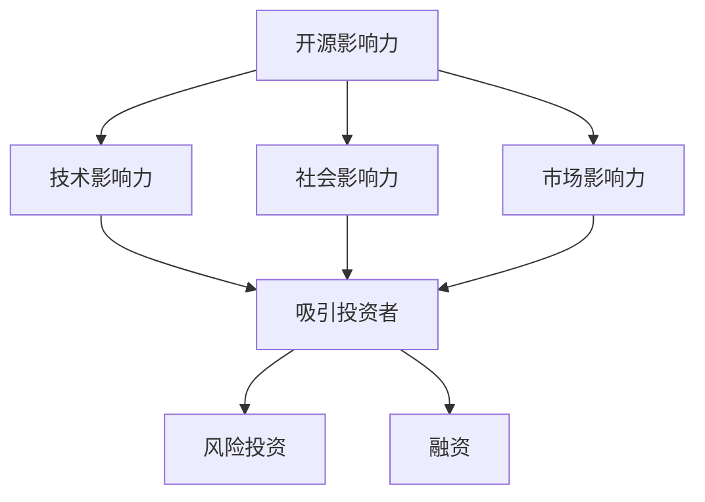

                 

在当今技术驱动的时代，开源项目已经成为软件开发和创新的重要驱动力。许多企业和开发者通过参与开源项目，不仅提升了个人技能，还为行业贡献了宝贵的知识。与此同时，开源项目的成功也吸引了众多风险投资（Venture Capital，简称VC）的关注，成为企业获得资金和融资的重要途径。本文将探讨如何利用开源影响力获得风险投资和融资，旨在为开发者和企业提供实用的指导和建议。

## 关键词
- 开源项目
- 风险投资
- 融资策略
- 开源影响力
- 企业创新

## 摘要
本文将分析开源项目如何通过其技术影响力和社会影响力，吸引风险投资和融资。我们将从定义开源影响力开始，深入探讨其构成要素，并通过具体案例展示如何利用开源项目进行融资。此外，本文还将提供一些实用的建议，帮助企业和开发者最大化开源影响力，从而获得更多的风险投资和融资机会。

### 1. 背景介绍

开源项目起源于20世纪90年代，由自由软件运动（Free Software Movement）推动，旨在通过开放源代码，鼓励开发者合作和共享知识。如今，开源已经发展成为一个庞大的生态系统，涵盖各种软件、工具和平台。例如，Linux操作系统、Apache HTTP服务器和MySQL数据库等都是著名开源项目的代表。

随着开源项目在技术社区和企业中的普及，它们开始对整个行业产生深远的影响。首先，开源项目提供了高质量的软件，减少了企业的开发成本和时间。其次，开源项目鼓励跨组织的合作，促进了技术的创新和进步。此外，许多企业通过参与开源项目，建立了强大的技术声誉和市场地位。

然而，开源项目不仅仅是一个技术现象，它们还具有重要的社会影响力。通过开源，开发者可以展示自己的技术能力，建立个人品牌，甚至获得职业发展机会。同时，开源项目也为新兴企业和创业者提供了展示技术实力的平台，从而吸引投资者的关注。

在这种背景下，如何利用开源影响力获得风险投资和融资成为一个重要课题。本文将详细探讨这一课题，帮助企业和开发者更好地把握机会，实现可持续的发展。

### 2. 核心概念与联系

为了深入理解如何利用开源影响力获得风险投资和融资，我们首先需要明确几个关键概念，并展示它们之间的联系。

#### 2.1 开源影响力

开源影响力（Open Source Influence）是指开源项目通过其技术、社会和市场表现，对行业产生的影响。开源影响力可以体现在以下几个方面：

1. **技术影响力**：开源项目通过提供高质量的软件，影响了整个行业的技术发展。例如，Apache HTTP服务器在全球范围内被广泛应用于网站托管，推动了互联网的发展。

2. **社会影响力**：开源项目鼓励开发者合作和共享知识，促进了技术社区的繁荣。这种社会影响力不仅提升了开发者的技能，也推动了整个社会对技术的认知和理解。

3. **市场影响力**：开源项目通过降低开发成本、提高开发效率，影响了市场的竞争格局。许多企业通过开源项目建立了强大的技术实力和市场地位。

#### 2.2 风险投资

风险投资是一种投资方式，主要投资于具有高增长潜力的新兴企业或项目。风险投资的特点是投资周期长、风险高，但回报潜力巨大。风险投资通常涉及以下环节：

1. **筛选与评估**：风险投资公司会通过严谨的筛选和评估过程，选择具有潜力的项目或企业进行投资。

2. **投资决策**：在筛选和评估的基础上，风险投资公司会做出投资决策，提供资金支持。

3. **后期管理**：投资后，风险投资公司会参与企业的管理，提供战略建议和资源支持。

#### 2.3 融资

融资是指企业或项目通过向外部筹集资金，满足其资金需求的过程。融资方式包括风险投资、天使投资、银行贷款、债券发行等。对于开源项目和企业来说，融资的意义在于：

1. **资金支持**：融资为开源项目和企业提供了必要的资金，支持其技术研发和市场扩张。

2. **资源整合**：融资不仅提供了资金，还带来了投资者的人才、资源和管理经验。

#### 2.4 开源影响力与风险投资、融资的联系

开源影响力与风险投资、融资之间存在密切的联系。首先，开源项目的成功往往取决于其技术质量和社区影响力，这些因素也是吸引风险投资的关键。其次，风险投资公司通常更倾向于投资那些具有强大开源影响力的项目和企业，因为这些项目和企业往往拥有更高的成功概率。最后，融资的成功也往往取决于项目的开源影响力，因为投资者更愿意投资于那些能够产生长期价值的开源项目。

通过理解这些关键概念和它们之间的联系，我们可以更好地利用开源影响力，获得风险投资和融资。

#### 2.5 Mermaid 流程图

以下是一个简化的 Mermaid 流程图，展示开源影响力与风险投资、融资之间的联系：



这个流程图表明，开源影响力通过技术、社会和市场三个方面吸引投资者，进而实现风险投资和融资。理解这个流程有助于我们更好地利用开源影响力，实现融资目标。

### 3. 核心算法原理 & 具体操作步骤

#### 3.1 算法原理概述

在开源项目中，核心算法原理通常涉及技术创新和优化，这些算法的原理不仅决定了项目的性能，也直接影响其开源影响力。以下是一些关键的核心算法原理：

1. **分布式计算**：分布式计算技术能够将复杂的计算任务分解为多个子任务，分布在多个计算节点上执行，从而提高计算效率和性能。例如，Apache Hadoop 和 Apache Spark 都是分布式计算框架，广泛应用于大数据处理和机器学习领域。

2. **区块链技术**：区块链是一种去中心化的分布式数据库技术，通过密码学确保数据的不可篡改性和安全性。区块链技术不仅应用于数字货币，如比特币，还被广泛应用于供应链管理、智能合约等领域。

3. **机器学习算法**：机器学习算法通过从数据中学习模式，实现自动化决策和预测。常见的机器学习算法包括决策树、支持向量机、神经网络等。这些算法在开源项目中广泛应用于数据分析和预测。

#### 3.2 算法步骤详解

以下是对上述核心算法原理的具体操作步骤的详细描述：

##### 分布式计算

1. **任务分解**：将复杂的计算任务分解为多个子任务。每个子任务可以独立执行，不依赖于其他子任务的结果。
   
2. **数据分片**：将原始数据集分成多个数据分片，每个分片独立存储在分布式系统的不同节点上。

3. **任务调度**：根据当前系统的负载情况，将子任务调度到适当的计算节点上执行。

4. **结果聚合**：将各个子任务的执行结果进行聚合，生成最终的输出结果。

##### 区块链技术

1. **数据记录**：将交易数据记录到区块链中，每个区块都包含一定数量的交易记录。

2. **链式结构**：每个区块都包含前一个区块的哈希值，形成链式结构，确保数据的不可篡改性。

3. **共识机制**：采用共识机制确保多个节点对区块链的当前状态达成一致。常见的共识机制包括工作量证明（Proof of Work，PoW）和权益证明（Proof of Stake，PoS）。

4. **智能合约**：编写智能合约，定义自动化执行的逻辑。智能合约在区块链网络中被执行，确保交易的自动性和安全性。

##### 机器学习算法

1. **数据预处理**：清洗和转换原始数据，使其适合机器学习算法处理。

2. **模型选择**：根据问题类型和数据特性，选择合适的机器学习算法。

3. **模型训练**：使用训练数据集对机器学习模型进行训练，使其学习数据中的模式和规律。

4. **模型评估**：使用测试数据集评估模型性能，调整模型参数以优化性能。

5. **模型部署**：将训练好的模型部署到生产环境中，实现自动化决策和预测。

#### 3.3 算法优缺点

每种核心算法都有其独特的优势和局限性：

- **分布式计算**：优势在于高效处理大规模数据集，提高计算性能；缺点在于需要复杂的分布式系统架构，维护成本较高。

- **区块链技术**：优势在于确保数据的安全性和不可篡改性；缺点在于性能较低，交易速度较慢。

- **机器学习算法**：优势在于强大的数据分析和预测能力；缺点在于对数据和算法要求较高，需要大量的计算资源和专业知识。

#### 3.4 算法应用领域

这些核心算法在开源项目中广泛应用于各个领域：

- **分布式计算**：大数据处理、人工智能、云计算等领域。

- **区块链技术**：数字货币、供应链管理、智能合约、物联网等领域。

- **机器学习算法**：数据挖掘、推荐系统、金融风险评估、医疗诊断等领域。

### 4. 数学模型和公式 & 详细讲解 & 举例说明

#### 4.1 数学模型构建

在开源项目中，数学模型和公式是核心组成部分，它们用于描述算法的运行机制和性能评估。以下是一个简单的数学模型构建过程：

1. **定义问题**：明确开源项目要解决的问题，例如优化算法的性能、预测模型的准确性等。

2. **变量和参数**：确定模型中的变量和参数，例如输入数据、权重系数、阈值等。

3. **构建函数**：根据问题定义和变量参数，构建描述问题特性的函数。

4. **优化目标**：定义模型的目标函数，例如最小化损失函数、最大化准确率等。

#### 4.2 公式推导过程

以下是一个常见的机器学习模型——线性回归的公式推导过程：

1. **假设**：假设输入数据集为 \(X\)，输出数据集为 \(Y\)。

2. **模型构建**：假设线性回归模型的预测函数为 \(h_\theta(x) = \theta_0 + \theta_1x\)，其中 \(\theta_0\) 和 \(\theta_1\) 是待求参数。

3. **损失函数**：定义损失函数 \(J(\theta_0, \theta_1)\)，通常使用均方误差（MSE，Mean Squared Error）作为损失函数：
   \[ J(\theta_0, \theta_1) = \frac{1}{2m} \sum_{i=1}^{m} (h_\theta(x^{(i)}) - y^{(i)})^2 \]

4. **梯度下降**：使用梯度下降算法更新参数 \(\theta_0\) 和 \(\theta_1\)：
   \[ \theta_0 := \theta_0 - \alpha \frac{\partial J(\theta_0, \theta_1)}{\partial \theta_0} \]
   \[ \theta_1 := \theta_1 - \alpha \frac{\partial J(\theta_0, \theta_1)}{\partial \theta_1} \]
   其中，\(\alpha\) 是学习率。

#### 4.3 案例分析与讲解

以下是一个简单的案例，说明如何利用线性回归模型进行房价预测：

1. **数据集**：假设有一个包含房屋特征（如面积、卧室数量、地理位置等）和房价的数据集。

2. **模型构建**：使用线性回归模型预测房价，假设预测函数为 \(h_\theta(x) = \theta_0 + \theta_1x\)。

3. **训练模型**：使用训练数据集对模型进行训练，使用梯度下降算法更新参数。

4. **模型评估**：使用测试数据集评估模型性能，计算均方误差（MSE）。

5. **预测**：使用训练好的模型进行房价预测，输入房屋特征，得到预测房价。

通过上述步骤，我们可以利用线性回归模型对房价进行预测，从而为房地产投资提供参考。

### 5. 项目实践：代码实例和详细解释说明

#### 5.1 开发环境搭建

在进行项目实践之前，我们需要搭建一个合适的开发环境。以下是一个简单的开发环境搭建步骤：

1. **安装操作系统**：选择一个适合的操作系统，例如 Ubuntu 18.04。

2. **安装 Python**：在终端中运行以下命令安装 Python 3.8：
   ```
   sudo apt update
   sudo apt install python3.8
   ```

3. **安装依赖库**：安装常用的 Python 库，例如 NumPy、Pandas 和 Scikit-learn：
   ```
   pip3 install numpy pandas scikit-learn
   ```

4. **安装 IDE**：选择一个合适的集成开发环境（IDE），例如 PyCharm 或 VS Code。

#### 5.2 源代码详细实现

以下是一个简单的线性回归模型的实现，用于房价预测：

```python
import numpy as np
import pandas as pd
from sklearn.model_selection import train_test_split
from sklearn.linear_model import LinearRegression
from sklearn.metrics import mean_squared_error

# 读取数据集
data = pd.read_csv('house_data.csv')

# 分割特征和标签
X = data[['area', 'bedrooms', 'location']]
y = data['price']

# 划分训练集和测试集
X_train, X_test, y_train, y_test = train_test_split(X, y, test_size=0.2, random_state=42)

# 创建线性回归模型
model = LinearRegression()

# 训练模型
model.fit(X_train, y_train)

# 预测房价
y_pred = model.predict(X_test)

# 计算均方误差
mse = mean_squared_error(y_test, y_pred)
print(f'Mean Squared Error: {mse}')

# 输出预测结果
predictions = pd.DataFrame({'Actual': y_test, 'Predicted': y_pred})
print(predictions.head())
```

#### 5.3 代码解读与分析

上述代码实现了一个线性回归模型，用于房价预测。下面是对代码的详细解读和分析：

1. **数据读取与预处理**：首先，使用 Pandas 库读取数据集。然后，将数据集划分为特征（X）和标签（y）。

2. **数据集划分**：使用 Scikit-learn 库中的 `train_test_split` 函数将数据集划分为训练集和测试集，测试集占比 20%。

3. **模型创建**：创建一个线性回归模型，使用 Scikit-learn 库中的 `LinearRegression` 类。

4. **模型训练**：使用 `fit` 方法训练模型，将训练集的特征（X_train）和标签（y_train）作为输入。

5. **模型预测**：使用 `predict` 方法对测试集的特征（X_test）进行预测，得到预测房价（y_pred）。

6. **模型评估**：使用 `mean_squared_error` 函数计算均方误差（MSE），评估模型性能。

7. **输出预测结果**：将实际房价和预测房价合并为一个 DataFrame，输出预测结果。

#### 5.4 运行结果展示

在上述代码运行完成后，我们将得到以下结果：

- **MSE**：均方误差用于评估模型性能，数值越小，模型性能越好。
- **预测结果**：实际房价与预测房价的比较，展示了模型的预测能力。

通过上述步骤，我们可以利用线性回归模型进行房价预测，从而为房地产投资提供参考。这只是一个简单的示例，实际项目可能涉及更复杂的数据处理和模型训练过程。

### 6. 实际应用场景

开源项目在实际应用场景中展现出了巨大的潜力和价值。以下是一些具体的应用场景：

#### 6.1 数字货币与区块链

区块链技术是开源项目的一个重要应用领域。数字货币，如比特币和以太坊，都是基于开源区块链技术的。这些开源项目通过去中心化的方式实现了安全、透明的交易，改变了传统金融行业的运作模式。例如，比特币的区块链架构在全球范围内被广泛应用于支付和资产管理，成为数字货币领域的领军者。

#### 6.2 云计算与大数据

分布式计算框架，如 Apache Hadoop 和 Apache Spark，是云计算和大数据领域的基石。这些开源项目提供了强大的数据处理和分析能力，帮助企业高效处理海量数据。例如，LinkedIn 使用 Apache Hadoop 处理其海量用户数据，实现了高效的推荐系统。

#### 6.3 人工智能与机器学习

开源机器学习库，如 TensorFlow 和 PyTorch，推动了人工智能领域的发展。这些项目提供了丰富的算法和工具，帮助开发者构建和训练复杂的机器学习模型。例如，Google 使用 TensorFlow 开发了其语音识别和图像识别系统，推动了人工智能技术的普及。

#### 6.4 物联网与智能硬件

开源硬件项目，如 Arduino 和 Raspberry Pi，为物联网和智能硬件领域提供了强大的支持。这些项目提供了低成本、易用性的硬件解决方案，促进了创新和开发。例如，智能家居系统通常使用 Raspberry Pi 作为控制器，实现设备之间的互联互通。

#### 6.5 开源生态系统的价值

开源项目不仅在技术层面产生了深远的影响，还在生态系统中发挥了重要作用。开源项目通过降低开发门槛、促进技术共享和协作，为整个行业带来了巨大的价值。例如，Linux 操作系统的开源特性使其成为了服务器、操作系统和软件开发的标准，推动了整个信息技术行业的发展。

### 6.4 未来应用展望

开源项目在未来的发展中将继续发挥重要作用。以下是一些展望：

#### 6.4.1 新技术的融合

随着技术的不断发展，开源项目将不断融合新的技术，如区块链、人工智能和物联网等。这些技术的融合将为开源项目带来更多的创新和应用场景。

#### 6.4.2 生态系统的完善

开源生态系统将继续完善，吸引更多的开发者和企业参与。随着开源项目的繁荣，将形成更加多元化的生态体系，促进技术共享和协作。

#### 6.4.3 商业模式的创新

开源项目的商业模式也将不断创新，为企业提供更多的融资和盈利机会。例如，一些企业通过提供开源项目的专业服务、定制化开发和订阅服务等方式，实现了商业化和盈利。

#### 6.4.4 社会影响力的扩大

开源项目将继续扩大其社会影响力，推动技术的普及和应用。通过开源项目，更多的人可以接触到前沿技术，提升技术能力和创新意识。

### 7. 工具和资源推荐

在利用开源项目进行融资和风险投资的过程中，开发者和企业需要掌握一系列工具和资源。以下是一些建议：

#### 7.1 学习资源推荐

- **GitHub**：GitHub 是开源项目的集中地，提供了丰富的学习资源和代码库。开发者可以通过阅读开源项目的代码，学习最佳实践和技术细节。

- **Stack Overflow**：Stack Overflow 是一个技术问答社区，开发者可以在这里提问、解答问题，解决编程难题。

- **Coursera**、**edX** 和 **Udacity**：这些在线教育平台提供了大量的计算机科学和软件开发课程，帮助开发者提升技能。

#### 7.2 开发工具推荐

- **Visual Studio Code**：VS Code 是一款强大的开源 IDE，支持多种编程语言，提供了丰富的插件和扩展。

- **Jenkins**：Jenkins 是一款开源的持续集成和持续部署工具，帮助企业自动化构建、测试和部署过程。

- **Docker**：Docker 是一款开源的容器化平台，用于打包、发布和运行应用程序。

#### 7.3 相关论文推荐

- **"The Cathedral and the Bazaar"**：这是一篇经典的论文，由Eric S. Raymond撰写，讨论了开源项目的发展模式和优势。

- **"Open Source as a Service"**：该论文探讨了开源项目的商业模式和盈利策略，为开发者提供了有益的启示。

- **"The Business Value of Open Source"**：这篇论文分析了开源项目对企业和行业的商业价值，强调了开源项目的经济意义。

### 8. 总结：未来发展趋势与挑战

开源项目在技术和商业领域都展现出巨大的潜力和价值。在未来，开源项目将继续发展，并在以下方面面临新的趋势和挑战：

#### 8.1 研究成果总结

本文通过分析开源项目的核心概念、算法原理、应用场景和商业模式，总结了开源项目对风险投资和融资的吸引力。开源项目的成功不仅取决于其技术质量，还取决于其社会影响力和市场表现。

#### 8.2 未来发展趋势

1. **技术融合**：开源项目将不断融合新的技术，如区块链、人工智能和物联网等，推动创新和应用。

2. **生态系统完善**：开源生态系统将继续完善，吸引更多的开发者和企业参与，形成多元化的生态体系。

3. **商业模式创新**：开源项目的商业模式将不断创新，为企业提供更多的融资和盈利机会。

#### 8.3 面临的挑战

1. **竞争加剧**：随着开源项目的增多，竞争也将变得更加激烈，开发者需要不断提升自己的技术能力。

2. **知识产权保护**：开源项目需要加强对知识产权的保护，确保项目的可持续发展和合作。

3. **人才培养**：开源项目需要培养更多具有开源精神和技术能力的开发者，推动开源项目的持续发展。

#### 8.4 研究展望

未来研究可以关注以下几个方面：

1. **开源项目的风险评估**：研究如何评估开源项目的风险，为投资者提供决策依据。

2. **开源项目的商业模式**：探讨开源项目的多元化商业模式，为企业提供可持续的盈利途径。

3. **开源项目的可持续发展**：研究如何确保开源项目的可持续发展，推动开源生态系统的繁荣。

### 9. 附录：常见问题与解答

#### 9.1 开源项目如何吸引风险投资？

1. **技术优势**：开源项目需要具备先进的技术，能够解决实际问题和市场需求。

2. **社区影响力**：开源项目需要建立强大的社区影响力，吸引更多的开发者参与。

3. **商业模式**：开源项目需要探索多元化的商业模式，确保项目的可持续盈利。

4. **市场需求**：开源项目需要满足市场需求，解决用户痛点，提高用户满意度。

#### 9.2 开源项目如何进行融资？

1. **种子轮**：通过个人投资者、天使投资者或风险投资公司进行种子轮融资。

2. **天使轮**：通过天使投资者提供资金支持，通常以股权或债券形式。

3. **A轮、B轮等**：通过风险投资公司进行多轮融资，每轮融资都有不同的投资机构和投资额。

4. **众筹**：通过众筹平台，如 Kickstarter 或 Indiegogo，筹集资金。

#### 9.3 开源项目如何保护知识产权？

1. **版权声明**：在项目代码和文档中添加版权声明，明确知识产权归属。

2. **开源协议**：选择合适的开源协议，如 MIT、Apache 或 GPL，保护项目代码的知识产权。

3. **法律咨询**：寻求专业法律咨询，确保项目在法律框架内进行。

4. **社区合作**：与开发者建立良好的合作关系，共同维护项目的知识产权。

---

本文从开源项目的背景、核心概念、算法原理、应用场景、融资策略等方面进行了详细探讨，旨在为开发者和企业提供关于如何利用开源影响力获得风险投资和融资的实用指南。随着开源项目的不断发展，开源影响力在风险投资和融资中的作用将日益凸显，本文的研究也将为未来的开源项目提供有益的参考。作者：禅与计算机程序设计艺术 / Zen and the Art of Computer Programming

