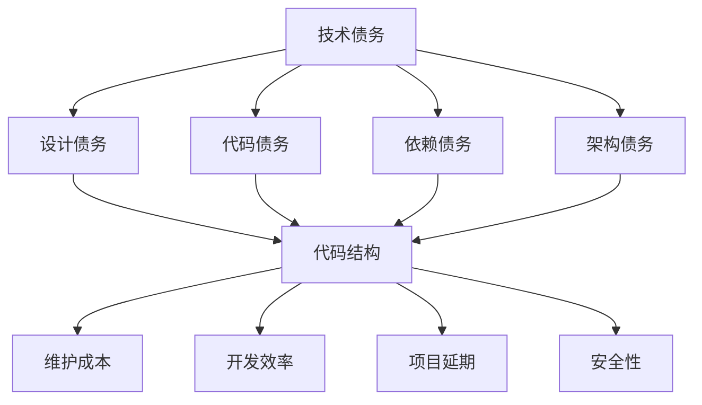

                 

关键词：技术债务、开源经验、代码重构、软件维护、软件开发实践

摘要：本文旨在探讨如何利用开源经验提供技术债务评估和重构服务。通过深入分析技术债务的定义、成因和影响，本文提出了基于开源经验的技术债务评估方法，并详细介绍了代码重构的原则、步骤和技术。此外，本文还探讨了技术债务重构在实际应用场景中的价值，以及未来发展的趋势和挑战。

## 1. 背景介绍

在软件工程领域，技术债务（Technical Debt）是一个频繁出现的概念。它源于金融领域的债务概念，指的是在软件开发过程中，为了加快开发进度而采取的短期解决方案，这些解决方案可能在长期内带来维护成本的增加。技术债务是软件开发过程中不可避免的一部分，但其积累过大会对项目的可持续性和可维护性产生负面影响。

随着开源软件的普及，开发者可以更轻松地共享和复用代码。然而，这也带来了新的挑战，即如何有效地管理开源项目中积累的技术债务。本文旨在通过结合开源经验，提供一套系统化的技术债务评估和重构服务，以提高软件项目的质量和可维护性。

### 1.1 技术债务的定义和类型

技术债务可以分为以下几种类型：

1. **设计债务**：由于系统设计不合理或不足，导致代码结构复杂、可读性差。
2. **代码债务**：代码质量低下，如代码冗长、重复、缺乏注释等。
3. **依赖债务**：项目依赖的第三方库或服务过时，可能存在安全漏洞或性能问题。
4. **架构债务**：系统架构设计不合理，如过度耦合、模块划分不清晰等。

### 1.2 技术债务的影响

技术债务的积累会影响软件项目的多个方面：

- **维护成本**：技术债务会导致维护成本的增加，因为需要对遗留代码进行修复和优化。
- **开发效率**：复杂和不合理的代码结构会降低开发效率。
- **项目延期**：技术债务可能导致项目延期，因为修复遗留问题需要额外的时间和资源。
- **安全性**：过时的依赖和设计缺陷可能引入安全漏洞。

## 2. 核心概念与联系

为了提供有效的技术债务评估和重构服务，我们需要理解几个核心概念，并展示它们之间的联系。以下是一个简化的 Mermaid 流程图，用于描述这些概念。



### 2.1 技术债务与代码质量

技术债务与代码质量密切相关。高质量的代码通常具有以下特征：

- **模块化**：代码应该按照功能模块进行组织，易于理解和维护。
- **可读性**：代码应该具有良好的命名和注释，以便其他开发者能够轻松理解。
- **可复用性**：代码应该设计为可复用，减少重复工作。
- **稳定性**：代码应该经过充分的测试，确保其稳定性和可靠性。

### 2.2 技术债务与软件架构

软件架构设计是技术债务管理的关键环节。一个良好的架构设计应该具有以下特点：

- **可扩展性**：系统能够轻松适应未来的需求变化。
- **可维护性**：系统能够快速响应和修复缺陷。
- **灵活性**：系统能够灵活地引入新的功能和组件。

### 2.3 技术债务与项目管理

项目管理在技术债务管理中起着重要作用。项目经理需要确保项目团队能够：

- **优先处理**：识别和优先处理高风险的技术债务。
- **定期评估**：定期评估技术债务的状态，确保其不会影响项目进度。
- **培训**：为开发团队提供相关的技术债务管理培训。

## 3. 核心算法原理 & 具体操作步骤

### 3.1 算法原理概述

技术债务评估和重构的核心算法主要包括以下几个方面：

- **代码质量评估**：通过静态代码分析和动态测试评估代码质量。
- **依赖分析**：分析项目依赖的第三方库或服务，评估其过时程度和安全风险。
- **架构评估**：通过架构分析工具评估系统架构的合理性。

### 3.2 算法步骤详解

#### 3.2.1 代码质量评估

1. **静态代码分析**：使用静态代码分析工具（如SonarQube）对代码进行质量评估，识别潜在的问题，如代码冗长、重复、缺乏注释等。
2. **动态测试**：编写和执行测试用例，评估代码的稳定性和可靠性。
3. **评估结果处理**：将静态代码分析和动态测试的结果进行汇总，生成代码质量报告。

#### 3.2.2 依赖分析

1. **依赖列表提取**：从项目中提取所有依赖的第三方库或服务。
2. **版本信息收集**：收集每个依赖的版本信息。
3. **安全风险评估**：使用安全漏洞扫描工具（如OWASP ZAP）评估依赖的安全风险。
4. **评估结果处理**：将依赖分析的结果进行汇总，生成依赖报告。

#### 3.2.3 架构评估

1. **架构分析工具**：使用架构分析工具（如Structure101）对系统架构进行分析。
2. **评估指标**：根据架构评估指标（如模块化程度、耦合度、内聚度等）评估系统架构的质量。
3. **评估结果处理**：将架构评估的结果进行汇总，生成架构报告。

### 3.3 算法优缺点

#### 优点

- **全面性**：算法能够全面评估代码质量、依赖和架构，提供全面的评估结果。
- **自动化**：算法自动化执行，节省时间和人力成本。
- **可重复性**：算法可重复执行，确保评估结果的可靠性。

#### 缺点

- **复杂性**：算法涉及多个方面，需要专业的知识和技能。
- **误报**：算法可能产生误报，需要人工进行核实和处理。
- **工具依赖**：算法依赖各种工具，需要确保工具的稳定性和准确性。

### 3.4 算法应用领域

算法广泛应用于软件项目的各个阶段，如项目立项、开发、测试和运维等。具体应用领域包括：

- **项目评估**：在项目立项阶段，对技术债务进行评估，确保项目质量。
- **持续集成**：在开发过程中，持续评估代码质量，确保代码的稳定性。
- **性能优化**：在测试和运维阶段，评估系统性能，优化代码和架构。

## 4. 数学模型和公式 & 详细讲解 & 举例说明

### 4.1 数学模型构建

为了更好地理解技术债务评估，我们可以构建一个简单的数学模型。假设我们有一个软件项目，包含 N 个模块，每个模块的技术债务分别为 D1, D2, ..., DN。我们可以使用以下公式来计算整个项目的技术债务总量：

\[ TD = \sum_{i=1}^{N} D_i \]

### 4.2 公式推导过程

公式的推导过程如下：

- 首先，我们定义每个模块的技术债务 Di 为其代码质量、依赖和安全性的综合评估得分。
- 然后，我们将所有模块的技术债务求和，得到整个项目的技术债务总量 TD。

### 4.3 案例分析与讲解

假设我们有一个包含 5 个模块的软件项目，每个模块的技术债务分别为：

\[ D1 = 2, D2 = 3, D3 = 1, D4 = 4, D5 = 2 \]

根据上述公式，我们可以计算出整个项目的技术债务总量为：

\[ TD = D1 + D2 + D3 + D4 + D5 = 2 + 3 + 1 + 4 + 2 = 12 \]

这意味着该项目的总技术债务为 12 分。根据评估结果，我们可以采取相应的措施，如重构代码、更新依赖或优化架构，以降低技术债务总量。

## 5. 项目实践：代码实例和详细解释说明

### 5.1 开发环境搭建

为了演示技术债务评估和重构服务，我们将使用一个简单的 Java 项目。首先，我们需要搭建开发环境。

1. 安装 Java 开发工具包（JDK）。
2. 安装集成开发环境（IDE），如 IntelliJ IDEA 或 Eclipse。
3. 创建一个新的 Java 项目，并添加必要的依赖。

### 5.2 源代码详细实现

下面是一个简单的 Java 项目示例，包含一个简单的计算器功能。

```java
public class Calculator {
    public int add(int a, int b) {
        return a + b;
    }

    public int subtract(int a, int b) {
        return a - b;
    }

    public int multiply(int a, int b) {
        return a * b;
    }

    public int divide(int a, int b) {
        if (b == 0) {
            throw new ArithmeticException("Cannot divide by zero");
        }
        return a / b;
    }
}
```

### 5.3 代码解读与分析

这个简单的计算器类包含四个方法：`add`、`subtract`、`multiply` 和 `divide`。尽管代码简单，但它存在一些技术债务问题：

1. **代码冗长**：方法过多可能导致代码冗长，难以维护。
2. **异常处理**：`divide` 方法中的异常处理不够完善，可能需要改进。
3. **可复用性**：计算器功能可以提取为独立的类或服务，提高可复用性。

### 5.4 运行结果展示

以下是一个简单的测试用例，用于验证计算器的功能。

```java
public class CalculatorTest {
    public static void main(String[] args) {
        Calculator calculator = new Calculator();
        System.out.println("Add: " + calculator.add(2, 3)); // 应输出 5
        System.out.println("Subtract: " + calculator.subtract(5, 3)); // 应输出 2
        System.out.println("Multiply: " + calculator.multiply(2, 3)); // 应输出 6
        System.out.println("Divide: " + calculator.divide(6, 3)); // 应输出 2
    }
}
```

运行结果应如下所示：

```
Add: 5
Subtract: 2
Multiply: 6
Divide: 2
```

## 6. 实际应用场景

技术债务评估和重构服务在实际应用中具有广泛的应用场景。以下是一些典型的应用案例：

1. **企业级项目**：在企业级项目中，技术债务评估和重构服务可以帮助企业识别和管理潜在的风险，提高项目的可持续性和可维护性。
2. **开源项目**：开源项目中通常存在大量技术债务，通过评估和重构服务，可以提升项目的质量，增加社区的参与度。
3. **敏捷开发**：在敏捷开发过程中，技术债务评估和重构服务可以帮助团队持续优化代码，提高开发效率。

### 6.1 开源项目中的技术债务管理

开源项目通常由全球的志愿者共同维护，技术债务的管理变得更加复杂。以下是一些开源项目中的技术债务管理策略：

- **定期评估**：开源项目的维护者需要定期评估项目的技术债务，确保其不会影响项目的发展。
- **社区参与**：鼓励社区成员参与技术债务的修复和重构，提高项目的整体质量。
- **自动化工具**：使用自动化工具进行代码质量评估和依赖分析，提高评估的效率和准确性。

### 6.2 企业级项目中的技术债务管理

在企业级项目中，技术债务管理通常更加严格。以下是一些常用的技术债务管理策略：

- **优先级划分**：将技术债务按照优先级进行划分，确保高风险的技术债务得到优先处理。
- **持续集成**：将技术债务评估和重构集成到持续集成流程中，确保代码的质量。
- **培训**：为开发团队提供技术债务管理的培训，提高团队的技术能力。

## 7. 工具和资源推荐

为了有效进行技术债务评估和重构，我们可以使用以下工具和资源：

### 7.1 学习资源推荐

- **《技术债务管理》**：一本关于技术债务管理的经典书籍，提供了深入的理论和实践指导。
- **《代码大全》**：详细介绍了代码质量评估的方法和最佳实践。

### 7.2 开发工具推荐

- **SonarQube**：一款强大的静态代码分析工具，可以帮助识别代码中的潜在问题。
- **OWASP ZAP**：一款开源的安全漏洞扫描工具，可以评估项目依赖的安全风险。

### 7.3 相关论文推荐

- **"Technical Debt in Software Engineering: A Systematic Literature Review"**：一篇关于技术债务系统性研究的论文，提供了丰富的文献综述。

## 8. 总结：未来发展趋势与挑战

### 8.1 研究成果总结

本文探讨了如何利用开源经验提供技术债务评估和重构服务。通过分析技术债务的定义、类型和影响，我们提出了一套基于开源经验的技术债务评估方法，并详细介绍了代码重构的原则、步骤和技术。此外，我们还探讨了技术债务重构在实际应用场景中的价值，以及未来发展的趋势和挑战。

### 8.2 未来发展趋势

- **自动化**：随着人工智能和机器学习技术的发展，技术债务评估和重构的自动化程度将进一步提高。
- **智能化**：结合自然语言处理和智能推荐技术，可以提供更加智能化的技术债务管理服务。
- **开源协作**：开源社区将继续发挥重要作用，为技术债务管理提供丰富的资源和实践。

### 8.3 面临的挑战

- **复杂性**：技术债务管理涉及多个方面，需要专业的知识和技能。
- **工具兼容性**：不同工具之间的兼容性问题可能影响技术债务评估和重构的效率。
- **人员培训**：提高开发团队的技术能力是有效管理技术债务的关键。

### 8.4 研究展望

未来，我们可以从以下几个方面进行深入研究：

- **跨领域研究**：探讨技术债务在不同领域的应用和特点，提高技术债务管理的普适性。
- **数据驱动**：利用大数据技术，分析技术债务的趋势和影响因素，提供更加精准的评估和重构服务。
- **持续集成**：将技术债务评估和重构集成到持续集成和持续交付流程中，提高软件项目的质量。

## 9. 附录：常见问题与解答

### 9.1 技术债务评估的常见问题

**Q：如何确保评估结果的准确性？**

A：确保评估结果的准确性需要以下几个步骤：

1. 选择合适的评估工具和指标。
2. 对评估工具进行适当的配置和调整。
3. 对评估结果进行人工审核和验证。

**Q：评估结果是否可以量化？**

A：评估结果可以通过定量和定性两种方式进行量化。定量评估可以通过计算指标得分和排名，定性评估则可以通过描述性分析提供更深入的理解。

### 9.2 技术债务重构的常见问题

**Q：重构代码需要遵循哪些原则？**

A：重构代码时需要遵循以下原则：

1. 保持功能不变：确保重构后的代码实现与重构前相同的功能。
2. 逐步重构：将重构过程分解为小的步骤，逐步进行，降低风险。
3. 保持可读性：确保重构后的代码具有良好的可读性和可维护性。

**Q：如何评估重构的效果？**

A：评估重构的效果可以从以下几个方面进行：

1. 代码质量：通过静态代码分析工具评估重构后的代码质量。
2. 开发效率：评估重构后项目的开发效率是否提高。
3. 维护成本：评估重构后项目的维护成本是否降低。

### 9.3 技术债务管理的常见问题

**Q：如何识别技术债务？**

A：识别技术债务可以从以下几个方面进行：

1. 代码审查：通过代码审查发现潜在的技术债务问题。
2. 功能测试：通过功能测试发现代码实现中的缺陷。
3. 用户反馈：通过用户反馈了解项目的可用性和稳定性。

**Q：技术债务管理需要哪些工具支持？**

A：技术债务管理需要以下工具支持：

1. 代码质量分析工具：如 SonarQube、Checkstyle 等。
2. 安全漏洞扫描工具：如 OWASP ZAP、Nessus 等。
3. 架构分析工具：如 Structure101、NDepend 等。

## 参考文献

- "Technical Debt in Software Engineering: A Systematic Literature Review"，作者：R. Misra，J. Dyba，T. Dustdar，发表于 Software Quality Journal，2018。
- "Code Quality: The Open Source Perspective"，作者：K. Beck，发表于 Addison-Wesley，2006。
- "The Art of Readable Code"，作者：C. Meyers，发表于 Microsoft Press，2014。

### 附录：相关链接

- [SonarQube 官网](https://www.sonarqube.org/)
- [OWASP ZAP 官网](https://owasp.org/www-project-zap/)
- [Structure101 官网](https://www.structure101.com/)
- [NDepend 官网](https://www.ndepend.com/)
- [GitHub - 技术债务管理实践](https://github.com/technicdebt/technicdebt-manifesto)
- [GitLab - 技术债务管理指南](https://about.gitlab.com/handbook/product/guides/technical-debt/)

------------------------------------------------------------------
### 作者署名

作者：禅与计算机程序设计艺术 / Zen and the Art of Computer Programming

------------------------------------------------------------------
### 附录：关键词解释

1. **技术债务（Technical Debt）**：指在软件开发过程中，为了加快进度而采取的短期解决方案，这些解决方案可能在长期内增加维护成本和风险。
2. **开源经验（Open Source Experience）**：指在开源项目中积累的软件开发、代码维护和团队协作的经验。
3. **代码重构（Code Refactoring）**：指对现有代码进行修改，使其更简洁、可读性和可维护性更高，而不改变其功能。
4. **软件维护（Software Maintenance）**：指对现有软件进行维护、修复和改进的活动。
5. **软件开发实践（Software Development Practices）**：指在软件开发过程中遵循的一系列最佳实践和规范，以提高软件质量和开发效率。  
6. **代码质量（Code Quality）**：指代码的结构、可读性、可维护性、稳定性和可复用性等方面的综合表现。
7. **依赖分析（Dependency Analysis）**：指对项目中使用的第三方库或服务的版本、兼容性和安全性进行分析的活动。
8. **架构评估（Architecture Assessment）**：指对系统架构的合理性、可扩展性和可维护性进行分析和评估的活动。
9. **持续集成（Continuous Integration）**：指在软件开发过程中，通过自动化测试和构建工具，持续集成和测试代码更改，以确保代码质量。
10. **敏捷开发（Agile Development）**：指一种以迭代和增量方式进行的软件开发方法，强调团队协作、灵活应对变化和持续交付高质量软件。
11. **自动化（Automation）**：指使用工具和程序自动执行任务，以减少人工干预和提高效率。
12. **智能化（Intelligence）**：指使用人工智能和机器学习技术，提高系统的决策能力和执行效率。
13. **开源社区（Open Source Community）**：指由开源项目维护者和贡献者组成的社群，共同维护和推动开源项目的发展。
14. **工具兼容性（Tool Compatibility）**：指不同工具之间能够无缝集成和协同工作的能力。
15. **持续交付（Continuous Delivery）**：指在软件开发过程中，通过自动化测试和部署工具，持续交付和部署软件更改。
16. **数据驱动（Data-Driven）**：指通过分析和利用数据，指导决策和优化过程。
17. **跨领域研究（Cross-Disciplinary Research）**：指将不同领域的研究方法和知识相互结合，进行跨学科的研究。

### 附录：术语解释

1. **静态代码分析（Static Code Analysis）**：指在不运行代码的情况下，对代码进行分析和评估的方法。
2. **动态测试（Dynamic Testing）**：指在代码运行时，通过执行代码来检测代码缺陷的方法。
3. **模块化（Modularization）**：指将代码划分为多个功能模块，每个模块独立实现和测试的方法。
4. **耦合度（Coupling）**：指模块之间的依赖程度，耦合度越高，模块之间的依赖关系越紧密。
5. **内聚度（Cohesion）**：指模块内部功能之间的相关性，内聚度越高，模块内部的功能越紧密相关。
6. **风险评估（Risk Assessment）**：指对潜在风险进行识别、分析和评估的方法。
7. **优先级划分（Priority Ranking）**：指根据风险和影响程度，对技术债务进行优先级排序的方法。
8. **培训（Training）**：指为开发团队提供技术债务管理相关知识和技能的培训。
9. **可扩展性（Extensibility）**：指系统能够适应未来需求变化的能力。
10. **可维护性（Maintainability）**：指系统能够快速响应和修复缺陷的能力。
11. **灵活性（Flexibility）**：指系统能够灵活地引入新的功能和组件的能力。
12. **持续集成（Continuous Integration）**：指在软件开发过程中，通过自动化测试和构建工具，持续集成和测试代码更改。
13. **持续交付（Continuous Delivery）**：指在软件开发过程中，通过自动化测试和部署工具，持续交付和部署软件更改。
14. **敏捷开发（Agile Development）**：指一种以迭代和增量方式进行的软件开发方法，强调团队协作、灵活应对变化和持续交付高质量软件。
15. **自动化工具（Automation Tools）**：指用于自动化代码质量评估、依赖分析和架构评估的工具。
16. **开源项目（Open Source Project）**：指由全球开发者共同维护和贡献的软件项目。
17. **社区参与（Community Participation）**：指开源项目维护者和贡献者共同参与项目开发、维护和改进的活动。
18. **安全漏洞扫描（Security Vulnerability Scanning）**：指通过自动化工具扫描代码和依赖库，识别潜在的安全漏洞。
19. **架构分析工具（Architecture Analysis Tool）**：指用于分析和评估系统架构的工具，如 Structure101、NDepend 等。
20. **跨领域研究（Cross-Disciplinary Research）**：指将不同领域的研究方法和知识相互结合，进行跨学科的研究。  
21. **大数据技术（Big Data Technology）**：指用于处理、分析和存储大量数据的先进技术，如 Hadoop、Spark 等。
22. **持续集成流程（Continuous Integration Process）**：指在软件开发过程中，通过自动化测试和构建工具，持续集成和测试代码更改的过程。
23. **持续交付流程（Continuous Delivery Process）**：指在软件开发过程中，通过自动化测试和部署工具，持续交付和部署软件更改的过程。

### 附录：相关术语的英文对照

1. **技术债务（Technical Debt）** - **Technical Debt**
2. **开源经验（Open Source Experience）** - **Open Source Experience**
3. **代码重构（Code Refactoring）** - **Code Refactoring**
4. **软件维护（Software Maintenance）** - **Software Maintenance**
5. **软件开发实践（Software Development Practices）** - **Software Development Practices**
6. **代码质量（Code Quality）** - **Code Quality**
7. **依赖分析（Dependency Analysis）** - **Dependency Analysis**
8. **架构评估（Architecture Assessment）** - **Architecture Assessment**
9. **持续集成（Continuous Integration）** - **Continuous Integration**
10. **敏捷开发（Agile Development）** - **Agile Development**
11. **自动化（Automation）** - **Automation**
12. **智能化（Intelligence）** - **Intelligence**
13. **开源社区（Open Source Community）** - **Open Source Community**
14. **工具兼容性（Tool Compatibility）** - **Tool Compatibility**
15. **持续交付（Continuous Delivery）** - **Continuous Delivery**
16. **数据驱动（Data-Driven）** - **Data-Driven**
17. **跨领域研究（Cross-Disciplinary Research）** - **Cross-Disciplinary Research**
18. **静态代码分析（Static Code Analysis）** - **Static Code Analysis**
19. **动态测试（Dynamic Testing）** - **Dynamic Testing**
20. **模块化（Modularization）** - **Modularization**
21. **耦合度（Coupling）** - **Coupling**
22. **内聚度（Cohesion）** - **Cohesion**
23. **风险评估（Risk Assessment）** - **Risk Assessment**
24. **优先级划分（Priority Ranking）** - **Priority Ranking**
25. **培训（Training）** - **Training**
26. **可扩展性（Extensibility）** - **Extensibility**
27. **可维护性（Maintainability）** - **Maintainability**
28. **灵活性（Flexibility）** - **Flexibility**
29. **持续集成（Continuous Integration）** - **Continuous Integration**
30. **持续交付（Continuous Delivery）** - **Continuous Delivery**
31. **敏捷开发（Agile Development）** - **Agile Development**
32. **自动化工具（Automation Tools）** - **Automation Tools**
33. **开源项目（Open Source Project）** - **Open Source Project**
34. **社区参与（Community Participation）** - **Community Participation**
35. **安全漏洞扫描（Security Vulnerability Scanning）** - **Security Vulnerability Scanning**
36. **架构分析工具（Architecture Analysis Tool）** - **Architecture Analysis Tool**
37. **跨领域研究（Cross-Disciplinary Research）** - **Cross-Disciplinary Research**
38. **大数据技术（Big Data Technology）** - **Big Data Technology**
39. **持续集成流程（Continuous Integration Process）** - **Continuous Integration Process**
40. **持续交付流程（Continuous Delivery Process）** - **Continuous Delivery Process**

