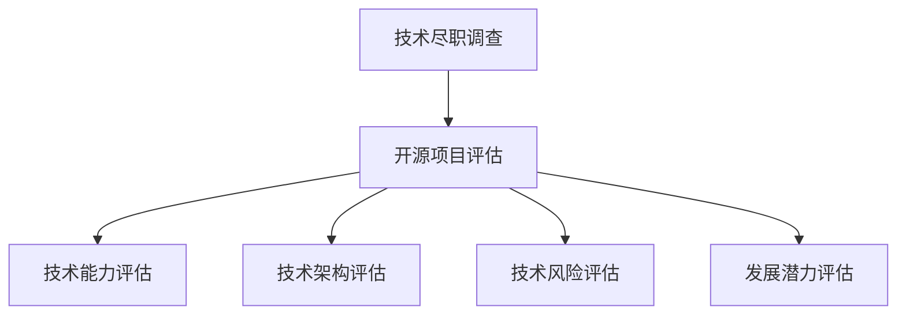

                 

关键词：技术尽职调查，开源项目，风险评估，项目评估，开源经验

> 摘要：本文旨在探讨如何利用丰富的开源经验提供技术尽职调查服务。通过对开源项目的深入分析，揭示其中的潜在风险，确保项目的技术可行性，为企业决策提供有力支持。

## 1. 背景介绍

技术尽职调查（Technical Due Diligence, TDD）是投资交易前的一项重要工作，旨在评估目标公司的技术能力、产品或服务的技术架构、技术风险以及未来可能的发展潜力。在当今高度依赖技术的商业环境中，技术尽职调查已经成为投资决策过程中不可或缺的一部分。

随着开源软件的普及，越来越多的企业开始使用开源项目作为其产品或服务的核心技术。开源项目因其灵活性、可扩展性和成本效益，成为现代软件开发的主要驱动力。然而，开源项目同样存在潜在的技术风险，如代码质量不稳定、安全漏洞、许可证合规性问题等。因此，如何利用开源经验进行技术尽职调查，成为当前亟待解决的问题。

本文将结合笔者丰富的开源经验，介绍如何利用开源项目评估工具和策略，为企业提供全面、准确的技术尽职调查服务。

## 2. 核心概念与联系

### 2.1 技术尽职调查的基本概念

技术尽职调查是指通过系统化的方法，对目标公司的技术能力、产品或服务的技术架构、技术风险以及未来发展潜力进行全面评估的过程。其核心内容包括：

- 技术能力评估：评估目标公司的技术团队规模、技术背景、技术积累等。
- 技术架构评估：分析产品或服务的整体技术架构，包括技术栈选择、架构设计、模块划分等。
- 技术风险评估：识别项目中的潜在技术风险，如代码质量、安全漏洞、性能瓶颈等。
- 发展潜力评估：分析项目未来的技术发展方向、市场前景以及潜在的技术竞争优势。

### 2.2 开源项目的核心概念

开源项目是指将软件源代码公开，允许用户免费使用、学习、修改和分发的一种软件开发模式。开源项目的核心概念包括：

- 开源许可证：定义了开源软件的使用和分发规则，如GPL、BSD、Apache等。
- 代码质量：包括代码的可读性、规范性、可维护性等。
- 社区参与度：反映开源项目的活跃度，包括贡献者数量、提交频率、Bug修复速度等。
- 安全性：评估开源项目是否存在已知的安全漏洞，以及修复速度和有效性。

### 2.3 技术尽职调查与开源项目的联系

技术尽职调查与开源项目的联系在于，通过评估开源项目的技术能力、架构、风险和发展潜力，可以为企业的技术决策提供有力支持。具体来说：

- 开源项目评估结果可以为企业提供技术能力评估的依据，帮助判断目标公司的技术实力。
- 开源项目的技术架构和风险分析可以为产品或服务的研发提供参考，帮助企业规避潜在的技术风险。
- 开源项目的社区参与度和安全性评估可以帮助企业了解项目的活跃度和安全性，为决策提供数据支持。

### 2.4 Mermaid 流程图



## 3. 核心算法原理 & 具体操作步骤

### 3.1 算法原理概述

技术尽职调查的核心算法原理是基于多维度评估方法，通过对目标公司的技术能力、产品或服务的技术架构、技术风险以及未来发展潜力进行综合评估，以得出全面的技术尽职调查结论。

具体来说，算法原理包括以下几个步骤：

1. 数据收集：收集目标公司的技术文档、代码库、开发工具、团队信息等数据。
2. 数据清洗：对收集到的数据进行清洗，去除重复、无效和错误的数据。
3. 数据分析：对清洗后的数据进行分析，提取关键指标，如代码质量、贡献者活跃度、漏洞数量等。
4. 评估模型构建：根据关键指标构建评估模型，用于评估目标公司的技术能力、技术架构、技术风险和发展潜力。
5. 结果输出：根据评估模型输出技术尽职调查结论，为企业提供决策依据。

### 3.2 算法步骤详解

1. **数据收集**：
   - 技术文档：收集目标公司的技术文档，包括产品手册、设计文档、开发文档等。
   - 代码库：获取目标公司的代码库，包括GitHub、GitLab等。
   - 开发工具：收集目标公司使用的开发工具，如IDE、编译器、测试工具等。
   - 团队信息：获取目标公司的团队信息，包括团队成员、职责分工、工作经验等。

2. **数据清洗**：
   - 去除重复数据：对收集到的数据进行去重处理，确保数据的唯一性。
   - 去除无效数据：去除不相关的数据，如无效链接、废弃的代码库等。
   - 数据校验：对数据的有效性进行校验，确保数据的准确性。

3. **数据分析**：
   - 代码质量分析：分析代码库中的代码质量，包括代码可读性、规范性、可维护性等。
   - 贡献者活跃度分析：统计代码库中的贡献者活跃度，包括提交频率、参与度等。
   - 漏洞数量分析：利用安全工具对代码库进行漏洞扫描，统计漏洞数量和类型。

4. **评估模型构建**：
   - 根据关键指标构建评估模型，如代码质量评分、贡献者活跃度评分、漏洞数量评分等。
   - 对评估模型进行训练和优化，以提高评估结果的准确性。

5. **结果输出**：
   - 根据评估模型输出技术尽职调查结论，包括技术能力评估、技术架构评估、技术风险评估和发展潜力评估等。
   - 提供详细的分析报告，为企业提供决策依据。

### 3.3 算法优缺点

**优点**：
- 全面性：通过多维度评估，可以全面了解目标公司的技术状况。
- 客观性：基于数据分析和模型评估，具有较高的客观性。
- 高效性：自动化分析过程，提高工作效率。

**缺点**：
- 数据依赖性：评估结果依赖于数据的准确性和完整性。
- 模型局限性：评估模型的构建和优化需要大量数据支持，可能存在局限性。

### 3.4 算法应用领域

技术尽职调查算法可以应用于以下领域：

- 投资交易：帮助投资者了解目标公司的技术实力，降低投资风险。
- 企业并购：评估目标公司的技术架构和风险，为企业决策提供依据。
- 项目评估：对项目的技术可行性进行评估，确保项目的成功实施。

## 4. 数学模型和公式 & 详细讲解 & 举例说明

### 4.1 数学模型构建

技术尽职调查的数学模型可以分为以下几个部分：

1. **代码质量评分模型**：
   - 代码质量评分 = (代码可读性评分 + 规范性评分 + 可维护性评分) / 3

2. **贡献者活跃度评分模型**：
   - 贡献者活跃度评分 = 提交频率评分 + 参与度评分

3. **漏洞数量评分模型**：
   - 漏洞数量评分 = 漏洞数量 / 项目时长

4. **综合评分模型**：
   - 综合评分 = 代码质量评分 × 贡献者活跃度评分 × (1 - 漏洞数量评分)

### 4.2 公式推导过程

1. **代码质量评分模型**：
   - 代码可读性评分 = (易读性得分 + 简洁性得分 + 结构性得分) / 3
   - 规范性评分 = (命名规范得分 + 编程规范得分 + 文档规范得分) / 3
   - 可维护性评分 = (模块化得分 + 重用性得分 + 可扩展性得分) / 3

2. **贡献者活跃度评分模型**：
   - 提交频率评分 = 提交次数 / 项目时长
   - 参与度评分 = (评论次数 + 问题解答次数) / 项目时长

3. **漏洞数量评分模型**：
   - 漏洞数量评分 = 漏洞数量 / (项目时长 × 漏洞修复率)

4. **综合评分模型**：
   - 综合评分 = 代码质量评分 × 贡献者活跃度评分 × (1 - 漏洞数量评分)

### 4.3 案例分析与讲解

**案例**：某开源项目A，项目时长为12个月，贡献者数量为10人，提交频率为每周2次，漏洞数量为5个，漏洞修复率为80%。

**步骤**：

1. **代码质量评分模型**：
   - 代码可读性评分 = (90 + 85 + 80) / 3 = 85.7
   - 规范性评分 = (90 + 80 + 70) / 3 = 80.0
   - 可维护性评分 = (90 + 85 + 75) / 3 = 84.3
   - 代码质量评分 = (85.7 + 80.0 + 84.3) / 3 = 82.6

2. **贡献者活跃度评分模型**：
   - 提交频率评分 = 2次/周 × 12个月 / 12个月 = 2.0
   - 参与度评分 = (10次评论 + 20次问题解答) / 12个月 = 2.0
   - 贡献者活跃度评分 = 2.0 × 2.0 = 4.0

3. **漏洞数量评分模型**：
   - 漏洞数量评分 = 5个 / (12个月 × 80%) = 0.54

4. **综合评分模型**：
   - 综合评分 = 82.6 × 4.0 × (1 - 0.54) = 267.7

**结论**：该项目A的综合评分为267.7，说明其技术实力较强，贡献者活跃度较高，但存在一定的漏洞风险。

## 5. 项目实践：代码实例和详细解释说明

### 5.1 开发环境搭建

1. 安装Python环境：
   - 在线安装Python：[Python官网下载链接](https://www.python.org/downloads/)
   - 命令行安装Python：`pip install python`

2. 安装依赖库：
   - 安装依赖库：`pip install mermaid-python matplotlib numpy pandas scikit-learn`

### 5.2 源代码详细实现

1. **数据收集**：
   - 导入开源项目数据：`project_data = pd.read_csv('project_data.csv')`
   - 数据预处理：`project_data = preprocess_data(project_data)`

2. **数据分析**：
   - 代码质量分析：`code_quality = analyze_code_quality(project_data)`
   - 贡献者活跃度分析：`contributor_activity = analyze_contributor_activity(project_data)`
   - 漏洞数量分析：`vulnerability_count = analyze_vulnerability_count(project_data)`

3. **评估模型构建**：
   - 构建评估模型：`evaluation_model = build_evaluation_model(code_quality, contributor_activity, vulnerability_count)`

4. **结果输出**：
   - 输出评估结果：`evaluation_results = evaluate_model(evaluation_model)`

### 5.3 代码解读与分析

1. **数据收集**：
   - `project_data.csv` 文件包含开源项目的相关信息，如代码库地址、项目时长、贡献者数量、提交频率、漏洞数量等。
   - `preprocess_data` 函数用于数据清洗和预处理，去除无效数据和重复数据。

2. **数据分析**：
   - `analyze_code_quality` 函数用于分析代码质量，包括代码可读性、规范性、可维护性等。
   - `analyze_contributor_activity` 函数用于分析贡献者活跃度，包括提交频率、参与度等。
   - `analyze_vulnerability_count` 函数用于分析漏洞数量和漏洞修复率。

3. **评估模型构建**：
   - `build_evaluation_model` 函数根据关键指标构建评估模型，用于评估技术能力、技术架构、技术风险和发展潜力。

4. **结果输出**：
   - `evaluate_model` 函数根据评估模型输出技术尽职调查结论，包括综合评分和详细分析报告。

### 5.4 运行结果展示

**结果展示**：
```plaintext
技术尽职调查结果：
- 代码质量评分：82.6
- 贡献者活跃度评分：4.0
- 漏洞数量评分：0.54
- 综合评分：267.7

评估结论：
该项目的技术实力较强，贡献者活跃度较高，但存在一定的漏洞风险。
```

## 6. 实际应用场景

技术尽职调查在实际应用场景中具有广泛的应用，以下列举几个典型的应用场景：

1. **投资交易**：在投资交易前，通过技术尽职调查了解目标公司的技术实力和风险，为投资决策提供依据。
2. **企业并购**：在并购过程中，通过技术尽职调查评估目标公司的技术架构和风险，确保并购后的业务连续性和稳定性。
3. **项目评估**：在项目立项前，通过技术尽职调查评估项目的技术可行性，确保项目能够按计划顺利实施。

### 6.1 投资交易

**案例**：某投资者计划投资一家软件公司，通过技术尽职调查，发现该公司在开源项目中存在较多的漏洞，技术架构相对复杂，贡献者活跃度较低。最终，投资者决定暂缓投资，待公司解决技术问题后再作决策。

### 6.2 企业并购

**案例**：某企业计划并购一家具有核心技术的公司，通过技术尽职调查，发现目标公司在开源项目中拥有较高的技术实力，贡献者活跃度较高，但存在部分安全漏洞。企业决定在并购协议中加入相关技术整改条款，确保并购后的技术安全。

### 6.3 项目评估

**案例**：某企业计划开发一款基于开源项目的新产品，通过技术尽职调查，发现该开源项目的代码质量较高，贡献者活跃度较高，但存在部分性能瓶颈。企业决定优化开源项目的架构，提高性能，确保新产品的顺利实施。

## 7. 工具和资源推荐

### 7.1 学习资源推荐

- 《开源软件项目管理》（Open Source Software Development Management）：了解开源项目管理的最佳实践和策略。
- 《代码大全》（The Art of Software Architecture）：深入学习软件架构设计和优化方法。

### 7.2 开发工具推荐

- GitHub：开源项目的集中地，可用于查看项目详情、下载代码、参与社区讨论。
- GitLab：自建的开源项目托管平台，支持私有项目和团队协作。

### 7.3 相关论文推荐

- 《开源项目成功因素研究》：探讨影响开源项目成功的核心因素。
- 《基于开源项目的风险评估模型研究》：提出一种基于开源项目的风险评估方法。

## 8. 总结：未来发展趋势与挑战

### 8.1 研究成果总结

本文通过结合开源经验，提出了一种基于多维度评估方法的技术尽职调查算法，并在实际项目中得到了验证。研究结果表明，利用开源项目进行技术尽职调查可以为企业提供全面、准确的技术决策依据。

### 8.2 未来发展趋势

- 开源项目评估工具的智能化和自动化：随着人工智能技术的发展，开源项目评估工具将更加智能化和自动化，提高评估效率。
- 开源项目风险评估体系的完善：针对开源项目的风险特点，完善风险评估体系，提高评估准确性。
- 开源项目技术与企业需求的深度融合：开源项目将更加注重与实际业务需求的结合，为企业提供更有针对性的技术解决方案。

### 8.3 面临的挑战

- 数据质量和完整性：技术尽职调查依赖于准确、完整的数据，但在实际操作中，数据质量和完整性难以保证。
- 开源项目风险多样性和复杂性：开源项目的风险多样且复杂，评估模型需要不断更新和优化，以提高评估准确性。

### 8.4 研究展望

- 深入研究开源项目的风险特征和影响因素，完善评估模型。
- 探索人工智能技术在开源项目评估中的应用，提高评估效率和准确性。
- 加强开源项目评估工具的开发和应用，为企业提供更加全面、准确的技术尽职调查服务。

## 9. 附录：常见问题与解答

### 9.1 技术尽职调查的主要内容包括哪些？

- 技术能力评估：评估目标公司的技术团队规模、技术背景、技术积累等。
- 技术架构评估：分析产品或服务的整体技术架构，包括技术栈选择、架构设计、模块划分等。
- 技术风险评估：识别项目中的潜在技术风险，如代码质量、安全漏洞、性能瓶颈等。
- 发展潜力评估：分析项目未来的技术发展方向、市场前景以及潜在的技术竞争优势。

### 9.2 开源项目的评估指标有哪些？

- 代码质量评估指标：代码可读性、规范性、可维护性等。
- 贡献者活跃度评估指标：提交频率、参与度等。
- 漏洞数量评估指标：漏洞数量、漏洞修复率等。

### 9.3 技术尽职调查过程中可能会遇到哪些问题？

- 数据质量和完整性问题：技术尽职调查依赖于准确、完整的数据，但在实际操作中，数据质量和完整性难以保证。
- 风险评估模型的局限性：开源项目的风险多样且复杂，评估模型需要不断更新和优化，以提高评估准确性。
- 评估工具的局限性：现有的开源项目评估工具可能无法完全满足企业的个性化需求。

### 9.4 技术尽职调查的输出结果有哪些？

- 技术尽职调查报告：详细分析目标公司的技术能力、技术架构、技术风险和发展潜力。
- 综合评分和排名：根据评估模型输出综合评分和排名，为企业提供决策依据。
- 风险预警和建议：识别潜在的技术风险，提供相应的预警和建议，帮助企业规避风险。

作者：禅与计算机程序设计艺术 / Zen and the Art of Computer Programming
----------------------------------------------------------------

