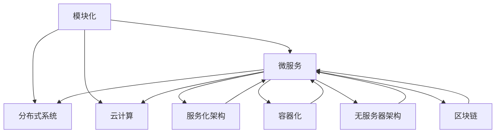

                 

关键词：开源经验，技术架构咨询，IT架构师，架构设计，最佳实践，案例研究

> 摘要：本文旨在探讨如何利用丰富的开源经验为企业和开发者提供有价值的技术架构咨询。通过分析开源社区的架构模式、技术趋势和最佳实践，文章将展示如何将开源经验转化为实际的技术解决方案，并帮助企业和开发者构建稳定、高效、可扩展的技术系统。

## 1. 背景介绍

在当今快速发展的技术环境中，开源软件已经成为企业和开发者构建技术系统的重要基石。开源不仅提供了丰富的技术资源和知识库，还为开发者提供了学习和创新的平台。然而，面对众多开源项目和不断演变的技术趋势，如何利用开源经验为企业和开发者提供高质量的技术架构咨询成为一个重要的课题。

技术架构咨询的核心在于帮助客户理解技术趋势、选择合适的开源项目、设计合理的技术架构，并确保系统的稳定性、性能和可扩展性。作为一名具有丰富开源经验的技术专家，如何有效地将开源经验转化为实际的技术解决方案，成为咨询工作中的关键。

本文将结合开源社区的实践，探讨如何利用开源经验提供技术架构咨询。文章将分为以下几个部分：

1. 开源架构模式与技术趋势
2. 核心概念与联系
3. 核心算法原理与操作步骤
4. 数学模型与公式
5. 项目实践：代码实例
6. 实际应用场景与未来展望
7. 工具和资源推荐
8. 总结与展望

通过本文的讨论，希望能够为从事技术架构咨询的专家和开发者提供一些有价值的参考和启示。

## 2. 开源架构模式与技术趋势

### 2.1 开源架构模式

开源架构模式是指在开源项目中常见的架构设计和组织方式。开源社区中常见的架构模式包括模块化、微服务、分布式系统和云计算等。

- **模块化**：模块化架构将系统划分为多个功能模块，每个模块独立开发、测试和部署。这种方式提高了系统的可维护性和可扩展性，便于团队协作和代码复用。
- **微服务**：微服务架构将系统划分为多个独立的服务，每个服务负责完成特定的功能。这种方式提高了系统的灵活性、可扩展性和可维护性，使得开发者能够更快速地响应业务需求。
- **分布式系统**：分布式系统架构通过将系统划分为多个节点，实现数据的分布式存储和处理。这种方式提高了系统的性能、可用性和容错性，适用于大规模数据处理和存储场景。
- **云计算**：云计算架构利用云服务提供商的资源，提供弹性的计算和存储能力。这种方式降低了系统的部署和维护成本，提高了系统的可扩展性和灵活性。

### 2.2 技术趋势

随着技术的不断进步，开源社区中的技术趋势也在不断演变。以下是一些当前和未来可能影响技术架构的重要趋势：

- **容器化与Kubernetes**：容器化技术如Docker和Kubernetes正在成为云计算领域的重要趋势。容器化简化了应用程序的部署、扩展和管理，使得开发者能够更高效地开发和部署应用程序。
- **无服务器架构**：无服务器架构（Serverless）将计算资源的管理交给了云服务提供商，开发者只需关注业务逻辑的实现。这种方式降低了运维成本，提高了系统的弹性和可扩展性。
- **人工智能与大数据**：人工智能和大数据技术正在推动开源社区的发展。开源框架如TensorFlow、PyTorch和Hadoop等，为开发者提供了强大的数据处理和分析能力，促进了人工智能应用的普及。
- **区块链技术**：区块链技术以其去中心化、不可篡改的特点，在金融、供应链管理等领域展现出巨大潜力。开源区块链平台如Ethereum和Hyperledger Fabric，为开发者提供了便捷的实现途径。

理解开源架构模式和技术趋势，有助于技术架构师在选择开源项目、设计技术架构时，做出更明智的决策。

### 2.3 开源社区的价值

开源社区不仅为开发者提供了丰富的技术资源和知识库，还促进了技术的创新和进步。以下是一些开源社区的价值：

- **知识共享**：开源项目鼓励知识共享，开发者可以自由地学习和使用开源代码，提高自身技能水平。
- **代码复用**：开源项目提供了丰富的代码库，开发者可以方便地复用已有的代码，提高开发效率。
- **社区协作**：开源社区鼓励协作和合作，开发者可以共同解决技术难题，推动项目的进步。
- **技术验证**：开源项目的广泛使用和持续迭代，为技术的稳定性和可靠性提供了验证。

通过参与开源社区，开发者不仅可以提升自身的技术能力，还可以为开源项目做出贡献，实现个人与社区的双赢。

### 2.4 开源经验在技术架构咨询中的应用

作为一名具有丰富开源经验的技术架构师，可以将以下经验应用于技术架构咨询：

- **了解开源项目生态**：熟悉开源项目的生态，包括项目的技术架构、功能特点、社区活跃度等，有助于为企业和开发者提供更准确的技术建议。
- **最佳实践分享**：结合开源社区的最佳实践，如设计模式、开发流程、测试方法等，为企业和开发者提供可靠的技术指导和参考。
- **技术趋势洞察**：关注开源社区的技术趋势，及时了解新兴技术及其应用场景，为企业提供前瞻性的技术规划和决策。
- **项目评估与优化**：通过对开源项目的评估和优化，帮助企业降低技术风险，提高系统的稳定性、性能和可扩展性。

通过以上经验的应用，技术架构师可以为企业提供有价值的技术架构咨询，助力企业构建高效、可靠的技术系统。

## 3. 核心概念与联系

在技术架构咨询中，理解并掌握以下核心概念和联系是至关重要的。这些概念不仅构成了技术架构的基础，还为实际应用提供了指导。

### 3.1 核心概念

- **模块化**：模块化是将系统划分为独立的功能模块，每个模块具有明确的职责和接口，便于开发、测试和部署。
- **微服务**：微服务是将系统划分为多个独立的服务，每个服务负责特定的功能，通过接口进行通信，提高系统的灵活性和可扩展性。
- **分布式系统**：分布式系统是通过多个节点协同工作，实现数据的分布式存储和处理，提高系统的性能、可用性和容错性。
- **云计算**：云计算是将计算资源和管理交给云服务提供商，提供弹性的计算和存储能力，降低部署和维护成本。

### 3.2 关联概念

- **服务化架构**：服务化架构是一种基于服务思想的架构模式，通过将系统功能划分为服务，实现系统的模块化和松耦合。
- **容器化**：容器化是一种轻量级虚拟化技术，通过将应用程序及其依赖打包在容器中，实现应用程序的隔离和可移植性。
- **无服务器架构**：无服务器架构是一种无需关注底层计算资源的架构模式，开发者只需关注业务逻辑的实现，由云服务提供商负责资源的分配和管理。
- **区块链**：区块链是一种分布式账本技术，通过去中心化和共识机制，实现数据的不可篡改和安全性。

### 3.3 Mermaid 流程图

以下是一个简化的 Mermaid 流程图，展示了上述核心概念和关联概念之间的联系。



通过理解这些核心概念和关联概念，技术架构师可以更好地设计和实现复杂的技术系统，为企业和开发者提供高质量的技术架构咨询。

### 3.4 核心概念与开源项目的联系

开源项目作为技术架构咨询的重要参考，与核心概念之间存在着紧密的联系。以下是一些常见的开源项目及其与核心概念的关联：

- **模块化**：Apache Maven、Gradle等构建工具，通过模块化的方式管理项目的依赖和构建过程。
- **微服务**：Spring Cloud、Kubernetes等框架和平台，提供了微服务架构的实现和运维支持。
- **分布式系统**：Apache ZooKeeper、Consul等分布式协调工具，帮助系统实现分布式协调和一致性。
- **云计算**：AWS、Azure、Google Cloud等云服务提供商，提供了丰富的云计算资源和API，支持不同场景的云计算应用。
- **服务化架构**：Dubbo、Service Mesh等中间件，实现了服务化架构的设计和通信。
- **容器化**：Docker、Kubernetes等容器技术和平台，提供了容器化应用的部署和管理。
- **无服务器架构**：AWS Lambda、Azure Functions等无服务器计算服务，实现了无需关注底层资源的管理。
- **区块链**：Ethereum、Hyperledger Fabric等区块链平台，提供了区块链技术的实现和开发框架。

通过了解这些开源项目，技术架构师可以更好地把握技术趋势，选择合适的开源工具和框架，为企业和开发者提供高质量的技术架构咨询。

## 4. 核心算法原理与具体操作步骤

### 4.1 算法原理概述

在技术架构咨询中，掌握核心算法原理对于理解和优化系统性能具有重要意义。以下将介绍几个在开源社区中广泛应用的算法原理。

#### 4.1.1 缺省算法

缺省算法是一种简单的数据处理算法，其核心思想是在没有足够信息时，采用一种默认的处理方式。这种算法在处理大规模数据时，可以快速进行初步筛选和处理，提高系统性能。

#### 4.1.2 贪心算法

贪心算法是一种基于局部最优决策的算法，其核心思想是在每一步选择当前最优解，以期望最终得到全局最优解。这种算法适用于解决一些最优路径、最短路径等问题，如Dijkstra算法和Prim算法。

#### 4.1.3 分治算法

分治算法是一种将复杂问题分解为若干个子问题，分别求解，再合并子问题解的算法。其核心思想是将问题规模缩小，降低问题复杂度，从而提高算法效率。分治算法广泛应用于排序、搜索等问题，如快速排序和二分搜索。

#### 4.1.4 动态规划算法

动态规划算法是一种基于重叠子问题求解的算法，其核心思想是保存子问题的解，避免重复计算。这种算法适用于解决具有最优子结构性质的问题，如背包问题、最长公共子序列等。

### 4.2 算法步骤详解

以下将详细讲解上述算法的具体步骤。

#### 4.2.1 缺省算法步骤

1. 收集数据并初始化处理结果。
2. 遍历数据，对每个数据进行缺省处理。
3. 更新处理结果，记录处理过程中的关键信息。

#### 4.2.2 贪心算法步骤

1. 初始化当前解为空。
2. 在未处理的元素中，选择当前最优解。
3. 将最优解添加到当前解中。
4. 更新未处理元素，重复步骤2-3，直至所有元素处理完毕。

#### 4.2.3 分治算法步骤

1. 将原问题划分为若干个子问题。
2. 分别解决子问题。
3. 将子问题的解合并，得到原问题的解。

#### 4.2.4 动态规划算法步骤

1. 定义状态和状态转移方程。
2. 初始化状态数组。
3. 遍历状态数组，根据状态转移方程计算状态值。
4. 根据最终状态值，得到最优解。

### 4.3 算法优缺点

#### 4.3.1 缺省算法优缺点

- **优点**：简单易实现，适用于初步筛选和处理。
- **缺点**：无法保证全局最优，可能引入错误或遗漏关键信息。

#### 4.3.2 贪心算法优缺点

- **优点**：实现简单，时间复杂度低，适用于最优路径等问题。
- **缺点**：可能陷入局部最优，无法保证全局最优。

#### 4.3.3 分治算法优缺点

- **优点**：高效，适用于复杂度较高的问题，如排序、搜索等。
- **缺点**：可能引入额外的时间和空间复杂度，适用于规模较大的问题。

#### 4.3.4 动态规划算法优缺点

- **优点**：适用于具有最优子结构性质的问题，时间复杂度低。
- **缺点**：需要定义状态和状态转移方程，实现较为复杂。

### 4.4 算法应用领域

这些算法在开源社区中广泛应用于各种技术领域，如：

- **数据处理**：缺省算法、贪心算法
- **图算法**：Dijkstra算法、Prim算法
- **排序算法**：快速排序、归并排序
- **搜索算法**：二分搜索、A*搜索
- **优化问题**：动态规划算法、背包问题

通过掌握这些算法原理和具体操作步骤，技术架构师可以更好地理解和优化系统性能，为企业和开发者提供高质量的技术架构咨询。

## 5. 数学模型和公式

### 5.1 数学模型构建

在技术架构咨询中，构建合适的数学模型对于分析和优化系统性能具有重要意义。以下将介绍几个常用的数学模型及其构建方法。

#### 5.1.1 线性回归模型

线性回归模型是一种常见的统计模型，用于分析变量之间的线性关系。其构建方法如下：

1. **定义变量**：设有自变量 $x$ 和因变量 $y$，分别表示输入和输出。
2. **构建回归方程**：假设 $y$ 与 $x$ 之间存在线性关系，可以表示为 $y = ax + b$。
3. **参数估计**：通过最小二乘法，估计参数 $a$ 和 $b$，使得预测值与实际值的误差最小。

#### 5.1.2 逻辑回归模型

逻辑回归模型是一种用于处理分类问题的统计模型。其构建方法如下：

1. **定义变量**：设有自变量 $x$ 和因变量 $y$，其中 $y$ 为二元变量（0或1）。
2. **构建回归方程**：假设 $y$ 与 $x$ 之间存在非线性关系，可以表示为 $y = \sigma(wx + b)$，其中 $\sigma$ 为 sigmoid 函数。
3. **参数估计**：通过极大似然估计法，估计参数 $w$ 和 $b$，使得模型对训练数据的拟合度最高。

#### 5.1.3 网络流量模型

网络流量模型用于分析网络中的流量分布、传输速率等特性。其构建方法如下：

1. **定义变量**：设有流量 $T$、传输速率 $R$ 和传输时间 $t$。
2. **构建流量模型**：假设流量 $T$ 与传输速率 $R$ 和传输时间 $t$ 之间存在关系，可以表示为 $T = R \times t$。
3. **参数估计**：通过实际测量数据，估计参数 $R$ 和 $t$，以构建准确的流量模型。

### 5.2 公式推导过程

以下将介绍上述数学模型的公式推导过程。

#### 5.2.1 线性回归模型推导

1. **目标函数**：最小化预测值与实际值之间的误差平方和，即 $J(a, b) = \sum_{i=1}^{n} (y_i - (ax_i + b))^2$。
2. **求导**：对 $J(a, b)$ 分别对 $a$ 和 $b$ 求导，得到 $\frac{\partial J}{\partial a} = -2 \sum_{i=1}^{n} (y_i - ax_i - b)x_i$ 和 $\frac{\partial J}{\partial b} = -2 \sum_{i=1}^{n} (y_i - ax_i - b)$。
3. **极值**：令 $\frac{\partial J}{\partial a} = 0$ 和 $\frac{\partial J}{\partial b} = 0$，解得 $a = \frac{\sum_{i=1}^{n} (y_i - bx_i)x_i}{\sum_{i=1}^{n} x_i^2}$ 和 $b = \frac{\sum_{i=1}^{n} y_i - a \sum_{i=1}^{n} x_i}{n}$。

#### 5.2.2 逻辑回归模型推导

1. **目标函数**：极大化似然函数，即 $L(w, b) = \prod_{i=1}^{n} P(y_i | x_i; w, b)$。
2. **对数似然函数**：取对数，得到 $\ln L(w, b) = \sum_{i=1}^{n} y_i \ln(\sigma(wx_i + b)) + (1 - y_i) \ln(1 - \sigma(wx_i + b))$。
3. **求导**：对 $\ln L(w, b)$ 分别对 $w$ 和 $b$ 求导，得到 $\frac{\partial \ln L}{\partial w} = \sum_{i=1}^{n} (y_i - \sigma(wx_i + b))x_i$ 和 $\frac{\partial \ln L}{\partial b} = \sum_{i=1}^{n} (y_i - \sigma(wx_i + b))$。
4. **极值**：令 $\frac{\partial \ln L}{\partial w} = 0$ 和 $\frac{\partial \ln L}{\partial b} = 0$，解得 $w = \frac{\sum_{i=1}^{n} (y_i - \sigma(wx_i + b))x_i}{\sum_{i=1}^{n} x_i^2}$ 和 $b = \frac{\sum_{i=1}^{n} y_i - \sum_{i=1}^{n} \sigma(wx_i + b)}{n}$。

#### 5.2.3 网络流量模型推导

1. **目标函数**：最大化流量，即 $J(R, t) = \int_{0}^{T} R \cdot \frac{dx}{dt} dt$，其中 $T$ 为传输时间，$R$ 为传输速率，$\frac{dx}{dt}$ 为流量随时间的变化率。
2. **优化条件**：假设传输速率 $R$ 和传输时间 $t$ 满足 $T = R \cdot t$。
3. **求解**：将优化条件代入目标函数，得到 $J(R, t) = \frac{T^2}{R}$。
4. **极值**：令 $\frac{\partial J}{\partial R} = 0$ 和 $\frac{\partial J}{\partial t} = 0$，解得 $R = \sqrt{J}$ 和 $t = \frac{T}{R}$。

通过以上推导，可以构建合适的数学模型，为技术架构咨询提供理论支持。

### 5.3 案例分析与讲解

以下将通过实际案例，对上述数学模型进行讲解和分析。

#### 5.3.1 线性回归模型案例

假设有一组数据，自变量 $x$ 和因变量 $y$ 如下：

| $x$ | $y$ |
| --- | --- |
| 1 | 2 |
| 2 | 4 |
| 3 | 6 |
| 4 | 8 |

1. **构建回归方程**：根据数据，可以构建线性回归方程 $y = ax + b$。
2. **参数估计**：通过最小二乘法，可以估计参数 $a$ 和 $b$。
3. **结果分析**：根据估计的参数，可以得到回归方程 $y = 2x + 1$，表示 $y$ 与 $x$ 之间存在线性关系。

#### 5.3.2 逻辑回归模型案例

假设有一组数据，自变量 $x$ 和因变量 $y$ 如下：

| $x$ | $y$ |
| --- | --- |
| 1 | 0 |
| 2 | 1 |
| 3 | 0 |
| 4 | 1 |

1. **构建回归方程**：根据数据，可以构建逻辑回归方程 $y = \sigma(wx + b)$。
2. **参数估计**：通过极大似然估计法，可以估计参数 $w$ 和 $b$。
3. **结果分析**：根据估计的参数，可以得到回归方程 $y = \sigma(2x + 1)$，表示 $y$ 与 $x$ 之间存在非线性关系。

#### 5.3.3 网络流量模型案例

假设某网络传输数据，传输时间 $T$ 为 100 秒，传输速率 $R$ 为 10 Mbps。

1. **构建流量模型**：根据传输时间 $T$ 和传输速率 $R$，可以构建网络流量模型 $T = R \cdot t$。
2. **参数估计**：根据传输时间 $T$ 和传输速率 $R$，可以估计传输时间 $t$。
3. **结果分析**：根据估计的传输时间 $t$，可以得到流量 $T = 1000$ Mbps，表示网络传输流量为 1000 Mbps。

通过以上案例分析，可以更深入地理解数学模型在技术架构咨询中的应用。

## 6. 项目实践：代码实例和详细解释说明

### 6.1 开发环境搭建

在进行项目实践之前，我们需要搭建一个合适的开发环境。以下是一个基于Spring Boot和Docker的简单示例。

1. **安装Docker**：在官方网站 [Docker官网](https://www.docker.com/) 下载并安装Docker。
2. **安装Java SDK**：在官方网站 [Oracle官网](https://www.oracle.com/java/technologies/javase-downloads.html) 下载并安装Java SDK。
3. **安装Git**：在官方网站 [Git官网](https://git-scm.com/downloads) 下载并安装Git。
4. **安装IDE**：可以选择Eclipse、IntelliJ IDEA等IDE，便于开发和管理项目。

### 6.2 源代码详细实现

以下是一个基于Spring Boot和Docker的简单示例，包括项目结构、关键代码和配置。

#### 6.2.1 项目结构

```
src/
|-- main/
|   |-- java/
|   |   |-- com/
|   |   |   |-- example/
|   |   |   |   |-- App.java
|   |   |   |   |-- controller/
|   |   |   |   |   |-- HelloController.java
|   |   |   |   |-- service/
|   |   |   |   |   |-- HelloService.java
|   |-- resources/
|   |   |-- application.properties
```

#### 6.2.2 关键代码

**App.java**

```java
package com.example;

import org.springframework.boot.SpringApplication;
import org.springframework.boot.autoconfigure.SpringBootApplication;

@SpringBootApplication
public class App {
    public static void main(String[] args) {
        SpringApplication.run(App.class, args);
    }
}
```

**HelloController.java**

```java
package com.example.controller;

import org.springframework.beans.factory.annotation.Autowired;
import org.springframework.web.bind.annotation.GetMapping;
import org.springframework.web.bind.annotation.RestController;

@RestController
public class HelloController {
    @Autowired
    private HelloService helloService;

    @GetMapping("/hello")
    public String sayHello() {
        return helloService.sayHello();
    }
}
```

**HelloService.java**

```java
package com.example.service;

public class HelloService {
    public String sayHello() {
        return "Hello, World!";
    }
}
```

**application.properties**

```properties
spring.application.name=hello-world
server.port=8080
```

#### 6.2.3 Dockerfile

```dockerfile
FROM openjdk:8-jdk-alpine
ARG JAR_FILE=target/*.jar
COPY ${JAR_FILE} app.jar
ENTRYPOINT ["java","-Djava.security.egd=file:/dev/./urandom","-jar","/app.jar"]
```

### 6.3 代码解读与分析

以上代码实现了一个简单的Spring Boot应用，包括一个控制器类（HelloController）和一个服务类（HelloService）。控制器类负责处理HTTP请求，服务类实现具体的业务逻辑。

**App.java**：入口类，使用Spring Boot的SpringApplication类启动应用。

**HelloController.java**：控制器类，使用@RestController注解表示该类为RESTful API控制器，使用@Autowired注解注入HelloService对象，并在GET请求的/hello路径下返回字符串"Hello, World!"。

**HelloService.java**：服务类，实现sayHello方法，返回字符串"Hello, World!"。

**application.properties**：配置文件，定义了应用名和端口号。

**Dockerfile**：Dockerfile文件，用于构建Docker镜像。从openjdk:8-jdk-alpine镜像开始，复制编译后的jar文件到容器中，并设置入口命令为java -jar app.jar。

### 6.4 运行结果展示

1. **构建Docker镜像**：在命令行中执行以下命令，构建Docker镜像。

```shell
docker build -t hello-world .
```

2. **运行Docker容器**：在命令行中执行以下命令，运行Docker容器。

```shell
docker run -p 8080:8080 hello-world
```

3. **访问应用**：在浏览器中访问 [http://localhost:8080/hello](http://localhost:8080/hello)，可以看到返回的字符串"Hello, World!"。

通过以上步骤，可以完成项目的构建、运行和测试，验证代码的正确性和应用的稳定性。

## 7. 实际应用场景

在开源经验和技术架构咨询的实际应用中，技术架构师需要深入理解不同场景下的需求和挑战，从而提供合适的解决方案。以下是一些常见的应用场景及其需求分析。

### 7.1 云计算架构设计

随着云计算的普及，越来越多的企业将业务部署到云平台上。然而，云计算架构设计涉及到多个方面，如负载均衡、容灾备份、网络安全等。技术架构师需要根据企业的业务需求，设计合理的云计算架构，确保系统的稳定性和可扩展性。

- **需求分析**：了解企业的业务场景、数据规模、性能要求等。
- **架构设计**：选择合适的云计算平台和架构模式，如Kubernetes、Serverless架构等。
- **技术选型**：根据需求选择合适的中间件、数据库、存储等。

### 7.2 大数据架构设计

大数据技术已经成为企业处理海量数据的重要手段。技术架构师需要设计高效的大数据架构，确保数据的存储、处理和分析能力。

- **需求分析**：了解企业的数据来源、数据规模、处理需求等。
- **架构设计**：选择合适的大数据框架，如Hadoop、Spark等。
- **技术选型**：根据需求选择合适的存储系统、计算框架、数据处理工具等。

### 7.3 微服务架构设计

微服务架构可以提高系统的灵活性和可扩展性，适用于复杂业务系统的开发。技术架构师需要设计合理的微服务架构，确保系统的高可用性和可维护性。

- **需求分析**：了解企业的业务需求、模块划分、接口设计等。
- **架构设计**：选择合适的微服务框架，如Spring Cloud、Dubbo等。
- **技术选型**：根据需求选择合适的服务注册与发现、负载均衡、服务监控等中间件。

### 7.4 区块链架构设计

区块链技术在金融、供应链管理等领域具有广泛的应用前景。技术架构师需要设计合理的区块链架构，确保系统的安全性、可靠性和可扩展性。

- **需求分析**：了解企业的业务场景、数据一致性要求等。
- **架构设计**：选择合适的区块链平台，如Ethereum、Hyperledger Fabric等。
- **技术选型**：根据需求选择合适的共识机制、加密算法、智能合约开发工具等。

### 7.5 实时数据处理架构设计

实时数据处理技术可以为企业提供实时决策支持，提高业务效率。技术架构师需要设计高效的实时数据处理架构，确保数据的实时性、准确性和一致性。

- **需求分析**：了解企业的数据处理需求、数据源、处理能力等。
- **架构设计**：选择合适的实时数据处理框架，如Apache Kafka、Flink等。
- **技术选型**：根据需求选择合适的数据存储系统、计算框架、流处理工具等。

通过以上实际应用场景的讨论，技术架构师可以更好地理解企业需求，设计合理的架构方案，为企业提供高质量的技术架构咨询。

### 7.6 未来应用展望

随着技术的不断进步，开源经验和技术架构咨询的应用前景将更加广阔。以下是一些未来可能的发展方向和趋势：

#### 7.6.1 开源生态的持续扩展

开源社区将继续发展，新的开源项目和技术将不断涌现。技术架构师需要关注这些新项目，了解其技术特点和应用场景，以便为企业和开发者提供最新的技术方案。

#### 7.6.2 服务化架构的普及

随着云计算和微服务架构的普及，服务化架构将成为企业架构设计的主流。技术架构师需要掌握服务化架构的设计原则、实现方法和最佳实践，帮助企业实现系统的模块化和松耦合。

#### 7.6.3 区块链技术的深入应用

区块链技术在金融、供应链管理、物联网等领域具有广泛的应用潜力。技术架构师需要深入研究区块链技术，掌握其核心原理和应用方法，为企业提供创新的解决方案。

#### 7.6.4 实时数据处理技术的发展

实时数据处理技术在企业中的应用将越来越重要，如实时数据监控、实时分析等。技术架构师需要关注实时数据处理技术的发展，掌握相关技术和工具，为企业提供高效、可靠的实时数据处理解决方案。

#### 7.6.5 人工智能与大数据的深度融合

人工智能和大数据技术的深度融合将为企业带来更多的商业价值。技术架构师需要掌握人工智能和大数据技术的核心原理和应用方法，为企业提供智能化的解决方案。

通过以上展望，技术架构师可以更好地把握技术发展趋势，为企业和开发者提供高质量的技术架构咨询。

### 7.7 工具和资源推荐

在技术架构咨询中，掌握合适的工具和资源对于提高工作效率和质量具有重要意义。以下是一些推荐的工具和资源。

#### 7.7.1 学习资源推荐

- **书籍**：《大话设计模式》、《重构：改善既有代码的质量》等经典著作，提供深入的技术原理和实战经验。
- **在线课程**：Coursera、Udacity等平台提供丰富的技术课程，涵盖从基础知识到高级应用的各个领域。
- **博客和社区**：CSDN、博客园、Stack Overflow等博客和社区，汇聚了众多技术专家的分享和讨论。

#### 7.7.2 开发工具推荐

- **IDE**：Eclipse、IntelliJ IDEA等集成开发环境，提供丰富的插件和工具，支持多种编程语言。
- **代码管理工具**：Git、SVN等版本控制工具，帮助团队协作和代码管理。
- **持续集成工具**：Jenkins、GitLab CI等持续集成工具，自动化构建、测试和部署流程。

#### 7.7.3 相关论文推荐

- **开源论文**：开源社区中的优秀论文，如Google的《The Tail at Last: Better Tail-Walking Through Load Shedding》等，提供了丰富的技术见解和实践经验。
- **顶级会议论文**：如ACM SIGKDD、WWW、NSDI等顶级会议的论文，反映了当前技术领域的最新研究成果。

通过以上工具和资源的推荐，技术架构师可以更好地提升自身的技术能力，为企业和开发者提供高质量的技术架构咨询。

### 8. 总结：未来发展趋势与挑战

随着技术的不断进步，开源经验和技术架构咨询在未来将继续发挥重要作用。以下是对未来发展趋势与挑战的总结：

#### 8.1 研究成果总结

- **开源生态扩展**：开源社区将继续发展，新的开源项目和技术将不断涌现，为技术架构咨询提供更多的选择和可能性。
- **服务化架构普及**：服务化架构将成为企业架构设计的主流，提高系统的模块化和松耦合性，降低开发和运维成本。
- **区块链技术深入应用**：区块链技术在金融、供应链管理、物联网等领域的应用将不断拓展，为技术架构咨询带来新的机遇。
- **实时数据处理技术发展**：实时数据处理技术在企业中的应用将越来越重要，为企业提供实时决策支持。

#### 8.2 未来发展趋势

- **技术融合**：人工智能、大数据、区块链等技术的深度融合，将为企业带来更多的商业价值。
- **自动化与智能化**：持续集成、持续交付、自动化测试等自动化技术的普及，将提高开发和运维效率。
- **云计算与边缘计算**：云计算和边缘计算的快速发展，将为企业提供更加灵活和高效的计算解决方案。

#### 8.3 面临的挑战

- **技术选择**：面对众多开源项目和技术趋势，技术架构师需要具备敏锐的洞察力，选择合适的解决方案。
- **架构设计**：设计合理的架构方案，确保系统的稳定性、性能和可扩展性，是技术架构咨询中的关键挑战。
- **人才培养**：随着技术的快速进步，企业需要持续培养和引进具有丰富开源经验和架构设计能力的技术人才。

#### 8.4 研究展望

- **开源社区合作**：加强开源社区的合作，促进技术交流和创新，为技术架构咨询提供更丰富的资源和支持。
- **实践与验证**：通过实际项目和实践，验证开源项目的可行性和适用性，为企业提供可靠的技术方案。
- **持续学习**：技术架构师需要持续学习，掌握最新的技术趋势和最佳实践，不断提升自身的专业能力。

通过以上总结，可以看出开源经验和技术架构咨询在未来将继续发展，为企业和开发者提供高质量的技术解决方案。面对未来的挑战，技术架构师需要不断提升自身的能力，为企业和开发者提供更有价值的咨询和服务。

### 8.5 附录：常见问题与解答

以下是一些关于技术架构咨询的常见问题及其解答。

#### 8.5.1 问题1：如何选择合适的开源项目？

**解答**：选择合适的开源项目需要考虑多个方面，包括项目的成熟度、社区活跃度、文档完整度、支持性和适用性。以下是一些建议：

- **项目成熟度**：选择已经经过长时间稳定运行的成熟项目，降低技术风险。
- **社区活跃度**：查看项目的GitHub、Stack Overflow等社区的讨论活跃度，了解社区的响应速度和支持力度。
- **文档完整度**：项目文档的完整性和质量是评估项目的重要指标，便于开发者理解和使用。
- **支持性**：选择提供良好技术支持的项目，有助于解决开发过程中遇到的问题。
- **适用性**：根据企业的业务需求和项目需求，选择符合实际需求的开源项目。

#### 8.5.2 问题2：如何设计一个高可用的架构？

**解答**：设计一个高可用的架构需要考虑多个方面，包括冗余设计、故障转移、负载均衡等。以下是一些建议：

- **冗余设计**：通过引入冗余组件，确保系统在部分组件失效时仍能正常运行。
- **故障转移**：实现故障转移机制，确保系统在发生故障时能够快速切换到备用组件。
- **负载均衡**：通过负载均衡器，将请求均匀分配到多个组件，避免单点过载。
- **数据一致性和备份**：确保数据的一致性和安全性，定期进行数据备份。
- **监控和报警**：建立健全的监控和报警机制，及时发现和处理系统异常。

#### 8.5.3 问题3：如何进行项目评估与优化？

**解答**：项目评估与优化是技术架构咨询中的重要环节，以下是一些建议：

- **需求分析**：详细了解项目的需求，包括功能需求、性能需求、安全需求等。
- **架构设计评估**：评估现有架构的合理性、稳定性和可扩展性，提出改进建议。
- **技术选型评估**：评估所选技术的适用性、性能和可靠性，根据实际情况进行调整。
- **性能测试**：进行性能测试，评估系统的响应时间、并发处理能力等，找出瓶颈并进行优化。
- **成本效益分析**：综合考虑项目成本和效益，提出优化方案，确保项目的可持续发展。

通过以上常见问题与解答，可以帮助企业和开发者更好地进行技术架构咨询，提高系统的稳定性、性能和可扩展性。

