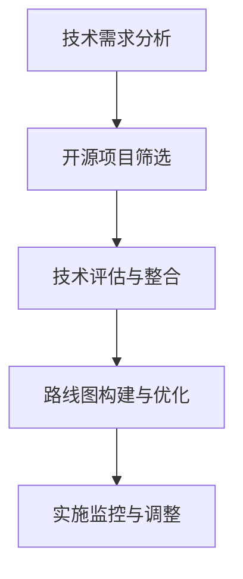

                 

关键词：技术路线图、开源经验、咨询服务、IT项目管理、软件架构

摘要：本文将探讨如何利用开源经验来提供技术路线图咨询服务。开源项目不仅为软件开发提供了丰富的资源，而且为构建技术路线图提供了宝贵的洞察。本文将从背景介绍、核心概念、算法原理、数学模型、项目实践、实际应用场景、工具和资源推荐以及未来发展趋势和挑战等方面，详细阐述如何将开源经验转化为实际的技术路线图咨询服务。

## 1. 背景介绍

在当今快速发展的IT行业中，技术路线图（Technology Roadmap）成为企业战略规划的重要组成部分。技术路线图不仅展示了未来技术的演进方向，还包括实现这些目标所需的关键步骤、资源和时间线。然而，构建一个有效且可行技术路线图并非易事，它需要深入的技术知识、行业洞察和项目管理经验。

开源项目，作为软件开发的创新模式，已经成为现代技术生态系统的重要组成部分。开源项目不仅提供了丰富的代码库、工具和资源，而且鼓励协作和知识共享。开源经验可以为企业提供宝贵的参考，帮助他们更好地理解和应用新技术。

本文将探讨如何结合开源经验，为企业提供技术路线图咨询服务。通过分析开源项目的成功案例，我们能够提炼出关键的原则和实践，帮助企业制定出切实可行的技术路线图。

## 2. 核心概念与联系

为了理解如何利用开源经验提供技术路线图咨询服务，我们首先需要明确几个核心概念：

### 2.1. 技术路线图

技术路线图是一种规划工具，用于展示组织在特定技术领域的发展路径。它通常包括以下内容：

- **技术目标**：定义组织希望实现的技术成果。
- **关键里程碑**：标记出实现技术目标的重要时间点。
- **技术发展路线**：展示从当前状态到未来目标的技术演进路径。

### 2.2. 开源经验

开源经验是指通过参与开源项目所积累的知识、技能和洞察。这些经验包括：

- **代码库**：开源项目提供的代码库，可以作为技术路线图的参考。
- **社区合作**：开源项目中的协作和知识共享，有助于构建有效的技术路线图。
- **经验教训**：从开源项目中吸取的成功和失败的经验，有助于预测和规避潜在的风险。

### 2.3. 技术路线图与开源经验的关系

技术路线图的构建需要基于对现有技术和未来趋势的深刻理解。开源经验提供了丰富的数据源和实际案例，有助于我们：

- **了解最新技术**：通过分析开源项目，了解最新的技术进展和趋势。
- **评估技术成熟度**：开源项目的实践可以直观地展示技术的成熟度和可行性。
- **借鉴成功案例**：从成功开源项目中吸取经验，指导企业技术路线图的制定。

以下是一个简化的技术路线图与开源经验关系的Mermaid流程图：



## 3. 核心算法原理 & 具体操作步骤

### 3.1 算法原理概述

技术路线图的构建本质上是一个问题求解过程，它包括以下几个核心步骤：

1. **需求分析**：明确组织的技术需求，包括目标、关键里程碑和优先级。
2. **资源评估**：评估现有资源和需求之间的差距，确定所需的技术和资源。
3. **技术筛选**：基于开源项目和技术趋势，筛选出潜在的技术解决方案。
4. **路线图构建**：将筛选出的技术方案整合到路线图中，制定实现计划。
5. **实施监控与调整**：根据实施情况，持续监控和调整技术路线图。

### 3.2 算法步骤详解

1. **需求分析**
    - **明确目标**：定义技术路线图所要实现的核心目标。
    - **收集需求**：通过与利益相关者进行交流，收集对技术的需求和期望。
    - **优先级排序**：根据业务价值和可行性，对需求进行优先级排序。

2. **资源评估**
    - **现有资源**：评估组织现有的技术、资金、人力资源等资源。
    - **需求差距**：分析现有资源与需求之间的差距，确定需要补充的资源。

3. **技术筛选**
    - **趋势分析**：研究行业趋势和开源项目的最新进展。
    - **技术评估**：评估潜在技术的可行性、成本和风险。
    - **筛选方案**：基于评估结果，选择最合适的技术方案。

4. **路线图构建**
    - **制定路线图**：将筛选出的技术方案整合到路线图中，制定实现计划。
    - **关键里程碑**：设定关键里程碑，确保项目进度和目标实现。

5. **实施监控与调整**
    - **实施监控**：持续监控技术路线图的实施情况，及时发现问题和风险。
    - **调整路线图**：根据实施情况，调整路线图以适应新的需求和条件。

### 3.3 算法优缺点

**优点**：

- **灵活性**：基于开源项目和技术趋势，技术路线图可以灵活适应变化。
- **低成本**：利用开源技术和资源，可以显著降低技术实现成本。
- **高透明度**：开源项目提供透明的代码和社区协作，有助于提高技术路线图的透明度和可信度。

**缺点**：

- **复杂性**：构建和维护技术路线图需要专业的技术知识和项目管理经验。
- **风险**：开源项目的成熟度和稳定性可能存在不确定性，需要谨慎评估。

### 3.4 算法应用领域

技术路线图算法广泛应用于以下领域：

- **企业战略规划**：帮助企业制定长远的技术发展规划，确保业务目标实现。
- **软件开发项目**：为软件开发项目提供明确的技术方案和实现路线，确保项目成功。
- **技术创业**：为初创企业提供技术指导，帮助他们在竞争激烈的市场中脱颖而出。

## 4. 数学模型和公式 & 详细讲解 & 举例说明

### 4.1 数学模型构建

构建技术路线图通常需要以下几个数学模型：

1. **需求模型**：描述组织的技术需求，包括功能需求、性能需求等。
2. **资源模型**：描述组织现有的资源和需求之间的差距，包括技术、资金、人力资源等。
3. **风险模型**：评估项目实施过程中可能遇到的风险，包括技术风险、市场风险等。
4. **时间模型**：描述项目的时间线和关键里程碑。

### 4.2 公式推导过程

以下是一个简化的技术路线图构建中的时间模型推导过程：

设 \( T \) 为项目总时长，\( M \) 为关键里程碑数量，\( t_i \) 为第 \( i \) 个里程碑的完成时间，则项目总时长可以表示为：

\[ T = \sum_{i=1}^{M} t_i \]

### 4.3 案例分析与讲解

假设一个企业需要开发一款新型电子商务平台，以下是构建其技术路线图中的数学模型和公式的应用：

1. **需求模型**：

   功能需求：实现用户注册、商品浏览、购物车、订单处理等功能。

   性能需求：保证系统在高并发情况下稳定运行。

2. **资源模型**：

   技术资源：具备Web开发、数据库设计和优化、前端UI设计等技能的人员。

   资金资源：项目预算为100万元。

   人力资源：开发团队规模为10人。

3. **风险模型**：

   技术风险：新技术的成熟度和稳定性可能存在问题。

   市场风险：市场竞争激烈，项目可能面临失败的风险。

4. **时间模型**：

   关键里程碑：项目启动、需求分析、系统设计、编码实现、测试和上线。

   里程碑完成时间：假设项目启动时间为2023年1月1日，需求分析阶段为2个月，系统设计阶段为3个月，编码实现阶段为5个月，测试和上线阶段为2个月。

   项目总时长 \( T = 2 + 3 + 5 + 2 = 12 \) 个月。

根据时间模型，可以计算出各个阶段的时间安排，确保项目按时完成。

## 5. 项目实践：代码实例和详细解释说明

### 5.1 开发环境搭建

在本文的项目实践中，我们将使用Python编程语言，结合Django框架来构建一个简单的电子商务平台。以下是开发环境的搭建步骤：

1. 安装Python 3.8及以上版本。
2. 安装虚拟环境工具：`pip install virtualenv`。
3. 创建虚拟环境：`virtualenv my_project_env`。
4. 激活虚拟环境：`source my_project_env/bin/activate`。
5. 安装Django：`pip install django`。

### 5.2 源代码详细实现

以下是一个简单的Django项目的目录结构：

```
my_e-commerce/
|-- my_e-commerce/
|   |-- settings.py
|   |-- urls.py
|   |-- wsgi.py
|-- my_app/
|   |-- migrations/
|   |-- admin.py
|   |-- apps.py
|   |-- models.py
|   |-- tests.py
|   |-- views.py
|-- manage.py
```

**models.py**：

```python
from django.db import models

class Product(models.Model):
    name = models.CharField(max_length=255)
    price = models.DecimalField(max_digits=6, decimal_places=2)
    description = models.TextField()

class Order(models.Model):
    customer = models.ForeignKey('Customer', on_delete=models.CASCADE)
    products = models.ManyToManyField(Product)
    total_price = models.DecimalField(max_digits=6, decimal_places=2)
    created_at = models.DateTimeField(auto_now_add=True)

class Customer(models.Model):
    name = models.CharField(max_length=255)
    email = models.EmailField()
```

**views.py**：

```python
from django.shortcuts import render, redirect
from .models import Product, Order, Customer

def product_list(request):
    products = Product.objects.all()
    return render(request, 'product_list.html', {'products': products})

def order_create(request):
    if request.method == 'POST':
        customer = Customer.objects.get(email=request.POST['email'])
        products = request.POST.getlist('products[]')
        total_price = sum(Product.objects.filter(id__in=products).values_list('price', flat=True))
        order = Order(customer=customer, total_price=total_price)
        order.save()
        order.products.add(*products)
        return redirect('order_detail', order_id=order.id)
    return render(request, 'order_create.html')
```

### 5.3 代码解读与分析

**models.py**：

在这一模块中，我们定义了三个模型：`Product`、`Order` 和 `Customer`。这些模型分别表示电子商务平台中的商品、订单和客户。

- `Product` 模型包含商品的名称、价格和描述。
- `Order` 模型包含订单的客户、关联的商品列表、总价格和创建时间。
- `Customer` 模型包含客户的姓名和电子邮件。

**views.py**：

在这一模块中，我们定义了两个视图函数：`product_list` 和 `order_create`。

- `product_list` 视图函数用于展示所有商品。
- `order_create` 视图函数用于处理订单创建。当用户提交订单时，系统将根据用户输入的信息创建一个新的订单，并将选定的商品添加到订单中。

### 5.4 运行结果展示

在开发环境中，启动Django服务：

```
python manage.py runserver
```

打开浏览器，访问 `http://127.0.0.1:8000/`，将看到电子商务平台的首页，展示所有商品。

点击“Create Order”按钮，输入电子邮件和商品选择，提交订单。系统将创建一个新的订单，并在订单详情页面展示所选商品和总价格。

## 6. 实际应用场景

技术路线图在实际应用中具有广泛的作用，以下是一些典型的应用场景：

### 6.1 企业战略规划

企业利用技术路线图来制定长期的技术发展计划，确保技术投资与业务目标一致。例如，一家互联网公司可能通过技术路线图来规划下一代产品的开发，包括技术选型、研发周期、资源调配等。

### 6.2 软件开发项目

在软件开发项目中，技术路线图用于明确项目的技术目标、实施步骤和时间表。它帮助团队在项目启动前就明确任务和期望，确保项目按计划进行。

### 6.3 技术创业

对于技术创业者，技术路线图是评估和规划项目的关键工具。它帮助创业者了解技术趋势，评估技术可行性，为产品开发提供方向。

### 6.4 研发创新

在研发创新过程中，技术路线图帮助团队识别和跟踪新兴技术，确保项目紧跟行业前沿，保持竞争力。

## 6.4 未来应用展望

随着人工智能、云计算、物联网等新技术的快速发展，技术路线图的应用前景将更加广阔。未来，技术路线图可能会向以下几个方向发展：

### 6.4.1 智能化

借助人工智能技术，技术路线图将能够自动分析数据，预测技术趋势，为决策提供更准确的依据。

### 6.4.2 集成化

技术路线图将与企业的其他管理系统（如ERP、CRM等）集成，实现全流程的智能化管理。

### 6.4.3 社交化

技术路线图将融入社交元素，支持团队成员之间的协作和知识共享，提高团队的沟通效率。

### 6.4.4 实时化

技术路线图将实现实时更新，及时反映项目进展和外部环境变化，提高决策的实时性和灵活性。

## 7. 工具和资源推荐

### 7.1 学习资源推荐

- **《敏捷软件开发：迭代方法实践》**：作者：杰夫·萨瑟兰
- **《设计模式：可复用面向对象软件的基础》**：作者：埃里希·伽玛等
- **《大型软件开发：过程、团队和管理》**：作者：埃里克·瑞姆

### 7.2 开发工具推荐

- **Docker**：容器化技术，简化应用部署。
- **Kubernetes**：容器编排工具，实现自动化部署和扩展。
- **Jenkins**：持续集成和持续部署工具。

### 7.3 相关论文推荐

- **《基于开源项目的软件成熟度模型研究》**
- **《技术路线图的构建与应用研究》**
- **《开源软件的社区治理与可持续发展》**

## 8. 总结：未来发展趋势与挑战

技术路线图作为一种重要的战略规划工具，其发展趋势包括智能化、集成化、社交化和实时化。然而，未来仍面临以下挑战：

- **数据准确性**：技术路线图依赖于数据支持，数据准确性将直接影响路线图的可靠性。
- **动态调整**：随着外部环境的变化，技术路线图需要及时调整，这对团队的应变能力提出了高要求。
- **技术融合**：新兴技术的融合将带来复杂的技术路线图，如何有效整合和管理这些技术将是一个挑战。

面对这些挑战，企业和团队需要持续学习和创新，不断提升自身的技术能力和项目管理水平。

## 9. 附录：常见问题与解答

### 9.1 如何确保技术路线图的数据准确性？

**解答**：确保技术路线图的数据准确性需要以下几个步骤：

1. **数据收集**：从多个可靠的来源收集数据，包括市场调研、竞争对手分析、开源项目数据等。
2. **数据验证**：对收集到的数据进行分析和验证，确保其准确性和一致性。
3. **持续更新**：定期更新数据，以反映最新的技术趋势和市场变化。

### 9.2 技术路线图的动态调整如何实现？

**解答**：实现技术路线图的动态调整可以通过以下方法：

1. **定期评估**：定期对技术路线图进行评估，分析实际进展和预期目标的差异。
2. **灵活调整**：制定灵活的调整机制，允许根据实际情况对路线图进行调整。
3. **快速响应**：建立快速响应机制，及时应对外部环境变化和技术趋势。

### 9.3 如何整合多种技术到技术路线图中？

**解答**：整合多种技术到技术路线图中可以遵循以下步骤：

1. **技术评估**：对每种技术进行评估，确定其适用性和可行性。
2. **整合规划**：根据业务需求和项目目标，制定整合规划，明确各技术的角色和关系。
3. **测试验证**：在实际环境中测试整合后的技术方案，确保其稳定性和性能。

---

# 利用开源经验提供技术路线图咨询服务

> 作者：禅与计算机程序设计艺术 / Zen and the Art of Computer Programming

