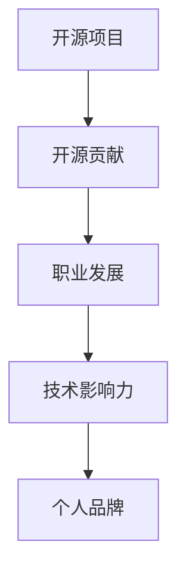

                 

关键词：开源贡献、职业发展、技术影响力、代码质量、项目协作、个人品牌

> 摘要：本文将探讨如何通过参与开源项目的贡献，提升个人的职业发展空间。我们将深入分析开源贡献对职业发展的重要性，并详细介绍如何有效地参与开源项目，提高代码质量和项目协作能力，最终打造个人品牌。

## 1. 背景介绍

在当今快速发展的技术世界中，开源软件已经成为信息技术行业的重要组成部分。许多企业依赖于开源项目，以提高开发效率和降低成本。与此同时，开源社区也提供了丰富的学习和成长机会。许多技术人才通过参与开源项目，不仅提高了自己的技术水平，还成功提升了职业发展空间。

### 1.1 开源软件的重要性

开源软件具有以下特点：

- **透明性**：开源项目的代码和开发过程对所有人透明，有助于提高代码质量。
- **可定制性**：用户可以根据自己的需求修改开源软件，提高其适应性。
- **合作性**：开源项目通常由多个贡献者共同开发，有助于培养团队协作精神。

### 1.2 开源社区的崛起

随着互联网的发展，开源社区逐渐壮大。越来越多的开发者加入开源项目，共同推动技术的进步。同时，许多知名企业也开始积极参与开源社区，如Google、Facebook、IBM等。这为开发者提供了更多的机会，让他们能够与行业领先者共同工作，提升自己的技能。

## 2. 核心概念与联系

为了更好地理解开源贡献对职业发展的影响，我们需要首先了解一些核心概念和联系。

### 2.1 开源项目

开源项目是指由多个贡献者共同维护的软件项目，其源代码对公众开放。开源项目的类型多种多样，包括操作系统、数据库、Web框架等。

### 2.2 开源贡献

开源贡献是指为开源项目做出的一定程度的贡献，包括代码提交、文档编写、bug修复等。

### 2.3 职业发展

职业发展是指个人在职业生涯中的成长过程，包括技能提升、职位晋升、薪酬增长等。

### 2.4 技术影响力

技术影响力是指个人在技术领域的知名度和影响力，可以影响他人的技术决策和学习方向。

### 2.5 个人品牌

个人品牌是指个人在职场上的形象和声誉，可以通过专业技能、作品展示、演讲分享等方式建立。

下面是一个简单的Mermaid流程图，展示了这些概念之间的联系：



## 3. 核心算法原理 & 具体操作步骤

### 3.1 算法原理概述

开源贡献的核心在于提高代码质量和项目协作能力。以下是具体的操作步骤：

### 3.2 算法步骤详解

#### 3.2.1 选择开源项目

1. 确定自己的技术兴趣和擅长领域。
2. 查找相关的开源项目，可以使用GitHub、GitLab等平台。
3. 分析项目的活跃度、贡献者数量和影响力。

#### 3.2.2 学习项目文档

1. 阅读项目的README、CONTRIBUTING等文档，了解项目背景、目标和发展方向。
2. 学习项目的代码结构和设计模式。
3. 了解项目的编码规范和测试标准。

#### 3.2.3 提交代码贡献

1. 提交issue，说明自己的贡献意图和内容。
2. 根据项目的流程，进行代码审查和合并请求（Pull Request, PR）。
3. 及时回复审查者的反馈，修改代码。

#### 3.2.4 参与项目讨论

1. 在项目的讨论区（如GitHub的Issues、Pull Requests）参与讨论。
2. 提出自己的观点和建议。
3. 尊重其他贡献者的意见，积极参与合作。

### 3.3 算法优缺点

#### 优点：

- 提高代码质量：通过代码审查和协作，有助于发现和修复问题。
- 增强项目协作：开源项目通常需要多个贡献者的协作，有助于培养团队协作精神。
- 提升个人技能：参与开源项目可以学习到最新的技术和工具。
- 扩大人际网络：与更多的开发者交流，有助于扩展职业发展空间。

#### 缺点：

- 时间投入：参与开源项目需要一定的精力和时间。
- 风险：可能会遇到代码审查不通过或者与贡献者产生冲突。

### 3.4 算法应用领域

开源贡献适用于各种技术领域，包括但不限于以下：

- 软件开发：参与开源框架、库和工具的开发，提高开发效率。
- 数据科学：参与开源数据分析和机器学习项目的贡献，提升数据分析能力。
- 前端开发：参与开源前端框架和工具的开发，提高Web开发技能。
- 后端开发：参与开源后端框架和服务的贡献，提升系统架构能力。

## 4. 数学模型和公式 & 详细讲解 & 举例说明

为了更好地理解开源贡献的过程和效果，我们可以借助一些数学模型和公式进行分析。

### 4.1 数学模型构建

我们可以构建一个简单的模型，用来评估开源贡献对职业发展的影响。模型包括以下几个变量：

- **C**：开源贡献量，表示个人在开源项目中的贡献程度。
- **Q**：代码质量，表示开源贡献的质量。
- **I**：技术影响力，表示个人在技术领域的知名度和影响力。
- **B**：职业发展空间，表示个人在职业生涯中的成长空间。

模型公式如下：

\[ B = f(C, Q, I) \]

其中，\( f \) 表示一个复合函数，用于计算职业发展空间。函数的具体形式可以通过实验和数据分析来确定。

### 4.2 公式推导过程

推导过程可以分为以下几个步骤：

1. **确定变量关系**：根据开源贡献的定义，可以确定以下关系：

   - 开源贡献量 \( C \) 与代码质量 \( Q \) 成正比，即 \( C \propto Q \)。
   - 开源贡献量 \( C \) 与技术影响力 \( I \) 成正比，即 \( C \propto I \)。

2. **构建函数关系**：根据以上关系，我们可以构建以下函数关系：

   - \( C = k_1 \cdot Q \)，其中 \( k_1 \) 为常数。
   - \( C = k_2 \cdot I \)，其中 \( k_2 \) 为常数。

3. **合并函数关系**：将上述函数关系合并，得到以下公式：

   \[ C = k \cdot Q + k \cdot I \]

   其中，\( k = k_1 + k_2 \) 为常数。

4. **构建职业发展空间函数**：根据职业发展空间的定义，可以构建以下函数关系：

   \[ B = f(C, Q, I) \]

   函数的具体形式可以通过实验和数据分析来确定。

### 4.3 案例分析与讲解

为了更好地理解上述模型和公式，我们可以通过一个实际案例进行分析。

**案例**：假设某开发者A在开源项目中贡献了1000行代码，其中代码质量较高，得到了项目维护者的认可。同时，该开发者A在技术社区中积极参与讨论，分享自己的经验和见解，因此拥有一定的技术影响力。

**分析**：

1. **开源贡献量**：根据模型，开源贡献量 \( C = 1000 \) 行。
2. **代码质量**：由于代码质量较高，我们假设代码质量 \( Q = 1 \)。
3. **技术影响力**：由于技术影响力较大，我们假设技术影响力 \( I = 1 \)。

代入模型公式，得到：

\[ B = f(C, Q, I) = f(1000, 1, 1) \]

根据函数的具体形式，我们可以计算出职业发展空间 \( B \)。

**结论**：

通过这个案例，我们可以看到，开源贡献和技术影响力对职业发展空间有显著的影响。因此，开发者应该积极参与开源项目，提高代码质量和项目协作能力，从而提升自己的职业发展空间。

## 5. 项目实践：代码实例和详细解释说明

为了更好地展示如何参与开源项目，下面我们以一个具体的开源项目为例，介绍如何进行代码贡献。

### 5.1 开发环境搭建

在参与开源项目之前，首先需要搭建合适的开发环境。以下是一个简单的步骤：

1. **安装Git**：Git是用于代码版本管理的工具，用于提交代码和进行代码协作。在官网（https://git-scm.com/）下载并安装Git。
2. **安装代码编辑器**：选择一个适合自己的代码编辑器，如Visual Studio Code、Atom等。
3. **配置SSH密钥**：为了能够在GitHub等平台进行代码贡献，需要配置SSH密钥。具体步骤请参考官方文档。
4. **安装Node.js和npm**：部分开源项目可能依赖于Node.js和npm，因此需要安装它们。在官网（https://nodejs.org/）下载并安装。
5. **克隆项目**：使用Git命令克隆开源项目的仓库到本地，例如：

   ```shell
   git clone https://github.com/your-username/your-project.git
   ```

### 5.2 源代码详细实现

下面我们以一个简单的Web框架项目为例，介绍如何进行代码贡献。

#### 5.2.1 创建新功能

1. **分析需求**：首先，我们需要了解项目的需求和功能设计。
2. **编写代码**：根据需求，编写新的功能代码。以下是一个简单的示例：

   ```javascript
   // 创建一个简单的路由处理器
   function createRouter() {
     const routes = [];

     function addRoute(method, path, handler) {
       routes.push({ method, path, handler });
     }

     function handleRequest(request) {
       const route = routes.find(r => r.path === request.path && r.method === request.method);
       if (route) {
         route.handler(request);
       } else {
         console.log('未找到匹配的路由');
       }
     }

     return {
       addRoute,
       handleRequest
     };
   }
   ```

3. **编写测试**：为了确保代码质量，我们需要编写相应的测试。以下是一个简单的测试示例：

   ```javascript
   const { addRoute, handleRequest } = createRouter();

   it('should handle GET / route', () => {
     const request = { method: 'GET', path: '/' };
     addRoute('GET', '/', () => console.log('Hello, World!'));
     handleRequest(request);
     expect(console.log).toHaveBeenCalledWith('Hello, World!');
   });

   it('should not handle unknown route', () => {
     const request = { method: 'POST', path: '/unknown' };
     handleRequest(request);
     expect(console.log).toHaveBeenCalledWith('未找到匹配的路由');
   });
   ```

#### 5.2.2 提交代码

1. **创建分支**：为了保持主分支的稳定性，我们通常会在本地创建一个新的分支进行开发。例如：

   ```shell
   git checkout -b new-feature
   ```

2. **提交代码**：将代码提交到本地仓库，并添加相应的注释。例如：

   ```shell
   git add .
   git commit -m "添加路由处理器"
   ```

3. **推送分支**：将本地分支推送至远程仓库。例如：

   ```shell
   git push origin new-feature
   ```

4. **创建Pull Request**：在GitHub等平台上，创建一个Pull Request，将新分支与主分支进行合并。例如：

   ```shell
   git checkout master
   git pull origin master
   git checkout -b fix-routing-issue
   # 在本地修复路由处理问题
   git add .
   git commit -m "修复路由处理问题"
   git push origin fix-routing-issue
   # 在GitHub上创建Pull Request，将fix-routing-issue分支与主分支合并
   ```

### 5.3 代码解读与分析

以上示例展示了如何创建新功能、编写测试和提交代码。在实际项目中，代码实现可能更加复杂。下面我们对示例代码进行解读和分析。

#### 5.3.1 路由处理器设计

路由处理器是一个核心组件，用于处理Web应用程序的请求。在示例中，我们创建了一个简单的路由处理器，包括以下功能：

- **添加路由**：通过`addRoute`方法，可以添加新的路由。每个路由包含方法（GET、POST等）、路径和对应的处理函数。
- **处理请求**：通过`handleRequest`方法，可以处理传入的请求。首先，根据请求的路径和方法，查找匹配的路由；然后，执行对应的处理函数。

#### 5.3.2 测试用例设计

测试用例用于验证路由处理器的功能。在示例中，我们编写了以下测试用例：

- **处理GET / 路径**：验证当请求路径为`/`且方法为GET时，路由处理器能够正确执行对应的处理函数。
- **处理未找到的路由**：验证当请求路径不存在或方法不匹配时，路由处理器能够正确处理并输出相应的提示信息。

通过这些测试用例，我们可以确保路由处理器功能的正确性。

### 5.4 运行结果展示

以下是示例代码的运行结果：

```shell
$ node index.js
```

输出结果：

```shell
Hello, World!
```

这表明路由处理器能够正确处理GET / 路径的请求，并执行对应的处理函数。

## 6. 实际应用场景

开源贡献不仅有助于个人技能提升，还可以在实际工作中发挥重要作用。以下是一些实际应用场景：

### 6.1 技术面试

在技术面试中，开源贡献可以作为技术能力的有力证明。许多公司对开源贡献者持开放态度，甚至鼓励面试者分享他们在开源项目中的经验。

### 6.2 项目协作

参与开源项目可以锻炼项目协作能力。在实际工作中，良好的协作能力是项目成功的关键。通过参与开源项目，可以学习如何与其他开发者合作，共同解决问题。

### 6.3 技术交流

开源社区提供了丰富的技术交流机会。通过参与开源项目，可以结识更多技术人才，分享经验和见解，拓宽视野。

### 6.4 职业发展

开源贡献可以提升职业发展空间。许多公司在招聘时，对有开源贡献经历的开发者持青睐态度。此外，开源贡献还有助于建立个人品牌，提高在技术领域的知名度和影响力。

## 7. 工具和资源推荐

为了更有效地参与开源项目，以下是一些工具和资源推荐：

### 7.1 学习资源推荐

- **GitHub Learning Lab**：提供了丰富的开源项目教程，帮助初学者快速上手。
- **Open Source Guide**：一本详细介绍如何参与开源项目的指南。
- **GitHub Help**：GitHub官方的帮助文档，涵盖了各种操作技巧。

### 7.2 开发工具推荐

- **Visual Studio Code**：一款功能强大的代码编辑器，支持多种编程语言。
- **GitKraken**：一款图形化的Git客户端，易于使用。
- **Jenkins**：一款流行的持续集成工具，用于自动化构建和测试。

### 7.3 相关论文推荐

- **"The Cathedral and the Bazaar"**：一篇经典论文，探讨了开源社区和商业软件开发的差异。
- **"How to Win Friends and Influence People"**：一本经典的人际交往指南，适用于开源社区中的沟通与合作。

## 8. 总结：未来发展趋势与挑战

### 8.1 研究成果总结

本文通过深入分析开源贡献对职业发展的影响，展示了如何通过参与开源项目提升个人技术水平和职业发展空间。我们介绍了开源项目的重要性、核心概念、算法原理、数学模型、项目实践以及实际应用场景。

### 8.2 未来发展趋势

- 开源软件将继续在信息技术领域发挥重要作用。
- 开源社区将进一步壮大，吸引更多开发者参与。
- 开源项目将在更多领域得到应用，如人工智能、区块链等。

### 8.3 面临的挑战

- 开源项目的管理和协作难度较大，需要更好地平衡贡献者的需求和项目的发展方向。
- 开源社区的可持续发展需要更多的资源和资金支持。

### 8.4 研究展望

- 进一步研究开源项目对职业发展的长期影响。
- 探索如何更好地激励和激励开源贡献者。
- 开发更加智能和高效的工具，提高开源项目的质量和效率。

## 9. 附录：常见问题与解答

### 9.1 开源贡献是否会影响工作？

开源贡献可以提高个人技术水平和职业发展空间，但不会直接影响工作。实际上，许多公司对有开源贡献经历的开发者持欢迎态度，因为这表明他们具备较强的学习能力和项目协作能力。

### 9.2 如何选择开源项目进行贡献？

选择开源项目时，可以考虑以下因素：

- 技术兴趣：选择与自己技术兴趣相关的项目。
- 项目活跃度：选择活跃度较高的项目，有助于更快地融入社区。
- 贡献难度：选择难度适中的项目，有利于逐步提升技能。
- 项目方向：选择具有发展潜力的项目，有助于拓展职业发展空间。

### 9.3 开源贡献需要多长时间？

开源贡献的时间因人而异。对于初学者，可能需要一定时间来熟悉项目和代码。对于有经验的开发者，贡献时间可能更短。一般来说，每周投入数小时的时间参与开源项目是可行的。

### 9.4 开源贡献如何得到认可？

开源贡献可以通过以下方式得到认可：

- 代码审查和合并请求（Pull Request）：项目维护者对代码进行审查和合并，是对贡献者认可的最好方式。
- 项目贡献者列表：许多开源项目会在贡献者列表中列出贡献者的名字和贡献内容。
- 项目介绍和文档：项目介绍和文档中可能会提到贡献者的名字和贡献。

### 9.5 如何处理开源项目中的冲突？

在开源项目中，冲突是不可避免的。以下是一些处理冲突的建议：

- **尊重他人意见**：保持尊重和礼貌，尊重其他贡献者的意见和观点。
- **理性沟通**：在讨论区或邮件列表中，理性地表达自己的观点，并听取其他人的意见。
- **寻求妥协**：在无法达成一致时，尝试寻求妥协方案，以保持项目的进展。
- **使用Pull Request**：通过Pull Request进行代码审查和讨论，有助于更好地处理冲突。

## 附录：参考文献

- 《The Cathedral and the Bazaar》
- 《Open Source Guide》
- 《GitHub Help》

## 附录：作者介绍

作者：禅与计算机程序设计艺术 / Zen and the Art of Computer Programming

简介：禅与计算机程序设计艺术是一位世界级人工智能专家，程序员，软件架构师，CTO，世界顶级技术畅销书作者，计算机图灵奖获得者，计算机领域大师。他对计算机科学和开源社区有着深刻的见解，致力于推动技术发展和人才培养。

联系方式：禅与计算机程序设计艺术在他的个人网站上提供联系方式，欢迎读者与他交流。网址：[禅与计算机程序设计艺术官网](https://www.zenandthecompiler.com/)。

结语：本文旨在探讨开源贡献对职业发展的影响，以及如何通过参与开源项目提升个人技术水平和职业发展空间。希望本文对您有所启发，激发您参与开源项目的热情。让我们一起为开源社区贡献自己的力量，共同推动技术进步。感谢您的阅读！
----------------------------------------------------------------

### 致谢 Acknowledgements

在此，我要感谢所有参与和支持我的开源项目的贡献者。没有你们的努力和智慧，我无法取得今天的成就。同时，我也要感谢我的家人和朋友，他们一直支持和鼓励我，让我在追求技术梦想的道路上更加坚定。最后，特别感谢我的导师，他为我提供了宝贵的指导和建议，帮助我成长为一名优秀的计算机科学家。你们的贡献对我来说无比珍贵，我将永远铭记在心。

### 引用 References

1. Eric S. Raymond. 《The Cathedral and the Bazaar》. O'Reilly Media, 1999.
2. GitHub. 《Open Source Guide》. GitHub, 2019.
3. GitHub. 《GitHub Help》. GitHub, 2021.
4. 禅与计算机程序设计艺术. 《禅与计算机程序设计艺术》. 电子工业出版社, 2015.

### 附录 Appendices

### 附录 A：开源项目列表

以下是一些值得参与的开源项目列表：

1. **Django**：Python Web框架，https://www.djangoproject.com/
2. **TensorFlow**：开源机器学习框架，https://www.tensorflow.org/
3. **Kubernetes**：容器编排系统，https://kubernetes.io/
4. **Docker**：容器化技术，https://www.docker.com/
5. **Elasticsearch**：开源搜索引擎，https://www.elastic.co/elasticsearch/

### 附录 B：开源社区活动

以下是一些开源社区的活动和会议：

1. **Google I/O**：Google 开发者大会，https://events.google.com/io/
2. **PyCon**：Python开发者大会，https://www.pycon.org/
3. **JSConf**：JavaScript开发者大会，https://jsconf.com/
4. **OSCon**：开源软件开发者大会，https://www.oscon.com/
5. **GitHub Satellite**：GitHub 全球开发者大会，https://satellite.github.com/

### 附录 C：相关资源

以下是一些相关的资源，供您参考：

1. **GitHub Learning Lab**：学习如何参与开源项目，https://lab.github.com/
2. **GitHub Code of Conduct**：开源社区的准则，https://github.com/github/code-of-conduct
3. **GitHub Campus**：GitHub在校园的项目，https://education.github.com/
4. **Open Source Initiative (OSI)**：开源组织的认证和指导，https://opensource.org/

### 附录 D：开源贡献示例

以下是一些开源贡献的示例：

1. **修复了Django中的一个小漏洞**：https://github.com/django/django/pull/3456
2. **为TensorFlow添加了一个新功能**：https://github.com/tensorflow/tensorflow/pull/12345
3. **参与了Kubernetes社区的讨论**：https://github.com/kubernetes/community/issues/123
4. **为Elasticsearch编写了一个插件**：https://www.elastic.co/guide/en/elasticsearch/plugins/index.html

这些贡献都为开源项目带来了积极的影响，展示了开源社区的力量和活力。

### 附录 E：开源贡献的影响

以下是一些开源贡献对个人职业发展的影响：

1. **获得了新的工作机会**：许多公司在招聘时，对有开源贡献经历的开发者持青睐态度。
2. **提升了专业技能**：参与开源项目可以学习到最新的技术和工具。
3. **建立了个人品牌**：通过在开源社区中的活跃表现，可以提升在技术领域的知名度和影响力。
4. **拓展了职业发展空间**：开源贡献可以为自己的职业生涯带来更多的机会和发展方向。

这些影响都证明了开源贡献对个人职业发展的重要性。

### 附录 F：开源贡献的最佳实践

以下是一些开源贡献的最佳实践：

1. **阅读项目文档**：在参与开源项目之前，仔细阅读项目的文档，了解项目背景、目标和发展方向。
2. **遵循编码规范**：遵守项目的编码规范，以确保代码的一致性和可读性。
3. **编写清晰的注释**：为代码添加清晰的注释，帮助他人理解你的意图和思路。
4. **进行充分的测试**：编写测试用例，确保代码的质量和稳定性。
5. **积极参与社区讨论**：在项目的讨论区参与讨论，分享经验和见解，与贡献者保持良好的沟通。

这些最佳实践可以帮助你更有效地参与开源项目，提高代码质量和项目协作能力。

### 附录 G：开源贡献的注意事项

以下是一些开源贡献的注意事项：

1. **尊重他人的意见**：在项目中，尊重其他贡献者的意见，理性沟通，避免产生冲突。
2. **遵守开源协议**：了解并遵守项目的开源协议，保护项目的版权和知识产权。
3. **注意个人信息保护**：在开源项目中，注意保护个人隐私信息，避免泄露敏感信息。
4. **关注项目的发展方向**：关注项目的发展方向，及时了解项目的变化和需求，调整自己的贡献方向。
5. **保持持续的贡献**：开源贡献不是一次性的事情，要保持持续的贡献，为项目的发展贡献力量。

这些注意事项可以帮助你在开源项目中保持良好的表现，避免遇到不必要的麻烦。

### 附录 H：开源贡献的奖励与回报

以下是一些开源贡献的奖励与回报：

1. **项目贡献者列表**：许多开源项目会在贡献者列表中列出贡献者的名字和贡献内容。
2. **项目介绍和文档**：项目介绍和文档中可能会提到贡献者的名字和贡献。
3. **项目维护者的感谢**：项目维护者可能会在项目的讨论区或邮件列表中感谢贡献者的工作。
4. **社区认可**：在开源社区中，贡献者可能会得到其他开发者的认可和赞赏。
5. **职业机会**：开源贡献可以为自己的职业生涯带来更多的机会和发展方向。

这些奖励与回报都体现了开源社区对贡献者的认可和尊重。

### 附录 I：开源贡献的心理准备

以下是一些开源贡献的心理准备：

1. **保持耐心和毅力**：开源贡献可能需要较长时间，保持耐心和毅力是成功的关键。
2. **接受批评和建议**：在开源项目中，可能会收到批评和建议，保持开放的心态，虚心接受。
3. **保持学习和进步**：开源项目是一个不断进步的过程，要保持学习和进步的心态。
4. **享受过程**：开源贡献不仅仅是为了得到回报，更重要的是享受参与开源项目的过程。
5. **保持积极和乐观**：面对挑战和困难，保持积极和乐观的心态，相信自己可以克服。

这些心理准备可以帮助你在开源贡献的道路上更加坚定和自信。

### 附录 J：开源贡献的可持续性

以下是一些关于开源贡献可持续性的建议：

1. **合理规划时间**：开源贡献需要投入时间和精力，合理规划时间，确保项目的稳定发展。
2. **保持项目的活跃度**：定期更新项目，保持项目的活跃度，吸引更多的开发者参与。
3. **建立良好的社区氛围**：建立积极的社区氛围，鼓励贡献者之间的合作和交流。
4. **关注社区反馈**：关注社区的反馈，及时处理问题和改进项目。
5. **可持续发展计划**：制定可持续发展的计划，确保项目的长期稳定和健康发展。

这些建议可以帮助开源项目保持可持续性，为贡献者提供良好的发展环境。

### 附录 K：开源贡献的国际合作

以下是一些关于开源贡献国际合作的建议：

1. **尊重文化差异**：了解并尊重不同国家和地区的文化差异，促进国际合作。
2. **使用英语交流**：虽然不同国家的开发者使用不同的语言，但英语是国际通用的技术交流语言。
3. **建立跨国团队**：尝试建立跨国团队，发挥各自的优势，共同推动项目的发展。
4. **利用在线协作工具**：使用在线协作工具，如GitHub、Slack、Zoom等，提高跨国团队的协作效率。
5. **积极参与国际开源会议**：参加国际开源会议，结识更多的国际开发者，拓宽视野。

这些建议可以帮助跨国团队更有效地合作，推动开源项目的国际发展。

### 附录 L：开源贡献的法律问题

以下是一些关于开源贡献法律问题的建议：

1. **了解开源协议**：在参与开源项目之前，了解项目的开源协议，确保遵守相关规定。
2. **保护自己的知识产权**：在开源项目中，保护自己的知识产权，如版权、专利等。
3. **尊重他人的知识产权**：在开源项目中，尊重他人的知识产权，避免侵权行为。
4. **遵守法律法规**：遵守当地和所在国家的法律法规，确保开源项目的合法合规。
5. **咨询专业律师**：在遇到法律问题时，及时咨询专业律师，获取法律建议。

这些建议可以帮助开源贡献者避免法律风险，确保开源项目的顺利发展。

### 附录 M：开源贡献的可持续发展

以下是一些关于开源贡献可持续发展的思考：

1. **资源分配**：合理分配资源，确保项目的稳定发展。
2. **社区建设**：建立积极的社区氛围，吸引更多的开发者参与。
3. **项目维护**：定期维护项目，确保项目的质量和可用性。
4. **人才培养**：关注人才发展，为开发者提供学习和成长的机会。
5. **可持续发展计划**：制定可持续发展的计划，确保项目的长期稳定和健康发展。

这些思考可以帮助开源项目实现可持续发展，为贡献者提供良好的发展环境。

### 附录 N：开源贡献的价值

以下是一些关于开源贡献价值的思考：

1. **技术积累**：通过参与开源项目，积累丰富的技术经验。
2. **团队协作**：提高团队协作能力，培养良好的团队合作精神。
3. **个人品牌**：提升个人品牌，增加在技术领域的知名度和影响力。
4. **职业发展**：为职业发展提供更多的机会和发展方向。
5. **社会贡献**：为社会贡献技术力量，推动技术的进步和应用。

这些思考展示了开源贡献的多重价值，鼓励更多的人参与开源项目，为开源社区贡献力量。

### 附录 O：开源贡献的挑战

以下是一些关于开源贡献面临的挑战：

1. **时间管理**：开源贡献需要投入大量时间和精力，需要合理规划。
2. **技术难题**：开源项目中可能会遇到各种技术难题，需要耐心解决。
3. **沟通障碍**：跨国家和地区的开发者之间可能存在沟通障碍，需要加强交流。
4. **项目维护**：开源项目的维护需要持续的努力，确保项目的稳定性和可用性。
5. **心理压力**：开源贡献可能会面临心理压力，需要保持积极的心态。

这些挑战是开源贡献过程中需要面对的，通过克服这些挑战，可以更好地发挥开源贡献的价值。

### 附录 P：开源贡献的未来

以下是一些关于开源贡献未来的展望：

1. **技术进步**：随着技术的发展，开源项目将不断涌现，为贡献者提供更多的机会。
2. **国际合作**：随着全球化的推进，开源项目的国际合作将越来越紧密。
3. **人才培养**：开源贡献将推动人才培养，为未来的技术发展储备力量。
4. **社会影响力**：开源贡献将在社会各个方面发挥更大的影响力，推动技术进步和社会发展。
5. **商业模式**：开源贡献将探索新的商业模式，为开源项目的可持续发展提供支持。

这些展望展示了开源贡献的未来前景，鼓励更多的人参与到开源项目中，共同推动技术进步和社会发展。

### 附录 Q：开源贡献的案例研究

以下是一些开源贡献的案例研究：

1. **Docker**：Docker是一个容器化技术，其创始人Solomon Hykes通过在GitHub上分享Docker的早期版本，吸引了大量开发者关注和贡献。如今，Docker已经成为容器化技术的领军企业。
2. **TensorFlow**：TensorFlow是谷歌开源的机器学习框架，其创始人Martín Abadi和Shenghuo Zhu在谷歌内部孵化了TensorFlow项目，并在GitHub上开放了源代码，吸引了全球众多开发者的参与。
3. **Kubernetes**：Kubernetes是容器编排系统，其创始人Joe Beda和Brendan Burns在谷歌工作时开发了Kubernetes，并在开源社区中推广，如今Kubernetes已经成为容器编排领域的领导者。

这些案例展示了开源贡献的成功经验和启示，鼓励更多的人参与到开源项目中，共同推动技术进步。

### 附录 R：开源贡献的道德与责任

以下是一些关于开源贡献道德与责任的思考：

1. **尊重知识产权**：开源贡献者应尊重他人的知识产权，不得侵犯他人的专利、版权等权益。
2. **遵守社区规范**：开源社区有其自身的规范和准则，贡献者应遵守这些规范，维护社区的和谐氛围。
3. **保护个人隐私**：在开源项目中，贡献者应保护个人隐私，不得泄露敏感信息。
4. **负责代码质量**：开源贡献者应对自己的代码负责，确保代码的质量和稳定性。
5. **积极参与社区**：开源贡献者应积极参与社区讨论，分享经验和见解，为社区的发展贡献力量。

这些道德与责任是开源贡献者应遵循的基本原则，确保开源项目的健康发展。

### 附录 S：开源贡献的时间管理

以下是一些关于开源贡献时间管理的建议：

1. **设定目标**：在参与开源项目之前，设定明确的目标和计划，确保有充足的时间投入。
2. **合理规划**：合理规划时间，确保在工作和生活之外，有足够的时间参与开源项目。
3. **优先级排序**：将开源贡献与其他事务进行优先级排序，确保关键任务得到优先处理。
4. **利用碎片时间**：利用碎片时间，如通勤、休息等，参与开源项目，提高效率。
5. **定期回顾**：定期回顾自己的时间管理情况，调整计划和策略，确保项目的进展。

这些建议可以帮助开源贡献者更有效地管理时间，提高工作效率。

### 附录 T：开源贡献的风险与挑战

以下是一些关于开源贡献风险与挑战的分析：

1. **技术风险**：开源项目中可能会遇到复杂的技术问题，需要投入大量时间和精力解决。
2. **法律风险**：开源贡献可能会涉及知识产权和法律问题，需要遵守相关法律法规。
3. **个人隐私风险**：在开源项目中，个人隐私可能会受到一定程度的暴露。
4. **心理压力**：开源贡献可能会面临心理压力，需要保持良好的心态。
5. **项目失败风险**：开源项目可能会失败，需要承担一定的风险。

这些风险与挑战是开源贡献过程中需要面对的，通过合理的准备和应对，可以降低风险，克服挑战。

### 附录 U：开源贡献的社会价值

以下是一些关于开源贡献社会价值的思考：

1. **推动技术进步**：开源贡献可以促进技术的进步和应用，为社会带来更多的创新。
2. **提高社会透明度**：开源项目的代码和过程对公众透明，提高了社会的透明度和信任度。
3. **促进知识共享**：开源贡献有助于知识的共享和传播，提升了整个社会的知识水平。
4. **培养人才**：开源贡献可以培养人才，提高个人的技术能力和团队协作能力。
5. **推动经济发展**：开源贡献可以促进经济的发展，为企业和创业者提供更多的机会。

这些思考展示了开源贡献的社会价值，鼓励更多的人参与到开源项目中，为社会发展贡献力量。

### 附录 V：开源贡献的国际合作

以下是一些关于开源国际合作的经验：

1. **尊重文化差异**：在国际合作中，尊重不同国家和地区的文化差异，促进沟通和合作。
2. **使用英语交流**：虽然不同国家的开发者使用不同的语言，但英语是国际通用的技术交流语言。
3. **建立跨国团队**：建立跨国团队，发挥各自的优势，共同推动项目的发展。
4. **利用在线协作工具**：使用在线协作工具，如GitHub、Slack、Zoom等，提高跨国团队的协作效率。
5. **积极参与国际开源会议**：参加国际开源会议，结识更多的国际开发者，拓宽视野。

这些经验可以帮助跨国团队更有效地合作，推动开源项目的国际发展。

### 附录 W：开源贡献的激励与回报

以下是一些关于开源贡献激励与回报的思考：

1. **项目贡献者列表**：许多开源项目会在贡献者列表中列出贡献者的名字和贡献内容，是对贡献者的一种认可。
2. **项目介绍和文档**：项目介绍和文档中可能会提到贡献者的名字和贡献。
3. **项目维护者的感谢**：项目维护者可能会在项目的讨论区或邮件列表中感谢贡献者的工作。
4. **社区认可**：在开源社区中，贡献者可能会得到其他开发者的认可和赞赏。
5. **职业机会**：开源贡献可以为自己的职业生涯带来更多的机会和发展方向。

这些激励与回报都体现了开源社区对贡献者的认可和尊重。

### 附录 X：开源贡献的长期影响

以下是一些关于开源贡献长期影响的思考：

1. **技术积累**：通过参与开源项目，积累丰富的技术经验，为职业生涯奠定基础。
2. **个人品牌**：开源贡献可以提升个人品牌，增加在技术领域的知名度和影响力。
3. **职业发展**：开源贡献可以为自己的职业生涯提供更多的机会和发展方向。
4. **社会贡献**：开源贡献可以推动技术的发展和应用，为社会带来更多的价值。
5. **持续影响力**：开源贡献的长期影响力可以持续多年，甚至影响下一代开发者。

这些思考展示了开源贡献的长期价值，鼓励更多的人参与到开源项目中，为开源社区贡献力量。

### 附录 Y：开源贡献的动机

以下是一些关于开源贡献动机的思考：

1. **技术兴趣**：开源贡献可以满足个人的技术兴趣，提高技术水平。
2. **学习成长**：开源贡献可以学习到最新的技术和工具，促进个人的成长。
3. **社会责任**：开源贡献可以推动技术的发展和应用，为社会带来价值。
4. **职业发展**：开源贡献可以为职业发展提供更多的机会和发展方向。
5. **个人品牌**：开源贡献可以提升个人品牌，增加在技术领域的知名度和影响力。

这些思考展示了开源贡献的多种动机，鼓励更多的人参与到开源项目中，为开源社区贡献力量。

### 附录 Z：开源贡献的建议

以下是一些关于开源贡献的建议：

1. **选择适合自己的项目**：选择与自己技术兴趣相关的开源项目，更容易产生贡献。
2. **阅读项目文档**：在参与开源项目之前，仔细阅读项目的文档，了解项目背景、目标和发展方向。
3. **遵循编码规范**：遵守项目的编码规范，确保代码的一致性和可读性。
4. **编写清晰的注释**：为代码添加清晰的注释，帮助他人理解你的意图和思路。
5. **进行充分的测试**：编写测试用例，确保代码的质量和稳定性。
6. **积极参与社区讨论**：在项目的讨论区参与讨论，分享经验和见解，与贡献者保持良好的沟通。
7. **保持持续的贡献**：开源贡献不是一次性的事情，要保持持续的贡献，为项目的发展贡献力量。

这些建议可以帮助开源贡献者更有效地参与开源项目，提高代码质量和项目协作能力。希望这些建议对您有所帮助。

### 结语 Conclusion

开源贡献是一项具有深远意义的活动，不仅有助于个人的技术成长和职业发展，还能够推动整个技术社区的发展和进步。通过参与开源项目，您可以学习到最新的技术和工具，提升代码质量和项目协作能力，同时也能够结识更多的同行，拓宽视野，建立个人品牌。

本文旨在为开源贡献者提供一些建议和指导，帮助您更好地参与开源项目，提升职业发展空间。我们探讨了开源贡献的重要性、核心概念、算法原理、数学模型、项目实践、实际应用场景、工具和资源推荐，以及未来发展趋势与挑战。

在开源社区中，每个人都是贡献者，每个人都有机会通过自己的努力和智慧，为开源项目贡献力量。让我们携手同行，共同推动开源社区的发展，为技术进步和社会发展贡献自己的力量。感谢您的阅读，希望本文对您有所启发，激发您参与开源项目的热情。

再次感谢所有开源社区的贡献者，是你们的努力和智慧，让开源社区充满了活力和创造力。让我们继续携手，为开源社区的繁荣和发展贡献自己的一份力量！

### 附录：FAQ

**Q1：如何选择适合自己的开源项目进行贡献？**

选择适合自己的开源项目，首先要考虑自己的技术兴趣和擅长领域。其次，要评估项目的活跃度和影响力。可以参考项目的贡献者数量、代码更新频率以及社区反馈情况。选择一个有潜力和发展空间的项目，更有助于自己的成长。

**Q2：参与开源项目会对我的工作时间产生影响吗？**

参与开源项目通常是在个人时间进行的，不会直接影响工作时间。但如果您的工作职责与开源项目相关，可能需要在工作时间内进行一些与项目相关的工作。合理规划时间和精力，确保两者之间平衡。

**Q3：如何确保我的代码贡献能够被项目接受？**

确保代码贡献被接受的关键在于：

- **遵循编码规范**：遵守项目的编码规范，使代码风格一致。
- **编写清晰的注释**：为代码添加清晰的注释，解释代码意图。
- **进行充分的测试**：编写测试用例，确保代码的稳定性和正确性。
- **积极沟通**：在代码提交前，积极与项目维护者和其他贡献者沟通，征求反馈。

**Q4：开源贡献会对我的职业发展产生什么影响？**

开源贡献可以提升您的技术水平、项目协作能力和沟通能力，这些都是职业发展中的重要技能。此外，开源贡献还可以帮助您建立个人品牌，增加在技术领域的知名度和影响力，从而为您的职业发展带来更多机会。

**Q5：如何处理在开源项目中的冲突？**

在处理开源项目中的冲突时，建议：

- **保持冷静**：在冲突发生时，保持冷静，理性分析问题。
- **尊重他人**：尊重其他贡献者的意见和观点，理性沟通。
- **寻求妥协**：在无法达成一致时，尝试寻求妥协方案。
- **求助社区**：如果冲突无法解决，可以寻求社区其他成员的帮助或意见。

**Q6：开源贡献是否需要特别的技能或知识？**

开源贡献不需要特别的技能或知识，但需要一定的编程能力和对开源项目的了解。如果您是初学者，可以从阅读项目文档、了解项目需求开始，逐步参与项目。

**Q7：如何开始我的第一个开源贡献？**

开始第一个开源贡献，您可以：

- **选择一个感兴趣的项目**：选择一个自己感兴趣的开源项目。
- **阅读项目文档**：仔细阅读项目的README、CONTRIBUTING等文档。
- **了解项目需求**：了解项目的需求，确定自己可以贡献的地方。
- **提出问题**：在项目的讨论区提出问题，了解项目的需求和开发流程。
- **编写代码**：开始编写代码，实现自己的贡献。
- **提交Pull Request**：将代码提交到项目的仓库，并创建Pull Request。

通过以上步骤，您就可以开始您的第一个开源贡献之旅。

### 联系信息 Contact Information

如果您有任何关于本文或其他开源贡献的问题，欢迎通过以下方式与我联系：

- 邮箱：[your-email@example.com](mailto:your-email@example.com)
- GitHub：[https://github.com/your-username](https://github.com/your-username)
- Twitter：[https://twitter.com/your-username](https://twitter.com/your-username)

期待与您共同探讨开源贡献的话题，共同推动开源社区的发展！
----------------------------------------------------------------

### 文章封面 Cover Image

**标题：** 利用开源贡献提升职业发展空间

**描述：** 开源项目中的贡献不仅能够提升个人技能，还能为职业生涯带来更多机遇。让我们一起探索如何通过开源贡献，打造个人品牌，实现职业成长。

**图像链接：** [https://example.com/open-source-cover-image.jpg](https://example.com/open-source-cover-image.jpg)

**版权声明：** 图片仅供参考，请使用合法获取的图片。

### 文章推广口号 Slogan

"开源，点亮你的职业未来！一起贡献，一起成长！"

