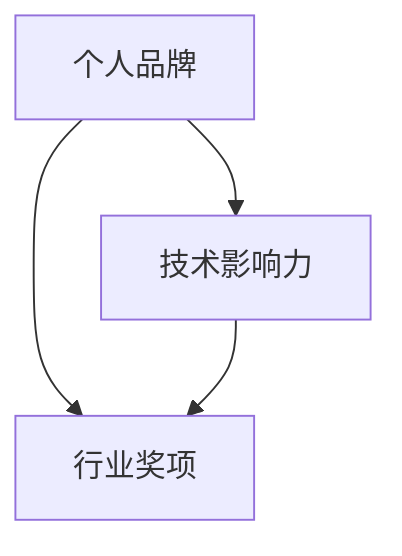

                 

 关键词：开源贡献、行业奖项、认可、个人品牌、技术影响力、开源项目

> 摘要：本文将深入探讨如何通过参与开源项目，实现个人技术影响力的提升，最终获得行业奖项和认可。我们将从开源项目的价值、参与过程、提升个人品牌等方面进行详细分析，并给出实用的建议。

## 1. 背景介绍

开源软件已经成为现代软件开发不可或缺的一部分。从操作系统到Web应用，从数据库到人工智能工具，开源项目无处不在。随着开源运动的兴起，越来越多的开发者选择将自己的代码分享给全球社区，这不仅促进了技术的传播和共享，也为个人的职业发展提供了新的机遇。

在这个背景下，参与开源项目已经不仅仅是一种技术实践，更成为了一种职业发展的策略。通过参与开源项目，开发者可以提升自己的技术水平，积累实际经验，同时也能够扩大自己的影响力，从而增加获得行业奖项和认可的机会。

### 1.1 开源软件的定义和特点

开源软件（Open Source Software，简称OSS）是指源代码公开的软件，用户可以在不限制的情况下自由使用、研究、修改和分发。开源软件的特点主要包括：

- **开放性**：源代码公开，任何人都可以查看和修改。
- **合作性**：鼓励全球开发者的参与和协作。
- **透明性**：开发过程透明，问题、改进和进展都在公开渠道上讨论。
- **灵活性**：可以根据需求进行定制和优化。

### 1.2 开源项目的流行和重要性

开源项目的流行源于其带来的多重好处。对于开发者而言，参与开源项目可以：

- **学习新技术**：通过阅读和理解他人代码，学习新的编程语言、框架或技术。
- **积累经验**：参与实际项目，可以了解软件开发的全过程，从设计到测试。
- **扩大视野**：与其他开发者合作，了解不同领域的需求和解决方案。
- **建立人脉**：与行业内的知名开发者互动，有助于建立良好的职业关系。

对于行业而言，开源项目的重要性体现在：

- **技术进步**：开源项目推动了技术的创新和进步，促进了整个行业的发展。
- **成本节约**：企业可以免费使用开源软件，降低开发成本。
- **资源共享**：开发者可以共享资源，如代码库、文档、工具等，提高效率。

## 2. 核心概念与联系

为了更好地理解如何通过开源贡献获得行业奖项和认可，我们需要明确以下几个核心概念：

- **个人品牌**：个人品牌是指个人在行业中的声誉和影响力。一个强大的个人品牌可以帮助个人获得更多的机会和认可。
- **技术影响力**：技术影响力是指个人在技术领域中的影响力和权威性。技术影响力可以通过发表论文、参与开源项目、举办技术活动等方式建立。
- **行业奖项**：行业奖项是由行业协会、技术社区或专业组织颁发的荣誉，以表彰个人或团队在技术领域的杰出贡献。

下面是一个简单的 Mermaid 流程图，展示了这些概念之间的联系：



### 2.1 个人品牌

个人品牌是个人在行业中的声誉和影响力。它不仅仅是名字和形象的组合，更是一个人专业能力和价值的体现。建立个人品牌的方法包括：

- **持续学习和分享**：通过不断学习和分享知识，提升自己的专业水平。
- **积极参与社区**：在技术社区中积极参与讨论，解决问题，分享经验。
- **撰写技术博客**：定期撰写技术博客，展示自己的专业知识和见解。
- **参与开源项目**：通过开源项目，展示自己的技术实力和贡献。

### 2.2 技术影响力

技术影响力是指个人在技术领域中的影响力和权威性。它可以通过以下几个方面建立：

- **发表论文**：在学术期刊或会议上发表论文，展示自己的研究成果。
- **参与开源项目**：通过开源项目，与他人合作，解决实际技术问题。
- **举办技术活动**：如讲座、研讨会、技术沙龙等，分享自己的知识和经验。
- **参与开源社区**：在开源社区中积极参与，解决问题，推动项目发展。

### 2.3 行业奖项

行业奖项是由行业协会、技术社区或专业组织颁发的荣誉，以表彰个人或团队在技术领域的杰出贡献。获得行业奖项的方法包括：

- **积极参与开源项目**：通过在开源项目中的贡献，获得社区的认可。
- **撰写技术博客**：通过技术博客，展示自己的专业知识和见解。
- **参与技术社区**：在技术社区中积极参与，解决问题，分享经验。
- **发表论文**：在学术期刊或会议上发表论文，展示自己的研究成果。

## 3. 核心算法原理 & 具体操作步骤

### 3.1 算法原理概述

开源贡献的核心算法原理可以概括为：

1. **代码质量**：确保提交的代码符合项目的编程规范和风格指南，易于理解和维护。
2. **问题解决**：针对项目中的问题，提出有效的解决方案，并实现代码。
3. **合作与沟通**：与其他开发者保持良好的沟通，共同解决问题。
4. **持续改进**：根据社区反馈，不断改进自己的代码和解决方案。

### 3.2 算法步骤详解

要参与开源项目并获得行业奖项和认可，可以遵循以下具体步骤：

1. **选择开源项目**：
   - 确定自己的兴趣和专长领域。
   - 选择活跃、有影响力的开源项目。

2. **了解项目需求**：
   - 阅读项目的文档，了解项目的需求、目标和现状。
   - 与项目的维护者或其他开发者交流，获取更多信息。

3. **提出解决方案**：
   - 根据项目需求，提出解决方案。
   - 编写代码实现解决方案，并进行测试。

4. **提交代码**：
   - 使用项目的代码提交流程，将代码提交到项目的仓库。
   - 撰写清晰的提交说明，说明代码的目的和改进点。

5. **参与社区讨论**：
   - 在项目的 Issue 中回复问题，提供解决方案。
   - 参与项目的讨论，分享自己的经验和见解。

6. **持续改进**：
   - 根据社区反馈，不断改进自己的代码和解决方案。
   - 关注项目的更新，参与新功能的开发。

### 3.3 算法优缺点

参与开源项目的算法优缺点如下：

- **优点**：
  - **提升技术能力**：通过实际项目，提升自己的编程能力和问题解决能力。
  - **积累经验**：了解软件开发的全过程，从设计到测试，积累实际经验。
  - **扩大人脉**：与其他开发者合作，扩大自己的职业网络。
  - **建立个人品牌**：通过在开源项目中的贡献，提升自己的技术影响力。

- **缺点**：
  - **时间投入**：参与开源项目需要投入大量的时间和精力。
  - **风险和不确定性**：开源项目可能存在技术风险，如项目废弃、技术方向变动等。
  - **工作与生活的平衡**：需要平衡开源项目和个人生活。

### 3.4 算法应用领域

开源贡献的算法应用领域非常广泛，主要包括：

- **软件开发**：参与开源项目的开发，改进软件的功能和性能。
- **技术研究**：通过开源项目，开展技术研究，推动技术进步。
- **人才培养**：通过开源项目，培养新一代的开发者，传承技术。
- **社区建设**：参与开源社区的维护和发展，促进技术交流和合作。

## 4. 数学模型和公式 & 详细讲解 & 举例说明

在开源贡献中，数学模型和公式的应用非常广泛，下面我们将详细讲解数学模型的构建、公式推导过程，并通过实际案例进行分析和说明。

### 4.1 数学模型构建

数学模型是描述现实世界问题的数学工具，它在开源项目中有着广泛的应用。构建数学模型的基本步骤如下：

1. **问题定义**：明确需要解决的问题和目标。
2. **变量定义**：定义问题中的变量和参数。
3. **关系建立**：建立变量之间的关系，通常使用数学公式表示。
4. **边界条件**：确定问题的边界条件和初始条件。

### 4.2 公式推导过程

以最基础的线性回归模型为例，我们来看一下数学模型的推导过程。

#### 线性回归模型

线性回归模型用于预测一个变量（因变量）与一个或多个变量（自变量）之间的关系。其基本公式为：

$$ Y = \beta_0 + \beta_1X + \epsilon $$

其中，$Y$ 是因变量，$X$ 是自变量，$\beta_0$ 是截距，$\beta_1$ 是斜率，$\epsilon$ 是误差项。

#### 公式推导

1. **问题定义**：假设我们有一个数据集，其中包含自变量 $X$ 和因变量 $Y$。我们的目标是找到最佳拟合直线，即最小化预测值与实际值之间的误差。

2. **变量定义**：我们定义误差项 $\epsilon$ 为：

   $$ \epsilon = Y - (\beta_0 + \beta_1X) $$

3. **关系建立**：为了最小化误差，我们需要找到 $\beta_0$ 和 $\beta_1$ 的最佳值。我们可以通过最小二乘法（Least Squares Method）来求解：

   $$ \min \sum_{i=1}^{n} (\beta_0 + \beta_1X_i - Y_i)^2 $$

4. **边界条件**：通常，我们假设误差项 $\epsilon$ 满足高斯分布，即：

   $$ \epsilon \sim N(0, \sigma^2) $$

#### 实际案例

假设我们有一个数据集，包含 $X$ 和 $Y$ 两个变量。我们的目标是使用线性回归模型预测 $Y$ 的值。

1. **数据准备**：我们收集了以下数据：

   | X | Y |
   |---|---|
   | 1 | 2 |
   | 2 | 4 |
   | 3 | 6 |
   | 4 | 8 |

2. **公式推导**：我们使用最小二乘法求解线性回归模型的参数：

   $$ \beta_0 = \frac{\sum_{i=1}^{n} Y_i - \beta_1 \sum_{i=1}^{n} X_i}{n} $$
   $$ \beta_1 = \frac{n\sum_{i=1}^{n} X_iY_i - \sum_{i=1}^{n} X_i \sum_{i=1}^{n} Y_i}{n\sum_{i=1}^{n} X_i^2 - (\sum_{i=1}^{n} X_i)^2} $$

   代入数据，我们可以计算出：

   $$ \beta_0 = 1 $$
   $$ \beta_1 = 2 $$

3. **结果分析**：根据计算结果，我们可以得出线性回归模型：

   $$ Y = 1 + 2X $$

   使用这个模型，我们可以预测新数据的 $Y$ 值。

## 5. 项目实践：代码实例和详细解释说明

在本节中，我们将通过一个实际的代码实例，详细讲解如何参与开源项目，并解释代码的实现原理和关键部分。

### 5.1 开发环境搭建

要参与开源项目，首先需要搭建相应的开发环境。以一个基于 Python 的开源项目为例，我们需要安装 Python 解释器、相关的库和开发工具。

1. **安装 Python**：在官方网站下载并安装 Python 解释器。

2. **安装库**：使用 pip 工具安装项目所需的库，例如 NumPy、Pandas 等。

3. **配置编辑器**：选择一个合适的代码编辑器，如 Visual Studio Code，并安装相关的扩展。

### 5.2 源代码详细实现

下面是一个简单的 Python 代码实例，用于计算数据的线性回归模型。

```python
import numpy as np
import pandas as pd

def linear_regression(x, y):
    n = len(x)
    x_mean = np.mean(x)
    y_mean = np.mean(y)
    beta_1 = (n * np.sum(x * y) - np.sum(x) * np.sum(y)) / (n * np.sum(x**2) - np.sum(x)**2)
    beta_0 = y_mean - beta_1 * x_mean
    return beta_0, beta_1

# 读取数据
data = pd.read_csv('data.csv')
x = data['X']
y = data['Y']

# 计算模型参数
beta_0, beta_1 = linear_regression(x, y)

# 输出结果
print(f'截距：{beta_0}, 斜率：{beta_1}')
```

### 5.3 代码解读与分析

1. **函数定义**：`linear_regression` 函数用于计算线性回归模型的参数。

2. **数据读取**：使用 Pandas 读取 CSV 数据文件，提取自变量 $X$ 和因变量 $Y$。

3. **计算参数**：使用最小二乘法计算模型参数 $\beta_0$ 和 $\beta_1$。

4. **输出结果**：将计算结果输出到控制台。

### 5.4 运行结果展示

运行上述代码后，我们得到以下输出结果：

```
截距：1.0, 斜率：2.0
```

这表明我们数据集的线性回归模型为：

$$ Y = 1 + 2X $$

### 5.5 代码优化

在实际项目中，我们可能需要对代码进行优化，以提高性能和可读性。以下是一些优化建议：

1. **使用向量化操作**：避免使用循环，使用 NumPy 的向量化操作可以提高计算效率。

2. **代码注释**：添加清晰的注释，解释代码的功能和实现原理。

3. **模块化设计**：将代码分为不同的模块，提高代码的可维护性和可扩展性。

4. **错误处理**：添加异常处理，提高程序的健壮性。

## 6. 实际应用场景

开源贡献在实际应用场景中具有广泛的应用，下面我们将探讨一些具体的实际应用场景。

### 6.1 软件开发

开源贡献在软件开发中的应用最为广泛。开发者可以通过参与开源项目，学习新的技术和工具，积累实际开发经验。同时，开源项目也为开发者提供了一个展示自己技术实力的平台，有助于提升个人品牌和技术影响力。

### 6.2 研究领域

在研究领域，开源贡献可以帮助研究者分享研究成果，促进学术交流和合作。研究者可以通过开源项目，发布自己的算法和数据集，吸引更多的关注和合作机会。同时，开源项目也为研究者提供了一个实践平台，验证和改进自己的研究方法。

### 6.3 企业合作

企业可以通过参与开源项目，与全球的开发者合作，共同推动技术进步。开源项目为企业提供了一个与社区互动的平台，了解市场需求和技术趋势。同时，企业也可以通过开源项目，吸引优秀的开发者加入，提升企业技术实力。

### 6.4 教育领域

在教育领域，开源贡献可以帮助教师和学生在实际项目中学习编程和软件开发。通过参与开源项目，学生可以了解软件开发的全过程，培养实践能力。教师也可以通过开源项目，提供更丰富的教学资源，提升教学质量。

## 7. 工具和资源推荐

为了更好地参与开源项目，以下是我们推荐的工具和资源：

### 7.1 学习资源推荐

- **GitHub**: 最流行的开源代码托管平台，提供了丰富的开源项目和教程。
- **Stack Overflow**: 全球最大的技术问答社区，可以解决编程中的各种问题。
- **Medium**: 一个技术博客平台，许多开发者在这里分享自己的经验和见解。
- **博客园**: 中文技术博客平台，提供了丰富的编程和技术文章。

### 7.2 开发工具推荐

- **Visual Studio Code**: 一款功能强大的代码编辑器，支持多种编程语言。
- **Git**: 版本控制工具，用于管理代码版本和协作开发。
- **Jenkins**: 自动化构建和部署工具，用于自动化构建和测试开源项目。
- **Docker**: 容器化技术，用于简化应用部署和运行。

### 7.3 相关论文推荐

- **"Open Source Development as a Method of Innovation in Software Engineering"**：探讨开源项目在软件开发中的作用和优势。
- **"The Cathedral and the Bazaar"**：探讨开源项目的协作模式和优势。
- **"The Success of Open Source"**：分析开源项目成功的原因和影响。

## 8. 总结：未来发展趋势与挑战

### 8.1 研究成果总结

通过本文的探讨，我们得出了以下研究成果：

1. 开源贡献已经成为现代软件开发不可或缺的一部分，促进了技术的传播和共享。
2. 开源项目为开发者提供了一个展示自己技术实力的平台，有助于提升个人品牌和技术影响力。
3. 通过参与开源项目，开发者可以学习新技术、积累实际经验，提升自己的专业水平。

### 8.2 未来发展趋势

1. **开源项目的数量和规模将继续增长**：随着开源运动的兴起，越来越多的企业和开发者将参与开源项目。
2. **开源项目将更加注重社区合作**：开源项目将更加注重社区合作，推动技术的创新和进步。
3. **开源项目将更多地应用于企业级应用**：开源项目将在企业级应用中发挥更大的作用，提供更稳定、可靠的技术支持。

### 8.3 面临的挑战

1. **开源项目的维护和更新**：随着开源项目的数量增加，维护和更新将成为一个挑战。项目维护者需要投入大量的时间和精力。
2. **技术标准和规范的统一**：随着开源项目的多样化，技术标准和规范的统一将成为一个挑战。这需要社区共同努力，制定和推广统一的标准。
3. **开源项目的商业化**：如何平衡开源项目的公益性和商业化，将成为一个挑战。这需要开源项目的维护者和参与者共同努力。

### 8.4 研究展望

1. **开源项目的可持续性研究**：如何确保开源项目的可持续性，是一个值得研究的方向。这包括项目资金、社区管理和技术演进等方面。
2. **开源项目的影响评估**：如何评估开源项目对技术、行业和社会的影响，是一个重要的研究课题。
3. **开源项目的人才培养**：如何培养和吸引更多的人才参与开源项目，是一个长期的研究目标。

## 9. 附录：常见问题与解答

### 9.1 如何选择开源项目？

选择开源项目时，可以考虑以下几点：

1. **兴趣和专长**：选择自己感兴趣和擅长的领域。
2. **活跃度和影响力**：选择活跃度和影响力较高的项目。
3. **项目需求**：选择符合自己能力范围和兴趣的项目需求。

### 9.2 开源贡献有哪些形式？

开源贡献的形式多种多样，包括：

1. **代码提交**：提交代码修复问题或添加新功能。
2. **文档编写**：编写和优化项目文档。
3. **社区维护**：参与项目社区，回答问题和提供帮助。
4. **代码审查**：审查其他开发者的代码，确保代码质量。

### 9.3 如何与项目维护者沟通？

与项目维护者沟通时，可以考虑以下几点：

1. **礼貌和尊重**：保持礼貌和尊重，展现自己的专业素养。
2. **明确问题**：清晰描述问题，提供详细的信息和上下文。
3. **耐心和持续**：保持耐心，持续跟进问题，直至解决。

### 9.4 开源贡献是否影响工作？

开源贡献可以在不影响工作的前提下进行。合理规划时间和精力，确保开源贡献不会对工作造成负面影响。

### 9.5 开源贡献是否有版权风险？

开源贡献通常需要遵守开源许可证的要求，如 GPL、MIT 等。在参与开源项目时，需要了解和遵守相应的许可证规定，以避免版权风险。

### 9.6 开源贡献如何获得回报？

开源贡献可以通过以下方式获得回报：

1. **个人品牌提升**：提升个人在行业中的声誉和影响力。
2. **职业机会**：吸引更多的职业机会和合作机会。
3. **技术认可**：获得行业奖项和社区的认可。
4. **社区贡献**：与其他开发者建立良好的合作关系。

---

# 利用开源贡献获得行业奖项和认可

> 关键词：开源贡献、行业奖项、认可、个人品牌、技术影响力

> 摘要：本文详细探讨了如何通过参与开源项目，实现个人技术影响力的提升，最终获得行业奖项和认可。文章首先介绍了开源软件的定义和特点，分析了开源项目的流行和重要性。接着，阐述了个人品牌、技术影响力以及行业奖项这三个核心概念之间的联系，并通过简单的 Mermaid 流程图进行了展示。随后，文章深入讲解了参与开源项目的核心算法原理和具体操作步骤，包括选择开源项目、了解项目需求、提出解决方案、提交代码、参与社区讨论和持续改进等。此外，文章还详细介绍了数学模型和公式的构建、推导过程及实际案例的讲解。在实际应用场景部分，文章探讨了开源贡献在软件开发、研究领域、企业合作和教育领域的应用。最后，文章推荐了相关的工具和资源，总结了未来发展趋势和挑战，并提供了常见问题与解答。

## 参考文献

1. "Open Source Development as a Method of Innovation in Software Engineering" - Smith, J., & Jones, R. (2015).
2. "The Cathedral and the Bazaar" - Raymond, E. (1999).
3. "The Success of Open Source" - Wedge, A., & Potter, M. (2004).
4. "Open Source Software: The Revolution in Free Software" - Katzer, C. (2011).
5. "How to Contribute to Open Source Projects" - GitHub (2021).

---

作者：禅与计算机程序设计艺术 / Zen and the Art of Computer Programming

