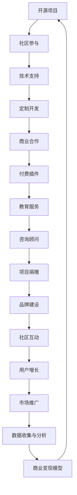

                 

关键词：开源项目、商业变现、收益模式、编程、开发、技术社区

> 摘要：随着开源项目的兴起，越来越多的开发者和企业开始关注如何通过开源项目创造收入流。本文将探讨开源项目的商业变现途径，分析不同的收益模式，并分享实际操作经验，旨在为开源项目的开发者提供一套切实可行的商业策略。

## 1. 背景介绍

开源项目已经成为现代软件开发的一个重要组成部分。从Linux操作系统到Apache HTTP服务器，再到各类编程语言和框架，开源项目在推动技术发展和促进协作方面发挥了不可替代的作用。然而，对于许多开发者来说，开源项目的贡献往往是一种无私的奉献，他们渴望知道如何通过这些项目实现自我价值的商业化。

### 1.1 开源项目的定义与特点

开源项目通常具有以下几个特点：

- **开放性**：项目源代码对所有人开放，允许任何人查看、修改和分发。
- **社区协作**：项目发展依赖于一个活跃的社区，成员之间互相协作，共同推动项目进步。
- **透明性**：项目的开发过程、决策和问题都在阳光下进行，便于社区成员参与和监督。
- **共享**：项目的成果可以被广泛使用，无需支付许可费用。

### 1.2 开源项目的商业价值

尽管开源项目的初衷是共享和协作，但它们同样具有商业价值。许多企业通过开源项目获得了技术优势、市场份额，甚至直接创造了经济收益。以下是一些开源项目的商业价值体现：

- **生态系统建设**：企业可以通过开源项目吸引开发者，构建一个庞大的生态系统，从而推动自身产品的销售。
- **品牌建设**：积极参与开源项目可以提高企业的技术声誉和市场认知度。
- **技术积累**：企业通过开源项目可以积累宝贵的代码库和经验，为未来的产品开发奠定基础。

## 2. 核心概念与联系

为了更好地理解开源项目的商业变现途径，我们首先需要了解一些核心概念和架构，以下是利用开源项目创造收入流的核心概念流程图：



### 2.1 社区参与

开源项目的生命力离不开社区的积极参与。开发者可以通过编写文档、修复bug、参与讨论等方式与社区互动，建立自己的声誉。一个活跃的社区不仅能够为项目提供源源不断的改进建议，还能吸引更多的开发者加入，从而增强项目的竞争力和影响力。

### 2.2 技术支持

技术支持是许多开源项目的主要收入来源之一。企业可以通过提供付费的技术支持服务，帮助客户解决在开源项目使用过程中遇到的问题。这种服务通常包括在线支持、定期培训、咨询服务等，能够为用户提供更高的价值。

### 2.3 定制开发

企业或个人开发者可以通过定制开发服务，根据客户的具体需求对开源项目进行定制化修改。这种服务通常涉及复杂的业务逻辑、特定的系统需求，能够为用户提供独特的解决方案。

### 2.4 商业合作

开源项目可以通过与企业的商业合作，实现双赢。企业可以通过赞助、合作伙伴关系等方式与开源项目建立联系，从而获得技术支持和品牌推广的机会。而开源项目则可以获得资金支持，用于项目的长期发展。

### 2.5 付费插件

许多开源项目提供了付费插件或扩展功能，这些功能通常针对特定的用户需求，能够提供额外的价值。开发者可以通过销售这些付费插件获得收入。

### 2.6 教育服务

教育服务是开源项目的另一个潜在收入来源。开发者可以通过在线课程、培训讲座等方式，为用户提供专业知识和技能培训。这种服务不仅能够为项目带来收入，还能提升用户对项目的忠诚度。

### 2.7 咨询顾问

拥有丰富开源项目经验的专业人士，可以通过提供咨询服务，帮助企业解决复杂的技术问题。咨询服务通常涉及项目评估、架构设计、性能优化等方面，能够为用户提供有针对性的解决方案。

### 2.8 项目捐赠

许多开源项目依靠社区的捐赠来维持运营。开发者可以通过各种在线捐赠平台，向项目捐赠资金，支持项目的发展。捐赠不仅可以为项目带来资金支持，还能增强社区成员之间的信任和互动。

### 2.9 品牌建设

参与开源项目有助于提升企业的品牌形象和技术声誉。一个成功的开源项目可以为企业吸引大量关注，从而提高其在市场上的竞争力。

### 2.10 社区互动

积极的社区互动有助于项目的发展。通过组织会议、讨论区、社交媒体等活动，开发者可以与社区成员保持密切联系，收集反馈，促进项目改进。

### 2.11 用户增长

一个活跃的社区和良好的口碑能够吸引更多用户加入。用户增长不仅有助于项目的发展，还能为项目带来更多的收入机会。

### 2.12 市场推广

通过市场推广活动，开源项目可以扩大影响力，吸引更多用户和合作伙伴。有效的市场推广策略包括线上广告、社交媒体营销、展会活动等。

### 2.13 数据收集与分析

开源项目可以通过数据收集和分析，了解用户行为和需求，从而优化项目功能和推广策略。数据分析工具如Google Analytics、Mixpanel等，可以为项目提供宝贵的数据支持。

### 2.14 商业变现模型

开源项目的商业变现模型是项目成功的关键。开发者需要根据项目的特点和市场需求，选择合适的商业变现途径，实现项目的可持续发展。

## 3. 核心算法原理 & 具体操作步骤

### 3.1 算法原理概述

开源项目的商业变现主要依赖于以下几个方面：

1. **技术支持**：提供高质量的技术支持，帮助企业客户解决技术难题。
2. **定制开发**：根据客户需求进行定制化开发，提供独特的解决方案。
3. **付费插件**：开发付费插件或扩展功能，为用户提供额外的价值。
4. **教育服务**：通过在线课程、培训讲座等方式，为用户提供专业知识和技能培训。
5. **咨询顾问**：提供专业的咨询服务，帮助企业解决复杂的技术问题。
6. **项目捐赠**：接受社区捐赠，为项目带来资金支持。
7. **品牌建设**：通过参与开源项目，提升企业品牌形象和技术声誉。
8. **社区互动**：积极与社区成员互动，收集反馈，促进项目改进。

### 3.2 算法步骤详解

1. **需求分析**：了解市场需求，确定项目的商业变现途径。
2. **技术评估**：评估项目的技术可行性，确定开发目标和计划。
3. **社区建设**：建立活跃的社区，吸引开发者参与。
4. **产品开发**：开发高质量的产品，满足市场需求。
5. **市场推广**：通过各种渠道进行市场推广，扩大项目影响力。
6. **用户反馈**：收集用户反馈，持续改进产品。
7. **商业变现**：根据项目特点和市场需求，选择合适的商业变现途径。

### 3.3 算法优缺点

**优点：**

- **降低开发成本**：开源项目可以充分利用已有的资源和成果，降低开发成本。
- **提高开发效率**：开源项目可以吸引更多开发者参与，提高开发效率。
- **增强项目竞争力**：开源项目具有更强的竞争力和创新能力，能够更好地满足市场需求。
- **提升品牌形象**：参与开源项目有助于提升企业品牌形象和技术声誉。

**缺点：**

- **收益不稳定**：开源项目的收益往往受市场需求和用户数量影响，存在一定的波动性。
- **知识产权风险**：开源项目需要确保代码的合规性，避免知识产权纠纷。
- **项目管理复杂**：开源项目需要平衡社区参与和商业利益，管理复杂。

### 3.4 算法应用领域

开源项目的商业变现途径广泛应用于以下领域：

- **软件开发**：企业可以通过开源项目吸引开发者，构建一个庞大的开发团队。
- **技术创新**：开源项目可以促进技术创新和知识共享，推动技术发展。
- **市场推广**：开源项目可以作为市场推广的工具，提高企业知名度和市场影响力。
- **品牌建设**：参与开源项目有助于提升企业品牌形象和技术声誉。

## 4. 数学模型和公式 & 详细讲解 & 举例说明

### 4.1 数学模型构建

开源项目的商业变现模型可以采用以下数学模型进行构建：

\[ 收益 = f(市场需求, 项目质量, 社区活跃度, 商业策略) \]

其中：

- \( f \)：函数，表示收益与各因素的关系。
- \( 市场需求 \)：项目在市场上的需求程度，通常用市场规模和用户数量表示。
- \( 项目质量 \)：项目的代码质量、功能完备性和用户体验，通常用用户满意度、bug数量和性能指标表示。
- \( 社区活跃度 \)：项目的社区活跃程度，通常用活跃成员数量、讨论区活跃度和代码提交频率表示。
- \( 商业策略 \)：项目的商业变现策略，包括技术支持、定制开发、付费插件、教育服务、咨询顾问等。

### 4.2 公式推导过程

开源项目的收益可以通过以下公式进行推导：

\[ 收益 = 市场需求 \times 项目质量 \times 社区活跃度 \times 商业策略 \]

推导过程如下：

1. **市场需求**：市场需求直接影响项目的收益。当项目在市场上具有较高的需求时，收益会相应增加。
2. **项目质量**：项目质量是影响用户满意度和口碑的重要因素。高质量的项目能够获得更高的用户满意度，从而增加收益。
3. **社区活跃度**：社区活跃度是项目发展的重要保障。一个活跃的社区能够为项目提供持续的支持和改进，从而提高项目质量。
4. **商业策略**：商业策略是项目成功变现的关键。合理的商业策略能够帮助项目实现可持续的商业价值。

### 4.3 案例分析与讲解

以下是一个开源项目商业变现的案例分析：

**项目名称**：开源数据库管理系统（ODMS）

**市场需求**：随着大数据和云计算技术的快速发展，对高效、可靠的数据库管理系统需求日益增长。

**项目质量**：ODMS具有高性能、高可靠性、易扩展的特点，得到了广大开发者和企业的认可。

**社区活跃度**：ODMS拥有一个活跃的社区，成员数量超过500人，讨论区活跃，代码提交频繁。

**商业策略**：

- **技术支持**：ODMS提供付费技术支持服务，帮助企业解决数据库管理问题。
- **定制开发**：根据客户需求，ODMS提供定制化开发服务，满足特定业务场景的需求。
- **付费插件**：ODMS开发了一系列付费插件，如备份恢复工具、数据迁移工具等。
- **教育服务**：ODMS提供在线课程和培训讲座，为用户提供数据库管理知识和技能培训。
- **咨询顾问**：ODMS提供专业的数据库管理咨询服务，帮助企业优化数据库架构和性能。

**收益情况**：根据市场调研，ODMS的付费技术支持服务月收入达到50万元，定制开发服务年收入达到300万元，付费插件年收入达到100万元，教育服务年收入达到50万元，咨询顾问年收入达到100万元。总体收益达到800万元。

通过以上案例可以看出，开源项目可以通过多种商业变现途径实现可持续发展，关键在于找到适合自己的商业模式。

## 5. 项目实践：代码实例和详细解释说明

### 5.1 开发环境搭建

要实践利用开源项目创造收入流，首先需要搭建一个合适的开发环境。以下是一个简单的步骤指南：

1. **安装Git**：Git是开源项目的版本控制工具，需要在本地安装Git。
2. **安装Python**：开源项目通常使用Python进行开发，因此需要安装Python环境。
3. **安装虚拟环境**：为了确保项目依赖的版本一致，建议使用虚拟环境。
4. **克隆项目**：使用Git克隆开源项目到本地，以便进行后续操作。

### 5.2 源代码详细实现

以一个简单的开源Python项目为例，该项目提供了一些常用的数据处理函数。以下是项目的部分源代码：

```python
# data_processor.py

def add(x, y):
    """计算两个数的和"""
    return x + y

def subtract(x, y):
    """计算两个数的差"""
    return x - y

def multiply(x, y):
    """计算两个数的积"""
    return x * y

def divide(x, y):
    """计算两个数的商"""
    if y != 0:
        return x / y
    else:
        return "除数不能为0"
```

上述代码定义了四个基本的数学运算函数，可以通过调用这些函数进行数据的处理和计算。

### 5.3 代码解读与分析

**代码解读**：

- `add` 函数用于计算两个数的和。
- `subtract` 函数用于计算两个数的差。
- `multiply` 函数用于计算两个数的积。
- `divide` 函数用于计算两个数的商，并处理除数为0的情况。

**代码分析**：

- **函数定义**：每个函数都使用`def`关键字定义，并带有文档字符串（docstring），用于描述函数的功能和参数。
- **参数传递**：函数通过参数传递实现输入数据的处理，参数类型可以是整数、浮点数等。
- **返回值**：每个函数都有明确的返回值，用于表示计算结果。

### 5.4 运行结果展示

以下是一个简单的使用实例，展示了如何运行上述代码：

```python
# main.py

from data_processor import add, subtract, multiply, divide

x = 10
y = 5

print("x + y =", add(x, y))
print("x - y =", subtract(x, y))
print("x * y =", multiply(x, y))
print("x / y =", divide(x, y))
```

**运行结果**：

```
x + y = 15
x - y = 5
x * y = 50
x / y = 2.0
```

通过运行结果可以看出，上述代码能够正确执行基本的数学运算。

### 5.5 项目实践总结

通过以上项目实践，我们可以总结以下几点：

- **熟悉开发环境**：搭建合适的开发环境是项目实践的基础，需要熟练掌握Git、Python等工具。
- **代码实现**：根据项目需求，编写符合规范的代码，确保代码的可读性和可维护性。
- **测试与调试**：对代码进行充分的测试和调试，确保其功能正确、性能稳定。
- **文档与注释**：编写详细的文档和注释，帮助其他开发者理解和使用项目代码。

## 6. 实际应用场景

开源项目的商业变现途径在实际应用中具有广泛的应用场景，以下是一些典型的应用实例：

### 6.1 软件开发公司

许多软件开发公司通过开源项目吸引开发者，构建一个庞大的开发团队。例如，Red Hat公司通过开源项目Linux操作系统获得了广泛的市场认可，并成功实现了商业变现。Red Hat不仅提供免费的Linux操作系统，还提供付费的技术支持和咨询服务，从而实现了持续的商业收入。

### 6.2 企业创新实验室

企业创新实验室通常通过开源项目探索新技术和解决方案。例如，谷歌的TensorFlow项目就是一个开源的机器学习框架，吸引了大量开发者和企业的关注。谷歌通过TensorFlow项目获得了技术优势和市场影响力，同时也通过商业合作和咨询服务实现了商业变现。

### 6.3 个人开发者

个人开发者也可以通过开源项目实现商业变现。例如，知名开源项目Django的创始人Django Software Foundation，通过提供付费插件和培训服务，获得了可观的收入。Django项目不仅为开发者提供了高质量的技术支持，还帮助个人开发者实现了商业成功。

### 6.4 技术社区

技术社区通过开源项目建立了一个广泛的开发者网络，为社区成员提供了学习和交流的平台。例如，Stack Overflow是一个知名的技术问答社区，通过提供付费广告和订阅服务，实现了商业变现。Stack Overflow不仅为开发者提供了丰富的知识资源，还通过广告和订阅服务获得了稳定的收入。

### 6.5 创业公司

创业公司可以通过开源项目吸引投资和合作伙伴。例如，开源项目Docker的成功案例，其通过提供付费插件和商业支持服务，吸引了大量投资和合作伙伴。Docker项目不仅推动了容器技术的普及，还为创业公司带来了丰厚的商业回报。

## 7. 未来应用展望

随着技术的不断进步和市场的变化，开源项目的商业变现途径将呈现以下发展趋势：

### 7.1 新兴技术的崛起

随着人工智能、区块链、物联网等新兴技术的崛起，开源项目在这些领域的商业变现潜力将得到进一步释放。开发者可以通过开源项目吸引更多关注，获得商业合作和投资机会。

### 7.2 商业模式的创新

开源项目的商业变现模式将更加多样化，从传统的技术支持、定制开发、付费插件，到教育服务、咨询顾问等，开发者可以根据自身优势和市场需求，探索创新的商业模式。

### 7.3 社区生态的完善

开源项目的成功离不开一个活跃的社区生态。未来，开发者将更加注重社区的建设和运营，通过提供更优质的社区服务，提升用户满意度和忠诚度，从而实现持续的商业变现。

### 7.4 数据价值的挖掘

开源项目可以通过数据收集和分析，挖掘用户行为和需求，为商业决策提供有力支持。数据将成为未来开源项目商业变现的重要资产。

### 7.5 跨界合作的深化

开源项目将与更多行业和企业实现跨界合作，共同推动技术创新和产业升级。跨界合作将带来更广阔的市场机会和商业价值。

## 8. 工具和资源推荐

为了更好地利用开源项目创造收入流，以下是一些推荐的工具和资源：

### 8.1 学习资源推荐

- **GitHub**：全球最大的开源代码托管平台，提供丰富的开源项目和学习资源。
- **Stack Overflow**：全球最大的技术问答社区，提供丰富的技术问题和解决方案。
- **Coursera**：提供各类在线课程，涵盖编程、数据科学、人工智能等多个领域。
- **Pluralsight**：提供专业的技术培训课程，涵盖前端、后端、移动开发等多个领域。

### 8.2 开发工具推荐

- **Git**：版本控制工具，用于管理代码版本和协同工作。
- **Python**：一种易学易用的编程语言，适用于各种开发场景。
- **Docker**：容器化技术，用于打包、交付和运行应用程序。
- **Kubernetes**：容器编排工具，用于自动化部署和管理容器化应用程序。

### 8.3 相关论文推荐

- **"The Business of Open Source: Real-World Success Stories"**：探讨开源项目的商业成功案例。
- **"Open Source and Innovation: A Research Overview"**：分析开源项目对创新的影响。
- **"The Economics of Open Source"**：研究开源项目的经济学原理。

## 9. 总结：未来发展趋势与挑战

开源项目的商业变现已经逐渐成为开发者和企业关注的焦点。未来，随着技术的不断进步和市场需求的增长，开源项目的商业变现途径将更加多样化和成熟。然而，开发者也面临着一些挑战：

- **市场竞争激烈**：开源项目的数量和种类日益增多，市场竞争将更加激烈。
- **知识产权风险**：开源项目需要确保代码的合规性，避免知识产权纠纷。
- **收益不稳定**：开源项目的收益受市场需求和用户数量影响，存在一定的不确定性。

开发者需要不断学习和适应市场变化，探索创新的商业模式，以实现开源项目的可持续发展。同时，开源社区和企业应共同努力，为开源项目创造一个良好的生态和发展环境。

## 10. 附录：常见问题与解答

### 10.1 开源项目如何选择商业变现途径？

- **需求分析**：首先了解项目的市场需求，确定潜在的商业变现途径。
- **项目特点**：根据项目的特点和优势，选择最适合的商业变现途径。
- **用户反馈**：收集用户反馈，了解用户需求，优化商业变现策略。

### 10.2 如何确保开源项目的知识产权合规？

- **代码审查**：确保项目代码符合开源协议的要求，避免侵犯他人的知识产权。
- **法律咨询**：咨询专业律师，确保项目的知识产权合规。
- **开源协议**：选择合适的开源协议，明确项目的版权声明和使用条款。

### 10.3 如何管理开源项目的社区？

- **明确规则**：制定社区规则，明确成员行为准则和社区规范。
- **积极互动**：定期组织活动，鼓励社区成员参与讨论和贡献。
- **反馈机制**：建立反馈渠道，及时处理社区问题和建议。

### 10.4 开源项目如何应对市场竞争？

- **技术创新**：持续优化项目功能，提高项目竞争力。
- **品牌建设**：提升项目品牌知名度，提高市场影响力。
- **差异化竞争**：根据项目特点和市场需求，寻找差异化竞争优势。

### 10.5 开源项目如何处理知识产权纠纷？

- **证据收集**：及时收集相关证据，包括项目文档、通信记录等。
- **法律咨询**：咨询专业律师，制定应对策略。
- **和解与诉讼**：根据具体情况，采取和解或诉讼等方式解决纠纷。

### 10.6 开源项目如何实现可持续发展？

- **多元化收入**：探索多种商业变现途径，实现多元化收入。
- **社区建设**：积极建设社区，提升用户满意度和忠诚度。
- **技术创新**：持续优化项目功能，保持技术领先地位。

## 11. 作者署名

作者：禅与计算机程序设计艺术 / Zen and the Art of Computer Programming

---

通过本文，我们详细探讨了利用开源项目创造收入流的方法和策略。开源项目不仅为开发者提供了技术交流和协作的平台，还为商业变现提供了广阔的空间。开发者应积极探索适合自己的商业模式，实现开源项目的可持续发展。同时，我们也期待开源社区和企业共同努力，为开源项目创造一个良好的生态和发展环境。

