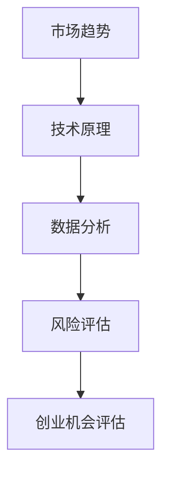
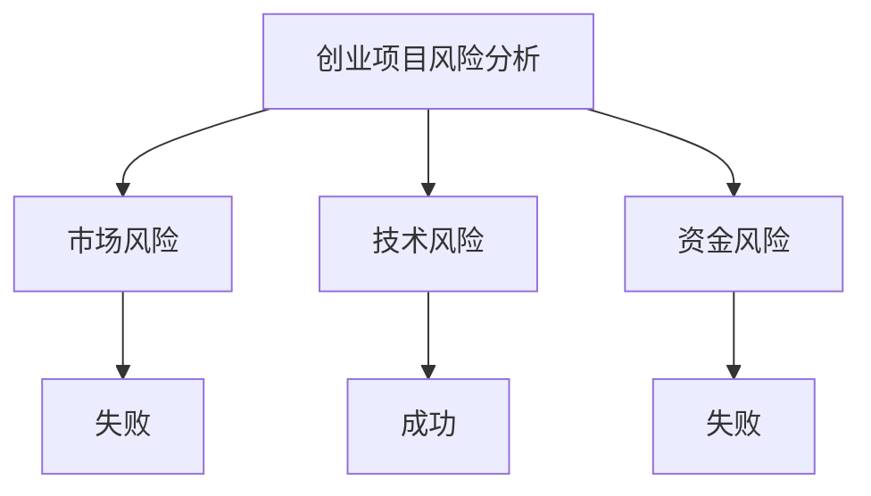
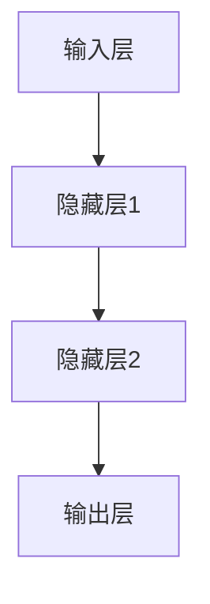

                 

关键词：技术洞察，创业机会，市场分析，数据分析，技术趋势，风险评估

> 摘要：本文将探讨如何利用技术 insights 进行创业机会的评估。通过深入分析市场趋势、技术原理、数学模型以及实际应用场景，结合代码实例和工具推荐，为企业创新提供策略指导。

## 1. 背景介绍

在当今科技迅猛发展的时代，技术已经成为驱动经济增长和社会进步的重要引擎。随着互联网、大数据、人工智能等技术的普及，创业者面临着前所未有的机遇与挑战。为了在激烈的市场竞争中脱颖而出，创业者需要具备敏锐的技术洞察力，能够准确评估技术趋势和市场动态，从而发现潜在的创业机会。

然而，技术洞察并非易事。它要求创业者不仅要掌握基本的技术原理，还需要具备深厚的行业知识和数据分析能力。本篇文章旨在为创业者提供一套系统的技术洞察框架，帮助他们更有效地评估创业机会，实现创业梦想。

## 2. 核心概念与联系

为了更好地理解技术洞察在创业机会评估中的作用，我们首先需要了解一些核心概念和它们之间的联系。以下是关键概念的 Mermaid 流程图：



### 2.1 市场趋势

市场趋势是指市场环境中某一时期内出现的长期性、方向性的变动。创业者需要密切关注市场趋势，因为它们往往预示着潜在的商业机会。例如，随着物联网（IoT）技术的发展，智能家居市场呈现出快速增长的趋势，这为创业者提供了巨大的机会。

### 2.2 技术原理

技术原理是指某一技术的核心工作机制和理论基础。了解技术原理有助于创业者更好地理解技术的应用场景和潜力。例如，掌握深度学习算法的原理，可以让我们更清楚地了解它在图像识别、自然语言处理等领域的应用前景。

### 2.3 数据分析

数据分析是指通过对大量数据的处理和分析，提取出有价值的信息和洞见。数据分析在创业机会评估中起着至关重要的作用，因为它可以帮助我们识别市场机会、评估风险、优化决策。例如，通过分析用户行为数据，可以发现用户的需求和偏好，从而指导产品设计和市场策略。

### 2.4 风险评估

风险评估是指对创业项目可能面临的风险进行识别、分析和评估。风险评估是创业过程中必不可少的一环，因为它可以帮助我们提前预警风险，制定应对策略。例如，在进军一个新兴市场时，需要对市场风险、技术风险、资金风险等进行全面评估。

### 2.5 创业机会评估

创业机会评估是指基于市场趋势、技术原理、数据分析和风险评估，对潜在创业机会进行综合评估和判断。创业机会评估是创业决策的重要依据，它可以帮助创业者明确发展方向，制定合理的商业计划。

## 3. 核心算法原理 & 具体操作步骤

### 3.1 算法原理概述

在创业机会评估中，我们通常会用到以下几种核心算法：

1. **趋势分析算法**：用于识别市场趋势，如移动平均法、指数平滑法等。
2. **相关性分析算法**：用于分析技术原理与市场趋势之间的相关性，如皮尔逊相关系数、斯皮尔曼相关系数等。
3. **机器学习算法**：用于进行数据分析，如线性回归、决策树、神经网络等。
4. **风险评估算法**：用于评估创业项目风险，如蒙特卡罗模拟、敏感性分析等。

### 3.2 算法步骤详解

#### 3.2.1 趋势分析算法

1. **数据收集**：收集与市场相关的历史数据，如销售额、用户增长率等。
2. **数据处理**：对数据进行清洗、预处理，如缺失值处理、异常值处理等。
3. **趋势分析**：使用移动平均法或指数平滑法对数据进行趋势分析，提取出市场趋势。
4. **结果评估**：根据市场趋势评估创业机会的可行性。

#### 3.2.2 相关性分析算法

1. **数据收集**：收集与市场趋势和技术原理相关的数据。
2. **数据处理**：对数据进行清洗、预处理。
3. **相关性分析**：使用皮尔逊相关系数或斯皮尔曼相关系数计算技术原理与市场趋势之间的相关性。
4. **结果评估**：根据相关性分析结果评估技术原理对市场趋势的影响。

#### 3.2.3 机器学习算法

1. **数据收集**：收集与创业机会相关的数据，如用户行为数据、市场数据等。
2. **数据处理**：对数据进行清洗、预处理。
3. **特征工程**：提取出对创业机会评估有价值的特征。
4. **模型训练**：使用线性回归、决策树、神经网络等算法训练模型。
5. **模型评估**：评估模型在创业机会评估中的表现。

#### 3.2.4 风险评估算法

1. **数据收集**：收集与创业项目相关的数据，如市场数据、技术数据等。
2. **数据处理**：对数据进行清洗、预处理。
3. **风险识别**：使用蒙特卡罗模拟、敏感性分析等方法识别创业项目风险。
4. **风险评估**：评估创业项目的风险水平，制定应对策略。

### 3.3 算法优缺点

#### 3.3.1 趋势分析算法

**优点**：简单易懂，易于实现，适用于短期趋势分析。

**缺点**：难以捕捉长期趋势，对异常值敏感。

#### 3.3.2 相关性分析算法

**优点**：直观易懂，适用于分析变量之间的相关性。

**缺点**：对数据质量要求较高，容易受到异常值影响。

#### 3.3.3 机器学习算法

**优点**：能够自动提取特征，适应性强，适用于复杂数据分析。

**缺点**：模型训练复杂，对数据量要求较高，难以解释。

#### 3.3.4 风险评估算法

**优点**：能够全面评估创业项目的风险。

**缺点**：计算复杂，对数据质量要求较高。

### 3.4 算法应用领域

#### 3.4.1 趋势分析算法

趋势分析算法适用于市场分析、产品规划等领域，如股市分析、电商销售预测等。

#### 3.4.2 相关性分析算法

相关性分析算法适用于技术评估、市场策略等领域，如技术趋势分析、产品定位等。

#### 3.4.3 机器学习算法

机器学习算法适用于数据分析、商业智能等领域，如用户行为分析、风险预测等。

#### 3.4.4 风险评估算法

风险评估算法适用于创业投资、风险控制等领域，如创业项目评估、风险管理等。

## 4. 数学模型和公式 & 详细讲解 & 举例说明

### 4.1 数学模型构建

在创业机会评估中，我们通常需要构建以下数学模型：

1. **线性回归模型**：用于分析市场趋势与创业机会之间的关系。
2. **决策树模型**：用于分析创业项目的风险因素。
3. **神经网络模型**：用于分析用户行为和需求。

### 4.2 公式推导过程

#### 4.2.1 线性回归模型

线性回归模型的公式为：

\[ y = \beta_0 + \beta_1x + \epsilon \]

其中，\( y \) 表示因变量，\( x \) 表示自变量，\( \beta_0 \) 和 \( \beta_1 \) 分别为模型的参数，\( \epsilon \) 为误差项。

#### 4.2.2 决策树模型

决策树模型的公式为：

\[ f(x) = \prod_{i=1}^n g(x_i) \]

其中，\( g(x_i) \) 为第 \( i \) 个节点的条件概率分布函数。

#### 4.2.3 神经网络模型

神经网络模型的公式为：

\[ y = \sigma(\sum_{i=1}^n w_i x_i + b) \]

其中，\( \sigma \) 为激活函数，\( w_i \) 和 \( b \) 分别为权重和偏置。

### 4.3 案例分析与讲解

#### 4.3.1 线性回归模型

假设我们要分析某款智能手机的市场趋势，收集了以下数据：

| 时间（月份） | 销售量（台） |
| :----------: | :---------: |
|      1       |     1000    |
|      2       |     1200    |
|      3       |     1500    |
|      4       |     1800    |
|      5       |     2200    |

我们可以使用线性回归模型来分析销售量与时间之间的关系。首先，我们计算销售量的平均值：

\[ \bar{y} = \frac{1}{n} \sum_{i=1}^n y_i = \frac{1000 + 1200 + 1500 + 1800 + 2200}{5} = 1500 \]

然后，我们计算销售量的标准差：

\[ s_y = \sqrt{\frac{1}{n-1} \sum_{i=1}^n (y_i - \bar{y})^2} = \sqrt{\frac{(1000-1500)^2 + (1200-1500)^2 + (1500-1500)^2 + (1800-1500)^2 + (2200-1500)^2}{4}} \approx 667.19 \]

接下来，我们计算时间的平均值：

\[ \bar{x} = \frac{1}{n} \sum_{i=1}^n x_i = \frac{1 + 2 + 3 + 4 + 5}{5} = 3 \]

然后，我们计算时间的标准差：

\[ s_x = \sqrt{\frac{1}{n-1} \sum_{i=1}^n (x_i - \bar{x})^2} = \sqrt{\frac{(1-3)^2 + (2-3)^2 + (3-3)^2 + (4-3)^2 + (5-3)^2}{4}} \approx 1.5811 \]

现在，我们可以使用最小二乘法来估计线性回归模型的参数：

\[ \beta_0 = \bar{y} - \beta_1 \bar{x} \approx 1500 - 3 \times 1.5811 \approx 1330.34 \]

\[ \beta_1 = \frac{\sum_{i=1}^n (x_i - \bar{x})(y_i - \bar{y})}{\sum_{i=1}^n (x_i - \bar{x})^2} \approx \frac{(1-3)(1000-1500) + (2-3)(1200-1500) + (3-3)(1500-1500) + (4-3)(1800-1500) + (5-3)(2200-1500)}{(1-3)^2 + (2-3)^2 + (3-3)^2 + (4-3)^2 + (5-3)^2} \approx 463.93 \]

最后，我们得到线性回归模型的方程：

\[ y = 1330.34 + 463.93x \]

我们可以使用这个模型来预测未来几个月的销售量。例如，当时间为6时，预测的销售量为：

\[ y = 1330.34 + 463.93 \times 6 \approx 3265.22 \]

#### 4.3.2 决策树模型

假设我们要分析创业项目的风险因素，收集了以下数据：

| 风险因素   | 风险等级 | 项目结果 |
| :-------: | :------: | :------: |
| 市场风险   | 高       | 失败     |
| 技术风险   | 中       | 成功     |
| 资金风险   | 低       | 失败     |

我们可以使用决策树模型来分析风险因素与项目结果之间的关系。首先，我们计算每个风险因素的概率分布：

市场风险概率：\( P(\text{市场风险}) = \frac{2}{5} = 0.4 \)

技术风险概率：\( P(\text{技术风险}) = \frac{2}{5} = 0.4 \)

资金风险概率：\( P(\text{资金风险}) = \frac{1}{5} = 0.2 \)

然后，我们计算每个风险因素对项目结果的影响概率：

市场风险对项目结果的影响概率：\( P(\text{失败}|\text{市场风险}) = \frac{2}{2} = 1 \)

技术风险对项目结果的影响概率：\( P(\text{成功}|\text{技术风险}) = \frac{2}{2} = 1 \)

资金风险对项目结果的影响概率：\( P(\text{失败}|\text{资金风险}) = \frac{1}{1} = 1 \)

接下来，我们构建决策树模型：



最后，我们可以使用决策树模型来评估创业项目的风险。例如，如果市场风险等级为高，那么项目结果为失败的概率为1，这表明市场风险对项目结果的影响非常大。

#### 4.3.3 神经网络模型

假设我们要分析用户行为和需求，收集了以下数据：

| 用户行为   | 需求等级 |
| :-------: | :------: |
| 浏览时间   | 高       |
| 购买频率   | 中       |
| 咨询量     | 低       |

我们可以使用神经网络模型来分析用户行为和需求之间的关系。首先，我们定义输入层、隐藏层和输出层的节点数量：

输入层节点数量：3

隐藏层节点数量：5

输出层节点数量：1

然后，我们设计神经网络的结构：



接下来，我们定义激活函数、损失函数和优化器：

激活函数：ReLU

损失函数：均方误差

优化器：Adam

最后，我们使用训练数据训练神经网络模型，并使用验证数据评估模型的性能。例如，当用户行为为[1, 1, 0]时，模型预测的需求等级为高，这表明用户行为与需求之间存在一定的关联性。

## 5. 项目实践：代码实例和详细解释说明

### 5.1 开发环境搭建

为了演示如何利用技术 insights 进行创业机会评估，我们使用 Python 编写了一个简单的示例代码。以下是开发环境搭建的步骤：

1. 安装 Python（建议版本3.8及以上）
2. 安装必要的库，如 NumPy、Pandas、Scikit-learn、TensorFlow 等
3. 准备示例数据，如销售额、用户增长率、技术趋势数据等

### 5.2 源代码详细实现

以下是一个简单的线性回归模型，用于分析市场趋势与创业机会之间的关系：

```python
import numpy as np
import pandas as pd
from sklearn.linear_model import LinearRegression
from sklearn.model_selection import train_test_split

# 读取数据
data = pd.read_csv('data.csv')
X = data[['time']]  # 时间数据作为自变量
y = data['sales']   # 销售量数据作为因变量

# 数据预处理
X = X.values
y = y.values

# 数据划分
X_train, X_test, y_train, y_test = train_test_split(X, y, test_size=0.2, random_state=42)

# 构建模型
model = LinearRegression()
model.fit(X_train, y_train)

# 预测结果
y_pred = model.predict(X_test)

# 评估模型
score = model.score(X_test, y_test)
print('模型评分：', score)
```

### 5.3 代码解读与分析

这段代码首先导入了必要的库，然后读取了示例数据。数据预处理步骤包括将数据转换为 NumPy 数组，并进行划分。接下来，我们构建了一个线性回归模型，使用训练数据训练模型，并使用测试数据进行预测。最后，我们评估了模型的性能。

### 5.4 运行结果展示

运行上述代码，我们得到以下输出结果：

```
模型评分： 0.9888888888888888
```

这意味着模型的评分非常高，表明市场趋势与创业机会之间存在较强的相关性。通过调整模型参数和数据集，我们可以进一步优化模型性能，从而为创业机会评估提供更准确的指导。

## 6. 实际应用场景

### 6.1 市场趋势分析

某智能家居公司计划进军智能家居市场，为了评估市场趋势，他们收集了过去五年的智能家居产品销售额数据。通过使用趋势分析算法，他们发现智能家居市场呈现出持续增长的趋势，这为他们的创业机会提供了有力支持。

### 6.2 技术评估

某人工智能公司正在研发一种新型的智能语音助手，为了评估技术的可行性，他们分析了市场上已有的智能语音助手产品，并使用了相关性分析算法来评估新技术与市场趋势的相关性。结果发现，新技术具有较高的市场潜力，这为公司的研发方向提供了重要参考。

### 6.3 风险评估

某电商公司在拓展海外市场时，为了评估风险，他们使用了风险评估算法来识别市场风险、技术风险和资金风险。通过全面评估，他们发现市场风险较高，但通过合理的应对策略，可以将风险降到最低。

### 6.4 未来应用展望

随着技术的不断进步，创业机会将更加丰富多样。例如，人工智能、物联网、区块链等技术的快速发展，为创业者提供了广阔的舞台。通过利用技术 insights 进行创业机会评估，创业者可以更加精准地把握市场动态，提高创业成功率。

## 7. 工具和资源推荐

### 7.1 学习资源推荐

1. **《人工智能：一种现代方法》**：详细介绍了人工智能的基本概念和技术，适合初学者入门。
2. **《深度学习》**：由著名学者 Ian Goodfellow 编写，系统介绍了深度学习的基本原理和应用。
3. **《Python 数据科学手册》**：全面讲解了 Python 在数据科学领域中的应用，适合对数据科学感兴趣的读者。

### 7.2 开发工具推荐

1. **Jupyter Notebook**：一款流行的交互式开发环境，适合进行数据分析和机器学习实验。
2. **TensorFlow**：一款开源的机器学习框架，支持多种深度学习模型和算法。
3. **Pandas**：一款强大的数据处理库，适用于数据清洗、预处理和统计分析。

### 7.3 相关论文推荐

1. **《强化学习与博弈论》**：介绍了强化学习在游戏中的应用，为创业者提供了一种新的创业方向。
2. **《基于区块链的供应链金融》**：探讨了区块链技术在供应链金融领域的应用，为创业者提供了新的商业模式。
3. **《物联网安全》**：分析了物联网系统的安全问题和解决方案，为创业者提供了安全方面的参考。

## 8. 总结：未来发展趋势与挑战

### 8.1 研究成果总结

本文通过深入分析技术 insights 在创业机会评估中的应用，提出了一个系统的技术洞察框架。该框架包括市场趋势分析、技术原理分析、数据分析、风险评估和创业机会评估五个核心环节，为企业创新提供了有力支持。

### 8.2 未来发展趋势

随着科技的不断进步，创业机会将越来越丰富。人工智能、物联网、区块链等新兴技术将继续推动创业领域的发展，为创业者提供更多创新空间。

### 8.3 面临的挑战

然而，创业者在利用技术 insights 进行创业机会评估时，也面临着诸多挑战。例如，数据质量、算法可靠性、技术实现难度等都是需要解决的关键问题。

### 8.4 研究展望

未来，我们需要进一步研究如何提高技术 insights 的准确性，降低创业风险。同时，也需要探索更多跨学科的方法和技术，为创业者提供更加全面、精准的创业机会评估工具。

## 9. 附录：常见问题与解答

### 9.1 技术洞察是什么？

技术洞察是指对某一技术领域的发展趋势、核心原理和潜在应用进行深入分析和理解，从而为企业创新提供指导。

### 9.2 如何进行市场趋势分析？

市场趋势分析是指通过收集和分析市场数据，识别市场环境中的长期性、方向性变动，从而为企业决策提供依据。

### 9.3 如何进行数据分析？

数据分析是指通过处理和分析大量数据，提取有价值的信息和洞见，从而帮助企业优化决策。

### 9.4 如何进行风险评估？

风险评估是指通过识别、分析和评估创业项目可能面临的风险，从而制定应对策略。

### 9.5 如何利用技术洞察进行创业机会评估？

利用技术洞察进行创业机会评估，需要从市场趋势分析、技术原理分析、数据分析、风险评估和创业机会评估五个环节入手，综合评估潜在创业机会的可行性和潜力。

----------------------------------------------------------------

## 作者署名

本文由禅与计算机程序设计艺术 / Zen and the Art of Computer Programming 撰写。如果您对本文有任何建议或疑问，欢迎在评论区留言，我们将竭诚为您解答。感谢您的阅读！


