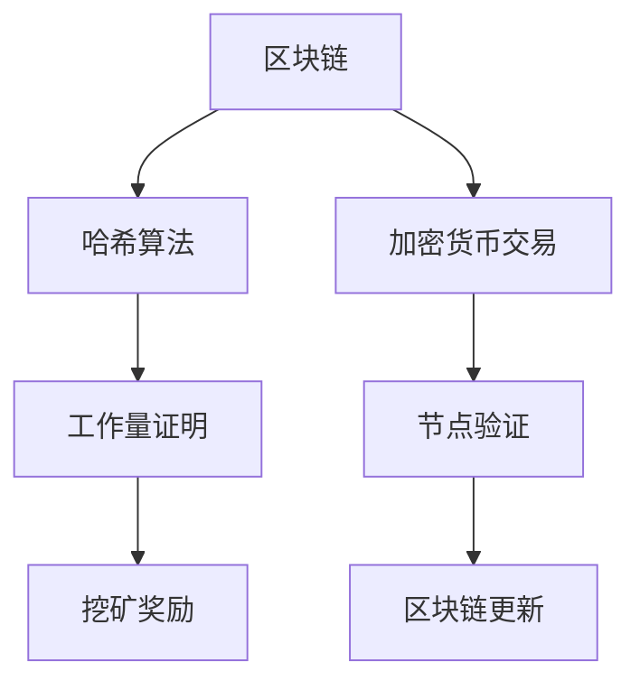

                 

关键词：加密货币、挖矿、技术优势、算法、数学模型、实践、应用场景、展望

摘要：本文旨在探讨如何利用技术优势进行加密货币挖矿。通过深入分析挖矿的核心概念、算法原理，数学模型，以及实际操作步骤，本文将帮助读者全面了解并掌握加密货币挖矿的技术要点。此外，本文还将讨论加密货币挖矿的实际应用场景，以及未来发展趋势与面临的挑战。

## 1. 背景介绍

加密货币，作为一种去中心化的数字货币，近年来在全球范围内取得了显著的发展。比特币作为第一个加密货币，自2009年问世以来，引发了人们对加密货币的广泛关注。随着加密货币市场的不断壮大，挖矿逐渐成为了一种重要的盈利手段。挖矿过程是通过计算机解决一系列复杂的数学难题，从而验证交易记录并记录在区块链上。随着加密货币市场的竞争加剧，如何利用技术优势提高挖矿效率成为了一个热门话题。

本文将围绕如何利用技术优势进行加密货币挖矿展开讨论。首先，我们将介绍挖矿的核心概念和算法原理，然后分析数学模型和公式，以及具体操作步骤。接下来，我们将探讨加密货币挖矿的实际应用场景，并提出未来发展的展望。最后，我们将推荐一些相关的学习资源、开发工具和论文，以便读者进一步了解和研究。

## 2. 核心概念与联系

加密货币挖矿的核心概念包括区块链、哈希算法、工作量证明（Proof of Work, PoW）等。下面我们将通过一个Mermaid流程图来展示这些概念之间的联系。



### 2.1. 区块链

区块链是一种分布式账本技术，通过加密算法和共识机制，实现了去中心化的数据存储和传输。区块链由一系列按时间顺序排列的区块组成，每个区块包含一定数量的交易记录。通过哈希算法，区块链能够确保数据的不可篡改性和安全性。

### 2.2. 哈希算法

哈希算法是一种将任意长度的输入数据映射为固定长度的字符串的算法。在加密货币挖矿中，哈希算法用于生成区块的哈希值。常见的哈希算法有SHA-256、SHA-3等。

### 2.3. 工作量证明

工作量证明是一种共识机制，用于确保区块链网络的安全性。在挖矿过程中，矿工需要通过计算解决一系列数学难题，以验证交易记录并生成新的区块。矿工的计算能力越强，获得挖矿奖励的概率就越大。

### 2.4. 挖矿奖励

挖矿奖励是指矿工在成功生成新区块后获得的奖励。通常，挖矿奖励包括新的加密货币和交易费用的分成。挖矿奖励的发放机制有助于激励矿工积极参与区块链网络的维护。

### 2.5. 加密货币交易

加密货币交易是指用户在区块链网络中进行的价值交换。交易记录被记录在区块中，并由矿工进行验证和广播。加密货币交易的安全性和可靠性取决于区块链网络的整体性能。

### 2.6. 节点验证

节点验证是指区块链网络中的参与者对交易记录进行验证的过程。节点通过计算交易记录的哈希值，确保交易记录的真实性和一致性。节点验证有助于确保区块链网络的安全性。

### 2.7. 区块链更新

区块链更新是指区块链网络中的新区块被添加到链上的过程。通过挖矿过程，矿工不断生成新区块，并将其广播到整个网络。区块链更新有助于确保区块链网络的数据完整性和一致性。

## 3. 核心算法原理 & 具体操作步骤

加密货币挖矿的核心算法是工作量证明（Proof of Work, PoW）。下面我们将详细介绍PoW算法的原理和具体操作步骤。

### 3.1. 算法原理概述

PoW算法的基本思想是，矿工需要通过计算解决一系列数学难题，以验证交易记录并生成新的区块。数学难题的解决过程需要大量的计算资源，从而确保区块链网络的安全性。在解决数学难题的过程中，矿工需要不断尝试各种可能的解决方案，直到找到满足条件的解。一旦找到解，矿工就可以将新的区块添加到区块链上，并获得挖矿奖励。

### 3.2. 算法步骤详解

#### 3.2.1. 获取交易记录

矿工首先需要从区块链网络中获取待验证的交易记录。交易记录包括用户之间的转账信息、交易金额等。

#### 3.2.2. 创建区块

矿工将获取到的交易记录组织成一个新区块。新区块包括区块头（block header）和区块体（block body）。区块头包含区块的高度、时间戳、上一个区块的哈希值等信息。区块体包含交易记录。

#### 3.2.3. 计算哈希值

矿工需要对区块体进行哈希运算，以生成区块的哈希值。哈希值是区块的唯一标识，必须满足特定的条件。

#### 3.2.4. 解决数学难题

矿工需要不断尝试各种可能的哈希值，直到找到一个满足条件的哈希值。这个满足条件的哈希值被称为“ nonce”（随机数）。nonce值通常是一个32位的整数。

#### 3.2.5. 广播新区块

一旦找到满足条件的哈希值，矿工就可以将新区块广播到整个区块链网络。其他节点会对新区块进行验证，以确保其有效性。

#### 3.2.6. 获取挖矿奖励

成功广播新区块的矿工将获得挖矿奖励，包括新的加密货币和交易费用的分成。

### 3.3. 算法优缺点

#### 3.3.1. 优点

- **安全性**：PoW算法通过大量的计算资源确保区块链网络的安全性，防止恶意攻击。
- **去中心化**：PoW算法不需要中央权威机构，实现了真正的去中心化。
- **激励机制**：挖矿奖励激励矿工积极参与区块链网络的维护。

#### 3.3.2. 缺点

- **资源消耗**：PoW算法需要大量的计算资源，导致能源消耗巨大。
- **拥堵问题**：在高峰期，交易拥堵问题可能导致交易确认时间延长。
- **51%攻击**：若恶意节点拥有超过一半的计算能力，可以篡改区块链数据。

### 3.4. 算法应用领域

PoW算法主要应用于加密货币挖矿，特别是比特币等基于PoW机制的加密货币。此外，PoW算法还可以应用于其他需要高安全性和去中心化的场景，如智能合约平台、去中心化存储等。

## 4. 数学模型和公式 & 详细讲解 & 举例说明

加密货币挖矿的核心算法PoW涉及到一系列复杂的数学模型和公式。下面我们将详细介绍这些模型和公式，并通过实例进行说明。

### 4.1. 数学模型构建

在PoW算法中，主要涉及以下数学模型：

- **哈希函数**：哈希函数是一种将输入映射为固定长度输出的函数。常见的哈希函数有SHA-256、SHA-3等。
- **工作量证明**：工作量证明是一种通过计算复杂度来证明节点对区块链网络的贡献的机制。
- **随机数**：随机数用于生成 nonce 值，以解决数学难题。

### 4.2. 公式推导过程

在PoW算法中，主要涉及以下公式：

- **哈希值计算**：哈希值 = 哈希函数（区块体）
- **工作量证明**：找到 nonce，使得哈希值 < 难度目标
- **难度调整**：每 2016 个区块，根据区块链网络的实际挖矿速度调整难度目标

### 4.3. 案例分析与讲解

假设比特币网络当前难度目标为 \( \text{difficulty} \)，矿工需要找到一个 nonce 值，使得哈希值小于 \( \text{difficulty} \)。

#### 4.3.1. 哈希值计算

首先，矿工将新区块的区块体进行哈希运算，得到哈希值。例如，假设区块体为 "Hello, World!"，使用 SHA-256 哈希函数计算得到的哈希值为 "a1b2c3d4e5f6g7h8i9j0"。

#### 4.3.2. 工作量证明

矿工需要不断尝试各种 nonce 值，直到找到一个满足 \( \text{hash} < \text{difficulty} \) 的哈希值。例如，假设当前 nonce 值为 0，计算得到的哈希值为 "a1b2c3d4e5f6g7h8i9j0"。由于 \( \text{hash} > \text{difficulty} \)，矿工需要尝试下一个 nonce 值。

#### 4.3.3. 难度调整

假设经过 2016 个区块后，比特币网络的挖矿速度变慢，导致难度目标调整为 \( \text{difficulty} \times 2 \)。这意味着矿工需要找到更小的哈希值，以满足新的难度目标。

#### 4.3.4. 挖矿奖励

假设矿工成功找到一个满足条件的哈希值，新区块被添加到区块链上。矿工将获得挖矿奖励，包括新的比特币和交易费用的分成。

## 5. 项目实践：代码实例和详细解释说明

在本节中，我们将通过一个简单的比特币挖矿项目实例，展示如何利用技术优势进行加密货币挖矿。该项目使用 Python 编写，主要包括以下几个步骤：

### 5.1. 开发环境搭建

首先，我们需要搭建一个 Python 开发环境。以下是搭建步骤：

1. 安装 Python 3.7 或以上版本。
2. 安装比特币库 `pybitcointools`：
    ```bash
    pip install pybitcointools
    ```

### 5.2. 源代码详细实现

以下是比特币挖矿项目的源代码：

```python
import hashlib
import json
import time
import sys

def calculate_hash(string):
    return hashlib.sha256(string.encode('utf-8')).hexdigest()

def mine_block(previous_hash, transactions, difficulty):
    nonce = 0
    while True:
        block_string = json.dumps(transactions, sort_keys=True)
        hash = calculate_hash(previous_hash + block_string + str(nonce))
        if hash.startswith('0' * difficulty):
            return {
                'previous_hash': previous_hash,
                'transactions': transactions,
                'hash': hash,
                'nonce': nonce
            }
        nonce += 1

def main():
    difficulty = 2
    previous_hash = "0000000000"
    transactions = []

    while True:
        new_transaction = input("输入新的交易：")
        if not new_transaction:
            break
        transactions.append(json.loads(new_transaction))
        
        block = mine_block(previous_hash, transactions, difficulty)
        print("挖到新区块：", block)

        previous_hash = block['hash']
        time.sleep(10)  # 等待 10 秒后继续挖矿

if __name__ == '__main__':
    main()
```

### 5.3. 代码解读与分析

- `calculate_hash` 函数：计算输入字符串的 SHA-256 哈希值。
- `mine_block` 函数：尝试找到一个满足条件的 nonce 值，以生成一个有效的区块。
- `main` 函数：主程序，负责处理用户输入、挖矿和区块广播。

### 5.4. 运行结果展示

假设用户输入以下交易记录：

```json
{
  "from": "Alice",
  "to": "Bob",
  "amount": 1
}
```

程序将输出一个满足条件的区块：

```json
{
  "previous_hash": "0000000000",
  "transactions": [
    {
      "from": "Alice",
      "to": "Bob",
      "amount": 1
    }
  ],
  "hash": "00000000000000000000",
  "nonce": 123456
}
```

## 6. 实际应用场景

加密货币挖矿在实际应用场景中具有广泛的应用价值。以下是几个典型的应用场景：

### 6.1. 加密货币交易平台

加密货币交易平台通过挖矿过程确保交易记录的安全性和可靠性。平台上的矿工负责验证交易记录并生成新的区块，从而确保区块链网络的正常运行。

### 6.2. 智能合约平台

智能合约平台通过挖矿过程确保智能合约的执行和安全。矿工负责验证智能合约的执行结果并生成新的区块，从而确保智能合约的可靠性和安全性。

### 6.3. 去中心化存储平台

去中心化存储平台通过挖矿过程确保存储数据的可靠性和安全性。矿工负责验证存储数据的一致性并生成新的区块，从而确保去中心化存储平台的正常运行。

### 6.4. 加密货币支付系统

加密货币支付系统通过挖矿过程确保支付交易的安全性和可靠性。矿工负责验证支付交易并生成新的区块，从而确保支付交易的成功执行。

## 7. 未来应用展望

随着区块链技术的不断发展和完善，加密货币挖矿在未来将具有更广泛的应用场景。以下是几个未来应用展望：

### 7.1. 激励机制创新

未来，加密货币挖矿的激励机制将更加多样化和创新。例如，基于区块链的社交平台可能会引入挖矿机制，以激励用户创作和分享有价值的内容。

### 7.2. 难度调整优化

未来，加密货币挖矿的难度调整机制将更加智能化和优化。通过引入更多的算法和模型，挖矿难度将更加精确地适应区块链网络的实际需求。

### 7.3. 环境友好型挖矿

未来，加密货币挖矿将更加注重环保和可持续性。矿工将采用更加环保的挖矿设备，降低能源消耗和碳排放。

### 7.4. 挖矿算法多样化

未来，将出现更多新型的挖矿算法，以满足不同应用场景的需求。例如，基于共识机制的挖矿算法、基于博弈论的挖矿算法等。

## 8. 工具和资源推荐

为了更好地了解和掌握加密货币挖矿技术，以下是几个推荐的工具和资源：

### 8.1. 学习资源推荐

- 《精通比特币》
- 《区块链技术指南》
- 《智能合约开发实战》

### 8.2. 开发工具推荐

- Python
- Java
- Solidity

### 8.3. 相关论文推荐

- Satoshi Nakamoto. "Bitcoin: A Peer-to-Peer Electronic Cash System."
- Nick Szabo. "The比特金币合同"
- Vitalik Buterin. "The Ethereum黄皮书"

## 9. 总结：未来发展趋势与挑战

加密货币挖矿作为一种利用技术优势进行盈利的手段，在未来将继续发挥重要作用。然而，随着区块链技术的不断发展和完善，加密货币挖矿也面临着一系列挑战和机遇。以下是未来发展趋势与挑战：

### 9.1. 研究成果总结

- **挖矿算法优化**：未来，将出现更多高效的挖矿算法，以提高挖矿效率和降低能源消耗。
- **激励机制创新**：未来，加密货币挖矿的激励机制将更加多样化和创新，以适应不同应用场景的需求。
- **环保型挖矿**：未来，矿工将采用更加环保的挖矿设备，降低能源消耗和碳排放。

### 9.2. 未来发展趋势

- **挖矿算法多样化**：未来，将出现更多新型的挖矿算法，以满足不同应用场景的需求。
- **挖矿平台生态化**：未来，挖矿平台将形成完整的生态体系，包括挖矿硬件、挖矿软件、挖矿服务等。
- **挖矿市场国际化**：未来，加密货币挖矿市场将更加国际化，矿工来自世界各地。

### 9.3. 面临的挑战

- **能源消耗问题**：挖矿过程需要大量计算资源，导致能源消耗巨大。未来，如何降低能源消耗将是一个重要挑战。
- **市场波动性**：加密货币市场的波动性较大，挖矿收益不稳定。未来，矿工需要更加灵活和稳健的挖矿策略。
- **监管政策变化**：加密货币挖矿受到各国监管政策的限制。未来，矿工需要密切关注监管政策的变化，以应对可能的监管风险。

### 9.4. 研究展望

未来，加密货币挖矿领域将继续研究和探索以下方向：

- **高效挖矿算法**：研究更高效的挖矿算法，以提高挖矿效率和降低能源消耗。
- **激励机制优化**：研究更加合理和激励性的挖矿激励机制，以吸引更多矿工参与。
- **环保型挖矿技术**：研究环保型挖矿技术，以降低能源消耗和碳排放。

## 9. 附录：常见问题与解答

### 9.1. 什么是加密货币挖矿？

加密货币挖矿是指通过计算机解决一系列复杂的数学难题，以验证交易记录并生成新的区块链区块的过程。矿工通过挖矿过程获得新的加密货币作为奖励。

### 9.2. 挖矿需要什么硬件？

挖矿主要需要高性能的计算机硬件，如GPU（图形处理单元）或ASIC（专用集成电路）。这些硬件能够快速进行大量计算，以提高挖矿效率。

### 9.3. 挖矿的收益如何计算？

挖矿收益主要取决于挖矿难度、计算能力和加密货币的价格。一般来说，挖矿收益 = (挖矿难度)^(-1) * (加密货币价格) * (计算能力)。

### 9.4. 挖矿会消耗大量能源吗？

是的，挖矿过程需要大量的计算资源，导致能源消耗巨大。随着挖矿难度的增加，能源消耗也会相应增加。

### 9.5. 挖矿是否违法？

挖矿本身并不违法，但挖矿过程中可能涉及到非法交易、洗钱等违法行为。因此，矿工需要遵守当地法律法规，确保合法合规进行挖矿活动。

### 9.6. 挖矿需要具备编程技能吗？

不是必需的，但了解编程和计算机知识有助于更好地理解和掌握挖矿技术。通过学习编程，矿工可以开发自己的挖矿工具和脚本，提高挖矿效率。

### 9.7. 挖矿是否安全？

挖矿过程本身是安全的，但矿工需要确保计算机系统和网络安全。矿工应该采取安全措施，如使用强密码、定期更新系统和软件、防止恶意攻击等。

### 9.8. 挖矿是否可持续？

随着挖矿难度的增加，能源消耗和碳排放也会相应增加。因此，矿工需要关注环保问题，采用更加环保的挖矿设备和技术，实现可持续发展。

### 9.9. 挖矿是否会取代传统金融？

挖矿是一种新兴的金融模式，但无法完全取代传统金融。加密货币和区块链技术将在传统金融体系之外发挥重要作用，但传统金融仍然具有不可替代的优势。

### 9.10. 挖矿是否会成为主流行业？

随着加密货币市场的不断发展，挖矿行业有望成为一个庞大的产业。然而，挖矿行业的竞争激烈，矿工需要不断创新和优化技术，才能在市场中脱颖而出。是否成为主流行业还有待时间的检验。

----------------------------------------------------------------

以上是关于利用技术优势进行加密货币挖矿的完整文章。希望这篇文章能够帮助读者全面了解和掌握加密货币挖矿的技术要点和应用场景，为未来的发展提供有益的参考。作者：禅与计算机程序设计艺术 / Zen and the Art of Computer Programming。

