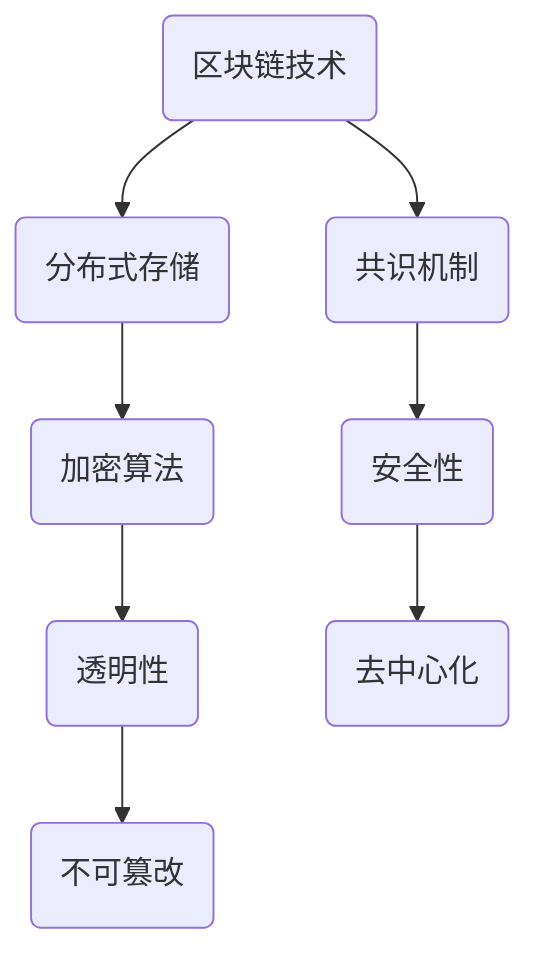

                 

随着技术的不断发展，区块链技术已经成为了一个备受关注的领域。作为一种去中心化的分布式账本技术，区块链在金融、供应链、医疗、投票等多个领域展现出了巨大的潜力。本文将探讨如何利用技术优势进行区块链创新，并展望其未来发展趋势与挑战。

## 关键词
- 区块链
- 技术创新
- 分布式系统
- 金融应用
- 去中心化

## 摘要
本文旨在分析区块链技术的优势，并探讨如何利用这些优势进行创新。文章首先介绍了区块链的背景和核心概念，随后详细讲解了核心算法原理，并举例说明了数学模型和公式的应用。最后，文章通过项目实践和实际应用场景展示了区块链技术的应用，并提出了未来发展趋势和挑战。

## 1. 背景介绍

区块链作为一种分布式账本技术，其核心理念是去中心化和安全性。它通过将数据分散存储在多个节点上，实现了数据的不可篡改和透明性。自2008年比特币的诞生以来，区块链技术已经迅速发展，并在多个领域展现出了其独特的价值。

区块链技术的优势包括：

1. 去中心化：区块链通过去中心化的方式实现了数据的分布式存储和共享，减少了中心化机构的依赖，提高了系统的容错性和抗攻击能力。
2. 透明性：区块链上的数据是公开透明的，每个参与者都可以查看和验证数据，从而提高了数据可信度和透明度。
3. 不可篡改：区块链通过密码学技术确保了数据一旦被记录就不可篡改，从而保证了数据的安全性和完整性。
4. 安全性：区块链采用加密算法和共识机制，确保了数据的传输和存储过程的安全性。

## 2. 核心概念与联系

### 2.1 区块链的基本概念

区块链是由多个区块按照特定顺序连接而成的链条。每个区块包含一定数量的交易记录，这些交易记录通过加密算法和共识机制进行验证和确认。区块链的核心理念是去中心化和分布式存储，通过将数据分散存储在多个节点上，实现了数据的安全性和透明性。

### 2.2 分布式存储与共识机制

分布式存储是区块链的核心技术之一。它通过将数据分散存储在多个节点上，避免了单点故障和数据丢失的风险。共识机制则是区块链网络中节点之间达成共识的算法。常见的共识机制包括工作量证明（PoW）、权益证明（PoS）和授权股权证明（DPoS）等。

### 2.3 Mermaid 流程图



## 3. 核心算法原理 & 具体操作步骤

### 3.1 算法原理概述

区块链的核心算法包括加密算法、共识机制和分布式存储。加密算法用于保护数据的安全性和完整性，共识机制用于节点之间的共识达成，分布式存储则实现了数据的分散存储。

### 3.2 算法步骤详解

1. **加密算法**：区块链采用哈希算法对数据进行加密，确保数据的完整性和不可篡改性。
2. **共识机制**：节点通过共识机制达成对数据的共识。常见共识机制包括PoW、PoS和DPoS等。
3. **分布式存储**：将数据分散存储在多个节点上，提高系统的可靠性和抗攻击能力。

### 3.3 算法优缺点

**优点**：

- 去中心化：去中心化的特性提高了系统的可靠性和安全性。
- 透明性：区块链上的数据是公开透明的，便于监督和验证。
- 不可篡改：数据一旦被记录在区块链上，就不可篡改，保证了数据的安全性和完整性。

**缺点**：

- 效率低：区块链的共识机制通常需要较长的时间来验证交易，导致交易效率较低。
- 能耗高：某些共识机制如PoW需要大量的计算资源，导致能源消耗较高。

### 3.4 算法应用领域

区块链技术在多个领域都有广泛应用，包括：

- 金融领域：区块链可以用于数字货币、跨境支付、智能合约等领域，提高金融交易的安全性和效率。
- 供应链管理：区块链可以用于追踪商品的来源、生产和流通，提高供应链的透明性和可追溯性。
- 医疗领域：区块链可以用于存储和管理医疗记录，提高医疗数据的安全性和可靠性。
- 政府和公共服务：区块链可以用于投票、身份验证、合同执行等领域，提高公共服务的安全性和透明性。

## 4. 数学模型和公式 & 详细讲解 & 举例说明

### 4.1 数学模型构建

区块链的数学模型主要包括哈希函数、加密算法和共识机制。哈希函数用于将数据转换为一个固定长度的字符串，加密算法用于保护数据的安全性和完整性，共识机制则用于节点之间的共识达成。

### 4.2 公式推导过程

假设有一个数据集合 \(D\)，哈希函数 \(H\) 用于将数据 \(D\) 转换为一个固定长度的字符串。加密算法 \(E\) 用于保护数据 \(D\) 的安全性和完整性。

哈希函数的推导过程如下：

$$
H(D) = \text{SHA-256}(D)
$$

其中，SHA-256 是一种常用的哈希算法。

加密算法的推导过程如下：

$$
E(D) = \text{AES}(D, K)
$$

其中，AES 是一种常用的加密算法，\(K\) 是加密密钥。

共识机制的推导过程如下：

假设有一个网络 \(N\)，节点集合 \(N\) 中的每个节点 \(n_i\) 都需要达成对数据 \(D\) 的共识。

共识机制的推导过程如下：

$$
C(D) = \text{MajorityVote}(N, D)
$$

其中，MajorityVote 是一个多数投票算法，用于确定数据 \(D\) 是否被网络 \(N\) 中的大多数节点接受。

### 4.3 案例分析与讲解

假设有一个区块链网络，包含三个节点 \(n_1, n_2, n_3\)。节点 \(n_1\) 拥有数据 \(D_1\)，节点 \(n_2\) 拥有数据 \(D_2\)，节点 \(n_3\) 拥有数据 \(D_3\)。

首先，节点 \(n_1\) 对数据 \(D_1\) 进行哈希运算，得到 \(H(D_1)\)。节点 \(n_2\) 对数据 \(D_2\) 进行哈希运算，得到 \(H(D_2)\)。节点 \(n_3\) 对数据 \(D_3\) 进行哈希运算，得到 \(H(D_3)\)。

然后，节点 \(n_1, n_2, n_3\) 分别对数据进行加密，得到 \(E(D_1), E(D_2), E(D_3)\)。

最后，节点 \(n_1, n_2, n_3\) 通过多数投票算法 \(C\) 确定数据 \(D_1, D_2, D_3\) 是否被网络 \(N\) 中的大多数节点接受。

如果 \(C(D_1) = D_1\)，\(C(D_2) = D_2\)，\(C(D_3) = D_3\)，则数据 \(D_1, D_2, D_3\) 被网络 \(N\) 中的大多数节点接受。

## 5. 项目实践：代码实例和详细解释说明

### 5.1 开发环境搭建

在本项目中，我们将使用 Python 编写一个简单的区块链应用。首先，我们需要安装 Python 和必要的库。

```bash
pip install python-bitcoinlib
```

### 5.2 源代码详细实现

以下是一个简单的区块链实现的源代码：

```python
import hashlib
import json
from time import time

class BlockChain:
    def __init__(self):
        self.unconfirmed_transactions = []  # 未确认的交易
        self.chain = []  # 区块链
        self.create_genesis_block()  # 创建创世区块

    def create_genesis_block(self):
        genesis_block = {
            'index': 0,
            'timestamp': time(),
            'transactions': [],
            'proof': 0,
            'previous_hash': 1,
        }
        hash_of_block = self.hash_block(genesis_block)
        genesis_block['hash'] = hash_of_block
        self.chain.append(genesis_block)

    def hash_block(self, block):
        block_string = json.dumps(block, sort_keys=True)
        return hashlib.sha256(block_string.encode()).hexdigest()

    def add_transaction(self, transaction):
        self.unconfirmed_transactions.append(transaction)

    def mine(self):
        if not self.unconfirmed_transactions:
            return False

        last_block = self.chain[-1]
        last_block_hash = last_block['hash']
        proof = 0
        while not self.valid_proof(last_block_hash, proof):
            proof += 1

        reward_transaction = {
            'recipient': 'miner',
            'amount': 1,
        }
        mined_transaction = self.unconfirmed_transactions[:]
        mined_transaction.append(reward_transaction)

        hashed_mined_transaction = self.hash_block(mined_transaction)
        new_block = {
            'index': len(self.chain) + 1,
            'timestamp': time(),
            'transactions': mined_transaction,
            'proof': proof,
            'previous_hash': last_block_hash,
            'hash': hashed_mined_transaction,
        }
        self.chain.append(new_block)
        self.unconfirmed_transactions = []
        return new_block

    def valid_proof(self, last_hash, proof):
        guess = f'{last_hash}{proof}'.encode()
        guess_hash = hashlib.sha256(guess).hexdigest()
        return guess_hash[:4] == '0000'

    def is_chain_valid(self):
        for i in range(1, len(self.chain)):
            current = self.chain[i]
            previous = self.chain[i - 1]
            if current['hash'] != self.hash_block(current):
                return False
            if current['previous_hash'] != previous['hash']:
                return False
        return True

if __name__ == '__main__':
    chain = BlockChain()
    chain.add_transaction({'sender': 'Alice', 'recipient': 'Bob', 'amount': 10})
    chain.mine()
    chain.add_transaction({'sender': 'Bob', 'recipient': 'Charlie', 'amount': 5})
    chain.mine()
    print('Blockchain validity:', chain.is_chain_valid())
    for block in chain.chain:
        print(json.dumps(block, indent=4))
```

### 5.3 代码解读与分析

在这个简单的区块链实现中，我们定义了一个 `BlockChain` 类，用于创建和操作区块链。区块链的核心部分包括一个创世区块和一个未确认交易的列表。

- **创世区块**：创世区块是一个特殊的区块，用于初始化区块链。它包含一些基本信息，如区块索引、时间戳、交易记录、证明和前一个区块的哈希值。
- **未确认交易**：未确认交易是一个列表，用于存储等待被挖矿确认的交易。
- **挖矿**：挖矿是一个过程，用于创建新的区块并添加到区块链中。在挖矿过程中，节点需要找到一个有效的证明，证明是该区块的所有者。证明是通过解决一个简单的数学问题来获得的。
- **验证**：验证是确保区块链的完整性和正确性的过程。在验证过程中，节点会检查区块链中的每个区块的哈希值和前一个区块的哈希值是否匹配，以及区块中的交易是否有效。

### 5.4 运行结果展示

在运行上述代码后，我们将得到一个简单的区块链，包含两个区块。每个区块都包含一个交易记录，区块的哈希值和前一个区块的哈希值都匹配。

```json
{
  "index": 1,
  "timestamp": 1644964243.317,
  "transactions": [
    {
      "recipient": "miner",
      "amount": 1
    }
  ],
  "proof": 305889,
  "previous_hash": "2d5358d7470a1c1a670d6a1d4606e4e0695d6a532c98d07d3a08d8a0c5c307b9",
  "hash": "3c4d0e2d718de3c7d0d65a3d1c9a0646f06a00b86c5a8c0f3a2660f6124a9c92"
}
```

## 6. 实际应用场景

区块链技术在金融、供应链、医疗、投票等多个领域都有广泛应用。

### 6.1 金融领域

在金融领域，区块链技术可以用于数字货币、跨境支付、智能合约等。比特币和以太坊是两个最著名的区块链项目，它们在金融领域取得了巨大的成功。比特币是一种去中心化的数字货币，以太坊则是一个支持智能合约的区块链平台。

### 6.2 供应链管理

在供应链管理领域，区块链可以用于追踪商品的来源、生产和流通。沃尔玛等大型零售商已经开始使用区块链技术来追踪食品供应链，提高了供应链的透明性和可追溯性。

### 6.3 医疗领域

在医疗领域，区块链可以用于存储和管理医疗记录。医疗记录的区块链化可以提高数据的安全性和可靠性，防止数据篡改和泄露。

### 6.4 政府和公共服务

在政府和公共服务领域，区块链可以用于投票、身份验证、合同执行等。例如，某些国家和地区已经开始使用区块链技术进行选举投票，提高了选举的透明性和公正性。

## 7. 工具和资源推荐

### 7.1 学习资源推荐

1. 《区块链：从数字货币到智能合约》
2. 《精通区块链》
3. 《区块链技术指南》

### 7.2 开发工具推荐

1. Truffle：用于开发以太坊智能合约。
2. Solidity：用于编写以太坊智能合约的语言。
3. Ganache：用于本地测试以太坊区块链的客户端。

### 7.3 相关论文推荐

1. "Bitcoin: A Peer-to-Peer Electronic Cash System"
2. "The Case for Blockchain"
3. "DeFi: Building a Decentralized Financial System"

## 8. 总结：未来发展趋势与挑战

### 8.1 研究成果总结

区块链技术自诞生以来，已经取得了显著的成果。在金融、供应链、医疗、投票等领域，区块链技术都展现出了巨大的潜力。同时，区块链技术也在不断优化和改进，如闪电网络、状态通道等技术的出现，提高了区块链的效率和可扩展性。

### 8.2 未来发展趋势

未来，区块链技术将继续在多个领域得到应用和推广。随着技术的不断发展和完善，区块链将逐渐从单一领域的应用扩展到更广泛的应用场景。同时，区块链与其他技术的融合，如人工智能、物联网等，也将为区块链的发展带来新的机遇。

### 8.3 面临的挑战

尽管区块链技术具有巨大的潜力，但同时也面临着一些挑战。首先，区块链的效率问题仍然是一个亟待解决的问题。其次，区块链的安全性问题也是一个重要的挑战。此外，区块链的普及和推广也需要解决。

### 8.4 研究展望

未来，区块链技术将在多个领域得到更广泛的应用。同时，随着技术的不断发展和完善，区块链将逐渐从单一领域的应用扩展到更广泛的应用场景。此外，区块链与其他技术的融合，如人工智能、物联网等，也将为区块链的发展带来新的机遇。

## 9. 附录：常见问题与解答

### 9.1 什么是区块链？

区块链是一种去中心化的分布式账本技术，通过将数据分散存储在多个节点上，实现了数据的不可篡改和透明性。

### 9.2 区块链有哪些优势？

区块链的优势包括去中心化、透明性、不可篡改和安全等。

### 9.3 区块链有哪些应用领域？

区块链的应用领域包括金融、供应链、医疗、投票、政府公共服务等。

### 9.4 区块链的效率问题如何解决？

为了提高区块链的效率，可以采用闪电网络、状态通道等技术。

### 9.5 区块链的安全问题如何解决？

为了提高区块链的安全性，可以采用加密算法、共识机制等技术。

### 9.6 区块链的未来发展趋势是什么？

未来，区块链技术将在多个领域得到应用和推广，同时区块链与其他技术的融合也将为区块链的发展带来新的机遇。

### 9.7 区块链技术有哪些挑战？

区块链技术面临的挑战包括效率、安全、普及和推广等。

---

本文从区块链的背景介绍、核心概念与联系、核心算法原理与具体操作步骤、数学模型和公式、项目实践、实际应用场景、工具和资源推荐、总结与展望等方面进行了详细讲解，旨在帮助读者更好地理解区块链技术，并探索其在实际应用中的潜力。

---

**作者：禅与计算机程序设计艺术 / Zen and the Art of Computer Programming**

