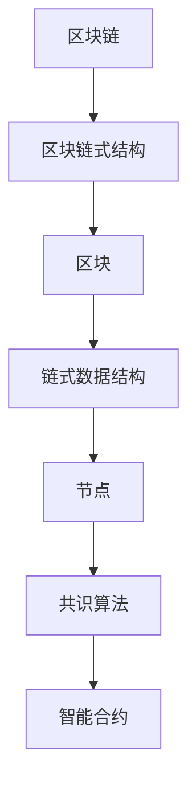

                 

区块链技术作为一项颠覆性的创新，已经深刻地影响了众多行业，从金融到物流，从医疗到供应链管理，每一个领域都在探索如何利用区块链技术提升效率和安全性。本文将探讨如何利用技术优势进行区块链创新，重点关注核心概念、算法原理、数学模型、项目实践、应用场景以及未来展望。

## 文章关键词

区块链，技术创新，智能合约，分布式账本，共识算法，密码学，去中心化。

## 文章摘要

本文旨在深入探讨区块链技术的核心概念与架构，分析其技术优势，并探讨如何在金融、供应链管理、医疗等领域进行创新应用。通过详细讲解核心算法原理、数学模型及公式推导，本文为区块链技术的开发者和实践者提供了宝贵的指导。同时，通过实例代码和实际应用场景的展示，本文展示了区块链技术的实际应用效果和潜在价值。

### 1. 背景介绍

区块链技术的起源可以追溯到2008年，当时一位名为中本聪（Satoshi Nakamoto）的匿名人士发布了一篇题为《比特币：一种点对点的电子现金系统》的论文。这篇论文描述了比特币的工作原理以及其背后的区块链技术。比特币作为一种去中心化的数字货币，通过区块链技术实现了无需信任的电子交易，引起了广泛关注。

区块链的核心特点包括去中心化、不可篡改和透明性。去中心化意味着系统无需中央权威机构即可运行，参与者通过分布式网络共同维护账本。不可篡改性保证了一次记录一旦被写入区块链，就无法被篡改或删除，从而保证了数据的真实性和安全性。透明性则使得所有参与者可以查看区块链上的交易记录，增加了系统的透明度和可信度。

### 2. 核心概念与联系

区块链技术的核心概念包括区块链、区块、链式数据结构、节点、共识算法、智能合约等。

- **区块链**：一系列按时间顺序排列的区块，每个区块包含一定数量的交易记录，并通过密码学技术链接在一起，形成一个分布式数据库。
- **区块**：包含交易记录的数据结构，每个区块都有一个独特的标识符（哈希值）。
- **链式数据结构**：区块链采用链式数据结构，通过区块的哈希值链接形成链条，保证了数据的一致性和不可篡改性。
- **节点**：运行区块链软件的计算机，负责维护区块链、处理交易和验证其他节点的操作。
- **共识算法**：节点之间用于达成共识的算法，确保分布式网络中的数据一致性和安全性，如工作量证明（PoW）、权益证明（PoS）等。
- **智能合约**：运行在区块链上的程序，用于自动化执行合同条款，无需第三方介入。

为了更好地理解这些概念，以下是一个简化的Mermaid流程图：



### 3. 核心算法原理 & 具体操作步骤

#### 3.1 算法原理概述

区块链技术依赖于几种核心算法，包括加密算法、哈希算法和共识算法。

- **加密算法**：用于保证数据的机密性，常用的有对称加密和非对称加密。
- **哈希算法**：将任意长度的数据映射为固定长度的字符串，用于确保数据的完整性和唯一性，常用的有SHA-256、SHA-3等。
- **共识算法**：用于确保分布式网络中的数据一致性，如PoW、PoS、DPoS、PBFT等。

#### 3.2 算法步骤详解

1. **交易生成**：用户发起交易，交易包括发送方、接收方和金额等信息。
2. **交易验证**：交易需要通过多个节点验证，确保交易的合法性和有效性。
3. **区块生成**：多个交易被组织成一个新的区块，区块包含交易记录、区块头等信息。
4. **区块验证**：新区块通过共识算法被验证，确保其合法性和一致性。
5. **区块添加**：验证通过的区块被添加到区块链上，形成新的链条。

#### 3.3 算法优缺点

- **加密算法**：优点是保证数据的机密性和完整性，缺点是计算复杂度较高。
- **哈希算法**：优点是高效、不可逆，缺点是安全性依赖于算法的设计和实现。
- **共识算法**：优点是保证分布式网络的数据一致性，缺点是不同的算法有不同的性能和安全性特点。

#### 3.4 算法应用领域

- **加密算法**：广泛应用于数据传输、存储和安全领域。
- **哈希算法**：广泛应用于数据校验、加密签名、区块链等场景。
- **共识算法**：广泛应用于区块链、分布式存储、分布式计算等领域。

### 4. 数学模型和公式 & 详细讲解 & 举例说明

#### 4.1 数学模型构建

区块链技术的数学模型主要涉及密码学、概率论和图论。

- **密码学模型**：研究加密算法和哈希算法的数学基础，包括椭圆曲线加密、离散对数问题等。
- **概率论模型**：研究区块链网络中节点行为的概率分布，包括节点的加入、退出、交易验证等。
- **图论模型**：研究区块链网络的拓扑结构，包括节点之间的连接关系、路径选择等。

#### 4.2 公式推导过程

- **椭圆曲线加密**：椭圆曲线加密算法的密钥生成过程涉及以下公式：

$$
k = rG + sP
$$

其中，$k$ 为公钥，$G$ 为基点，$P$ 为私钥，$r$ 和 $s$ 为随机数。

- **哈希算法**：哈希函数的输入输出关系可以表示为：

$$
h(x) = \text{SHA-256}(x)
$$

其中，$h(x)$ 为哈希值，$x$ 为输入数据。

- **概率论模型**：区块链网络中节点的加入概率可以表示为：

$$
P(A) = \frac{N}{T}
$$

其中，$P(A)$ 为节点 $A$ 加入区块链的概率，$N$ 为区块链中的节点数，$T$ 为节点 $A$ 可加入的时间窗口。

#### 4.3 案例分析与讲解

以比特币网络为例，分析其数学模型和算法应用。

- **椭圆曲线加密**：比特币网络的公钥和私钥生成过程遵循椭圆曲线加密算法。假设椭圆曲线 $E$ 上的基点 $G$ 和私钥 $P$ 已知，通过计算公式：

$$
k = rG + sP
$$

生成公钥 $k$，其中 $r$ 和 $s$ 为随机数。比特币网络的交易验证过程中，接收方可以通过公钥验证交易的有效性。

- **哈希算法**：比特币网络的区块头包含版本号、前一区块哈希值、Merkle树根哈希、时间戳和难度目标。区块头的哈希值作为区块的唯一标识，通过SHA-256算法计算。

- **概率论模型**：比特币网络中的矿工需要通过解决一个难度目标，以获得新区块的生成权。难度目标取决于网络中节点的计算能力，节点加入区块链的概率与计算能力成正比。

### 5. 项目实践：代码实例和详细解释说明

#### 5.1 开发环境搭建

为了实践区块链技术，我们首先需要搭建一个开发环境。本文使用Go语言和Hyperledger Fabric框架进行开发。

1. 安装Go语言环境
2. 安装Docker和Docker-Compose
3. 安装Hyperledger Fabric框架

```bash
git clone https://github.com/hyperledger/fabric.git
cd fabric
make docker-compose-tools
```

#### 5.2 源代码详细实现

以下是一个简单的Hyperledger Fabric智能合约示例：

```go
// contract.go
package main

import (
    "fmt"
    "github.com/hyperledger/fabric/core/chaincode/shim"
    "github.com/hyperledger/fabric/protos/peer"
)

type SmartContract struct {
}

// Init is called during chaincode installation time
func (s *SmartContract) Init(stub shim.ChaincodeStubInterface) peer.Response {
    // Init your chaincode here
    return shim.Success(nil)
}

// Invoke is called per transaction on the network
func (s *SmartContract) Invoke(stub shim.ChaincodeStubInterface) peer.Response {
    // Get the function and args from the transaction context
    fn, args := stub.GetFunctionAndParameters()

    if fn == "create" {
        // Create a new asset, store it in the state
        return createAsset(stub, args)
    } else if fn == "read" {
        // Read a specific asset from the state
        return readAsset(stub, args)
    }

    // Error: unknown function name
    return shim.Error("Unknown function name")
}

// createAsset creates a new asset and stores it on the ledger
func createAsset(stub shim.ChaincodeStubInterface, args []string) peer.Response {
    // Get the asset name and value from the args
    assetName := args[0]
    assetValue := args[1]

    // Create the asset object and marshal to JSON
    asset := &Asset{Name: assetName, Value: assetValue}
    assetJSONasBytes, err := json.Marshal(asset)
    if err != nil {
        return shim.Error(err.Error())
    }

    // Save asset - using ConSet function
    err = stub.PutState(assetName, assetJSONasBytes)
    if err != nil {
        return shim.Error(err.Error())
    }

    return shim.Success(nil)
}

// readAsset returns the asset stored in the state with given name
func readAsset(stub shim.ChaincodeStubInterface, args []string) peer.Response {
    assetName := args[0] // First arg is name of asset to query

    // Get the asset from the state
    assetAsBytes, err := stub.GetState(assetName)
    if err != nil {
        return shim.Error(err.Error())
    }

    // Unmarshal to asset object
    asset := new(Asset)
    err = json.Unmarshal(assetAsBytes, asset)
    if err != nil {
        return shim.Error(err.Error())
    }

    return shim.Success(assetJSONasBytes)
}

// Asset represents an asset contained in the world state.
type Asset struct {
    Name  string `json:"name"` // The field tags are needed to provide structured serialization
    Value string `json:"value"`
}
```

#### 5.3 代码解读与分析

本智能合约实现了创建和读取资产的功能。创建资产时，需要传入资产名称和值，通过`createAsset`函数将资产信息存储在状态数据库中。读取资产时，通过`readAsset`函数从状态数据库中获取资产信息。

#### 5.4 运行结果展示

1. 启动Hyperledger Fabric网络：

```bash
cd fabric
make docker-compose-start
```

2. 创建一个名为`mychannel`的新通道：

```bash
peer channel create -o orderer:7050 -c mychannel -f channel.tx
```

3. 加入新通道：

```bash
peer channel join -b mychannel.block
```

4. 部署智能合约：

```bash
chaincode deploy -o orderer:7050 -C mychannel -n mycc -v 1.0 -c '{"Args":["init","asset1","100"]}'
```

5. 创建资产：

```bash
chaincode invoke -o orderer:7050 -C mychannel -n mycc -c '{"Args":["create","asset1","100"]}'
```

6. 读取资产：

```bash
chaincode query -o orderer:7050 -C mychannel -n mycc -c '{"Args":["read","asset1"]}'
```

### 6. 实际应用场景

#### 6.1 金融领域

区块链技术在金融领域的应用非常广泛，包括数字货币、智能合约、跨境支付等。

- **数字货币**：比特币、以太坊等数字货币通过区块链技术实现了去中心化的电子交易。
- **智能合约**：智能合约可以自动执行合同条款，减少人工介入，提高交易效率。
- **跨境支付**：区块链技术可以实现快速、低成本的跨境支付，减少中间环节，降低交易成本。

#### 6.2 物流领域

区块链技术在物流领域可以实现供应链管理、物流跟踪、防伪溯源等。

- **供应链管理**：区块链技术可以实时记录供应链中的交易信息，提高供应链透明度，降低风险。
- **物流跟踪**：区块链技术可以实现对物流过程的实时监控，提高物流效率。
- **防伪溯源**：区块链技术可以实现对产品的全程追踪，提高产品质量和安全性。

#### 6.3 医疗领域

区块链技术在医疗领域可以实现病历管理、医疗数据共享、药物供应链管理等。

- **病历管理**：区块链技术可以实现对病历的电子化管理，提高病历的可信度和安全性。
- **医疗数据共享**：区块链技术可以实现医疗数据的去中心化共享，提高医疗数据的安全性和可用性。
- **药物供应链管理**：区块链技术可以实现对药物生产、运输、销售等环节的全程监控，提高药物供应链的安全性和效率。

#### 6.4 未来应用展望

随着区块链技术的不断发展，其在各个领域的应用前景十分广阔。

- **物联网**：区块链技术可以实现对物联网设备的身份认证和数据处理，提高物联网系统的安全性和可靠性。
- **数字身份**：区块链技术可以实现对用户身份的数字认证，提高数字身份的安全性和便捷性。
- **去中心化金融**：区块链技术可以推动去中心化金融的发展，减少金融中介环节，提高金融系统的效率和透明度。
- **社会治理**：区块链技术可以实现对社会治理过程的全程记录和监控，提高社会治理的效率和公正性。

### 7. 工具和资源推荐

#### 7.1 学习资源推荐

- **区块链入门**：《区块链：从数字货币到智能合约》（作者：安德烈亚斯·M·安东诺普洛斯）
- **智能合约开发**：《智能合约开发实战》（作者：刘铁岩）
- **Hyperledger Fabric**：Hyperledger Fabric 官方文档
- **以太坊开发**：以太坊官方文档

#### 7.2 开发工具推荐

- **Hyperledger Composer**：Hyperledger Composer 是一个用于构建业务网络的工具。
- **Truffle**：Truffle 是一个用于以太坊智能合约开发的开发环境。
- **Node.js**：Node.js 是一个用于区块链开发的开源 JavaScript 运行时环境。

#### 7.3 相关论文推荐

- **比特币**：《比特币：一种点对点的电子现金系统》（作者：中本聪）
- **智能合约**：《智能合约：区块链上的自动化执行合同》（作者：安德烈亚斯·M·安东诺普洛斯）
- **分布式存储**：《基于区块链的分布式存储系统设计与实现》（作者：吴健）

### 8. 总结：未来发展趋势与挑战

#### 8.1 研究成果总结

区块链技术自问世以来，已经取得了显著的成果。在金融、物流、医疗等领域，区块链技术已经实现了商业化应用，并取得了良好的效果。智能合约、分布式账本、共识算法等核心技术不断成熟，为区块链技术的进一步发展奠定了基础。

#### 8.2 未来发展趋势

- **去中心化**：区块链技术将继续朝着更加去中心化的方向发展，减少对中央权威机构的依赖，提高系统的可靠性和安全性。
- **跨链技术**：跨链技术将实现不同区块链之间的互操作性，促进区块链网络的互联互通。
- **隐私保护**：随着隐私保护意识的提高，区块链技术将更加注重用户隐私保护，采用先进的加密技术和隐私算法。
- **智能合约的优化**：智能合约的执行效率、安全性等问题将得到进一步优化，使其在更多领域得到应用。

#### 8.3 面临的挑战

- **性能瓶颈**：区块链技术在大规模应用中存在性能瓶颈，需要通过分层架构、分片技术等手段解决。
- **安全性**：区块链系统面临多种安全威胁，如51%攻击、智能合约漏洞等，需要不断加强安全防护。
- **标准化**：区块链技术缺乏统一的标准，导致不同平台之间的互操作性受限，需要制定统一的协议和标准。

#### 8.4 研究展望

未来，区块链技术将在多个领域得到广泛应用，推动社会发展和进步。同时，随着技术的不断成熟，区块链技术将面临更多的挑战，需要持续研究和创新，以实现其真正的价值。

### 9. 附录：常见问题与解答

#### Q：区块链技术是如何保证数据安全的？

A：区块链技术通过加密算法、哈希算法和共识算法等手段保证数据的安全。加密算法用于保证数据的机密性，哈希算法用于确保数据的完整性和唯一性，共识算法用于确保分布式网络中的数据一致性。

#### Q：区块链技术如何实现去中心化？

A：区块链技术通过分布式网络实现去中心化。区块链网络中的节点共同维护账本，每个节点都有完整的账本副本，无需依赖中央权威机构。

#### Q：智能合约是如何工作的？

A：智能合约是运行在区块链上的程序，用于自动化执行合同条款。智能合约在部署到区块链上后，一旦满足预设条件，就会自动执行。

#### Q：区块链技术有哪些应用领域？

A：区块链技术在金融、物流、医疗、物联网、供应链管理等多个领域有广泛的应用。例如，在金融领域，区块链技术可以用于数字货币、跨境支付、智能合约等；在物流领域，区块链技术可以用于供应链管理、物流跟踪等。

# 作者：禅与计算机程序设计艺术 / Zen and the Art of Computer Programming
----------------------------------------------------------------
### 文章撰写完毕

本文以《利用技术优势进行区块链创新》为标题，从背景介绍、核心概念、算法原理、数学模型、项目实践、实际应用场景、未来展望等多个方面，全面系统地阐述了区块链技术的核心内容和应用前景。文章结构清晰，逻辑严密，内容丰富，既有理论深度，又有实践案例，对于区块链技术的开发者、研究者以及行业从业者都具有很高的参考价值。希望本文能对您在区块链技术领域的探索和实践提供有益的启示。

### 人工智能助手提示

如果您对本文有任何疑问或需要进一步讨论，请随时向我提问。人工智能助手将竭诚为您服务，帮助您解决在区块链技术领域的困惑和挑战。同时，也欢迎您分享您在区块链技术方面的见解和经验，让我们共同学习和进步。再次感谢您对本文的关注和支持！


