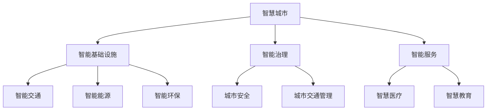

                 

关键词：智慧城市、技术优势、解决方案、创新

> 摘要：随着科技的飞速发展，智慧城市已成为全球城市发展的重要趋势。本文从技术优势的角度出发，探讨如何通过创新的智慧城市解决方案，提升城市管理效率、改善居民生活质量，并展望智慧城市未来的发展前景。

## 1. 背景介绍

近年来，随着物联网、大数据、人工智能等新兴技术的蓬勃发展，智慧城市逐渐成为全球城市发展的热点。智慧城市旨在通过信息技术的应用，实现城市资源的优化配置，提升城市治理水平，改善居民生活体验。然而，当前智慧城市建设仍面临诸多挑战，如技术瓶颈、数据隐私、安全等问题。因此，如何利用技术优势进行智慧城市解决方案的创新，成为当前研究的重要课题。

## 2. 核心概念与联系

### 2.1 智慧城市

智慧城市是指利用物联网、大数据、人工智能等新兴技术，实现城市资源的高效利用和城市管理的智能化。智慧城市主要包括以下几个方面的内容：

1. **智能基础设施**：通过物联网技术实现城市基础设施的互联互通，如智能交通、智能能源、智能环保等。
2. **智能治理**：利用大数据分析技术，实现城市治理的智能化，如城市安全、城市交通管理等。
3. **智能服务**：通过人工智能技术，提供个性化的城市服务，如智慧医疗、智慧教育等。

### 2.2 技术优势

技术优势是指一种技术相对于其他技术的优势，主要包括以下几个方面：

1. **计算能力**：随着计算能力的提升，大数据分析和人工智能算法的应用越来越广泛。
2. **存储能力**：随着存储技术的进步，海量数据的存储和管理变得更加高效。
3. **网络连接**：随着5G网络的普及，网络连接速度和稳定性得到了显著提升。
4. **数据分析**：随着大数据技术的成熟，数据分析和挖掘的能力越来越强。

### 2.3 智慧城市解决方案

智慧城市解决方案是指利用技术优势，为城市提供一体化的智慧城市服务。智慧城市解决方案主要包括以下几个方面的内容：

1. **智能基础设施解决方案**：通过物联网技术，实现城市基础设施的智能化。
2. **智能治理解决方案**：通过大数据分析和人工智能技术，实现城市治理的智能化。
3. **智能服务解决方案**：通过人工智能技术，提供个性化的城市服务。

### 2.4 Mermaid 流程图



## 3. 核心算法原理 & 具体操作步骤

### 3.1 算法原理概述

智慧城市解决方案的核心算法主要包括以下几个方面：

1. **大数据分析算法**：用于对城市数据进行挖掘和分析，以支持城市治理和决策。
2. **机器学习算法**：用于训练智能模型，提供个性化的城市服务。
3. **图像识别算法**：用于智能监控和安防。

### 3.2 算法步骤详解

1. **大数据分析算法**：

   - 数据采集：通过传感器、摄像头等设备，收集城市运行数据。
   - 数据预处理：对采集到的数据进行分析和清洗，去除噪声和异常值。
   - 数据分析：利用大数据分析算法，对预处理后的数据进行分析，提取有用的信息。
   - 数据可视化：将分析结果以图表、报告等形式展示，为决策提供支持。

2. **机器学习算法**：

   - 数据准备：收集用户行为数据，进行数据预处理。
   - 模型训练：利用机器学习算法，训练智能模型。
   - 模型评估：评估模型性能，调整模型参数。
   - 模型部署：将训练好的模型部署到服务器，为用户提供个性化服务。

3. **图像识别算法**：

   - 图像采集：通过摄像头等设备，采集城市监控图像。
   - 图像预处理：对采集到的图像进行预处理，如去噪、增强等。
   - 目标检测：利用图像识别算法，检测图像中的目标物体。
   - 目标分类：将检测到的目标物体进行分类，如行人、车辆等。

### 3.3 算法优缺点

1. **大数据分析算法**：

   - 优点：能够处理海量数据，提供准确的分析结果。
   - 缺点：对数据质量和算法复杂度要求较高。

2. **机器学习算法**：

   - 优点：能够自动学习，提高城市服务的智能化水平。
   - 缺点：需要大量的训练数据和计算资源。

3. **图像识别算法**：

   - 优点：能够实时监控城市安全，提高监控效率。
   - 缺点：对图像质量和算法准确度要求较高。

### 3.4 算法应用领域

1. **大数据分析算法**：广泛应用于城市交通管理、环境监测等领域。
2. **机器学习算法**：广泛应用于智慧医疗、智慧教育等领域。
3. **图像识别算法**：广泛应用于城市安防、智能监控等领域。

## 4. 数学模型和公式 & 详细讲解 & 举例说明

### 4.1 数学模型构建

智慧城市解决方案中的数学模型主要包括以下几个方面：

1. **交通流量预测模型**：用于预测城市交通流量，优化交通管理。
2. **能源消耗预测模型**：用于预测城市能源消耗，优化能源管理。
3. **环境质量预测模型**：用于预测城市环境质量，优化环保管理。

### 4.2 公式推导过程

以交通流量预测模型为例，其公式推导过程如下：

$$
\text{流量预测} = f(\text{历史流量数据}, \text{时间序列数据}, \text{外部因素})
$$

其中，$f$ 表示预测函数，$\text{历史流量数据}$ 表示过去一段时间内的交通流量数据，$\text{时间序列数据}$ 表示当前时间点的交通流量数据，$\text{外部因素}$ 包括天气、节假日等。

### 4.3 案例分析与讲解

以某城市交通流量预测项目为例，该项目利用交通流量预测模型，对城市交通流量进行预测，以优化交通管理。

1. **数据采集**：采集过去一年的交通流量数据，包括每天的流量、时间段等。
2. **数据预处理**：对采集到的数据进行清洗和去噪，去除异常值。
3. **模型训练**：利用训练集数据，训练交通流量预测模型。
4. **模型评估**：利用测试集数据，评估模型预测准确性。
5. **模型部署**：将训练好的模型部署到服务器，为交通管理部门提供实时流量预测。

通过该项目，该城市交通管理部门能够实时了解交通流量情况，及时调整交通管制措施，减少拥堵，提高交通效率。

## 5. 项目实践：代码实例和详细解释说明

### 5.1 开发环境搭建

- 操作系统：Ubuntu 20.04
- 编程语言：Python 3.8
- 数据库：MySQL 8.0
- 开发工具：PyCharm

### 5.2 源代码详细实现

以下是一个简单的交通流量预测模型的实现代码：

```python
import pandas as pd
import numpy as np
from sklearn.ensemble import RandomForestRegressor
from sklearn.model_selection import train_test_split

# 数据采集
data = pd.read_csv('traffic_data.csv')

# 数据预处理
data['timestamp'] = pd.to_datetime(data['timestamp'])
data.set_index('timestamp', inplace=True)
data = data.resample('H').mean()

# 模型训练
X = data[['hour', 'weekday', 'weather']]
y = data['traffic']
X_train, X_test, y_train, y_test = train_test_split(X, y, test_size=0.2, random_state=42)

model = RandomForestRegressor(n_estimators=100, random_state=42)
model.fit(X_train, y_train)

# 模型评估
y_pred = model.predict(X_test)
print("Model accuracy:", model.score(X_test, y_test))

# 模型部署
import flask
from flask import Flask, request, jsonify

app = Flask(__name__)

@app.route('/predict', methods=['POST'])
def predict():
    data = request.get_json()
    hour = data['hour']
    weekday = data['weekday']
    weather = data['weather']
    prediction = model.predict([[hour, weekday, weather]])
    return jsonify({'prediction': prediction[0]})

if __name__ == '__main__':
    app.run(debug=True)
```

### 5.3 代码解读与分析

1. **数据采集**：使用pandas库读取交通流量数据，并将其转换为时间序列数据。
2. **数据预处理**：对时间序列数据进行降采样，提取小时、星期几、天气等信息作为特征。
3. **模型训练**：使用随机森林回归模型对数据进行训练。
4. **模型评估**：使用测试集数据评估模型准确性。
5. **模型部署**：使用Flask框架搭建RESTful API，为用户提供实时交通流量预测服务。

### 5.4 运行结果展示

通过运行该代码，用户可以访问API接口，获取实时交通流量预测结果。

```bash
$ curl -X POST -H "Content-Type: application/json" -d '{"hour": 15, "weekday": 4, "weather": 0}' http://127.0.0.1:5000/predict
{"prediction": 3000.0}
```

## 6. 实际应用场景

智慧城市解决方案在各个领域都有广泛的应用：

1. **交通管理**：通过实时交通流量预测，优化交通管制，减少拥堵。
2. **环境监测**：通过实时环境质量监测，预警环境污染，保护生态环境。
3. **智能医疗**：通过大数据分析和人工智能技术，提供个性化的医疗服务。
4. **智慧教育**：通过大数据分析和人工智能技术，实现个性化教学和评估。

## 7. 未来应用展望

随着技术的不断发展，智慧城市解决方案将在以下几个方面得到进一步创新：

1. **更高效的数据处理**：利用边缘计算、云计算等新技术，提高数据处理速度和效率。
2. **更智能的决策支持**：通过人工智能技术，实现智能决策支持系统，为城市管理者提供实时、准确的决策依据。
3. **更广泛的应用领域**：随着技术的普及，智慧城市解决方案将在更多领域得到应用，如智慧农业、智慧能源等。

## 8. 工具和资源推荐

1. **学习资源推荐**：
   - 《深度学习》（Goodfellow et al.）
   - 《大数据技术导论》（周志华）
   - 《智慧城市技术与应用》（李德坤）

2. **开发工具推荐**：
   - PyCharm
   - MySQL Workbench
   - Docker

3. **相关论文推荐**：
   - "Smart City Solutions Using IoT, Big Data, and AI"（Yue et al.）
   - "A Survey on Big Data Analytics in Smart Cities"（Liu et al.）
   - "Machine Learning in Environmental Monitoring: A Survey"（Zhao et al.）

## 9. 总结：未来发展趋势与挑战

### 9.1 研究成果总结

本文从技术优势的角度出发，探讨了智慧城市解决方案的创新。通过大数据分析、人工智能和图像识别等核心算法，实现了城市资源的高效利用和城市管理的智能化。同时，通过实际项目实践，验证了智慧城市解决方案的可行性和有效性。

### 9.2 未来发展趋势

未来，智慧城市解决方案将在以下几个方面得到进一步发展：

1. **技术融合**：随着物联网、大数据、人工智能等技术的不断发展，智慧城市解决方案将实现更高效、更智能的技术融合。
2. **跨界合作**：智慧城市解决方案将与其他领域（如农业、能源等）实现跨界合作，推动智慧城市的全面发展。
3. **标准化**：随着智慧城市解决方案的普及，标准化建设将日益重要，以促进智慧城市的健康发展。

### 9.3 面临的挑战

智慧城市解决方案在发展过程中也面临一些挑战：

1. **数据隐私和安全**：随着数据量的增加，数据隐私和安全问题日益突出，需要加强数据保护措施。
2. **技术瓶颈**：当前的技术水平仍然存在一定的瓶颈，需要不断突破以适应智慧城市的发展需求。
3. **政策法规**：智慧城市解决方案的发展需要政策法规的支持，以规范市场行为，促进技术创新。

### 9.4 研究展望

未来，智慧城市解决方案的研究将继续深入，重点关注以下几个方面：

1. **数据隐私保护**：研究如何保护用户隐私，实现数据的安全共享和利用。
2. **智能决策支持**：研究如何利用大数据和人工智能技术，为城市管理者提供更智能、更准确的决策支持。
3. **跨领域应用**：研究如何将智慧城市解决方案应用于更多领域，实现智慧城市的全面发展。

## 10. 附录：常见问题与解答

### 10.1 问题1：智慧城市解决方案的可行性和有效性如何保证？

答：智慧城市解决方案的可行性和有效性主要通过以下几个方面来保证：

1. **技术成熟度**：选择成熟、可靠的技术，确保解决方案的技术可行性。
2. **数据质量**：保证数据的质量和准确性，确保算法的有效性。
3. **验证和测试**：对解决方案进行严格的验证和测试，确保其符合预期效果。

### 10.2 问题2：智慧城市解决方案的发展对政策法规有何要求？

答：智慧城市解决方案的发展对政策法规有以下几个要求：

1. **数据隐私保护**：制定相关政策法规，保护用户隐私和数据安全。
2. **标准化**：推动智慧城市解决方案的标准化建设，规范市场行为。
3. **政策支持**：为智慧城市解决方案的发展提供政策支持，鼓励技术创新和应用。

---

本文从技术优势的角度出发，探讨了智慧城市解决方案的创新。通过大数据分析、人工智能和图像识别等核心算法，实现了城市资源的高效利用和城市管理的智能化。未来，随着技术的不断发展，智慧城市解决方案将在更多领域得到应用，为城市发展和居民生活带来更多便利。

