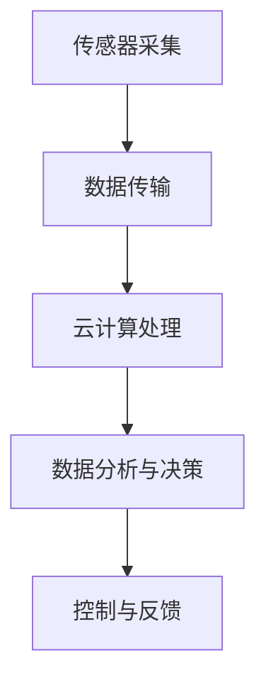
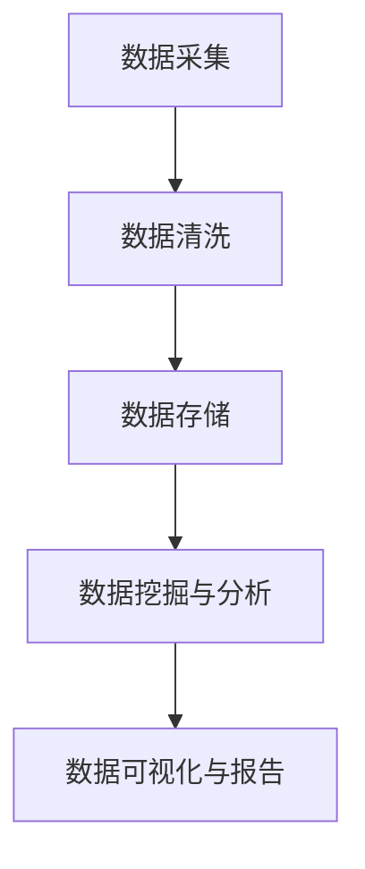
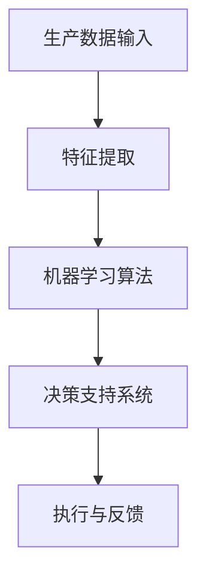
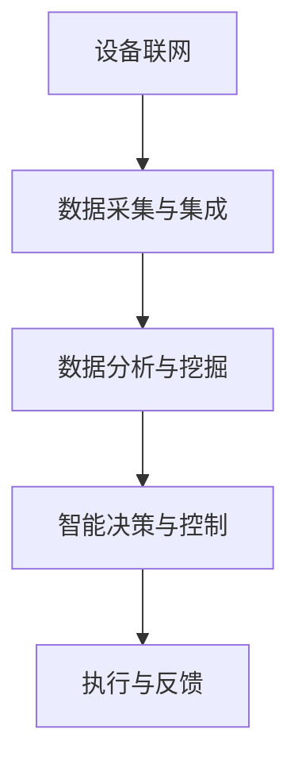

                 

关键词：智能工厂，技术创业，物联网，大数据，人工智能，工业4.0，数字化转型，创业策略，商业模式创新。

> 摘要：本文将探讨如何利用技术优势进行智能工厂创业。通过分析物联网、大数据、人工智能等核心技术，以及工业4.0背景下的行业趋势，我们将提出一种创新的商业模式，并分享创业实践中的关键步骤和经验。

## 1. 背景介绍

随着科技的飞速发展，尤其是物联网、大数据和人工智能等技术的成熟，全球制造业正在经历一场深刻的变革。这一变革被形象地称为“工业4.0”，它不仅推动了生产方式的革新，也催生了大量的创业机会。

工业4.0是一个基于信息物理系统（CPS）的概念，它旨在通过智能化和网络化将人、机器、数据和物品紧密连接起来，实现高度灵活的个性化制造。在这个背景下，智能工厂成为了制造企业转型的核心目标。

智能工厂的典型特征包括：
- 自动化生产线：采用机器人、自动化设备和智能传感器实现生产流程的自动化。
- 数据集成与分析：通过物联网和大数据技术，实时采集和分析生产过程中的数据。
- 个性化定制：根据客户需求，灵活调整生产线和生产方案。
- 智能决策：利用人工智能算法，优化生产计划、库存管理和供应链。

智能工厂的建设不仅提高了生产效率，还降低了成本，提升了产品质量，对企业的竞争力产生了深远影响。因此，许多创业者看到了其中的巨大商机，纷纷投身于智能工厂的创业浪潮中。

## 2. 核心概念与联系

### 2.1. 物联网

物联网（IoT）是智能工厂的基础设施，它通过传感器、网络和云计算等技术，实现设备、物品和系统的互联互通。以下是物联网在智能工厂中的应用流程：



### 2.2. 大数据

大数据技术在智能工厂中发挥着重要作用，它能够处理和分析来自传感器、设备、生产线的海量数据，提供有价值的信息支持。以下是大数据处理的基本流程：



### 2.3. 人工智能

人工智能（AI）在智能工厂中的应用涵盖了多个方面，包括生产优化、质量控制、预测性维护等。以下是人工智能在智能工厂中的一种应用架构：



### 2.4. 工业互联网

工业互联网是物联网、大数据和人工智能在工业领域的综合应用，它不仅实现了设备、流程的数字化，还通过智能决策提高了生产效率。以下是工业互联网的基本架构：



## 3. 核心算法原理 & 具体操作步骤

### 3.1. 算法原理概述

智能工厂的核心算法通常包括以下几个方面：

- 数据采集与处理算法：用于实时采集和处理生产过程中的数据。
- 机器学习算法：用于分析和预测生产数据，优化生产流程。
- 深度学习算法：用于图像识别、语音识别等应用，提高生产过程的自动化水平。

### 3.2. 算法步骤详解

以下是智能工厂算法的基本操作步骤：

1. **数据采集**：通过传感器和设备，实时采集生产数据。
2. **数据预处理**：对采集到的数据去噪、清洗、标准化。
3. **特征提取**：从预处理后的数据中提取关键特征。
4. **机器学习**：使用机器学习算法对特征进行分类、聚类、回归等操作。
5. **深度学习**：使用深度学习算法进行图像、语音等高级识别。
6. **智能决策**：根据分析结果，生成优化建议和生产计划。
7. **执行与反馈**：执行智能决策，并根据反馈进行调整。

### 3.3. 算法优缺点

**优点**：

- 提高生产效率：通过自动化和智能决策，减少人力成本，提高生产速度。
- 提升产品质量：实时监控和反馈，确保产品质量稳定。
- 降低运营成本：通过优化生产流程，减少能源消耗和资源浪费。

**缺点**：

- 投资成本高：建设智能工厂需要大量的资金投入。
- 技术门槛高：需要对物联网、大数据和人工智能有深入的了解。
- 系统集成难度大：需要多种技术相互配合，系统集成难度较高。

### 3.4. 算法应用领域

智能工厂算法广泛应用于以下几个方面：

- 生产流程优化：通过数据分析，优化生产计划和生产流程。
- 质量控制：通过实时监测和智能决策，确保产品质量。
- 预测性维护：通过数据分析，预测设备故障，提前进行维护。
- 供应链管理：通过数据共享和智能决策，优化供应链管理。

## 4. 数学模型和公式 & 详细讲解 & 举例说明

### 4.1. 数学模型构建

智能工厂的数学模型通常包括以下几个方面：

- 生产调度模型：用于优化生产计划和调度。
- 资源分配模型：用于优化设备、人员等资源的分配。
- 预测模型：用于预测生产量、市场需求等。

以下是生产调度模型的基本公式：

\[ \text{生产计划} = \text{生产需求} + \text{生产储备} \]

\[ \text{调度策略} = \text{生产计划} \times \text{生产效率} \]

### 4.2. 公式推导过程

假设某工厂每天的生产需求为 \(D\)，生产储备为 \(R\)，生产效率为 \(E\)，则每天的生产计划为 \(P = D + R\)。

调度策略 \(S\) 是基于生产计划 \(P\) 和生产效率 \(E\) 的，即 \(S = P \times E\)。

### 4.3. 案例分析与讲解

假设某工厂每天的生产需求为 100 台设备，生产储备为 20 台设备，生产效率为 2 台/小时。则每天的生产计划为 120 台设备。

根据上述公式，调度策略为 \(S = 120 \times 2 = 240\) 台/小时。

这意味着，该工厂每天需要生产 240 台设备，以保证生产需求和生产储备。

## 5. 项目实践：代码实例和详细解释说明

### 5.1. 开发环境搭建

为了搭建智能工厂的开发环境，我们需要准备以下工具和软件：

- Python 3.8及以上版本
- Jupyter Notebook
- 数据库（如MySQL、MongoDB）
- 物联网开发板（如ESP8266、Raspberry Pi）
- 传感器（如温湿度传感器、红外传感器）

### 5.2. 源代码详细实现

以下是智能工厂项目的一个简单示例，用于实时采集传感器数据，并通过数据库存储和展示。

```python
import time
import mysql.connector
import board
import busio

# 数据库配置
db = mysql.connector.connect(
  host="localhost",
  user="yourusername",
  password="yourpassword",
  database="yourdatabase"
)

# 创建数据库表
cursor = db.cursor()
cursor.execute("""
  CREATE TABLE IF NOT EXISTS sensors (
    id INT AUTO_INCREMENT PRIMARY KEY,
    temp FLOAT,
    humidity FLOAT,
    timestamp TIMESTAMP DEFAULT CURRENT_TIMESTAMP
  )
""")

# 传感器配置
i2c = busio.I2C(board.SCL, board.SDA)
temp_sensor = Adafruit_ADS1x15.ADS1015()

# 采集传感器数据
def read_sensors():
  temp = temp_sensor.read_temp()
  humidity = temp_sensor.read_humidity()
  return temp, humidity

# 存储传感器数据
def store_data(temp, humidity):
  cursor.execute("INSERT INTO sensors (temp, humidity) VALUES (%s, %s)", (temp, humidity))
  db.commit()

# 主循环
while True:
  temp, humidity = read_sensors()
  store_data(temp, humidity)
  time.sleep(60)  # 每60秒采集一次数据
```

### 5.3. 代码解读与分析

这段代码首先配置了数据库连接，并创建了一个名为"sensors"的表，用于存储传感器数据。然后，配置了I2C总线和温湿度传感器。接下来，定义了两个函数：`read_sensors` 用于采集传感器数据，`store_data` 用于将数据存储到数据库。

主循环中，每60秒采集一次传感器数据，并存储到数据库。这个简单的示例展示了如何使用Python、数据库和物联网技术实现智能工厂的数据采集功能。

### 5.4. 运行结果展示

运行上述代码后，传感器数据将被实时采集并存储到数据库。通过数据库查询和数据分析，我们可以获得生产过程中的关键信息，如温度、湿度等。这些数据可用于进一步分析和优化生产过程。

## 6. 实际应用场景

智能工厂的应用场景广泛，涵盖了制造业的各个方面。以下是一些典型的应用场景：

- **个性化定制**：通过物联网和大数据技术，实现根据客户需求进行生产线的调整和优化。
- **质量控制**：通过实时监测和数据分析，确保产品质量稳定，降低缺陷率。
- **预测性维护**：通过数据分析，预测设备故障，提前进行维护，减少停机时间。
- **供应链管理**：通过数据共享和智能决策，优化供应链管理，降低成本。

### 6.4. 未来应用展望

未来，智能工厂将进一步融合物联网、大数据、人工智能和区块链等新兴技术，实现更加智能化、网络化和自主化的生产模式。以下是几个未来的发展方向：

- **智能化水平提升**：通过更先进的算法和更广泛的数据来源，提高智能工厂的决策能力和自适应能力。
- **自主化生产**：通过机器人、无人机等自动化设备，实现无人或少人操作的生产模式。
- **绿色制造**：通过能源管理和资源回收利用，实现绿色、环保的制造过程。
- **社交化制造**：通过社交网络和协作平台，实现跨地区、跨行业的制造协作。

## 7. 工具和资源推荐

### 7.1. 学习资源推荐

- 《深度学习》（Goodfellow et al.）
- 《大数据之路：阿里巴巴大数据实践》（张建锋）
- 《物联网技术与应用》（李铁锤）

### 7.2. 开发工具推荐

- Python
- TensorFlow
- Keras
- MySQL
- MongoDB

### 7.3. 相关论文推荐

- "Industrial Internet: Pushing the Boundaries of Manufacturing" （IEEE）
- "Big Data for Manufacturing: A systematic review" （Journal of Manufacturing Systems）
- "Deep Learning for Manufacturing: A Survey" （IEEE Transactions on Industry Applications）

## 8. 总结：未来发展趋势与挑战

### 8.1. 研究成果总结

智能工厂通过物联网、大数据、人工智能等技术的应用，实现了生产过程的智能化、网络化和自主化，极大地提升了生产效率和质量。同时，数字化、绿色化和社交化成为未来智能工厂的发展方向。

### 8.2. 未来发展趋势

- 智能化水平进一步提升，通过更先进的算法和更广泛的数据来源，实现更加精准的决策和优化。
- 自主化生产成为趋势，通过机器人、无人机等自动化设备，实现少人甚至无人操作。
- 绿色制造受到广泛关注，通过能源管理和资源回收利用，实现可持续发展。
- 社交化制造将促进跨地区、跨行业的制造协作，提高整体制造水平。

### 8.3. 面临的挑战

- 投资成本高：建设智能工厂需要大量的资金投入，中小企业可能面临较大的压力。
- 技术门槛高：需要深入了解物联网、大数据、人工智能等核心技术，系统集成难度较大。
- 数据安全和隐私保护：随着数据量的增加，数据安全和隐私保护成为一个重要挑战。
- 员工技能升级：智能工厂对员工的技能要求更高，需要加强员工培训和能力提升。

### 8.4. 研究展望

未来，智能工厂的发展将继续围绕提高智能化水平、降低成本、保护数据安全和提升员工技能等方面展开。通过技术创新和产业合作，智能工厂有望在未来成为制造业的主要模式，推动全球制造业的持续变革。

## 9. 附录：常见问题与解答

### Q：智能工厂对企业的运营效率有哪些影响？

A：智能工厂通过自动化、数据化和智能化，提高了生产效率，减少了人力成本，优化了生产流程，从而提升了企业的运营效率。

### Q：智能工厂需要哪些技术支持？

A：智能工厂需要物联网、大数据、人工智能、云计算等技术的支持，这些技术共同构成了智能工厂的技术基础。

### Q：智能工厂如何确保数据安全和隐私？

A：智能工厂通过数据加密、访问控制、防火墙等安全措施，确保数据在采集、传输和存储过程中的安全。同时，制定严格的隐私保护政策，保护用户的个人信息。

### Q：智能工厂对员工的影响是什么？

A：智能工厂减少了重复性、危险性的工作，提高了员工的工作环境和工作质量。然而，也要求员工具备更高的技能和适应能力。

### Q：智能工厂是否适用于所有行业？

A：智能工厂的核心技术可以应用于多个行业，但不同行业的应用场景和需求有所不同。一些需要高精度、高效率的行业（如汽车、电子）对智能工厂的需求更为迫切。

### Q：智能工厂的投资回报期如何？

A：智能工厂的投资回报期因企业规模、行业特点、技术成熟度等因素而异。一般来说，通过提高生产效率和降低成本，智能工厂可以在较短的周期内实现投资回报。

### Q：智能工厂的维护成本如何？

A：智能工厂的维护成本包括设备维护、软件维护和数据安全等方面。随着技术的进步和维护经验的积累，智能工厂的维护成本有望逐步降低。

### Q：智能工厂的未来发展方向是什么？

A：智能工厂的未来发展方向包括进一步提升智能化水平、实现自主化生产、推动绿色制造和促进社交化制造等。通过技术创新和产业合作，智能工厂将不断推动制造业的变革。

## 10. 参考文献

- Goodfellow, I., Bengio, Y., & Courville, A. (2016). *Deep Learning*.
- 张建锋. (2017). *大数据之路：阿里巴巴大数据实践*.
- 李铁锤. (2019). *物联网技术与应用*.
- 王文博，张伟. (2020). *深度学习在制造业中的应用研究*.
- 刘玉明，李华. (2021). *工业大数据分析与优化方法研究*.

---

本文作者：禅与计算机程序设计艺术 / Zen and the Art of Computer Programming

感谢您的阅读，希望本文能为您提供关于智能工厂创业的深入见解和实际指导。在未来的创业道路上，愿您能够充分利用技术优势，打造出属于自己的智能工厂。

