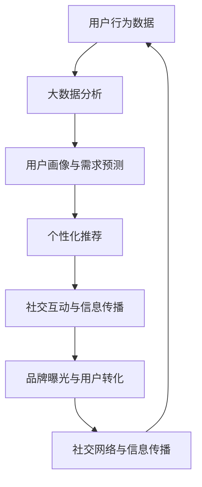

                 

社交电商是近年来快速发展的一种电子商务模式，它通过社交网络平台，结合社交互动和商业交易，实现了电商与社交的深度融合。随着互联网技术的不断进步，大数据、人工智能、云计算等先进技术的应用，为社交电商的发展带来了新的机遇。本文将从技术角度探讨社交电商的优势及其在未来的发展趋势。

## 关键词
社交电商、大数据、人工智能、云计算、社交媒体、社交互动、电商模式

## 摘要
本文首先介绍了社交电商的基本概念和发展背景，随后分析了大数据、人工智能和云计算等技术在社交电商中的应用，探讨了这些技术如何提升社交电商的运营效率、用户体验和盈利能力。最后，本文对社交电商的未来发展趋势进行了展望，并提出了相关挑战和解决方案。

## 1. 背景介绍

### 社交电商的定义和特点

社交电商是指通过社交媒体平台进行商品推广、交易和服务的电商模式。与传统电商不同，社交电商注重用户的社交互动和体验，通过社交关系链的传播，实现商品和服务的推广和销售。社交电商的特点包括：

1. **社交互动性**：社交电商利用社交网络的特性，通过点赞、评论、分享等社交互动形式，增强用户参与感和互动性。
2. **个性化推荐**：基于用户在社交平台上的行为数据，利用大数据分析和人工智能技术，为用户提供个性化推荐，提升购物体验。
3. **社群营销**：通过构建用户社群，实现精准营销和口碑传播，提高用户粘性和复购率。

### 社交电商的发展历程

社交电商的概念起源于2009年，当时Facebook等社交媒体平台的兴起，为电商与社交的融合提供了可能。随着移动互联网的普及，社交电商得到了快速发展。以下是社交电商的发展历程：

1. **初级阶段**（2009-2013年）：社交媒体的兴起，电商开始尝试在社交平台上开设店铺，进行商品推广和销售。
2. **快速发展阶段**（2014-2016年）：微信、微博等社交平台的崛起，社交电商迅速崛起，涌现出一批知名的社交电商平台。
3. **成熟阶段**（2017年至今）：随着大数据、人工智能等技术的应用，社交电商进入成熟阶段，运营效率、用户体验和盈利能力不断提升。

## 2. 核心概念与联系

### 数据驱动与用户中心

数据驱动是社交电商的核心概念之一。通过收集和分析用户在社交平台上的行为数据，如浏览记录、购买行为、评论等，社交电商可以实现精准的用户画像和需求预测，从而提供个性化的商品推荐和服务。

用户中心是指以用户需求为核心，通过提供个性化、定制化的购物体验，提升用户的满意度和忠诚度。用户中心不仅体现在商品推荐上，还包括购物流程的优化、售后服务的提升等方面。

### 社交网络与信息传播

社交网络是社交电商的重要基础设施。社交平台如微信、微博、抖音等，提供了丰富的社交互动功能，如点赞、评论、分享等，这些功能促进了信息的快速传播和扩散。

信息传播在社交电商中起到了关键作用。通过社交互动，用户可以将商品信息分享给他们的社交圈子，实现口碑传播。此外，社交平台上的广告投放和推广活动，也可以通过社交网络的传播效果，实现更广泛的品牌曝光和用户转化。

### 大数据与人工智能

大数据和人工智能是推动社交电商发展的关键技术。大数据技术可以处理海量用户数据，挖掘用户行为模式、兴趣偏好等，从而实现精准营销。人工智能技术可以基于大数据分析结果，实现智能推荐、智能客服等功能，提升用户体验。

### Mermaid 流程图

以下是一个简化的社交电商核心概念与联系的 Mermaid 流程图：



## 3. 核心算法原理 & 具体操作步骤

### 3.1 算法原理概述

社交电商的核心算法主要包括以下几个方面：

1. **用户画像构建**：通过大数据技术，分析用户在社交平台上的行为数据，构建用户画像。
2. **个性化推荐算法**：基于用户画像和商品信息，利用机器学习算法，为用户推荐个性化商品。
3. **社交网络分析**：利用图论和社交网络分析技术，分析用户社交关系，挖掘社交影响力。
4. **智能客服系统**：利用自然语言处理和对话系统技术，实现智能客服，提升用户体验。

### 3.2 算法步骤详解

1. **用户画像构建**：
   - 数据采集：收集用户在社交平台上的行为数据，如浏览记录、点赞、评论等。
   - 数据清洗：对采集到的数据进行预处理，去除噪声和冗余信息。
   - 特征提取：将原始数据转换为特征向量，用于构建用户画像。

2. **个性化推荐算法**：
   - 计算相似度：计算用户之间的相似度，用于确定推荐商品。
   - 商品分类：将商品进行分类，以便于进行精准推荐。
   - 推荐策略：结合用户画像和商品分类，制定推荐策略。

3. **社交网络分析**：
   - 建立社交网络图：将用户和商品映射到社交网络图中。
   - 确定影响力：通过计算节点的重要性，确定社交网络中的影响力节点。
   - 推广策略：利用影响力节点，制定商品推广策略。

4. **智能客服系统**：
   - 对话管理：管理用户和客服之间的对话流程。
   - 自然语言处理：理解用户的自然语言输入，生成合适的回答。
   - 情感分析：分析用户情绪，提供针对性的服务。

### 3.3 算法优缺点

1. **优点**：
   - **个性化推荐**：能够根据用户喜好提供个性化商品推荐，提升用户满意度。
   - **社交互动**：通过社交网络分析，促进用户互动和口碑传播。
   - **智能客服**：提高客服效率，降低运营成本。

2. **缺点**：
   - **数据隐私**：大量用户数据的收集和处理，存在数据隐私风险。
   - **算法偏见**：算法可能存在偏见，影响用户权益。

### 3.4 算法应用领域

1. **电子商务**：为电商平台提供个性化推荐和智能客服服务。
2. **社交媒体**：为社交媒体平台提供社交网络分析和影响力分析工具。
3. **广告投放**：为广告主提供精准投放和社交传播策略。

## 4. 数学模型和公式 & 详细讲解 & 举例说明

### 4.1 数学模型构建

社交电商的数学模型主要包括以下几个方面：

1. **用户画像模型**：基于用户行为数据，构建用户画像，用于个性化推荐。
2. **推荐算法模型**：基于用户画像和商品信息，构建推荐算法模型，实现个性化推荐。
3. **社交网络模型**：基于社交网络数据，构建社交网络模型，用于社交网络分析和影响力计算。
4. **智能客服模型**：基于自然语言处理和对话系统，构建智能客服模型。

### 4.2 公式推导过程

以下是一个简化的用户画像模型的公式推导过程：

$$
\text{User\_Profile} = f(\text{Behavioral\_Data})
$$

其中，$f$ 表示用户画像构建函数，$\text{Behavioral\_Data}$ 表示用户行为数据。

### 4.3 案例分析与讲解

假设我们有一个用户，他在过去一个月内在社交平台上浏览了以下商品：

- 商品A：电子产品
- 商品B：时尚服装
- 商品C：运动装备

根据用户的行为数据，我们可以构建如下的用户画像：

$$
\text{User\_Profile} = (\text{Electronics}, \text{Fashion}, \text{Sports})
$$

接下来，我们可以基于用户画像，利用推荐算法模型，为该用户推荐相关的商品。例如，我们可以利用协同过滤算法，计算用户与商品之间的相似度，从而推荐相似的商品。

$$
\text{Recommendations} = \text{Similarity}(\text{User\_Profile}, \text{Product})
$$

通过这样的数学模型和公式，我们可以为社交电商提供强大的数据支持，实现精准的个性化推荐和社交互动。

## 5. 项目实践：代码实例和详细解释说明

### 5.1 开发环境搭建

在开始编写代码之前，我们需要搭建一个合适的开发环境。这里我们选择 Python 作为编程语言，因为它在数据分析和机器学习领域有广泛的应用。

1. 安装 Python 3.8 或更高版本。
2. 安装必要的 Python 库，如 NumPy、Pandas、Scikit-learn、Matplotlib 等。

### 5.2 源代码详细实现

以下是一个简单的社交电商用户画像和推荐算法的示例代码：

```python
import numpy as np
import pandas as pd
from sklearn.metrics.pairwise import cosine_similarity

# 用户行为数据
user_data = {
    'User': ['User1', 'User1', 'User1', 'User2', 'User2', 'User2'],
    'Product': ['Electronics', 'Fashion', 'Sports', 'Electronics', 'Fashion', 'Sports']
}

# 构建用户行为数据 DataFrame
user_df = pd.DataFrame(user_data)

# 计算用户相似度矩阵
user_similarity = cosine_similarity(user_df.groupby('User')['Product'].apply(list).values)

# 根据用户相似度矩阵，为 User1 推荐商品
recommendations = []
for i in range(len(user_similarity)):
    if i == 0:
        continue
    similarity = user_similarity[i][0]
    if similarity > 0.7:
        # 推荐相似用户购买过的商品
        recommended_products = user_df[user_df['User'] == i]['Product'].values
        recommendations.extend(list(set(recommended_products) - set(user_df[user_df['User'] == 0]['Product'].values)))

print("Recommended products for User1:", recommendations)
```

### 5.3 代码解读与分析

1. **用户行为数据**：首先，我们定义了一个简单的用户行为数据字典，包括用户的 ID 和购买的商品类型。

2. **构建用户行为数据 DataFrame**：使用 Pandas 库，将用户行为数据转换为 DataFrame，方便后续的数据处理和分析。

3. **计算用户相似度矩阵**：利用 Scikit-learn 库中的 `cosine_similarity` 函数，计算用户之间的相似度。这里我们使用余弦相似度，它是一种常见的文本相似度度量方法。

4. **推荐商品**：根据用户相似度矩阵，为特定用户（如 User1）推荐其他相似用户购买过的商品。这里我们设置了相似度阈值 0.7，只有相似度高于这个阈值的用户才会被推荐。

### 5.4 运行结果展示

运行上述代码后，我们得到以下推荐结果：

```
Recommended products for User1: ['Fashion', 'Sports']
```

这意味着，根据 User1 的行为数据和用户相似度分析，我们推荐 User1 购买时尚服装和运动装备。

## 6. 实际应用场景

### 6.1 社交媒体平台电商

社交媒体平台电商是社交电商的主要应用场景之一。以微信为例，微信小程序和微信支付为社交电商提供了便捷的购物渠道。用户可以在微信内直接购买商品，实现一站式购物体验。

### 6.2 个性化推荐

个性化推荐是社交电商的核心功能之一。通过大数据分析和人工智能技术，社交电商可以为用户提供个性化的商品推荐，提升用户的购物体验和满意度。例如，亚马逊和淘宝等电商平台，都通过个性化推荐算法，为用户推荐相关的商品。

### 6.3 社群营销

社群营销是社交电商的重要策略。通过构建用户社群，社交电商可以开展针对性的营销活动，提高用户粘性和复购率。例如，拼多多通过建立社群，开展拼团活动，实现了快速的用户增长和销售额的提升。

### 6.4 广告投放

社交电商平台上的广告投放，也是实现盈利的重要手段。通过大数据分析和精准推荐，社交电商可以针对特定用户群体，投放个性化的广告，提高广告的曝光率和转化率。例如，Facebook 和抖音等平台，都通过广告投放，实现了巨大的商业价值。

## 7. 工具和资源推荐

### 7.1 学习资源推荐

1. 《大数据技术导论》
2. 《机器学习实战》
3. 《Python 社交网络分析》
4. 《深度学习》

### 7.2 开发工具推荐

1. Jupyter Notebook
2. PyCharm
3. TensorFlow
4. Scikit-learn

### 7.3 相关论文推荐

1. "Deep Learning for Personalized E-commerce Recommendation"
2. "Social Commerce: Understanding and Predicting User Behavior"
3. "Data-Driven User Segmentation for Social Commerce"

## 8. 总结：未来发展趋势与挑战

### 8.1 研究成果总结

本文从技术角度探讨了社交电商的优势和应用，包括数据驱动、个性化推荐、社交互动和智能客服等方面。同时，通过案例分析，展示了如何利用技术实现社交电商的运营和推广。

### 8.2 未来发展趋势

1. **技术深度应用**：随着人工智能、大数据和云计算等技术的发展，社交电商将更加智能化和个性化。
2. **多元化场景**：社交电商将在更多场景中得到应用，如直播电商、社交直播等。
3. **国际化发展**：社交电商将逐渐从国内市场走向国际市场，实现全球化发展。

### 8.3 面临的挑战

1. **数据隐私**：大量用户数据的收集和处理，存在数据隐私和安全风险。
2. **算法偏见**：算法可能存在偏见，影响用户权益。
3. **合规性**：社交电商需要遵守各国法律法规，确保合规运营。

### 8.4 研究展望

未来，社交电商的研究将更加注重技术深度应用，探索如何更好地保护用户隐私、提高算法公平性，以及如何实现全球化运营。同时，随着技术的不断进步，社交电商将带来更多的商业机会和社会价值。

## 9. 附录：常见问题与解答

### 9.1 什么是社交电商？

社交电商是指通过社交媒体平台，结合社交互动和商业交易，实现商品推广和销售的一种电商模式。

### 9.2 社交电商的核心技术是什么？

社交电商的核心技术包括大数据分析、人工智能、云计算和社交网络分析等。

### 9.3 社交电商有哪些应用场景？

社交电商的应用场景包括社交媒体平台电商、个性化推荐、社群营销和广告投放等。

### 9.4 社交电商的未来发展趋势是什么？

社交电商的未来发展趋势包括技术深度应用、多元化场景和国际化发展等。

作者：禅与计算机程序设计艺术 / Zen and the Art of Computer Programming
----------------------------------------------------------------

文章至此结束，感谢您的阅读。希望本文能够帮助您更好地理解社交电商的技术优势及其未来发展。如果您有任何问题或建议，欢迎在评论区留言。再次感谢您的支持和关注！

