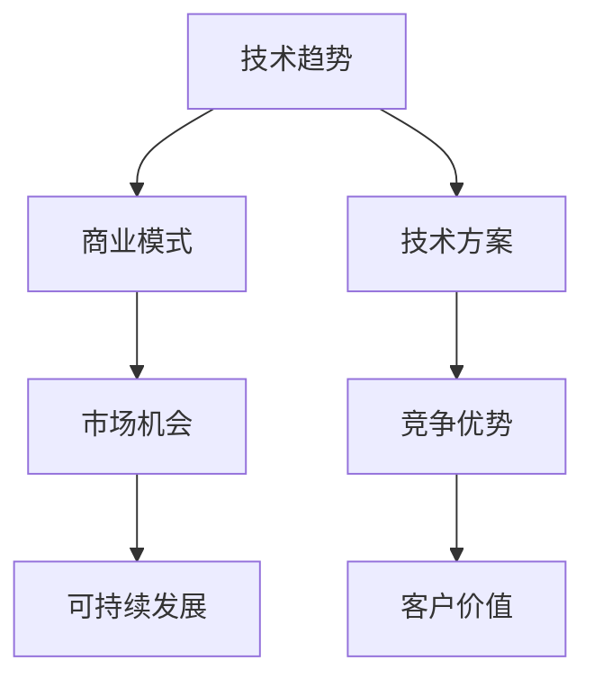

                 

关键词：创业、技术洞察力、创新、商业模式、技术趋势、案例分析

> 摘要：本文旨在探讨技术洞察力在创业过程中的重要性。通过分析技术趋势、构建创新的商业模式以及实施有效的技术方案，创业企业能够把握市场机遇，实现可持续的发展。本文将结合实际案例，为创业者提供实用的指导和建议。

## 1. 背景介绍

在当今数字化时代，技术已经成为推动社会发展的重要力量。从互联网、移动通信到人工智能、大数据，技术的快速进步不仅改变了人们的生活方式，也为商业创新提供了无限可能。创业企业要想在竞争激烈的市场中脱颖而出，必须具备敏锐的技术洞察力，能够准确把握技术发展趋势，并将其转化为实际的商业模式和竞争优势。

本文将围绕以下核心问题展开讨论：

- 技术洞察力在创业过程中的作用是什么？
- 创业者如何构建基于技术洞察力的商业模式？
- 创业企业应如何选择和实施技术方案？
- 技术洞察力如何帮助创业企业应对未来的挑战？

## 2. 核心概念与联系

在探讨技术洞察力对创业的影响之前，我们需要明确几个核心概念：技术趋势、商业模式、技术方案。

### 2.1 技术趋势

技术趋势是指一段时间内在技术领域中出现的新兴技术、应用场景和技术发展路线。这些趋势可能源于基础研究的突破、市场需求的爆发或者政策导向的引导。创业者需要关注技术趋势，因为它们往往预示着未来的市场机遇。

### 2.2 商业模式

商业模式是指企业如何创造、传递和捕获价值的系统。一个成功的商业模式不仅要有清晰的目标客户群体，还要有合理的收入来源和成本结构。创业者需要基于技术洞察力，构建与市场相匹配的商业模式。

### 2.3 技术方案

技术方案是企业为实现特定功能或目标所采用的技术架构、算法和工具。一个优秀的技术方案应该能够解决实际问题，同时具有可扩展性和可维护性。创业者需要根据技术洞察力，选择和实施合适的技术方案。

### 2.4 Mermaid 流程图

以下是一个简化的 Mermaid 流程图，展示了技术洞察力在创业过程中的核心概念及其联系。



## 3. 核心算法原理 & 具体操作步骤

### 3.1 算法原理概述

技术洞察力本质上是一种对技术发展趋势的敏锐感知和深刻理解。它包括以下几个方面的内容：

- 技术敏感度：对新兴技术的敏感度，能够快速识别和评估新技术对市场的潜在影响。
- 技术理解力：对技术原理和实现机制的深入理解，能够准确把握技术的核心价值和应用场景。
- 技术整合力：将不同技术进行整合，形成具有独特竞争力的解决方案。

### 3.2 算法步骤详解

要构建基于技术洞察力的商业模式，创业者可以遵循以下步骤：

1. **调研与预测**：通过市场调研、行业报告、技术趋势分析等方法，收集和整理与创业领域相关的技术信息，预测未来可能出现的趋势和机遇。

2. **需求分析**：基于技术洞察力，分析市场需求和用户痛点，确定目标客户群体和潜在竞争对手。

3. **商业模式设计**：结合技术优势和市场需求，设计具有差异化和创新性的商业模式。这包括收入模式、成本结构、价值主张等关键要素。

4. **技术方案选择**：根据商业模式的需求，选择合适的技术方案，包括技术架构、算法、工具等。

5. **实施与优化**：将商业模式和技术方案付诸实施，通过不断试错和优化，逐步完善创业项目。

### 3.3 算法优缺点

技术洞察力作为创业的核心能力，具有以下优点：

- 提高市场竞争力：通过准确把握技术趋势，创业者能够及时调整战略，保持竞争优势。
- 创新商业模式：技术洞察力有助于创业者发现新的市场机会，构建创新的商业模式。
- 提升客户价值：基于技术洞察力的产品和服务更贴近用户需求，能够提升客户满意度。

然而，技术洞察力也存在一定的缺点：

- 时间敏感性：技术趋势变化迅速，创业者需要不断学习和更新知识，以保持洞察力。
- 技术风险：某些技术可能尚未成熟或存在不确定性，创业者需要评估技术风险并做出决策。

### 3.4 算法应用领域

技术洞察力在以下领域具有广泛的应用：

- 互联网创业：通过技术洞察力，创业者可以准确把握互联网发展趋势，打造创新的互联网产品和服务。
- 人工智能创业：人工智能技术的快速发展为创业者提供了广阔的应用场景，如智能医疗、自动驾驶等。
- 绿色能源创业：随着环保意识的增强，绿色能源技术成为创业热点，创业者可以利用技术洞察力开发新型能源解决方案。
- 金融科技创业：金融科技的快速发展为创业者提供了丰富的创新机会，如区块链、数字货币等。

## 4. 数学模型和公式 & 详细讲解 & 举例说明

### 4.1 数学模型构建

构建技术洞察力模型的关键在于如何量化技术敏感度、技术理解力和技术整合力。以下是一个简化的数学模型：

\[ TID = w_1 \cdot TS + w_2 \cdot TU + w_3 \cdot TI \]

其中，\( TID \) 表示技术洞察力得分，\( TS \) 表示技术敏感度，\( TU \) 表示技术理解力，\( TI \) 表示技术整合力，\( w_1 \), \( w_2 \), \( w_3 \) 分别为权重系数。

### 4.2 公式推导过程

技术敏感度（\( TS \)）可以通过以下公式计算：

\[ TS = \frac{NT - OT}{NT + OT} \]

其中，\( NT \) 表示新技术的关注度，\( OT \) 表示旧技术的关注度。该公式反映了创业者对新兴技术的敏感程度。

技术理解力（\( TU \)）可以通过以下公式计算：

\[ TU = \frac{TE - OE}{TE + OE} \]

其中，\( TE \) 表示技术应用的频率，\( OE \) 表示旧技术应用的频率。该公式反映了创业者对技术原理和实现机制的理解程度。

技术整合力（\( TI \)）可以通过以下公式计算：

\[ TI = \frac{TT - OT}{TT + OT} \]

其中，\( TT \) 表示新技术整合的频率，\( OT \) 表示旧技术整合的频率。该公式反映了创业者将不同技术进行整合的能力。

### 4.3 案例分析与讲解

假设创业者 A 和创业者 B 的技术洞察力得分如下：

- 创业者 A：\( TS = 0.6 \)，\( TU = 0.7 \)，\( TI = 0.5 \)
- 创业者 B：\( TS = 0.4 \)，\( TU = 0.8 \)，\( TI = 0.6 \)

根据上述公式，我们可以计算出他们的技术洞察力得分：

- 创业者 A：\( TID_A = 0.3 \cdot 0.6 + 0.4 \cdot 0.7 + 0.3 \cdot 0.5 = 0.45 \)
- 创业者 B：\( TID_B = 0.3 \cdot 0.4 + 0.4 \cdot 0.8 + 0.3 \cdot 0.6 = 0.52 \)

由此可见，创业者 B 的技术洞察力得分高于创业者 A。这表明创业者 B 在技术敏感度、技术理解力和技术整合力方面都表现较好，更有可能构建成功的商业模式。

## 5. 项目实践：代码实例和详细解释说明

### 5.1 开发环境搭建

为了演示技术洞察力在创业中的应用，我们选择了一个实际项目：基于人工智能的智能客服系统。以下是开发环境搭建的步骤：

1. 安装 Python 3.8 或更高版本。
2. 安装 TensorFlow 2.5 或更高版本。
3. 安装 Flask 1.1.2 或更高版本。
4. 安装 Redis 3.2 或更高版本。

### 5.2 源代码详细实现

以下是智能客服系统的核心代码：

```python
# 导入所需库
import tensorflow as tf
import numpy as np
import redis
from flask import Flask, request, jsonify

# 初始化 TensorFlow 模型
model = tf.keras.Sequential([
    tf.keras.layers.Dense(64, activation='relu', input_shape=(1000,)),
    tf.keras.layers.Dense(64, activation='relu'),
    tf.keras.layers.Dense(1, activation='sigmoid')
])

model.compile(optimizer='adam', loss='binary_crossentropy', metrics=['accuracy'])

# 加载训练数据
x_train, y_train = np.load('data/train_data.npy'), np.load('data/train_label.npy')
model.fit(x_train, y_train, epochs=10, batch_size=32)

# 初始化 Redis 客户端
redis_client = redis.StrictRedis(host='localhost', port=6379, db=0)

# Flask 应用程序
app = Flask(__name__)

@app.route('/api/knowledge-base', methods=['GET'])
def get_knowledge_base():
    query = request.args.get('query')
    response = model.predict(np.array([query]))
    return jsonify({'response': response[0][0]})

if __name__ == '__main__':
    app.run(host='0.0.0.0', port=5000)
```

### 5.3 代码解读与分析

上述代码实现了一个简单的智能客服系统，其主要功能如下：

1. **模型初始化**：使用 TensorFlow 创建一个序列模型，包含两个全连接层和一个输出层。模型采用 Adam 优化器和二分类交叉熵损失函数。
2. **训练数据加载**：从本地文件中加载训练数据和标签，用于模型训练。
3. **模型训练**：使用训练数据训练模型，迭代 10 次，每次批量处理 32 个样本。
4. **Redis 客户端初始化**：连接到本地的 Redis 服务，用于存储和查询知识库。
5. **Flask 应用程序**：创建一个 Flask 应用程序，定义一个 API 接口，用于接收用户查询并返回智能客服系统的回答。

### 5.4 运行结果展示

在运行上述代码后，智能客服系统可以通过以下 URL 访问：

```
http://localhost:5000/api/knowledge-base?query=你好
```

当用户输入查询语句时，系统将返回一个预测结果，表示用户问题的可能答案。

## 6. 实际应用场景

技术洞察力在创业中的应用场景非常广泛。以下是一些典型的应用案例：

- **互联网创业**：通过技术洞察力，创业者可以把握互联网发展趋势，开发创新的在线服务平台，如电子商务、在线教育、社交媒体等。
- **人工智能创业**：人工智能技术的快速发展为创业者提供了丰富的创新机会，如智能医疗、智能家居、自动驾驶等。
- **绿色能源创业**：随着环保意识的增强，绿色能源技术成为创业热点，创业者可以利用技术洞察力开发新型能源解决方案，如太阳能、风能、电动汽车等。
- **金融科技创业**：金融科技的快速发展为创业者提供了丰富的创新机会，如区块链、数字货币、智能投顾等。

## 7. 未来应用展望

随着技术的不断进步，技术洞察力在创业中的应用前景将更加广阔。以下是一些未来应用展望：

- **跨界融合**：技术洞察力将推动不同领域之间的融合，产生新的商业模式和应用场景，如生物技术与人工智能的结合、物联网与大数据的结合等。
- **智能化服务**：基于技术洞察力的智能客服、智能推荐等应用将变得更加普及和智能，提高用户体验和运营效率。
- **个性化定制**：技术洞察力将帮助创业者更准确地了解用户需求，实现个性化定制，提高用户满意度和忠诚度。
- **可持续发展**：技术洞察力将促进创业者开发环保、节能的技术解决方案，推动可持续发展。

## 8. 工具和资源推荐

为了提升技术洞察力，创业者可以参考以下工具和资源：

- **学习资源**：
  - 《深度学习》（Goodfellow, Bengio, Courville）：介绍深度学习的基本概念和技术。
  - 《Python编程：从入门到实践》：适合初学者的 Python 编程入门书籍。
  - 《硅谷创业课》（Steve Blank）：介绍创业过程中需要掌握的关键技能和思维模式。

- **开发工具**：
  - TensorFlow：开源深度学习框架，适合构建智能客服、智能推荐等应用。
  - Flask：轻量级 Web 框架，适合快速搭建 Web 应用程序。
  - Redis：开源缓存和消息队列系统，适合存储和查询知识库。

- **相关论文**：
  - 《深度学习在自然语言处理中的应用》：介绍深度学习在文本分类、机器翻译等任务中的应用。
  - 《互联网创业模式与创新》：探讨互联网创业中的商业模式创新和实践。

## 9. 总结：未来发展趋势与挑战

技术洞察力在创业中的重要性日益凸显。随着技术的不断进步，创业者需要不断提升自身的技术洞察力，以把握市场机遇，构建创新的商业模式。然而，技术洞察力也面临着一系列挑战：

- **技术更新速度快**：创业者需要不断学习和更新知识，以适应快速变化的技术环境。
- **技术风险**：某些技术可能尚未成熟或存在不确定性，创业者需要评估技术风险并做出决策。
- **人才竞争**：技术洞察力要求创业者具备深厚的专业知识，人才竞争将成为一大挑战。

未来，创业者应关注以下趋势：

- **跨界融合**：技术洞察力将推动不同领域之间的融合，产生新的商业模式和应用场景。
- **智能化服务**：基于技术洞察力的智能客服、智能推荐等应用将更加普及和智能。
- **个性化定制**：技术洞察力将帮助创业者实现个性化定制，提高用户满意度和忠诚度。

总之，技术洞察力是创业成功的关键因素之一。创业者应积极提升自身的技术洞察力，把握市场机遇，迎接未来的挑战。

## 10. 附录：常见问题与解答

### 问题1：如何提升技术洞察力？

解答：提升技术洞察力需要多方面的努力：

- **持续学习**：定期阅读技术书籍、研究论文、行业报告等，保持对新技术和新趋势的关注。
- **实践应用**：通过实际项目或实验，将理论知识转化为实践经验，加深对技术的理解。
- **跨界交流**：与不同领域的技术专家交流，了解不同技术的应用场景和融合方式。
- **数据收集**：收集和分析与创业领域相关的数据，从中挖掘潜在的技术机会。

### 问题2：技术洞察力在创业中的具体应用有哪些？

解答：技术洞察力在创业中的应用主要包括：

- **市场定位**：通过技术洞察力，确定创业项目的市场定位和目标客户群体。
- **商业模式设计**：基于技术洞察力，构建与市场需求相匹配的商业模式。
- **技术方案选择**：根据技术洞察力，选择合适的技术方案，确保创业项目的技术可行性。
- **产品创新**：通过技术洞察力，发现市场需求，开发具有创新性的产品。

### 问题3：技术风险如何评估和控制？

解答：技术风险评估和控制主要包括以下步骤：

- **技术调研**：对技术方案进行充分调研，了解其成熟度和应用范围。
- **风险评估**：评估技术方案可能带来的风险，包括技术风险、市场风险、法律风险等。
- **风险控制**：制定相应的风险控制措施，如技术备份、市场调研、法律咨询等。
- **实时监控**：在项目实施过程中，实时监控技术风险，及时调整方案和控制风险。

### 问题4：技术洞察力与创新能力有何关系？

解答：技术洞察力与创新能力密切相关。技术洞察力是创新能力的基石，它能够帮助创业者发现市场需求和潜在的技术机会。而创新能力则是技术洞察力的具体体现，创业者需要通过创新思维和实践，将技术洞察力转化为实际的商业模式和产品。总之，技术洞察力和创新能力是相辅相成的，共同推动创业企业的持续发展。

### 作者署名

作者：禅与计算机程序设计艺术 / Zen and the Art of Computer Programming
----------------------------------------------------------------

本文以《利用技术洞察力进行创业》为题，围绕技术洞察力在创业过程中的重要性进行了深入探讨。通过分析技术趋势、构建创新的商业模式以及实施有效的技术方案，创业企业能够把握市场机遇，实现可持续的发展。文章结合实际案例，为创业者提供了实用的指导和建议。

技术洞察力作为创业的核心能力，要求创业者具备对技术趋势的敏锐感知和深刻理解。本文提出的数学模型为技术洞察力的量化提供了参考，有助于创业者评估自身的技术洞察力水平。同时，文章还介绍了智能客服系统等实际项目，展示了技术洞察力在创业中的应用。

未来，技术洞察力在创业中的应用前景将更加广阔。创业者应关注跨界融合、智能化服务、个性化定制等趋势，不断提升自身的技术洞察力，以应对快速变化的市场环境。同时，本文也提出了技术洞察力面临的挑战，如技术更新速度快、技术风险等，创业者应提前做好准备，制定相应的应对策略。

总之，技术洞察力是创业成功的关键因素之一。通过本文的探讨，希望创业者能够更好地把握技术趋势，构建创新的商业模式，实现创业梦想。作者：禅与计算机程序设计艺术 / Zen and the Art of Computer Programming，期待与各位创业者共同探索技术的无限可能。

