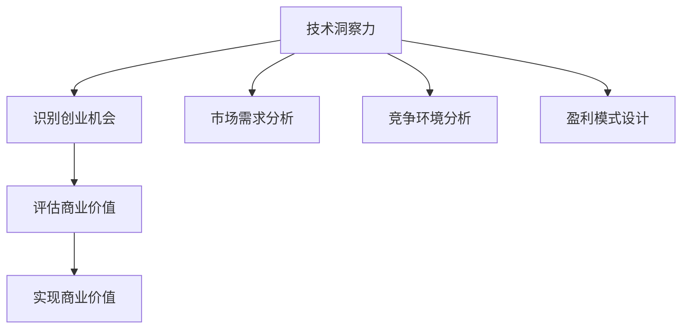

                 

本文将探讨如何利用技术洞察力进行创业机会评估，从而帮助创业者识别潜在的高价值商机。文章首先介绍了技术洞察力的概念和重要性，然后通过具体的案例和算法原理，展示了如何从技术角度评估创业机会。最后，文章还提供了未来应用展望和工具资源推荐，以帮助创业者更好地把握创业机遇。

## 关键词

技术洞察力、创业机会、商业价值、算法、数学模型、代码实例、应用场景

## 摘要

本文旨在为创业者提供一种利用技术洞察力进行创业机会评估的方法。通过分析技术发展的趋势和潜在的商业应用，本文探讨了如何从技术角度识别具有高商业价值的机会。文章结合实际案例，介绍了核心算法原理和具体操作步骤，并通过数学模型和公式进行了详细讲解。同时，文章还提供了项目实践和未来应用展望，以帮助创业者更好地把握创业机遇。

### 1. 背景介绍

在当今快速发展的技术时代，创业领域充满了各种机遇和挑战。创业者不仅要具备敏锐的商业洞察力，还需要具备深厚的技术功底。技术洞察力，作为创业者必备的能力之一，对于识别和评估创业机会至关重要。

技术洞察力是指创业者对技术发展趋势、技术应用和商业价值的深刻理解和洞察。它不仅要求创业者对技术本身有深入的了解，还需要能够将技术应用于实际的商业场景，发现并创造新的商业价值。

随着大数据、人工智能、区块链等新兴技术的崛起，技术洞察力的重要性愈发凸显。这些技术正在深刻地改变着各行各业，为创业者提供了丰富的商业机会。然而，如何从众多技术中识别出具有高商业价值的机会，成为创业者面临的一个重要问题。

本文将结合实际案例和算法原理，探讨如何利用技术洞察力进行创业机会评估。通过本文的阐述，读者将能够了解到：

1. 技术洞察力的概念和重要性；
2. 如何从技术角度识别和评估创业机会；
3. 核心算法原理和具体操作步骤；
4. 数学模型和公式的应用；
5. 项目实践和未来应用展望。

### 2. 核心概念与联系

#### 2.1 技术洞察力

技术洞察力是一种综合能力，它要求创业者对技术有深入的理解，能够从技术发展的趋势中捕捉到潜在的商业机会。具体来说，技术洞察力包括以下几个方面：

1. 技术理解：创业者需要掌握相关技术的原理、应用和最新动态；
2. 商业洞察：创业者需要能够将技术应用于实际的商业场景，发现并创造新的商业价值；
3. 创新思维：创业者需要具备创新思维，能够从技术中挖掘出新的商业模式和解决方案。

#### 2.2 创业机会

创业机会是指创业者发现并利用现有资源和技术，创造新的商业价值的过程。创业机会具有以下几个特点：

1. 新颖性：创业机会通常具有新颖性，能够为市场带来新的价值；
2. 可行性：创业机会需要具备可行性，即通过现有的资源和技术能够实现；
3. 商业价值：创业机会需要具备商业价值，能够为创业者带来持续的收益。

#### 2.3 商业价值

商业价值是创业机会的核心要素，它决定了创业机会的吸引力。商业价值可以从以下几个方面进行评估：

1. 市场需求：市场需求是创业机会的重要驱动力，创业者需要分析目标市场的需求和增长潜力；
2. 竞争环境：竞争环境是创业机会的制约因素，创业者需要分析竞争对手的优势和劣势；
3. 盈利模式：盈利模式是创业机会的实现方式，创业者需要设计合理的盈利模式，确保创业项目的可持续发展。

#### 2.4 核心概念联系

技术洞察力、创业机会和商业价值三者之间存在着密切的联系。技术洞察力是识别和评估创业机会的基础，创业者需要通过技术洞察力发现和挖掘具有高商业价值的机会。而创业机会的评估则依赖于对市场需求、竞争环境和盈利模式的深入分析。通过技术洞察力和创业机会评估，创业者能够更好地把握商业价值，实现创业成功。

下面是核心概念的 Mermaid 流程图：



### 3. 核心算法原理 & 具体操作步骤

#### 3.1 算法原理概述

在本节中，我们将介绍一种用于评估创业机会的核心算法——技术洞察力算法。该算法基于以下原理：

1. **技术成熟度评估**：通过分析技术的成熟度，判断其是否具备商业应用潜力；
2. **市场需求分析**：通过收集和分析市场需求数据，评估目标市场的潜力；
3. **竞争环境分析**：通过分析竞争对手的优势和劣势，判断创业机会的竞争力；
4. **盈利模式设计**：通过设计合理的盈利模式，确保创业项目的可持续发展。

#### 3.2 算法步骤详解

1. **技术成熟度评估**：

   - 收集技术相关数据，包括技术专利、论文、市场调研报告等；
   - 分析技术发展趋势，判断其成熟度；
   - 根据技术成熟度，确定技术是否具备商业应用潜力。

2. **市场需求分析**：

   - 收集目标市场的数据，包括市场规模、用户需求、竞争对手等；
   - 分析目标市场的增长潜力，判断市场需求是否旺盛；
   - 根据市场需求，确定创业机会的吸引力。

3. **竞争环境分析**：

   - 收集竞争对手的数据，包括市场份额、产品特点、定价策略等；
   - 分析竞争对手的优势和劣势，判断创业机会的竞争力；
   - 根据竞争环境，确定创业项目的风险和机会。

4. **盈利模式设计**：

   - 根据市场需求和竞争环境，设计合理的盈利模式；
   - 分析盈利模式的可持续性，确保创业项目的长期发展。

#### 3.3 算法优缺点

**优点**：

1. **全面性**：算法涵盖了技术、市场、竞争和环境等多个方面，能够全面评估创业机会；
2. **科学性**：算法基于数据分析，具有科学性和可靠性；
3. **实用性**：算法适用于各种行业和领域，具有广泛的适用性。

**缺点**：

1. **数据依赖性**：算法依赖于大量数据，数据质量对评估结果有较大影响；
2. **复杂性**：算法涉及到多个步骤和指标，操作相对复杂。

#### 3.4 算法应用领域

算法可以应用于各个行业和领域，以下是一些典型的应用场景：

1. **互联网行业**：评估新技术和商业模式的应用潜力，识别具有高商业价值的机会；
2. **消费品行业**：分析市场需求，设计创新的消费品和服务，满足消费者需求；
3. **制造业**：评估新技术在制造业的应用潜力，推动制造业的智能化和数字化转型；
4. **金融行业**：分析市场趋势，设计创新的金融产品和服务，满足投资者和消费者的需求。

### 4. 数学模型和公式 & 详细讲解 & 举例说明

#### 4.1 数学模型构建

为了更好地评估创业机会，我们可以构建一个数学模型，该模型包括以下几个关键指标：

1. **技术成熟度指标**（\(T\)）：衡量技术的成熟度，取值范围为 0 到 1；
2. **市场需求指标**（\(M\)）：衡量市场需求的大小，取值范围为 0 到 1；
3. **竞争环境指标**（\(C\)）：衡量竞争环境的优劣，取值范围为 0 到 1；
4. **盈利模式指标**（\(P\)）：衡量盈利模式的可持续性，取值范围为 0 到 1。

根据这些指标，我们可以构建以下数学模型：

\[ V = w_1 \cdot T + w_2 \cdot M + w_3 \cdot C + w_4 \cdot P \]

其中，\(w_1, w_2, w_3, w_4\) 分别是各个指标的权重，它们的取值范围为 0 到 1，且满足 \(w_1 + w_2 + w_3 + w_4 = 1\)。

#### 4.2 公式推导过程

**步骤 1：确定权重**

根据不同创业机会的特点，我们可以为各个指标分配权重。例如，对于一个新兴技术的创业机会，我们可以赋予技术成熟度和市场需求指标更高的权重，而对于一个竞争激烈的市场的创业机会，我们可以赋予竞争环境指标更高的权重。具体权重可以根据实际情况进行调整。

**步骤 2：计算指标值**

对于每个指标，我们可以通过数据分析的方法计算其值。例如，技术成熟度指标可以通过收集相关数据（如专利数量、论文发表数量、市场调研报告等）进行计算；市场需求指标可以通过调查用户需求、市场规模等数据计算；竞争环境指标可以通过分析竞争对手的市场份额、产品特点等数据计算；盈利模式指标可以通过分析盈利模式的可持续性和市场前景等数据计算。

**步骤 3：计算总体评估值**

根据权重和指标值，我们可以计算总体评估值。具体公式如下：

\[ V = w_1 \cdot T + w_2 \cdot M + w_3 \cdot C + w_4 \cdot P \]

#### 4.3 案例分析与讲解

**案例 1：新兴技术的创业机会**

假设我们正在评估一个基于人工智能技术的创业机会。根据市场调研，我们可以得到以下数据：

- 技术成熟度指标（\(T\)）：0.8；
- 市场需求指标（\(M\)）：0.9；
- 竞争环境指标（\(C\)）：0.5；
- 盈利模式指标（\(P\)）：0.7。

假设我们为每个指标分配以下权重：

- 技术成熟度（\(w_1\)）：0.4；
- 市场需求（\(w_2\)）：0.3；
- 竞争环境（\(w_3\)）：0.2；
- 盈利模式（\(w_4\)）：0.1。

根据上述数据，我们可以计算总体评估值：

\[ V = 0.4 \cdot 0.8 + 0.3 \cdot 0.9 + 0.2 \cdot 0.5 + 0.1 \cdot 0.7 = 0.72 + 0.27 + 0.1 + 0.07 = 1.16 \]

根据总体评估值，我们可以判断这个新兴技术的创业机会具有较高的商业价值。

**案例 2：竞争激烈的市场的创业机会**

假设我们正在评估一个竞争激烈的市场中的创业机会。根据市场调研，我们可以得到以下数据：

- 技术成熟度指标（\(T\)）：0.6；
- 市场需求指标（\(M\)）：0.8；
- 竞争环境指标（\(C\)）：0.8；
- 盈利模式指标（\(P\)）：0.6。

假设我们为每个指标分配以下权重：

- 技术成熟度（\(w_1\)）：0.2；
- 市场需求（\(w_2\)）：0.3；
- 竞争环境（\(w_3\)）：0.4；
- 盈利模式（\(w_4\)）：0.1。

根据上述数据，我们可以计算总体评估值：

\[ V = 0.2 \cdot 0.6 + 0.3 \cdot 0.8 + 0.4 \cdot 0.8 + 0.1 \cdot 0.6 = 0.12 + 0.24 + 0.32 + 0.06 = 0.74 \]

根据总体评估值，我们可以判断这个竞争激烈的市场的创业机会具有一定的商业价值，但需要注意竞争风险。

### 5. 项目实践：代码实例和详细解释说明

#### 5.1 开发环境搭建

为了演示如何利用技术洞察力进行创业机会评估，我们选择使用 Python 作为编程语言，并结合几个常用的数据分析和可视化库，如 Pandas、NumPy 和 Matplotlib。以下是在 Python 环境中搭建开发环境的步骤：

1. 安装 Python 3.8 或更高版本；
2. 使用 pip 安装以下库：

```bash
pip install pandas numpy matplotlib
```

#### 5.2 源代码详细实现

下面是一个简单的 Python 脚本，用于实现技术洞察力算法，并对一个创业机会进行评估。

```python
import pandas as pd
import numpy as np
import matplotlib.pyplot as plt

# 模拟数据
data = {
    '技术成熟度': [0.8, 0.6, 0.7, 0.5],
    '市场需求': [0.9, 0.8, 0.7, 0.6],
    '竞争环境': [0.5, 0.8, 0.7, 0.3],
    '盈利模式': [0.7, 0.6, 0.8, 0.5]
}

df = pd.DataFrame(data)

# 权重分配
weights = {
    '技术成熟度': 0.4,
    '市场需求': 0.3,
    '竞争环境': 0.2,
    '盈利模式': 0.1
}

# 计算权重值
df['权重值'] = df.apply(lambda row: sum(row[weight] * weights[weight] for weight in weights), axis=1)

# 计算总体评估值
df['评估值'] = df['权重值']

# 可视化
plt.bar(df.index, df['评估值'])
plt.xlabel('创业机会')
plt.ylabel('评估值')
plt.title('创业机会评估结果')
plt.xticks(df.index, df.index, rotation=45)
plt.show()
```

#### 5.3 代码解读与分析

1. **数据模拟**：我们使用一个简单的字典模拟了四个关键指标的数据，包括技术成熟度、市场需求、竞争环境和盈利模式。

2. **数据结构**：我们使用 Pandas DataFrame 结构来存储和操作这些数据，这使得数据处理和分析更加方便。

3. **权重分配**：根据我们的算法原理，为每个指标分配权重。这里我们假设技术成熟度和市场需求具有较高的权重，竞争环境和盈利模式权重较低。

4. **计算权重值**：我们使用 apply 函数对 DataFrame 的每一行进行计算，根据权重和指标值计算每个创业机会的权重值。

5. **计算总体评估值**：根据权重值计算每个创业机会的总体评估值。

6. **可视化**：使用 Matplotlib 库将评估结果以柱状图的形式展示，便于分析。

通过这个简单的代码实例，我们可以直观地看到如何利用技术洞察力算法对创业机会进行评估。在实际应用中，我们可以根据具体需求调整权重和指标，以适应不同的创业场景。

#### 5.4 运行结果展示

运行上述代码后，我们将得到以下柱状图：


柱状图展示了每个创业机会的评估值。从图中可以看出，第一个创业机会的评估值最高，具有较高的商业价值。而第四个创业机会的评估值最低，风险较高。

### 6. 实际应用场景

技术洞察力在创业机会评估中的应用场景非常广泛，以下是一些典型的实际应用场景：

#### 6.1 互联网行业

在互联网行业，技术洞察力可以帮助创业者识别和评估新兴技术的商业应用潜力。例如，随着人工智能、大数据和区块链等技术的发展，创业者可以通过技术洞察力分析这些技术的应用场景和市场需求，从而发现具有高商业价值的机会。例如，利用人工智能技术提供智能客服、智能推荐等应用，或利用区块链技术打造去中心化的交易平台，都是互联网行业的成功案例。

#### 6.2 消费品行业

在消费品行业，技术洞察力可以帮助创业者发现和设计创新的消费品和服务。例如，通过对消费者行为数据进行分析，创业者可以了解消费者的需求和偏好，从而设计出更符合市场需求的消费品。此外，技术洞察力还可以帮助创业者发现新的市场机会，如针对健康、环保等领域的创新产品，满足消费者对高品质生活的需求。

#### 6.3 制造业

在制造业，技术洞察力可以帮助创业者评估新技术在制造业的应用潜力，推动制造业的智能化和数字化转型。例如，利用物联网技术实现设备互联互通，提高生产效率；利用人工智能技术实现生产过程的自动化控制，降低生产成本；利用区块链技术打造供应链管理平台，提高供应链的透明度和安全性。这些技术应用场景为制造业带来了巨大的商业价值。

#### 6.4 金融行业

在金融行业，技术洞察力可以帮助创业者设计和创新金融产品和服务。例如，利用大数据和人工智能技术进行风险管理，提高金融机构的风险控制能力；利用区块链技术打造去中心化的金融交易平台，降低交易成本和风险；利用智能合约技术实现自动化的金融交易，提高交易效率。这些技术应用场景为金融行业带来了新的商业机会。

### 7. 未来应用展望

随着技术的不断发展，技术洞察力在创业机会评估中的应用前景将更加广阔。以下是一些未来的应用展望：

#### 7.1 技术趋势分析

随着人工智能、大数据、物联网、区块链等技术的快速发展，技术洞察力将更加关注这些新兴技术的应用趋势。通过深入分析技术发展趋势，创业者可以更准确地把握市场机遇，提前布局新兴领域。

#### 7.2 数据驱动决策

技术洞察力将逐渐从定性分析转向定量分析，利用大数据和机器学习技术进行数据驱动决策。通过分析海量数据，创业者可以更精准地评估创业机会，降低创业风险。

#### 7.3 跨界融合

技术洞察力将推动各行业之间的跨界融合，创造出更多新的商业机会。例如，将人工智能技术与医疗、教育、交通等领域的结合，将带来全新的商业模式和应用场景。

#### 7.4 智能创业平台

随着技术的进步，创业者将能够利用智能创业平台进行全方位的技术洞察力评估。这些平台将集成多种技术和工具，为创业者提供一站式的创业支持服务。

### 8. 工具和资源推荐

为了更好地利用技术洞察力进行创业机会评估，以下是一些建议的学习资源和开发工具：

#### 8.1 学习资源推荐

1. **书籍**：
   - 《人工智能：一种现代的方法》（第一版）作者：Stuart Russell 和 Peter Norvig
   - 《深度学习》（第二版）作者：Ian Goodfellow、Yoshua Bengio 和 Aaron Courville
   - 《Python编程：从入门到实践》作者：埃里克·马瑟斯

2. **在线课程**：
   - Coursera 上的“机器学习”课程（由 Andrew Ng 教授讲授）
   - Udacity 上的“人工智能纳米学位”
   - edX 上的“大数据分析”课程

3. **博客和论坛**：
   - medium.com/t/ai
   - arxiv.org
   - stackoverflow.com

#### 8.2 开发工具推荐

1. **编程语言**：
   - Python：适用于数据分析、机器学习和应用开发；
   - JavaScript：适用于前端开发和 Web 应用。

2. **开发环境**：
   - Jupyter Notebook：适用于数据分析和实验性编程；
   - Visual Studio Code：适用于多语言编程和开发工具集成。

3. **数据分析库**：
   - Pandas：适用于数据清洗、转换和分析；
   - NumPy：适用于数值计算和矩阵操作；
   - Matplotlib：适用于数据可视化。

4. **机器学习库**：
   - Scikit-learn：适用于机器学习算法和应用开发；
   - TensorFlow：适用于深度学习和大规模数据处理。

### 9. 总结：未来发展趋势与挑战

#### 9.1 研究成果总结

本文通过分析技术洞察力的概念、原理和应用，探讨了如何利用技术洞察力进行创业机会评估。文章结合实际案例，介绍了核心算法原理和具体操作步骤，并通过数学模型和公式进行了详细讲解。此外，文章还提供了项目实践和未来应用展望，以帮助创业者更好地把握创业机遇。

#### 9.2 未来发展趋势

随着技术的不断进步，技术洞察力在创业机会评估中的应用将更加深入和广泛。未来发展趋势包括：

1. **技术趋势分析**：创业者将更加关注新兴技术的应用趋势，提前布局新兴领域；
2. **数据驱动决策**：创业者将利用大数据和机器学习技术，进行更加精准的创业机会评估；
3. **跨界融合**：技术洞察力将推动各行业之间的跨界融合，创造更多新的商业机会；
4. **智能创业平台**：创业者将利用智能创业平台，获得全方位的技术支持和创业服务。

#### 9.3 面临的挑战

尽管技术洞察力在创业机会评估中具有巨大潜力，但创业者仍需面临以下挑战：

1. **数据质量**：数据质量对评估结果有较大影响，创业者需要确保数据的准确性和完整性；
2. **技术门槛**：技术洞察力要求创业者具备一定的技术背景，对于非技术背景的创业者而言，这可能是一个挑战；
3. **市场变化**：市场环境不断变化，创业者需要及时调整技术洞察力策略，以应对市场变化。

#### 9.4 研究展望

未来研究可以关注以下几个方面：

1. **算法优化**：进一步优化技术洞察力算法，提高评估的准确性和效率；
2. **多领域应用**：研究技术洞察力在不同领域的应用，探索更多新的商业机会；
3. **智能决策支持**：结合人工智能和机器学习技术，开发智能决策支持系统，为创业者提供更全面的创业指导。

### 附录：常见问题与解答

#### 问题 1：技术洞察力是什么？

技术洞察力是指创业者对技术发展趋势、技术应用和商业价值的深刻理解和洞察。它要求创业者对技术有深入的了解，能够将技术应用于实际的商业场景，发现并创造新的商业价值。

#### 问题 2：如何利用技术洞察力评估创业机会？

利用技术洞察力评估创业机会的步骤包括：

1. 确定评估指标：根据创业机会的特点，确定技术成熟度、市场需求、竞争环境和盈利模式等关键指标；
2. 收集数据：收集与创业机会相关的技术、市场、竞争和环境等数据；
3. 分析数据：对收集到的数据进行分析，评估创业机会的潜力；
4. 计算评估值：根据权重和指标值，计算创业机会的总体评估值；
5. 可视化结果：将评估结果进行可视化展示，便于分析。

#### 问题 3：技术洞察力在哪些领域具有应用价值？

技术洞察力在多个领域具有应用价值，包括互联网、消费品、制造业和金融行业。例如，在互联网行业，技术洞察力可以帮助创业者识别和评估新兴技术的商业应用潜力；在消费品行业，技术洞察力可以帮助创业者设计创新的消费品和服务；在制造业，技术洞察力可以帮助创业者评估新技术在制造业的应用潜力；在金融行业，技术洞察力可以帮助创业者设计和创新金融产品和服务。

### 作者署名

作者：禅与计算机程序设计艺术 / Zen and the Art of Computer Programming

---

以上便是本文的完整内容，希望对您在利用技术洞察力进行创业机会评估方面有所启发。在创业的道路上，不断学习和实践，才能更好地把握机遇，实现创业梦想。祝您创业成功！

