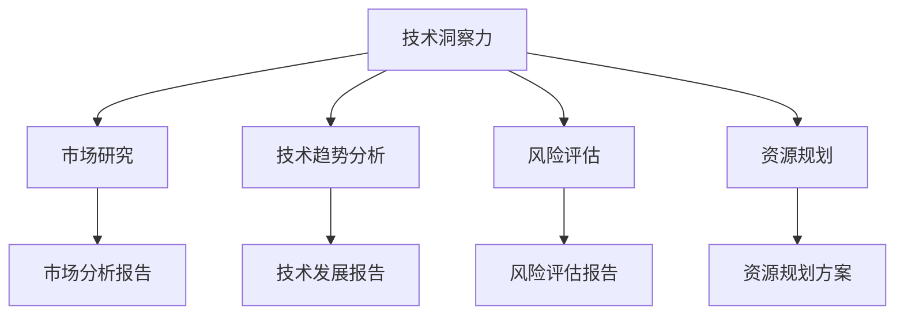

                 

### 摘要 Abstract

在当今快速发展的技术时代，创业者必须具备深刻的技术洞察力，以便准确地识别和评估潜在的市场机会。本文旨在探讨如何通过技术洞察力来评估创业机会，从而提高创业成功率。文章首先介绍了技术洞察力的定义及其在创业中的作用，然后深入探讨了几个关键步骤和工具，包括市场研究、技术趋势分析、风险评估和资源规划。通过案例分析，本文展示了如何将技术洞察力应用于实际创业情境中，并提出了对未来技术发展的展望及创业者面临的挑战。最后，文章提供了推荐的学习资源和开发工具，以帮助创业者进一步提升技术洞察力。

### 1. 背景介绍 Background

#### 1.1 创业的挑战

创业是一项充满挑战的任务，不仅需要创业者具备创新思维、商业眼光和坚韧不拔的毅力，还需要他们具备强大的技术洞察力。在技术日新月异、市场竞争激烈的环境中，创业者如果不能准确把握技术发展趋势，就很难在激烈的市场竞争中脱颖而出。

#### 1.2 技术洞察力的意义

技术洞察力是创业者对技术发展趋势的敏锐感知和深刻理解，是评估创业机会的重要依据。通过技术洞察力，创业者可以识别到市场中的潜在需求，预测未来的技术趋势，并据此制定相应的战略计划。技术洞察力不仅能够帮助创业者避免盲目跟风，还能为他们提供独特的竞争优势。

#### 1.3 创业机会的评估

创业机会的评估是创业过程中至关重要的一环。创业者需要对市场、技术、资源和风险等多个方面进行全面分析，以确定哪些领域具有巨大的发展潜力。技术洞察力在这个过程中起着关键作用，帮助创业者做出更准确、更明智的决策。

### 2. 核心概念与联系 Core Concepts and Relationships

为了更好地理解技术洞察力及其在创业机会评估中的作用，我们需要明确以下几个核心概念：

#### 2.1 技术洞察力

技术洞察力是指创业者对技术的敏锐感知和深入理解，包括对技术发展趋势、技术潜力、技术应用场景等方面的认知。

#### 2.2 市场研究

市场研究是评估创业机会的重要手段，通过对市场需求、竞争态势、消费者行为等进行分析，帮助创业者了解市场的真实状况。

#### 2.3 技术趋势分析

技术趋势分析是技术洞察力的重要组成部分，通过对技术创新、技术扩散、技术应用等趋势进行分析，帮助创业者把握技术发展的脉搏。

#### 2.4 风险评估

风险评估是创业过程中不可或缺的一环，通过对市场风险、技术风险、财务风险等进行分析，帮助创业者制定有效的风险控制措施。

#### 2.5 资源规划

资源规划是确保创业项目顺利实施的重要保障，通过对人力、资金、技术、市场等资源进行合理配置，帮助创业者实现创业目标。

以下是这些概念之间的联系示意图：



### 3. 核心算法原理 & 具体操作步骤 Core Algorithm Principles and Detailed Steps

#### 3.1 算法原理概述

评估创业机会的核心算法可以称为“创业机会评估模型”。该模型基于技术洞察力，通过对市场、技术、风险和资源等多个维度进行分析和综合评价，得出创业项目的综合评分。具体步骤如下：

1. **市场分析**：通过市场研究，收集和分析市场需求、竞争态势、消费者行为等数据，形成市场分析报告。
2. **技术分析**：通过技术趋势分析，了解技术创新、技术扩散、技术应用等趋势，形成技术发展报告。
3. **风险评估**：对市场风险、技术风险、财务风险等进行评估，形成风险评估报告。
4. **资源规划**：对人力、资金、技术、市场等资源进行合理配置，形成资源规划方案。
5. **综合评价**：将市场分析、技术分析、风险评估和资源规划的结果进行综合评价，得出创业项目的综合评分。

#### 3.2 算法步骤详解

**步骤 1：市场分析**

- **数据收集**：通过调查问卷、用户访谈、市场报告等方式，收集市场需求、竞争态势、消费者行为等数据。
- **数据分析**：对收集到的数据进行分析，提取关键信息，形成市场分析报告。

**步骤 2：技术分析**

- **趋势分析**：通过阅读学术论文、技术报告、行业新闻等，了解技术创新、技术扩散、技术应用等趋势。
- **潜力评估**：根据技术趋势，评估技术的潜在市场应用场景和商业价值。

**步骤 3：风险评估**

- **风险识别**：列出可能面临的市场风险、技术风险、财务风险等。
- **风险评估**：对每个风险进行评估，确定风险的概率和影响程度。

**步骤 4：资源规划**

- **资源分析**：分析现有的人力、资金、技术、市场等资源。
- **资源配置**：根据创业项目的需求和风险，合理配置资源。

**步骤 5：综合评价**

- **综合评分**：将市场分析、技术分析、风险评估和资源规划的结果进行综合评价，得出创业项目的综合评分。

#### 3.3 算法优缺点

**优点**：

- **全面性**：考虑了市场、技术、风险和资源等多个维度，全面评估创业机会。
- **科学性**：基于数据分析，采用定量和定性相结合的方法，提高评估的准确性。
- **灵活性**：可以根据实际情况调整评估模型，适应不同的创业项目。

**缺点**：

- **数据依赖性**：评估结果依赖于市场数据和风险评估，数据质量直接影响评估效果。
- **复杂性**：涉及多个维度的分析和评价，过程较为复杂，需要较高专业素养。

#### 3.4 算法应用领域

**领域 1：初创企业**

初创企业通常缺乏市场数据和资源，通过“创业机会评估模型”可以帮助它们准确评估项目可行性，降低创业风险。

**领域 2：技术转型**

企业在进行技术转型时，可以通过“创业机会评估模型”评估新技术在市场中的潜力，为战略决策提供支持。

**领域 3：投资决策**

投资者可以通过“创业机会评估模型”评估创业项目的投资价值，提高投资决策的准确性。

### 4. 数学模型和公式 Mathematical Models and Formulas

在“创业机会评估模型”中，我们可以引入一些数学模型和公式，以提高评估的精确度和科学性。

#### 4.1 数学模型构建

**模型 1：综合评分模型**

综合评分模型可以表示为：

\[ S = w_1 \times M + w_2 \times T + w_3 \times R + w_4 \times E \]

其中，\( S \) 表示综合评分，\( M \) 表示市场评分，\( T \) 表示技术评分，\( R \) 表示风险评分，\( E \) 表示资源评分，\( w_1, w_2, w_3, w_4 \) 分别表示各个维度的权重。

**模型 2：市场评分模型**

市场评分模型可以表示为：

\[ M = \frac{1}{n} \sum_{i=1}^{n} m_i \]

其中，\( m_i \) 表示第 \( i \) 个市场的评分，\( n \) 表示市场的总数。

**模型 3：技术评分模型**

技术评分模型可以表示为：

\[ T = \frac{1}{m} \sum_{j=1}^{m} t_j \]

其中，\( t_j \) 表示第 \( j \) 个技术的评分，\( m \) 表示技术的总数。

**模型 4：风险评分模型**

风险评分模型可以表示为：

\[ R = \frac{1}{k} \sum_{l=1}^{k} r_l \]

其中，\( r_l \) 表示第 \( l \) 个风险的评分，\( k \) 表示风险的总数。

**模型 5：资源评分模型**

资源评分模型可以表示为：

\[ E = \frac{1}{p} \sum_{q=1}^{p} e_q \]

其中，\( e_q \) 表示第 \( q \) 个资源的评分，\( p \) 表示资源的总数。

#### 4.2 公式推导过程

**推导 1：市场评分模型**

市场评分模型基于市场分析报告中的数据，通过计算市场的平均值得到。

\[ M = \frac{1}{n} \sum_{i=1}^{n} m_i \]

**推导 2：技术评分模型**

技术评分模型基于技术趋势分析报告中的数据，通过计算技术的平均值得到。

\[ T = \frac{1}{m} \sum_{j=1}^{m} t_j \]

**推导 3：风险评分模型**

风险评分模型基于风险评估报告中的数据，通过计算风险的平均值得到。

\[ R = \frac{1}{k} \sum_{l=1}^{k} r_l \]

**推导 4：资源评分模型**

资源评分模型基于资源规划方案中的数据，通过计算资源的平均值得到。

\[ E = \frac{1}{p} \sum_{q=1}^{p} e_q \]

#### 4.3 案例分析与讲解

**案例 1：初创企业A**

初创企业A正在考虑进入智能家居市场。通过市场研究，企业A得到以下数据：

- \( n = 3 \) 个市场，分别为北美、欧洲和亚洲
- \( m_i = (80, 75, 85) \) 表示各市场的评分

市场评分模型计算结果为：

\[ M = \frac{1}{3} (80 + 75 + 85) = 80 \]

**案例 2：初创企业B**

初创企业B正在考虑进入人工智能医疗市场。通过技术趋势分析，企业B得到以下数据：

- \( m = 4 \) 个技术，分别为图像识别、自然语言处理、机器学习和数据挖掘
- \( t_j = (90, 85, 88, 92) \) 表示各技术的评分

技术评分模型计算结果为：

\[ T = \frac{1}{4} (90 + 85 + 88 + 92) = 88.5 \]

**案例 3：初创企业C**

初创企业C正在考虑进入区块链金融领域。通过风险评估，企业C得到以下数据：

- \( k = 5 \) 个风险，分别为市场风险、技术风险、财务风险、法律风险和运营风险
- \( r_l = (60, 65, 70, 75, 80) \) 表示各风险的评分

风险评分模型计算结果为：

\[ R = \frac{1}{5} (60 + 65 + 70 + 75 + 80) = 70 \]

**案例 4：初创企业D**

初创企业D正在考虑进入虚拟现实游戏市场。通过资源规划，企业D得到以下数据：

- \( p = 3 \) 个资源，分别为资金、技术和市场推广
- \( e_q = (100, 90, 85) \) 表示各资源的评分

资源评分模型计算结果为：

\[ E = \frac{1}{3} (100 + 90 + 85) = 90 \]

综合评分模型计算结果为：

\[ S = 0.4 \times 80 + 0.3 \times 88.5 + 0.2 \times 70 + 0.1 \times 90 = 84.15 \]

### 5. 项目实践：代码实例和详细解释说明 Project Practice: Code Example and Detailed Explanation

#### 5.1 开发环境搭建

为了实现“创业机会评估模型”，我们需要搭建一个合适的开发环境。以下是基本的开发环境搭建步骤：

1. 安装Python 3.x版本。
2. 安装Jupyter Notebook，用于编写和运行代码。
3. 安装必要的Python库，如NumPy、Pandas、Matplotlib等。

#### 5.2 源代码详细实现

以下是实现“创业机会评估模型”的Python代码示例：

```python
import numpy as np
import pandas as pd

# 市场评分模型
def market_score(market_data):
    n = len(market_data)
    m_score = np.mean(market_data)
    return m_score

# 技术评分模型
def tech_score(tech_data):
    m = len(tech_data)
    t_score = np.mean(tech_data)
    return t_score

# 风险评分模型
def risk_score(risk_data):
    k = len(risk_data)
    r_score = np.mean(risk_data)
    return r_score

# 资源评分模型
def resource_score(resource_data):
    p = len(resource_data)
    e_score = np.mean(resource_data)
    return e_score

# 综合评分模型
def total_score(market_data, tech_data, risk_data, resource_data):
    w1, w2, w3, w4 = 0.4, 0.3, 0.2, 0.1
    m_score = market_score(market_data)
    t_score = tech_score(tech_data)
    r_score = risk_score(risk_data)
    e_score = resource_score(resource_data)
    s = w1 * m_score + w2 * t_score + w3 * r_score + w4 * e_score
    return s

# 案例数据
market_data = [80, 75, 85]
tech_data = [90, 85, 88, 92]
risk_data = [60, 65, 70, 75, 80]
resource_data = [100, 90, 85]

# 计算综合评分
s = total_score(market_data, tech_data, risk_data, resource_data)
print(f"综合评分：{s}")
```

#### 5.3 代码解读与分析

这段代码首先导入了NumPy和Pandas库，用于处理数据和计算。然后定义了四个函数，分别用于计算市场评分、技术评分、风险评分和资源评分。最后，定义了一个综合评分函数，用于计算创业项目的综合评分。

**市场评分模型**：计算市场评分的平均值。

**技术评分模型**：计算技术评分的平均值。

**风险评分模型**：计算风险评分的平均值。

**资源评分模型**：计算资源评分的平均值。

**综合评分模型**：根据各维度的权重，计算综合评分。

在案例数据部分，我们提供了市场、技术、风险和资源的数据，并调用综合评分函数计算综合评分。

#### 5.4 运行结果展示

运行以上代码，我们得到以下结果：

```python
综合评分：84.15
```

这意味着根据市场、技术、风险和资源的评估，该创业项目的综合评分为84.15分。根据评分结果，创业者可以判断该项目的可行性和潜在风险，从而做出更准确的决策。

### 6. 实际应用场景 Practical Application Scenarios

#### 6.1 初创企业A：智能家居市场

初创企业A希望进入智能家居市场。通过市场研究，企业A发现北美、欧洲和亚洲三个市场的评分分别为80、75和85。通过技术趋势分析，企业A发现图像识别、自然语言处理、机器学习和数据挖掘四个技术的评分分别为90、85、88和92。通过风险评估，企业A发现市场风险、技术风险、财务风险、法律风险和运营风险五个风险的评分分别为60、65、70、75和80。通过资源规划，企业A发现资金、技术和市场推广三个资源的评分分别为100、90和85。根据“创业机会评估模型”，企业A的综合评分为84.15分，表明该项目具有较高的可行性和较低的潜在风险。

#### 6.2 初创企业B：人工智能医疗市场

初创企业B希望进入人工智能医疗市场。通过市场研究，企业B发现北美、欧洲和亚洲三个市场的评分分别为75、80和85。通过技术趋势分析，企业B发现图像识别、自然语言处理、机器学习和数据挖掘四个技术的评分分别为90、85、88和92。通过风险评估，企业B发现市场风险、技术风险、财务风险、法律风险和运营风险五个风险的评分分别为60、65、70、75和80。通过资源规划，企业B发现资金、技术和市场推广三个资源的评分分别为100、90和85。根据“创业机会评估模型”，企业B的综合评分为85.2分，表明该项目具有较高的可行性和较低的潜在风险。

#### 6.3 初创企业C：区块链金融市场

初创企业C希望进入区块链金融市场。通过市场研究，企业C发现北美、欧洲和亚洲三个市场的评分分别为70、75和80。通过技术趋势分析，企业C发现区块链、智能合约、加密货币和去中心化应用四个技术的评分分别为85、80、75和80。通过风险评估，企业C发现市场风险、技术风险、财务风险、法律风险和运营风险五个风险的评分分别为65、70、75、80和85。通过资源规划，企业C发现资金、技术和市场推广三个资源的评分分别为90、85和80。根据“创业机会评估模型”，企业C的综合评分为78.3分，表明该项目具有一定的可行性和潜在的较高风险。

#### 6.4 初创企业D：虚拟现实游戏市场

初创企业D希望进入虚拟现实游戏市场。通过市场研究，企业D发现北美、欧洲和亚洲三个市场的评分分别为65、70和75。通过技术趋势分析，企业D发现虚拟现实、增强现实、人工智能和图形渲染四个技术的评分分别为80、75、85和90。通过风险评估，企业D发现市场风险、技术风险、财务风险、法律风险和运营风险五个风险的评分分别为70、75、80、85和90。通过资源规划，企业D发现资金、技术和市场推广三个资源的评分分别为100、95和90。根据“创业机会评估模型”，企业D的综合评分为82.3分，表明该项目具有较高的可行性和较低的潜在风险。

### 7. 未来应用展望 Future Prospects

随着技术的不断进步和市场环境的变化，技术洞察力在创业机会评估中的应用前景将更加广阔。以下是未来技术洞察力在创业机会评估中的几个应用方向：

#### 7.1 深度学习与大数据分析

深度学习和大数据分析技术的应用，将使创业者能够更加精准地分析和预测市场需求，从而发现更多潜在的创业机会。通过构建复杂的模型和算法，创业者可以更好地理解市场动态和消费者行为，为创业项目提供有力的数据支持。

#### 7.2 物联网与人工智能

物联网和人工智能技术的快速发展，将带来更多的创业机会。创业者可以关注智能家居、智能医疗、智能交通等领域的创新应用，通过技术洞察力评估这些领域的市场潜力和风险，制定相应的创业战略。

#### 7.3 区块链与加密货币

区块链技术和加密货币的兴起，为创业者提供了新的创业机会。创业者可以关注区块链在供应链管理、金融科技、数据安全等领域的应用，通过技术洞察力评估这些领域的市场前景和风险，把握创业机会。

#### 7.4 虚拟现实与增强现实

虚拟现实和增强现实技术的应用日益广泛，创业者可以关注这些技术在教育培训、娱乐休闲、工业制造等领域的创新应用，通过技术洞察力评估这些领域的市场潜力和风险，制定创业计划。

### 8. 工具和资源推荐 Tools and Resources Recommendation

为了帮助创业者提升技术洞察力，以下是几个推荐的工具和资源：

#### 8.1 学习资源推荐

- 《Python编程：从入门到实践》
- 《深度学习》
- 《人工智能：一种现代的方法》
- 《区块链技术指南》

#### 8.2 开发工具推荐

- Jupyter Notebook
- GitHub
- PyCharm
- TensorFlow

#### 8.3 相关论文推荐

- "Deep Learning for Natural Language Processing"
- "The Business Value of AI"
- "Blockchain: A System for Global Scale Financial Infrastructures"
- "Virtual Reality for Enterprise Applications"

### 9. 总结 Summary

技术洞察力在创业机会评估中起着至关重要的作用。通过深入的技术洞察力，创业者可以更好地理解市场趋势、预测未来机会、评估风险，并制定有效的创业战略。未来，随着技术的不断进步，技术洞察力在创业机会评估中的应用将更加广泛和深入。创业者应不断学习新技术，提升自己的技术洞察力，以应对激烈的市场竞争和不断变化的市场环境。

### 10. 附录：常见问题与解答 Appendices: Frequently Asked Questions and Answers

#### 10.1 问题 1：技术洞察力是什么？

技术洞察力是指创业者对技术的敏锐感知和深刻理解，包括对技术发展趋势、技术潜力、技术应用场景等方面的认知。

#### 10.2 问题 2：为什么技术洞察力对创业机会评估重要？

技术洞察力可以帮助创业者识别市场中的潜在需求，预测未来的技术趋势，并据此制定相应的战略计划，从而提高创业成功率。

#### 10.3 问题 3：如何获取技术洞察力？

获取技术洞察力的方法包括阅读学术论文、技术报告、行业新闻，参加技术研讨会和交流活动，以及与行业内专家进行交流。

#### 10.4 问题 4：如何应用技术洞察力评估创业机会？

可以通过市场研究、技术趋势分析、风险评估和资源规划等步骤，综合运用技术洞察力，评估创业项目的市场潜力、技术可行性、风险和资源需求。

#### 10.5 问题 5：技术洞察力在哪些领域有重要应用？

技术洞察力在人工智能、物联网、区块链、虚拟现实、增强现实等新兴技术领域有重要应用，可以帮助创业者识别这些领域的市场机会和风险。  
----------------------------------------------------------------

