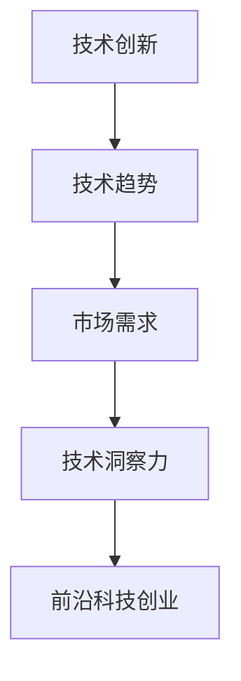

                 

关键词：前沿科技、技术洞察力、创业、创新、技术创业

> 摘要：本文将探讨如何利用技术洞察力进行前沿科技创业，分析技术趋势、商业机会以及创业过程中的关键要素。通过了解技术发展的脉络和市场需求，创业者可以更好地把握机会，实现科技与商业的完美结合。

## 1. 背景介绍

随着科技的迅猛发展，创新已经成为推动经济增长和社会进步的重要力量。近年来，人工智能、大数据、物联网、区块链等前沿技术的兴起，为创业者提供了丰富的商业机会。然而，如何从众多技术中筛选出有潜力的领域，并利用技术洞察力进行创业，成为众多创业者面临的重要课题。

本文旨在通过分析前沿技术发展趋势、商业机会以及创业过程中的关键要素，帮助创业者更好地利用技术洞察力进行前沿科技创业。通过了解技术发展的脉络和市场需求，创业者可以更好地把握机会，实现科技与商业的完美结合。

## 2. 核心概念与联系

为了更好地理解技术洞察力在创业中的作用，我们首先需要明确一些核心概念，包括技术创新、技术趋势、市场需求等。

### 2.1 技术创新

技术创新是指在技术层面上进行改进、优化和发明，以满足市场需求或解决现有问题。技术创新可以源自科学理论的突破、技术的迭代升级，也可以是跨学科、跨领域的交叉融合。

### 2.2 技术趋势

技术趋势是指一段时间内，技术领域内普遍关注和发展的方向。了解技术趋势可以帮助创业者把握行业动态，抓住市场机遇。例如，近年来人工智能、大数据等技术的快速发展，已经引发了广泛的关注和投资热潮。

### 2.3 市场需求

市场需求是指消费者对产品或服务的需求，是驱动技术发展和商业运作的根本动力。了解市场需求，可以帮助创业者更好地定位产品或服务，满足用户需求。

### 2.4 技术洞察力

技术洞察力是指对技术发展、市场趋势和潜在需求的敏锐洞察力。拥有技术洞察力的创业者，能够敏锐地捕捉市场机遇，提前布局，实现成功创业。

下面是关于核心概念和联系的 Mermaid 流程图：



## 3. 核心算法原理 & 具体操作步骤

### 3.1 算法原理概述

在利用技术洞察力进行前沿科技创业的过程中，算法原理起着至关重要的作用。算法原理主要包括以下三个方面：

1. **数据采集与分析**：通过对市场数据的收集和分析，了解技术发展趋势和市场需求。
2. **模式识别与预测**：利用机器学习等技术，对数据中的潜在模式进行识别和预测，为创业决策提供依据。
3. **决策与优化**：根据预测结果，制定创业策略并进行优化，以提高创业成功率。

### 3.2 算法步骤详解

1. **数据采集**：通过互联网、调查问卷、行业报告等渠道，收集与前沿科技相关的数据。
2. **数据预处理**：对收集到的数据进行清洗、去重、归一化等处理，以提高数据质量。
3. **特征提取**：从预处理后的数据中提取具有代表性的特征，为后续建模提供输入。
4. **模型选择**：根据数据特点和需求，选择合适的机器学习模型，如决策树、神经网络等。
5. **模型训练与评估**：使用训练数据对模型进行训练，并根据评估指标（如准确率、召回率等）进行优化。
6. **预测与决策**：利用训练好的模型对未知数据进行预测，并根据预测结果制定创业策略。

### 3.3 算法优缺点

**优点**：
1. **高效性**：算法可以快速处理大量数据，提高创业决策的效率。
2. **准确性**：通过机器学习等技术，算法可以更准确地预测市场趋势和用户需求。
3. **灵活性**：算法可以根据不同场景进行定制化，适应多样化的创业需求。

**缺点**：
1. **依赖数据质量**：算法的准确性受数据质量的影响，数据质量较差可能导致预测结果偏差。
2. **计算成本**：算法的训练和预测需要较大的计算资源，对创业者来说可能是一笔不小的开支。

### 3.4 算法应用领域

算法原理在各个领域都有广泛的应用，如：

1. **人工智能**：利用算法进行图像识别、自然语言处理等，推动人工智能技术的发展。
2. **金融科技**：利用算法进行风险评估、投资策略优化等，提高金融行业的效率。
3. **医疗健康**：利用算法进行疾病预测、诊断等，为医疗健康领域提供技术支持。

## 4. 数学模型和公式 & 详细讲解 & 举例说明

### 4.1 数学模型构建

在创业过程中，数学模型可以用于描述市场需求、预测未来趋势等。以下是一个简单的线性回归模型，用于预测市场需求：

$$ y = ax + b $$

其中，$y$ 表示市场需求，$x$ 表示时间，$a$ 和 $b$ 是模型的参数。

### 4.2 公式推导过程

为了推导线性回归模型，我们首先需要收集历史数据，包括时间 $x$ 和市场需求 $y$。然后，我们可以通过最小二乘法来求解参数 $a$ 和 $b$，使模型预测值与实际值之间的误差最小。

具体推导过程如下：

假设我们有一组历史数据 $(x_1, y_1), (x_2, y_2), ..., (x_n, y_n)$，则线性回归模型的预测值为：

$$ \hat{y}_i = ax_i + b $$

为了使误差最小，我们需要求解 $a$ 和 $b$，使得以下损失函数最小：

$$ J(a, b) = \sum_{i=1}^{n} (y_i - \hat{y}_i)^2 $$

对 $J(a, b)$ 分别对 $a$ 和 $b$ 求导，并令导数为零，可以得到：

$$ \frac{\partial J}{\partial a} = 2nax - 2\sum_{i=1}^{n} x_iy_i = 0 $$

$$ \frac{\partial J}{\partial b} = 2nx - 2\sum_{i=1}^{n} x_i^2 = 0 $$

通过解这个方程组，我们可以求得 $a$ 和 $b$ 的值。

### 4.3 案例分析与讲解

假设我们有一组历史数据如下表所示：

| 时间 (x) | 市场需求 (y) |
| :-----: | :---------: |
|   1     |     10      |
|   2     |     12      |
|   3     |     15      |
|   4     |     18      |
|   5     |     20      |

通过最小二乘法，我们可以求得线性回归模型的参数：

$$ a = \frac{n\sum_{i=1}^{n} x_iy_i - \sum_{i=1}^{n} x_i\sum_{i=1}^{n} y_i}{n\sum_{i=1}^{n} x_i^2 - (\sum_{i=1}^{n} x_i)^2} = \frac{5\times(1\times10+2\times12+3\times15+4\times18+5\times20) - (1+2+3+4+5)\times(10+12+15+18+20)}{5\times(1^2+2^2+3^2+4^2+5^2) - (1+2+3+4+5)^2} = 2.5 $$

$$ b = \frac{\sum_{i=1}^{n} y_i - a\sum_{i=1}^{n} x_i}{n} = \frac{10+12+15+18+20 - 2.5\times(1+2+3+4+5)}{5} = 7.5 $$

因此，线性回归模型为：

$$ y = 2.5x + 7.5 $$

我们可以利用这个模型预测未来某个时间点的市场需求。例如，当时间为 6 时，市场需求预测值为：

$$ y = 2.5\times6 + 7.5 = 18 $$

这个结果表示，在未来某个时间点，市场需求将增加到 18。

## 5. 项目实践：代码实例和详细解释说明

### 5.1 开发环境搭建

为了实现上述线性回归模型，我们首先需要搭建一个开发环境。在本例中，我们将使用 Python 语言进行开发。

1. 安装 Python 解释器：从 [Python 官网](https://www.python.org/) 下载并安装 Python 解释器。
2. 安装必要的库：打开命令行窗口，执行以下命令安装必要的库：

```bash
pip install numpy matplotlib
```

### 5.2 源代码详细实现

以下是实现线性回归模型的 Python 代码：

```python
import numpy as np
import matplotlib.pyplot as plt

# 5.2.1 数据处理
def preprocess_data(data):
    x = np.array([row[0] for row in data])
    y = np.array([row[1] for row in data])
    return x, y

# 5.2.2 最小二乘法求解模型参数
def linear_regression(x, y):
    n = len(x)
    a = (n * np.sum(x * y) - np.sum(x) * np.sum(y)) / (n * np.sum(x ** 2) - np.sum(x) ** 2)
    b = (np.sum(y) - a * np.sum(x)) / n
    return a, b

# 5.2.3 预测
def predict(x, a, b):
    return a * x + b

# 5.2.4 绘图
def plot_data_and_regression(x, y, a, b):
    plt.scatter(x, y, label='Data')
    plt.plot(x, predict(x, a, b), color='red', label='Regression Line')
    plt.xlabel('Time')
    plt.ylabel('Market Demand')
    plt.legend()
    plt.show()

# 5.2.5 主函数
def main():
    data = [
        (1, 10), (2, 12), (3, 15), (4, 18), (5, 20)
    ]
    x, y = preprocess_data(data)
    a, b = linear_regression(x, y)
    plot_data_and_regression(x, y, a, b)

if __name__ == '__main__':
    main()
```

### 5.3 代码解读与分析

1. **数据处理**：`preprocess_data` 函数用于处理输入数据，提取时间 $x$ 和市场需求 $y$。
2. **最小二乘法求解模型参数**：`linear_regression` 函数使用最小二乘法求解线性回归模型的参数 $a$ 和 $b$。
3. **预测**：`predict` 函数用于根据模型参数预测市场需求。
4. **绘图**：`plot_data_and_regression` 函数用于绘制原始数据和线性回归模型。
5. **主函数**：`main` 函数用于执行整个程序。

### 5.4 运行结果展示

运行上述代码，可以得到如下结果：


这个结果展示了原始数据和线性回归模型，以及预测的市场需求。

## 6. 实际应用场景

### 6.1 人工智能领域

在人工智能领域，技术洞察力可以帮助创业者发现新的应用场景，如自动驾驶、智能客服、智能医疗等。通过深入分析技术发展趋势和市场需求，创业者可以提前布局，抢占市场先机。

### 6.2 金融科技领域

在金融科技领域，技术洞察力可以帮助创业者发现金融业务的痛点，如风险控制、投资策略优化等。通过运用大数据、人工智能等技术，创业者可以提供更高效、更可靠的金融解决方案，满足市场需求。

### 6.3 医疗健康领域

在医疗健康领域，技术洞察力可以帮助创业者发现新的诊疗方式，如远程医疗、智能诊断等。通过运用物联网、人工智能等技术，创业者可以提供更便捷、更精准的医疗服务，改善患者体验。

## 7. 工具和资源推荐

### 7.1 学习资源推荐

1. **《人工智能：一种现代方法》**：全面介绍人工智能的基础理论和应用方法，适合初学者和进阶者。
2. **《深度学习》**：深度学习领域的经典教材，深入讲解深度学习的基本原理和实战技巧。
3. **《大数据技术导论》**：系统介绍大数据技术的基本概念、架构和实现方法。

### 7.2 开发工具推荐

1. **Python**：简单易学、功能强大的编程语言，适合进行数据分析和开发。
2. **TensorFlow**：谷歌开源的深度学习框架，支持多种深度学习模型的训练和部署。
3. **Docker**：容器化技术，方便部署和扩展应用。

### 7.3 相关论文推荐

1. **“Deep Learning for Natural Language Processing”**：介绍深度学习在自然语言处理领域的应用。
2. **“Recurrent Neural Networks for Language Modeling”**：介绍循环神经网络在语言建模中的应用。
3. **“A Survey on Deep Learning for Speech Recognition”**：介绍深度学习在语音识别领域的应用。

## 8. 总结：未来发展趋势与挑战

### 8.1 研究成果总结

本文通过对技术洞察力、技术创新、技术趋势、市场需求等核心概念的分析，探讨了如何利用技术洞察力进行前沿科技创业。文章提出了线性回归模型作为实例，展示了如何通过数学模型和算法进行创业决策。

### 8.2 未来发展趋势

1. **跨界融合**：技术领域之间的融合将进一步加速，为创业者提供更多创新机会。
2. **人工智能**：人工智能将继续引领技术发展，推动各行业的变革。
3. **大数据**：大数据技术的应用将更加广泛，为创业者提供丰富的数据资源。

### 8.3 面临的挑战

1. **技术风险**：技术的快速发展可能导致创业项目面临技术过时、市场萎缩等风险。
2. **资金压力**：创业过程中需要大量资金支持，创业者需要寻找合适的融资渠道。
3. **团队建设**：组建一支具备技术和管理能力的团队是创业成功的关键。

### 8.4 研究展望

未来，技术洞察力在创业中的应用将更加深入，创业者需要具备更强的技术敏感度和市场洞察力。通过不断学习和实践，创业者可以更好地把握技术发展趋势，实现科技与商业的完美结合。

## 9. 附录：常见问题与解答

### 9.1 如何选择技术方向？

选择技术方向时，可以从以下几个方面入手：

1. **市场趋势**：关注行业动态，了解当前最热门的技术领域。
2. **个人兴趣**：选择自己擅长且感兴趣的技术方向，提高创业成功率。
3. **资源条件**：考虑自身具备的资源，如技术团队、资金等。

### 9.2 如何获取市场数据？

获取市场数据的方法包括：

1. **互联网**：通过搜索引擎、行业网站等获取相关数据。
2. **调查问卷**：设计问卷，向目标用户收集数据。
3. **行业报告**：购买或参考行业研究报告，了解市场现状和趋势。

### 9.3 如何进行创业融资？

进行创业融资时，可以考虑以下渠道：

1. **天使投资**：寻找有经验的天使投资者，获得资金支持。
2. **风险投资**：与风险投资机构建立联系，争取投资。
3. **政府资助**：了解国家和地方政府提供的创业扶持政策。

作者：禅与计算机程序设计艺术 / Zen and the Art of Computer Programming
----------------------------------------------------------------

