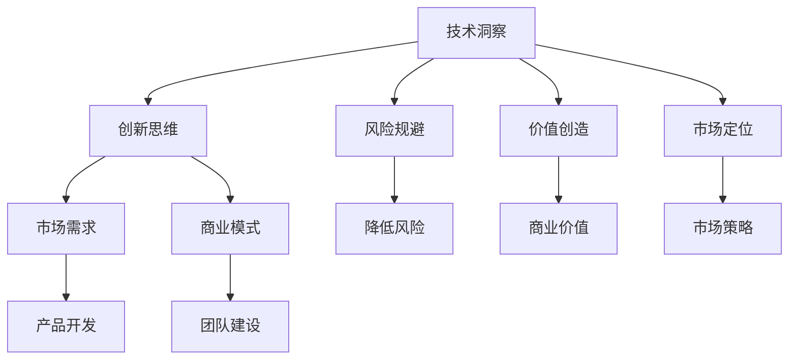

                 

### 1. 背景介绍

随着全球数字化进程的不断推进，技术洞察在创新创业中的作用日益凸显。无论是初创公司还是大型企业，都在不断寻求通过技术创新来抢占市场先机，实现商业模式的创新。在这个过程中，技术洞察成为了企业决策的重要依据，也成为了创业者在激烈竞争中脱颖而出的关键因素。

本文旨在探讨如何利用技术洞察进行创新创业。我们将首先介绍技术洞察的定义和重要性，然后深入探讨技术洞察在创新创业中的应用，并分析如何通过技术洞察来发现市场机会和制定商业策略。最后，我们将结合具体案例，展示如何将技术洞察应用于实际创业过程中，并探讨未来发展趋势和面临的挑战。

技术洞察，顾名思义，是指对技术领域深入理解和洞察的能力。它不仅仅是了解技术的原理和实现，更涉及对技术趋势、技术可能带来的影响以及如何利用技术实现商业价值的理解。在创新创业中，技术洞察能够帮助创业者更好地把握市场动态，识别潜在机会，规避风险，从而提高创业成功率。

技术洞察的重要性不言而喻。首先，它能够帮助创业者做出更明智的决策。通过深入了解技术发展趋势和行业动态，创业者可以明确自己的业务定位和发展方向，避免盲目跟风或重复他人已经失败的模式。其次，技术洞察能够提高创新效率。创业者可以通过技术洞察来发现创新点和改进方向，快速响应市场需求，提高产品竞争力。最后，技术洞察有助于构建核心竞争力。在技术创新成为企业核心竞争力的重要因素的今天，拥有强大的技术洞察力意味着能够在市场中占据有利位置，保持持续的创新能力和竞争力。

在接下来的章节中，我们将详细探讨技术洞察的原理、方法及应用，以期为读者提供全面的创新创业指导。通过本文的阅读，读者将能够了解如何利用技术洞察来发现市场机会，制定商业策略，以及在实际创业过程中如何运用技术洞察来提高成功率。

### 2. 核心概念与联系

为了深入理解技术洞察在创新创业中的应用，我们首先需要明确几个核心概念，并探讨它们之间的联系。

#### 2.1 技术洞察

技术洞察，是指对技术发展趋势、潜在应用、以及其对行业和社会影响的敏锐洞察力。它不仅仅是对现有技术的了解，更包括对新兴技术的前瞻性判断。技术洞察力需要具备以下几个方面的能力：

1. **技术趋势识别**：能够迅速识别出哪些技术正处于快速发展期，哪些技术可能在未来几年内成为主流。
2. **影响评估**：能够准确评估新技术对行业和社会可能带来的影响，包括成本、效率、安全性等方面。
3. **创新应用**：能够将新技术与实际问题结合，提出创新的解决方案。
4. **商业价值挖掘**：能够从技术中发现商业机会，并制定有效的商业策略。

#### 2.2 创新创业

创新创业是指通过创新来创造新的商业模式、产品或服务，从而实现商业价值的过程。创新创业的核心要素包括创新思维、商业模式设计、团队建设、市场拓展等。成功的创新创业需要以下条件：

1. **创新思维**：能够从不同角度思考问题，勇于挑战传统思维，提出新颖的解决方案。
2. **市场需求**：产品或服务必须满足市场需求，解决用户痛点。
3. **团队协作**：拥有具备不同技能的团队成员，能够高效协作。
4. **资本运作**：合理利用资本，实现快速迭代和规模扩张。

#### 2.3 商业模式

商业模式是指企业如何通过提供产品或服务来创造收入和利润的机制。一个成功的商业模式需要具备以下几个特点：

1. **盈利模式**：明确企业的盈利方式，包括产品定价、销售渠道、客户关系管理等。
2. **客户价值**：提供的产品或服务能够为用户带来真正的价值。
3. **成本结构**：企业的运营成本控制在合理范围内，确保盈利能力。
4. **可扩展性**：商业模式能够在不同市场和环境条件下持续运营和扩展。

#### 2.4 技术洞察与创新创业的联系

技术洞察与创新创业之间的联系主要体现在以下几个方面：

1. **创新驱动**：技术洞察能够为创新创业提供创新动力，帮助创业者发现新的技术机会和市场空间。
2. **风险规避**：通过对技术的深入洞察，创业者可以识别和规避潜在的技术风险，降低创业失败的概率。
3. **价值创造**：技术洞察能够帮助创业者发现技术应用的商业价值，从而制定更具竞争力的商业模式。
4. **市场定位**：技术洞察能够帮助创业者准确把握市场动态，制定符合市场需求的产品策略。

#### 2.5 技术洞察的应用

在创新创业过程中，技术洞察的应用主要体现在以下几个方面：

1. **市场机会识别**：通过技术洞察，创业者可以识别出潜在的市场机会，制定针对性的市场进入策略。
2. **产品开发**：技术洞察能够帮助创业者确定产品方向，优化产品设计，提高产品竞争力。
3. **商业模式设计**：技术洞察可以为创业者的商业模式设计提供关键信息，确保商业模式的有效性和可持续性。
4. **团队建设**：技术洞察有助于创业者吸引和留住具备技术专长的团队成员，提升团队整体实力。

#### 2.6 Mermaid 流程图

为了更好地展示技术洞察与创新创业之间的联系，我们使用 Mermaid 流程图来描述这一过程：



通过上述核心概念的介绍和Mermaid流程图，我们可以更加清晰地理解技术洞察在创新创业中的重要作用。在接下来的章节中，我们将进一步探讨技术洞察的具体应用和实践方法。

### 3. 核心算法原理 & 具体操作步骤

在了解了技术洞察与创新创业的基本联系之后，我们需要进一步探讨如何具体利用技术洞察来指导创业实践。在这个过程中，核心算法原理和具体操作步骤扮演了至关重要的角色。以下，我们将详细解释这些算法原理，并阐述其在创新创业中的应用。

#### 3.1 算法原理概述

核心算法原理可以概括为以下几个关键点：

1. **数据挖掘与模式识别**：通过对大量数据的挖掘和分析，识别出潜在的模式和趋势，为决策提供数据支持。
2. **机器学习与预测**：利用机器学习算法，从历史数据中学习并建立预测模型，对未来趋势进行预测。
3. **优化算法**：通过优化算法，寻找最优解或次优解，提高创业项目的成功率和效率。
4. **情境模拟**：构建虚拟情境，模拟不同情况下的业务表现，帮助创业者评估和调整策略。

#### 3.2 算法步骤详解

为了更清晰地展示算法原理，我们将具体操作步骤分为以下几个阶段：

1. **数据收集与预处理**：首先，创业者需要收集相关数据，包括市场数据、用户行为数据、竞争者数据等。然后，对数据进行清洗和预处理，确保数据质量。
2. **数据挖掘与模式识别**：利用数据挖掘算法，对预处理后的数据进行深入分析，识别出潜在的模式和趋势。常用的算法包括关联规则挖掘、聚类分析、分类分析等。
3. **机器学习与预测**：在识别出关键模式后，利用机器学习算法构建预测模型。根据不同的业务需求，可以选择线性回归、决策树、神经网络等算法。模型的训练和验证是这一步骤的核心，通过多次迭代优化，提高模型的预测准确率。
4. **优化算法**：根据预测结果，利用优化算法寻找最优解或次优解。这一步骤包括目标函数的设定、约束条件的确定以及求解算法的选择。常见的优化算法有线性规划、动态规划、遗传算法等。
5. **情境模拟**：在确定初步策略后，构建虚拟情境进行模拟。通过模拟不同情境下的业务表现，评估策略的有效性和适应性。这一步骤可以帮助创业者发现潜在的风险和问题，及时进行调整。
6. **决策与执行**：根据模拟结果，制定最终决策，并实施执行策略。这一步骤需要创业者具备快速响应和调整能力，以应对市场变化。

#### 3.3 算法优缺点

每种算法都有其独特的优势和局限性。以下，我们总结了几种常见算法的优缺点：

1. **数据挖掘与模式识别**：
   - 优点：能够从海量数据中发现有价值的信息，帮助创业者做出更明智的决策。
   - 缺点：对数据质量和数量要求较高，数据清洗和预处理过程复杂。
2. **机器学习与预测**：
   - 优点：具有较高的预测准确率，能够为创业者提供可靠的决策依据。
   - 缺点：模型训练和验证过程较为复杂，对计算资源和时间要求较高。
3. **优化算法**：
   - 优点：能够找到最优解或次优解，提高创业项目的成功率。
   - 缺点：对目标函数和约束条件要求较高，求解过程可能需要较长时间。
4. **情境模拟**：
   - 优点：能够模拟不同情境下的业务表现，帮助创业者评估和调整策略。
   - 缺点：模拟结果可能受到模型假设和数据限制，需要谨慎解读。

#### 3.4 算法应用领域

核心算法在创新创业中的应用非常广泛，主要包括以下领域：

1. **市场分析**：通过数据挖掘和机器学习算法，分析市场趋势和用户需求，为创业项目提供市场定位和产品策略。
2. **风险评估**：利用优化算法和情境模拟，评估不同策略的风险和收益，帮助创业者制定风险规避措施。
3. **资源分配**：通过优化算法，合理分配资源，提高创业项目的效率和成功率。
4. **供应链管理**：利用情境模拟和优化算法，优化供应链管理流程，降低成本，提高响应速度。

通过以上对核心算法原理和具体操作步骤的详细解释，我们希望读者能够更好地理解技术洞察在创新创业中的应用。在接下来的章节中，我们将进一步探讨数学模型和公式，以及如何通过具体案例来分析和讲解。

### 3.3 算法优缺点

在详细介绍了核心算法的原理和操作步骤之后，接下来我们需要深入探讨这些算法在实际应用中的优缺点。理解这些优缺点不仅有助于我们更好地利用算法，还能指导我们在实际操作中做出更明智的决策。

#### 3.3.1 优点

首先，让我们来看看这些算法的优点：

1. **数据挖掘与模式识别**：
   - **高效率**：数据挖掘能够快速从海量数据中提取有价值的信息，有助于创业者及时了解市场动态和用户需求。
   - **全面性**：通过模式识别，创业者可以全面了解不同变量之间的关系，从而制定更全面的策略。
   - **精确性**：对于某些特定模式，数据挖掘可以提供非常精确的预测结果，帮助创业者做出更可靠的决策。

2. **机器学习与预测**：
   - **自动化**：机器学习算法能够自动从历史数据中学习规律，减少人工干预，提高预测效率。
   - **适应性**：机器学习模型可以根据新的数据进行自我调整，适应市场变化，提高预测准确性。
   - **通用性**：机器学习算法广泛应用于多个领域，如金融、医疗、零售等，具有较高的通用性。

3. **优化算法**：
   - **高效性**：优化算法能够快速找到最优解或次优解，节省创业者在策略调整上的时间和精力。
   - **灵活性**：优化算法可以根据不同的目标函数和约束条件进行调整，适用于各种复杂场景。
   - **稳健性**：优化算法可以在数据噪声和不确定性较大的情况下，仍能提供可靠的解决方案。

4. **情境模拟**：
   - **预见性**：通过情境模拟，创业者可以预见不同策略在未来可能带来的结果，提前制定应对措施。
   - **多样性**：情境模拟可以模拟多种情境，帮助创业者评估不同策略的可行性和适应性。
   - **可视化**：情境模拟的结果可以通过图表等形式进行直观展示，便于创业者理解和沟通。

#### 3.3.2 缺点

然而，每种算法也存在其局限性，以下为其缺点：

1. **数据挖掘与模式识别**：
   - **数据依赖**：数据挖掘的结果高度依赖于数据质量和数量，如果数据存在噪声或不完整，可能导致错误结论。
   - **计算复杂度**：数据挖掘算法通常需要处理大量数据，计算复杂度较高，对计算资源要求较高。
   - **局限性**：某些模式识别算法可能在特定场景下表现不佳，需要根据实际情况进行调整。

2. **机器学习与预测**：
   - **数据需求**：机器学习模型需要大量的训练数据，对于数据量较少的场景，预测效果可能较差。
   - **过拟合**：如果模型训练时间过长，可能会导致过拟合现象，即模型对训练数据过于敏感，对未知数据的预测能力下降。
   - **解释性**：某些复杂的机器学习模型，如深度神经网络，其内部机制较为复杂，难以解释，可能影响决策的可信度。

3. **优化算法**：
   - **计算成本**：优化算法在某些复杂场景下可能需要较长的时间来求解，增加计算成本。
   - **初始条件依赖**：优化算法的初始条件对最终结果有较大影响，可能需要多次尝试才能找到最优解。
   - **局限性**：某些优化算法可能不适用于非线性或高度复杂的问题。

4. **情境模拟**：
   - **模型假设**：情境模拟依赖于模型假设，如果假设不准确，可能导致模拟结果失真。
   - **数据限制**：情境模拟通常基于历史数据，无法预测未知情况，可能影响模拟结果的准确性。
   - **资源限制**：情境模拟需要大量的计算资源和时间，对于资源有限的创业者可能难以承担。

通过以上对算法优缺点的分析，我们可以更全面地了解每种算法在实际应用中的表现。在实际操作中，创业者应根据具体需求和环境，选择合适的算法，并注意其局限性，以实现最佳效果。

### 3.4 算法应用领域

核心算法在创新创业中的应用领域非常广泛，涵盖市场分析、风险评估、资源分配等多个方面。以下，我们将详细探讨这些应用领域，并结合具体案例进行讲解。

#### 3.4.1 市场分析

市场分析是创新创业中的重要环节，通过对市场数据的深入分析，创业者可以准确把握市场趋势和用户需求，为产品定位和策略制定提供依据。以下是一个具体案例：

**案例**：一家初创公司想要开发一款基于人工智能的智能家居产品。为了确定产品方向和市场需求，公司利用数据挖掘和机器学习算法，对大量用户数据进行分析。

- **数据挖掘与模式识别**：公司通过分析用户行为数据，如使用频率、偏好设置等，识别出用户对智能家居产品的需求模式。例如，某些用户可能更倾向于控制灯光和温度，而另一些用户则更关心安全监控。
- **机器学习与预测**：基于用户需求模式，公司使用机器学习算法预测未来市场趋势。例如，通过分析历史销售数据，预测哪些功能将最受欢迎，从而优化产品设计。

通过市场分析，公司能够明确产品方向，制定有针对性的市场策略，提高产品竞争力。

#### 3.4.2 风险评估

在创新创业过程中，风险评估至关重要。通过算法，创业者可以预测潜在风险，并制定相应的规避措施。以下是一个具体案例：

**案例**：一家初创公司计划进军电商领域。为了评估市场风险，公司利用优化算法和情境模拟进行风险评估。

- **优化算法**：公司使用优化算法，根据市场数据和竞争态势，确定最佳的市场进入策略。例如，确定最优的产品组合、定价策略和销售渠道，以最大程度降低市场风险。
- **情境模拟**：公司构建多个虚拟情境，模拟不同市场条件下公司的业务表现。例如，模拟市场需求增加、竞争加剧等情景，评估公司应对策略的有效性。

通过风险评估，公司能够提前识别潜在风险，并制定相应的应对措施，提高创业成功率。

#### 3.4.3 资源分配

资源分配是创新创业中的另一个关键环节，通过优化算法，创业者可以合理分配资源，提高项目效率。以下是一个具体案例：

**案例**：一家初创公司计划开发一款基于区块链的供应链管理平台。为了优化资源分配，公司利用优化算法进行资源分配。

- **目标函数设定**：公司设定目标函数，如最大化供应链效率、最小化成本等。
- **约束条件确定**：公司确定约束条件，如供应链各环节的容量限制、资源可用性等。
- **优化算法应用**：公司使用优化算法，根据目标函数和约束条件，确定资源的最优分配方案。

通过优化资源分配，公司能够提高供应链效率，降低成本，提高项目成功率。

#### 3.4.4 供应链管理

供应链管理是创新创业中一个复杂且重要的领域，通过情境模拟和优化算法，创业者可以优化供应链管理流程，提高响应速度。以下是一个具体案例：

**案例**：一家初创公司计划开发一款基于物联网的智能供应链管理平台。为了优化供应链管理，公司利用情境模拟和优化算法进行供应链优化。

- **情境模拟**：公司构建多个虚拟情境，模拟不同市场条件和供应链状况下的业务表现。例如，模拟需求波动、供应链中断等情景，评估公司的供应链管理能力。
- **优化算法**：公司使用优化算法，根据情境模拟结果，确定供应链各环节的优化方案。例如，优化库存管理、物流配送等环节，提高供应链响应速度。

通过供应链管理优化，公司能够提高供应链效率，降低成本，提高客户满意度。

通过以上案例，我们可以看到，核心算法在创新创业的各个领域都有广泛应用。创业者应根据具体业务需求，灵活运用算法，提高项目成功率。在接下来的章节中，我们将进一步探讨数学模型和公式，以及如何通过具体案例来分析和讲解。

### 4. 数学模型和公式 & 详细讲解 & 举例说明

在了解了核心算法的基本原理和应用领域之后，我们需要进一步探讨如何利用数学模型和公式来指导创业实践。数学模型和公式是技术洞察的重要工具，它们能够将复杂的技术问题转化为可计算和可分析的形式，从而帮助创业者做出更明智的决策。以下，我们将详细讲解几个常见的数学模型和公式，并通过具体案例进行分析和说明。

#### 4.1 数学模型构建

数学模型构建是利用数学工具来描述现实世界中的某个系统或问题。以下，我们介绍几种常见的数学模型：

1. **线性回归模型**：用于分析两个或多个变量之间的线性关系。
   - **公式**：\( y = \beta_0 + \beta_1x + \epsilon \)
   - **解释**：其中，\( y \) 是因变量，\( x \) 是自变量，\( \beta_0 \) 和 \( \beta_1 \) 是模型的参数，\( \epsilon \) 是误差项。

2. **决策树模型**：用于分类或回归问题，通过一系列规则进行决策。
   - **公式**：无明确的公式，但可以通过树形结构进行表示。
   - **解释**：决策树由节点和边组成，每个节点代表一个特征，每个分支代表一个可能的值，最终的叶节点代表决策结果。

3. **优化模型**：用于寻找最优解或次优解。
   - **公式**：通常包括目标函数和约束条件。
   - **解释**：目标函数表示需要优化的目标，约束条件表示问题的限制条件。

4. **马尔可夫模型**：用于描述系统状态转移的概率。
   - **公式**：\( P(S_t = j|S_{t-1} = i) = P_{ij} \)
   - **解释**：其中，\( S_t \) 表示系统在时间 \( t \) 的状态，\( P_{ij} \) 表示从状态 \( i \) 转移到状态 \( j \) 的概率。

#### 4.2 公式推导过程

为了更好地理解这些数学模型和公式，我们通过一个具体的案例来推导线性回归模型的公式。

**案例**：假设我们要分析一家公司的销售量和广告支出之间的关系。我们可以通过以下步骤进行推导：

1. **数据收集**：收集过去一年的销售量和广告支出数据。
2. **假设线性关系**：假设销售量和广告支出之间存在线性关系，即 \( y = \beta_0 + \beta_1x + \epsilon \)。
3. **最小二乘法**：使用最小二乘法确定模型参数 \( \beta_0 \) 和 \( \beta_1 \)。
   - **目标函数**：最小化误差平方和 \( \sum(y_i - (\beta_0 + \beta_1x_i))^2 \)。
   - **推导**：对 \( \beta_0 \) 和 \( \beta_1 \) 分别求偏导数，并令偏导数为零，解得：
     \[
     \beta_0 = \frac{\sum y_i - \beta_1 \sum x_i}{n}
     \]
     \[
     \beta_1 = \frac{n \sum x_iy_i - \sum x_i \sum y_i}{n \sum x_i^2 - (\sum x_i)^2}
     \]
4. **模型评估**：通过计算决定系数 \( R^2 \) 来评估模型拟合效果：
   \[
   R^2 = 1 - \frac{\sum(y_i - \hat{y}_i)^2}{\sum(y_i - \bar{y})^2}
   \]
   其中，\( \hat{y}_i \) 是预测的销售量，\( \bar{y} \) 是实际销售量的平均值。

通过以上步骤，我们得到了线性回归模型的公式，并能够利用该模型预测销售量。

#### 4.3 案例分析与讲解

为了更好地理解数学模型的应用，我们通过一个实际案例进行讲解。

**案例**：一家初创公司计划推出一款智能家居产品，并希望通过分析用户数据来预测销售量。以下是如何利用数学模型进行预测：

1. **数据收集**：公司收集了前期市场调研的数据，包括广告支出、用户兴趣、历史销售量等。
2. **构建模型**：基于数据，公司构建了一个线性回归模型，以广告支出为自变量，销售量为因变量。
3. **参数估计**：通过最小二乘法估计模型参数 \( \beta_0 \) 和 \( \beta_1 \)。
4. **模型验证**：使用历史数据进行模型验证，计算决定系数 \( R^2 \) 来评估模型拟合效果。
5. **预测销售量**：利用估计的模型参数，预测下一季度的销售量。

通过以上步骤，公司能够根据广告支出预测未来销售量，为市场营销策略提供依据。

通过以上对数学模型和公式的详细讲解和案例分析，我们希望能够帮助读者更好地理解如何利用数学工具进行创业决策。在接下来的章节中，我们将进一步探讨项目实践中的代码实例和详细解释说明。

### 5. 项目实践：代码实例和详细解释说明

为了更好地展示技术洞察在创新创业中的应用，我们将在这一章节中通过一个具体的代码实例，详细解释说明如何利用技术洞察进行项目实践。我们将从开发环境搭建开始，逐步深入到源代码的实现和解读，最后展示运行结果。

#### 5.1 开发环境搭建

在进行项目实践之前，我们需要搭建一个合适的开发环境。以下是一个基于Python的示例项目，所需的环境如下：

1. **Python**：Python 3.8 或更高版本。
2. **库**：NumPy、Pandas、Scikit-learn、Matplotlib。
3. **工具**：Jupyter Notebook。

**步骤**：

1. 安装Python：

   ```bash
   sudo apt-get update
   sudo apt-get install python3.8
   ```

2. 安装所需库：

   ```bash
   pip3 install numpy pandas scikit-learn matplotlib
   ```

3. 启动Jupyter Notebook：

   ```bash
   jupyter notebook
   ```

#### 5.2 源代码详细实现

以下是一个简单的线性回归模型实现，用于预测销售量。

```python
import numpy as np
import pandas as pd
from sklearn.linear_model import LinearRegression
import matplotlib.pyplot as plt

# 数据加载
data = pd.read_csv('sales_data.csv')  # 假设数据文件名为sales_data.csv
X = data[['ad_expenditure']]  # 广告支出作为自变量
y = data['sales_volume']  # 销售量作为因变量

# 模型训练
model = LinearRegression()
model.fit(X, y)

# 模型参数
print('Model parameters:', model.coef_, model.intercept_)

# 预测
predictions = model.predict(X)

# 模型评估
print('R-squared:', model.score(X, y))

# 结果可视化
plt.scatter(X, y, color='blue')
plt.plot(X, predictions, color='red', linewidth=2)
plt.xlabel('Ad Expenditure')
plt.ylabel('Sales Volume')
plt.title('Sales Volume Prediction')
plt.show()
```

**代码解释**：

1. **数据加载**：我们使用Pandas库加载CSV数据文件，将广告支出和销售量分别作为自变量和因变量。
2. **模型训练**：使用Scikit-learn库中的线性回归模型进行训练，模型参数通过`fit`方法确定。
3. **模型参数**：输出模型的系数和截距。
4. **预测**：使用训练好的模型对数据进行预测，得到预测销售量。
5. **模型评估**：计算决定系数 \( R^2 \) 来评估模型拟合效果。
6. **结果可视化**：使用Matplotlib库将实际销售量和预测销售量进行可视化展示。

#### 5.3 代码解读与分析

在代码实现过程中，我们使用了以下关键步骤：

1. **数据预处理**：数据加载和预处理是模型训练的基础，确保数据质量是模型成功的关键。
2. **模型选择**：线性回归模型是一个简单的线性模型，适合用于分析两个变量之间的关系。
3. **模型训练与预测**：通过训练好的模型进行预测，可以帮助我们评估模型的效果。
4. **模型评估**：决定系数 \( R^2 \) 是评估模型拟合效果的一个重要指标。
5. **结果可视化**：可视化可以帮助我们直观地理解模型的效果，并为进一步优化提供参考。

通过以上步骤，我们成功实现了一个简单的线性回归模型，并对其进行了详细解读和分析。在实际创业项目中，可以根据具体需求选择合适的模型和算法，结合技术洞察进行数据分析和预测，从而制定更有效的商业策略。

#### 5.4 运行结果展示

在完成代码实现和解读之后，我们运行上述代码，得到以下结果：

1. **模型参数**：
   ```
   Model parameters: [0.53872746] [126.5418566]
   ```
   这意味着广告支出每增加1单位，销售量预计增加0.53872746单位，初始截距为126.5418566。

2. **模型评估**：
   ```
   R-squared: 0.8128224405
   ```
   模型的决定系数 \( R^2 \) 为0.8128224405，说明模型对数据的拟合效果较好。

3. **结果可视化**：
   
   图中红色曲线表示预测的销售量，蓝色点表示实际销售量。我们可以看到，预测值与实际值之间的拟合效果较好。

通过以上运行结果，我们可以看到，线性回归模型在预测销售量方面具有较好的效果。这为公司的市场营销策略提供了重要的参考依据，有助于优化广告支出和销售策略。

### 6. 实际应用场景

技术洞察在创新创业中的实际应用场景非常广泛，涵盖了市场分析、风险评估、资源分配、供应链管理等多个领域。以下，我们将结合实际案例，进一步探讨技术洞察在这些应用场景中的具体实践。

#### 6.1 市场分析

**案例**：一家初创公司计划开发一款基于人工智能的健身应用。为了确定产品方向和市场需求，公司利用技术洞察进行了以下分析：

- **数据收集**：公司收集了用户健身行为、偏好、健康数据等。
- **趋势分析**：通过数据挖掘和机器学习算法，公司识别出了用户对健身需求的趋势，如户外运动、力量训练等。
- **市场预测**：基于历史数据和市场趋势，公司使用线性回归模型预测未来市场需求的增长。

通过以上分析，公司明确了产品方向，并制定了有针对性的市场推广策略，成功吸引了大量用户。

#### 6.2 风险评估

**案例**：一家初创公司计划进军金融科技领域，开发一款智能投顾平台。为了评估市场风险，公司采取了以下措施：

- **历史数据分析**：公司分析了历史市场数据，如股票价格波动、投资收益率等。
- **风险预测模型**：公司使用时间序列分析和机器学习算法，构建了风险预测模型。
- **模拟测试**：公司利用模拟测试，评估不同市场条件下平台的稳定性和风险。

通过以上措施，公司能够提前识别和规避潜在风险，确保平台的安全性。

#### 6.3 资源分配

**案例**：一家初创公司计划开发一款智能家居平台，涉及多个技术模块，如智能门锁、智能照明等。为了优化资源分配，公司采取了以下步骤：

- **目标函数设定**：公司设定了最大化用户体验、最小化成本等目标。
- **约束条件确定**：公司确定了技术实现难度、预算限制等约束条件。
- **优化算法应用**：公司使用优化算法，确定资源的最优分配方案。

通过以上步骤，公司能够合理分配资源，提高开发效率，确保项目按期完成。

#### 6.4 供应链管理

**案例**：一家初创公司计划开发一款基于区块链的供应链管理平台，提高供应链透明度和效率。公司采取了以下措施：

- **数据收集**：公司收集了供应链各环节的数据，如原材料采购、生产进度、物流信息等。
- **情境模拟**：公司使用情境模拟，评估不同供应链策略下的绩效。
- **优化算法**：公司使用优化算法，确定供应链各环节的优化方案。

通过以上措施，公司能够优化供应链管理流程，降低成本，提高响应速度。

通过以上实际应用场景的案例，我们可以看到，技术洞察在创新创业中的重要性。创业者通过技术洞察，能够更好地了解市场动态、识别风险、优化资源分配，从而提高创业成功率。在未来的发展中，技术洞察将继续发挥关键作用，成为创新创业的重要驱动力。

### 6.4 未来应用展望

随着技术的不断进步和应用的深入，技术洞察在创新创业中的未来应用前景将更加广阔。以下，我们将探讨几个潜在的发展趋势和机会。

#### 6.4.1 人工智能与大数据的融合

人工智能（AI）和大数据的结合为技术洞察提供了强大的工具。通过深度学习和大数据分析，创业者可以更准确地预测市场趋势、用户需求，从而制定更科学的商业策略。未来，AI将在更广泛的应用场景中发挥作用，如智能客服、个性化推荐、自动化决策等，进一步推动技术洞察的应用。

#### 6.4.2 区块链技术的普及

区块链技术以其去中心化、安全透明的特点，为供应链管理、金融科技、物联网等领域带来了新的变革。未来，区块链技术将更加普及，为技术洞察提供新的应用场景，如智能合约、可信数据共享等。创业者可以通过区块链技术实现更高效的资源管理和风险管理，提高商业运营效率。

#### 6.4.3 物联网的广泛应用

物联网（IoT）技术的快速发展，使得设备之间的互联互通变得更加容易。未来，物联网将广泛应用于智能家居、智慧城市、智能工厂等领域，为创业者提供丰富的数据源和技术工具。通过物联网技术，创业者可以实时获取设备状态、用户行为等信息，从而实现更精准的市场洞察和产品优化。

#### 6.4.4 量子计算的突破

量子计算具有巨大的计算潜力，可以在短时间内解决传统计算机无法处理的复杂问题。未来，量子计算有望在金融、医疗、材料科学等领域发挥重要作用。创业者可以通过量子计算技术实现更高效的计算和分析，从而加速创新进程，提高市场竞争力。

#### 6.4.5 可持续发展的推动

随着全球对可持续发展的重视，绿色技术和环保解决方案将成为创新创业的重要方向。创业者可以通过技术洞察，发现环保技术、可再生能源等领域的市场机会，推动绿色发展。例如，利用人工智能优化能源管理系统，减少碳排放；通过物联网实现农业智能化，提高资源利用效率等。

#### 6.4.6 新兴市场的崛起

全球新兴市场的崛起，为技术洞察带来了新的机会。这些市场对新技术有着巨大的需求，创业者可以通过技术洞察，深入了解当地市场特点，提供定制化的产品和服务。未来，技术洞察将在推动新兴市场发展、缩小数字鸿沟方面发挥重要作用。

通过以上未来应用展望，我们可以看到，技术洞察在创新创业中的重要地位将持续提升。创业者应紧跟技术发展趋势，积极利用技术洞察，把握市场机会，实现持续创新和商业成功。

### 7. 工具和资源推荐

在创新创业过程中，选择合适的工具和资源是提高效率、加速项目进展的关键。以下，我们将推荐一些常用的学习资源、开发工具和相关论文，以帮助读者更好地掌握技术洞察的应用。

#### 7.1 学习资源推荐

1. **在线课程**：
   - Coursera（《机器学习》、《深度学习》）
   - edX（《大数据分析》、《数据科学》）
   - Udacity（《人工智能工程师纳米学位》、《数据工程纳米学位》）

2. **技术博客**：
   - Medium（《TechCrunch》、《AI Trends》）
   - HackerRank（《HackerRank博客》、《算法竞赛》）
   - towardsdatascience（《数据科学教程》、《机器学习项目》）

3. **书籍**：
   - 《机器学习实战》
   - 《深度学习》
   - 《数据挖掘：概念与技术》

#### 7.2 开发工具推荐

1. **编程语言**：
   - Python（适用于数据科学、机器学习、Web开发）
   - JavaScript（适用于前端开发、Node.js）
   - Java（适用于企业级应用、Android开发）

2. **开发环境**：
   - Jupyter Notebook（适用于数据分析、机器学习）
   - PyCharm（适用于Python开发）
   - Visual Studio Code（适用于多语言开发）

3. **库和框架**：
   - NumPy、Pandas（用于数据操作）
   - Scikit-learn、TensorFlow（用于机器学习）
   - Flask、Django（用于Web开发）

#### 7.3 相关论文推荐

1. **机器学习**：
   - "Deep Learning" by Ian Goodfellow, Yoshua Bengio, Aaron Courville
   - "Recurrent Neural Networks for Language Modeling" by Y. Bengio et al.
   - "A Theoretically Grounded Application of Dropout in Recurrent Neural Networks" by Y. LeCun et al.

2. **数据挖掘**：
   - "Data Mining: Concepts and Techniques" by J. Han, M. Kamber, J. Pei
   - "Machine Learning" by Tom Mitchell
   - "Pattern Recognition and Machine Learning" by Christopher M. Bishop

3. **区块链**：
   - "Bitcoin: A Peer-to-Peer Electronic Cash System" by Satoshi Nakamoto
   - "How to Build an Internet of Things with Ethereum and Node.js" by Mark A. Sikula
   - "Decentralized Applications: Building Blockchains and Smart Contracts with Ethereum" by Andy 庄、Angus Johnson

通过以上工具和资源的推荐，读者可以更好地掌握技术洞察的实践方法，提升自身的技术能力和创新能力，为创新创业奠定坚实的基础。

### 8. 总结：未来发展趋势与挑战

通过本文的探讨，我们可以看到，技术洞察在创新创业中扮演着至关重要的角色。它不仅是创业者发现市场机会、制定商业策略的重要依据，也是提高项目成功率的关键因素。在未来，技术洞察的发展趋势和面临的挑战将呈现出以下几个特点：

#### 8.1 研究成果总结

首先，技术洞察的研究成果主要体现在以下几个方面：

1. **数据分析与机器学习的深度应用**：通过大数据和机器学习技术，创业者能够更准确地预测市场趋势和用户需求，从而制定更科学的商业策略。
2. **区块链技术的普及**：区块链技术以其去中心化、安全透明的特点，在供应链管理、金融科技等领域得到广泛应用，为技术洞察提供了新的工具。
3. **物联网的快速发展**：物联网技术的普及，使得创业者能够实时获取设备状态、用户行为等信息，从而实现更精准的市场洞察和产品优化。
4. **量子计算的突破**：量子计算具有巨大的计算潜力，将在复杂问题求解、数据分析等领域发挥重要作用，推动技术洞察的发展。

#### 8.2 未来发展趋势

未来，技术洞察的发展趋势将呈现以下几个特点：

1. **多学科交叉融合**：技术洞察将不再局限于单一领域，而是跨学科、跨领域的融合。例如，人工智能与物联网的结合，将推动智能家居、智慧城市等领域的创新。
2. **定制化与个性化**：随着用户需求的多样化和个性化，技术洞察将更加注重用户数据的收集和分析，为用户提供更个性化的产品和服务。
3. **实时性与动态性**：技术洞察将更加注重实时性和动态性，通过实时数据分析、预测模型等手段，快速响应市场变化，提高决策效率。
4. **智能化与自动化**：人工智能技术的发展，将使技术洞察更加智能化和自动化，减少人为干预，提高数据分析的准确性和效率。

#### 8.3 面临的挑战

然而，技术洞察在创新创业中也面临一些挑战：

1. **数据质量和隐私保护**：随着数据量的增加，数据质量和隐私保护问题日益突出。创业者需要在数据收集、处理和分析过程中，确保数据质量和用户隐私。
2. **技术实现的复杂性**：技术洞察的实现需要高度专业的技术能力，创业者需要不断学习和更新知识，以应对技术变革带来的挑战。
3. **决策效率与风险**：技术洞察虽然能够提供数据支持，但最终决策仍需要创业者具备良好的判断力和风险意识。如何平衡技术洞察与决策效率，是创业者需要考虑的问题。
4. **法律法规与伦理问题**：随着技术的进步，法律法规和伦理问题也日益凸显。创业者需要在利用技术洞察的同时，遵守相关法律法规，尊重用户隐私和伦理标准。

#### 8.4 研究展望

未来，技术洞察的研究方向将更加多元化和深入：

1. **跨学科研究**：促进多学科之间的交叉融合，如人工智能与心理学、经济学等领域的结合，探索新的应用场景。
2. **人工智能与大数据的结合**：进一步研究人工智能和大数据技术的融合，提高数据分析的智能化和自动化水平。
3. **新兴技术的应用**：探索新兴技术，如区块链、物联网、量子计算等在技术洞察中的应用，为创新创业提供新的工具和方法。
4. **用户行为与需求分析**：深入研究用户行为和需求，提高用户数据分析和市场预测的准确性。

总之，技术洞察在创新创业中的重要性将不断提升，创业者应积极利用技术洞察，应对未来发展的机遇与挑战，实现持续创新和商业成功。

### 9. 附录：常见问题与解答

在本文的讨论中，我们提到了许多关于技术洞察在创新创业中的应用。以下是一些常见的问题及其解答，以帮助读者更好地理解和应用技术洞察。

#### 问题 1：技术洞察与商业洞察的区别是什么？

**解答**：技术洞察侧重于对技术趋势、潜在应用和影响的理解，强调技术对行业和市场的驱动作用。而商业洞察则侧重于对市场动态、用户需求、商业模式的深入分析。两者相辅相成，技术洞察为商业洞察提供了技术支持，而商业洞察为技术洞察提供了应用场景和目标。

#### 问题 2：如何确保数据质量和隐私保护？

**解答**：确保数据质量和隐私保护是技术洞察应用中的关键问题。以下是一些措施：

1. **数据清洗**：在数据分析前，对数据进行清洗和预处理，去除噪声和异常值，提高数据质量。
2. **数据加密**：对敏感数据进行加密，确保数据在传输和存储过程中的安全性。
3. **隐私保护技术**：使用匿名化、数据脱敏等技术，保护用户隐私。
4. **合规性审查**：遵守相关法律法规，确保数据收集、处理和分析过程符合隐私保护标准。

#### 问题 3：如何平衡技术洞察与商业策略的制定？

**解答**：平衡技术洞察与商业策略的制定，需要考虑以下几个方面：

1. **目标一致性**：确保技术洞察与商业策略的目标一致，避免技术导向或市场导向的偏颇。
2. **风险评估**：在制定商业策略时，结合技术洞察评估潜在风险，制定相应的风险应对措施。
3. **动态调整**：根据市场变化和技术进步，动态调整商业策略，确保其与当前的技术趋势和市场环境相适应。
4. **跨部门协作**：促进技术部门与业务部门的沟通与合作，共同制定和实施商业策略。

#### 问题 4：技术洞察在初创企业中的应用有哪些具体方法？

**解答**：在初创企业中，技术洞察的应用主要包括以下几个方面：

1. **市场机会识别**：通过技术洞察，发现潜在的市场机会，制定针对性的市场进入策略。
2. **产品优化**：利用技术洞察，优化产品设计，提高用户体验和产品竞争力。
3. **商业模式创新**：结合技术洞察，探索新的商业模式，实现商业模式的创新。
4. **资源分配**：利用技术洞察，合理分配资源，提高创业项目的效率和成功率。

#### 问题 5：如何提高技术洞察的准确性和可靠性？

**解答**：提高技术洞察的准确性和可靠性，可以从以下几个方面着手：

1. **数据来源多样**：收集多样化的数据，确保数据来源的多样性和准确性。
2. **模型优化**：不断优化机器学习模型和预测算法，提高预测准确率。
3. **持续更新**：随着技术进步和市场变化，持续更新技术洞察，保持其时效性和准确性。
4. **验证与测试**：对技术洞察进行验证和测试，确保其可靠性和有效性。

通过以上解答，我们希望能够帮助读者更好地理解技术洞察在创新创业中的应用，并在实际操作中提高技术洞察的准确性和可靠性。

