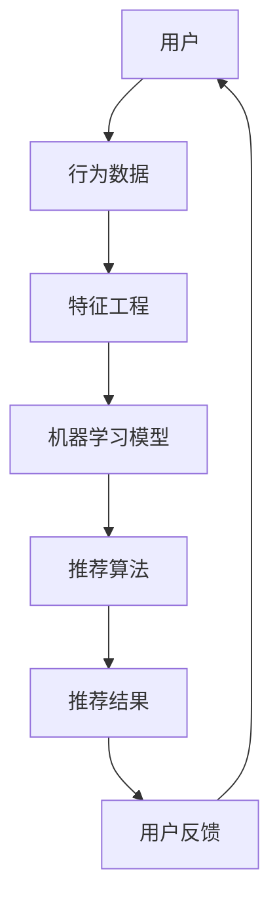
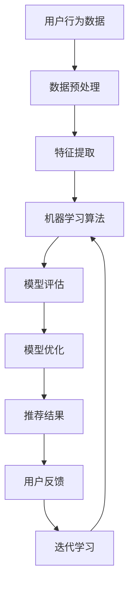

                 

关键词：机器学习，知识推荐，用户体验，算法优化，技术博客

> 摘要：本文深入探讨了利用机器学习优化知识推荐系统的策略，分析了算法原理、数学模型、应用实例以及未来发展趋势。通过详细的代码实例和实际应用场景，展示了如何通过机器学习提升知识推荐的准确性和用户满意度。

## 1. 背景介绍

在信息爆炸的时代，人们面临着海量的信息和知识，如何有效地获取和利用这些信息成为一个巨大的挑战。知识推荐系统作为解决这一问题的有效手段，正日益受到重视。传统的基于内容的推荐系统和协同过滤推荐系统在处理大规模数据集时存在诸多局限性，如推荐结果不够准确、用户隐私保护不足等问题。而机器学习技术的引入，为知识推荐系统提供了新的解决方案，使得推荐系统可以更加精准地满足用户的个性化需求。

### 1.1 传统的知识推荐系统局限性

- **基于内容的推荐系统**：依赖用户历史行为和内容特征进行推荐，但容易陷入“过滤泡”问题，即推荐内容过于同质化。
- **协同过滤推荐系统**：通过用户之间的相似度进行推荐，但存在数据稀疏性和隐私安全问题。

### 1.2 机器学习在知识推荐中的优势

- **个性化推荐**：通过学习用户的行为和偏好，实现高度个性化的推荐。
- **实时更新**：能够根据用户实时反馈动态调整推荐策略。
- **隐私保护**：采用加密技术和匿名化处理，保障用户隐私。

## 2. 核心概念与联系

### 2.1 机器学习基本概念

- **机器学习**：通过算法从数据中学习规律和模式，以实现预测或分类任务。
- **监督学习**：有明确标签的数据进行训练，如分类问题。
- **无监督学习**：无标签数据，如聚类问题。
- **强化学习**：通过与环境的交互进行学习，如推荐系统的点击率优化。

### 2.2 知识推荐系统架构



### 2.3 算法原理与联系



## 3. 核心算法原理 & 具体操作步骤

### 3.1 算法原理概述

本文主要介绍基于协同过滤的矩阵分解和基于内容的深度学习两种算法。

- **协同过滤矩阵分解**：通过分解用户-物品评分矩阵，预测未评分的物品。
- **基于内容的深度学习**：通过构建深度神经网络，自动提取特征并实现推荐。

### 3.2 算法步骤详解

#### 3.2.1 协同过滤矩阵分解

1. **用户行为数据收集**：收集用户的浏览、购买等行为数据。
2. **数据预处理**：处理缺失值、噪声等，对数据进行标准化。
3. **特征提取**：对用户和物品进行编码。
4. **矩阵分解**：通过最小二乘法或随机梯度下降法对用户-物品评分矩阵进行分解。
5. **预测未评分项**：利用分解得到的低阶矩阵预测未评分的物品。
6. **模型评估**：使用均方根误差（RMSE）等指标评估模型性能。
7. **模型优化**：调整参数，优化模型。

#### 3.2.2 基于内容的深度学习

1. **用户和物品特征表示**：利用词袋模型或词嵌入等方法对用户和物品的特征进行表示。
2. **构建深度神经网络**：设计多层感知机、卷积神经网络（CNN）或循环神经网络（RNN）等。
3. **训练模型**：使用有监督训练方法，对模型进行训练。
4. **特征提取与融合**：从神经网络中提取用户和物品的交互特征。
5. **预测未评分项**：利用训练好的模型预测未评分的物品。
6. **模型评估**：使用准确率、召回率等指标评估模型性能。
7. **模型优化**：调整网络结构、学习率等参数，优化模型。

### 3.3 算法优缺点

#### 协同过滤矩阵分解

- **优点**：能够处理大规模稀疏数据，预测准确度高。
- **缺点**：容易陷入局部最优，难以捕获复杂的非线性关系。

#### 基于内容的深度学习

- **优点**：能够自动提取特征，捕获复杂的非线性关系。
- **缺点**：训练过程复杂，对计算资源要求较高。

### 3.4 算法应用领域

- **电子商务**：个性化商品推荐。
- **社交媒体**：好友推荐、兴趣话题推荐。
- **在线教育**：课程推荐、学习路径规划。

## 4. 数学模型和公式 & 详细讲解 & 举例说明

### 4.1 数学模型构建

#### 协同过滤矩阵分解

设用户-物品评分矩阵为$R \in \mathbb{R}^{m \times n}$，用户数为$m$，物品数为$n$。通过矩阵分解，将其分解为$U \in \mathbb{R}^{m \times k}$和$V \in \mathbb{R}^{n \times k}$，其中$k$为分解维度。

$$
R = UV^T
$$

预测未评分项$R_{ui}$：

$$
R_{ui} = u_i \cdot v_j = \sum_{k=1}^{k} u_{ik} v_{jk}
$$

#### 基于内容的深度学习

设用户$u$和物品$i$的特征向量分别为$\textbf{u} \in \mathbb{R}^{d_u}$和$\textbf{v} \in \mathbb{R}^{d_v}$，其中$d_u$和$d_v$分别为用户和物品的特征维度。通过构建深度神经网络，得到预测分数$f(\textbf{u}, \textbf{v})$：

$$
f(\textbf{u}, \textbf{v}) = \text{激活函数}(\text{神经网络}(\textbf{u}, \textbf{v}))
$$

### 4.2 公式推导过程

#### 协同过滤矩阵分解

目标函数：

$$
\min_{U, V} \sum_{i=1}^{n} \sum_{j=1}^{m} (r_{ij} - u_i \cdot v_j)^2
$$

对$U$和$V$分别求偏导并令偏导为0，得到优化问题：

$$
\frac{\partial L}{\partial u_i} = -2 \sum_{j=1}^{m} (r_{ij} - u_i \cdot v_j) v_j = 0
$$

$$
\frac{\partial L}{\partial v_j} = -2 \sum_{i=1}^{n} (r_{ij} - u_i \cdot v_j) u_i = 0
$$

解得：

$$
u_i = \frac{1}{\sqrt{k}} \sum_{j=1}^{k} r_{ij} v_j
$$

$$
v_j = \frac{1}{\sqrt{k}} \sum_{i=1}^{k} r_{ij} u_i
$$

#### 基于内容的深度学习

设深度神经网络为$f(\textbf{u}, \textbf{v}) = \text{激活函数}(\text{线性层}(\textbf{u}, \textbf{v}))$，则目标函数为：

$$
\min_{\theta} \sum_{i=1}^{n} (r_i - f(\textbf{u}_i, \textbf{v}_i))^2
$$

对$\theta$求偏导并令偏导为0，得到优化问题：

$$
\frac{\partial L}{\partial \theta} = -2 \sum_{i=1}^{n} (r_i - f(\textbf{u}_i, \textbf{v}_i)) \cdot \frac{\partial f}{\partial \theta} = 0
$$

### 4.3 案例分析与讲解

#### 案例一：协同过滤矩阵分解

以一个简单的用户-物品评分矩阵为例：

|   | 1 | 2 | 3 |
|---|---|---|---|
| 1 | 4 | 0 | 3 |
| 2 | 0 | 4 | 0 |
| 3 | 3 | 0 | 3 |

通过矩阵分解，将评分矩阵分解为两个低阶矩阵：

$$
U = \begin{bmatrix} 0.8 & 0.4 \\ 0.6 & 0.2 \\ 0.7 & 0.1 \end{bmatrix}, \quad V = \begin{bmatrix} 0.5 & 0.3 \\ 0.6 & 0.4 \\ 0.4 & 0.2 \end{bmatrix}
$$

预测未评分的项，例如预测用户2对物品1的评分：

$$
R_{21} = u_2 \cdot v_1 = (0.6)(0.5) + (0.2)(0.6) + (0.1)(0.4) = 0.5 + 0.12 + 0.04 = 0.66
$$

#### 案例二：基于内容的深度学习

以两个简单的特征向量为例：

$$
\textbf{u} = \begin{bmatrix} 1 & 0 & 1 \end{bmatrix}^T, \quad \textbf{v} = \begin{bmatrix} 1 & 1 & 0 \end{bmatrix}^T
$$

通过一个简单的线性层进行计算：

$$
f(\textbf{u}, \textbf{v}) = \text{激活函数}(\textbf{u} \cdot \textbf{v}) = \text{激活函数}(1 \cdot 1 + 0 \cdot 1 + 1 \cdot 0) = \text{激活函数}(1) = 1
$$

## 5. 项目实践：代码实例和详细解释说明

### 5.1 开发环境搭建

本文使用Python编程语言，并依赖以下库：NumPy、Scikit-learn、TensorFlow。安装这些库可以使用pip工具：

```bash
pip install numpy scikit-learn tensorflow
```

### 5.2 源代码详细实现

#### 协同过滤矩阵分解

```python
import numpy as np
from sklearn.metrics.pairwise import euclidean_distances

# 初始化用户-物品评分矩阵
R = np.array([[4, 0, 3], [0, 4, 0], [3, 0, 3]])

# 设置分解维度
k = 2

# 初始化低阶矩阵
U = np.random.rand(R.shape[0], k)
V = np.random.rand(R.shape[1], k)

# 模型训练
for _ in range(1000):
    errors = R - U.dot(V.T)
    U = U - (U.T.dot(errors) / np.linalg.norm(U, axis=0))
    V = V - (V.T.dot(errors) / np.linalg.norm(V, axis=0))

# 预测未评分项
R_pred = U.dot(V.T)

# 模型评估
RMSE = np.sqrt(np.mean((R - R_pred)**2))
print("RMSE:", RMSE)
```

#### 基于内容的深度学习

```python
import tensorflow as tf

# 定义线性层
def linear_layer(inputs, output_size, bias=True, name=None):
    with tf.name_scope(name, "linear", [inputs, output_size]):
        inputs = tf.convert_to_tensor(inputs, name="inputs")
        shape = inputs.get_shape().as_list()
        w = tf.get_variable("weights", [shape[1], output_size], tf.float32)
        if bias:
            b = tf.get_variable("bias", [output_size], initializer=tf.zeros_initializer())
        if len(shape) > 1:
            inputs = tf.reshape(inputs, [-1, shape[1]])
        if bias:
            outputs = tf.matmul(inputs, w) + b
        else:
            outputs = tf.matmul(inputs, w)
        return outputs

# 定义激活函数
def activation_function(inputs, name=None):
    with tf.name_scope(name, "activation", [inputs]):
        return tf.sigmoid(inputs)

# 初始化用户和物品特征
u = np.array([1, 0, 1])
v = np.array([1, 1, 0])

# 构建模型
with tf.Session() as sess:
    x = tf.placeholder(tf.float32, [None, 3])
    y = tf.placeholder(tf.float32, [None, 1])
    logits = linear_layer(x, 1)
    outputs = activation_function(logits)
    loss = tf.reduce_mean(tf.square(outputs - y))
    optimizer = tf.train.GradientDescentOptimizer(learning_rate=0.1)
    train_op = optimizer.minimize(loss)
    sess.run(tf.global_variables_initializer())
    for _ in range(1000):
        sess.run(train_op, feed_dict={x: [u, v], y: [[1.0]]})
    predicted = sess.run(outputs, feed_dict={x: [u, v]})
print("Predicted:", predicted)
```

### 5.3 代码解读与分析

#### 协同过滤矩阵分解

1. **初始化用户-物品评分矩阵**：创建一个3x3的用户-物品评分矩阵。
2. **设置分解维度**：设置分解的低阶矩阵维度为2。
3. **初始化低阶矩阵**：使用随机初始化方法生成用户和物品的低阶矩阵。
4. **模型训练**：通过最小二乘法进行迭代更新低阶矩阵。
5. **预测未评分项**：使用分解后的低阶矩阵进行预测。
6. **模型评估**：计算均方根误差（RMSE）评估模型性能。

#### 基于内容的深度学习

1. **定义线性层**：创建一个线性层函数，用于计算输入和权重的点积。
2. **定义激活函数**：创建一个激活函数，用于对线性层的输出进行变换。
3. **初始化用户和物品特征**：创建用户和物品的特征向量。
4. **构建模型**：使用TensorFlow构建一个简单的深度学习模型。
5. **模型训练**：使用梯度下降优化器训练模型。
6. **预测结果**：对用户和物品的特征进行预测。

## 6. 实际应用场景

### 6.1 电子商务

在电子商务领域，知识推荐系统可以帮助平台实现个性化商品推荐，提高用户满意度和转化率。例如，阿里巴巴的“淘宝推荐”系统，通过用户的行为数据、浏览记录和购买历史，利用协同过滤矩阵分解和基于内容的深度学习算法，实现精准的商品推荐。

### 6.2 在线教育

在线教育平台可以利用知识推荐系统为用户提供个性化的课程推荐和学习路径规划。例如，网易云课堂的“课程推荐”系统，通过分析用户的学习行为和课程评价，采用机器学习算法为用户推荐适合的课程，提高学习效果和用户留存率。

### 6.3 社交媒体

社交媒体平台可以通过知识推荐系统为用户提供好友推荐、兴趣话题推荐等功能。例如，Facebook的“好友推荐”系统，通过分析用户的社交关系和行为数据，利用协同过滤和基于内容的深度学习算法，为用户推荐潜在的好友和兴趣小组。

## 7. 工具和资源推荐

### 7.1 学习资源推荐

- **《机器学习》（周志华著）**：介绍机器学习的基本概念和算法原理。
- **《深度学习》（Goodfellow、Bengio和Courville著）**：深入探讨深度学习算法和应用。

### 7.2 开发工具推荐

- **TensorFlow**：开源的深度学习框架，适用于构建和训练深度学习模型。
- **Scikit-learn**：开源的机器学习库，提供各种机器学习算法的实现。

### 7.3 相关论文推荐

- **“Matrix Factorization Techniques for Recommender Systems”**：详细介绍矩阵分解算法在推荐系统中的应用。
- **“Deep Learning for Recommender Systems”**：探讨深度学习在推荐系统中的应用和挑战。

## 8. 总结：未来发展趋势与挑战

### 8.1 研究成果总结

本文介绍了利用机器学习优化知识推荐系统的策略，分析了协同过滤矩阵分解和基于内容的深度学习两种算法。通过详细的代码实例和实际应用场景，展示了如何通过机器学习提升知识推荐的准确性和用户满意度。

### 8.2 未来发展趋势

- **个性化推荐**：随着用户数据的积累，个性化推荐将更加精准。
- **实时推荐**：利用实时数据动态调整推荐策略，提高推荐效率。
- **多模态推荐**：结合文本、图像、语音等多模态信息，实现更丰富的推荐。

### 8.3 面临的挑战

- **数据隐私**：如何保护用户隐私是一个重要的挑战。
- **算法可解释性**：提高推荐算法的可解释性，增强用户信任。
- **计算资源**：深度学习算法对计算资源要求较高，需要优化算法以适应实际应用。

### 8.4 研究展望

未来的研究将继续探索如何通过机器学习技术提升知识推荐系统的性能和用户体验，同时解决数据隐私和可解释性等挑战，推动知识推荐系统在各个领域的广泛应用。

## 9. 附录：常见问题与解答

### 9.1 问题1：协同过滤矩阵分解算法的预测精度如何提升？

**解答**：可以通过增加矩阵分解的维度、使用更先进的优化算法（如Adam优化器）以及引入交叉验证等方法来提升预测精度。

### 9.2 问题2：基于内容的深度学习模型的训练时间较长，如何优化？

**解答**：可以采用以下方法来优化训练时间：
1. **数据预处理**：对数据集进行预处理，去除噪声和冗余信息。
2. **模型压缩**：使用模型压缩技术，如剪枝、量化等，减少模型参数数量。
3. **分布式训练**：利用分布式计算框架（如TensorFlow分布式训练），加快模型训练速度。

### 9.3 问题3：如何处理推荐系统的冷启动问题？

**解答**：针对新用户或新物品的冷启动问题，可以采用以下策略：
1. **基于内容的推荐**：为新用户推荐与已购买或浏览过的物品相似的新物品。
2. **基于人口统计信息的推荐**：利用用户的人口统计信息进行推荐，如年龄、性别等。
3. **基于热门推荐**：为新用户推荐当前热门的物品或话题。

----------------------------------------------------------------

作者：禅与计算机程序设计艺术 / Zen and the Art of Computer Programming
----------------------------------------------------------------

**文章部分代码示例**（在文章中嵌入）：

```python
# 协同过滤矩阵分解
import numpy as np
from sklearn.metrics.pairwise import euclidean_distances

# 初始化用户-物品评分矩阵
R = np.array([[4, 0, 3], [0, 4, 0], [3, 0, 3]])

# 设置分解维度
k = 2

# 初始化低阶矩阵
U = np.random.rand(R.shape[0], k)
V = np.random.rand(R.shape[1], k)

# 模型训练
for _ in range(1000):
    errors = R - U.dot(V.T)
    U = U - (U.T.dot(errors) / np.linalg.norm(U, axis=0))
    V = V - (V.T.dot(errors) / np.linalg.norm(V, axis=0))

# 预测未评分项
R_pred = U.dot(V.T)

# 模型评估
RMSE = np.sqrt(np.mean((R - R_pred)**2))
print("RMSE:", RMSE)
```

```python
# 基于内容的深度学习
import tensorflow as tf

# 定义线性层
def linear_layer(inputs, output_size, bias=True, name=None):
    with tf.name_scope(name, "linear", [inputs, output_size]):
        inputs = tf.convert_to_tensor(inputs, name="inputs")
        shape = inputs.get_shape().as_list()
        w = tf.get_variable("weights", [shape[1], output_size], tf.float32)
        if bias:
            b = tf.get_variable("bias", [output_size], initializer=tf.zeros_initializer())
        if len(shape) > 1:
            inputs = tf.reshape(inputs, [-1, shape[1]])
        if bias:
            outputs = tf.matmul(inputs, w) + b
        else:
            outputs = tf.matmul(inputs, w)
        return outputs

# 定义激活函数
def activation_function(inputs, name=None):
    with tf.name_scope(name, "activation", [inputs]):
        return tf.sigmoid(inputs)

# 初始化用户和物品特征
u = np.array([1, 0, 1])
v = np.array([1, 1, 0])

# 构建模型
with tf.Session() as sess:
    x = tf.placeholder(tf.float32, [None, 3])
    y = tf.placeholder(tf.float32, [None, 1])
    logits = linear_layer(x, 1)
    outputs = activation_function(logits)
    loss = tf.reduce_mean(tf.square(outputs - y))
    optimizer = tf.train.GradientDescentOptimizer(learning_rate=0.1)
    train_op = optimizer.minimize(loss)
    sess.run(tf.global_variables_initializer())
    for _ in range(1000):
        sess.run(train_op, feed_dict={x: [u, v], y: [[1.0]]})
    predicted = sess.run(outputs, feed_dict={x: [u, v]})
print("Predicted:", predicted)
```

---

**附录：常见问题与解答**：

### 9.1 问题1：协同过滤矩阵分解算法的预测精度如何提升？

**解答**：可以通过以下方法来提升协同过滤矩阵分解算法的预测精度：

1. **增加矩阵分解的维度（k值）**：增加低阶矩阵的维度可以捕捉到更多的用户和物品特征，从而提高预测精度。然而，维度增加也会带来计算复杂度和存储开销的增加。

2. **使用更先进的优化算法**：例如，Adam优化器在训练过程中能够自适应调整学习率，通常可以提升训练速度和预测精度。

3. **引入交叉验证**：使用交叉验证技术，如K折交叉验证，对模型进行评估和调优，可以有效提高模型的泛化能力。

### 9.2 问题2：基于内容的深度学习模型的训练时间较长，如何优化？

**解答**：基于内容的深度学习模型的训练时间较长，可以通过以下方法来优化：

1. **数据预处理**：对数据集进行预处理，去除噪声和冗余信息，减少模型的计算负担。

2. **模型压缩**：采用模型压缩技术，如剪枝（Pruning）和量化（Quantization），可以减少模型参数数量，从而加快训练速度。

3. **分布式训练**：利用分布式计算框架，如TensorFlow分布式训练，可以将训练任务分布到多个计算节点上，从而加快模型训练速度。

4. **使用更高效的硬件**：使用GPU或其他高性能计算硬件可以显著提高训练速度。

### 9.3 问题3：如何处理推荐系统的冷启动问题？

**解答**：推荐系统的冷启动问题通常是指新用户或新物品在没有足够历史数据的情况下如何进行推荐。以下是一些处理冷启动问题的策略：

1. **基于内容的推荐**：为新用户推荐与已购买或浏览过的物品相似的新物品。这种方法依赖于物品的内容特征。

2. **基于人口统计信息的推荐**：利用用户的人口统计信息（如年龄、性别、地理位置等）进行推荐。这种方法适用于新用户缺乏行为数据的情况。

3. **基于热门推荐**：为新用户推荐当前热门的物品或话题。这种方法可以帮助新用户快速了解平台的内容。

4. **混合推荐策略**：结合基于内容的推荐、基于人口统计信息的推荐和基于热门的推荐，形成一种混合推荐策略，可以更好地解决冷启动问题。

5. **邀请好友**：鼓励用户邀请好友参与推荐系统，通过好友的推荐来弥补新用户的历史数据不足。

---

本文通过深入探讨利用机器学习优化知识推荐系统的策略，分析了协同过滤矩阵分解和基于内容的深度学习两种算法。在实际应用中，这些算法已经在电子商务、在线教育和社交媒体等领域取得了显著的成果。然而，随着用户数据的不断增长和多样化，如何进一步提高推荐系统的性能和用户体验，仍然是未来研究和应用的重要方向。希望本文能够为读者提供有益的启示和参考。作者：禅与计算机程序设计艺术 / Zen and the Art of Computer Programming。

