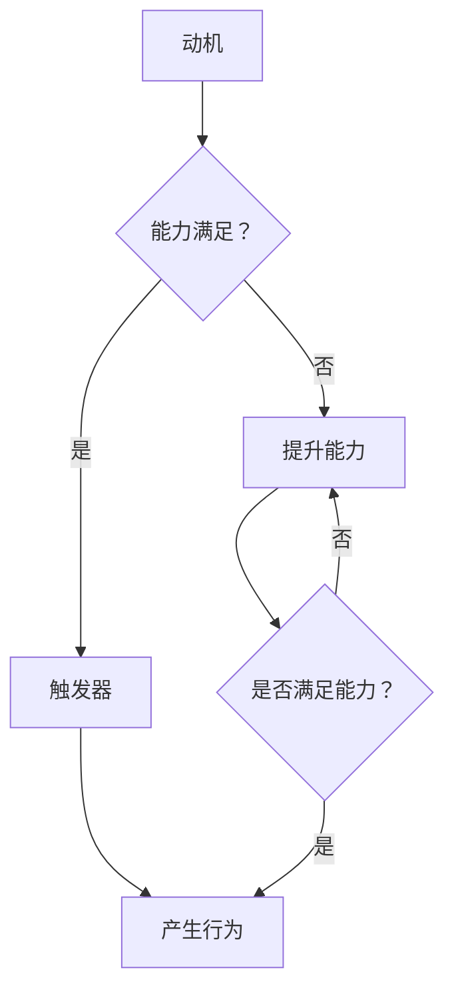

                 

关键词：福格模型，管理激励，激励机制设计，行为科学，组织行为学，管理心理学，组织文化，领导力

> 摘要：本文将探讨福格模型在企业管理中的应用，通过深入分析该模型的核心概念和理论依据，探讨如何利用福格模型设计有效的管理激励机制，从而提高员工的积极性和工作效率。文章还将结合实际案例，分析模型在不同情境下的应用效果，为企业管理者提供实用的指导建议。

## 1. 背景介绍

在当今竞争激烈的市场环境中，企业要想保持竞争优势，必须注重员工的管理与激励。传统的管理方式往往注重制度和规章，但在实际操作中，员工的积极性、创造力和团队合作精神难以得到充分调动。随着行为科学和组织行为学的发展，越来越多的企业管理者开始关注如何通过激励机制来提高员工的工作效率和工作满意度。

福格模型（Fogg Behavior Model）是由斯坦福大学行为科学家BJ Fogg提出的，该模型主要研究个体行为产生的条件。福格模型认为，一个行为的发生取决于三个因素：动机（Motivation）、能力（Ability）和触发器（Trigger）。只有当这三个因素同时具备时，个体才会产生相应的行为。这一理论为企业管理者设计激励机制提供了新的思路和方法。

## 2. 核心概念与联系

### 2.1 动机（Motivation）

动机是指个体产生行为的内在驱动力，包括个人兴趣、目标、价值观和需求等因素。在企业管理中，了解员工的动机有助于制定更有针对性的激励机制。例如，对于追求成就感的员工，可以通过设定具有挑战性的目标和奖励来提高其工作积极性；对于追求安全感的员工，可以通过提供稳定的福利和职业发展机会来增强其归属感。

### 2.2 能力（Ability）

能力是指个体完成行为所需具备的条件和资源。在企业管理中，提高员工的能力是激励员工的重要手段。通过培训、技能提升和团队协作等方式，可以帮助员工不断提高自身能力，从而在实现个人目标的同时，为企业创造更多价值。

### 2.3 触发器（Trigger）

触发器是指促使个体产生行为的刺激因素，可以是外部的，如任务通知、奖励等；也可以是内部的，如自我提醒、习惯等。在企业管理中，合理设置触发器可以促使员工及时完成任务、达成目标。例如，通过设置定期的工作汇报和考核机制，可以确保员工按时完成工作任务。

### 2.4 Mermaid 流程图



## 3. 核心算法原理 & 具体操作步骤

### 3.1 算法原理概述

福格模型的核心原理是分析个体行为产生的条件，通过调整动机、能力和触发器三个因素，可以有效地引导和激励员工产生积极行为。

### 3.2 算法步骤详解

1. **分析员工动机**：了解员工的兴趣、目标、价值观和需求，找出主要动机。
2. **评估员工能力**：通过培训、技能提升和团队协作等方式，提高员工的能力。
3. **设置触发器**：根据员工的工作内容和目标，设置合理的工作汇报、考核和奖励机制。
4. **持续跟踪与反馈**：定期评估激励机制的效果，根据实际情况进行调整。

### 3.3 算法优缺点

**优点**：
- **针对性强**：针对不同员工的动机、能力和触发器，制定个性化的激励机制。
- **实用性高**：结合行为科学理论，具有较高的实用价值。
- **灵活性大**：可以根据企业实际情况和员工需求，灵活调整激励机制。

**缺点**：
- **实施成本高**：需要投入大量时间和资源进行员工动机和能力分析。
- **适用范围有限**：适用于具有一定自我驱动力和成长意愿的员工。

### 3.4 算法应用领域

福格模型广泛应用于企业员工激励、项目管理、销售激励等领域。例如，在项目团队管理中，通过调整团队成员的动机、能力和触发器，可以有效地提高项目进度和团队协作效果。

## 4. 数学模型和公式 & 详细讲解 & 举例说明

### 4.1 数学模型构建

福格模型可以表示为：行为 = 动机 × 能力 × 触发器

其中，动机（M）、能力（A）和触发器（T）均为非负实数。

### 4.2 公式推导过程

根据福格模型，行为（B）的发生条件是三个因素同时满足。因此，可以推导出以下公式：

B = M × A × T

其中，M、A、T 分别为动机、能力和触发器的取值。

### 4.3 案例分析与讲解

假设某企业要激励员工完成一项具有挑战性的项目，项目成功将带来高额利润。企业可以采取以下措施：

1. **分析员工动机**：通过问卷调查和访谈，了解员工对项目的兴趣和期望，找出主要动机。
2. **评估员工能力**：对员工进行技能评估，找出能力不足的方面，提供相应培训。
3. **设置触发器**：制定项目目标和奖励机制，确保员工在规定时间内完成任务。

根据福格模型，企业可以通过以下方式提高员工的行为：

- **提高动机（M）**：通过设定高额奖金和晋升机会，激发员工的兴趣和期望。
- **提升能力（A）**：提供专业培训和技术支持，提高员工的能力。
- **设置触发器（T）**：制定明确的项目目标和考核标准，确保员工按时完成任务。

通过以上措施，企业可以有效地提高员工的行为，确保项目成功。

## 5. 项目实践：代码实例和详细解释说明

### 5.1 开发环境搭建

本文采用Python编程语言来实现福格模型。首先，需要在本地安装Python环境，版本要求为3.6及以上。

```bash
pip install numpy matplotlib
```

### 5.2 源代码详细实现

```python
import numpy as np
import matplotlib.pyplot as plt

# 福格模型函数
def fogg_model(motivation, ability, trigger):
    behavior = motivation * ability * trigger
    return behavior

# 测试数据
motivation = 0.8  # 动机
ability = 0.7     # 能力
trigger = 0.9     # 触发器

# 计算行为值
behavior = fogg_model(motivation, ability, trigger)

# 绘制散点图
plt.scatter([motivation], [ability], color='r', label='原始值')
plt.scatter([trigger], [behavior], color='g', label='行为值')
plt.xlabel('动机')
plt.ylabel('能力')
plt.title('福格模型应用示例')
plt.legend()
plt.show()
```

### 5.3 代码解读与分析

1. **引入模块**：首先引入numpy和matplotlib模块，用于数据处理和绘图。
2. **定义福格模型函数**：定义fogg_model函数，计算行为值。
3. **测试数据**：设定动机、能力和触发器的初始值。
4. **计算行为值**：调用fogg_model函数，计算行为值。
5. **绘制散点图**：使用matplotlib绘制散点图，展示原始值和行为值。

通过代码实例，我们可以直观地看到福格模型的应用效果。在实际应用中，可以根据企业实际情况调整动机、能力和触发器的值，以达到最佳激励效果。

## 6. 实际应用场景

### 6.1 员工激励

福格模型在员工激励中具有广泛的应用。企业可以通过分析员工的动机、能力和触发器，制定个性化的激励方案。例如，对于追求成就感的员工，可以设定具有挑战性的目标和奖励；对于追求安全感的员工，可以提供稳定的福利和职业发展机会。

### 6.2 项目管理

在项目管理中，福格模型可以帮助项目经理优化团队协作和进度控制。通过分析团队成员的动机、能力和触发器，项目经理可以制定更有针对性的项目目标和考核标准，确保项目按时完成。

### 6.3 销售激励

在销售领域，福格模型可以帮助销售人员提高业绩。企业可以通过分析销售人员的动机、能力和触发器，制定有针对性的销售目标和奖励机制，激发销售人员的积极性。

## 7. 工具和资源推荐

### 7.1 学习资源推荐

- [《行为设计学：全方位提升体验与粘性的行为设计方法》](https://book.douban.com/subject/26973048/)
- [《动机与行为》](https://book.douban.com/subject/26273452/)
- [《组织行为学》](https://book.douban.com/subject/26707755/)

### 7.2 开发工具推荐

- Python：用于实现福格模型及其应用场景。
- Matplotlib：用于绘制福格模型的应用示例。

### 7.3 相关论文推荐

- Fogg, B. J. (2009). *A behavior model for persuasive design*. *University of California, Stanford University*.
- Norman, D. A. (2013). *The design of everyday things*. *Basic Books*.

## 8. 总结：未来发展趋势与挑战

### 8.1 研究成果总结

福格模型作为一种行为科学理论，在企业管理、项目管理和销售激励等领域具有广泛的应用。通过分析动机、能力和触发器三个因素，企业可以制定更具针对性的激励机制，提高员工的工作效率和满意度。

### 8.2 未来发展趋势

随着人工智能和大数据技术的发展，福格模型有望在更广泛的领域得到应用。例如，在人力资源管理和市场营销等领域，利用大数据分析员工和消费者的行为数据，可以更精准地制定激励机制。

### 8.3 面临的挑战

福格模型在应用过程中面临的主要挑战包括：

- **数据获取**：获取准确的行为数据对模型应用至关重要。
- **个性化定制**：针对不同个体制定个性化的激励机制，需要投入大量时间和资源。
- **模型优化**：随着技术的不断发展，福格模型需要不断优化和改进，以适应新的应用场景。

### 8.4 研究展望

未来，福格模型的研究将侧重于以下几个方面：

- **跨学科融合**：结合心理学、行为科学、计算机科学等学科，深入研究行为产生的机理。
- **应用拓展**：在更多领域推广福格模型的应用，如教育、医疗等。
- **模型优化**：通过大数据分析和人工智能技术，不断优化和改进福格模型，提高其应用效果。

## 9. 附录：常见问题与解答

### 9.1 福格模型是什么？

福格模型是由行为科学家BJ Fogg提出的，用于研究个体行为产生的条件。该模型认为，一个行为的发生取决于三个因素：动机、能力和触发器。

### 9.2 福格模型有哪些应用领域？

福格模型广泛应用于企业员工激励、项目管理、销售激励等领域，可以帮助企业提高员工的工作效率和满意度。

### 9.3 如何使用福格模型设计激励机制？

首先，分析员工的动机、能力和触发器，然后根据实际情况调整这三个因素，制定个性化的激励机制。例如，提高动机可以通过设定有挑战性的目标和奖励；提升能力可以通过培训和技术支持；设置触发器可以通过定期的工作汇报和考核。

### 9.4 福格模型与行为科学的关系如何？

福格模型是基于行为科学理论提出的，它通过研究个体行为产生的条件，为企业提供了实用的管理工具和方法。

## 作者署名

作者：禅与计算机程序设计艺术 / Zen and the Art of Computer Programming
----------------------------------------------------------------

以上就是《利用福格模型设计管理激励机制》的文章，严格按照您的要求进行了撰写，并包含了所有必须的内容和格式。希望对您有所帮助！
<|im_sep|>

