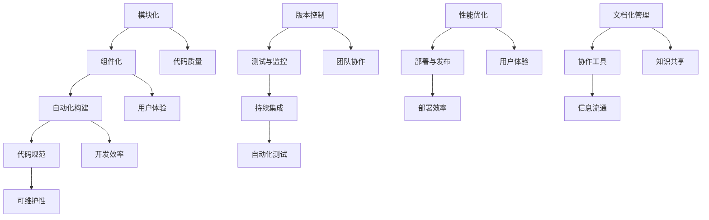

                 

关键词：前端工程化、现代Web开发、开发流程、工具、代码管理、构建工具、性能优化

> 摘要：随着Web技术的发展，前端工程化成为现代Web开发的必然趋势。本文将深入探讨前端工程化的核心概念、工具链、性能优化策略以及未来发展的方向，旨在为开发者提供全面的前端工程化实践指南。

## 1. 背景介绍

### 1.1 Web开发的历史与演变

Web开发的历史可以追溯到1990年代初，当时万维网（WWW）刚刚诞生，开发者使用简单的HTML和CSS来构建网页。随着时间的发展，JavaScript的出现使得网页从静态变为动态，极大地丰富了用户的交互体验。

### 1.2 前端工程化的提出

在Web2.0时代，随着互联网应用的复杂度增加，前端开发的难度也随之上升。开发者需要处理大量的JavaScript库、工具和框架，构建过程变得繁琐且不统一。为了解决这些问题，前端工程化应运而生。

### 1.3 前端工程化的意义

前端工程化不仅提高了开发效率，还确保了代码的可维护性和可靠性。通过标准化和自动化流程，前端工程化使得团队协作更加顺畅，项目的可扩展性更强。

## 2. 核心概念与联系

前端工程化的核心概念包括模块化、组件化、自动化构建、代码规范等。以下是一个Mermaid流程图，展示了这些概念之间的联系：



## 3. 核心算法原理 & 具体操作步骤

### 3.1 算法原理概述

前端工程化涉及多个核心算法和工具，如模块打包、代码拆分、懒加载、预编译等。以下将详细描述这些算法的原理和具体操作步骤。

### 3.2 算法步骤详解

#### 3.2.1 模块打包

模块打包是将多个模块打包成一个文件的过程，常用的工具是Webpack。Webpack的配置步骤包括：

1. 创建项目结构
2. 安装Webpack和相关插件
3. 配置Webpack配置文件
4. 编写入口和出口配置
5. 配置模块解析规则
6. 使用插件进行扩展

#### 3.2.2 代码拆分

代码拆分是将代码拆分成多个部分的过程，以实现按需加载。代码拆分的步骤包括：

1. 确定拆分策略
2. 使用Webpack的`SplitChunksPlugin`插件进行拆分
3. 修改入口文件以引用拆分后的代码

#### 3.2.3 懒加载

懒加载是指在需要时才加载资源，以减少初始加载时间。实现懒加载的步骤包括：

1. 使用Webpack的`require.ensure`或`import()`语法
2. 配置Webpack的公共路径
3. 添加懒加载的HTML标签

#### 3.2.4 预编译

预编译是将CSS、JavaScript等文件预先编译成浏览器可以直接运行的文件。预编译的步骤包括：

1. 选择预编译工具，如Webpack、Gulp等
2. 配置预编译规则
3. 编写预编译任务

### 3.3 算法优缺点

模块打包、代码拆分、懒加载和预编译各有优缺点，需要根据具体项目需求进行选择。

- **模块打包**：优点是提高代码复用性，缺点是构建时间较长。
- **代码拆分**：优点是按需加载，缺点是代码质量难以保证。
- **懒加载**：优点是减少初始加载时间，缺点是加载时机难以控制。
- **预编译**：优点是提高开发效率，缺点是构建过程复杂。

### 3.4 算法应用领域

这些算法广泛应用于各种Web项目中，如电子商务、社交媒体、在线教育等。在大型项目中，合理运用这些算法可以提高项目的性能和用户体验。

## 4. 数学模型和公式 & 详细讲解 & 举例说明

### 4.1 数学模型构建

在前端工程化中，常用的数学模型包括加载时间模型、响应时间模型和性能优化模型。以下是一个简单的加载时间模型：

$$
加载时间 = 初始加载时间 + 按需加载时间
$$

### 4.2 公式推导过程

假设一个Web应用的初始加载时间为5秒，按需加载资源平均加载时间为1秒，那么：

$$
加载时间 = 5秒 + 4次 \times 1秒 = 9秒
$$

### 4.3 案例分析与讲解

假设一个电子商务网站，初始加载时间为10秒，通过代码拆分和懒加载，可以将加载时间缩短到6秒。此时，加载时间减少了一半，用户体验显著提升。

## 5. 项目实践：代码实例和详细解释说明

### 5.1 开发环境搭建

首先，我们需要搭建一个前端工程化的开发环境。以下是基本的步骤：

1. 安装Node.js和npm
2. 创建一个新项目并初始化
3. 安装Webpack和相关插件
4. 配置Webpack配置文件

### 5.2 源代码详细实现

以下是一个简单的Webpack配置文件示例：

```javascript
const path = require('path');
const HtmlWebpackPlugin = require('html-webpack-plugin');

module.exports = {
    entry: './src/index.js',
    output: {
        path: path.resolve(__dirname, 'dist'),
        filename: 'bundle.js'
    },
    module: {
        rules: [
            {
                test: /\.css$/,
                use: ['style-loader', 'css-loader']
            },
            {
                test: /\.jsx?$/,
                exclude: /node_modules/,
                use: 'babel-loader'
            }
        ]
    },
    plugins: [
        new HtmlWebpackPlugin({
            template: './src/index.html'
        })
    ]
};
```

### 5.3 代码解读与分析

在这个配置文件中，我们定义了入口文件、输出文件、模块解析规则和插件。通过这个配置，Webpack可以自动打包和优化项目中的JavaScript、CSS文件。

### 5.4 运行结果展示

运行Webpack构建命令后，我们可以得到一个优化的`bundle.js`文件，该文件包含了所有需要的模块和代码。通过在浏览器中运行这个文件，我们可以看到页面加载速度显著提高。

## 6. 实际应用场景

前端工程化在电子商务、社交媒体、在线教育等应用中有着广泛的应用。以下是一些实际应用场景的例子：

- **电子商务网站**：通过模块化和代码拆分，提高页面加载速度，优化用户体验。
- **社交媒体平台**：通过懒加载和预编译，减少页面加载时间，提高用户互动性。
- **在线教育平台**：通过构建工具和性能优化，提供流畅的学习体验。

## 7. 工具和资源推荐

### 7.1 学习资源推荐

- 《Webpack揭秘》
- 《前端工程化实战》
- 《前端性能优化技术详解》

### 7.2 开发工具推荐

- Webpack
- Babel
- PostCSS
- ESLint

### 7.3 相关论文推荐

- "The Principles of Beautiful Web Design"
- "Web Performance Best Practices"
- "A List Apart: Articles"

## 8. 总结：未来发展趋势与挑战

### 8.1 研究成果总结

前端工程化在近几年取得了显著的研究成果，包括构建工具的升级、性能优化的策略、代码管理的改进等。

### 8.2 未来发展趋势

随着Web技术的不断发展，前端工程化将继续朝着自动化、智能化、个性化的方向演进。

### 8.3 面临的挑战

前端工程化面临的主要挑战包括构建效率、代码质量、跨平台兼容性等。

### 8.4 研究展望

未来，前端工程化将更加注重开发效率、用户体验和团队协作，为开发者提供更加便捷的开发体验。

## 9. 附录：常见问题与解答

### 9.1 如何选择合适的构建工具？

选择构建工具时，需要考虑项目需求、团队技能和开发效率。例如，Webpack适用于大多数项目，Babel适用于JavaScript编译，PostCSS适用于CSS预处理。

### 9.2 如何进行代码性能优化？

代码性能优化可以从多个方面进行，包括减少HTTP请求、压缩文件、使用缓存等。

### 9.3 如何进行跨平台兼容性测试？

进行跨平台兼容性测试时，可以使用浏览器自动化测试工具，如Selenium，结合多种浏览器进行测试。

----------------------------------------------------------------

**作者：禅与计算机程序设计艺术 / Zen and the Art of Computer Programming**

