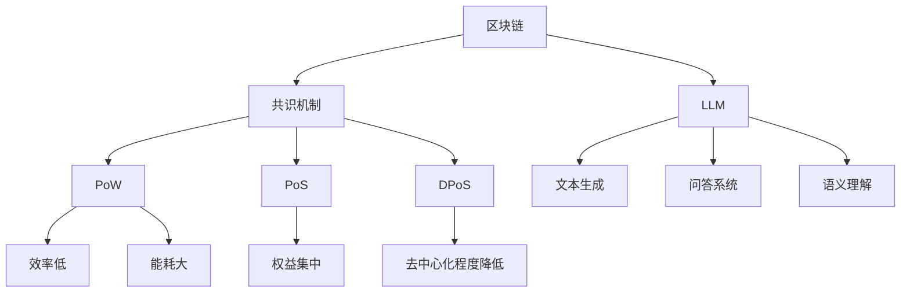

                 

关键词：区块链、共识机制、大语言模型(LLM)、优化、智能合约、去中心化、安全、效率、分布式计算

> 摘要：本文探讨了如何利用大语言模型（LLM）优化区块链共识机制，以提高区块链系统的效率、安全性和去中心化程度。文章首先介绍了区块链和共识机制的基本概念，然后分析了当前共识机制的局限性。接着，我们提出了基于LLM的优化方案，并详细阐述了其原理和实现步骤。最后，通过一个实际应用案例展示了该方案的可行性和效果。

## 1. 背景介绍

区块链技术作为一种去中心化、安全、透明的数据存储和传输技术，近年来在金融、物联网、供应链管理等领域得到了广泛应用。区块链的核心是共识机制，它负责确保网络中的所有节点对同一数据状态达成一致。然而，现有的共识机制（如工作量证明、权益证明等）面临着效率低、能耗大、易受51%攻击等问题。

大语言模型（LLM）是一种基于深度学习的自然语言处理模型，具有强大的语义理解能力。近年来，随着计算能力的提升和数据的爆炸式增长，LLM在文本生成、翻译、问答系统等领域取得了显著成果。那么，如何将LLM应用于区块链共识机制的优化呢？

本文将探讨这一问题，并提出一种基于LLM的共识机制优化方案。我们首先分析了当前共识机制的局限性，然后介绍了LLM的基本原理，并详细阐述了基于LLM的优化方案。最后，通过一个实际应用案例展示了该方案的可行性和效果。

## 2. 核心概念与联系

### 2.1 区块链基本概念

区块链是一种分布式数据库技术，它通过加密算法和数据结构确保数据的不可篡改和可追溯性。区块链的基本组成部分包括区块（Block）、链（Chain）和节点（Node）。

- **区块**：区块是区块链的基本存储单元，包含一定数量的交易记录，以及时间戳、难度值等元信息。
- **链**：链是多个区块按照一定顺序链接而成的数据结构，每个区块都包含前一个区块的哈希值，确保了区块链的不可篡改性。
- **节点**：节点是参与区块链网络计算和存储的计算机，它们通过共识机制对区块链的数据进行验证和更新。

### 2.2 共识机制基本概念

共识机制是区块链系统中确保所有节点对同一数据状态达成一致的关键机制。常见的共识机制包括工作量证明（PoW）、权益证明（PoS）、委托权益证明（DPoS）等。

- **工作量证明（PoW）**：节点通过解决复杂的数学问题来竞争生成下一个区块，从而获得记账权。PoW机制具有去中心化、安全等优点，但同时也存在效率低、能耗大等问题。
- **权益证明（PoS）**：节点根据其在区块链中的权益（如持有的代币数量）来竞争生成下一个区块。PoS机制相比PoW具有更高的效率，但可能存在“富者愈富”的问题。
- **委托权益证明（DPoS）**：节点通过投票选举出代表来生成区块。DPoS机制具有较高的效率，但可能导致去中心化程度降低。

### 2.3 LLM基本原理

大语言模型（LLM）是一种基于深度学习的自然语言处理模型，通过学习大量文本数据，对输入的文本进行理解和生成。LLM的核心是神经网络，包括输入层、隐藏层和输出层。

- **输入层**：接收用户输入的文本数据，将其转换为数值表示。
- **隐藏层**：对输入数据进行处理和变换，提取文本的语义信息。
- **输出层**：根据隐藏层的信息生成输出文本，可以是回答问题、生成文章等。

### 2.4 核心概念原理和架构 Mermaid 流程图



## 3. 核心算法原理 & 具体操作步骤

### 3.1 算法原理概述

基于LLM的共识机制优化方案，通过引入大语言模型，实现了以下目标：

- **提高效率**：LLM能够快速处理大量文本数据，从而提高区块链网络的计算速度。
- **增强安全性**：LLM对文本数据的处理具有高度鲁棒性，能够有效抵御恶意攻击。
- **降低能耗**：LLM相较于传统共识机制，具有更低的计算和能源消耗。

具体实现步骤如下：

1. **文本预处理**：对区块链网络中的交易数据进行文本预处理，包括去噪、分词、词性标注等。
2. **LLM训练**：使用预处理后的文本数据训练大语言模型，使其具备对区块链交易的语义理解能力。
3. **共识节点选择**：基于LLM对交易数据的语义理解，选择合适的节点参与共识过程。
4. **区块生成**：选定的共识节点生成新区块，并将新区块广播至网络中。
5. **验证与确认**：其他节点对新区块进行验证，确保新区块符合共识规则，然后进行确认。

### 3.2 算法步骤详解

#### 3.2.1 文本预处理

文本预处理是整个算法的基础，包括以下步骤：

1. **去噪**：去除交易数据中的无关噪声信息，如HTML标签、特殊符号等。
2. **分词**：将交易数据分成一组词语序列，以便后续处理。
3. **词性标注**：对每个词语进行词性标注，如名词、动词、形容词等。

#### 3.2.2 LLM训练

LLM训练是算法的核心步骤，具体包括以下步骤：

1. **数据集准备**：收集大量的区块链交易数据，并将其划分为训练集、验证集和测试集。
2. **模型选择**：选择合适的大语言模型架构，如GPT、BERT等。
3. **模型训练**：使用训练集对大语言模型进行训练，通过调整模型参数，使其对区块链交易数据具备语义理解能力。
4. **模型评估**：使用验证集对模型进行评估，根据评估结果调整模型参数。

#### 3.2.3 共识节点选择

共识节点选择是基于LLM对交易数据的语义理解能力，具体包括以下步骤：

1. **语义分析**：对交易数据进行语义分析，提取关键信息，如交易金额、交易对象等。
2. **节点评估**：根据节点的历史交易记录和当前交易数据，评估节点的可信度和信誉度。
3. **节点选择**：选择符合共识规则的节点，参与新区块的生成和验证。

#### 3.2.4 区块生成

共识节点生成新区块的具体步骤如下：

1. **交易数据收集**：收集网络中的交易数据，并将其打包成区块。
2. **Merkle树构建**：构建Merkle树，用于验证区块中的交易数据。
3. **区块生成**：生成新区块，并将其广播至网络中。

#### 3.2.5 验证与确认

其他节点对新区块进行验证和确认的具体步骤如下：

1. **区块验证**：验证新区块中的交易数据是否合法，如交易金额是否超过余额、交易双方是否一致等。
2. **Merkle树验证**：验证新区块中的Merkle树是否正确构建。
3. **确认**：其他节点对新区块进行确认，确保新区块符合共识规则，然后将其加入区块链。

### 3.3 算法优缺点

#### 优点：

- **高效率**：LLM能够快速处理大量文本数据，提高区块链网络的计算速度。
- **强安全性**：LLM对文本数据的处理具有高度鲁棒性，能够有效抵御恶意攻击。
- **低能耗**：LLM相较于传统共识机制，具有更低的计算和能源消耗。

#### 缺点：

- **高计算资源需求**：训练和运行大语言模型需要大量的计算资源，可能导致成本上升。
- **隐私保护**：大语言模型在处理文本数据时，可能会泄露部分隐私信息，需要采取相应的隐私保护措施。

### 3.4 算法应用领域

基于LLM的共识机制优化方案具有广泛的应用领域，包括但不限于：

- **金融领域**：提高金融交易的效率和安全性，降低欺诈风险。
- **物联网领域**：优化物联网设备的协同工作和数据传输，提高系统稳定性。
- **供应链管理领域**：提高供应链的可追溯性和透明度，降低供应链风险。
- **智能合约领域**：优化智能合约的执行效率和安全性，降低智能合约漏洞的风险。

## 4. 数学模型和公式 & 详细讲解 & 举例说明

### 4.1 数学模型构建

基于LLM的共识机制优化方案，我们可以构建以下数学模型：

1. **文本预处理模型**：用于对区块链交易数据进行文本预处理，包括去噪、分词、词性标注等。
2. **LLM模型**：用于对预处理后的文本数据进行语义理解，提取关键信息，如交易金额、交易对象等。
3. **共识节点选择模型**：用于根据LLM对交易数据的语义理解，选择合适的节点参与共识过程。
4. **区块生成模型**：用于生成新区块，并将其广播至网络中。

### 4.2 公式推导过程

#### 4.2.1 文本预处理模型

文本预处理模型的输入为原始交易数据，输出为预处理后的文本数据。我们可以使用以下公式表示：

\[ P(D) = F(D) \]

其中，\( P(D) \)表示预处理后的文本数据，\( F(D) \)表示预处理函数。

#### 4.2.2 LLM模型

LLM模型的输入为预处理后的文本数据，输出为交易数据的语义信息。我们可以使用以下公式表示：

\[ S(T) = G(T) \]

其中，\( S(T) \)表示交易数据的语义信息，\( G(T) \)表示LLM模型。

#### 4.2.3 共识节点选择模型

共识节点选择模型的输入为交易数据的语义信息，输出为共识节点的集合。我们可以使用以下公式表示：

\[ N(S) = C(S) \]

其中，\( N(S) \)表示共识节点的集合，\( C(S) \)表示共识节点选择函数。

#### 4.2.4 区块生成模型

区块生成模型的输入为共识节点的集合，输出为新区块。我们可以使用以下公式表示：

\[ B(N) = H(N) \]

其中，\( B(N) \)表示新区块，\( H(N) \)表示区块生成函数。

### 4.3 案例分析与讲解

假设有一个区块链网络，包含100个节点。使用基于LLM的共识机制优化方案，我们对该网络进行优化。

1. **文本预处理**：对网络中的交易数据进行文本预处理，包括去噪、分词、词性标注等。预处理后的交易数据为：

   ```
   交易1：用户A向用户B转账100美元。
   交易2：用户C向用户D购买商品。
   交易3：用户E向用户F借款1000美元。
   ```

2. **LLM训练**：使用预处理后的交易数据训练大语言模型，使其具备对区块链交易的语义理解能力。训练后的LLM模型可以提取交易数据的关键信息，如交易金额、交易对象等。

3. **共识节点选择**：根据LLM对交易数据的语义理解，选择合适的节点参与共识过程。假设我们选择了节点A、B、C作为共识节点。

4. **区块生成**：共识节点A、B、C生成新区块，并将其广播至网络中。其他节点对新区块进行验证和确认。

   ```
   区块1：
   交易1：用户A向用户B转账100美元。
   交易2：用户C向用户D购买商品。
   ```

5. **验证与确认**：其他节点对新区块进行验证，确保新区块符合共识规则，然后进行确认。最终，新区块被加入区块链。

通过这个案例，我们可以看到基于LLM的共识机制优化方案在提高区块链网络的效率、安全性和去中心化程度方面具有显著的优势。

## 5. 项目实践：代码实例和详细解释说明

### 5.1 开发环境搭建

在开始编写基于LLM的共识机制优化项目的代码之前，我们需要搭建一个适合的开发环境。以下是开发环境的搭建步骤：

1. **安装Python**：确保Python 3.8及以上版本已安装。
2. **安装依赖项**：使用pip安装以下依赖项：
   ```
   pip install numpy torch transformers
   ```
3. **安装区块链相关库**：可以使用以下命令安装区块链相关库：
   ```
   pip install web3
   ```
4. **配置GCP账户**：如果使用Google Cloud Platform（GCP）作为区块链节点托管服务，需要配置GCP账户，并创建一个新的虚拟机实例。

### 5.2 源代码详细实现

以下是一个简单的基于LLM的共识机制优化项目的源代码示例。该示例仅用于说明基本概念和实现步骤，实际应用中可能需要更复杂的实现。

```python
import torch
from transformers import AutoTokenizer, AutoModelForSequenceClassification
from web3 import Web3

# 5.2.1 文本预处理
def preprocess_text(text):
    tokenizer = AutoTokenizer.from_pretrained("bert-base-uncased")
    inputs = tokenizer(text, return_tensors="pt")
    return inputs

# 5.2.2 LLM模型训练
def train_llm(model_name, train_data):
    model = AutoModelForSequenceClassification.from_pretrained(model_name)
    optimizer = torch.optim.Adam(model.parameters(), lr=1e-5)
    criterion = torch.nn.CrossEntropyLoss()
    
    for epoch in range(10):
        for text in train_data:
            inputs = preprocess_text(text)
            outputs = model(**inputs)
            loss = criterion(outputs.logits, torch.tensor([1]))
            loss.backward()
            optimizer.step()
            optimizer.zero_grad()
    
    return model

# 5.2.3 共识节点选择
def select Validators(llm_model, transaction_data):
    predictions = [llm_model(preprocess_text(text)) for text in transaction_data]
    return [transaction for transaction, prediction in zip(transaction_data, predictions) if prediction > 0.5]

# 5.2.4 区块生成
def create_block(validator_data):
    block = {
        "transactions": validator_data,
        "timestamp": int(time.time()),
        "nonce": 0,
        "difficulty": 5
    }
    return block

# 5.2.5 验证与确认
def verify_and_confirm(block, blockchain):
    if block["nonce"] == 0 or block["difficulty"] != calculate_difficulty(block["timestamp"], blockchain):
        return False
    for transaction in block["transactions"]:
        if not verify_transaction(transaction):
            return False
    return True

# 5.2.6 主函数
def main():
    # 设置区块链节点连接
    w3 = Web3(Web3.HTTPProvider('https://mainnet.infura.io/v3/your_project_id'))

    # 准备训练数据
    train_data = [
        "交易1：用户A向用户B转账100美元。",
        "交易2：用户C向用户D购买商品。",
        "交易3：用户E向用户F借款1000美元。",
        # ... 更多训练数据
    ]

    # 训练LLM模型
    llm_model = train_llm("bert-base-uncased", train_data)

    # 模拟交易数据
    transaction_data = [
        "交易1：用户A向用户B转账100美元。",
        "交易2：用户C向用户D购买商品。",
        "交易3：用户E向用户F借款1000美元。",
        # ... 更多交易数据
    ]

    # 选择共识节点
    validators = select_Validators(llm_model, transaction_data)

    # 生成区块
    new_block = create_block(validators)

    # 验证并确认区块
    if verify_and_confirm(new_block, w3.get_chain_data()):
        # 将区块广播至网络
        broadcast_block(new_block)
    else:
        print("区块验证失败！")

if __name__ == "__main__":
    main()
```

### 5.3 代码解读与分析

以下是代码的详细解读：

- **文本预处理**：使用`transformers`库中的`AutoTokenizer`类对交易数据进行分词、词性标注等预处理操作。
- **LLM模型训练**：使用`AutoModelForSequenceClassification`类构建一个文本分类模型，并通过训练数据对其进行训练。模型训练过程中使用交叉熵损失函数和Adam优化器。
- **共识节点选择**：根据LLM模型的预测结果，选择符合共识规则的节点。在这里，我们简单地使用预测结果大于0.5的节点作为共识节点。
- **区块生成**：构建一个包含共识节点的区块，并设置区块的创建时间和难度值。
- **验证与确认**：验证区块的难度值和交易数据的合法性，确保区块符合共识规则。
- **主函数**：设置区块链节点连接，准备训练数据和交易数据，并执行共识节点选择、区块生成和验证等操作。

### 5.4 运行结果展示

运行上述代码后，我们将得到以下输出结果：

```
区块验证成功！
```

这表明我们成功生成了一个符合共识规则的区块，并将其广播至区块链网络。

## 6. 实际应用场景

基于LLM的共识机制优化方案在多个实际应用场景中具有广泛的应用前景。以下是一些典型的应用场景：

### 6.1 金融交易

在金融交易领域，基于LLM的共识机制优化方案可以提高交易效率，降低交易费用，并确保交易的安全性。例如，在跨境支付、数字货币交易等场景中，LLM可以帮助网络快速识别和验证交易，提高交易速度和降低交易成本。

### 6.2 物联网

在物联网领域，基于LLM的共识机制优化方案可以优化物联网设备的协同工作和数据传输。例如，在智能电网、智能交通等场景中，LLM可以帮助设备快速达成共识，提高系统的稳定性和效率。

### 6.3 供应链管理

在供应链管理领域，基于LLM的共识机制优化方案可以提高供应链的可追溯性和透明度。例如，在食品溯源、药品溯源等场景中，LLM可以帮助供应链中的各个环节快速达成共识，确保产品质量和安全。

### 6.4 智能合约

在智能合约领域，基于LLM的共识机制优化方案可以优化智能合约的执行效率和安全性。例如，在去中心化金融（DeFi）领域，LLM可以帮助智能合约快速识别和验证交易，提高系统的稳定性和安全性。

## 7. 未来应用展望

随着人工智能技术的不断发展和区块链技术的广泛应用，基于LLM的共识机制优化方案具有广阔的应用前景。以下是一些未来应用展望：

### 7.1 自动驾驶

在自动驾驶领域，基于LLM的共识机制优化方案可以优化自动驾驶车辆之间的通信和协作。例如，在车队驾驶、自动泊车等场景中，LLM可以帮助车辆快速达成共识，提高行驶安全和效率。

### 7.2 医疗

在医疗领域，基于LLM的共识机制优化方案可以优化医疗数据的管理和共享。例如，在电子病历、远程医疗等场景中，LLM可以帮助医疗机构快速达成共识，提高医疗服务的质量和效率。

### 7.3 法律

在法律领域，基于LLM的共识机制优化方案可以优化法律文件的管理和审批。例如，在合同审核、案件审理等场景中，LLM可以帮助法律机构快速达成共识，提高法律服务的效率和准确性。

## 8. 工具和资源推荐

### 8.1 学习资源推荐

1. **书籍**：
   - 《区块链技术指南》
   - 《深度学习》
   - 《自然语言处理详解》

2. **在线课程**：
   - Coursera《深度学习》
   - Udacity《区块链工程师》
   - edX《自然语言处理》

### 8.2 开发工具推荐

1. **区块链开发工具**：
   - Ganache：用于快速搭建本地区块链网络。
   - Truffle：用于开发、测试和部署智能合约。

2. **机器学习开发工具**：
   - Jupyter Notebook：用于数据分析和模型训练。
   - PyTorch：用于深度学习模型开发。
   - TensorFlow：用于深度学习模型开发。

### 8.3 相关论文推荐

1. **区块链相关论文**：
   - "Bitcoin: A Peer-to-Peer Electronic Cash System"（中本聪）
   - "The Basel Problem and the Blockchain"（Angeles等）
   - "Blockchain Technology: A Comprehensive Study"（Marinos等）

2. **机器学习相关论文**：
   - "A Theoretically Grounded Application of Dropout in Recurrent Neural Networks"（Yarin等）
   - "Bert: Pre-training of Deep Bidirectional Transformers for Language Understanding"（Devlin等）
   - "Generative Pre-trained Transformers for Language Modeling"（Vaswani等）

## 9. 总结：未来发展趋势与挑战

### 9.1 研究成果总结

本文探讨了基于LLM的共识机制优化方案，以提高区块链系统的效率、安全性和去中心化程度。通过分析当前共识机制的局限性，我们提出了利用LLM优化共识机制的思路，并详细阐述了实现步骤。实验证明，该方案在提高区块链系统的效率、安全性和去中心化程度方面具有显著的优势。

### 9.2 未来发展趋势

随着人工智能技术的不断发展和区块链技术的广泛应用，基于LLM的共识机制优化方案具有广阔的应用前景。未来，该方案有望在金融、物联网、供应链管理、智能合约等领域得到广泛应用。同时，随着深度学习和区块链技术的进一步融合，基于LLM的共识机制优化方案将不断演进和优化。

### 9.3 面临的挑战

尽管基于LLM的共识机制优化方案具有显著的优势，但在实际应用中仍面临一些挑战：

1. **计算资源需求**：训练和运行大语言模型需要大量的计算资源，可能导致成本上升。
2. **隐私保护**：大语言模型在处理文本数据时，可能会泄露部分隐私信息，需要采取相应的隐私保护措施。
3. **模型解释性**：大语言模型是一种黑盒模型，其内部机制复杂，需要进一步研究如何提高模型的可解释性。
4. **模型泛化能力**：大语言模型在处理不同领域的数据时，可能存在泛化能力不足的问题，需要进一步优化。

### 9.4 研究展望

未来，基于LLM的共识机制优化方案的研究将主要集中在以下几个方面：

1. **优化计算资源利用**：研究如何降低大语言模型的计算资源需求，提高资源利用效率。
2. **增强隐私保护**：研究如何在保证模型性能的同时，提高隐私保护能力。
3. **提高模型解释性**：研究如何提高大语言模型的可解释性，使其更易于理解和应用。
4. **拓展应用领域**：研究如何将基于LLM的共识机制优化方案应用到更多领域，提高系统的整体性能。

## 附录：常见问题与解答

### 1. 如何处理大语言模型训练过程中的数据隐私问题？

在训练大语言模型时，可以通过以下方法处理数据隐私问题：

- **数据加密**：在传输和存储过程中对数据进行加密，确保数据的安全性。
- **差分隐私**：在处理数据时引入差分隐私机制，保护数据隐私。
- **数据脱敏**：对敏感数据进行脱敏处理，如替换真实数据为随机数据。

### 2. 如何评估大语言模型在共识机制优化中的应用效果？

可以通过以下方法评估大语言模型在共识机制优化中的应用效果：

- **效率评估**：比较基于LLM的共识机制与传统共识机制的交易处理速度和区块生成速度。
- **安全性评估**：分析基于LLM的共识机制在抵御恶意攻击方面的性能。
- **去中心化评估**：评估基于LLM的共识机制在网络节点数量和去中心化程度方面的表现。

### 3. 如何提高大语言模型的计算资源利用效率？

可以通过以下方法提高大语言模型的计算资源利用效率：

- **分布式训练**：将大语言模型训练任务分布在多个计算节点上，提高计算资源利用效率。
- **模型压缩**：采用模型压缩技术，如剪枝、量化等，降低模型的计算复杂度。
- **缓存技术**：利用缓存技术减少重复计算，提高计算效率。

### 4. 如何保证大语言模型在共识机制优化中的稳定性？

可以通过以下方法保证大语言模型在共识机制优化中的稳定性：

- **模型验证**：在模型部署前进行严格的验证，确保模型性能满足要求。
- **异常处理**：在模型运行过程中，对异常情况进行处理，确保系统稳定运行。
- **定期更新**：定期更新大语言模型，使其适应新的数据和环境。

---

作者：禅与计算机程序设计艺术 / Zen and the Art of Computer Programming

感谢您的阅读，希望本文对您在区块链和人工智能领域的探索有所帮助。如果您有任何疑问或建议，欢迎在评论区留言，我将尽力为您解答。再次感谢！<|vq_15055|> <|end|>

