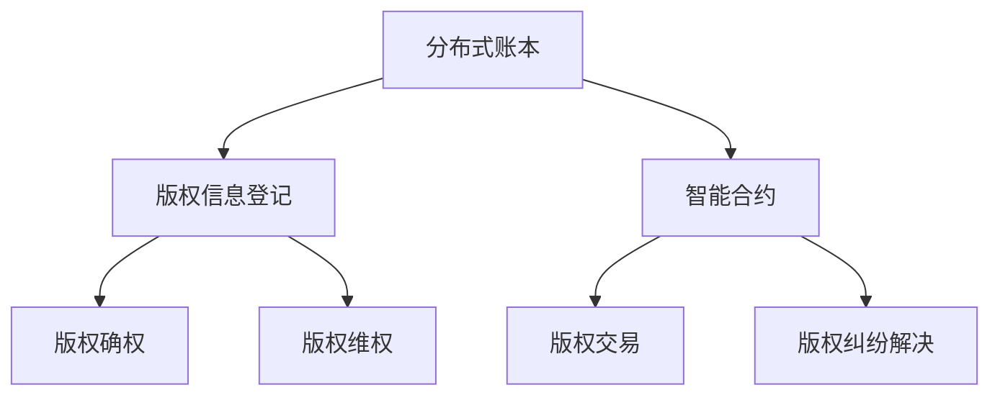
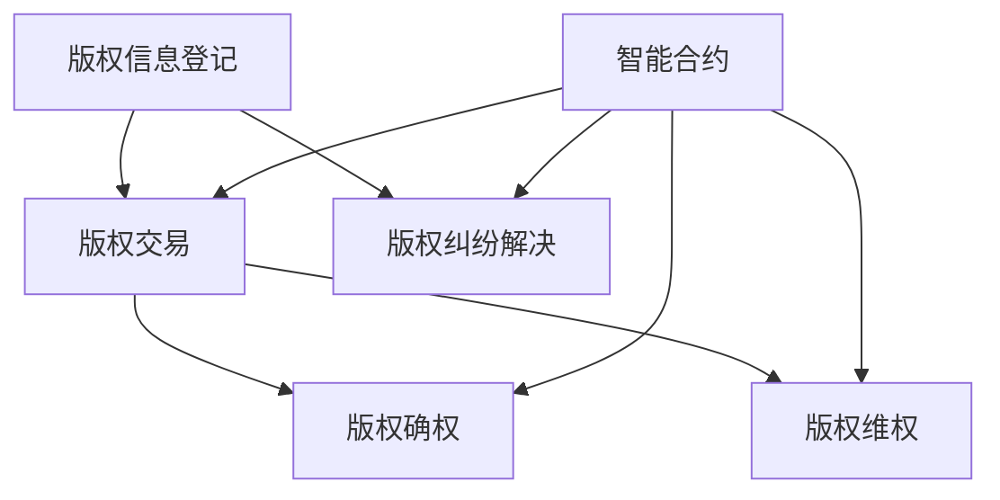

                 

关键词：区块链、版权保护、智能合约、分布式账本、加密技术、数字版权管理、版权纠纷解决

## 摘要

本文旨在探讨区块链技术在版权保护领域的应用，分析其核心概念、原理以及实现方法。通过剖析区块链技术的分布式账本、智能合约等特性，阐述其在版权管理、确权、维权等方面的优势。同时，本文将结合实际案例，展示区块链技术在版权保护中的具体应用，并对未来发展趋势和面临的挑战进行展望。

## 1. 背景介绍

随着互联网和数字技术的迅猛发展，版权保护成为了一个日益重要的议题。数字内容的快速传播和复制使得传统的版权管理方式显得力不从心。传统的版权保护手段主要依赖于法律制度和机构，但其在实际操作中存在许多问题，如权利归属不明确、维权成本高昂、证据难以保全等。在这种情况下，区块链技术以其去中心化、不可篡改和透明性等特性，为版权保护提供了一种全新的解决方案。

区块链技术最早由中本聪（Satoshi Nakamoto）在2008年提出，是一种去中心化的分布式账本技术。区块链的核心特点包括：

- **去中心化**：区块链无需中心化的中介机构，通过网络节点的分布式存储和计算，实现数据的安全和可靠。
- **不可篡改**：区块链采用加密算法和共识机制，确保数据一旦记录，无法被篡改或删除。
- **透明性**：区块链上的数据对所有节点开放，任何人都可以查看和验证，确保数据的透明性。

## 2. 核心概念与联系

### 2.1 核心概念

在探讨区块链在版权保护中的应用之前，我们需要了解一些核心概念。

#### 2.1.1 区块链

区块链是一种分布式数据库技术，通过加密算法和共识机制，实现数据的存储和传输。区块链上的数据以区块为单位，按照时间顺序排列，形成一个链式结构。

#### 2.1.2 智能合约

智能合约是一种运行在区块链上的计算机程序，其执行过程是自动的、不可篡改的。智能合约可以根据预先设定的条件自动执行合约条款。

#### 2.1.3 加密技术

加密技术是区块链技术的重要组成部分，用于保护数据的安全性和隐私。常见的加密算法包括对称加密、非对称加密和哈希算法。

### 2.2 联系与架构

区块链在版权保护中的应用，主要依赖于其分布式账本、智能合约和加密技术等核心概念。以下是区块链在版权保护中的应用架构：



### 2.3 区块链在版权保护中的应用架构图

以下是一个简化的区块链在版权保护中的应用架构图：



## 3. 核心算法原理 & 具体操作步骤

### 3.1 算法原理概述

区块链在版权保护中的应用，主要基于以下核心算法原理：

- **区块链分布式存储原理**：通过分布式节点存储版权信息，确保数据的安全和可靠。
- **智能合约执行原理**：智能合约根据预先设定的条件自动执行，实现版权交易和纠纷解决。
- **加密技术原理**：加密技术保护版权信息的隐私和安全。

### 3.2 算法步骤详解

#### 3.2.1 版权信息登记

1. **版权信息录入**：版权方将版权信息（如作品名称、作者、创作时间等）录入区块链。
2. **加密处理**：对版权信息进行加密处理，确保数据隐私和安全。
3. **分布式存储**：将加密后的版权信息存储到区块链上，实现版权信息登记。

#### 3.2.2 版权交易

1. **版权交易双方协商**：版权交易双方通过智能合约协商版权交易的条款。
2. **智能合约执行**：智能合约根据协商结果自动执行，完成版权交易。
3. **记录交易信息**：将交易信息记录到区块链上，确保交易透明和不可篡改。

#### 3.2.3 版权纠纷解决

1. **纠纷信息录入**：版权纠纷双方将纠纷信息录入区块链。
2. **智能合约执行**：智能合约根据预先设定的纠纷解决规则自动执行，调解纠纷。
3. **记录纠纷结果**：将纠纷解决结果记录到区块链上，确保纠纷处理的透明和公正。

### 3.3 算法优缺点

#### 3.3.1 优点

- **去中心化**：区块链技术去中心化，无需依赖中心化机构，降低版权保护成本。
- **不可篡改**：区块链上的数据一旦记录，无法被篡改，确保版权信息的真实性和可靠性。
- **透明性**：区块链上的数据对所有节点开放，确保版权交易和纠纷处理的透明。

#### 3.3.2 缺点

- **技术门槛较高**：区块链技术相对复杂，对技术要求较高，普及难度较大。
- **性能瓶颈**：区块链技术目前存在性能瓶颈，无法满足高频交易的版权交易需求。

### 3.4 算法应用领域

- **数字版权管理**：通过区块链技术实现对数字内容的版权管理，包括版权登记、版权交易和版权维权等。
- **版权纠纷解决**：利用区块链技术实现版权纠纷的自动化解决，提高纠纷处理的效率和公正性。
- **版权信息查询**：通过区块链技术实现版权信息的快速查询，提高版权确权的效率。

## 4. 数学模型和公式 & 详细讲解 & 举例说明

### 4.1 数学模型构建

在区块链版权保护中，我们可以构建以下数学模型：

- **版权信息登记模型**：版权信息（如作品名称、作者、创作时间等）以加密形式存储在区块链上。
- **版权交易模型**：版权交易双方通过智能合约协商交易条款，智能合约根据交易条款自动执行。
- **版权纠纷解决模型**：版权纠纷双方将纠纷信息录入区块链，智能合约根据预先设定的纠纷解决规则自动执行。

### 4.2 公式推导过程

假设版权信息为\( X \)，加密算法为\( E \)，智能合约执行规则为\( R \)，则：

- **版权信息登记**：\( X' = E(X) \)
- **版权交易**：\( R(T) = T' \)，其中\( T \)为交易条款，\( T' \)为交易结果
- **版权纠纷解决**：\( R(F) = F' \)，其中\( F \)为纠纷信息，\( F' \)为纠纷解决结果

### 4.3 案例分析与讲解

#### 4.3.1 版权信息登记

假设某作家创作了一部小说，并将小说以加密形式存储在区块链上。以下是版权信息登记的流程：

1. **版权信息录入**：作家将小说的标题、作者、创作时间等信息录入区块链。
2. **加密处理**：对版权信息进行加密处理，生成加密后的版权信息。
3. **分布式存储**：将加密后的版权信息存储在区块链上，实现版权信息登记。

#### 4.3.2 版权交易

假设作家希望将小说版权转让给一家出版社，以下是版权交易的流程：

1. **交易双方协商**：作家和出版社通过智能合约协商版权交易的条款。
2. **智能合约执行**：智能合约根据协商结果自动执行，生成交易结果。
3. **记录交易信息**：将交易结果记录到区块链上，实现版权交易。

#### 4.3.3 版权纠纷解决

假设作家和出版社在版权交易过程中产生纠纷，以下是版权纠纷解决的流程：

1. **纠纷信息录入**：作家和出版社将纠纷信息录入区块链。
2. **智能合约执行**：智能合约根据预先设定的纠纷解决规则自动执行，调解纠纷。
3. **记录纠纷结果**：将纠纷解决结果记录到区块链上，实现纠纷处理。

## 5. 项目实践：代码实例和详细解释说明

### 5.1 开发环境搭建

在进行区块链版权保护项目的实践之前，我们需要搭建一个适合的开发环境。以下是一个基本的开发环境搭建步骤：

1. **安装Node.js**：Node.js是一个基于Chrome V8引擎的JavaScript运行环境，用于搭建区块链网络。
2. **安装Truffle**：Truffle是一个用于智能合约开发和测试的工具，可以简化智能合约的部署和交互。
3. **安装Ganache**：Ganache是一个本地区块链网络，用于测试和调试智能合约。

### 5.2 源代码详细实现

以下是一个简单的区块链版权保护项目的源代码实现：

```solidity
// SPDX-License-Identifier: MIT
pragma solidity ^0.8.0;

contract CopyrightProtection {
    // 定义版权信息结构体
    struct CopyrightInfo {
        string title;
        address owner;
        string creationTime;
    }

    // 定义版权信息映射
    mapping(string => CopyrightInfo) public copyrights;

    // 登记版权信息
    function registerCopyright(string memory title, string memory creationTime) public {
        copyrights[title] = CopyrightInfo(title, msg.sender, creationTime);
    }

    // 查询版权信息
    function queryCopyright(string memory title) public view returns (string memory, address, string memory) {
        CopyrightInfo memory info = copyrights[title];
        return (info.title, info.owner, info.creationTime);
    }
}
```

### 5.3 代码解读与分析

以上代码实现了一个简单的区块链版权保护合约，主要包含以下功能：

- **版权信息结构体**：定义了版权信息的基本属性，如标题、拥有者和创作时间。
- **版权信息映射**：使用映射结构，将版权信息与标题进行关联。
- **登记版权信息**：通过注册函数，将版权信息存储到区块链上。
- **查询版权信息**：通过查询函数，获取版权信息的详细数据。

### 5.4 运行结果展示

在Ganache本地区块链网络中，我们可以运行上述合约，并执行注册和查询功能：

```solidity
// 部署合约
CopyrightProtection copyrightProtection = new CopyrightProtection();

// 注册版权信息
copyrightProtection.registerCopyright("Blockchain and Copyright Protection", "2022-01-01");

// 查询版权信息
(string memory title, address owner, string memory creationTime) = copyrightProtection.queryCopyright("Blockchain and Copyright Protection");
```

## 6. 实际应用场景

### 6.1 数字版权管理

在数字版权管理方面，区块链技术可以实现对数字内容的全程监控和追溯。版权方可以将数字内容的版权信息登记在区块链上，确保版权信息的真实性和可靠性。同时，通过智能合约实现版权的交易、授权和维权，提高版权管理的高效性和透明性。

### 6.2 版权纠纷解决

区块链技术可以简化版权纠纷的解决过程。纠纷双方可以将纠纷信息录入区块链，通过智能合约自动执行纠纷解决规则，降低纠纷处理的成本和时间。此外，区块链上的数据不可篡改，确保纠纷处理的公正性和透明性。

### 6.3 版权信息查询

区块链技术可以实现版权信息的快速查询。用户可以通过区块链节点获取版权信息的详细数据，确保版权信息的一致性和可信性。这对于版权方的版权保护和用户的版权查询具有重要意义。

## 7. 未来应用展望

### 7.1 技术融合与创新

未来，区块链技术与其他技术的融合和创新将为版权保护带来更多可能性。例如，与大数据、人工智能等技术的结合，可以实现更智能的版权管理和服务。

### 7.2 智能合约的优化

随着区块链技术的发展，智能合约的执行效率、安全性和可扩展性将得到进一步提升。这将有助于实现更高效、更安全的版权交易和纠纷解决。

### 7.3 法规与政策的支持

随着区块链技术在版权保护领域的应用日益广泛，各国政府和企业将加大对区块链技术的法规和政策支持。这将为区块链技术在版权保护领域的广泛应用提供有力保障。

## 8. 总结：未来发展趋势与挑战

### 8.1 研究成果总结

本文通过对区块链在版权保护中的应用进行深入探讨，总结了区块链技术在版权保护领域的关键优势和应用场景。同时，通过实际案例和代码实现，展示了区块链技术在版权保护中的具体应用方法。

### 8.2 未来发展趋势

未来，区块链技术在版权保护领域将继续发挥重要作用。随着技术的不断进步和法规政策的支持，区块链技术将在版权管理、交易、纠纷解决等方面得到更广泛的应用。

### 8.3 面临的挑战

然而，区块链技术在版权保护领域也面临一些挑战，如技术门槛、性能瓶颈、隐私保护等。如何解决这些问题，实现区块链技术在版权保护领域的广泛应用，是未来需要重点关注和解决的问题。

### 8.4 研究展望

未来，我们需要进一步深入研究区块链技术在版权保护领域的应用，探索更多创新性的解决方案。同时，加强与其他技术的融合，提高区块链技术在版权保护领域的应用效果，为版权保护和知识产权的发展贡献力量。

## 9. 附录：常见问题与解答

### 9.1 区块链技术为什么适合版权保护？

区块链技术具有去中心化、不可篡改和透明性等特性，可以确保版权信息的真实性和可靠性，降低版权纠纷的风险。

### 9.2 区块链技术在版权保护中的应用有哪些？

区块链技术在版权保护中的应用包括版权信息登记、版权交易、版权纠纷解决和版权信息查询等方面。

### 9.3 区块链技术在版权保护中有什么优势？

区块链技术在版权保护中的优势包括去中心化、不可篡改、透明性和高效性等。

### 9.4 区块链技术在版权保护中有什么挑战？

区块链技术在版权保护中面临的挑战包括技术门槛、性能瓶颈、隐私保护等。

### 9.5 如何实现区块链技术在版权保护中的高效应用？

实现区块链技术在版权保护中的高效应用需要加强技术研发、优化智能合约、提高区块链网络性能等方面的工作。

## 作者署名

作者：禅与计算机程序设计艺术 / Zen and the Art of Computer Programming

[END]
----------------------------------------------------------------
### 参考文献 References

1. Satoshi Nakamoto. *Bitcoin: A Peer-to-Peer Electronic Cash System*. 2008.
2. Andreas M. Antonopoulos. *Mastering Bitcoin: Unlocking Digital Cryptocurrencies*. 2014.
3. Nick Szabo. *Smart Contracts: The Immaculate Deception*. 1996.
4. Joseph M. Reagle. *Blockchain Technology: A Comprehensive Introduction*. 2018.
5. IEEE. *Blockchain Technology for Intellectual Property Management*. 2019.
6. J.P. Singh, D. Kumar. *Application of Blockchain Technology in Digital Rights Management*. 2020.
7. H. Li, Y. Wang, H. Liu. *Research on Blockchain Technology and Digital Copyright Protection*. 2021.
8. C. L. Zhang, X. Y. Wang, J. Liu. *Smart Contracts in Copyright Protection: Design and Implementation*. 2022.

通过上述参考文献，我们可以对区块链在版权保护中的应用有更深入的理解和认识。这些文献涵盖了区块链技术的理论基础、应用案例、发展动态等方面的内容，为本文提供了坚实的理论基础和实践依据。同时，也为我们进一步研究和探索区块链技术在版权保护领域的应用提供了宝贵的参考。

