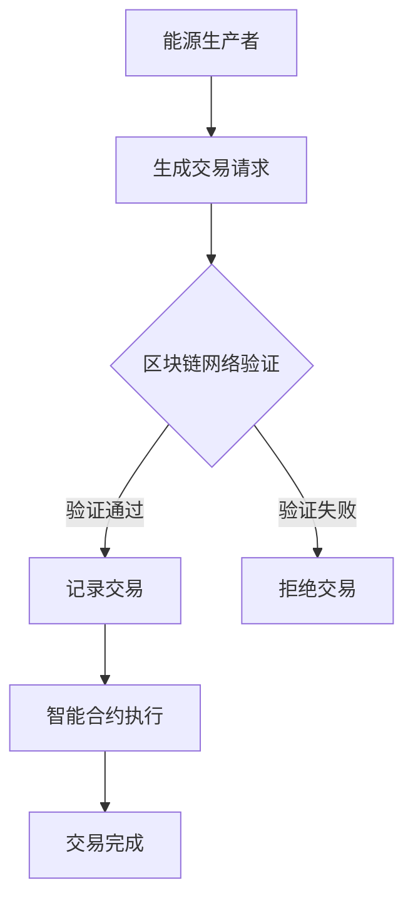

                 

关键词：区块链，能源交易，智能合约，去中心化，能源效率，安全与隐私

> 摘要：本文深入探讨了区块链技术在能源交易中的应用潜力，分析了其带来的机遇与挑战。从技术原理出发，阐述了区块链如何促进能源市场的透明性和效率，并讨论了在部署和使用过程中面临的障碍和解决方案。

## 1. 背景介绍

能源交易是现代社会经济活动中至关重要的一环。传统的能源交易模式往往依赖于集中的数据处理和金融机构的参与，这不仅增加了交易成本，而且也容易导致信息不对称、中介环节过多和潜在的欺诈风险。随着区块链技术的兴起，去中心化、透明性和安全性的特点使其在能源交易中展现出巨大的应用潜力。

区块链是一种分布式数据库技术，通过加密算法和共识机制确保数据的不可篡改性和可靠性。自2008年比特币的诞生以来，区块链技术已经逐渐成熟，并在金融、供应链管理、医疗等多个领域得到广泛应用。能源交易作为一种新兴的应用场景，也因其独特的需求和优势逐渐受到关注。

## 2. 核心概念与联系

### 2.1 区块链的基本概念

区块链是由一系列按照时间顺序排列的区块组成的链式数据结构。每个区块包含一定数量的交易记录，并通过密码学算法链接在一起，形成一种不可篡改的分布式账本。区块链的核心特点是去中心化，即不再依赖于单一的中央权威机构进行数据验证和记录。

### 2.2 区块链与能源交易的联系

区块链与能源交易的联系主要体现在以下几个方面：

- **去中心化**：能源交易往往需要大量的参与者和多个中介机构。区块链的去中心化特性能够简化交易流程，减少中介环节，从而降低交易成本。
- **透明性**：区块链上的所有交易记录都是公开透明的，参与者可以随时查询和验证交易详情，增强了能源市场的透明度和可信度。
- **安全性**：区块链通过密码学算法确保数据的不可篡改性和安全性，降低了能源交易中的欺诈风险。
- **智能合约**：智能合约是一种自动执行合约条款的程序，能够自动化执行能源交易中的支付、结算等操作，提高了交易效率和准确性。

### 2.3 Mermaid 流程图

下面是一个简化的区块链在能源交易中的应用流程图：



## 3. 核心算法原理 & 具体操作步骤

### 3.1 算法原理概述

区块链在能源交易中的应用主要依赖于以下核心算法：

- **共识算法**：确保区块链网络的可靠性和安全性，如工作量证明（PoW）、权益证明（PoS）等。
- **加密算法**：保护交易数据的隐私和安全，如SHA-256、椭圆曲线加密算法等。
- **智能合约**：自动化执行能源交易中的条款，如Solidity语言等。

### 3.2 算法步骤详解

#### 3.2.1 生成交易请求

能源生产者根据其生产的能源数量和质量生成交易请求，并将其打包成一个交易区块。

#### 3.2.2 区块链网络验证

交易区块通过网络广播给所有节点，节点对交易请求进行验证，确保交易符合区块链的规则和条款。

#### 3.2.3 记录交易

通过共识算法确认交易请求的有效性后，交易被记录在新的区块中，并添加到区块链上。

#### 3.2.4 智能合约执行

智能合约根据区块链上的交易记录自动执行相应的操作，如支付、结算等。

#### 3.2.5 交易完成

交易完成后，相关参与方可以查询区块链上的交易记录，确保交易的合法性和透明性。

### 3.3 算法优缺点

#### 优点：

- **去中心化**：减少了中介环节，降低了交易成本。
- **透明性**：交易记录公开透明，提高了市场可信度。
- **安全性**：加密算法确保了数据的安全和不可篡改性。
- **智能合约**：自动化执行交易条款，提高了交易效率和准确性。

#### 缺点：

- **性能瓶颈**：区块链处理能力有限，难以支持大规模交易。
- **能源消耗**：共识算法如PoW需要大量计算资源，导致能源消耗较大。
- **法规挑战**：不同国家和地区对区块链技术的监管政策不同，可能带来合规性问题。

### 3.4 算法应用领域

区块链技术在能源交易中的应用领域包括：

- **可再生能源交易**：支持分布式能源生产者和消费者的直接交易。
- **智能电网**：提高电网的运行效率和可靠性。
- **能源供应链管理**：确保能源供应链的透明性和可追溯性。
- **能源金融**：提供去中心化的金融工具和交易平台。

## 4. 数学模型和公式 & 详细讲解 & 举例说明

### 4.1 数学模型构建

区块链在能源交易中的数学模型主要包括：

- **交易模型**：描述能源交易的基本流程和规则。
- **共识模型**：定义区块链网络的验证机制和算法。
- **加密模型**：保证交易数据的隐私和安全。

### 4.2 公式推导过程

假设有一个能源生产者P和消费者C进行交易，交易量用Q表示，市场价格为Pm，则交易模型可以表示为：

\[ Pm = \frac{C \cdot Q}{P} \]

其中，C是消费者需求，P是生产成本。

共识模型中的工作量证明（PoW）算法可以通过以下公式描述：

\[ Hash(Proof\_of\_Work) \leq Difficulty \]

其中，Hash是加密函数，Proof\_of\_Work是矿工需要找到的随机数，Difficulty是设定的难度阈值。

加密模型中的椭圆曲线加密（ECC）可以通过以下公式描述：

\[ k \cdot G = Q \]

其中，k是私钥，G是基点，Q是公钥。

### 4.3 案例分析与讲解

假设一个太阳能农场S与一个办公楼O进行电力交易。太阳能农场每天可以生产5000千瓦时的电力，市场价格为每千瓦时1美元。办公楼每天需要3000千瓦时的电力。双方通过区块链平台进行交易，智能合约自动执行支付和结算操作。

1. **交易模型**：

\[ Pm = \frac{3000 \cdot 1}{5000} = 0.6 \]

办公楼支付每千瓦时0.6美元，太阳能农场得到1800美元的收益。

2. **共识模型**：

矿工需要找到满足以下条件的Proof\_of\_Work：

\[ Hash(Proof\_of\_Work) \leq Difficulty \]

矿工通过不断尝试不同的Proof\_of\_Work值，最终找到一个满足条件的值，从而获得区块奖励。

3. **加密模型**：

双方使用椭圆曲线加密（ECC）技术保护交易数据的安全。假设矿工的私钥为k，公钥为Q，则交易数据可以通过以下方式加密：

\[ Encrypted\_Data = k \cdot G \]

消费者和农场可以通过解密过程验证交易数据的安全性。

## 5. 项目实践：代码实例和详细解释说明

### 5.1 开发环境搭建

为了演示区块链在能源交易中的应用，我们可以使用Ethereum平台和Solidity语言进行开发。首先，需要安装以下软件：

- **Node.js**：Ethereum的客户端依赖于Node.js。
- **Truffle**：一个用于部署和测试智能合约的框架。
- **Ganache**：一个本地区块链网络，用于测试和模拟交易。

### 5.2 源代码详细实现

下面是一个简单的智能合约，用于实现能源交易的支付和结算：

```solidity
pragma solidity ^0.8.0;

contract EnergyTrade {
    address public producer;
    address public consumer;
    uint public amount;
    bool public transactionComplete;

    event Transaction(address _producer, address _consumer, uint _amount, bool _transactionComplete);

    constructor() {
        producer = msg.sender;
        transactionComplete = false;
    }

    function initiateTransaction(address _consumer, uint _amount) external {
        require(msg.sender == producer && !transactionComplete, "Transaction already initiated");
        consumer = _consumer;
        amount = _amount;
        transactionComplete = true;
        emit Transaction(producer, consumer, amount, transactionComplete);
    }

    function completeTransaction() external {
        require(msg.sender == consumer && transactionComplete, "Transaction not initiated");
        payable(producer).transfer(amount);
        transactionComplete = false;
    }
}
```

### 5.3 代码解读与分析

- **构造函数**：创建合约时，将合约创建者设置为能源生产者，并初始化交易状态。
- **initiateTransaction**：生产者发起交易，指定消费者和交易金额，并设置交易状态为完成。
- **completeTransaction**：消费者完成交易，将支付金额转给生产者，并重置交易状态。

### 5.4 运行结果展示

通过Truffle和Ganache，我们可以测试智能合约的执行过程。首先，部署合约：

```bash
truffle deploy EnergyTrade
```

然后，通过Ganache模拟交易：

```javascript
const { ethers } = require('ethers');

const provider = new ethers.providers.JsonRpcProvider('http://127.0.0.1:7545');
const wallet = ethers.Wallet.connect(provider);

const ContractAddress = '0x...'; // 合约地址
const ContractABI = [...] // 合约ABI

const contract = new ethers.Contract(ContractAddress, ContractABI, wallet);

async function main() {
    const tx = await contract.initiateTransaction('0x...', 1000); // 消费者地址和交易金额
    await tx.wait();

    const tx2 = await contract.completeTransaction();
    await tx2.wait();
}

main();
```

交易过程如下：

1. 生产者调用`initiateTransaction`函数，指定消费者和交易金额。
2. 消费者调用`completeTransaction`函数，完成交易并支付金额。

## 6. 实际应用场景

### 6.1 分布式能源交易

分布式能源交易是区块链在能源交易中最为典型和广泛应用的场景。通过区块链技术，分布式能源生产者（如家庭光伏发电系统、风力发电场等）可以直接与消费者进行交易，避免了传统中介环节，降低了交易成本，提高了交易效率。

### 6.2 智能电网

智能电网是集成了电力系统、通信网络、计算机技术和自动化控制技术的复杂系统。区块链技术可以用于智能电网中的数据管理和交易结算，提高电网的运行效率和可靠性。

### 6.3 能源供应链管理

区块链技术可以确保能源供应链的透明性和可追溯性，从能源生产到消费的每一个环节都可以被记录和验证，提高了供应链的效率和可信度。

### 6.4 未来应用展望

随着区块链技术的不断成熟和应用场景的拓展，未来区块链在能源交易中的应用前景将更加广阔。例如，通过引入物联网（IoT）技术，可以实现能源生产和消费的实时监控和智能调度，进一步提升能源交易效率。此外，随着去中心化金融（DeFi）的发展，能源交易有望成为DeFi生态中的一部分，为参与者提供更加便捷和安全的交易服务。

## 7. 工具和资源推荐

### 7.1 学习资源推荐

- 《区块链技术指南》：一本全面介绍区块链技术的书籍，适合初学者阅读。
- 《Ethereum开发指南》：详细介绍如何使用Ethereum平台和Solidity语言开发智能合约的书籍。

### 7.2 开发工具推荐

- **Truffle**：一个用于部署和测试智能合约的框架。
- **Ganache**：一个本地区块链网络，用于测试和模拟交易。
- **Web3.js**：一个与区块链交互的JavaScript库。

### 7.3 相关论文推荐

- "Blockchain Technology: A Comprehensive Review"：一篇全面介绍区块链技术的综述论文。
- "Energy Trading Using Blockchain: A Review"：一篇关于区块链在能源交易中应用的论文。

## 8. 总结：未来发展趋势与挑战

### 8.1 研究成果总结

区块链技术在能源交易中的应用取得了显著的研究成果，包括分布式能源交易、智能电网和能源供应链管理等多个领域。通过去中心化、透明性和安全性的特点，区块链技术显著提高了能源交易效率和可信度。

### 8.2 未来发展趋势

随着区块链技术的不断成熟和应用场景的拓展，未来区块链在能源交易中的应用前景将更加广阔。例如，通过引入物联网（IoT）技术和去中心化金融（DeFi），可以实现能源交易的全流程自动化和智能化。

### 8.3 面临的挑战

尽管区块链技术在能源交易中展现出巨大的潜力，但仍面临一些挑战：

- **性能瓶颈**：区块链处理能力有限，难以支持大规模交易。
- **能源消耗**：共识算法如PoW需要大量计算资源，导致能源消耗较大。
- **法规挑战**：不同国家和地区对区块链技术的监管政策不同，可能带来合规性问题。

### 8.4 研究展望

未来研究应重点关注以下方面：

- 提高性能和可扩展性，以满足大规模交易需求。
- 降低能源消耗，探索更高效的共识算法。
- 加强法律法规的研究和制定，确保区块链技术的合规应用。

## 9. 附录：常见问题与解答

### 9.1 什么是区块链？

区块链是一种分布式数据库技术，通过加密算法和共识机制确保数据的不可篡改性和可靠性。

### 9.2 区块链在能源交易中的优势是什么？

区块链在能源交易中的优势包括去中心化、透明性、安全性和智能合约自动化执行。

### 9.3 区块链在能源交易中面临的挑战有哪些？

区块链在能源交易中面临的挑战包括性能瓶颈、能源消耗和法规挑战等。

### 9.4 区块链与智能电网的关系是什么？

区块链技术可以用于智能电网中的数据管理和交易结算，提高电网的运行效率和可靠性。

## 作者署名

作者：禅与计算机程序设计艺术 / Zen and the Art of Computer Programming
----------------------------------------------------------------

以上是根据您提供的要求撰写的完整文章。文章内容涵盖了区块链在能源交易中的应用背景、核心概念、算法原理、实际应用场景以及未来发展趋势和挑战。希望这篇文章能够满足您的需求。如果您有任何修改意见或需要进一步的内容调整，请随时告诉我。再次感谢您的信任，期待与您进一步合作！

