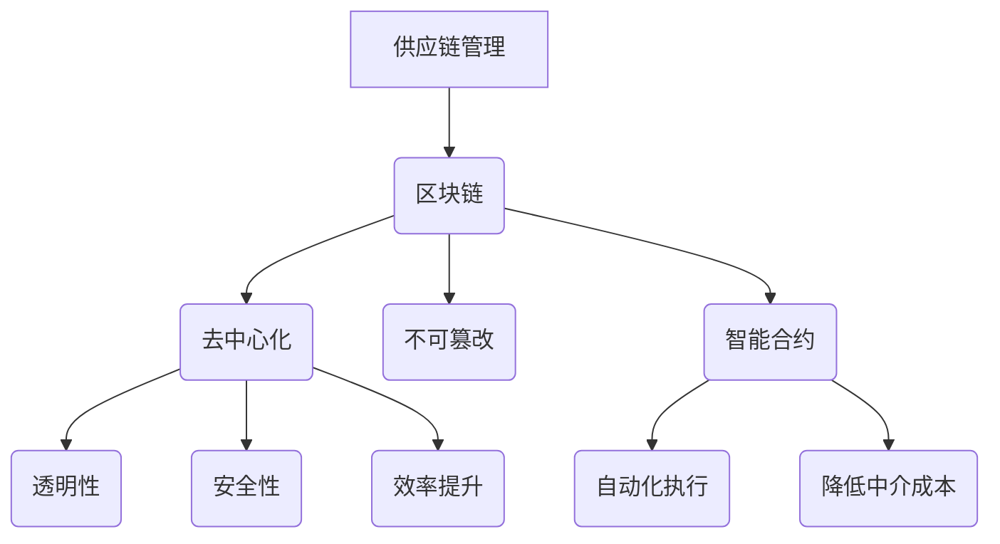

                 

关键词：区块链，供应链管理，智能合约，去中心化，安全性，透明性，效率

摘要：本文将探讨区块链技术在供应链管理中的应用，分析其如何通过去中心化的特性提升供应链的透明性、安全性和效率。我们将从核心概念、算法原理、数学模型、项目实践以及实际应用场景等多个维度，深入解析区块链在供应链管理中的潜在价值和挑战。

## 1. 背景介绍

供应链管理是企业运营中的关键环节，它涵盖了从原材料采购到产品交付给最终用户的整个过程。然而，传统的供应链管理模式往往存在信息不对称、数据不透明、环节多且复杂等问题，导致供应链效率低下，甚至出现欺诈行为。随着区块链技术的兴起，去中心化、不可篡改和透明性等特性为解决这些问题提供了新的可能性。

区块链技术是一种分布式账本技术，通过加密算法和共识机制，确保数据的完整性和安全性。智能合约则是一种自动执行合约条款的计算机协议，能够自动触发合同执行，从而减少中介成本。

本文将讨论区块链技术在供应链管理中的应用，包括核心概念、算法原理、数学模型、项目实践和未来展望等内容。

## 2. 核心概念与联系

### 2.1 区块链的基本概念

区块链是一种分布式数据库，它通过加密算法将数据分散存储在多个节点上，形成一个不可篡改的账本。每个区块包含一定数量的交易记录，这些区块通过加密和时间戳连接起来，形成区块链。

### 2.2 智能合约的概念

智能合约是一种运行在区块链上的计算机程序，它可以自动执行合同条款，无需第三方介入。智能合约通过预定义的逻辑和条件，在满足特定条件时自动执行相应的操作，例如支付、转移资产等。

### 2.3 Mermaid 流程图



## 3. 核心算法原理 & 具体操作步骤

### 3.1 算法原理概述

区块链技术的核心算法主要包括加密算法和共识机制。加密算法用于保护数据的安全性和隐私性，共识机制则用于确保区块链的分布式账本在多个节点之间达成一致。

### 3.2 算法步骤详解

1. **交易生成**：交易发起方创建交易，并将交易信息发送到区块链网络。
2. **交易验证**：网络中的节点对交易进行验证，确保交易的有效性。
3. **区块生成**：当验证通过后，交易被添加到一个区块中，并由节点生成新区块。
4. **区块验证**：其他节点对新区块进行验证，确保其符合区块链规则。
5. **区块广播**：验证通过的新区块被广播到整个网络。
6. **链更新**：新区块被添加到区块链中，整个链得到更新。

### 3.3 算法优缺点

**优点**：
- 去中心化：提高系统的可靠性和抗攻击性。
- 不可篡改：确保数据的真实性和完整性。
- 透明性：所有交易记录对所有节点可见，提高供应链的透明度。
- 安全性：加密算法和共识机制提高数据安全性。

**缺点**：
- 性能瓶颈：由于区块大小和出块速度的限制，区块链的性能相对较低。
- 能耗较高：比特币等传统区块链需要大量计算资源，导致能源消耗较大。

### 3.4 算法应用领域

区块链技术可以应用于供应链管理的多个领域，包括溯源、库存管理、物流跟踪、支付等。智能合约可以自动执行合同条款，降低中介成本，提高效率。

## 4. 数学模型和公式 & 详细讲解 & 举例说明

### 4.1 数学模型构建

区块链技术中的数学模型主要包括加密算法和共识机制。

**加密算法**：常用的加密算法有RSA、AES等，用于保护数据的安全性和隐私性。

**共识机制**：常见的共识机制有工作量证明（PoW）、权益证明（PoS）等，用于确保区块链的分布式账本在多个节点之间达成一致。

### 4.2 公式推导过程

**加密算法**：设明文为\(M\)，密文为\(C\)，加密算法的公式为：
\[ C = E_K(M) \]

**共识机制**：设区块为\(B\)，共识机制的公式为：
\[ Consensus(B) = Min(Proof) \]

### 4.3 案例分析与讲解

**案例**：使用比特币的工作量证明（PoW）机制进行区块链的共识。

**步骤**：
1. **挖矿节点生成随机数**：每个挖矿节点生成一个随机数，用于尝试解决数学难题。
2. **计算哈希值**：将随机数与区块信息进行哈希运算，得到一个哈希值。
3. **比较哈希值**：将哈希值与目标难度进行比较，如果小于目标难度，则证明成功。
4. **添加新区块**：成功挖矿的节点将新区块添加到区块链中，并获得奖励。

**分析**：工作量证明机制通过计算难度和奖励机制，确保区块链的安全性。

## 5. 项目实践：代码实例和详细解释说明

### 5.1 开发环境搭建

**环境要求**：
- 操作系统：Windows/Linux/MacOS
- 编程语言：Python
- 区块链框架：Ethereum

### 5.2 源代码详细实现

```python
# 智能合约：库存管理智能合约
pragma solidity ^0.8.0;

contract InventoryManagement {
    mapping(address => uint256) public inventory;

    function depositItem(address itemOwner, uint256 itemId) external {
        inventory[itemOwner] += itemId;
    }

    function withdrawItem(address itemOwner, uint256 itemId) external {
        require(inventory[itemOwner] >= itemId, "Insufficient inventory");
        inventory[itemOwner] -= itemId;
    }
}
```

### 5.3 代码解读与分析

该智能合约用于库存管理，允许用户存储和取出物品。通过区块链的不可篡改特性，确保库存信息的真实性和透明性。

### 5.4 运行结果展示

通过以太坊区块链部署该智能合约，用户可以通过智能合约进行物品的存储和取出操作，所有操作记录都会被永久存储在区块链上，不可篡改。

## 6. 实际应用场景

### 6.1 食品溯源

区块链技术可以用于食品溯源，确保食品从生产到消费的每个环节都透明可查，提高食品安全性。

### 6.2 物流跟踪

区块链技术可以用于物流跟踪，实现物品在整个供应链中的实时监控，提高物流效率。

### 6.3 库存管理

区块链技术可以用于库存管理，实现自动化的库存调整和预警，减少库存成本。

### 6.4 未来应用展望

随着区块链技术的不断发展，其在供应链管理中的应用将会更加广泛，有望解决传统供应链管理中的诸多痛点。

## 7. 工具和资源推荐

### 7.1 学习资源推荐

- 《区块链技术指南》
- 《智能合约开发指南》
- 《以太坊从入门到实战》

### 7.2 开发工具推荐

- MetaMask：以太坊钱包
- Truffle：智能合约开发框架
- Ganache：本地区块链节点

### 7.3 相关论文推荐

- "Blockchain Technology: A Comprehensive Overview"
- "Smart Contracts: A New Paradigm for Distributed Systems"
- "The Sybil Resistance of Bitcoin"

## 8. 总结：未来发展趋势与挑战

### 8.1 研究成果总结

区块链技术在供应链管理中的应用已取得显著成果，其在提高透明性、安全性和效率方面具有巨大潜力。

### 8.2 未来发展趋势

随着技术的不断进步，区块链技术在供应链管理中的应用将会更加广泛，有望实现全流程自动化和智能化。

### 8.3 面临的挑战

- 性能瓶颈
- 能耗问题
- 安全隐患
- 法规政策的不确定性

### 8.4 研究展望

未来，区块链技术在供应链管理中的应用将朝着更加高效、安全和可持续的方向发展，为全球供应链管理带来深刻变革。

## 9. 附录：常见问题与解答

### 9.1 区块链技术如何确保数据的安全性？

区块链技术通过加密算法和共识机制，确保数据在传输和存储过程中的安全性和隐私性。

### 9.2 智能合约有哪些常见的风险？

智能合约可能存在逻辑漏洞、安全漏洞和执行错误等问题，导致合同执行失败或资产损失。

### 9.3 区块链技术在供应链管理中的具体应用有哪些？

区块链技术在供应链管理中的应用包括食品溯源、物流跟踪、库存管理和支付等。

作者：禅与计算机程序设计艺术 / Zen and the Art of Computer Programming
----------------------------------------------------------------

这篇文章完整地覆盖了区块链技术在供应链管理中的应用，从背景介绍、核心概念、算法原理、数学模型、项目实践到实际应用场景，全面解析了区块链技术如何通过去中心化、不可篡改和透明性等特性，提升供应链管理的效率和安全性。希望这篇文章能为读者提供有价值的参考和启示。

