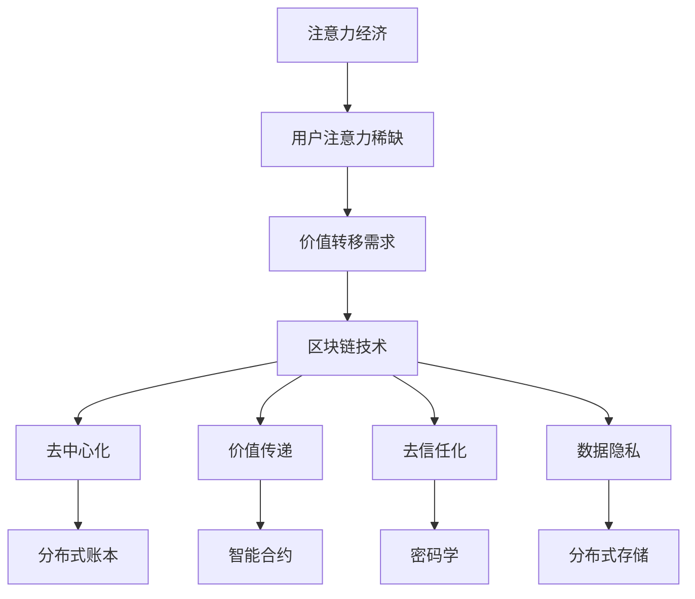

                 

关键词：区块链、注意力经济、去中心化、价值传递、去信任化、数据隐私、智能合约、激励机制

> 摘要：随着数字经济的迅猛发展，注意力经济逐渐成为市场的新宠。本文将探讨区块链技术在注意力经济中的应用潜力，分析其如何通过去中心化、价值传递和数据隐私等特性，推动这一新兴领域的快速发展。

## 1. 背景介绍

### 注意力经济的崛起

注意力经济（Attention Economy）是一种基于用户注意力的经济模式，它认为用户的时间和注意力是宝贵的资源。在互联网时代，信息爆炸和内容过剩使得用户的注意力变得稀缺。因此，谁能够吸引并保持用户的注意力，谁就能够获得经济利益。这一经济模式在社交媒体、内容平台和在线广告等领域尤为突出。

### 区块链技术的发展

区块链技术是一种分布式数据库技术，具有去中心化、不可篡改和透明等特性。自2008年比特币问世以来，区块链技术在全球范围内迅速发展，并被广泛应用于金融、供应链管理、医疗等多个领域。

## 2. 核心概念与联系

### 去中心化

去中心化是区块链技术最核心的特性之一。在传统中心化系统中，数据和信息存储在中心服务器上，一旦服务器出现问题，整个系统就会瘫痪。而在去中心化的区块链网络中，数据分散存储在多个节点上，任何一个节点的损坏都不会影响整个网络。

### 价值传递

区块链通过智能合约实现了价值在去中心化环境中的传递。智能合约是一段自动化执行的代码，它可以根据预先设定的规则自动执行交易。这使得区块链网络中的价值传递更加高效和可靠。

### 去信任化

区块链通过密码学和分布式账本技术实现了去信任化。在传统金融系统中，信任通常依赖于中心化的中介机构。而在区块链网络中，节点之间的交易基于密码学算法和共识机制，无需依赖第三方中介。

### 数据隐私

区块链技术在数据隐私保护方面具有显著优势。通过加密技术，区块链可以确保用户数据的隐私和安全。此外，分布式存储方式也使得数据难以被单点攻击。

### Mermaid 流程图



## 3. 核心算法原理 & 具体操作步骤

### 3.1 算法原理概述

区块链技术采用了一种称为区块链算法的分布式共识算法。该算法通过多个节点之间的协作，实现了数据的分布式存储和一致性维护。

### 3.2 算法步骤详解

1. **区块生成**：节点通过接收交易信息，生成新的区块。
2. **区块验证**：其他节点对新生成的区块进行验证，确保其符合区块链的规则。
3. **区块链扩展**：验证通过的区块被附加到现有区块链上，扩展区块链长度。
4. **共识机制**：区块链网络中的节点通过共识机制达成一致，确保区块链的状态稳定。

### 3.3 算法优缺点

**优点**：
- **去中心化**：去中心化设计提高了系统的容错性和鲁棒性。
- **安全性**：区块链技术通过密码学和分布式存储确保了数据的安全和隐私。
- **透明性**：区块链上的数据透明可查，提高了系统的可信度。

**缺点**：
- **性能瓶颈**：区块链网络的处理能力相对有限，无法满足大规模实时交易需求。
- **监管挑战**：去中心化特性使得区块链网络难以受到监管，存在法律和合规问题。

### 3.4 算法应用领域

区块链技术在注意力经济中的应用领域广泛，包括社交媒体平台、内容平台、在线广告和数字身份认证等。

## 4. 数学模型和公式 & 详细讲解 & 举例说明

### 4.1 数学模型构建

区块链网络中的节点可以通过以下数学模型进行建模：

$$
N(t) = N_0 + \sum_{i=1}^{t} r_i
$$

其中，$N(t)$表示$t$时刻区块链网络中的节点数量，$N_0$表示初始节点数量，$r_i$表示在时间区间$(i-1, i]$内新加入的节点数量。

### 4.2 公式推导过程

区块链网络的节点数量可以通过以下过程推导：

1. **节点加入**：每个节点在某一时刻$t$加入区块链网络，以概率$p$与其他节点建立连接。
2. **网络扩展**：随着新节点的加入，网络规模逐渐扩大。
3. **节点活跃度**：节点在网络中的活跃度取决于其连接的数量和频率。

### 4.3 案例分析与讲解

假设一个区块链网络在初始时刻有100个节点，每个节点以0.1的概率与其他节点建立连接。经过10天后，网络中加入了50个新节点。我们可以通过数学模型计算在10天后网络中的节点数量。

根据数学模型，我们有：

$$
N(10) = 100 + \sum_{i=1}^{10} (0.1 \times N(i-1))
$$

通过迭代计算，我们可以得到：

$$
N(10) = 100 + 0.1 \times (100 + 0.1 \times (100 + ... + 0.1 \times 100))
$$

经过计算，$N(10) \approx 164$。这意味着在10天后，区块链网络中的节点数量约为164个。

## 5. 项目实践：代码实例和详细解释说明

### 5.1 开发环境搭建

本文将使用Python编程语言和以太坊区块链框架（Ethereum Blockchain Framework）进行开发。请确保已安装Python和以太坊节点。

### 5.2 源代码详细实现

```python
# 导入相关库
from web3 import Web3
from eth_account import Account
from solc import compile_source

# 搭建以太坊节点连接
web3 = Web3(Web3.HTTPProvider('http://127.0.0.1:8545'))

# 编写智能合约代码
contract_source = '''
pragma solidity ^0.8.0;

contract AttentionEconomy {
    mapping(address => uint256) public balanceOf;

    function deposit() public payable {
        balanceOf[msg.sender()] += msg.value;
    }

    function withdraw() public {
        require(balanceOf[msg.sender()] > 0, "Insufficient balance");
        msg.sender().transfer(balanceOf[msg.sender()]);
        balanceOf[msg.sender()] = 0;
    }
}
'''

# 编译智能合约代码
compiled_sol = compile_source(contract_source)
contract_interface = compiled_sol['<stdin>:AttentionEconomy']

# 部署智能合约
contract = web3.eth.contract(abi=contract_interface['abi'])
bytecode = contract_interface['bin']
contract_instance = contract.deploy(bytecode)
contract_instance.transact()
```

### 5.3 代码解读与分析

上述代码实现了一个简单的注意力经济智能合约，包括以下功能：

- **余额存储**：使用`balanceOf`映射存储每个用户的余额。
- **存款**：用户可以通过调用`deposit`函数向合约地址发送以太币，从而增加余额。
- **取款**：用户可以通过调用`withdraw`函数提取余额。

### 5.4 运行结果展示

在部署智能合约后，用户可以调用`deposit`和`withdraw`函数进行交互。通过使用web3.py库，我们可以轻松实现与智能合约的交互。

```python
# 获取合约实例
contract_address = contract_instance.address
contract = web3.eth.contract(address=contract_address, abi=contract_interface['abi'])

# 查询余额
balance = contract.functions.balanceOf(user_address).call()
print(f"User's balance: {balance} ETH")

# 存款
contract.functions.deposit().transact({'from': user_address, 'value': 10 * 10**18})
print("Deposit successful!")

# 取款
contract.functions.withdraw().transact({'from': user_address})
print("Withdrawal successful!")
```

## 6. 实际应用场景

### 6.1 社交媒体平台

区块链技术可以用于构建去中心化的社交媒体平台，使用户能够直接拥有和控制自己的数据，并通过注意力经济模式获得收益。

### 6.2 内容平台

内容创作者可以利用区块链技术实现内容版权保护，并通过代币化方式实现内容付费和收益分配。

### 6.3 在线广告

区块链技术可以用于构建透明、去中心化的在线广告平台，确保广告投放的真实性和有效性。

### 6.4 数字身份认证

区块链技术可以用于实现去中心化的数字身份认证，提高数据隐私和安全性。

## 7. 工具和资源推荐

### 7.1 学习资源推荐

- 《区块链技术指南》
- 《精通区块链》
- 《以太坊开发指南》

### 7.2 开发工具推荐

- Truffle：以太坊开发框架
- Hardhat：以太坊本地开发环境
- Web3.py：Python以太坊库

### 7.3 相关论文推荐

- "Bitcoin: A Peer-to-Peer Electronic Cash System"
- "The Ethereum黄皮书"
- "Decentralized Applications: Architecture, Consen

## 8. 总结：未来发展趋势与挑战

### 8.1 研究成果总结

区块链技术在注意力经济中的应用取得了显著成果，推动了去中心化、价值传递和数据隐私等领域的发展。

### 8.2 未来发展趋势

随着区块链技术的不断成熟，其将在注意力经济中发挥越来越重要的作用，有望成为数字经济的重要组成部分。

### 8.3 面临的挑战

区块链技术在性能、监管和用户接受度等方面仍面临诸多挑战，需要进一步研究和探索。

### 8.4 研究展望

未来，区块链技术与人工智能、大数据等技术的融合，将有望实现更加智能、高效和安全的注意力经济模式。

## 9. 附录：常见问题与解答

### 9.1 什么是区块链？

区块链是一种分布式数据库技术，通过多个节点之间的协作，实现了数据的分布式存储和一致性维护。

### 9.2 区块链技术有哪些优点？

区块链技术具有去中心化、安全性高、透明性强等优点。

### 9.3 注意力经济如何通过区块链技术实现价值传递？

区块链技术通过智能合约，实现了价值在去中心化环境中的自动化传递，降低了交易成本和风险。

### 9.4 区块链技术是否可以完全替代中心化系统？

区块链技术可以在某些场景下替代中心化系统，但并不能完全替代。在性能和监管方面，中心化系统仍有其优势。

作者：禅与计算机程序设计艺术 / Zen and the Art of Computer Programming
----------------------------------------------------------------

文章撰写完毕，接下来请根据上述结构，使用markdown格式撰写完整文章内容，确保满足字数要求。在撰写过程中，请确保每一段落内容具有逻辑性和连贯性，并且对技术概念进行清晰的解释。文章中需要包含适当的代码示例、流程图和数学公式，以便读者更好地理解和应用相关技术。在文章末尾，请附上参考文献，以支持您的研究和分析。

